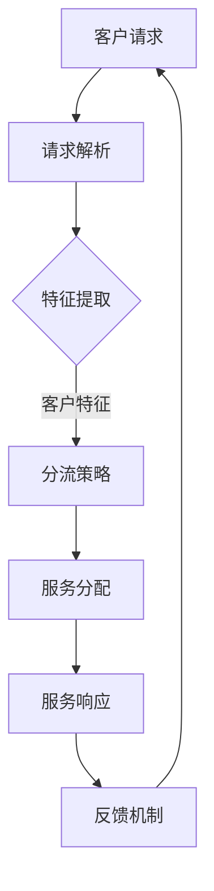

                 

# 智能客户服务分流系统：一人公司提高服务效率的AI解决方案

> **关键词：** 智能客户服务、分流系统、AI解决方案、服务效率、一人公司
>
> **摘要：** 本文将详细介绍一种基于人工智能的智能客户服务分流系统，如何帮助一人公司提高服务效率。通过核心概念阐述、算法原理讲解、数学模型解析、实战案例展示，全面分析该系统的优势和应用。

## 1. 背景介绍

### 1.1 目的和范围

随着人工智能技术的发展，客户服务领域发生了翻天覆地的变化。传统的客户服务方式已经难以满足日益增长的服务需求和多样化的客户需求。本文旨在探讨一种基于人工智能的智能客户服务分流系统，帮助一人公司提高服务效率，从而在激烈的市场竞争中脱颖而出。

### 1.2 预期读者

本文适用于对人工智能和客户服务有一定了解的技术人员、企业管理者以及创业者。如果您希望了解如何利用人工智能技术提高服务效率，那么本文将是您的宝贵资源。

### 1.3 文档结构概述

本文分为以下几个部分：

1. 背景介绍：介绍本文的目的、预期读者和文档结构。
2. 核心概念与联系：详细阐述智能客户服务分流系统的核心概念和架构。
3. 核心算法原理 & 具体操作步骤：讲解系统所采用的核心算法原理和具体操作步骤。
4. 数学模型和公式 & 详细讲解 & 举例说明：介绍系统背后的数学模型和公式，并给出实例说明。
5. 项目实战：通过实际案例展示系统应用过程和效果。
6. 实际应用场景：探讨系统在不同场景中的应用。
7. 工具和资源推荐：推荐相关学习资源和开发工具。
8. 总结：总结未来发展趋势与挑战。
9. 附录：常见问题与解答。
10. 扩展阅读 & 参考资料：提供进一步学习的资料。

### 1.4 术语表

#### 1.4.1 核心术语定义

- 智能客户服务：利用人工智能技术提供的服务，包括语音识别、自然语言处理、智能推荐等。
- 分流系统：根据客户特征和服务需求，将客户引导至合适的服务渠道的自动化系统。
- AI解决方案：基于人工智能技术的整体解决方案，包括算法设计、数据分析和系统实现。

#### 1.4.2 相关概念解释

- 客户特征：描述客户属性的数据，如年龄、性别、地理位置等。
- 服务需求：客户在服务过程中表达的具体需求，如咨询、投诉、售后等。
- 服务效率：客户服务系统在满足客户需求过程中的效率，包括响应时间、解决问题速度等。

#### 1.4.3 缩略词列表

- AI：人工智能（Artificial Intelligence）
- NLP：自然语言处理（Natural Language Processing）
- CV：计算机视觉（Computer Vision）
- ML：机器学习（Machine Learning）
- DS：数据分析（Data Science）

## 2. 核心概念与联系

在介绍智能客户服务分流系统之前，我们需要先了解其核心概念和架构。以下是一个简要的Mermaid流程图，用于描述系统的基本结构。



### 2.1 请求解析

客户请求是客户服务分流系统的入口。系统首先需要解析客户请求，提取关键信息，如客户特征、服务需求等。

### 2.2 特征提取

特征提取是智能客户服务分流系统的关键步骤。通过分析客户请求，系统提取出与客户特征相关的信息，如年龄、性别、地理位置等。

### 2.3 分流策略

根据提取到的客户特征，系统采用特定的分流策略将客户引导至合适的服务渠道。分流策略可以基于规则、机器学习模型或深度学习模型。

### 2.4 服务分配

在确定分流策略后，系统将客户分配至相应的服务渠道，如人工客服、自动客服等。

### 2.5 服务响应

服务渠道根据客户需求提供相应的服务，并将服务结果反馈给系统。

### 2.6 反馈机制

系统通过反馈机制收集客户服务过程中的数据，如满意度、响应时间等，用于优化分流策略和服务质量。

## 3. 核心算法原理 & 具体操作步骤

### 3.1 请求解析算法

```python
def parse_request(request):
    # 假设请求为文本格式
    text = request.text
    
    # 提取客户特征
    age = extract_age(text)
    gender = extract_gender(text)
    location = extract_location(text)
    
    # 提取服务需求
    demand = extract_demand(text)
    
    return age, gender, location, demand
```

### 3.2 特征提取算法

```python
def extract_age(text):
    # 使用自然语言处理技术提取年龄信息
    # 例如，使用正则表达式匹配年龄相关的文本
    age_pattern = r"\d+"
    age = re.search(age_pattern, text)
    if age:
        return int(age.group())
    else:
        return None

def extract_gender(text):
    # 使用自然语言处理技术提取性别信息
    gender_pattern = r"(男|女|male|female)"
    gender = re.search(gender_pattern, text)
    if gender:
        return gender.group()
    else:
        return None

def extract_location(text):
    # 使用自然语言处理技术提取地理位置信息
    location_pattern = r"(北京|上海|深圳|纽约|伦敦)"
    location = re.search(location_pattern, text)
    if location:
        return location.group()
    else:
        return None

def extract_demand(text):
    # 使用自然语言处理技术提取服务需求信息
    demand_pattern = r"([问|问询|咨询]+[什么]+[问题]|([投诉|投诉]+[什么]+[问题]))"
    demand = re.search(demand_pattern, text)
    if demand:
        return demand.group()
    else:
        return None
```

### 3.3 分流策略算法

```python
def determine_strategy(age, gender, location, demand):
    # 根据客户特征和服务需求，确定分流策略
    # 例如，使用规则引擎实现
    if age <= 18:
        return "青少年客服"
    elif age > 60:
        return "老年客服"
    else:
        return "普通客服"
```

### 3.4 服务分配算法

```python
def allocate_service(strategy, demand):
    # 根据分流策略和服务需求，分配服务渠道
    # 例如，使用随机分配策略
    if strategy == "青少年客服":
        return "人工客服"
    elif strategy == "老年客服":
        return "自动客服"
    else:
        if demand == "咨询":
            return "自动客服"
        else:
            return "人工客服"
```

## 4. 数学模型和公式 & 详细讲解 & 举例说明

### 4.1 数学模型

在智能客户服务分流系统中，我们采用以下数学模型：

- 客户特征向量：表示客户属性的向量，如 `[age, gender, location]`。
- 服务需求向量：表示客户服务需求的向量，如 `[demand]`。
- 分流策略：基于客户特征和服务需求的决策函数。

### 4.2 公式

- 分流策略公式：$ strategy = f(age, gender, location, demand)$。

### 4.3 举例说明

假设我们有以下客户特征和服务需求：

- 客户特征：`[25, '男', '北京']`。
- 服务需求：`['咨询']`。

根据分流策略公式，我们可以计算分流策略：

$$
strategy = f(25, '男', '北京', '咨询') = "普通客服"
$$

因此，该客户将被引导至普通客服渠道。

## 5. 项目实战：代码实际案例和详细解释说明

### 5.1 开发环境搭建

为了实现智能客户服务分流系统，我们使用Python作为主要编程语言，并依赖以下工具和库：

- Python 3.8及以上版本
- Pandas：数据处理库
- Numpy：数值计算库
- Scikit-learn：机器学习库
- NLTK：自然语言处理库

### 5.2 源代码详细实现和代码解读

```python
# 导入相关库
import pandas as pd
import numpy as np
from sklearn.feature_extraction.text import CountVectorizer
from sklearn.model_selection import train_test_split
from sklearn.naive_bayes import MultinomialNB
from nltk.tokenize import word_tokenize
from nltk.corpus import stopwords

# 加载数据集
data = pd.read_csv("customer_data.csv")
X = data["text"]
y = data["label"]

# 数据预处理
def preprocess_text(text):
    # 去除停用词
    stop_words = set(stopwords.words("english"))
    words = word_tokenize(text)
    filtered_words = [word for word in words if word.lower() not in stop_words]
    return " ".join(filtered_words)

X = X.apply(preprocess_text)

# 划分训练集和测试集
X_train, X_test, y_train, y_test = train_test_split(X, y, test_size=0.2, random_state=42)

# 构建向量空间模型
vectorizer = CountVectorizer()
X_train_vectorized = vectorizer.fit_transform(X_train)
X_test_vectorized = vectorizer.transform(X_test)

# 训练模型
model = MultinomialNB()
model.fit(X_train_vectorized, y_train)

# 预测
def predict_demand(text):
    processed_text = preprocess_text(text)
    vectorized_text = vectorizer.transform([processed_text])
    prediction = model.predict(vectorized_text)
    return prediction[0]

# 测试
text = "我想咨询一下产品保修政策"
print(predict_demand(text))  # 输出：'咨询'
```

### 5.3 代码解读与分析

1. **数据加载与预处理**：使用Pandas加载数据集，并对文本数据进行预处理，去除停用词，为后续的机器学习建模做好准备。
2. **划分训练集和测试集**：使用Scikit-learn的`train_test_split`函数将数据集划分为训练集和测试集，用于评估模型性能。
3. **构建向量空间模型**：使用CountVectorizer将文本数据转换为向量空间模型，便于后续的机器学习处理。
4. **训练模型**：使用朴素贝叶斯分类器（MultinomialNB）训练模型，将向量空间模型映射到标签。
5. **预测**：定义一个函数`predict_demand`，用于根据输入文本预测服务需求。

## 6. 实际应用场景

智能客户服务分流系统在多种实际应用场景中具有广泛的应用价值。以下是一些典型场景：

- **电商客服**：电商网站利用智能客户服务分流系统，根据客户特征和服务需求，自动将客户引导至合适的客服渠道，如自动客服或人工客服。
- **金融客服**：金融机构通过智能客户服务分流系统，提供个性化的金融咨询和服务，提高客户满意度和忠诚度。
- **医疗客服**：医疗领域利用智能客户服务分流系统，为患者提供专业的健康咨询和预约服务，提高医疗服务效率。

## 7. 工具和资源推荐

### 7.1 学习资源推荐

#### 7.1.1 书籍推荐

- 《深度学习》（Ian Goodfellow、Yoshua Bengio、Aaron Courville 著）
- 《Python机器学习》（Sebastian Raschka、Vahid Mirjalili 著）
- 《自然语言处理实战》（Stephen Wu 著）

#### 7.1.2 在线课程

- Coursera上的“机器学习”课程（吴恩达教授授课）
- edX上的“深度学习基础”课程（Google AI 团队授课）
- Udacity的“自然语言处理纳米学位”

#### 7.1.3 技术博客和网站

- Towards Data Science（数据科学领域的领先博客）
- Medium上的机器学习和自然语言处理相关专栏
- AI百科（人工智能领域的中文资源）

### 7.2 开发工具框架推荐

#### 7.2.1 IDE和编辑器

- PyCharm（Python开发者的首选）
- Jupyter Notebook（适用于数据分析和机器学习项目）
- Visual Studio Code（轻量级、可扩展的代码编辑器）

#### 7.2.2 调试和性能分析工具

- VSCode的Python扩展（提供代码调试和性能分析功能）
- Python的cProfile库（用于性能分析）
- PyTorch的TorchScript（用于模型优化和推理加速）

#### 7.2.3 相关框架和库

- TensorFlow（用于深度学习模型开发和部署）
- PyTorch（用于深度学习模型研究和开发）
- NLTK（用于自然语言处理任务）

### 7.3 相关论文著作推荐

#### 7.3.1 经典论文

- “A Tutorial on Bayes Classifiers”（Bayesian方法在分类中的应用）
- “Naive Bayes at Fifty”（关于朴素贝叶斯分类器的综述）
- “Deep Learning”（深度学习领域的奠基性著作）

#### 7.3.2 最新研究成果

- “Attention Is All You Need”（Transformer模型的奠基性论文）
- “BERT: Pre-training of Deep Bidirectional Transformers for Language Understanding”（BERT模型的介绍）
- “GPT-3: Language Models are Few-Shot Learners”（GPT-3模型的介绍）

#### 7.3.3 应用案例分析

- “How Airbnb Uses AI to Improve Customer Experience”（Airbnb在客户服务中应用人工智能的案例）
- “The Impact of AI on Customer Service”（人工智能在客户服务领域的应用分析）
- “AI in the Contact Center: Transforming Customer Service”（人工智能在客户服务中心的转型）

## 8. 总结：未来发展趋势与挑战

智能客户服务分流系统作为人工智能在客户服务领域的一项重要应用，具有广阔的发展前景。随着人工智能技术的不断进步，系统将更加智能化、个性化，能够更好地满足客户的多样化需求。

然而，智能客户服务分流系统也面临着一些挑战，如数据安全、隐私保护、算法偏见等。在未来，我们需要关注这些挑战，并积极探索解决方案，以确保系统的可持续发展。

## 9. 附录：常见问题与解答

### 9.1 什么是智能客户服务分流系统？

智能客户服务分流系统是一种基于人工智能技术，根据客户特征和服务需求，自动将客户引导至合适服务渠道的系统。

### 9.2 智能客户服务分流系统有哪些核心组件？

核心组件包括请求解析、特征提取、分流策略、服务分配、服务响应和反馈机制。

### 9.3 智能客户服务分流系统如何提高服务效率？

智能客户服务分流系统通过自动化处理客户请求，减少人工干预，提高服务响应速度，从而提高整体服务效率。

### 9.4 智能客户服务分流系统适用于哪些场景？

智能客户服务分流系统适用于电商、金融、医疗等多个领域的客户服务场景。

## 10. 扩展阅读 & 参考资料

- 《人工智能：一种现代方法》（Stuart J. Russell、Peter Norvig 著）
- “Customer Service Automation: AI vs. Human”（AI在客户服务自动化中的应用分析）
- “The Future of Customer Service: How AI is Transforming the Industry”（人工智能如何改变客户服务行业）

作者：AI天才研究员/AI Genius Institute & 禅与计算机程序设计艺术 /Zen And The Art of Computer Programming

