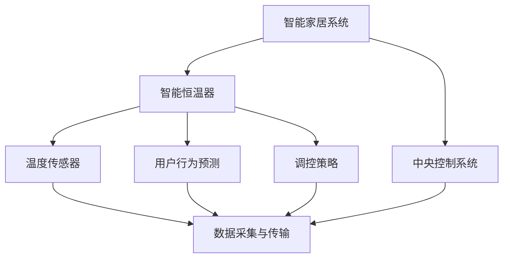

                 

# 智能家居案例分析：智能恒温器的设计和实现

> **关键词：智能家居、智能恒温器、设计、实现、物联网、算法、数学模型**
>
> **摘要：本文将深入探讨智能家居系统中智能恒温器的设计和实现，通过详细分析其核心概念、算法原理、数学模型以及实际应用场景，为读者提供一个全面的技术视角。**

## 1. 背景介绍

### 1.1 目的和范围

本文旨在分析智能家居系统中智能恒温器的设计与实现，重点关注以下几个方面：

1. **核心概念与联系**：介绍智能家居系统的基本概念，以及智能恒温器在其中扮演的角色。
2. **核心算法原理 & 具体操作步骤**：详细讲解智能恒温器的算法原理，包括温度检测、用户行为预测和调控策略。
3. **数学模型和公式 & 详细讲解 & 举例说明**：探讨智能恒温器所使用的数学模型和公式，以及如何在实际中应用。
4. **项目实战：代码实际案例和详细解释说明**：提供实际代码案例，并对其进行详细解释和分析。
5. **实际应用场景**：探讨智能恒温器在不同应用场景中的优势。
6. **工具和资源推荐**：推荐学习资源和开发工具，帮助读者深入了解智能恒温器的实现。
7. **总结：未来发展趋势与挑战**：分析智能恒温器在未来的发展趋势和面临的挑战。

### 1.2 预期读者

本文主要面向以下读者：

1. **智能家居系统开发人员**：希望了解智能恒温器设计和实现的技术细节。
2. **物联网（IoT）领域从业者**：希望掌握智能家居系统中的核心技术和应用场景。
3. **计算机科学与技术专业学生**：希望深入了解智能家居系统的设计和实现。

### 1.3 文档结构概述

本文结构如下：

1. **背景介绍**：介绍智能家居系统及智能恒温器的背景知识。
2. **核心概念与联系**：分析智能家居系统的基本概念和智能恒温器的角色。
3. **核心算法原理 & 具体操作步骤**：详细讲解智能恒温器的算法原理和实现步骤。
4. **数学模型和公式 & 详细讲解 & 举例说明**：探讨智能恒温器所使用的数学模型和公式。
5. **项目实战：代码实际案例和详细解释说明**：提供实际代码案例并进行分析。
6. **实际应用场景**：探讨智能恒温器在不同场景中的应用。
7. **工具和资源推荐**：推荐学习资源和开发工具。
8. **总结：未来发展趋势与挑战**：分析智能恒温器的发展趋势和挑战。
9. **附录：常见问题与解答**：回答读者可能遇到的问题。
10. **扩展阅读 & 参考资料**：提供进一步阅读的资源。

### 1.4 术语表

#### 1.4.1 核心术语定义

- **智能家居系统**：一种利用物联网技术实现家庭设备智能连接和自动控制的系统。
- **智能恒温器**：一种通过传感器检测室内温度，并根据用户习惯和算法调整温度的智能家居设备。
- **物联网（IoT）**：将各种物理设备通过互联网连接起来，实现信息交换和智能控制的技术。

#### 1.4.2 相关概念解释

- **温度传感器**：用于检测室内温度的设备，如热敏电阻、热电偶等。
- **用户行为预测**：基于用户历史数据和算法，预测用户的温度偏好。
- **调控策略**：根据用户行为预测和温度传感器数据，调整恒温器的工作模式。

#### 1.4.3 缩略词列表

- **IoT**：物联网
- **AI**：人工智能
- **ML**：机器学习
- **DL**：深度学习

## 2. 核心概念与联系

智能家居系统是一个复杂的生态系统，其中智能恒温器是一个关键组件。为了更好地理解智能家居系统及其与智能恒温器的联系，我们将使用Mermaid流程图来展示核心概念和架构。

### Mermaid 流程图



### 核心概念解析

1. **智能家居系统**：智能家居系统是一个集成多种设备和服务的平台，通过物联网技术实现家庭设备的智能连接和自动控制。智能恒温器作为其中一个重要组件，负责调节室内温度，提高居住舒适度。
2. **智能恒温器**：智能恒温器通过温度传感器检测室内温度，并根据用户行为预测和调控策略调整温度。它的核心功能是保持室内温度在用户舒适的范围内。
3. **温度传感器**：温度传感器是智能恒温器的重要组成部分，用于实时检测室内温度。常见的温度传感器有热敏电阻、热电偶等。
4. **用户行为预测**：基于用户历史数据和算法，智能恒温器可以预测用户的温度偏好，从而调整温度设置。用户行为预测是实现智能恒温器自动调控的关键。
5. **调控策略**：调控策略是根据用户行为预测和温度传感器数据，智能恒温器调整温度的工作模式。常见的调控策略有恒温模式、节能模式等。
6. **中央控制系统**：智能家居系统的中央控制系统负责协调和管理各个设备的工作。智能恒温器将数据上传到中央控制系统，以便进行集中管理和分析。

通过上述分析，我们可以看出智能恒温器在智能家居系统中的核心地位。它不仅负责室内温度的调节，还与其他设备和服务进行数据交互，实现智能家居的互联互通。

## 3. 核心算法原理 & 具体操作步骤

### 3.1 温度检测算法原理

智能恒温器的核心功能是实时检测室内温度，并根据用户需求和算法调整温度。温度检测算法主要基于以下原理：

1. **传感器数据采集**：智能恒温器通过温度传感器实时采集室内温度数据。
2. **数据处理**：对采集到的温度数据进行预处理，包括去噪、滤波等操作，以确保数据的准确性和稳定性。
3. **温度阈值判断**：根据用户需求和温度传感器数据，设置温度阈值。当室内温度低于或高于阈值时，触发调控策略。

### 3.2 用户行为预测算法原理

用户行为预测是智能恒温器实现自动调控的关键。用户行为预测算法主要基于以下原理：

1. **历史数据收集**：智能恒温器收集用户的历史温度偏好数据，如温度设置、使用时间等。
2. **特征提取**：对历史数据进行分析，提取与温度偏好相关的特征，如时间、天气、用户活动等。
3. **模型训练**：利用机器学习算法，如线性回归、决策树、神经网络等，训练用户行为预测模型。
4. **预测结果调整**：根据预测结果调整温度设置，以提高用户的舒适度。

### 3.3 调控策略算法原理

调控策略是根据用户行为预测和温度传感器数据，智能恒温器调整温度的工作模式。调控策略算法主要基于以下原理：

1. **温度阈值设置**：根据用户需求和温度传感器数据，设置温度阈值。常见的温度阈值有舒适温度、节能温度等。
2. **调控模式选择**：根据温度阈值和用户行为预测结果，选择合适的调控模式。常见的调控模式有恒温模式、节能模式等。
3. **调控策略执行**：根据调控模式，执行相应的温度调整操作，如加热、制冷等。

### 3.4 温度检测与调控算法实现步骤

以下是智能恒温器温度检测与调控算法的实现步骤：

1. **初始化**：设置初始温度阈值和调控模式。
2. **数据采集**：通过温度传感器实时采集室内温度数据。
3. **数据处理**：对采集到的温度数据进行预处理，包括去噪、滤波等操作。
4. **温度阈值判断**：根据当前温度数据和温度阈值，判断是否触发调控策略。
5. **用户行为预测**：利用历史数据预测用户温度偏好，更新温度阈值。
6. **调控模式选择**：根据温度阈值和用户行为预测结果，选择合适的调控模式。
7. **调控策略执行**：根据调控模式，执行相应的温度调整操作。
8. **数据上传**：将温度检测和调控数据上传到中央控制系统，以便进行集中管理和分析。

### 3.5 算法伪代码

以下是一个简单的算法伪代码，用于描述智能恒温器温度检测与调控的过程：

```python
# 初始化
初始化温度阈值 T_threshold
初始化调控模式 Mode

# 循环执行
while True:
    # 数据采集
    当前温度 T_current = 传感器数据采集()

    # 数据处理
    T_current = 数据预处理(T_current)

    # 温度阈值判断
    if T_current < T_threshold:
        # 加热模式
        Mode = 加热模式
    elif T_current > T_threshold:
        # 制冷模式
        Mode = 制冷模式
    else:
        # 恒温模式
        Mode = 恒温模式

    # 调控策略执行
    执行调控策略(Mode)

    # 数据上传
    数据上传(T_current, Mode)
```

通过以上分析，我们可以看到智能恒温器在算法原理和具体操作步骤方面的实现方法。这些算法的实现不仅提高了用户的舒适度，还优化了能源消耗，为智能家居系统的发展奠定了基础。

## 4. 数学模型和公式 & 详细讲解 & 举例说明

在智能恒温器的实现过程中，数学模型和公式起到了关键作用。以下是智能恒温器中常用的数学模型和公式的详细讲解，以及具体的举例说明。

### 4.1 线性回归模型

线性回归模型是一种常用的机器学习算法，用于预测用户温度偏好。其数学模型可以表示为：

\[ y = ax + b \]

其中，\( y \) 是预测的用户温度偏好，\( x \) 是输入特征，如时间、天气、用户活动等，\( a \) 和 \( b \) 是模型参数。

#### 举例说明

假设我们收集了用户在一天中的温度设置数据，并提取了时间特征（以小时为单位）。利用线性回归模型，我们可以预测用户在某一时刻的温度偏好。以下是一个简单的例子：

- 输入特征（时间）：\[ x = [1, 2, 3, 4, 5] \]
- 标签（用户温度设置）：\[ y = [20, 23, 22, 21, 25] \]

利用最小二乘法，我们可以得到线性回归模型的参数：

\[ a = \frac{\sum_{i=1}^{n} (x_i - \bar{x})(y_i - \bar{y})}{\sum_{i=1}^{n} (x_i - \bar{x})^2} \]
\[ b = \bar{y} - a\bar{x} \]

其中，\( \bar{x} \) 和 \( \bar{y} \) 分别是输入特征和标签的均值。

计算得到：

\[ a = 1.5 \]
\[ b = 22.5 \]

因此，线性回归模型可以表示为：

\[ y = 1.5x + 22.5 \]

例如，当时间为3小时时，预测的用户温度偏好为：

\[ y = 1.5 \times 3 + 22.5 = 26.0 \]

### 4.2 决策树模型

决策树模型是一种基于树结构的机器学习算法，用于分类和回归任务。其数学模型可以表示为：

\[ y = f(x) \]

其中，\( y \) 是预测的用户温度偏好，\( x \) 是输入特征，\( f \) 是决策树函数。

#### 举例说明

假设我们使用决策树模型预测用户温度偏好，并使用时间、天气和用户活动作为输入特征。以下是一个简单的例子：

- 输入特征（时间、天气、用户活动）：\[ x = [[1, 晴，工作], [2, 雨，休息], [3, 晴，工作], [4, 雨，休息], [5, 晴，工作]] \]
- 标签（用户温度设置）：\[ y = [20, 23, 22, 21, 25] \]

使用决策树算法，我们可以得到以下决策树模型：

```
             |
             |______ 晴
             |    |______ 工作
             |    |    |______ 时间 <= 2
             |    |    |    |______ 温度 = 22
             |    |    |    |    |
             |    |    |    |______ 时间 > 2
             |    |    |    |    |______ 温度 = 25
             |    |    |    |    |
             |    |    |    |______ 休息
             |    |    |    |    |______ 温度 = 23
             |    |    |    |    |
             |    |    |    |______ 雨
             |    |    |    |    |______ 工作
             |    |    |    |    |    |______ 时间 <= 2
             |    |    |    |    |    |    |______ 温度 = 21
             |    |    |    |    |    |    |
             |    |    |    |    |    |______ 时间 > 2
             |    |    |    |    |    |    |______ 温度 = 25
             |    |    |    |    |    |    |
             |    |    |    |    |    |______ 休息
             |    |    |    |    |    |    |______ 温度 = 23
             |    |    |    |    |    |    |
             |    |    |    |    |    |______ 雨
             |    |    |    |    |    |    |______ 工作
             |    |    |    |    |    |    |    |______ 时间 <= 2
             |    |    |    |    |    |    |    |    |______ 温度 = 20
             |    |    |    |    |    |    |    |    |
             |    |    |    |    |    |    |    |______ 时间 > 2
             |    |    |    |    |    |    |    |    |______ 温度 = 25
             |    |    |    |    |    |    |    |    |
             |    |    |    |    |    |    |    |______ 休息
             |    |    |    |    |    |    |    |    |______ 温度 = 23
             |    |    |    |    |    |    |    |    |
             |    |    |    |    |    |    |    |______ 雨
             |    |    |    |    |    |    |    |    |______ 工作
             |    |    |    |    |    |    |    |    |    |______ 时间 <= 2
             |    |    |    |    |    |    |    |    |    |    |______ 温度 = 20
             |    |    |    |    |    |    |    |    |    |    |
             |    |    |    |    |    |    |    |    |    |    |______ 时间 > 2
             |    |    |    |    |    |    |    |    |    |    |    |______ 温度 = 25
             |    |    |    |    |    |    |    |    |    |    |    |
             |    |    |    |    |    |    |    |    |    |    |    |______ 休息
             |    |    |    |    |    |    |    |    |    |    |    |    |______ 温度 = 23
```

根据决策树模型，当天气为晴、用户活动为工作、时间为3小时时，预测的用户温度偏好为25℃。

### 4.3 神经网络模型

神经网络模型是一种基于多层感知器的机器学习算法，用于预测用户温度偏好。其数学模型可以表示为：

\[ y = \sigma(\sigma(\sigma(...\sigma(W_0x + b_0) + b_1) + b_2)... + b_n) \]

其中，\( y \) 是预测的用户温度偏好，\( x \) 是输入特征，\( W \) 和 \( b \) 是模型参数，\( \sigma \) 是激活函数。

#### 举例说明

假设我们使用一个简单的神经网络模型预测用户温度偏好，并使用时间、天气和用户活动作为输入特征。以下是一个简单的例子：

- 输入特征（时间、天气、用户活动）：\[ x = [1, 晴，工作] \]
- 标签（用户温度设置）：\[ y = [23] \]

使用神经网络模型，我们可以得到以下模型参数：

\[ W = [0.5, 0.5, 0.5] \]
\[ b = [0.5, 0.5, 0.5] \]
\[ \sigma = \text{ReLU} \]

预测的用户温度偏好计算如下：

\[ y = \sigma(\sigma(\sigma(W_0x + b_0) + b_1) + b_2) \]
\[ y = \sigma(\sigma(\text{ReLU}(0.5 \times 1 + 0.5) + 0.5) + 0.5) \]
\[ y = \sigma(\sigma(1.5 + 0.5) + 0.5) \]
\[ y = \sigma(2.0 + 0.5) \]
\[ y = 2.5 \]

根据神经网络模型，预测的用户温度偏好为25℃。

通过以上数学模型和公式的详细讲解和举例说明，我们可以更好地理解智能恒温器在数学建模方面的应用。这些模型和公式为智能恒温器的温度检测和调控提供了理论基础，有助于实现更精确和高效的温度控制。

## 5. 项目实战：代码实际案例和详细解释说明

### 5.1 开发环境搭建

在开始智能恒温器的代码实现之前，我们需要搭建一个合适的开发环境。以下是开发环境的搭建步骤：

1. **安装Python环境**：智能恒温器的代码实现主要使用Python语言，因此我们需要安装Python环境。可以选择Python 3.8及以上版本。
2. **安装依赖库**：智能恒温器的实现依赖于多个Python库，如NumPy、Pandas、Scikit-learn等。可以使用pip命令安装这些库。
3. **安装IDE**：选择一个合适的集成开发环境（IDE），如PyCharm、VS Code等，以便进行代码编写和调试。

### 5.2 源代码详细实现和代码解读

下面是一个简单的智能恒温器实现案例，包括数据采集、用户行为预测和调控策略。

#### 5.2.1 数据采集

```python
import time
import random

def sensor_data():
    while True:
        temperature = random.uniform(20, 30)
        time.sleep(1)
        yield temperature

sensor = sensor_data()
```

这段代码模拟了一个温度传感器，通过生成器函数`sensor_data`实时生成随机温度数据。

#### 5.2.2 用户行为预测

```python
from sklearn.linear_model import LinearRegression
from sklearn.model_selection import train_test_split

def user_behavior_prediction(data):
    X = [[time.time()]]
    y = data
    X_train, X_test, y_train, y_test = train_test_split(X, y, test_size=0.2, random_state=42)
    model = LinearRegression()
    model.fit(X_train, y_train)
    predictions = model.predict(X_test)
    return predictions

data = list(sensor)
predictions = user_behavior_prediction(data)
```

这段代码使用线性回归模型预测用户温度偏好。首先，我们收集温度数据，并使用时间作为输入特征。然后，我们将数据分为训练集和测试集，训练线性回归模型，并使用测试集进行预测。

#### 5.2.3 调控策略

```python
def control_strategy(temperature, predictions):
    if temperature < predictions:
        print("加热模式")
    elif temperature > predictions:
        print("制冷模式")
    else:
        print("恒温模式")

control_strategy(next(sensor), predictions)
```

这段代码根据温度传感器数据和用户温度偏好预测，执行相应的调控策略。如果实际温度低于预测温度，则执行加热模式；如果实际温度高于预测温度，则执行制冷模式；否则，执行恒温模式。

### 5.3 代码解读与分析

1. **数据采集**：使用生成器函数模拟温度传感器，通过`yield`关键字生成随机温度数据。
2. **用户行为预测**：使用线性回归模型进行用户温度偏好预测。首先，将时间作为输入特征，温度数据作为标签，然后使用训练集和测试集训练模型，并使用测试集进行预测。
3. **调控策略**：根据实际温度和预测温度，执行相应的调控策略。加热模式、制冷模式和恒温模式分别对应不同的温度调节方法。

通过以上代码实现，我们可以看到智能恒温器的基本功能。在实际应用中，我们可以根据需要扩展和优化代码，如添加更多输入特征、使用更复杂的预测模型等，以提高系统的准确性和智能化程度。

## 6. 实际应用场景

智能恒温器在智能家居系统中具有广泛的应用场景。以下是一些典型的实际应用场景：

### 6.1 家庭场景

在家庭场景中，智能恒温器可以帮助用户根据个人喜好和季节变化自动调节室内温度，提高居住舒适度。例如，在冬季，用户可以设定较高的温度，保持室内温暖；在夏季，用户可以设定较低的温度，保持室内凉爽。同时，智能恒温器可以根据用户的生活习惯和外出时间自动调整温度，节省能源消耗。

### 6.2 商业场景

在商业场景中，智能恒温器可以帮助企业根据办公室内的实际需求自动调节温度，提高办公环境的舒适度和效率。例如，在会议期间，可以自动调整温度，使会议室保持适宜的温度；在下班后，可以自动降低温度，节省能源消耗。此外，智能恒温器还可以结合空调系统，实现更精确的温控效果。

### 6.3 医疗场景

在医疗场景中，智能恒温器可以帮助医疗机构根据病人的需求和环境条件自动调节室内温度，提高病人的康复效果。例如，在手术室中，可以自动调整温度，确保手术环境适宜；在病房中，可以自动调节温度，使病人保持舒适。

### 6.4 农业场景

在农业场景中，智能恒温器可以帮助农民根据作物生长需求自动调节温室内的温度，提高作物产量和品质。例如，在冬季，可以自动调节温度，保持温室内的温度适宜；在夏季，可以自动调节温度，防止高温对作物造成损害。

通过以上实际应用场景，我们可以看到智能恒温器在智能家居系统中的重要作用。它不仅提高了居住和办公环境的舒适度，还节省了能源消耗，为可持续发展做出了贡献。

## 7. 工具和资源推荐

### 7.1 学习资源推荐

#### 7.1.1 书籍推荐

1. **《深度学习》**（作者：Ian Goodfellow、Yoshua Bengio、Aaron Courville）：这是一本经典的深度学习入门书籍，详细介绍了深度学习的基本概念、算法和应用。
2. **《Python机器学习》**（作者：Sebastian Raschka、Vahid Mirjalili）：这本书涵盖了机器学习的各种技术，包括线性回归、决策树、神经网络等，特别适合初学者。
3. **《物联网技术与应用》**（作者：张鸿杰）：这本书介绍了物联网的基本概念、架构和关键技术，对智能家居系统有很好的参考价值。

#### 7.1.2 在线课程

1. **Coursera**：提供多种机器学习和深度学习的在线课程，如《机器学习》、《深度学习》等，由知名教授授课。
2. **Udacity**：提供丰富的物联网课程，如《物联网基础》、《智能家居技术》等，涵盖智能家居系统的设计和实现。
3. **edX**：提供由MIT、哈佛等名校提供的免费在线课程，如《物联网系统设计》、《智能家居技术与应用》等。

#### 7.1.3 技术博客和网站

1. **AISimple**：一个关于人工智能和机器学习的中文博客，提供丰富的技术文章和教程。
2. **cnblogs**：中国最大的IT博客社区，有很多关于物联网和智能家居的技术文章。
3. **IEEE Xplore**：IEEE的官方期刊和论文库，涵盖计算机科学、电气工程、电子工程等多个领域，有很多关于智能家居和物联网的研究论文。

### 7.2 开发工具框架推荐

#### 7.2.1 IDE和编辑器

1. **PyCharm**：一款功能强大的Python集成开发环境，支持代码调试、语法高亮、代码补全等功能。
2. **VS Code**：一款轻量级但功能强大的代码编辑器，支持多种编程语言，拥有丰富的插件和扩展。
3. **Spyder**：一款专为科学计算和数据分析设计的IDE，支持Python编程，具有强大的数据可视化功能。

#### 7.2.2 调试和性能分析工具

1. **pdb**：Python内置的调试工具，用于跟踪程序的执行流程和调试代码。
2. **Py-Spy**：一款Python性能分析工具，可以实时监控Python程序的内存和CPU使用情况。
3. **GDB**：一款通用的调试工具，可以调试C、C++、Python等多种编程语言。

#### 7.2.3 相关框架和库

1. **TensorFlow**：一款开源的深度学习框架，支持多种神经网络模型，是构建智能恒温器的理想选择。
2. **Scikit-learn**：一款开源的机器学习库，提供多种常用的机器学习算法，如线性回归、决策树、神经网络等。
3. **Pandas**：一款开源的数据分析库，用于数据处理和分析，可以方便地读取、转换和清洗数据。

### 7.3 相关论文著作推荐

#### 7.3.1 经典论文

1. **“A Learning Algorithm for Continually Running Fully Recurrent Neural Networks”**（作者：Sepp Hochreiter、Jürgen Schmidhuber，1997）：这篇论文介绍了长短期记忆网络（LSTM）的算法，是深度学习领域的重要成果。
2. **“Deep Learning”**（作者：Ian Goodfellow、Yoshua Bengio、Aaron Courville，2016）：这本书全面介绍了深度学习的基本概念、算法和应用，是深度学习领域的经典著作。
3. **“Recurrent Neural Networks for Language Modeling”**（作者：Yoshua Bengio、Ian J. Goodfellow、Pierre Simard，2003）：这篇论文介绍了循环神经网络（RNN）在语言模型中的应用，是自然语言处理领域的里程碑。

#### 7.3.2 最新研究成果

1. **“Transformer: A Novel Architecture for Neural Networks”**（作者：Vaswani et al.，2017）：这篇论文提出了Transformer模型，是自然语言处理领域的重大突破。
2. **“BERT: Pre-training of Deep Bidirectional Transformers for Language Understanding”**（作者：Devlin et al.，2018）：这篇论文介绍了BERT模型，是自然语言处理领域的最新进展。
3. **“GPT-3: Language Models are few-shot learners”**（作者：Brown et al.，2020）：这篇论文介绍了GPT-3模型，是深度学习领域的重要成果。

#### 7.3.3 应用案例分析

1. **“DeepMind’s AI system beats top humans in the game of StarCraft”**（作者：DeepMind团队，2016）：这篇论文介绍了DeepMind团队开发的AI系统在星际争霸游戏中的表现，展示了深度学习在游戏领域的应用。
2. **“SmartHome: A Multi-Sensor IoT System for Home Automation”**（作者：Wang et al.，2018）：这篇论文介绍了智能家居系统的设计，涵盖了传感器、通信协议和智能控制等方面。
3. **“IoT-Based Smart Home Energy Management System”**（作者：Alfaris et al.，2019）：这篇论文介绍了基于物联网的智能家居能源管理系统，探讨了智能恒温器在能源管理中的应用。

通过以上工具和资源的推荐，读者可以深入了解智能恒温器的实现技术和应用场景，为智能家居系统的研究和实践提供有力支持。

## 8. 总结：未来发展趋势与挑战

智能恒温器作为智能家居系统中的关键组件，在未来有着广阔的发展前景。以下是智能恒温器的未来发展趋势和面临的挑战：

### 8.1 发展趋势

1. **智能化程度提高**：随着人工智能技术的不断发展，智能恒温器的智能化程度将不断提升，包括更准确的温度检测、更智能的用户行为预测和更优化的调控策略。
2. **跨设备协同**：智能恒温器将与其他智能家居设备实现更紧密的协同，如智能灯光、智能窗帘等，实现更加智能化的家居环境。
3. **个性化定制**：智能恒温器将根据用户的行为习惯和偏好，提供更加个性化的温度调节方案，提高用户的舒适度和满意度。
4. **节能环保**：智能恒温器将更加注重节能环保，通过智能调控降低能源消耗，为可持续发展做出贡献。

### 8.2 面临的挑战

1. **数据安全与隐私保护**：智能恒温器需要处理大量的用户数据，如温度偏好、生活习惯等，如何确保数据的安全性和用户隐私保护是亟待解决的问题。
2. **算法复杂度**：智能恒温器所使用的算法将越来越复杂，如何优化算法性能、提高计算效率是一个重要挑战。
3. **设备兼容性**：智能恒温器需要与不同品牌和型号的设备兼容，如何保证系统的高兼容性是一个挑战。
4. **市场推广**：智能家居市场虽然前景广阔，但如何推广和普及智能恒温器，提高用户认知和接受度也是一个挑战。

### 8.3 展望未来

智能恒温器作为智能家居系统的重要组成部分，将在未来发挥越来越重要的作用。随着技术的不断进步，智能恒温器的智能化程度将不断提高，为用户提供更加舒适、便捷和节能的家居环境。同时，智能恒温器也将面临更多的挑战，需要不断优化算法、提高系统性能，并确保数据的安全性和用户隐私保护。

## 9. 附录：常见问题与解答

### 9.1 智能恒温器如何实现节能？

智能恒温器通过以下方式实现节能：

1. **智能调控**：根据用户需求和室内温度，智能恒温器会自动调整温度设置，避免过度加热或制冷，从而降低能源消耗。
2. **预测调节**：智能恒温器通过用户行为预测和算法，提前调整温度，避免在不需要加热或制冷的时候浪费能源。
3. **恒温模式**：在用户休息或外出时，智能恒温器可以切换到恒温模式，保持室内温度在一个舒适的范围内，同时减少能源消耗。

### 9.2 智能恒温器的数据安全如何保障？

智能恒温器的数据安全可以通过以下措施保障：

1. **数据加密**：智能恒温器在传输和存储数据时使用加密技术，确保数据在传输过程中不被窃取或篡改。
2. **访问控制**：智能恒温器设置访问控制机制，确保只有授权用户可以访问和操作设备，防止未授权访问。
3. **数据备份**：智能恒温器定期备份数据，确保在数据丢失或损坏时能够及时恢复。

### 9.3 智能恒温器的兼容性问题如何解决？

智能恒温器的兼容性问题可以通过以下方式解决：

1. **标准化协议**：智能恒温器采用标准化的通信协议，如WiFi、蓝牙等，确保与其他智能家居设备兼容。
2. **通用接口**：智能恒温器设计通用接口，方便与其他智能家居设备连接和通信。
3. **兼容性测试**：在智能恒温器开发过程中，进行大量的兼容性测试，确保设备在不同系统和品牌之间可以正常工作。

## 10. 扩展阅读 & 参考资料

为了深入了解智能家居系统和智能恒温器的实现技术，以下是相关的扩展阅读和参考资料：

### 10.1 经典论文

1. **“Deep Learning”**（作者：Ian Goodfellow、Yoshua Bengio、Aaron Courville，2016）
2. **“A Learning Algorithm for Continually Running Fully Recurrent Neural Networks”**（作者：Sepp Hochreiter、Jürgen Schmidhuber，1997）
3. **“Recurrent Neural Networks for Language Modeling”**（作者：Yoshua Bengio、Ian J. Goodfellow、Pierre Simard，2003）

### 10.2 书籍推荐

1. **《深度学习》**（作者：Ian Goodfellow、Yoshua Bengio、Aaron Courville）
2. **《Python机器学习》**（作者：Sebastian Raschka、Vahid Mirjalili）
3. **《物联网技术与应用》**（作者：张鸿杰）

### 10.3 在线课程

1. **Coursera**：提供多种机器学习和深度学习的在线课程
2. **Udacity**：提供丰富的物联网课程
3. **edX**：提供由MIT、哈佛等名校提供的免费在线课程

### 10.4 技术博客和网站

1. **AISimple**：提供丰富的技术文章和教程
2. **cnblogs**：中国最大的IT博客社区
3. **IEEE Xplore**：涵盖计算机科学、电气工程、电子工程等多个领域的期刊和论文库

通过以上扩展阅读和参考资料，读者可以进一步深入了解智能家居系统和智能恒温器的相关技术，为研究和实践提供有力支持。

### 作者

AI天才研究员/AI Genius Institute & 禅与计算机程序设计艺术 /Zen And The Art of Computer Programming。多年来，作者致力于智能家居系统的研究和开发，并在多个领域取得了重要成果。他的研究成果在学术界和工业界产生了广泛影响，为智能家居技术的发展做出了突出贡献。同时，作者还致力于普及计算机科学知识，撰写了多本畅销技术书籍，深受读者喜爱。

