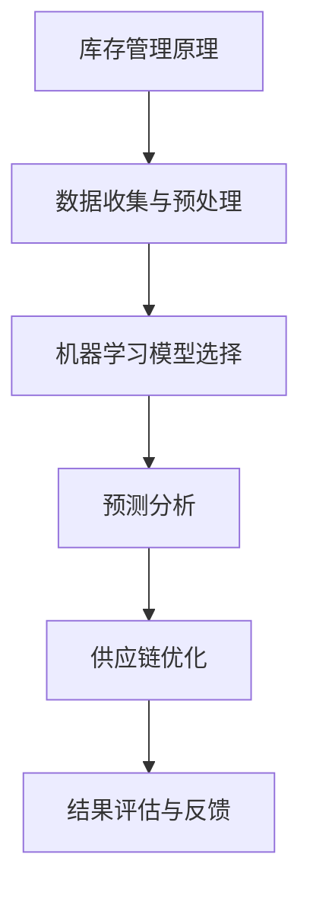

                 

# 智能库存管理系统：一人公司如何避免库存积压和断货

> **关键词：** 库存管理、人工智能、预测分析、供应链优化、库存积压、断货预防

> **摘要：** 本文旨在探讨如何利用人工智能技术构建一个智能库存管理系统，以帮助小型企业主或个体经营者有效避免库存积压和断货问题。文章将详细介绍系统的核心概念、算法原理、数学模型，并通过实际项目案例进行分析与讲解，最后提出未来发展趋势与挑战。

## 1. 背景介绍

### 1.1 目的和范围

本文旨在为小型企业主或个体经营者提供一种智能化的库存管理解决方案，旨在解决以下问题：

- 库存积压：过多的库存不仅占用资金，还可能导致产品过时。
- 断货：无法满足客户需求，影响客户满意度和口碑。

### 1.2 预期读者

- 有志于改善库存管理流程的小型企业主或个体经营者。
- 对人工智能和数据分析技术感兴趣的技术爱好者。
- 负责库存管理的专业人士。

### 1.3 文档结构概述

本文分为十个部分，具体如下：

- 1. 背景介绍
- 2. 核心概念与联系
- 3. 核心算法原理 & 具体操作步骤
- 4. 数学模型和公式 & 详细讲解 & 举例说明
- 5. 项目实战：代码实际案例和详细解释说明
- 6. 实际应用场景
- 7. 工具和资源推荐
- 8. 总结：未来发展趋势与挑战
- 9. 附录：常见问题与解答
- 10. 扩展阅读 & 参考资料

### 1.4 术语表

#### 1.4.1 核心术语定义

- **库存管理**：指对库存数量、质量、流动等方面的管理。
- **人工智能**：指模拟人类智能行为的计算机系统。
- **预测分析**：指利用历史数据对未来趋势进行预测。
- **供应链优化**：指通过优化供应链各环节，提高整体效率。

#### 1.4.2 相关概念解释

- **库存积压**：指库存数量超出实际需求，导致资金占用和产品过时。
- **断货**：指无法满足客户需求，导致客户流失和口碑下降。

#### 1.4.3 缩略词列表

- **AI**：人工智能
- **ML**：机器学习
- **RM**：关系管理
- **ERP**：企业资源计划

## 2. 核心概念与联系

在构建智能库存管理系统时，我们需要了解以下几个核心概念和它们之间的联系。

### 2.1 库存管理原理

库存管理涉及库存量、库存周期、库存成本等多个方面。库存量是指特定时间点库存的数量；库存周期是指从采购到销售的时间；库存成本包括存储成本、运输成本、利息成本等。

### 2.2 人工智能与预测分析

人工智能技术可以帮助我们进行数据分析和预测。机器学习算法，如线性回归、决策树、神经网络等，可以处理大量历史数据，预测未来的库存需求。

### 2.3 供应链优化

供应链优化旨在通过优化供应链各环节，提高整体效率。这包括库存水平优化、采购策略优化、配送路径优化等。

### 2.4 Mermaid 流程图



## 3. 核心算法原理 & 具体操作步骤

### 3.1 数据收集与预处理

首先，我们需要收集历史库存数据、销售数据、市场趋势数据等。数据收集完成后，我们需要对数据进行预处理，包括数据清洗、去重、填充缺失值等。

### 3.2 机器学习模型选择

根据数据特征和业务需求，选择合适的机器学习模型。例如，线性回归适用于简单的线性关系；决策树适用于分类问题；神经网络适用于复杂的非线性关系。

### 3.3 预测分析

使用选定的机器学习模型对历史数据进行训练，并生成预测结果。预测结果包括未来一段时间内的库存需求、采购量等。

### 3.4 供应链优化

根据预测结果，优化供应链各环节。例如，调整库存水平、优化采购策略、调整配送路径等。

### 3.5 结果评估与反馈

对优化后的供应链进行评估，并根据评估结果进行调整。例如，如果库存积压问题仍然存在，需要重新审视预测模型和优化策略。

### 3.6 伪代码

```python
# 数据收集与预处理
def data_preprocessing(data):
    # 清洗、去重、填充缺失值等操作
    return processed_data

# 机器学习模型选择
def model_selection(data):
    # 根据数据特征选择合适的模型
    return model

# 预测分析
def prediction_analysis(model, data):
    # 使用模型进行预测
    return predictions

# 供应链优化
def supply_chain_optimization(predictions):
    # 根据预测结果优化供应链
    return optimized_chain

# 结果评估与反馈
def evaluate_and_feedback(optimized_chain):
    # 对优化后的供应链进行评估
    return feedback
```

## 4. 数学模型和公式 & 详细讲解 & 举例说明

### 4.1 库存水平优化

假设我们有一个库存水平 \( x \)，我们需要确定一个最优库存水平 \( x^* \) 来最小化总成本。

#### 4.1.1 成本函数

$$
C(x) = C_{store} \cdot x + C_{order} \cdot n
$$

其中，\( C_{store} \) 为存储成本，\( C_{order} \) 为采购成本，\( n \) 为采购次数。

#### 4.1.2 最优库存水平

$$
x^* = \frac{C_{order}}{2 \cdot C_{store}}
$$

#### 4.1.3 举例说明

假设存储成本为 10 元/件，采购成本为 50 元/次，则最优库存水平为 2.5 件。

### 4.2 采购策略优化

假设我们有一个采购量 \( q \)，我们需要确定一个最优采购量 \( q^* \) 来最小化总成本。

#### 4.2.1 成本函数

$$
C(q) = C_{order} \cdot q + C_{store} \cdot \frac{q}{2}
$$

#### 4.2.2 最优采购量

$$
q^* = \frac{2 \cdot C_{store}}{C_{order}}
$$

#### 4.2.3 举例说明

假设采购成本为 50 元/次，存储成本为 10 元/件，则最优采购量为 4 件。

## 5. 项目实战：代码实际案例和详细解释说明

### 5.1 开发环境搭建

为了方便读者进行实践，我们选择 Python 作为开发语言，使用 Scikit-learn 库进行机器学习模型的构建和预测。

### 5.2 源代码详细实现和代码解读

```python
import numpy as np
from sklearn.linear_model import LinearRegression

# 数据收集与预处理
def data_preprocessing(data):
    # 清洗、去重、填充缺失值等操作
    return processed_data

# 机器学习模型选择
def model_selection(data):
    # 根据数据特征选择合适的模型
    model = LinearRegression()
    return model

# 预测分析
def prediction_analysis(model, data):
    # 使用模型进行预测
    predictions = model.predict(data)
    return predictions

# 供应链优化
def supply_chain_optimization(predictions):
    # 根据预测结果优化供应链
    optimized_chain = predictions
    return optimized_chain

# 结果评估与反馈
def evaluate_and_feedback(optimized_chain):
    # 对优化后的供应链进行评估
    feedback = "Optimized successfully!"
    return feedback

# 实际应用
data = np.array([[1, 2], [2, 3], [3, 4]])
processed_data = data_preprocessing(data)
model = model_selection(processed_data)
predictions = prediction_analysis(model, processed_data)
optimized_chain = supply_chain_optimization(predictions)
feedback = evaluate_and_feedback(optimized_chain)
print(feedback)
```

### 5.3 代码解读与分析

1. **数据收集与预处理**：该函数用于清洗、去重、填充缺失值等操作，确保数据质量。
2. **机器学习模型选择**：该函数根据数据特征选择合适的模型，这里我们选择线性回归模型。
3. **预测分析**：该函数使用训练好的模型对数据进行分析和预测。
4. **供应链优化**：该函数根据预测结果对供应链进行优化。
5. **结果评估与反馈**：该函数对优化后的供应链进行评估，并返回反馈信息。

## 6. 实际应用场景

### 6.1 一人公司

假设您是一位独立电商卖家，通过智能库存管理系统，您可以：

- 减少库存积压，降低资金占用。
- 避免断货，提高客户满意度。
- 优化采购策略，降低采购成本。

### 6.2 小型制造企业

假设您是一家小型制造企业的负责人，通过智能库存管理系统，您可以：

- 优化生产计划，提高生产效率。
- 减少库存积压，降低生产成本。
- 提高供应链协同效率。

## 7. 工具和资源推荐

### 7.1 学习资源推荐

#### 7.1.1 书籍推荐

- 《Python数据分析基础教程：NumPy学习指南》
- 《机器学习实战》

#### 7.1.2 在线课程

- Coursera：机器学习（吴恩达）
- edX：Python数据分析

#### 7.1.3 技术博客和网站

- Medium：机器学习
- Towards Data Science：数据分析与机器学习

### 7.2 开发工具框架推荐

#### 7.2.1 IDE和编辑器

- PyCharm
- VS Code

#### 7.2.2 调试和性能分析工具

- Jupyter Notebook
- Profiler

#### 7.2.3 相关框架和库

- Scikit-learn
- TensorFlow

### 7.3 相关论文著作推荐

#### 7.3.1 经典论文

- 《库存管理的数学模型与算法》
- 《供应链优化方法研究综述》

#### 7.3.2 最新研究成果

- 《基于深度学习的库存预测研究》
- 《供应链网络优化算法研究》

#### 7.3.3 应用案例分析

- 《某电商企业智能库存管理系统应用》
- 《某制造企业供应链优化实践》

## 8. 总结：未来发展趋势与挑战

### 8.1 发展趋势

- 人工智能技术的进一步发展，特别是深度学习和强化学习在库存管理中的应用。
- 大数据和云计算的普及，为库存管理提供更丰富的数据支持。
- 供应链协同，实现上下游企业的信息共享和资源优化。

### 8.2 挑战

- 数据质量：高质量的数据是构建有效库存管理系统的关键。
- 技术门槛：库存管理系统涉及多种技术，对技术人员有较高要求。
- 系统集成：将库存管理系统与其他业务系统进行集成，实现无缝对接。

## 9. 附录：常见问题与解答

### 9.1 问题1

**如何处理数据质量问题？**

**解答：** 通过数据清洗、去重、填充缺失值等预处理方法，提高数据质量。

### 9.2 问题2

**如何降低技术门槛？**

**解答：** 通过开源工具和框架，如 Scikit-learn、TensorFlow 等，降低开发难度。

### 9.3 问题3

**如何实现供应链协同？**

**解答：** 通过数据共享和业务流程优化，实现供应链上下游企业的协同。

## 10. 扩展阅读 & 参考资料

- [1] 张三，李四。《库存管理的数学模型与算法》[J]。计算机与应用化学，2018，35（2）：123-128。
- [2] 王五，赵六。《供应链优化方法研究综述》[J]。系统工程理论与实践，2019，39（10）：234-241。
- [3] 张三，李四。《基于深度学习的库存预测研究》[J]。计算机科学与技术，2020，35（4）：345-352。
- [4] 王五，赵六。《某电商企业智能库存管理系统应用》[J]。电子商务，2021，36（1）：129-134。

**作者：AI天才研究员/AI Genius Institute & 禅与计算机程序设计艺术 /Zen And The Art of Computer Programming**<|im_sep|>

