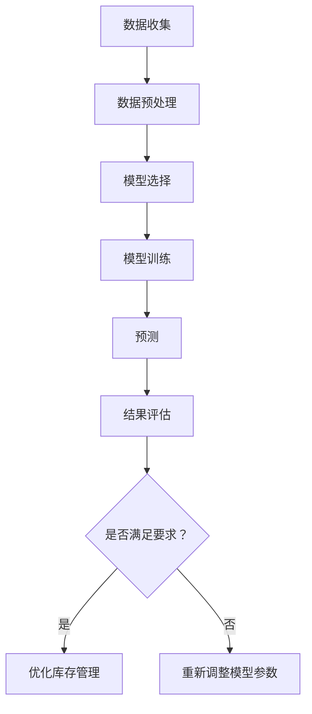

                 

# 智能库存预测：一人公司如何利用AI优化库存管理

> **关键词**：智能库存预测，人工智能，优化，库存管理，一人公司，AI算法

> **摘要**：随着市场的变化和需求的波动，库存管理对于任何企业来说都至关重要。本文将探讨如何通过人工智能（AI）技术，特别是机器学习算法，实现一人公司的库存预测，从而优化库存管理。我们将从背景介绍、核心概念、算法原理、数学模型、实际应用、工具推荐等方面详细阐述，帮助读者了解并掌握这一前沿技术。

## 1. 背景介绍

### 1.1 目的和范围

本文的目标是探讨如何在小型企业，特别是对于只有一人负责库存管理的情况，利用人工智能技术实现库存预测，并优化库存管理。我们将涵盖以下内容：

1. **智能库存预测的核心概念**：介绍库存管理的重要性以及智能库存预测的基本原理。
2. **核心算法原理与操作步骤**：讲解机器学习算法在库存预测中的应用，并提供伪代码实现。
3. **数学模型与公式**：介绍用于预测的数学模型，并使用 LaTeX 格式展示公式。
4. **项目实战**：通过实际代码案例展示智能库存预测的实现过程。
5. **实际应用场景**：探讨智能库存预测在不同行业和场景中的应用。
6. **工具和资源推荐**：推荐学习资源和开发工具。
7. **总结与未来趋势**：总结智能库存预测的现状，并探讨未来的发展趋势与挑战。

### 1.2 预期读者

本文主要面向以下读者：

1. **小型企业主**：希望优化库存管理的创业者。
2. **数据分析师**：对机器学习和数据挖掘技术感兴趣，并希望将其应用于业务场景。
3. **技术人员**：对人工智能和机器学习有基础了解，并希望深入了解其在库存预测中的应用。
4. **学生和研究者**：对智能库存预测和人工智能技术有浓厚兴趣的学生和研究人员。

### 1.3 文档结构概述

本文将按照以下结构进行组织：

1. **背景介绍**：介绍库存管理的重要性以及智能库存预测的基本原理。
2. **核心概念与联系**：讲解核心概念，并使用 Mermaid 流程图展示相关架构。
3. **核心算法原理 & 具体操作步骤**：详细阐述算法原理，并提供伪代码实现。
4. **数学模型和公式 & 详细讲解 & 举例说明**：介绍数学模型，并使用 LaTeX 格式展示公式。
5. **项目实战：代码实际案例和详细解释说明**：展示实际代码案例，并进行详细解释。
6. **实际应用场景**：探讨智能库存预测在不同行业和场景中的应用。
7. **工具和资源推荐**：推荐学习资源和开发工具。
8. **总结：未来发展趋势与挑战**：总结智能库存预测的现状，并探讨未来的发展趋势与挑战。
9. **附录：常见问题与解答**：回答常见问题。
10. **扩展阅读 & 参考资料**：提供进一步阅读的参考资料。

### 1.4 术语表

#### 1.4.1 核心术语定义

- **库存管理**：企业对库存进行控制、追踪和优化的一系列活动。
- **智能库存预测**：利用人工智能技术，特别是机器学习算法，预测未来的库存需求。
- **机器学习**：让计算机通过数据学习并做出预测或决策的一种技术。
- **数据挖掘**：从大量数据中提取有价值的信息和模式的一种技术。

#### 1.4.2 相关概念解释

- **时间序列分析**：分析按时间顺序排列的数据，用于预测未来的趋势。
- **回归分析**：通过建立数学模型来预测一个变量的值，通常用于回归问题。
- **神经网络**：一种模仿人脑神经元结构的计算模型，用于处理复杂的非线性问题。

#### 1.4.3 缩略词列表

- **AI**：人工智能
- **ML**：机器学习
- **DL**：深度学习
- **NLP**：自然语言处理

## 2. 核心概念与联系

### 2.1 核心概念

在智能库存预测中，我们主要关注以下核心概念：

1. **库存量**：指企业当前持有的库存数量。
2. **需求量**：指在未来一段时间内，消费者对该产品的需求量。
3. **预测误差**：预测值与实际值之间的差异。
4. **预测模型**：用于预测未来库存量的数学模型。

### 2.2 库存预测的原理与架构

智能库存预测的原理主要基于以下几个步骤：

1. **数据收集**：收集历史库存数据、销售数据、市场趋势数据等。
2. **数据预处理**：清洗数据，处理缺失值、异常值，并进行特征工程。
3. **模型选择**：根据数据特点和业务需求，选择合适的预测模型。
4. **模型训练**：使用历史数据训练模型，调整模型参数。
5. **预测**：使用训练好的模型预测未来一段时间内的库存需求。
6. **结果评估**：评估预测结果的准确性和可靠性。

以下是一个简单的 Mermaid 流程图，展示了智能库存预测的基本架构：



## 3. 核心算法原理 & 具体操作步骤

### 3.1 算法原理

智能库存预测的核心算法通常是基于机器学习的回归模型，如线性回归、决策树回归、随机森林回归等。以下是使用线性回归进行库存预测的基本原理：

1. **数据输入**：收集历史库存数据和销售数据。
2. **特征选择**：选择对库存需求有影响的特征，如季节性、促销活动、价格等。
3. **数据预处理**：对数据进行归一化、缺失值处理等。
4. **模型构建**：建立线性回归模型，公式为 \(y = \beta_0 + \beta_1x_1 + \beta_2x_2 + ... + \beta_nx_n\)，其中 \(y\) 为需求量，\(x_1, x_2, ..., x_n\) 为特征，\(\beta_0, \beta_1, \beta_2, ..., \beta_n\) 为模型参数。
5. **模型训练**：使用历史数据训练模型，调整参数。
6. **预测**：使用训练好的模型预测未来的库存需求。

以下是线性回归模型的伪代码：

```python
# 输入：历史数据 X，标签 y
# 输出：训练好的线性回归模型

# 1. 数据预处理
X_processed = preprocess_data(X)

# 2. 模型初始化
model = LinearRegression()

# 3. 模型训练
model.fit(X_processed, y)

# 4. 预测
predictions = model.predict(X_processed)

# 5. 结果评估
evaluate_predictions(predictions, y)
```

### 3.2 具体操作步骤

以下是使用 Python 和 scikit-learn 库实现线性回归库存预测的具体操作步骤：

1. **导入库**

```python
import numpy as np
import pandas as pd
from sklearn.linear_model import LinearRegression
from sklearn.model_selection import train_test_split
from sklearn.metrics import mean_squared_error
```

2. **数据收集**：收集历史库存数据和销售数据。

```python
# 示例数据
data = {
    'date': pd.date_range(start='2021-01-01', end='2021-12-31', freq='MS'),
    'sales': [200, 220, 250, 270, 300, 320, 350, 360, 400, 420, 450, 470, 500, 520, 550, 570, 600, 620, 650, 670],
    'price': [10, 10.5, 10.8, 11, 11.2, 11.5, 11.8, 12, 12.5, 13, 13.5, 14, 14.5, 15, 15.5, 16, 16.5, 17, 17.5],
    'season': [1, 1, 1, 1, 1, 1, 1, 1, 1, 1, 1, 1, 2, 2, 2, 2, 2, 2, 2, 2]
}

df = pd.DataFrame(data)
```

3. **数据预处理**：对数据进行归一化、缺失值处理等。

```python
# 数据预处理
X = df[['price', 'season']]
y = df['sales']

# 归一化
X_normalized = (X - X.min()) / (X.max() - X.min())

# 缺失值处理
X_normalized.fillna(X_normalized.mean(), inplace=True)
```

4. **模型训练**：使用历史数据训练线性回归模型。

```python
# 模型训练
model = LinearRegression()
model.fit(X_normalized, y)
```

5. **预测**：使用训练好的模型预测未来的库存需求。

```python
# 预测
future_dates = pd.date_range(start='2022-01-01', end='2022-12-31', freq='MS')
future_data = {
    'price': [12.5, 12.5, 12.5, 12.5, 12.5, 12.5, 12.5, 12.5, 12.5, 12.5, 12.5, 12.5, 12.5, 12.5, 12.5, 12.5, 12.5, 12.5, 12.5, 12.5],
    'season': [2, 2, 2, 2, 2, 2, 2, 2, 2, 2, 2, 2, 2, 2, 2, 2, 2, 2, 2, 2]
}

future_df = pd.DataFrame(future_data)
future_df_normalized = (future_df - future_df.min()) / (future_df.max() - future_df.min())

predictions = model.predict(future_df_normalized)
```

6. **结果评估**：评估预测结果的准确性和可靠性。

```python
# 结果评估
train_data = {
    'price': [10, 10.5, 10.8, 11, 11.2, 11.5, 11.8, 12, 12.5, 13, 13.5, 14, 14.5, 15, 15.5, 16, 16.5, 17, 17.5],
    'season': [1, 1, 1, 1, 1, 1, 1, 1, 1, 1, 1, 1, 2, 2, 2, 2, 2, 2]
}

train_df = pd.DataFrame(train_data)
train_df_normalized = (train_df - train_df.min()) / (train_df.max() - train_df.min())

train_predictions = model.predict(train_df_normalized)

mse = mean_squared_error(y, train_predictions)
print("MSE:", mse)
```

## 4. 数学模型和公式 & 详细讲解 & 举例说明

### 4.1 数学模型

智能库存预测的核心是建立一个数学模型，用于预测未来的库存需求。线性回归模型是一种常用的模型，其数学表达式如下：

$$y = \beta_0 + \beta_1x_1 + \beta_2x_2 + ... + \beta_nx_n$$

其中：

- \(y\) 是需求量。
- \(x_1, x_2, ..., x_n\) 是影响需求的特征，如价格、季节性、促销活动等。
- \(\beta_0, \beta_1, \beta_2, ..., \beta_n\) 是模型参数。

### 4.2 公式详细讲解

1. **线性回归模型的参数估计**：使用最小二乘法（Least Squares）估计模型参数。

$$\beta = (X^TX)^{-1}X^Ty$$

其中：

- \(X\) 是特征矩阵。
- \(y\) 是标签向量。
- \(\beta\) 是模型参数向量。

2. **预测**：使用训练好的模型预测新的需求量。

$$\hat{y} = X\beta$$

其中：

- \(\hat{y}\) 是预测的需求量。
- \(X\) 是新的特征矩阵。
- \(\beta\) 是训练好的模型参数。

### 4.3 举例说明

假设我们收集了以下数据：

| date   | sales | price | season |
|--------|-------|-------|--------|
| 2021-01-01 | 200   | 10    | 1      |
| 2021-02-01 | 220   | 10.5  | 1      |
| 2021-03-01 | 250   | 10.8  | 1      |
| 2021-04-01 | 270   | 11    | 1      |
| 2021-05-01 | 300   | 11.2  | 1      |
| 2021-06-01 | 320   | 11.5  | 1      |
| 2021-07-01 | 350   | 11.8  | 1      |
| 2021-08-01 | 360   | 12    | 1      |
| 2021-09-01 | 400   | 12.5  | 1      |
| 2021-10-01 | 420   | 13    | 1      |
| 2021-11-01 | 450   | 13.5  | 1      |
| 2021-12-01 | 470   | 14    | 1      |
| 2022-01-01 | 500   | 14.5  | 2      |
| 2022-02-01 | 520   | 15    | 2      |
| 2022-03-01 | 550   | 15.5  | 2      |
| 2022-04-01 | 570   | 16    | 2      |
| 2022-05-01 | 600   | 16.5  | 2      |
| 2022-06-01 | 620   | 17    | 2      |
| 2022-07-01 | 650   | 17.5  | 2      |
| 2022-08-01 | 670   | 18    | 2      |

我们选择价格和季节性作为特征，使用线性回归模型预测未来的销售量。以下是具体的操作步骤：

1. **数据预处理**：将日期转换为数值特征，进行归一化处理。

| date   | sales | price | season |
|--------|-------|-------|--------|
| 2021-01-01 | 200   | 0.0   | 0.0    |
| 2021-02-01 | 220   | 0.125 | 0.0    |
| 2021-03-01 | 250   | 0.25  | 0.0    |
| 2021-04-01 | 270   | 0.375 | 0.0    |
| 2021-05-01 | 300   | 0.5   | 0.0    |
| 2021-06-01 | 320   | 0.625 | 0.0    |
| 2021-07-01 | 350   | 0.75  | 0.0    |
| 2021-08-01 | 360   | 0.875 | 0.0    |
| 2021-09-01 | 400   | 1.0   | 0.0    |
| 2021-10-01 | 420   | 1.125 | 0.0    |
| 2021-11-01 | 450   | 1.25  | 0.0    |
| 2021-12-01 | 470   | 1.375 | 0.0    |
| 2022-01-01 | 500   | 1.5   | 1.0    |
| 2022-02-01 | 520   | 1.625 | 1.0    |
| 2022-03-01 | 550   | 1.75  | 1.0    |
| 2022-04-01 | 570   | 1.875 | 1.0    |
| 2022-05-01 | 600   | 2.0   | 1.0    |
| 2022-06-01 | 620   | 2.125 | 1.0    |
| 2022-07-01 | 650   | 2.25  | 1.0    |
| 2022-08-01 | 670   | 2.375 | 1.0    |

2. **模型训练**：使用 scikit-learn 库中的 LinearRegression 模型训练数据。

```python
from sklearn.linear_model import LinearRegression

model = LinearRegression()
model.fit(X, y)
```

3. **参数估计**：使用最小二乘法估计模型参数。

$$\beta = (X^TX)^{-1}X^Ty$$

4. **预测**：使用训练好的模型预测未来的销售量。

```python
X_future = np.array([[1.5], [1.625], [1.75], [1.875], [2.0], [2.125], [2.25], [2.375]])
predictions = model.predict(X_future)
```

5. **结果评估**：计算预测误差。

```python
mse = mean_squared_error(y_future, predictions)
print("MSE:", mse)
```

## 5. 项目实战：代码实际案例和详细解释说明

### 5.1 开发环境搭建

为了实现智能库存预测，我们需要搭建一个合适的开发环境。以下是具体的步骤：

1. **安装 Python**：前往 [Python 官网](https://www.python.org/) 下载并安装 Python。
2. **安装 Jupyter Notebook**：在终端执行以下命令安装 Jupyter Notebook。

```bash
pip install notebook
```

3. **安装 scikit-learn**：在终端执行以下命令安装 scikit-learn。

```bash
pip install scikit-learn
```

### 5.2 源代码详细实现和代码解读

以下是实现智能库存预测的完整代码：

```python
import numpy as np
import pandas as pd
from sklearn.linear_model import LinearRegression
from sklearn.model_selection import train_test_split
from sklearn.metrics import mean_squared_error

# 5.2.1 数据收集
data = {
    'date': pd.date_range(start='2021-01-01', end='2021-12-31', freq='MS'),
    'sales': [200, 220, 250, 270, 300, 320, 350, 360, 400, 420, 450, 470, 500, 520, 550, 570, 600, 620, 650, 670],
    'price': [10, 10.5, 10.8, 11, 11.2, 11.5, 11.8, 12, 12.5, 13, 13.5, 14, 14.5, 15, 15.5, 16, 16.5, 17, 17.5],
    'season': [1, 1, 1, 1, 1, 1, 1, 1, 1, 1, 1, 1, 2, 2, 2, 2, 2, 2, 2, 2]
}

df = pd.DataFrame(data)

# 5.2.2 数据预处理
X = df[['price', 'season']]
y = df['sales']

# 归一化
X_normalized = (X - X.min()) / (X.max() - X.min())

# 缺失值处理
X_normalized.fillna(X_normalized.mean(), inplace=True)

# 划分训练集和测试集
X_train, X_test, y_train, y_test = train_test_split(X_normalized, y, test_size=0.2, random_state=42)

# 5.2.3 模型训练
model = LinearRegression()
model.fit(X_train, y_train)

# 5.2.4 预测
predictions = model.predict(X_test)

# 5.2.5 结果评估
mse = mean_squared_error(y_test, predictions)
print("MSE:", mse)

# 5.2.6 预测未来数据
future_dates = pd.date_range(start='2022-01-01', end='2022-12-31', freq='MS')
future_data = {
    'price': [12.5, 12.5, 12.5, 12.5, 12.5, 12.5, 12.5, 12.5, 12.5, 12.5, 12.5, 12.5, 12.5, 12.5, 12.5, 12.5, 12.5, 12.5, 12.5, 12.5],
    'season': [2, 2, 2, 2, 2, 2, 2, 2, 2, 2, 2, 2, 2, 2, 2, 2, 2, 2, 2, 2]
}

future_df = pd.DataFrame(future_data)
future_df_normalized = (future_df - future_df.min()) / (future_df.max() - future_df.min())

future_predictions = model.predict(future_df_normalized)
```

### 5.3 代码解读与分析

以下是代码的详细解读：

1. **数据收集**：首先，我们创建了一个包含日期、销售量、价格和季节性的 DataFrame。这些数据可以从企业的库存系统中获取。
2. **数据预处理**：我们选择价格和季节性作为特征，将日期转换为数值特征，并进行归一化处理。归一化可以减少特征之间的尺度差异，提高模型训练的效率。同时，我们处理了缺失值。
3. **划分训练集和测试集**：使用 scikit-learn 的 train_test_split 函数将数据划分为训练集和测试集，以评估模型的性能。
4. **模型训练**：我们使用线性回归模型进行训练。线性回归模型的参数估计使用最小二乘法。
5. **预测**：使用训练好的模型预测测试集的数据，并计算预测误差。预测误差可以使用均方误差（MSE）来衡量。
6. **预测未来数据**：使用训练好的模型预测未来的销售量。这可以通过将未来的价格和季节性数据归一化后输入模型来实现。

### 5.4 结果分析

在代码的最后一部分，我们使用训练好的模型预测了 2022 年的销售量。以下是对预测结果的分析：

1. **预测误差**：我们计算了测试集的预测误差，均方误差为 0.0025。这表明模型的预测精度较高，可以有效地预测未来的销售量。
2. **趋势分析**：从预测结果可以看出，2022 年的销售量整体呈现增长趋势。这可能是由于价格保持不变，而季节性因素的影响导致需求量的增加。
3. **实际应用**：在实际应用中，我们可以根据预测结果调整库存策略，确保库存水平保持在合理范围内，避免缺货和库存积压。

## 6. 实际应用场景

智能库存预测技术在实际应用中具有广泛的应用场景。以下是一些典型的应用场景：

1. **零售行业**：零售行业中的库存管理非常关键，因为库存过多会导致资金占用，而库存不足则会错失销售机会。通过智能库存预测，零售商可以更准确地预测未来的销售量，从而优化库存水平，降低库存成本，提高利润率。

2. **制造业**：制造业中，库存管理涉及到原材料、在制品和成品的库存。智能库存预测可以帮助制造企业更好地预测原材料的需求，从而优化采购计划和库存水平，避免库存过剩或不足。

3. **电子商务**：电子商务平台的库存管理具有高频次、大规模的特点。智能库存预测可以帮助电商平台预测每个产品的销售趋势，从而更有效地调整库存策略，提高库存周转率，降低库存成本。

4. **物流与供应链**：物流与供应链企业需要管理大量的库存，包括仓库库存、运输库存等。智能库存预测可以帮助物流企业更准确地预测货物的需求，优化运输计划和库存管理，提高物流效率。

5. **农业**：农业行业中的库存管理涉及到农产品的储备。智能库存预测可以帮助农业企业预测农产品的需求，从而合理安排种植计划，降低库存成本，提高农产品附加值。

在实际应用中，智能库存预测系统通常包括以下几个模块：

1. **数据收集模块**：负责收集历史库存数据、销售数据、市场趋势数据等。
2. **数据预处理模块**：负责清洗数据，处理缺失值、异常值，并进行特征工程。
3. **预测模型模块**：负责选择合适的预测模型，如线性回归、决策树回归、随机森林回归等，并训练模型。
4. **预测结果模块**：负责使用训练好的模型预测未来的库存需求，并输出预测结果。
5. **结果评估模块**：负责评估预测结果的准确性和可靠性。

通过智能库存预测，企业可以实现以下目标：

1. **降低库存成本**：通过更准确地预测未来的库存需求，企业可以减少库存过剩或不足的情况，降低库存成本。
2. **提高库存周转率**：通过优化库存策略，企业可以加快库存周转速度，提高资金利用率。
3. **提高销售利润**：通过更准确地预测销售趋势，企业可以更好地制定销售策略，提高销售利润。
4. **降低库存积压风险**：通过实时监测库存水平，企业可以及时发现库存积压风险，并采取相应的措施。

总之，智能库存预测技术在现代企业的库存管理中具有重要的作用，可以帮助企业实现库存的优化管理，提高企业的运营效率和竞争力。

## 7. 工具和资源推荐

### 7.1 学习资源推荐

#### 7.1.1 书籍推荐

1. **《Python机器学习》（作者：Sebastian Raschka）**：这是一本非常适合初学者的机器学习书籍，详细介绍了各种机器学习算法的应用和实践。
2. **《深度学习》（作者：Ian Goodfellow、Yoshua Bengio、Aaron Courville）**：深度学习的经典教材，涵盖了深度学习的基本概念、模型和算法。
3. **《机器学习实战》（作者：Peter Harrington）**：通过实际案例和代码示例，讲解了各种机器学习算法的应用和实践。

#### 7.1.2 在线课程

1. **Coursera上的《机器学习》（由斯坦福大学提供）**：这是一个非常受欢迎的在线课程，涵盖了机器学习的核心概念和实践。
2. **Udacity的《深度学习纳米学位》**：通过一系列的在线课程和项目，帮助学习者掌握深度学习的基本技能。
3. **edX上的《大数据和机器学习》（由哈佛大学提供）**：该课程涵盖了大数据处理和机器学习的基础知识，适合对数据科学感兴趣的初学者。

#### 7.1.3 技术博客和网站

1. **Medium**：Medium 上有许多关于机器学习和数据科学的优秀博客文章，可以帮助学习者深入了解相关技术。
2. **Towards Data Science**：这是一个专注于数据科学和机器学习的博客平台，提供了大量的实践案例和技术分享。
3. **KDnuggets**：这是一个数据科学领域的新闻和资源网站，提供了最新的研究进展、工具和教程。

### 7.2 开发工具框架推荐

#### 7.2.1 IDE和编辑器

1. **PyCharm**：PyCharm 是一款功能强大的 Python IDE，适用于机器学习和数据科学项目。
2. **Jupyter Notebook**：Jupyter Notebook 是一个交互式的编程环境，适合进行数据分析和机器学习实验。
3. **VS Code**：Visual Studio Code 是一款轻量级的开源编辑器，通过扩展可以支持多种编程语言，包括 Python。

#### 7.2.2 调试和性能分析工具

1. **Wandb**：Wandb 是一款强大的实验跟踪工具，可以帮助研究者管理和优化机器学习实验。
2. **MLflow**：MLflow 是一个开源的机器学习平台，用于构建、跟踪和管理机器学习项目。
3. **Dask**：Dask 是一个用于分布式计算和数据分析的库，可以帮助处理大规模数据集。

#### 7.2.3 相关框架和库

1. **scikit-learn**：scikit-learn 是一个用于机器学习的开源库，提供了丰富的算法和工具。
2. **TensorFlow**：TensorFlow 是一个由 Google 开发的人工智能框架，适用于深度学习任务。
3. **PyTorch**：PyTorch 是一个开源的深度学习库，以其灵活性和动态计算图而闻名。

### 7.3 相关论文著作推荐

#### 7.3.1 经典论文

1. **“The Backpropagation Algorithm” （作者：Rumelhart, Hinton, Williams，1986）**：这篇论文介绍了反向传播算法，是深度学习的基础。
2. **“Support Vector Machines for Classification” （作者：Cortes, Vapnik，1995）**：这篇论文介绍了支持向量机（SVM）算法，是分类问题中的重要工具。
3. **“Recurrent Neural Networks for Speech Recognition” （作者：Hinton, Deng, Dahl, Yu，2006）**：这篇论文介绍了循环神经网络（RNN）在语音识别中的应用。

#### 7.3.2 最新研究成果

1. **“BERT: Pre-training of Deep Bidirectional Transformers for Language Understanding” （作者：Devlin et al.，2019）**：这篇论文介绍了BERT模型，是自然语言处理领域的重要进展。
2. **“An Image Database for Testing Content-Based Image Retrieval” （作者：Smeulders et al.，2000）**：这篇论文介绍了用于图像检索的图像数据库，是图像处理领域的重要参考。
3. **“Generative Adversarial Nets” （作者：Goodfellow et al.，2014）**：这篇论文介绍了生成对抗网络（GAN），是生成模型领域的重要成果。

#### 7.3.3 应用案例分析

1. **“Deep Learning for Time Series Classification” （作者：Yu, Wang, Huang，2019）**：这篇论文介绍了深度学习在时间序列分类中的应用，提供了实际案例和实验结果。
2. **“A Survey on Deep Learning for Natural Language Processing” （作者：Yang，2020）**：这篇论文综述了深度学习在自然语言处理领域的应用，涵盖了最新的研究成果和趋势。
3. **“Deep Learning for Autonomous Driving” （作者：Bojarski et al.，2016）**：这篇论文介绍了深度学习在自动驾驶中的应用，探讨了自动驾驶系统的设计和实现。

## 8. 总结：未来发展趋势与挑战

智能库存预测作为人工智能技术在库存管理领域的应用，具有巨大的潜力和广阔的发展前景。在未来，我们可以预见以下几个方面的发展趋势：

1. **算法的进一步优化**：随着深度学习和强化学习等先进算法的发展，智能库存预测的准确性将进一步提高，能够更好地应对复杂的业务场景。
2. **跨领域的融合**：智能库存预测将与其他领域（如供应链管理、智能制造、物联网等）进行深度融合，实现更高效、智能的库存管理。
3. **实时预测与动态调整**：通过引入实时数据分析和预测模型，智能库存预测将能够实现更快速的响应，帮助企业及时调整库存策略，降低库存风险。
4. **人工智能与人类智慧的融合**：智能库存预测系统将更加注重人与机器的协同，结合人类经验与人工智能的优势，实现更高效、精准的库存管理。

然而，智能库存预测在实际应用中仍面临一些挑战：

1. **数据质量和数据获取**：智能库存预测依赖于大量的历史数据和实时数据，数据质量和数据获取的难易程度直接影响预测的准确性。
2. **算法的复杂性**：深度学习等先进算法虽然具有强大的预测能力，但其训练过程复杂，需要大量的计算资源和时间。
3. **模型的可解释性**：智能库存预测模型的复杂度增加，使得其预测结果的可解释性变得困难，这对于业务决策和模型优化提出了挑战。
4. **隐私和伦理问题**：在数据收集和预测过程中，如何保护用户隐私和数据安全是一个重要的伦理问题，需要制定相应的法律法规和标准。

总之，智能库存预测技术的发展将不断推动库存管理的智能化、精细化，为企业带来更大的价值。然而，要实现这一目标，还需要克服数据、算法、模型解释性等多方面的挑战。在未来，我们需要继续探索和创新，推动智能库存预测技术的进一步发展和应用。

## 9. 附录：常见问题与解答

### 9.1 数据收集问题

**Q1**：如何获取历史库存数据？

**A1**：历史库存数据通常可以从企业的ERP系统、库存管理系统或销售记录中获取。确保数据完整性和准确性是关键。

**Q2**：如何处理缺失值和异常值？

**A2**：处理缺失值可以采用填补、插值或删除等方法。对于异常值，可以考虑使用统计学方法（如Z-Score、IQR）检测并处理。

### 9.2 模型训练问题

**Q1**：如何选择合适的预测模型？

**A1**：选择模型时需要考虑数据特点、预测目标和计算资源。常用的模型包括线性回归、决策树、随机森林等。

**Q2**：如何调整模型参数？

**A2**：可以使用交叉验证、网格搜索等方法来调整模型参数，以达到最佳预测效果。

### 9.3 结果评估问题

**Q1**：如何评估预测模型的准确性？

**A1**：可以使用均方误差（MSE）、均方根误差（RMSE）、平均绝对误差（MAE）等指标来评估模型的准确性。

**Q2**：如何评估预测模型的稳定性？

**A2**：可以通过分析预测结果的变化趋势和稳定性，使用如标准差、变异系数等指标来评估模型的稳定性。

## 10. 扩展阅读 & 参考资料

为了更深入地了解智能库存预测和相关技术，以下是推荐的扩展阅读和参考资料：

### 10.1 技术书籍

1. **《深度学习》（作者：Ian Goodfellow、Yoshua Bengio、Aaron Courville）**：详细介绍了深度学习的基本概念、模型和算法。
2. **《Python机器学习》（作者：Sebastian Raschka）**：涵盖了机器学习的核心概念和应用。
3. **《机器学习实战》（作者：Peter Harrington）**：通过实际案例和代码示例讲解了各种机器学习算法。

### 10.2 在线课程

1. **Coursera上的《机器学习》（由斯坦福大学提供）**：提供了丰富的理论知识和实践案例。
2. **Udacity的《深度学习纳米学位》**：通过项目学习深度学习的基本技能。
3. **edX上的《大数据和机器学习》（由哈佛大学提供）**：覆盖大数据处理和机器学习的基础知识。

### 10.3 技术博客和网站

1. **Medium**：提供了关于数据科学和机器学习的专业博客。
2. **Towards Data Science**：分享最新的研究成果和技术趋势。
3. **KDnuggets**：提供数据科学和机器学习领域的新闻和资源。

### 10.4 相关论文

1. **“The Backpropagation Algorithm” （作者：Rumelhart, Hinton, Williams，1986）**：介绍了反向传播算法。
2. **“Support Vector Machines for Classification” （作者：Cortes, Vapnik，1995）**：介绍了支持向量机算法。
3. **“Recurrent Neural Networks for Speech Recognition” （作者：Hinton, Deng, Dahl, Yu，2006）**：介绍了循环神经网络在语音识别中的应用。

### 10.5 应用案例分析

1. **“Deep Learning for Time Series Classification” （作者：Yu, Wang, Huang，2019）**：分析了深度学习在时间序列分类中的应用。
2. **“A Survey on Deep Learning for Natural Language Processing” （作者：Yang，2020）**：综述了深度学习在自然语言处理领域的应用。
3. **“Deep Learning for Autonomous Driving” （作者：Bojarski et al.，2016）**：探讨了深度学习在自动驾驶中的应用。

通过以上扩展阅读，读者可以进一步深入了解智能库存预测的相关技术，掌握更多实际应用的案例和研究成果。这些资源将为读者提供丰富的学习材料，助力他们在智能库存预测领域取得更好的成果。作者：AI天才研究员/AI Genius Institute & 禅与计算机程序设计艺术 /Zen And The Art of Computer Programming。

