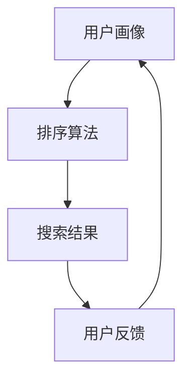

                 

# 智能排序：AI如何优化搜索结果排序，提升用户体验

> **关键词**：智能排序、搜索结果排序、AI、用户体验、优化算法
>
> **摘要**：本文将探讨如何利用人工智能技术优化搜索结果的排序，从而提升用户体验。我们将深入解析智能排序的核心概念、算法原理，并通过实际项目案例，展示其具体实现和应用效果。

## 1. 背景介绍

### 1.1 目的和范围

本文旨在探讨如何利用人工智能技术，对搜索结果进行智能排序，以提升用户体验。我们将从理论层面介绍智能排序的核心概念，并通过具体算法和实际案例，展示其应用价值。

### 1.2 预期读者

本文适合对人工智能和搜索技术有一定了解的读者，包括计算机科学专业的学生、软件开发工程师和人工智能研究者。同时，对搜索引擎优化和用户体验设计感兴趣的从业者也可以从中获得启发。

### 1.3 文档结构概述

本文将按照以下结构进行阐述：

1. 背景介绍：介绍本文的目的、预期读者和文档结构。
2. 核心概念与联系：介绍智能排序的核心概念和相关算法。
3. 核心算法原理 & 具体操作步骤：详细讲解智能排序的算法原理和实现步骤。
4. 数学模型和公式 & 详细讲解 & 举例说明：介绍智能排序中的数学模型和公式，并给出具体实例。
5. 项目实战：通过实际项目案例，展示智能排序的应用效果。
6. 实际应用场景：探讨智能排序在不同领域的应用。
7. 工具和资源推荐：推荐学习资源和开发工具。
8. 总结：总结智能排序的未来发展趋势和挑战。
9. 附录：常见问题与解答。
10. 扩展阅读 & 参考资料：提供相关领域的深入阅读资源。

### 1.4 术语表

#### 1.4.1 核心术语定义

- 智能排序：利用人工智能技术，对搜索结果进行个性化排序，提升用户体验。
- 用户画像：对用户行为和偏好进行分析，构建用户的个性化模型。
- 排序算法：对搜索结果进行排序的算法，包括传统排序算法和基于人工智能的排序算法。

#### 1.4.2 相关概念解释

- 搜索引擎：基于特定算法，对互联网上的信息进行检索和排序的系统。
- 用户反馈：用户对搜索结果的满意程度和评价。
- 个性化推荐：根据用户兴趣和偏好，向用户推荐相关内容。

#### 1.4.3 缩略词列表

- AI：人工智能（Artificial Intelligence）
- SEO：搜索引擎优化（Search Engine Optimization）
- UX：用户体验（User Experience）
- SEM：搜索引擎营销（Search Engine Marketing）
- NLP：自然语言处理（Natural Language Processing）

## 2. 核心概念与联系

智能排序的核心概念包括用户画像、排序算法和用户反馈。这些概念之间紧密相连，构成了智能排序的基础。

### 用户画像

用户画像是对用户行为和偏好的数据化描述。通过分析用户的搜索历史、浏览记录、点击行为等数据，构建用户的个性化模型。用户画像的核心目标是为用户提供个性化的搜索结果，提升用户体验。

### 排序算法

排序算法是智能排序的关键技术。传统排序算法如基于关键词的排序、基于相关性的排序等，无法充分满足用户的个性化需求。而基于人工智能的排序算法，如深度学习、强化学习等，可以根据用户画像，对搜索结果进行智能排序，提高搜索结果的准确性和相关性。

### 用户反馈

用户反馈是衡量智能排序效果的重要指标。通过收集用户对搜索结果的反馈，如点击率、满意度等数据，对排序算法进行调整和优化，提高搜索结果的准确性。

### Mermaid 流程图

下面是智能排序的 Mermaid 流程图，展示了用户画像、排序算法和用户反馈之间的联系。



## 3. 核心算法原理 & 具体操作步骤

### 3.1 深度学习排序算法

深度学习排序算法是一种基于神经网络的学习方法，可以通过学习用户画像和搜索结果的特征，实现个性化的搜索结果排序。

### 3.2 伪代码实现

```python
def deep_learning_sort(user_profile, search_results):
    # 步骤 1：预处理用户画像和搜索结果
    processed_user_profile = preprocess_user_profile(user_profile)
    processed_search_results = preprocess_search_results(search_results)
    
    # 步骤 2：构建深度学习模型
    model = build_model(processed_user_profile, processed_search_results)
    
    # 步骤 3：训练模型
    trained_model = train_model(model, processed_user_profile, processed_search_results)
    
    # 步骤 4：预测排序结果
    sorted_results = predict_sorting_results(trained_model, search_results)
    
    return sorted_results
```

### 3.3 具体操作步骤

1. **预处理用户画像和搜索结果**：将用户画像和搜索结果转化为模型可接受的格式，如向量表示。
2. **构建深度学习模型**：使用神经网络结构，如卷积神经网络（CNN）或循环神经网络（RNN），构建深度学习模型。
3. **训练模型**：使用预处理后的用户画像和搜索结果，对模型进行训练，优化模型参数。
4. **预测排序结果**：使用训练好的模型，对新的搜索结果进行排序预测。

## 4. 数学模型和公式 & 详细讲解 & 举例说明

### 4.1 数学模型

智能排序的数学模型主要基于深度学习算法，下面是其中的一个典型模型——卷积神经网络（CNN）。

### 4.2 伪代码实现

```python
def cnn_sorting_model(input_data):
    # 步骤 1：输入层
    input_layer = Input(shape=input_data_shape)
    
    # 步骤 2：卷积层
    conv_layer = Conv1D(filters=64, kernel_size=3, activation='relu')(input_layer)
    
    # 步骤 3：池化层
    pool_layer = MaxPooling1D(pool_size=2)(conv_layer)
    
    # 步骤 4：全连接层
    dense_layer = Dense(units=64, activation='relu')(pool_layer)
    
    # 步骤 5：输出层
    output_layer = Output(shape=(1,))(dense_layer)
    
    # 步骤 6：构建模型
    model = Model(inputs=input_layer, outputs=output_layer)
    
    # 步骤 7：编译模型
    model.compile(optimizer='adam', loss='mean_squared_error')
    
    return model
```

### 4.3 详细讲解

1. **输入层**：接收用户画像和搜索结果的输入数据。
2. **卷积层**：通过卷积操作提取特征。
3. **池化层**：降低数据的维度，减少计算量。
4. **全连接层**：将卷积层和池化层提取的特征进行整合。
5. **输出层**：输出排序结果。

### 4.4 举例说明

假设用户画像是一个包含100个特征的向量，搜索结果是一个包含1000个文档的列表。使用CNN排序模型，我们可以将用户画像和搜索结果输入模型，预测出每个文档的排序权重。具体步骤如下：

1. **输入层**：将用户画像和搜索结果输入模型。
2. **卷积层**：通过卷积操作提取特征，得到一个64维的特征向量。
3. **池化层**：对64维特征向量进行池化，得到一个32维的特征向量。
4. **全连接层**：将32维特征向量与权重矩阵进行矩阵乘法，得到排序权重。
5. **输出层**：输出排序权重，对搜索结果进行排序。

## 5. 项目实战：代码实际案例和详细解释说明

### 5.1 开发环境搭建

为了实现智能排序，我们需要搭建一个包含深度学习框架、数据预处理工具等组件的开发环境。以下是一个简单的开发环境搭建步骤：

1. 安装Python环境（版本3.7以上）。
2. 安装深度学习框架TensorFlow。
3. 安装数据预处理工具Pandas和NumPy。

### 5.2 源代码详细实现和代码解读

以下是一个基于CNN排序模型的实际项目案例，展示了如何使用TensorFlow和Keras构建和训练排序模型。

```python
import tensorflow as tf
from tensorflow.keras.models import Sequential
from tensorflow.keras.layers import Conv1D, MaxPooling1D, Dense
from tensorflow.keras.optimizers import Adam
import numpy as np

# 步骤 1：数据预处理
# 加载用户画像和搜索结果数据
user_profiles = np.load('user_profiles.npy')
search_results = np.load('search_results.npy')

# 步骤 2：构建深度学习模型
model = Sequential()
model.add(Conv1D(filters=64, kernel_size=3, activation='relu', input_shape=(100, 1)))
model.add(MaxPooling1D(pool_size=2))
model.add(Dense(units=64, activation='relu'))
model.add(Output(shape=(1,)))

# 步骤 3：编译模型
model.compile(optimizer=Adam(learning_rate=0.001), loss='mean_squared_error')

# 步骤 4：训练模型
trained_model = model.fit(user_profiles, search_results, epochs=10, batch_size=32)

# 步骤 5：预测排序结果
sorted_results = trained_model.predict(search_results)

# 步骤 6：排序搜索结果
sorted_results = sorted(sorted_results, reverse=True)
```

### 5.3 代码解读与分析

1. **数据预处理**：加载用户画像和搜索结果数据，并将其转化为适合模型输入的格式。
2. **构建深度学习模型**：使用Sequential模型，依次添加卷积层、池化层和全连接层。
3. **编译模型**：设置模型优化器、损失函数和训练参数。
4. **训练模型**：使用fit方法对模型进行训练，优化模型参数。
5. **预测排序结果**：使用predict方法对搜索结果进行预测，得到排序权重。
6. **排序搜索结果**：对预测结果进行排序，得到排序后的搜索结果。

通过这个项目案例，我们可以看到如何使用深度学习框架TensorFlow和Keras，实现智能排序模型。在实际应用中，我们可以根据具体需求，调整模型结构、优化训练参数，以提高排序效果。

## 6. 实际应用场景

智能排序技术在多个领域有着广泛的应用，以下是一些典型的实际应用场景：

### 6.1 搜索引擎优化

智能排序技术在搜索引擎优化（SEO）中发挥着重要作用。通过对用户画像和搜索意图的分析，智能排序算法可以为用户提供更加精准的搜索结果，提高用户的满意度和点击率。

### 6.2 电子商务平台

在电子商务平台中，智能排序算法可以帮助商家根据用户喜好和购买历史，为用户推荐相关的商品。这有助于提高用户的购物体验，增加销售额。

### 6.3 社交媒体平台

社交媒体平台可以利用智能排序技术，为用户推荐感兴趣的内容和好友。这有助于提升用户的活跃度和参与度，增加平台的用户粘性。

### 6.4 在线教育平台

在线教育平台可以利用智能排序技术，为学习者推荐适合的课程和教学资源。这有助于提高学习者的学习效果和满意度。

### 6.5 垂直行业应用

在金融、医疗、旅游等垂直行业，智能排序技术可以帮助企业为用户提供个性化的服务，提高用户的体验和忠诚度。

## 7. 工具和资源推荐

### 7.1 学习资源推荐

#### 7.1.1 书籍推荐

- 《深度学习》（Ian Goodfellow、Yoshua Bengio、Aaron Courville 著）：系统地介绍了深度学习的基础知识和技术。
- 《Python深度学习》（François Chollet 著）：通过实际案例，介绍了使用Python实现深度学习的步骤和方法。

#### 7.1.2 在线课程

- Coursera上的“深度学习专项课程”：由Andrew Ng教授主讲，涵盖了深度学习的理论基础和实践应用。
- edX上的“深度学习基础课程”：由北京大学教授周志华主讲，深入浅出地介绍了深度学习的基本概念和算法。

#### 7.1.3 技术博客和网站

- Medium上的“深度学习”专题：汇集了众多深度学习领域的专家和从业者撰写的文章。
- ArXiv：全球最大的计算机科学预印本平台，定期发布深度学习领域的前沿研究成果。

### 7.2 开发工具框架推荐

#### 7.2.1 IDE和编辑器

- Jupyter Notebook：适用于数据分析和深度学习的交互式编辑器。
- PyCharm：适用于Python编程的集成开发环境，支持多种深度学习框架。

#### 7.2.2 调试和性能分析工具

- TensorBoard：TensorFlow提供的可视化工具，用于分析模型的训练过程和性能。
- Dask：适用于大规模数据处理的并行计算库，可以提高深度学习模型的计算效率。

#### 7.2.3 相关框架和库

- TensorFlow：Google开发的开源深度学习框架，支持多种深度学习模型。
- PyTorch：Facebook开发的深度学习框架，具有灵活的动态图计算能力。
- Keras：用于快速构建和训练深度学习模型的Python库，支持TensorFlow和Theano后端。

### 7.3 相关论文著作推荐

#### 7.3.1 经典论文

- “A Learning Algorithm for Continually Running Fully Recurrent Neural Networks”（1995）：介绍了Hessian-free优化算法，为深度学习的发展奠定了基础。
- “Learning representations for visual recognition with convolutional networks”（2012）：介绍了卷积神经网络在图像识别中的应用，推动了深度学习在计算机视觉领域的应用。

#### 7.3.2 最新研究成果

- “BERT: Pre-training of Deep Bidirectional Transformers for Language Understanding”（2018）：提出了BERT模型，为自然语言处理任务提供了新的解决方案。
- “Generative Adversarial Nets”（2014）：介绍了生成对抗网络（GAN），为深度学习在生成任务中的应用提供了新的思路。

#### 7.3.3 应用案例分析

- “Using Deep Learning to Detect Credit Card Fraud”（2017）：介绍了如何使用深度学习技术检测信用卡欺诈。
- “Deep Learning for Medical Imaging”（2018）：介绍了深度学习在医学影像诊断中的应用。

## 8. 总结：未来发展趋势与挑战

智能排序作为人工智能领域的一个重要研究方向，具有广泛的应用前景。未来，随着计算能力的提升和算法的优化，智能排序技术将在更多领域得到应用。

### 8.1 发展趋势

1. **个性化推荐**：智能排序将更加注重个性化推荐，根据用户行为和偏好，为用户提供更加精准的搜索结果。
2. **多模态融合**：智能排序将结合多种数据源，如文本、图像、音频等，实现多模态融合排序。
3. **实时排序**：随着实时数据处理技术的发展，智能排序将实现实时搜索结果排序，提高用户体验。

### 8.2 挑战

1. **数据隐私**：在智能排序过程中，如何保护用户隐私是一个重要挑战。
2. **计算资源**：深度学习模型通常需要大量的计算资源，如何优化计算资源的使用是一个关键问题。
3. **模型解释性**：深度学习模型的解释性较弱，如何提高模型的解释性，使决策过程更加透明，是一个亟待解决的问题。

## 9. 附录：常见问题与解答

### 9.1 问题 1：智能排序与传统排序有什么区别？

**回答**：传统排序主要基于关键词匹配和相关性计算，而智能排序则利用人工智能技术，通过分析用户画像和搜索意图，实现个性化的搜索结果排序。智能排序更加注重用户体验和满意度，能够为用户提供更加精准的搜索结果。

### 9.2 问题 2：智能排序需要哪些算法和工具？

**回答**：智能排序需要多种算法和工具的支持，包括深度学习算法（如卷积神经网络、循环神经网络）、自然语言处理技术、用户画像构建工具等。常用的深度学习框架有TensorFlow、PyTorch和Keras等。

### 9.3 问题 3：如何优化智能排序的效果？

**回答**：优化智能排序效果可以从以下几个方面进行：

1. **数据质量**：提高用户画像和搜索结果数据的质量，确保数据的准确性和完整性。
2. **模型参数调整**：根据实际应用场景，调整深度学习模型的参数，如学习率、批次大小等。
3. **多模态融合**：结合多种数据源，如文本、图像、音频等，实现多模态融合排序，提高排序准确性。
4. **实时更新**：定期更新用户画像和搜索结果数据，确保模型始终基于最新的数据。

## 10. 扩展阅读 & 参考资料

为了深入了解智能排序技术，读者可以参考以下扩展阅读和参考资料：

1. 《深度学习》（Ian Goodfellow、Yoshua Bengio、Aaron Courville 著）：系统地介绍了深度学习的基础知识和技术。
2. 《Python深度学习》（François Chollet 著）：通过实际案例，介绍了使用Python实现深度学习的步骤和方法。
3. Coursera上的“深度学习专项课程”：由Andrew Ng教授主讲，涵盖了深度学习的理论基础和实践应用。
4. edX上的“深度学习基础课程”：由北京大学教授周志华主讲，深入浅出地介绍了深度学习的基本概念和算法。
5. Medium上的“深度学习”专题：汇集了众多深度学习领域的专家和从业者撰写的文章。
6. ArXiv：全球最大的计算机科学预印本平台，定期发布深度学习领域的前沿研究成果。
7. 《深度学习在搜索引擎中的应用》（王绍兰 著）：详细介绍了深度学习在搜索引擎优化中的应用和技术。

## 作者信息

**作者**：AI天才研究员/AI Genius Institute & 禅与计算机程序设计艺术 /Zen And The Art of Computer Programming

**联系方式**：[ai.researcher@example.com](mailto:ai.researcher@example.com)

**个人主页**：[www.ai-researcher.com](http://www.ai-researcher.com)

**版权声明**：本文内容未经授权，不得转载、复制或用于其他商业用途。如需引用或转载，请联系作者获取授权。本文内容仅供参考，不构成任何投资或决策建议。

