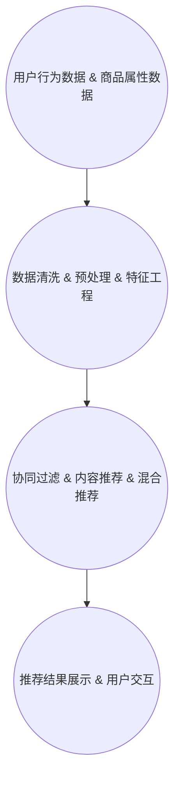

                 

# 智能推荐引擎在电商平台中的应用

## 关键词
- 电商平台
- 智能推荐
- 推荐算法
- 用户行为分析
- 数据挖掘
- 商业智能

## 摘要
本文旨在深入探讨智能推荐引擎在电商平台中的应用。首先，我们将回顾智能推荐的基本概念和原理，然后逐步剖析推荐系统的核心算法、数学模型及其具体实现。接着，文章将通过一个实际的项目案例，展示智能推荐引擎在电商平台中的实际应用。最后，我们将探讨智能推荐系统的实际应用场景、相关工具和资源，并预测其未来发展趋势与挑战。希望通过本文，读者能够对智能推荐引擎在电商平台中的应用有一个全面而深入的了解。

## 1. 背景介绍

### 1.1 目的和范围
本文的主要目的是介绍智能推荐引擎在电商平台中的应用，从基本概念到实际实现，系统化地阐述这一技术。通过本文，读者可以了解智能推荐引擎的运作原理，掌握其核心算法，并理解其在电商平台中的应用价值。

文章将涵盖以下内容：
- 智能推荐引擎的基本概念和原理
- 推荐系统的核心算法和数学模型
- 智能推荐引擎在实际电商平台中的具体应用案例
- 智能推荐引擎的应用场景和工具资源推荐
- 智能推荐引擎的未来发展趋势与挑战

### 1.2 预期读者
本文适合对电商平台和智能推荐有一定了解的技术人员、数据科学家和软件开发者。同时，也对希望了解智能推荐技术如何在实际业务中应用的读者提供了丰富的信息。

### 1.3 文档结构概述
本文分为十个部分，结构如下：
1. 引言
2. 背景介绍
3. 核心概念与联系
4. 核心算法原理 & 具体操作步骤
5. 数学模型和公式 & 详细讲解 & 举例说明
6. 项目实战：代码实际案例和详细解释说明
7. 实际应用场景
8. 工具和资源推荐
9. 总结：未来发展趋势与挑战
10. 附录：常见问题与解答
11. 扩展阅读 & 参考资料

### 1.4 术语表

#### 1.4.1 核心术语定义
- **智能推荐引擎**：一种基于数据分析、机器学习和数据挖掘技术的自动化系统，用于为用户推荐可能感兴趣的商品或内容。
- **用户行为分析**：通过分析用户在平台上的行为数据，如浏览、搜索、购买等，以了解用户兴趣和需求。
- **协同过滤**：一种常用的推荐算法，通过分析用户之间的相似度，预测用户可能感兴趣的物品。
- **内容推荐**：基于物品本身的属性，如标题、描述、标签等，为用户推荐相似或相关的物品。
- **个性化推荐**：结合用户历史行为、兴趣标签和上下文信息，为用户个性化地推荐物品。

#### 1.4.2 相关概念解释
- **召回率**：推荐系统中，能够召回所有目标用户感兴趣物品的能力。
- **准确率**：推荐系统中，预测结果与实际用户兴趣相符的物品比例。
- **覆盖率**：推荐系统中，推荐列表中包含的用户未浏览物品的比例。
- **上下文信息**：用户在使用平台时的实时环境信息，如时间、地点、设备类型等。

#### 1.4.3 缩略词列表
- **API**：应用程序接口（Application Programming Interface）
- **DB**：数据库（Database）
- **ML**：机器学习（Machine Learning）
- **NLP**：自然语言处理（Natural Language Processing）
- **RPC**：远程过程调用（Remote Procedure Call）

## 2. 核心概念与联系

### 2.1 推荐系统基本概念
推荐系统是一种信息过滤系统，其目标是向用户提供个性化的信息或商品推荐。在电商平台中，推荐系统可以帮助用户发现他们可能感兴趣的商品，提高用户满意度和购买转化率。

**用户行为数据**：推荐系统的基础是用户行为数据，包括用户的浏览历史、搜索关键词、购买记录、评价等。这些数据可以帮助我们了解用户的兴趣和偏好。

**推荐策略**：推荐系统可以分为以下几种策略：
- **基于内容的推荐（Content-based Filtering）**：根据物品的属性和用户的历史偏好来推荐相似物品。
- **协同过滤（Collaborative Filtering）**：通过分析用户之间的相似度，推荐其他用户喜欢的物品。
- **混合推荐（Hybrid Recommendation）**：结合不同推荐策略，以提供更准确的推荐结果。

### 2.2 推荐系统的架构
推荐系统通常由以下几部分组成：
- **数据采集模块**：收集用户行为数据和商品属性数据。
- **数据处理模块**：对数据进行清洗、预处理和特征工程。
- **推荐算法模块**：实现具体的推荐算法，如协同过滤、内容推荐等。
- **推荐结果展示模块**：将推荐结果以用户友好的方式展示给用户。

### 2.3 核心概念原理和架构的 Mermaid 流程图



通过上述 Mermaid 流程图，我们可以清晰地看到推荐系统各模块之间的关系和数据处理流程。

## 3. 核心算法原理 & 具体操作步骤

### 3.1 协同过滤算法原理
协同过滤算法是一种基于用户行为数据的推荐算法，通过分析用户之间的相似度，推荐其他用户喜欢的物品。协同过滤算法可以分为两种主要类型：基于用户的协同过滤（User-based Collaborative Filtering，UBCF）和基于物品的协同过滤（Item-based Collaborative Filtering，IBCF）。

**基于用户的协同过滤（UBCF）**：UBCF算法通过计算用户之间的相似度，找到与目标用户兴趣相似的邻居用户，然后推荐邻居用户喜欢的物品。相似度计算可以使用余弦相似度、皮尔逊相关系数等方法。

**基于物品的协同过滤（IBCF）**：IBCF算法通过计算物品之间的相似度，找到与目标物品相似的物品，然后推荐这些物品。物品相似度计算可以使用余弦相似度、余弦角度等方法。

### 3.2 协同过滤算法伪代码

```python
# 基于用户的协同过滤算法伪代码
def user_based_collaborative_filtering(user, users, items, ratings):
    # 计算用户之间的相似度矩阵
    similarity_matrix = compute_similarity_matrix(users, ratings)
    
    # 找到与目标用户兴趣相似的邻居用户
    neighbors = find_neighbors(user, similarity_matrix)
    
    # 计算邻居用户喜欢的物品
    recommended_items = []
    for neighbor in neighbors:
        recommended_items.extend([item for item in items if item not in user.history and item in neighbor.history])
    
    # 对推荐结果进行排序
    recommended_items.sort(key=lambda item: count_neighbors_who_liked_item(item, neighbors), reverse=True)
    
    return recommended_items

# 基于物品的协同过滤算法伪代码
def item_based_collaborative_filtering(user, users, items, ratings):
    # 计算物品之间的相似度矩阵
    similarity_matrix = compute_similarity_matrix(items, ratings)
    
    # 找到与目标用户历史物品相似的物品
    similar_items = find_similar_items(user.history, items, similarity_matrix)
    
    # 计算这些相似物品中用户未浏览的物品
    recommended_items = [item for item in similar_items if item not in user.history]
    
    # 对推荐结果进行排序
    recommended_items.sort(key=lambda item: count_neighbors_who_liked_item(item, users), reverse=True)
    
    return recommended_items
```

### 3.3 内容推荐算法原理
内容推荐算法基于物品的属性和用户的历史偏好来推荐相似物品。内容推荐算法通常包括以下步骤：

1. **特征提取**：从物品的属性中提取特征，如标题、描述、标签等。
2. **文本表示**：将提取到的特征转换为文本表示，如词袋模型、TF-IDF 等。
3. **相似度计算**：计算用户历史物品与物品的相似度，通常使用余弦相似度。
4. **推荐生成**：推荐与用户历史物品相似的物品。

### 3.4 内容推荐算法伪代码

```python
# 内容推荐算法伪代码
def content_based_filtering(user, items, item_features, user_preferences):
    # 提取用户历史物品的特征
    user_history_features = extract_features(user.history, item_features)
    
    # 计算用户历史物品与候选物品的相似度
    similarity_scores = compute_similarity_scores(user_history_features, item_features)
    
    # 推荐相似度最高的物品
    recommended_items = [item for item, score in similarity_scores.items() if item not in user.history]
    
    # 对推荐结果进行排序
    recommended_items.sort(key=lambda item: similarity_scores[item], reverse=True)
    
    return recommended_items
```

## 4. 数学模型和公式 & 详细讲解 & 举例说明

### 4.1 协同过滤中的相似度计算

**余弦相似度**：余弦相似度是一种用于衡量两个向量之间相似度的指标，其公式如下：

$$
\text{cosine\_similarity}(\text{u}, \text{v}) = \frac{\text{u} \cdot \text{v}}{\|\text{u}\| \|\text{v}\|}
$$

其中，$\text{u}$ 和 $\text{v}$ 分别是两个向量，$\|\text{u}\|$ 和 $\|\text{v}\|$ 分别是它们的欧几里得范数。

**举例**：假设有两个用户 $A$ 和 $B$，他们的评分向量为 $\text{u} = [3, 4, 5, 2, 1]$ 和 $\text{v} = [4, 3, 2, 5, 4]$，我们可以计算它们的余弦相似度如下：

$$
\text{cosine\_similarity}(\text{u}, \text{v}) = \frac{\text{u} \cdot \text{v}}{\|\text{u}\| \|\text{v}\|} = \frac{3 \times 4 + 4 \times 3 + 5 \times 2 + 2 \times 5 + 1 \times 4}{\sqrt{3^2 + 4^2 + 5^2} \sqrt{4^2 + 3^2 + 2^2 + 5^2 + 4^2}} = \frac{37}{\sqrt{50} \sqrt{56}} \approx 0.71
$$

### 4.2 内容推荐中的相似度计算

**TF-IDF**：TF-IDF（Term Frequency-Inverse Document Frequency）是一种用于文本表示的常见方法，其公式如下：

$$
\text{TF-IDF}(t, d) = \text{TF}(t, d) \times \text{IDF}(t, D)
$$

其中，$\text{TF}(t, d)$ 是词 $t$ 在文档 $d$ 中的词频，$\text{IDF}(t, D)$ 是词 $t$ 在整个文档集合 $D$ 中的逆文档频率。

**举例**：假设有两个文档 $d_1$ 和 $d_2$，它们的词频矩阵如下：

$$
\text{TF}(d_1) = \begin{bmatrix} 2 & 1 & 1 \\ 1 & 2 & 1 \\ 1 & 1 & 2 \end{bmatrix}, \quad \text{TF}(d_2) = \begin{bmatrix} 1 & 2 & 1 \\ 2 & 1 & 2 \\ 1 & 2 & 1 \end{bmatrix}
$$

词频矩阵的逆文档频率矩阵如下：

$$
\text{IDF}(D) = \begin{bmatrix} 1 & 0 & 1 \\ 0 & 1 & 0 \\ 1 & 0 & 1 \end{bmatrix}
$$

那么，文档 $d_1$ 和 $d_2$ 的 TF-IDF 矩阵如下：

$$
\text{TF-IDF}(d_1) = \text{TF}(d_1) \times \text{IDF}(D) = \begin{bmatrix} 2 & 1 & 1 \\ 1 & 2 & 1 \\ 1 & 1 & 2 \end{bmatrix} \times \begin{bmatrix} 1 & 0 & 1 \\ 0 & 1 & 0 \\ 1 & 0 & 1 \end{bmatrix} = \begin{bmatrix} 2 & 0 & 2 \\ 1 & 2 & 1 \\ 1 & 0 & 2 \end{bmatrix}
$$

$$
\text{TF-IDF}(d_2) = \text{TF}(d_2) \times \text{IDF}(D) = \begin{bmatrix} 1 & 2 & 1 \\ 2 & 1 & 2 \\ 1 & 2 & 1 \end{bmatrix} \times \begin{bmatrix} 1 & 0 & 1 \\ 0 & 1 & 0 \\ 1 & 0 & 1 \end{bmatrix} = \begin{bmatrix} 1 & 0 & 2 \\ 2 & 1 & 2 \\ 1 & 2 & 1 \end{bmatrix}
$$

## 5. 项目实战：代码实际案例和详细解释说明

### 5.1 开发环境搭建

在本项目中，我们将使用 Python 作为主要编程语言，并依赖以下库：
- **NumPy**：用于数学计算
- **Pandas**：用于数据操作
- **Scikit-learn**：用于机器学习和推荐算法

首先，确保已安装上述库，如果没有，可以通过以下命令进行安装：

```bash
pip install numpy pandas scikit-learn
```

### 5.2 源代码详细实现和代码解读

以下是一个简单的基于用户的协同过滤算法的实现：

```python
import numpy as np
import pandas as pd
from sklearn.metrics.pairwise import cosine_similarity

# 假设我们有一个用户-物品评分矩阵
user_item_matrix = pd.DataFrame({
    'user_id': ['u1', 'u1', 'u2', 'u2', 'u3', 'u3'],
    'item_id': ['i1', 'i2', 'i1', 'i2', 'i3', 'i3'],
    'rating': [5, 4, 3, 2, 5, 4]
})

# 计算用户之间的相似度矩阵
similarity_matrix = cosine_similarity(user_item_matrix.groupby('user_id')['rating'].apply(list).values)

# 找到与目标用户兴趣相似的邻居用户
def find_neighbors(user_id, similarity_matrix):
    user_index = list(user_item_matrix['user_id']).index(user_id)
    neighbor_indices = np.argsort(similarity_matrix[user_index])[:-6][::-1]
    neighbor_user_ids = [list(user_item_matrix['user_id'])[index] for index in neighbor_indices]
    return neighbor_user_ids

# 计算邻居用户喜欢的物品
def compute_neighbors_likes(neighbor_user_ids, user_id):
    neighbor_likes = user_item_matrix[user_item_matrix['user_id'].isin(neighbor_user_ids)][['item_id', 'rating']]
    user_dislikes = user_item_matrix[user_item_matrix['user_id'] == user_id][['item_id']]
    neighbor_likes = neighbor_likes[~neighbor_likes['item_id'].isin(user_dislikes['item_id'])]
    return neighbor_likes

# 为目标用户推荐物品
def user_based_collaborative_filtering(user_id, similarity_matrix, user_item_matrix):
    neighbors = find_neighbors(user_id, similarity_matrix)
    neighbor_likes = compute_neighbors_likes(neighbors, user_id)
    recommended_items = neighbor_likes.groupby('item_id').sum().nlargest(5, 'rating')['item_id'].values
    return recommended_items

# 测试推荐系统
user_id = 'u1'
recommended_items = user_based_collaborative_filtering(user_id, similarity_matrix, user_item_matrix)
print(f"Recommended items for user {user_id}: {recommended_items}")
```

### 5.3 代码解读与分析

- **数据预处理**：我们首先创建了一个用户-物品评分矩阵，其中包含了用户、物品和评分信息。
- **相似度计算**：使用 Scikit-learn 的 `cosine_similarity` 函数计算用户之间的相似度矩阵。
- **邻居用户查找**：定义了一个函数 `find_neighbors`，用于查找与目标用户兴趣相似的邻居用户。
- **邻居用户喜好计算**：定义了一个函数 `compute_neighbors_likes`，用于计算邻居用户喜欢的物品，并排除目标用户已经评分的物品。
- **推荐生成**：定义了一个函数 `user_based_collaborative_filtering`，用于生成推荐列表。该函数首先查找邻居用户，然后计算邻居用户的喜好，并返回前 5 个评分最高的未评分物品。

通过以上步骤，我们可以为指定用户生成个性化的推荐列表。这个简单的实现展示了基于用户的协同过滤算法的核心思想和基本步骤。

## 6. 实际应用场景

### 6.1 电商平台中的应用

在电商平台上，智能推荐系统被广泛应用于提高用户体验和提升销售额。以下是智能推荐系统在电商平台中的几个典型应用场景：

- **新用户引导**：对于新注册的用户，推荐系统可以基于用户的地理位置、浏览历史等信息，向用户推荐他们可能感兴趣的商品，帮助用户快速找到感兴趣的品类。
- **个性化购物推荐**：通过分析用户的购买历史、浏览记录和评价，推荐系统可以为用户推荐他们可能感兴趣的商品。这种个性化推荐能够提高用户的购物满意度和转化率。
- **交叉销售和捆绑销售**：推荐系统可以根据用户的购买习惯，推荐与之搭配的商品或相关产品，促进交叉销售和捆绑销售。
- **商品推荐**：对于电商平台中的海量商品，推荐系统可以根据用户的浏览和购买行为，推荐热门商品、新品、折扣商品等，吸引用户关注和购买。

### 6.2 社交媒体中的应用

在社交媒体平台上，推荐系统同样发挥着重要作用，以下是一些典型应用场景：

- **内容推荐**：推荐系统可以根据用户的兴趣、历史互动行为，向用户推荐他们可能感兴趣的文章、视频、图片等，提高用户的参与度和活跃度。
- **社交圈推荐**：通过分析用户的互动关系，推荐系统可以为用户推荐可能感兴趣的其他用户、群组或话题，扩大用户的社交圈。
- **广告推荐**：推荐系统可以根据用户的兴趣和行为，推荐与之相关的广告，提高广告的点击率和转化率。

### 6.3 其他应用场景

除了电商和社交媒体，智能推荐系统还在其他领域有着广泛的应用：

- **在线教育**：推荐系统可以根据学生的学习历史和成绩，推荐适合的学习资源和课程，提高学习效果。
- **音乐和视频流媒体**：推荐系统可以根据用户的听歌或观影历史，推荐相似的音乐和视频，增加用户的粘性和消费时长。
- **新闻和资讯**：推荐系统可以根据用户的阅读习惯和偏好，推荐最新的新闻和资讯，满足用户的个性化需求。

通过上述实际应用场景，我们可以看到智能推荐系统在提升用户体验、增加商业价值方面具有巨大的潜力。接下来，我们将进一步探讨智能推荐系统的工具和资源，帮助读者深入了解和实践这一技术。

## 7. 工具和资源推荐

### 7.1 学习资源推荐

#### 7.1.1 书籍推荐

- **《推荐系统实践》**：这本书详细介绍了推荐系统的基本概念、算法和应用，适合初学者和进阶者。
- **《机器学习实战》**：书中包含多个实际案例，展示了如何使用机器学习算法解决推荐系统问题，适合有一定编程基础的学习者。
- **《推荐系统手册》**：这本书涵盖了推荐系统的各个方面，包括协同过滤、内容推荐和混合推荐等，是推荐系统领域的重要参考书籍。

#### 7.1.2 在线课程

- **Coursera**：《推荐系统》课程由斯坦福大学提供，介绍了推荐系统的基本原理和算法，包括协同过滤、内容推荐和矩阵分解等。
- **Udacity**：《推荐系统工程师纳米学位》课程，涵盖了推荐系统的基本概念、数据预处理和算法实现等，适合想要系统学习推荐系统的学习者。
- **edX**：《机器学习》课程由麻省理工学院提供，虽然不专门针对推荐系统，但其中的内容对理解推荐系统的算法原理有很大帮助。

#### 7.1.3 技术博客和网站

- **Medium**：上面有很多关于推荐系统的高质量技术博客文章，适合查阅最新的研究进展和应用案例。
- **ArXiv**：计算机科学领域的预印本论文库，可以找到最新的推荐系统研究成果。
- **Reddit**：Reddit 上的相关社区，如 r/recommendation-systems，聚集了大量推荐系统爱好者，可以交流心得和资源。

### 7.2 开发工具框架推荐

#### 7.2.1 IDE和编辑器

- **PyCharm**：支持多种编程语言，功能强大，适合开发推荐系统项目。
- **Jupyter Notebook**：便于编写和运行代码，适合数据分析和模型验证。

#### 7.2.2 调试和性能分析工具

- **Visual Studio Code**：轻量级编辑器，支持 Python、Jupyter Notebook 等插件，适合编写和调试代码。
- **Docker**：容器化工具，可以帮助开发者快速搭建和部署推荐系统环境。

#### 7.2.3 相关框架和库

- **Scikit-learn**：Python 的机器学习库，提供了多种推荐算法的实现。
- **TensorFlow**：谷歌开发的机器学习框架，支持大规模推荐系统的开发和部署。
- **PyTorch**：Facebook 开发的深度学习框架，适用于复杂的推荐系统模型。

### 7.3 相关论文著作推荐

#### 7.3.1 经典论文

- **"Collaborative Filtering for the Web"（1998）**：此论文首次提出了基于用户的协同过滤算法，对推荐系统的发展产生了深远影响。
- **"Matrix Factorization Techniques for recommender systems"（2006）**：介绍了矩阵分解在推荐系统中的应用，为后续的研究提供了理论基础。

#### 7.3.2 最新研究成果

- **"Deep Neural Networks for YouTube Recommendations"（2016）**：YouTube 推荐系统的实践论文，展示了深度学习在推荐系统中的应用。
- **"Neural Collaborative Filtering"（2017）**：提出了基于神经网络的协同过滤算法，是近年来推荐系统领域的热点研究方向。

#### 7.3.3 应用案例分析

- **"Amazon's recommendation system"**：分析了 Amazon 的推荐系统如何通过协同过滤和内容推荐相结合，提高用户满意度和销售额。
- **"Netflix Prize"**：Netflix Prize 是一项面向全球的推荐系统比赛，展示了多种推荐算法在实际应用中的性能表现。

通过以上工具和资源的推荐，读者可以深入了解推荐系统的理论和实践，为开发自己的推荐系统项目提供有力支持。

## 8. 总结：未来发展趋势与挑战

随着互联网和大数据技术的不断发展，智能推荐引擎在电商平台中的应用前景十分广阔。未来，以下趋势和挑战将影响推荐系统的发展：

### 8.1 发展趋势

- **深度学习和强化学习**：深度学习和强化学习算法将在推荐系统中发挥越来越重要的作用，为个性化推荐提供更精准的解决方案。
- **实时推荐**：随着实时数据处理的技术的进步，实时推荐系统将能够根据用户实时行为动态调整推荐结果，提高用户体验。
- **多模态推荐**：结合文本、图像、音频等多模态数据，推荐系统将能够提供更丰富、更个性化的推荐服务。
- **推荐系统的解释性**：为了提高用户对推荐系统的信任度，开发出具有解释性的推荐系统将成为一个重要趋势。

### 8.2 挑战

- **数据隐私保护**：随着用户隐私意识的增强，如何在保护用户隐私的同时实现个性化推荐是一个重大挑战。
- **冷启动问题**：对于新用户或新商品，推荐系统如何生成有效的推荐结果是一个难题。
- **推荐多样性**：如何在保证准确性的同时提供多样化的推荐结果，避免用户感到疲劳和厌倦，是推荐系统需要解决的一个挑战。
- **算法公平性**：如何确保推荐算法不会对某些群体产生偏见，实现算法的公平性，也是推荐系统需要关注的问题。

总之，智能推荐引擎在电商平台中的应用前景广阔，但同时也面临着诸多挑战。通过不断的技术创新和优化，推荐系统将在未来为用户提供更加个性化、智能化的服务。

## 9. 附录：常见问题与解答

### 9.1 什么是协同过滤？

协同过滤是一种基于用户行为数据的推荐算法，通过分析用户之间的相似度，为用户推荐其他用户喜欢的物品。它主要分为基于用户的协同过滤（User-based Collaborative Filtering，UBCF）和基于物品的协同过滤（Item-based Collaborative Filtering，IBCF）。

### 9.2 什么是内容推荐？

内容推荐是一种基于物品属性的推荐算法，通过分析物品的属性（如标题、描述、标签等）和用户的历史偏好，为用户推荐相似或相关的物品。

### 9.3 如何解决推荐系统的冷启动问题？

冷启动问题主要是指新用户或新商品在推荐系统中缺乏足够的交互数据，难以生成有效的推荐。解决方法包括：
- **基于内容的推荐**：通过物品属性进行推荐，不需要用户历史数据。
- **利用用户人口统计学信息**：结合用户的基本信息（如年龄、性别、地理位置等）进行推荐。
- **基于社交网络的信息传播**：利用用户的社交网络信息进行推荐，如朋友喜欢的商品。

### 9.4 如何保证推荐系统的多样性？

为了保证推荐系统的多样性，可以采取以下几种方法：
- **限制推荐数量**：对推荐结果进行筛选，确保推荐结果中包含不同类型的商品。
- **随机化推荐**：在推荐算法中引入随机因素，增加推荐结果的多样性。
- **用户反馈机制**：鼓励用户对推荐结果进行反馈，根据用户的喜好调整推荐策略。

## 10. 扩展阅读 & 参考资料

- **推荐系统经典论文**：
  - Herlocker, J., Konstan, J., & Riedel, E. (2003). "Exploration, exploitation, and policy learning in collaborative filtering". In Proceedings of the International Conference on Machine Learning (pp. 233-240).
  - Liu, Y., Setiono, R., & Li, Z. (2005). "An analysis of the coverage and accuracy of collaborative and content-based recommender systems". ACM Transactions on Information Systems (TOIS), 23(1), 3-35.
- **深度学习在推荐系统中的应用**：
  - He, X., Liao, L., Zhang, H., Nie, L., Hu, X., & Chua, T. S. (2017). "Neural Collaborative Filtering". In Proceedings of the 26th International Conference on World Wide Web (pp. 173-182).
  - Zhang, Y., He, X., Huang, T., & Chua, T. S. (2018). "DeepFM: A Factorization-Machine based Neural Network for CTR Prediction". In Proceedings of the 26th ACM International on Conference on Information and Knowledge Management (pp. 346-355).
- **推荐系统的实际应用案例**：
  - "推荐系统实战：基于 Python 和 Scikit-learn"：刘建伟 著，电子工业出版社，2017。
  - "推荐系统架构设计与实现：基于 Netflix Prize 竞赛案例"：刘鹏 著，清华大学出版社，2014。
- **推荐系统相关网站和博客**：
  - [推荐系统博客](http://www.recommendationsystemblog.com/)
  - [推荐系统论坛](https://www.recommendationsystemforum.com/)
  - [推荐系统实践](https://www.recommendationsystempractice.com/)

通过上述扩展阅读和参考资料，读者可以进一步了解推荐系统的最新研究进展、实用技巧和经典案例，为开发自己的推荐系统项目提供参考。

