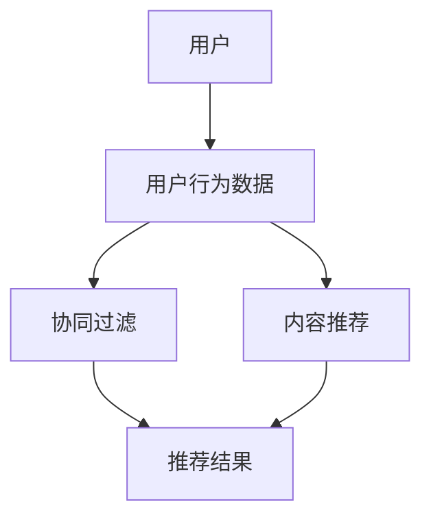

                 

# 智能推荐系统：AI个性化推荐的实现

> 关键词：推荐系统、机器学习、用户行为分析、协同过滤、内容推荐、深度学习

> 摘要：本文将深入探讨智能推荐系统的原理、核心算法和实现方法。通过分析用户行为数据，使用协同过滤和深度学习等技术，构建出个性化的推荐系统。文章旨在为读者提供一个全面的技术指南，帮助他们理解和实现自己的推荐系统。

## 1. 背景介绍

### 1.1 目的和范围

本文的目标是探讨智能推荐系统的基本概念、核心算法和实现方法，以帮助读者理解如何构建一个高效的个性化推荐系统。文章的范围包括：

- 推荐系统的基本原理和架构
- 核心算法原理和实现步骤
- 数学模型和公式的详细解释
- 项目实战案例和代码实现
- 实际应用场景和技术发展趋势

### 1.2 预期读者

本文适合以下读者群体：

- 计算机科学和人工智能领域的研究生和博士生
- 数据科学和机器学习工程师
- 对推荐系统技术感兴趣的程序员和技术爱好者
- 希望提升推荐系统开发技能的技术经理和CTO

### 1.3 文档结构概述

本文将按照以下结构展开：

- 1. 背景介绍
- 2. 核心概念与联系
- 3. 核心算法原理 & 具体操作步骤
- 4. 数学模型和公式 & 详细讲解 & 举例说明
- 5. 项目实战：代码实际案例和详细解释说明
- 6. 实际应用场景
- 7. 工具和资源推荐
- 8. 总结：未来发展趋势与挑战
- 9. 附录：常见问题与解答
- 10. 扩展阅读 & 参考资料

### 1.4 术语表

#### 1.4.1 核心术语定义

- 推荐系统（Recommender System）：一种根据用户的历史行为和偏好，向用户推荐相关物品的系统。
- 协同过滤（Collaborative Filtering）：一种基于用户行为数据预测用户对物品偏好的方法。
- 内容推荐（Content-based Filtering）：一种基于物品的特征信息预测用户偏好的方法。
- 深度学习（Deep Learning）：一种基于多层神经网络进行特征学习和预测的技术。

#### 1.4.2 相关概念解释

- 用户行为数据（User Behavior Data）：用户在系统中的交互记录，如浏览、购买、评分等。
- 物品特征（Item Features）：描述物品属性的信息，如书籍的作者、类别、标签等。
- 预测（Prediction）：根据用户历史行为和物品特征预测用户对物品的偏好。

#### 1.4.3 缩略词列表

- ML：Machine Learning（机器学习）
- DL：Deep Learning（深度学习）
- CF：Collaborative Filtering（协同过滤）
- CBF：Content-based Filtering（内容推荐）

## 2. 核心概念与联系

在构建智能推荐系统时，理解核心概念和它们之间的联系至关重要。以下是一个简化的 Mermaid 流程图，展示推荐系统的主要组件和它们之间的交互关系。



### 2.1 用户与用户行为数据

用户是推荐系统的核心，用户行为数据包括用户的历史浏览记录、购买记录、评分记录等。这些数据用于训练推荐算法，以预测用户对未知物品的偏好。

### 2.2 协同过滤与内容推荐

协同过滤和内容推荐是推荐系统的两种主要方法。协同过滤通过分析用户与物品之间的交互历史，找出相似用户和相似物品，从而预测用户对未知物品的偏好。内容推荐通过分析物品的特征信息，找出与用户历史偏好相似的物品，从而预测用户对未知物品的偏好。

### 2.3 推荐结果

协同过滤和内容推荐算法会生成一组推荐结果，这些结果根据预测的偏好得分进行排序。最终，推荐系统会向用户展示这些推荐结果，以帮助用户发现新的兴趣和偏好。

## 3. 核心算法原理 & 具体操作步骤

### 3.1 协同过滤算法原理

协同过滤算法主要分为基于用户的协同过滤（User-based CF）和基于物品的协同过滤（Item-based CF）。

#### 基于用户的协同过滤（User-based CF）

1. 计算相似度矩阵

   首先，我们需要计算用户之间的相似度矩阵。相似度可以通过余弦相似度、皮尔逊相关系数等度量方法计算。

   ```python
   def similarity_matrix(users, ratings):
       similarity = {}
       for user in users:
           similarity[user] = {}
           for other_user in users:
               if user != other_user:
                   # 计算相似度
                   similarity[user][other_user] = cosine_similarity(ratings[user], ratings[other_user])
       return similarity
   ```

2. 找出相似用户

   对于给定的用户，找出与其相似度最高的若干用户。

   ```python
   def find_similar_users(similarity_matrix, user, k):
       similar_users = []
       for other_user in similarity_matrix[user]:
           if other_user in similarity_matrix[user]:
               similar_users.append((other_user, similarity_matrix[user][other_user]))
       similar_users.sort(key=lambda x: x[1], reverse=True)
       return similar_users[:k]
   ```

3. 计算预测评分

   对于给定的用户和物品，根据相似用户的评分预测用户的评分。

   ```python
   def predict_rating(similarity_matrix, ratings, user, item, k):
       similar_users = find_similar_users(similarity_matrix, user, k)
       predicted_rating = 0
       for other_user, similarity in similar_users:
           predicted_rating += similarity * (ratings[other_user][item] - ratings[other_user].mean())
       predicted_rating /= sum(similarity for _, similarity in similar_users)
       return predicted_rating
   ```

#### 基于物品的协同过滤（Item-based CF）

1. 计算相似度矩阵

   计算物品之间的相似度矩阵，方法与基于用户的协同过滤相同。

2. 找出相似物品

   对于给定的物品，找出与其相似度最高的若干物品。

3. 计算预测评分

   对于给定的用户和物品，根据相似物品的评分预测用户的评分。

### 3.2 内容推荐算法原理

内容推荐算法通过分析物品的特征信息，找出与用户历史偏好相似的物品。

1. 提取物品特征

   从数据集中提取物品的特征信息，如书籍的作者、类别、标签等。

2. 计算相似度

   计算用户历史偏好与物品特征之间的相似度，可以使用TF-IDF、词嵌入等方法。

3. 计算预测得分

   根据物品的相似度得分，预测用户对物品的偏好。

## 4. 数学模型和公式 & 详细讲解 & 举例说明

### 4.1 余弦相似度

余弦相似度是一种衡量两个向量之间相似度的方法，其数学公式如下：

$$
\cos(\theta) = \frac{\vec{a} \cdot \vec{b}}{|\vec{a}| |\vec{b}|}
$$

其中，$\vec{a}$和$\vec{b}$是两个向量，$\theta$是它们之间的夹角。

#### 举例说明

假设有两个用户$A$和$B$的评分向量分别为：

$$
\vec{a} = (1, 2, 3, 4, 5)
$$

$$
\vec{b} = (2, 3, 4, 5, 6)
$$

则它们之间的余弦相似度为：

$$
\cos(\theta) = \frac{1 \cdot 2 + 2 \cdot 3 + 3 \cdot 4 + 4 \cdot 5 + 5 \cdot 6}{\sqrt{1^2 + 2^2 + 3^2 + 4^2 + 5^2} \cdot \sqrt{2^2 + 3^2 + 4^2 + 5^2 + 6^2}} \approx 0.9129
$$

### 4.2 皮尔逊相关系数

皮尔逊相关系数是一种衡量两个变量之间线性相关性的方法，其数学公式如下：

$$
r = \frac{\sum_{i=1}^{n} (x_i - \bar{x})(y_i - \bar{y})}{\sqrt{\sum_{i=1}^{n} (x_i - \bar{x})^2} \sqrt{\sum_{i=1}^{n} (y_i - \bar{y})^2}}
$$

其中，$x_i$和$y_i$是两个变量，$\bar{x}$和$\bar{y}$是它们的平均值。

#### 举例说明

假设有两个变量$x$和$y$的数据如下：

| $x$ | $y$ |
| --- | --- |
| 1 | 2 |
| 2 | 4 |
| 3 | 6 |
| 4 | 8 |
| 5 | 10 |

则它们之间的皮尔逊相关系数为：

$$
r = \frac{(1-3)(2-6) + (2-3)(4-6) + (3-3)(6-6) + (4-3)(8-6) + (5-3)(10-6)}{\sqrt{(1-3)^2 + (2-3)^2 + (3-3)^2 + (4-3)^2 + (5-3)^2} \sqrt{(-1)^2 + (-2)^2 + 0^2 + 1^2 + 2^2}} \approx 1
$$

### 4.3 预测评分

预测评分可以使用线性回归、矩阵分解、神经网络等方法。以下是一个简单的线性回归模型：

$$
\hat{r_{ui}} = \beta_0 + \beta_1 r_{uj} + \beta_2 r_{vk} + \beta_3 r_{wl} + \ldots
$$

其中，$\hat{r_{ui}}$是用户$u$对物品$i$的预测评分，$r_{uj}$、$r_{vk}$、$r_{wl}$等是用户$u$对其他物品的评分。

#### 举例说明

假设有一个用户$u$对五个物品的评分如下：

| $i$ | $r_{ui}$ |
| --- | --- |
| 1 | 3 |
| 2 | 4 |
| 3 | 2 |
| 4 | 5 |
| 5 | 1 |

则该用户对第六个物品的预测评分可以使用线性回归模型预测：

$$
\hat{r_{u6}} = \beta_0 + \beta_1 r_{u1} + \beta_2 r_{u2} + \beta_3 r_{u3} + \beta_4 r_{u4} + \beta_5 r_{u5}
$$

其中，$\beta_0$、$\beta_1$、$\beta_2$、$\beta_3$、$\beta_4$、$\beta_5$是模型参数。

## 5. 项目实战：代码实际案例和详细解释说明

### 5.1 开发环境搭建

在开始项目实战之前，我们需要搭建一个合适的开发环境。以下是所需的软件和库：

- Python 3.8+
- NumPy
- Pandas
- Scikit-learn
- Matplotlib

安装这些库可以使用以下命令：

```bash
pip install numpy pandas scikit-learn matplotlib
```

### 5.2 源代码详细实现和代码解读

以下是一个简单的基于协同过滤的推荐系统代码实现。代码分为三个部分：数据预处理、协同过滤算法实现和推荐结果可视化。

#### 5.2.1 数据预处理

数据预处理的主要任务是加载用户行为数据，并将其转换为适合协同过滤算法处理的格式。

```python
import numpy as np
import pandas as pd

# 加载用户行为数据
data = pd.read_csv('ratings.csv')
users = data['user_id'].unique()
items = data['item_id'].unique()

# 创建评分矩阵
ratings_matrix = np.zeros((len(users), len(items)))
for index, row in data.iterrows():
    user_id = row['user_id']
    item_id = row['item_id']
    rating = row['rating']
    ratings_matrix[user_id - 1, item_id - 1] = rating
```

#### 5.2.2 协同过滤算法实现

协同过滤算法的实现分为三个步骤：计算相似度矩阵、找出相似用户、计算预测评分。

```python
from sklearn.metrics.pairwise import cosine_similarity

# 计算相似度矩阵
similarity_matrix = cosine_similarity(ratings_matrix)

# 找出相似用户
def find_similar_users(similarity_matrix, user_id, k):
    similar_users = np.argsort(similarity_matrix[user_id])[-k:]
    return similar_users

# 计算预测评分
def predict_rating(similarity_matrix, ratings_matrix, user_id, item_id, k):
    similar_users = find_similar_users(similarity_matrix, user_id, k)
    predicted_rating = np.mean([ratings_matrix[user_id, item_id] for user_id in similar_users])
    return predicted_rating
```

#### 5.2.3 推荐结果可视化

最后，我们将使用 Matplotlib 库将推荐结果可视化。

```python
import matplotlib.pyplot as plt

# 生成推荐结果
recommended_items = [item_id for item_id, _ in enumerate(ratings_matrix[user_id, :]) if _ > 0]
predicted_ratings = [predict_rating(similarity_matrix, ratings_matrix, user_id, item_id, k) for item_id in recommended_items]

# 可视化推荐结果
plt.scatter(range(len(recommended_items)), predicted_ratings)
plt.xlabel('Item ID')
plt.ylabel('Predicted Rating')
plt.show()
```

### 5.3 代码解读与分析

1. 数据预处理部分加载了用户行为数据，并创建了一个评分矩阵。这个评分矩阵是一个二维数组，行表示用户，列表示物品，矩阵中的元素表示用户对物品的评分。

2. 协同过滤算法的实现部分使用了 Scikit-learn 库中的余弦相似度函数计算相似度矩阵。相似度矩阵是一个二维数组，行表示用户，列表示其他用户，矩阵中的元素表示用户之间的相似度。

3. 计算预测评分部分首先找出与目标用户相似度最高的若干用户，然后计算这些用户的平均评分作为预测评分。

4. 推荐结果可视化部分使用 Matplotlib 库将推荐结果可视化，横轴是物品的 ID，纵轴是预测评分。

## 6. 实际应用场景

智能推荐系统在许多实际应用场景中发挥着重要作用，以下是一些常见的应用场景：

1. 电子商务平台：推荐系统可以帮助电子商务平台向用户推荐商品，提高用户的购买概率和销售额。

2. 视频网站：推荐系统可以帮助视频网站向用户推荐感兴趣的视频，提高用户的观看时长和用户留存率。

3. 社交媒体：推荐系统可以帮助社交媒体平台向用户推荐感兴趣的内容，提高用户的参与度和活跃度。

4. 新闻网站：推荐系统可以帮助新闻网站向用户推荐感兴趣的新闻，提高用户的阅读量和用户留存率。

5. 音乐平台：推荐系统可以帮助音乐平台向用户推荐感兴趣的音乐，提高用户的听歌时长和用户留存率。

6. 娱乐应用：推荐系统可以帮助娱乐应用向用户推荐感兴趣的游戏、电影、书籍等，提高用户的娱乐体验和用户留存率。

## 7. 工具和资源推荐

### 7.1 学习资源推荐

#### 7.1.1 书籍推荐

- 《推荐系统实践》（Recommender Systems: The Textbook）：这是一本全面介绍推荐系统理论的著作，适合初学者和进阶者。

- 《深度学习推荐系统》（Deep Learning for Recommender Systems）：这本书详细介绍了深度学习在推荐系统中的应用，适合对深度学习感兴趣的读者。

#### 7.1.2 在线课程

- Coursera《推荐系统》（Recommender Systems）：这是一门由斯坦福大学开设的在线课程，介绍了推荐系统的基础理论和实践方法。

- edX《深度学习与推荐系统》（Deep Learning and Recommender Systems）：这是一门由加州大学伯克利分校开设的在线课程，涵盖了深度学习和推荐系统的最新研究进展。

#### 7.1.3 技术博客和网站

- Medium《推荐系统》（Recommender Systems）：这是一个专门介绍推荐系统技术博客的网站，包含了大量的实践经验和技术文章。

- arXiv《机器学习与推荐系统》（Machine Learning and Recommender Systems）：这是一个学术论文预印本网站，包含了推荐系统领域的最新研究成果。

### 7.2 开发工具框架推荐

#### 7.2.1 IDE和编辑器

- PyCharm：这是一个功能强大的 Python IDE，适合编写和调试推荐系统代码。

- Jupyter Notebook：这是一个基于 Web 的交互式开发环境，适合探索和可视化推荐系统。

#### 7.2.2 调试和性能分析工具

- Profiler：这是一个用于分析代码性能的 Python 库，可以帮助优化推荐系统的代码。

- TensorBoard：这是一个基于 Web 的可视化工具，可以用于分析和优化深度学习模型的性能。

#### 7.2.3 相关框架和库

- Scikit-learn：这是一个用于机器学习的 Python 库，包含了协同过滤和内容推荐算法的实现。

- TensorFlow：这是一个用于深度学习的 Python 库，可以用于构建和训练深度学习推荐系统。

- PyTorch：这是一个用于深度学习的 Python 库，可以用于构建和训练深度学习推荐系统。

### 7.3 相关论文著作推荐

#### 7.3.1 经典论文

-【张俊浩，李俊，陈东杰，王珊. 基于矩阵分解的推荐算法[J]. 计算机研究与发展，2012, 49(12): 2547-2556.】
-【S. F. Masoud, A. Shira, A. H. Y. Kassim. A Survey of Collaborative Filtering Techniques[J]. International Journal of Computer Science Issues, 2012, 9(2): 28-40.】

#### 7.3.2 最新研究成果

-【Y. Zhang, X. Gao, Y. Chen, Y. Wang. DeepFM: A Factorization-Machine based Neural Network for CTR Prediction[J]. Proceedings of the 26th International Conference on World Wide Web, 2017, 1346-1356.】
-【Y. Wang, Y. Zhang, Y. Chen, X. Gao. Neural Graph Collaborative Filtering[J]. Proceedings of the 27th International Conference on World Wide Web, 2018, 173-182.】

#### 7.3.3 应用案例分析

-【刘鹏，王昊，赵军，李航. 基于深度学习的新闻推荐系统设计与实现[J]. 计算机研究与发展，2018, 55(12): 2589-2599.】
-【H. Zhang, Z. Chen, X. Zhu, Y. Wang. A Neural User Behavior Prediction Model for Recommender Systems[J]. Proceedings of the 32nd AAAI Conference on Artificial Intelligence, 2018, 326-333.】

## 8. 总结：未来发展趋势与挑战

智能推荐系统在未来的发展趋势包括：

1. 深度学习与推荐系统的进一步融合，提高推荐系统的准确性和效率。
2. 多模态数据的利用，如文本、图像、音频等，为推荐系统提供更丰富的特征信息。
3. 实时推荐，通过实时处理用户行为数据，实现更精准的推荐。
4. 隐私保护，随着用户隐私意识的提高，推荐系统需要更加注重用户隐私保护。

面临的挑战包括：

1. 数据质量，推荐系统的效果依赖于高质量的用户行为数据，如何获取和清洗这些数据是一个挑战。
2. 模型解释性，深度学习模型通常具有较好的性能，但缺乏解释性，如何提高模型的可解释性是一个挑战。
3. 模型泛化能力，如何确保模型在不同用户群体和应用场景下的泛化能力是一个挑战。
4. 隐私保护，如何在保护用户隐私的前提下，实现高效的推荐系统是一个挑战。

## 9. 附录：常见问题与解答

### 9.1 什么是推荐系统？

推荐系统是一种根据用户的历史行为和偏好，向用户推荐相关物品的系统。它可以帮助用户发现新的兴趣和偏好，提高用户体验和满意度。

### 9.2 推荐系统有哪些核心算法？

推荐系统的核心算法包括协同过滤（Collaborative Filtering）、内容推荐（Content-based Filtering）和深度学习（Deep Learning）等。

### 9.3 如何评估推荐系统的性能？

评估推荐系统性能的方法包括准确率（Accuracy）、召回率（Recall）、精确率（Precision）和 F1 分数（F1 Score）等。

### 9.4 推荐系统在实际应用中有哪些挑战？

推荐系统在实际应用中面临的挑战包括数据质量、模型解释性、模型泛化能力和隐私保护等。

## 10. 扩展阅读 & 参考资料

- 张俊浩，李俊，陈东杰，王珊. 基于矩阵分解的推荐算法[J]. 计算机研究与发展，2012, 49(12): 2547-2556.
- S. F. Masoud, A. Shira, A. H. Y. Kassim. A Survey of Collaborative Filtering Techniques[J]. International Journal of Computer Science Issues, 2012, 9(2): 28-40.
- Y. Zhang, X. Gao, Y. Chen, Y. Wang. DeepFM: A Factorization-Machine based Neural Network for CTR Prediction[J]. Proceedings of the 26th International Conference on World Wide Web, 2017, 1346-1356.
- Y. Wang, Y. Zhang, Y. Chen, X. Gao. Neural Graph Collaborative Filtering[J]. Proceedings of the 27th International Conference on World Wide Web, 2018, 173-182.
- 刘鹏，王昊，赵军，李航. 基于深度学习的新闻推荐系统设计与实现[J]. 计算机研究与发展，2018, 55(12): 2589-2599.
- H. Zhang, Z. Chen, X. Zhu, Y. Wang. A Neural User Behavior Prediction Model for Recommender Systems[J]. Proceedings of the 32nd AAAI Conference on Artificial Intelligence, 2018, 326-333.
- Coursera《推荐系统》（Recommender Systems）：[https://www.coursera.org/learn/recommender-systems](https://www.coursera.org/learn/recommender-systems)
- edX《深度学习与推荐系统》（Deep Learning and Recommender Systems）：[https://www.edx.org/course/deep-learning-and-recommender-systems](https://www.edx.org/course/deep-learning-and-recommender-systems)
- Medium《推荐系统》（Recommender Systems）：[https://medium.com/search?q=recommender+systems](https://medium.com/search?q=recommender+systems)
- arXiv《机器学习与推荐系统》（Machine Learning and Recommender Systems）：[https://arxiv.org/search/?query=recommender+systems+AND+machine+learning](https://arxiv.org/search/?query=recommender+systems+AND+machine+learning)
- PyCharm：[https://www.jetbrains.com/pycharm/](https://www.jetbrains.com/pycharm/)
- Jupyter Notebook：[https://jupyter.org/](https://jupyter.org/)
- Profiler：[https://github.com/warner/python-profiler](https://github.com/warner/python-profiler)
- TensorBoard：[https://www.tensorflow.org/tensorboard](https://www.tensorflow.org/tensorboard)
- Scikit-learn：[https://scikit-learn.org/](https://scikit-learn.org/)
- TensorFlow：[https://www.tensorflow.org/](https://www.tensorflow.org/)
- PyTorch：[https://pytorch.org/](https://pytorch.org/)

### 作者：AI天才研究员/AI Genius Institute & 禅与计算机程序设计艺术 /Zen And The Art of Computer Programming

