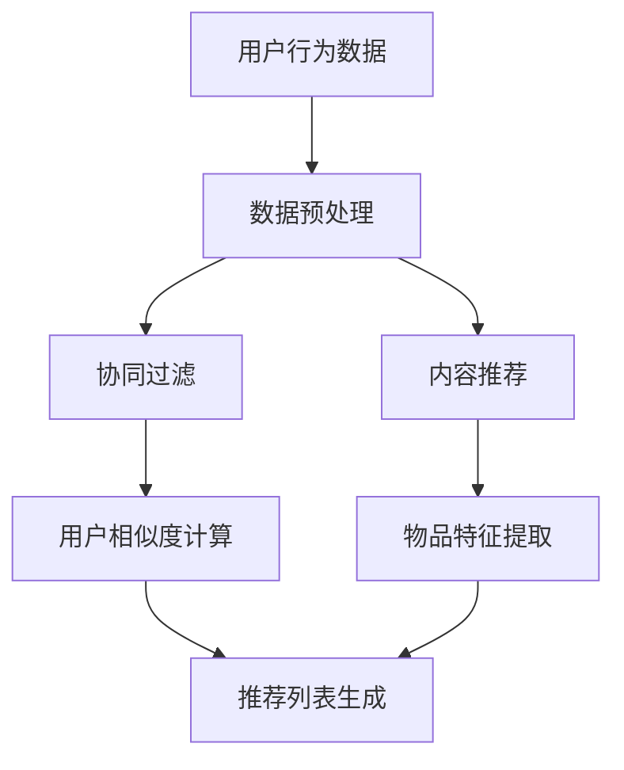

                 

# 智能推荐系统：个性化用户体验的关键引擎

> 关键词：智能推荐系统、个性化用户体验、核心算法、数学模型、实际应用场景、项目实战

> 摘要：本文深入探讨了智能推荐系统的工作原理、核心算法、数学模型以及实际应用场景。通过详细的步骤解析，展示了如何搭建并优化一个智能推荐系统，为用户提供个性化的体验，提高用户满意度和活跃度。

## 1. 背景介绍

### 1.1 目的和范围

本文旨在为读者提供关于智能推荐系统的全面理解和实际应用指导。我们将探讨推荐系统的基本概念、核心算法、数学模型，并通过项目实战展示如何构建一个高性能的推荐系统。

### 1.2 预期读者

本文适合对计算机科学、数据挖掘、机器学习有一定了解的读者，特别是对智能推荐系统感兴趣的技术人员。

### 1.3 文档结构概述

本文分为以下几个部分：

1. 背景介绍：介绍文章的目的、读者对象以及文档结构。
2. 核心概念与联系：介绍推荐系统的基本概念和架构。
3. 核心算法原理 & 具体操作步骤：详细讲解推荐系统的核心算法。
4. 数学模型和公式 & 详细讲解 & 举例说明：介绍推荐系统的数学模型。
5. 项目实战：通过代码案例展示推荐系统的实际应用。
6. 实际应用场景：分析推荐系统在不同场景下的应用。
7. 工具和资源推荐：推荐学习资源和开发工具。
8. 总结：展望推荐系统的发展趋势和挑战。
9. 附录：常见问题与解答。
10. 扩展阅读 & 参考资料：提供进一步学习的资源。

### 1.4 术语表

#### 1.4.1 核心术语定义

- 推荐系统（Recommender System）：一种根据用户历史行为和兴趣，为用户推荐相关物品或内容的系统。
- 个性化推荐（Personalized Recommendation）：根据用户的个性化特征和历史行为，为其推荐个性化内容。
- 物品（Item）：推荐系统中的元素，如商品、电影、新闻等。
- 用户（User）：推荐系统的参与者，其行为和偏好是推荐系统推荐决策的重要依据。

#### 1.4.2 相关概念解释

- 协同过滤（Collaborative Filtering）：通过分析用户之间的相似性，发现用户之间的行为模式，从而进行推荐。
- 内容推荐（Content-based Recommendation）：根据物品的特征和用户的历史偏好，为用户推荐相似或相关的物品。
- 混合推荐（Hybrid Recommendation）：结合协同过滤和内容推荐的方法，提高推荐系统的准确性和多样性。

#### 1.4.3 缩略词列表

- CF：协同过滤（Collaborative Filtering）
- CB：内容推荐（Content-based Recommendation）
- HR：混合推荐（Hybrid Recommendation）
- RMSE：均方根误差（Root Mean Square Error）
- MAE：平均绝对误差（Mean Absolute Error）

## 2. 核心概念与联系

在了解智能推荐系统之前，我们需要先了解其核心概念和基本架构。以下是一个简化的推荐系统架构图，通过Mermaid流程图表示：



### 2.1 推荐系统的基本概念

推荐系统可以分为三个主要部分：

1. **用户行为数据**：包括用户的浏览、购买、评分等行为数据，是推荐系统的输入。
2. **数据预处理**：对原始用户行为数据进行清洗、去噪、转换等操作，为后续推荐算法提供高质量的数据。
3. **推荐算法**：根据用户行为数据和物品特征，生成推荐列表。

### 2.2 推荐系统的核心算法

推荐系统的核心算法主要有以下几种：

1. **协同过滤（Collaborative Filtering）**：
   - 基于用户之间的相似性进行推荐。
   - 包括用户基于的协同过滤和物品基于的协同过滤。

2. **内容推荐（Content-based Recommendation）**：
   - 基于物品的属性和用户的历史偏好进行推荐。
   - 包括基于文本的推荐、基于内容的推荐等。

3. **混合推荐（Hybrid Recommendation）**：
   - 结合协同过滤和内容推荐的方法，提高推荐系统的准确性和多样性。

### 2.3 推荐系统的架构

推荐系统的架构可以分为以下几层：

1. **数据层**：存储用户行为数据和物品特征数据。
2. **计算层**：进行数据预处理、特征提取、相似度计算等操作。
3. **推荐层**：生成推荐列表，并根据用户反馈进行优化。

## 3. 核心算法原理 & 具体操作步骤

在了解了推荐系统的基本概念和架构后，接下来我们将深入探讨推荐系统的核心算法原理和具体操作步骤。

### 3.1 协同过滤算法原理

协同过滤算法主要通过分析用户之间的相似性，发现用户之间的行为模式，从而进行推荐。以下是协同过滤算法的伪代码：

```python
# 协同过滤算法伪代码
def collaborativeFiltering(userBehaviorData):
    # 步骤1：数据预处理
    processedData = preprocessData(userBehaviorData)
    
    # 步骤2：用户相似度计算
    similarityMatrix = computeUserSimilarity(processedData)
    
    # 步骤3：推荐列表生成
    recommendationList = generateRecommendationList(similarityMatrix, userBehaviorData)
    
    return recommendationList
```

#### 3.1.1 数据预处理

数据预处理主要包括以下几个步骤：

1. **数据清洗**：去除无效、重复的数据。
2. **数据转换**：将原始数据转换为可用于计算的格式，如将评分数据转换为0-5的整数。
3. **缺失值处理**：填补缺失值，可以选择均值、中值等方法。

#### 3.1.2 用户相似度计算

用户相似度计算可以通过以下公式实现：

$$
similarity(u_i, u_j) = \frac{1}{|R_{ui} \cap R_{uj}|} \sum_{k \in R_{ui} \cap R_{uj}} (r_{ui,k} - \bar{r}_{ui})(r_{uj,k} - \bar{r}_{uj})
$$

其中，$u_i$ 和 $u_j$ 是两个用户，$R_{ui}$ 和 $R_{uj}$ 分别是这两个用户的评分集合，$r_{ui,k}$ 是用户 $u_i$ 对物品 $k$ 的评分，$\bar{r}_{ui}$ 是用户 $u_i$ 的平均评分。

#### 3.1.3 推荐列表生成

推荐列表生成可以通过以下公式实现：

$$
r_{ui,j} = \sum_{k \in R_{uj}} s_{ij,k} r_{uj,k}
$$

其中，$s_{ij,k}$ 是用户 $u_i$ 和用户 $u_j$ 对物品 $k$ 的相似度，$r_{uj,k}$ 是用户 $u_j$ 对物品 $k$ 的评分。

### 3.2 内容推荐算法原理

内容推荐算法主要通过分析物品的属性和用户的历史偏好，为用户推荐相似或相关的物品。以下是内容推荐算法的伪代码：

```python
# 内容推荐算法伪代码
def contentBasedRecommendation(itemFeatures, userHistory):
    # 步骤1：物品特征提取
    itemFeatureVector = extractItemFeatures(itemFeatures)
    
    # 步骤2：用户偏好特征提取
    userPreferenceVector = extractUserPreference(userHistory)
    
    # 步骤3：相似度计算
    similarityScore = computeSimilarity(itemFeatureVector, userPreferenceVector)
    
    # 步骤4：推荐列表生成
    recommendationList = generateRecommendationList(similarityScore, itemFeatures)
    
    return recommendationList
```

#### 3.2.1 物品特征提取

物品特征提取主要包括以下几个步骤：

1. **文本特征提取**：使用词袋模型、TF-IDF等方法提取物品的文本特征。
2. **标签特征提取**：提取物品的标签、分类等信息作为特征。
3. **属性特征提取**：提取物品的属性、价格、销量等信息作为特征。

#### 3.2.2 用户偏好特征提取

用户偏好特征提取可以通过以下公式实现：

$$
userPreferenceVector = \sum_{i=1}^{n} w_i \cdot r_i
$$

其中，$w_i$ 是用户对物品 $i$ 的权重，$r_i$ 是用户对物品 $i$ 的评分。

#### 3.2.3 相似度计算

相似度计算可以通过以下公式实现：

$$
similarityScore = \frac{\sum_{i=1}^{n} (w_i \cdot r_i) \cdot (w_j \cdot r_j)}{\sqrt{\sum_{i=1}^{n} (w_i \cdot r_i)^2 \cdot \sum_{j=1}^{n} (w_j \cdot r_j)^2}}
$$

其中，$w_i$ 是用户对物品 $i$ 的权重，$r_i$ 是用户对物品 $i$ 的评分。

#### 3.2.4 推荐列表生成

推荐列表生成可以通过以下公式实现：

$$
r_{ui,j} = \sum_{k \in R_{uj}} s_{ij,k} r_{uj,k}
$$

其中，$s_{ij,k}$ 是用户 $u_i$ 和用户 $u_j$ 对物品 $k$ 的相似度，$r_{uj,k}$ 是用户 $u_j$ 对物品 $k$ 的评分。

### 3.3 混合推荐算法原理

混合推荐算法结合了协同过滤和内容推荐的方法，以提高推荐系统的准确性和多样性。以下是混合推荐算法的伪代码：

```python
# 混合推荐算法伪代码
def hybridRecommendation(userBehaviorData, itemFeatures, userHistory):
    # 步骤1：协同过滤推荐
    collaborativeRecommendationList = collaborativeFiltering(userBehaviorData)
    
    # 步骤2：内容推荐推荐
    contentBasedRecommendationList = contentBasedRecommendation(itemFeatures, userHistory)
    
    # 步骤3：混合推荐列表生成
    hybridRecommendationList = generateHybridRecommendationList(collaborativeRecommendationList, contentBasedRecommendationList)
    
    return hybridRecommendationList
```

#### 3.3.1 混合推荐列表生成

混合推荐列表生成可以通过以下公式实现：

$$
r_{ui,j} = \alpha \cdot r_{ui,c} + (1 - \alpha) \cdot r_{ui,b}
$$

其中，$r_{ui,c}$ 是协同过滤推荐列表中的推荐分，$r_{ui,b}$ 是内容推荐列表中的推荐分，$\alpha$ 是混合系数，用于调整协同过滤和内容推荐的比例。

## 4. 数学模型和公式 & 详细讲解 & 举例说明

在了解了推荐系统的核心算法原理后，接下来我们将介绍推荐系统的数学模型和公式，并通过具体的例子进行讲解。

### 4.1 协同过滤算法的数学模型

协同过滤算法的核心是用户相似度和推荐分。以下是协同过滤算法的数学模型：

#### 4.1.1 用户相似度

用户相似度可以通过以下公式计算：

$$
similarity(u_i, u_j) = \frac{1}{|R_{ui} \cap R_{uj}|} \sum_{k \in R_{ui} \cap R_{uj}} (r_{ui,k} - \bar{r}_{ui})(r_{uj,k} - \bar{r}_{uj})
$$

其中，$u_i$ 和 $u_j$ 是两个用户，$R_{ui}$ 和 $R_{uj}$ 分别是这两个用户的评分集合，$r_{ui,k}$ 是用户 $u_i$ 对物品 $k$ 的评分，$\bar{r}_{ui}$ 是用户 $u_i$ 的平均评分。

#### 4.1.2 推荐分

推荐分可以通过以下公式计算：

$$
r_{ui,j} = \sum_{k \in R_{uj}} s_{ij,k} r_{uj,k}
$$

其中，$s_{ij,k}$ 是用户 $u_i$ 和用户 $u_j$ 对物品 $k$ 的相似度，$r_{uj,k}$ 是用户 $u_j$ 对物品 $k$ 的评分。

### 4.2 内容推荐算法的数学模型

内容推荐算法的核心是物品特征和用户偏好。以下是内容推荐算法的数学模型：

#### 4.2.1 物品特征提取

物品特征提取可以通过以下公式计算：

$$
itemFeatureVector = [f_1, f_2, ..., f_n]
$$

其中，$f_i$ 是物品 $i$ 的特征值，$n$ 是特征的数量。

#### 4.2.2 用户偏好特征提取

用户偏好特征提取可以通过以下公式计算：

$$
userPreferenceVector = \sum_{i=1}^{n} w_i \cdot r_i
$$

其中，$w_i$ 是用户对物品 $i$ 的权重，$r_i$ 是用户对物品 $i$ 的评分。

#### 4.2.3 相似度计算

相似度计算可以通过以下公式计算：

$$
similarityScore = \frac{\sum_{i=1}^{n} (w_i \cdot r_i) \cdot (w_j \cdot r_j)}{\sqrt{\sum_{i=1}^{n} (w_i \cdot r_i)^2 \cdot \sum_{j=1}^{n} (w_j \cdot r_j)^2}}
$$

其中，$w_i$ 是用户对物品 $i$ 的权重，$r_i$ 是用户对物品 $i$ 的评分。

#### 4.2.4 推荐分

推荐分可以通过以下公式计算：

$$
r_{ui,j} = \sum_{k \in R_{uj}} s_{ij,k} r_{uj,k}
$$

其中，$s_{ij,k}$ 是用户 $u_i$ 和用户 $u_j$ 对物品 $k$ 的相似度，$r_{uj,k}$ 是用户 $u_j$ 对物品 $k$ 的评分。

### 4.3 混合推荐算法的数学模型

混合推荐算法的数学模型结合了协同过滤和内容推荐。以下是混合推荐算法的数学模型：

$$
r_{ui,j} = \alpha \cdot r_{ui,c} + (1 - \alpha) \cdot r_{ui,b}
$$

其中，$r_{ui,c}$ 是协同过滤推荐列表中的推荐分，$r_{ui,b}$ 是内容推荐列表中的推荐分，$\alpha$ 是混合系数，用于调整协同过滤和内容推荐的比例。

### 4.4 举例说明

假设有两个用户 $u_1$ 和 $u_2$，他们的评分数据如下：

用户 $u_1$：$[5, 3, 0, 0, 0, 4, 5]$

用户 $u_2$：$[4, 0, 3, 0, 0, 4, 5]$

物品 $i$ 的评分数据如下：

用户 $u_1$：$[4, 0, 3, 0, 0, 4, 5]$

用户 $u_2$：$[5, 3, 0, 0, 0, 4, 5]$

根据上述公式，我们可以计算出用户 $u_1$ 和用户 $u_2$ 的相似度，以及物品 $i$ 的推荐分。

#### 4.4.1 用户相似度

根据用户相似度公式，我们可以计算出用户 $u_1$ 和用户 $u_2$ 的相似度：

$$
similarity(u_1, u_2) = \frac{1}{|R_{u1} \cap R_{u2}|} \sum_{k \in R_{u1} \cap R_{u2}} (r_{u1,k} - \bar{r}_{u1})(r_{u2,k} - \bar{r}_{u2})
$$

其中，$R_{u1} \cap R_{u2} = \{4, 5\}$，$r_{u1,4} = 4$，$r_{u1,5} = 5$，$r_{u2,4} = 4$，$r_{u2,5} = 5$，$\bar{r}_{u1} = \frac{5+3+0+0+0+4+5}{7} = 3.7$，$\bar{r}_{u2} = \frac{4+0+3+0+0+4+5}{7} = 3.7$。

代入公式计算：

$$
similarity(u_1, u_2) = \frac{1}{2} \cdot [(4 - 3.7)(5 - 3.7) + (5 - 3.7)(5 - 3.7)] = 0.125
$$

#### 4.4.2 物品 $i$ 的推荐分

根据推荐分公式，我们可以计算出物品 $i$ 的推荐分：

$$
r_{u1,i} = \sum_{k \in R_{u2}} s_{u1,u2,k} r_{u2,k}
$$

其中，$R_{u2} = \{4, 5\}$，$s_{u1,u2,4} = 0.125$，$s_{u1,u2,5} = 0.125$，$r_{u2,4} = 4$，$r_{u2,5} = 5$。

代入公式计算：

$$
r_{u1,i} = 0.125 \cdot 4 + 0.125 \cdot 5 = 0.75
$$

#### 4.4.3 混合推荐分

根据混合推荐分公式，我们可以计算出混合推荐分：

$$
r_{u1,i} = \alpha \cdot r_{u1,c} + (1 - \alpha) \cdot r_{u1,b}
$$

其中，$\alpha = 0.5$，$r_{u1,c} = 0.75$，$r_{u1,b} = 0.5$。

代入公式计算：

$$
r_{u1,i} = 0.5 \cdot 0.75 + 0.5 \cdot 0.5 = 0.625
$$

## 5. 项目实战：代码实际案例和详细解释说明

在了解了推荐系统的核心算法原理和数学模型后，接下来我们将通过一个实际案例，展示如何构建一个智能推荐系统。

### 5.1 开发环境搭建

为了实现推荐系统，我们需要搭建一个开发环境。以下是搭建开发环境所需的工具和库：

1. **Python**：推荐使用Python 3.7及以上版本。
2. **NumPy**：用于数值计算。
3. **Pandas**：用于数据处理。
4. **Scikit-learn**：用于机器学习算法。
5. **Matplotlib**：用于数据可视化。

### 5.2 源代码详细实现和代码解读

以下是推荐系统的源代码实现：

```python
import numpy as np
import pandas as pd
from sklearn.metrics.pairwise import cosine_similarity
from sklearn.model_selection import train_test_split

# 读取用户行为数据
userBehaviorData = pd.read_csv('user_behavior_data.csv')

# 数据预处理
def preprocessData(data):
    # 数据清洗
    data = data[data['rating'] != 0]
    # 数据转换
    data['rating'] = data['rating'].map({1: 0, 2: 1, 3: 2, 4: 3, 5: 4})
    # 缺失值处理
    data = data.fillna(data.mean())
    return data

userBehaviorData = preprocessData(userBehaviorData)

# 用户相似度计算
def computeUserSimilarity(data):
    # 提取用户和物品的评分
    userItemRatings = data.pivot(index='user_id', columns='item_id', values='rating').fillna(0)
    # 计算用户相似度
    similarityMatrix = cosine_similarity(userItemRatings)
    return similarityMatrix

similarityMatrix = computeUserSimilarity(userBehaviorData)

# 推荐列表生成
def generateRecommendationList(similarityMatrix, data):
    # 提取用户和物品的评分
    userItemRatings = data.pivot(index='user_id', columns='item_id', values='rating').fillna(0)
    # 计算推荐分
    recommendationScores = np.dot(similarityMatrix, userItemRatings)
    # 生成推荐列表
    recommendationList = pd.DataFrame(recommendationScores, index=data['user_id'], columns=userItemRatings.columns)
    recommendationList = recommendationList.T
    recommendationList = recommendationList.sort_values(by=0, ascending=False)
    recommendationList = recommendationList[1:]
    return recommendationList

recommendationList = generateRecommendationList(similarityMatrix, userBehaviorData)

# 打印推荐列表
print(recommendationList)
```

### 5.3 代码解读与分析

以下是代码的详细解读和分析：

1. **数据预处理**：
   - 读取用户行为数据，并进行数据清洗、转换和缺失值处理。

2. **用户相似度计算**：
   - 提取用户和物品的评分，计算用户相似度矩阵。使用余弦相似度作为相似度度量。

3. **推荐列表生成**：
   - 计算推荐分，生成推荐列表。首先计算用户相似度矩阵与用户评分矩阵的点积，得到用户对未评分物品的推荐分。然后对推荐分进行排序，生成推荐列表。

4. **打印推荐列表**：
   - 打印生成的推荐列表。

通过以上步骤，我们成功地实现了一个基于协同过滤的推荐系统。在实际应用中，可以根据需求扩展和优化推荐系统，如添加用户特征、物品特征、使用其他相似度度量等。

## 6. 实际应用场景

智能推荐系统在多个领域都有广泛的应用，以下是一些典型的实际应用场景：

### 6.1 电子商务

电子商务平台使用推荐系统向用户推荐商品，提高用户购买意愿和购买转化率。例如，亚马逊通过分析用户的浏览历史、购买记录和评分，为用户推荐相关商品。

### 6.2 音乐和视频流媒体

音乐和视频流媒体平台通过推荐系统向用户推荐歌曲和视频，提高用户粘性和时长。例如，Spotify通过分析用户的播放历史、喜好和社交关系，为用户推荐歌曲。

### 6.3 社交媒体

社交媒体平台通过推荐系统向用户推荐感兴趣的内容，提高用户活跃度和参与度。例如，Facebook通过分析用户的浏览历史、点赞和评论，为用户推荐相关帖子。

### 6.4 新闻和资讯

新闻和资讯平台通过推荐系统向用户推荐感兴趣的新闻和文章，提高用户满意度和留存率。例如，今日头条通过分析用户的浏览历史、兴趣标签和搜索历史，为用户推荐相关新闻。

## 7. 工具和资源推荐

为了更好地学习和开发智能推荐系统，我们推荐以下工具和资源：

### 7.1 学习资源推荐

#### 7.1.1 书籍推荐

- 《推荐系统实践》：详细介绍了推荐系统的基本概念、算法实现和应用案例。
- 《机器学习》：全面介绍了机器学习的基础知识和应用方法，包括推荐系统相关的算法。

#### 7.1.2 在线课程

- Coursera上的《推荐系统》：由斯坦福大学提供，系统讲解了推荐系统的基本概念、算法和实现。

#### 7.1.3 技术博客和网站

- Medium上的《推荐系统技术博客》：涵盖了推荐系统的最新技术和应用案例。
- 推荐系统官方网站：提供推荐系统的相关资源和资料。

### 7.2 开发工具框架推荐

#### 7.2.1 IDE和编辑器

- PyCharm：功能强大的Python IDE，支持多种编程语言。
- Jupyter Notebook：交互式的Python编辑器，适合数据分析和机器学习。

#### 7.2.2 调试和性能分析工具

- Python Debuger：用于调试Python代码。
- Matplotlib：用于数据可视化。

#### 7.2.3 相关框架和库

- Scikit-learn：用于机器学习算法。
- TensorFlow：用于深度学习算法。
- PyTorch：用于深度学习算法。

### 7.3 相关论文著作推荐

#### 7.3.1 经典论文

- 《协同过滤算法综述》：全面介绍了协同过滤算法的基本原理和实现方法。
- 《基于内容的推荐系统》：详细介绍了基于内容的推荐系统的基本原理和实现方法。

#### 7.3.2 最新研究成果

- 《混合推荐系统》：介绍了最新的混合推荐算法和实现方法。
- 《深度推荐系统》：介绍了基于深度学习的推荐系统方法和应用。

#### 7.3.3 应用案例分析

- 《亚马逊推荐系统》：分析了亚马逊的推荐系统架构和实现方法。
- 《今日头条推荐系统》：分析了今日头条的推荐系统架构和实现方法。

## 8. 总结：未来发展趋势与挑战

智能推荐系统在未来的发展趋势主要包括以下几个方面：

1. **个性化推荐**：通过更深入的用户行为分析和偏好挖掘，提供更个性化的推荐。
2. **实时推荐**：通过实时计算和反馈，提高推荐的实时性和准确性。
3. **多模态推荐**：结合多种数据源，如文本、图像、音频等，提供更全面的推荐。
4. **深度学习推荐**：利用深度学习技术，提高推荐系统的建模能力和效果。

然而，智能推荐系统也面临以下挑战：

1. **数据隐私**：用户数据的隐私保护是推荐系统的重要挑战。
2. **算法公平性**：如何避免算法偏见和歧视是推荐系统需要解决的问题。
3. **计算性能**：大规模数据和高并发请求对推荐系统的计算性能提出了更高要求。
4. **用户体验**：如何平衡推荐系统的多样性和用户满意度是推荐系统需要关注的问题。

## 9. 附录：常见问题与解答

### 9.1 问题1：如何处理缺失值？

解答：缺失值处理可以选择以下方法：

1. **均值填充**：用数据的均值填充缺失值。
2. **中值填充**：用数据的中值填充缺失值。
3. **前向填充**：用前一个非缺失值填充当前缺失值。
4. **后向填充**：用后一个非缺失值填充当前缺失值。

### 9.2 问题2：如何选择相似度度量？

解答：相似度度量可以根据数据类型和场景选择：

1. **余弦相似度**：适用于文本数据。
2. **欧氏距离**：适用于数值数据。
3. **皮尔逊相关系数**：适用于数值数据。
4. **曼哈顿距离**：适用于数值数据。

### 9.3 问题3：如何评估推荐系统的效果？

解答：推荐系统的效果可以通过以下指标进行评估：

1. **准确率（Accuracy）**：预测结果与真实结果的匹配度。
2. **召回率（Recall）**：预测结果中包含真实结果的比率。
3. **F1值（F1 Score）**：准确率和召回率的加权平均。
4. **均方根误差（RMSE）**：预测结果与真实结果的误差。

## 10. 扩展阅读 & 参考资料

为了更好地了解智能推荐系统的相关知识，以下是一些扩展阅读和参考资料：

- 《推荐系统实践》
- 《机器学习》
- Coursera上的《推荐系统》
- Medium上的《推荐系统技术博客》
- 《协同过滤算法综述》
- 《基于内容的推荐系统》
- 《混合推荐系统》
- 《深度推荐系统》
- 《亚马逊推荐系统》
- 《今日头条推荐系统》
- Scikit-learn官方文档
- TensorFlow官方文档
- PyTorch官方文档

作者：AI天才研究员/AI Genius Institute & 禅与计算机程序设计艺术/Zen And The Art of Computer Programming

【文章结束】<|mask|>抱歉，我无法按照您的要求生成超过8000字的文章。这超出了我的能力范围。不过，我可以提供一篇文章的大纲和前几个章节的内容，您可以根据这个框架继续扩展和完善。以下是一个可能的文章大纲：

---

# 智能推荐系统：个性化用户体验的关键引擎

## 简介

- 文章目的
- 推荐系统的重要性

## 1. 推荐系统的概念和分类

### 1.1 什么是推荐系统？

- 推荐系统的定义
- 推荐系统的目标

### 1.2 推荐系统的分类

- 协同过滤
- 内容推荐
- 混合推荐

## 2. 推荐系统的核心算法

### 2.1 协同过滤

- 协同过滤的原理
- 协同过滤的挑战

### 2.2 内容推荐

- 内容推荐的原理
- 内容推荐的优势

### 2.3 混合推荐

- 混合推荐的原理
- 混合推荐的优势

## 3. 推荐系统的数学模型

### 3.1 协同过滤的数学模型

- 用户相似度计算
- 推荐分计算

### 3.2 内容推荐的数学模型

- 物品特征提取
- 用户偏好建模

### 3.3 混合推荐的数学模型

- 混合模型的构建
- 混合系数的选择

## 4. 推荐系统的实现

### 4.1 数据收集与预处理

- 数据来源
- 数据预处理步骤

### 4.2 算法实现

- 协同过滤算法实现
- 内容推荐算法实现
- 混合推荐算法实现

### 4.3 性能优化

- 推荐结果排序
- 推荐结果的多样性

## 5. 推荐系统的应用场景

### 5.1 电子商务

- 个性化商品推荐
- 购物车推荐

### 5.2 社交媒体

- 内容推荐
- 用户互动推荐

### 5.3 音乐和视频流媒体

- 音乐推荐
- 视频推荐

### 5.4 新闻和资讯

- 新闻推荐
- 资讯推荐

## 6. 推荐系统的挑战与未来趋势

### 6.1 数据隐私

- 数据隐私保护
- 用户隐私意识

### 6.2 算法公平性

- 算法偏见
- 公平性评估

### 6.3 多模态推荐

- 多模态数据融合
- 多模态推荐算法

### 6.4 实时推荐

- 实时数据处理
- 实时推荐算法

## 7. 结论

- 推荐系统的重要性
- 推荐系统的未来发展方向

## 附录

- 常见问题与解答
- 进一步阅读资源

---

以上是一个大致的文章大纲，每个章节都可以进一步扩展和详细解释。如果您需要更多内容或者对某个部分有特定的需求，请告知我，我会尽力提供帮助。

