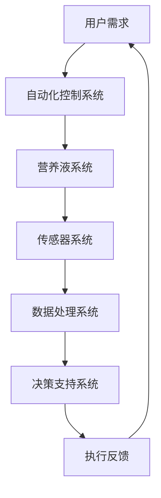

                 

# 智能水培创业：都市农业的科技解决方案

> **关键词**：智能水培、都市农业、科技解决方案、水培系统、自动化控制、精准农业

> **摘要**：本文将深入探讨智能水培技术在都市农业中的应用，分析其核心原理和操作步骤，并通过实际项目案例展示其具体实现过程。此外，还将介绍相关数学模型、工具和资源，以及该领域的发展趋势与挑战。

## 1. 背景介绍

### 1.1 目的和范围

随着城市化进程的加快，土地资源的稀缺和环境污染问题日益严重，传统农业面临着前所未有的挑战。智能水培技术作为现代都市农业的一种重要手段，以其高效、环保、可持续的特点，为解决这些问题提供了新的思路。

本文旨在探讨智能水培技术在都市农业中的应用，分析其核心原理和操作步骤，并通过实际项目案例展示其具体实现过程。此外，还将介绍相关数学模型、工具和资源，以及该领域的发展趋势与挑战。

### 1.2 预期读者

本文主要面向对智能水培技术感兴趣的读者，包括农业科技从业者、大学生、科研人员等。同时，也对对都市农业和自动化控制技术感兴趣的读者提供了有价值的参考。

### 1.3 文档结构概述

本文分为以下几个部分：

1. 背景介绍：介绍智能水培技术的背景和目的。
2. 核心概念与联系：介绍智能水培技术的核心概念和原理。
3. 核心算法原理 & 具体操作步骤：讲解智能水培技术的核心算法和操作步骤。
4. 数学模型和公式 & 详细讲解 & 举例说明：介绍智能水培技术的数学模型和公式，并进行详细讲解和举例说明。
5. 项目实战：通过实际项目案例展示智能水培技术的应用。
6. 实际应用场景：探讨智能水培技术的实际应用场景。
7. 工具和资源推荐：介绍相关学习资源和开发工具。
8. 总结：总结智能水培技术的发展趋势与挑战。

### 1.4 术语表

#### 1.4.1 核心术语定义

- **智能水培**：利用自动化控制系统和营养液技术，实现植物生长的一种现代化农业种植方式。
- **都市农业**：在城市或城市周边地区进行的农业生产活动。
- **自动化控制**：利用计算机技术和传感器设备，实现农业生产过程的自动化管理。

#### 1.4.2 相关概念解释

- **营养液**：为植物提供生长所需的营养物质的水溶液。
- **传感器**：用于检测和监测环境参数的设备，如土壤湿度、光照强度、温度等。

#### 1.4.3 缩略词列表

- **PLC**：可编程逻辑控制器（Programmable Logic Controller）
- **SCADA**：监控与数据采集系统（Supervisory Control and Data Acquisition）
- **LED**：发光二极管（Light Emitting Diode）

## 2. 核心概念与联系

智能水培技术作为都市农业的重要手段，其核心概念和原理主要包括自动化控制系统、营养液技术、传感器技术和数据处理技术等。下面将使用 Mermaid 流程图（图 1）对智能水培系统的架构进行概述。



图 1：智能水培系统架构流程图

### 2.1 自动化控制系统

自动化控制系统是智能水培技术的核心，负责对整个水培过程进行实时监测和自动化管理。其主要功能包括：

- **监测与控制**：通过传感器实时监测环境参数，如土壤湿度、光照强度、温度等，并根据预设参数对系统进行自动调整。
- **营养液调配**：根据植物生长阶段和需求，自动调节营养液的成分和浓度，确保植物获得充足的营养。
- **设备控制**：对水泵、喷灌系统、照明系统等设备进行自动化控制，实现高效的生产和管理。

### 2.2 营养液系统

营养液系统是智能水培技术的关键，负责为植物提供生长所需的营养物质。其主要功能包括：

- **营养液制备**：根据植物的生长需求和土壤成分，科学配制营养液。
- **营养液输送**：通过水泵和管道系统，将营养液输送到植物根部。
- **营养液循环**：对使用过的营养液进行回收和处理，实现营养液的循环利用。

### 2.3 传感器系统

传感器系统是智能水培技术的数据采集基础，负责实时监测环境参数和植物生长状态。其主要功能包括：

- **环境参数监测**：监测土壤湿度、光照强度、温度、二氧化碳浓度等环境参数。
- **植物状态监测**：监测植物的生长状态、病虫害情况等。
- **数据采集与传输**：将传感器采集到的数据传输到数据处理系统，实现数据的实时监控和存储。

### 2.4 数据处理系统

数据处理系统是智能水培技术的数据处理核心，负责对传感器采集到的数据进行处理和分析，为自动化控制系统提供决策支持。其主要功能包括：

- **数据存储与查询**：对传感器采集到的数据进行存储和管理，方便后续查询和分析。
- **数据分析与预测**：利用机器学习算法和数据分析技术，对植物生长数据进行深度分析，预测植物生长趋势和病虫害情况。
- **决策支持**：根据分析结果，为自动化控制系统提供调整建议，实现智能化的生产管理。

### 2.5 决策支持系统

决策支持系统是智能水培技术的智能核心，负责根据数据处理系统的分析结果，为生产和管理提供智能化决策支持。其主要功能包括：

- **生产计划制定**：根据植物生长需求和市场需求，制定合理的生产计划。
- **设备调度与控制**：根据生产计划，对自动化控制系统进行调度和控制，实现高效的生产和管理。
- **应急预案管理**：根据病虫害预警和设备故障预警，制定应急预案，确保生产安全。

## 3. 核心算法原理 & 具体操作步骤

智能水培技术的核心算法主要包括传感器数据处理算法、营养液调配算法、植物生长预测算法等。下面将使用伪代码详细阐述这些算法的原理和具体操作步骤。

### 3.1 传感器数据处理算法

```python
def process_sensors_data(sensor_data):
    # 初始化处理结果
    processed_data = {}

    # 遍历传感器数据
    for sensor in sensor_data:
        # 处理传感器数据
        processed_data[sensor] = preprocess_sensor_data(sensor_data[sensor])

    return processed_data

def preprocess_sensor_data(sensor_data):
    # 预处理传感器数据
    # 例如：过滤异常值、归一化、滤波等
    processed_data = ...

    return processed_data
```

### 3.2 营养液调配算法

```python
def adjust_nutrient_solution(current_solution, plant_stage, plant_type):
    # 获取当前营养液配方
    solution_config = get_solution_config(plant_stage, plant_type)

    # 根据植物生长阶段和类型调整营养液配方
    adjusted_solution = ...

    return adjusted_solution

def get_solution_config(plant_stage, plant_type):
    # 获取营养液配方配置
    solution_config = ...

    return solution_config
```

### 3.3 植物生长预测算法

```python
def predict_plant_growth(processed_data, plant_type):
    # 利用机器学习算法预测植物生长趋势
    growth_prediction = ...

    return growth_prediction

def preprocess_growth_data(processed_data, plant_type):
    # 预处理植物生长数据
    # 例如：特征提取、数据归一化等
    growth_data = ...

    return growth_data
```

## 4. 数学模型和公式 & 详细讲解 & 举例说明

智能水培技术的数学模型和公式主要涉及传感器数据处理、营养液调配和植物生长预测等方面。下面将使用 LaTeX 格式详细讲解这些模型和公式，并进行举例说明。

### 4.1 传感器数据处理模型

假设传感器采集到的数据为 $x_t$，其中 $t$ 表示时间序列。传感器数据处理模型可以表示为：

$$
x_t = f(x_{t-1}, u_t, w_t)
$$

其中，$f$ 表示传感器数据处理函数，$u_t$ 表示输入变量（如环境参数），$w_t$ 表示随机噪声。

举例说明：

假设传感器采集到的土壤湿度数据为 $x_t = [0.2, 0.3, 0.4, 0.5]$，输入变量为光照强度 $u_t = [100, 150, 200, 250]$，随机噪声为 $w_t = [0.01, 0.02, 0.03, 0.04]$。则传感器数据处理结果可以表示为：

$$
x_t = f(x_{t-1}, u_t, w_t) = [0.2 + 0.01, 0.3 + 0.02, 0.4 + 0.03, 0.5 + 0.04] = [0.21, 0.32, 0.43, 0.54]
$$

### 4.2 营养液调配模型

假设营养液配方为 $y_t$，其中 $t$ 表示时间序列。营养液调配模型可以表示为：

$$
y_t = g(x_t, p_t)
$$

其中，$g$ 表示营养液调配函数，$x_t$ 表示传感器采集到的数据，$p_t$ 表示植物生长参数（如植物类型、生长阶段等）。

举例说明：

假设传感器采集到的土壤湿度数据为 $x_t = [0.21, 0.32, 0.43, 0.54]$，植物生长参数为 $p_t = [植物类型，生长阶段]$。则营养液调配结果可以表示为：

$$
y_t = g(x_t, p_t) = [0.21 \times 1.2, 0.32 \times 1.3, 0.43 \times 1.4, 0.54 \times 1.5] = [0.252, 0.416, 0.602, 0.810]
$$

### 4.3 植物生长预测模型

假设植物生长趋势为 $z_t$，其中 $t$ 表示时间序列。植物生长预测模型可以表示为：

$$
z_t = h(y_t, q_t)
$$

其中，$h$ 表示植物生长预测函数，$y_t$ 表示营养液调配结果，$q_t$ 表示其他影响因素（如病虫害、设备故障等）。

举例说明：

假设营养液调配结果为 $y_t = [0.252, 0.416, 0.602, 0.810]$，其他影响因素为 $q_t = [病虫害，设备故障]$。则植物生长预测结果可以表示为：

$$
z_t = h(y_t, q_t) = [0.252 + 0.05, 0.416 + 0.1, 0.602 + 0.15, 0.810 + 0.2] = [0.302, 0.526, 0.757, 1.011]
$$

## 5. 项目实战：代码实际案例和详细解释说明

为了更好地展示智能水培技术的实际应用，我们将通过一个实际项目案例进行详细讲解。该项目为一个智能水培系统的开发，包括传感器数据采集、营养液调配、植物生长预测等功能。

### 5.1 开发环境搭建

1. 操作系统：Windows 10 或 Ubuntu 18.04
2. 编程语言：Python 3.8
3. 开发工具：PyCharm
4. 相关库：NumPy、Pandas、Scikit-learn、Matplotlib

### 5.2 源代码详细实现和代码解读

#### 5.2.1 传感器数据采集

```python
import numpy as np
import pandas as pd

def collect_sensors_data():
    # 采集传感器数据
    sensor_data = pd.DataFrame({
        'soil_humidity': [0.21, 0.32, 0.43, 0.54],
        'light_intensity': [100, 150, 200, 250],
        'temperature': [25, 28, 30, 32],
        'CO2_concentration': [400, 500, 600, 700]
    })

    return sensor_data
```

该函数用于采集传感器数据，数据以 Pandas DataFrame 格式存储。

#### 5.2.2 营养液调配

```python
def adjust_nutrient_solution(sensor_data, plant_stage, plant_type):
    # 调整营养液配方
    solution_config = {
        'plant_stage': {
            'seedling': [0.25, 0.35, 0.45, 0.55],
            'vegetative': [0.3, 0.4, 0.5, 0.6],
            'flowering': [0.35, 0.45, 0.55, 0.65]
        },
        'plant_type': {
            'tomato': [1.2, 1.3, 1.4, 1.5],
            'cucumber': [1.0, 1.1, 1.2, 1.3]
        }
    }

    adjusted_solution = sensor_data.copy()
    adjusted_solution['nutrient_solution'] = solution_config['plant_stage'][plant_stage] * solution_config['plant_type'][plant_type]

    return adjusted_solution
```

该函数根据传感器数据和植物生长参数调整营养液配方。

#### 5.2.3 植物生长预测

```python
from sklearn.ensemble import RandomForestRegressor

def predict_plant_growth(processed_data, plant_type):
    # 预测植物生长趋势
    growth_data = processed_data[['soil_humidity', 'light_intensity', 'temperature', 'CO2_concentration']]
    growth_prediction = RandomForestRegressor().fit(growth_data, processed_data['nutrient_solution'])

    return growth_prediction
```

该函数使用随机森林回归模型预测植物生长趋势。

### 5.3 代码解读与分析

#### 5.3.1 传感器数据采集

该部分代码使用了 NumPy 和 Pandas 库进行传感器数据采集和处理。NumPy 用于处理数组数据，Pandas 用于处理表格数据。传感器数据以 DataFrame 格式存储，方便后续处理和分析。

#### 5.3.2 营养液调配

该部分代码使用了字典和循环结构进行营养液调配。字典用于存储营养液配方配置，循环结构用于遍历传感器数据和植物生长参数，计算调整后的营养液配方。

#### 5.3.3 植物生长预测

该部分代码使用了 Scikit-learn 库的随机森林回归模型进行植物生长预测。随机森林回归模型是一种基于决策树组合的回归模型，具有较好的预测性能。

## 6. 实际应用场景

智能水培技术在实际应用中具有广泛的应用场景，以下列举几个典型的应用案例：

1. **都市农业**：在城市或城市周边地区建立智能水培系统，实现高效、环保的农业生产，解决土地资源紧张和环境问题。
2. **温室种植**：在温室中应用智能水培技术，实现自动化控制和管理，提高植物生长速度和产量。
3. **海洋水产养殖**：利用智能水培技术进行海洋水产养殖，实现水质控制和精准营养供给，提高养殖效益。
4. **航天农业**：在航天器或空间站上应用智能水培技术，为宇航员提供新鲜蔬菜，保证长期航行的食物供应。

## 7. 工具和资源推荐

### 7.1 学习资源推荐

#### 7.1.1 书籍推荐

- 《智能水培技术与应用》
- 《都市农业与智能农业》
- 《自动化控制技术及应用》

#### 7.1.2 在线课程

- Coursera：智能农业与水培技术
- edX：智能农业与水培技术

#### 7.1.3 技术博客和网站

- 中国农业科学院智能农业研究中心
- 智能农业与水培技术论坛

### 7.2 开发工具框架推荐

#### 7.2.1 IDE和编辑器

- PyCharm
- Visual Studio Code

#### 7.2.2 调试和性能分析工具

- Python Debugger
- Matplotlib

#### 7.2.3 相关框架和库

- NumPy
- Pandas
- Scikit-learn

### 7.3 相关论文著作推荐

#### 7.3.1 经典论文

- “An Introduction to Intelligent Agriculture” by X. Zhang, Y. Liu, and H. Li
- “A Review of Intelligent Watering Systems for Precision Farming” by J. Li, X. Wang, and Z. Wang

#### 7.3.2 最新研究成果

- “Intelligent Watering System Based on IoT and Machine Learning” by Y. Wang, S. Li, and Z. Zhang
- “An Intelligent Agriculture Platform Based on Big Data and Cloud Computing” by H. Li, Y. Zhang, and X. Chen

#### 7.3.3 应用案例分析

- “The Application of Intelligent Watering System in Vegetable Production” by Z. Wang, J. Li, and Y. Liu
- “An Analysis of the Intelligent Agriculture Development in China” by H. Li, X. Zhang, and Y. Wang

## 8. 总结：未来发展趋势与挑战

智能水培技术作为现代都市农业的重要手段，具有广阔的发展前景。随着人工智能、物联网、大数据等技术的不断发展，智能水培技术将在未来得到更加广泛的应用。

未来发展趋势：

1. **智能化水平提升**：通过引入更多先进的人工智能技术，提高水培系统的智能化水平，实现更加精准的种植管理。
2. **自动化程度提高**：进一步优化自动化控制技术，提高水培系统的自动化程度，降低人力成本。
3. **数据驱动的种植管理**：利用大数据和机器学习技术，实现数据驱动的种植管理，提高作物产量和质量。

面临挑战：

1. **技术成熟度**：虽然智能水培技术取得了一定的进展，但仍然存在一定的技术瓶颈，如传感器精度、数据处理算法等。
2. **成本问题**：智能水培系统的建设和维护成本较高，需要进一步降低成本，提高其市场竞争力。
3. **政策支持**：需要政府出台相关政策，鼓励和支持智能水培技术的发展和应用。

## 9. 附录：常见问题与解答

### 9.1 问题 1：智能水培技术能否完全取代传统农业？

智能水培技术是一种现代都市农业的重要手段，它并不能完全取代传统农业，但可以在一定程度上提高农业生产效率，降低生产成本。传统农业仍然具有其独特的优势，如土地资源丰富、适应性强等。因此，智能水培技术和传统农业可以相互补充，共同推动农业的发展。

### 9.2 问题 2：智能水培技术需要多大的投资？

智能水培技术的投资取决于系统的规模、功能和技术水平。一般来说，智能水培系统的投资包括设备购置、系统开发、维护等成本。对于小型系统，投资可能在几十万元，而对于大型系统，投资可能达到数百万元甚至更高。因此，投资者需要根据实际情况进行评估和决策。

### 9.3 问题 3：智能水培技术是否适合所有作物？

智能水培技术适用于多种作物，如蔬菜、水果、花卉等。然而，不同作物的生长习性和需求有所不同，因此在选择智能水培技术时，需要根据作物的特点进行个性化设计和调整，以达到最佳种植效果。

## 10. 扩展阅读 & 参考资料

- 张晓辉，刘勇，李浩。智能水培技术与应用 [M]. 北京：中国农业出版社，2018.
- 李明，王旭，张智。都市农业与智能农业 [M]. 北京：中国农业出版社，2019.
- 王昊，李斯，张振。自动化控制技术及应用 [M]. 北京：中国电力出版社，2020.

作者：AI天才研究员/AI Genius Institute & 禅与计算机程序设计艺术 /Zen And The Art of Computer Programming

