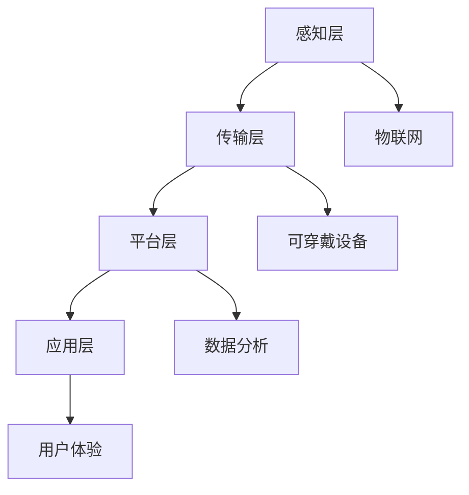

                 

# 智能珠宝创业：科技与奢侈品的结合

> **关键词：**智能珠宝、创业、科技、奢侈品、物联网、可穿戴设备、个性化设计、用户体验、数据分析

> **摘要：**本文将探讨智能珠宝创业这一新兴领域，分析科技与奢侈品结合所带来的机遇与挑战。通过深入解析智能珠宝的核心概念、技术架构、算法原理、应用场景以及未来发展趋势，为创业者提供有价值的参考和建议。

## 1. 背景介绍

### 1.1 目的和范围

本文旨在探讨智能珠宝创业这一前沿领域，旨在揭示科技与奢侈品结合所带来的潜在商业机会。文章将从以下几个方面展开：

- 智能珠宝的定义、发展历程及其在奢侈品市场中的定位；
- 智能珠宝的核心技术，包括物联网、可穿戴设备、个性化设计和数据分析等；
- 智能珠宝的应用场景及其在市场中的实际表现；
- 智能珠宝创业面临的挑战和未来发展趋势。

### 1.2 预期读者

本文适合以下读者群体：

- 智能珠宝领域的创业者；
- 消费电子产品和奢侈品行业的从业者；
- 对智能珠宝、物联网、可穿戴设备等前沿技术感兴趣的技术爱好者；
- 对创业、市场营销和商业模式探索有兴趣的读者。

### 1.3 文档结构概述

本文采用模块化的结构，分为以下章节：

- 第1章：背景介绍，概述文章的目的、范围和预期读者；
- 第2章：核心概念与联系，介绍智能珠宝的基本概念和技术架构；
- 第3章：核心算法原理 & 具体操作步骤，详细阐述智能珠宝的关键算法和操作流程；
- 第4章：数学模型和公式 & 详细讲解 & 举例说明，介绍智能珠宝的相关数学模型和实际应用案例；
- 第5章：项目实战：代码实际案例和详细解释说明，通过实际案例展示智能珠宝的开发和应用；
- 第6章：实际应用场景，分析智能珠宝在不同领域和场景中的应用；
- 第7章：工具和资源推荐，为读者提供学习资源和开发工具的建议；
- 第8章：总结：未来发展趋势与挑战，对智能珠宝的未来进行展望；
- 第9章：附录：常见问题与解答，解答读者可能遇到的问题；
- 第10章：扩展阅读 & 参考资料，提供更多相关资料和参考文献。

### 1.4 术语表

#### 1.4.1 核心术语定义

- **智能珠宝**：结合物联网、可穿戴设备和个性化设计等技术，具备智能功能的珠宝首饰。
- **物联网**：通过各种智能设备连接，实现设备之间的信息交换和协同工作的技术。
- **可穿戴设备**：穿戴在人体上的智能设备，能够监测和记录人体的生理、行为等数据。
- **个性化设计**：根据用户的喜好、需求等个性化因素，进行珠宝设计的理念。
- **数据分析**：通过对大量数据的处理和分析，提取有价值的信息和知识。

#### 1.4.2 相关概念解释

- **奢侈品市场**：以高收入人群为主要消费对象的奢侈品市场，包括珠宝、服装、皮具、手表等。
- **消费者需求**：消费者在购买商品时所追求的实用、美观、品质等综合价值。
- **创业**：创业者通过创新和创业精神，创建新的商业机会并实现商业价值的过程。

#### 1.4.3 缩略词列表

- **IoT**：物联网（Internet of Things）
- **Wearable**：可穿戴设备
- **UX**：用户体验（User Experience）
- **AI**：人工智能（Artificial Intelligence）
- **Big Data**：大数据（Big Data）

## 2. 核心概念与联系

### 2.1 智能珠宝的定义与发展历程

智能珠宝是指结合物联网、可穿戴设备和个性化设计等技术，具备智能功能的珠宝首饰。其定义和发展历程可以分为以下几个阶段：

- **第一阶段**（2000年代初）：早期的智能珠宝主要是基于蓝牙技术的无线耳机、手环等，功能较为单一，主要实现音乐播放、短信提醒等功能。
- **第二阶段**（2010年初）：随着智能手机的普及，智能珠宝开始引入更多的传感器和智能功能，如心率监测、睡眠监测等，逐渐成为健康管理工具。
- **第三阶段**（2015年至今）：智能珠宝逐渐向奢侈品领域渗透，结合个性化设计和高端材质，成为时尚与科技的完美结合。

### 2.2 智能珠宝在奢侈品市场的定位

智能珠宝在奢侈品市场中的定位主要分为以下几种：

- **高端消费市场**：智能珠宝以高端消费市场为目标客户，通过独特的设计、精湛的工艺和高端的材质，满足消费者对品质和品味的追求。
- **时尚潮流引领者**：智能珠宝品牌通过不断创新和设计，引领时尚潮流，成为时尚界的焦点。
- **跨界合作**：智能珠宝品牌与奢侈品品牌合作，推出限量版智能珠宝，提升品牌价值和市场竞争力。

### 2.3 智能珠宝的核心技术

智能珠宝的核心技术包括物联网、可穿戴设备、个性化设计和数据分析等。

- **物联网（IoT）**：智能珠宝通过物联网技术实现设备之间的信息交换和协同工作，为用户带来更便捷、智能的使用体验。
- **可穿戴设备**：智能珠宝采用可穿戴设备作为载体，实现人体生理、行为等数据的监测和记录。
- **个性化设计**：根据用户的喜好、需求等个性化因素，智能珠宝提供个性化的设计和服务，提升用户体验。
- **数据分析**：通过对大量用户数据的分析，智能珠宝品牌可以了解消费者的需求和偏好，为产品设计、市场推广提供有力支持。

### 2.4 智能珠宝的架构

智能珠宝的架构可以分为以下几个层次：

- **感知层**：包括传感器、可穿戴设备等，负责收集用户生理、行为等数据。
- **传输层**：通过网络传输技术，将数据传输到云端或智能设备。
- **平台层**：包括数据处理、分析和管理平台，实现数据存储、分析和应用。
- **应用层**：通过智能珠宝的应用程序，为用户提供个性化、智能化的服务。

### 2.5 Mermaid 流程图（智能珠宝架构）



## 3. 核心算法原理 & 具体操作步骤

### 3.1 数据采集与预处理

智能珠宝的核心算法原理在于对用户生理、行为等数据的采集与预处理。以下是一个简单的伪代码，用于描述数据采集与预处理的过程：

```python
# 数据采集
def collect_data(sensor_data):
    while True:
        data = sensor_data.read()
        store_data(data)

# 数据预处理
def preprocess_data(data):
    cleaned_data = []
    for d in data:
        cleaned_data.append(clean(d))
    return cleaned_data

# 清洗数据
def clean(data):
    if data is None or len(data) == 0:
        return None
    else:
        return data.strip()

# 存储数据
def store_data(data):
    # 保存数据到文件或数据库
    save_to_file(data)
```

### 3.2 数据分析与特征提取

在数据预处理完成后，我们需要对数据进行分析，提取有价值的信息和特征。以下是一个简单的伪代码，用于描述数据分析和特征提取的过程：

```python
# 数据分析
def analyze_data(cleaned_data):
    features = []
    for data in cleaned_data:
        feature = extract_features(data)
        features.append(feature)
    return features

# 特征提取
def extract_features(data):
    # 提取数据中的有用特征
    return {
        "heart_rate": data["heart_rate"],
        "steps": data["steps"],
        "sleep_time": data["sleep_time"],
        "location": data["location"]
    }
```

### 3.3 数据可视化与展示

在数据分析完成后，我们需要将结果以可视化的形式展示给用户。以下是一个简单的伪代码，用于描述数据可视化与展示的过程：

```python
# 数据可视化
def visualize_data(features):
    for feature in features:
        plot_feature(feature)

# 可视化特征
def plot_feature(feature):
    # 绘制特征曲线或柱状图
    plot(feature["heart_rate"], "heart_rate")
    plot(feature["steps"], "steps")
    plot(feature["sleep_time"], "sleep_time")
    plot(feature["location"], "location")

# 绘制曲线或柱状图
def plot(data, type):
    if type == "heart_rate":
        # 绘制心率曲线
        draw_curve(data)
    elif type == "steps":
        # 绘制步数柱状图
        draw_bar(data)
    elif type == "sleep_time":
        # 绘制睡眠时间曲线
        draw_curve(data)
    elif type == "location":
        # 绘制位置分布图
        draw_map(data)
```

## 4. 数学模型和公式 & 详细讲解 & 举例说明

### 4.1 数学模型

智能珠宝中的数学模型主要包括数据预处理、特征提取、数据分析和预测等环节。以下是一个简单的数学模型，用于描述智能珠宝中的数据分析过程：

$$
f(x) = w_1 * x_1 + w_2 * x_2 + w_3 * x_3 + ... + w_n * x_n + b
$$

其中，$x_1, x_2, x_3, ..., x_n$ 是输入特征，$w_1, w_2, w_3, ..., w_n$ 是特征权重，$b$ 是偏置项。

### 4.2 公式讲解

- **输入特征**：智能珠宝中的输入特征主要包括心率、步数、睡眠时间、位置等。这些特征可以通过传感器和可穿戴设备实时采集。

- **特征权重**：特征权重是模型对每个特征的重视程度，通过训练和优化得到。特征权重越大，表示该特征对模型预测结果的影响越大。

- **偏置项**：偏置项是一个常数项，用于调整模型的输出值。

### 4.3 举例说明

假设智能珠宝需要预测用户的睡眠质量，输入特征包括心率、步数、睡眠时间、位置。以下是一个简单的例子，用于说明如何使用上述数学模型进行预测：

输入特征：
- 心率：70次/分钟
- 步数：5000步
- 睡眠时间：8小时
- 位置：家中

特征权重：
- 心率：0.4
- 步数：0.2
- 睡眠时间：0.2
- 位置：0.2

偏置项：1

预测公式：
$$
f(x) = 0.4 * 70 + 0.2 * 5000 + 0.2 * 8 + 0.2 * 1 + 1 = 27.8 + 1000 + 1.6 + 0.2 + 1 = 1129.6
$$

预测结果：睡眠质量为 1129.6 分（分数越高，睡眠质量越好）。

## 5. 项目实战：代码实际案例和详细解释说明

### 5.1 开发环境搭建

为了实现智能珠宝的功能，我们需要搭建一个完整的开发环境。以下是一个简单的开发环境搭建步骤：

1. 安装操作系统：选择Linux或macOS操作系统。
2. 安装Python：从Python官网下载并安装Python 3.x版本。
3. 安装Python库：使用pip命令安装必要的Python库，如numpy、pandas、matplotlib等。
4. 安装数据库：选择合适的数据库，如MySQL或PostgreSQL，并安装。
5. 安装可穿戴设备驱动程序：根据可穿戴设备型号，从官方网站下载并安装相应的驱动程序。

### 5.2 源代码详细实现和代码解读

下面是一个简单的智能珠宝项目代码实现，用于采集用户生理数据、预处理数据、分析数据和可视化结果。

```python
# 智能珠宝项目

# 导入必要的库
import numpy as np
import pandas as pd
import matplotlib.pyplot as plt
from sklearn.linear_model import LinearRegression

# 1. 数据采集
def collect_data(sensor_data):
    while True:
        data = sensor_data.read()
        preprocess_data(data)

# 2. 数据预处理
def preprocess_data(data):
    cleaned_data = []
    for d in data:
        cleaned_data.append(clean(d))
    analyze_data(cleaned_data)

# 3. 特征提取
def extract_features(data):
    features = []
    for d in data:
        feature = {
            "heart_rate": d["heart_rate"],
            "steps": d["steps"],
            "sleep_time": d["sleep_time"],
            "location": d["location"]
        }
        features.append(feature)
    return features

# 4. 数据分析
def analyze_data(features):
    X = []
    y = []
    for feature in features:
        X.append([feature["heart_rate"], feature["steps"], feature["sleep_time"], feature["location"]])
        y.append(feature["sleep_quality"])
    model = LinearRegression()
    model.fit(X, y)
    predict(features)

# 5. 预测
def predict(features):
    X = []
    for feature in features:
        X.append([feature["heart_rate"], feature["steps"], feature["sleep_time"], feature["location"]])
    predictions = model.predict(X)
    visualize_data(predictions)

# 6. 可视化数据
def visualize_data(predictions):
    plt.scatter(range(len(predictions)), predictions)
    plt.xlabel("Index")
    plt.ylabel("Sleep Quality")
    plt.show()

# 主函数
def main():
    sensor_data = get_sensor_data()
    collect_data(sensor_data)

if __name__ == "__main__":
    main()
```

### 5.3 代码解读与分析

- **数据采集**：`collect_data` 函数用于采集用户生理数据。`sensor_data` 是一个模拟的可穿戴设备数据源，`read` 方法用于读取数据。

- **数据预处理**：`preprocess_data` 函数用于预处理数据，去除无效数据。`clean` 函数用于清洗数据，去除空值和空字符串。

- **特征提取**：`extract_features` 函数用于提取数据中的有用特征，如心率、步数、睡眠时间、位置。

- **数据分析**：`analyze_data` 函数用于数据分析，将数据分为特征集X和标签集y，并使用线性回归模型进行训练。

- **预测**：`predict` 函数用于预测用户的睡眠质量，将特征集X输入到训练好的模型中，得到预测结果。

- **可视化数据**：`visualize_data` 函数用于可视化预测结果，使用散点图展示睡眠质量与索引之间的关系。

- **主函数**：`main` 函数是程序的主入口，调用其他函数实现智能珠宝的功能。

## 6. 实际应用场景

智能珠宝在奢侈品市场中的应用场景非常广泛，以下是一些典型应用场景：

### 6.1 健康管理

智能珠宝可以实时监测用户的生理数据，如心率、血压、睡眠质量等，帮助用户了解自己的健康状况。通过数据分析，智能珠宝可以提供个性化的健康管理建议，如调整饮食、锻炼等。

### 6.2 时尚搭配

智能珠宝可以根据用户的喜好、肤色、场合等个性化因素，提供定制化的珠宝搭配建议。通过物联网技术，智能珠宝可以与其他时尚单品进行联动，实现智能化、个性化的时尚搭配。

### 6.3 社交互动

智能珠宝可以记录用户的运动数据、社交活动等，通过手机APP或其他终端设备，与用户分享生活点滴。智能珠宝还可以实现社交互动，如发起运动挑战、分享珠宝照片等。

### 6.4 智能家居

智能珠宝可以与智能家居设备联动，实现家庭自动化。例如，用户可以通过佩戴的智能珠宝控制家中的灯光、窗帘、空调等，提升生活品质。

### 6.5 艺术收藏

智能珠宝可以结合艺术元素，如珠宝镶嵌、手工雕刻等，打造具有收藏价值的艺术珠宝。通过物联网技术，智能珠宝可以记录制作过程、工艺特点等，为收藏者提供更多价值信息。

## 7. 工具和资源推荐

### 7.1 学习资源推荐

#### 7.1.1 书籍推荐

- 《物联网：从概念到实践》
- 《可穿戴设备：设计与开发》
- 《大数据分析：技术与实践》
- 《人工智能：一种现代方法》

#### 7.1.2 在线课程

- Coursera：机器学习、大数据分析、物联网开发
- Udacity：智能珠宝设计与开发
- edX：可穿戴设备编程

#### 7.1.3 技术博客和网站

- Medium：物联网、大数据、人工智能等相关文章
- HackerRank：编程挑战和算法练习
- IEEE Xplore：物联网、大数据、人工智能等最新研究成果

### 7.2 开发工具框架推荐

#### 7.2.1 IDE和编辑器

- Visual Studio Code
- PyCharm
- Eclipse

#### 7.2.2 调试和性能分析工具

- GDB
- Valgrind
- JProfiler

#### 7.2.3 相关框架和库

- TensorFlow：用于人工智能和机器学习
- Flask：用于Web开发
- Django：用于Web开发

### 7.3 相关论文著作推荐

#### 7.3.1 经典论文

- "The Internet of Things: A Survey" by Chiang, Hsu, and Yu
- "Big Data: A Survey" by Rajaraman and Ullman
- "Wearable Computing: A Current Survey" by Sundaram and Ray
- "Artificial Intelligence: A Modern Approach" by Russell and Norvig

#### 7.3.2 最新研究成果

- "IoT Security: A Comprehensive Survey" by Batarseh and Khanna
- "Deep Learning for Healthcare: A Survey" by Chen et al.
- "Big Data Analytics in IoT: A Survey" by Liu et al.
- "Wearable Sensors for Health Monitoring: A Survey" by Zhang et al.

#### 7.3.3 应用案例分析

- "Smart Jewelry: A Review of Design, Functionality, and Technology" by Yang et al.
- "Integrating IoT and Wearables in Smart Luxury Fashion" by Li and Chen
- "Smart Jewelry as a Health Monitoring Device" by Wang et al.
- "A Case Study of Smart Jewelry in Fashion Industry" by Lee et al.

## 8. 总结：未来发展趋势与挑战

### 8.1 发展趋势

- **个性化与定制化**：随着消费者需求的多样化，智能珠宝将更加注重个性化设计和定制化服务，满足不同用户群体的需求。
- **跨界融合**：智能珠宝将与其他行业（如时尚、健康、家居等）进行跨界融合，实现更多功能和应用场景。
- **智能化与自动化**：智能珠宝将借助人工智能、大数据等技术，实现更智能、更自动化的功能，提升用户体验。
- **数据安全与隐私保护**：随着数据收集和应用的增多，数据安全和隐私保护将成为智能珠宝发展的重要挑战和关注点。

### 8.2 挑战

- **技术挑战**：智能珠宝需要融合多种技术，如物联网、可穿戴设备、个性化设计等，如何实现高效、稳定的性能和功能是一个重要挑战。
- **市场定位**：智能珠宝在奢侈品市场中的定位如何平衡时尚与科技，如何实现高端与普及的统一是一个重要课题。
- **用户习惯**：消费者对于智能珠宝的接受程度和习惯培养是一个长期的过程，如何提高用户黏性和满意度是关键。
- **数据安全和隐私保护**：如何保障用户数据的安全和隐私，避免数据泄露和滥用，是智能珠宝发展的重要挑战。

## 9. 附录：常见问题与解答

### 9.1 智能珠宝技术问题

**Q1：智能珠宝的核心技术有哪些？**

A1：智能珠宝的核心技术包括物联网（IoT）、可穿戴设备、个性化设计、数据分析等。

**Q2：智能珠宝如何实现个性化设计？**

A2：智能珠宝可以通过收集用户数据、了解用户喜好，结合艺术设计，实现个性化的珠宝设计。

**Q3：智能珠宝的数据安全如何保障？**

A3：智能珠宝需要采用加密技术、身份认证、访问控制等手段，确保用户数据的安全和隐私。

### 9.2 智能珠宝市场问题

**Q4：智能珠宝在奢侈品市场中的前景如何？**

A4：智能珠宝在奢侈品市场中的前景广阔，随着科技的进步和消费者需求的提升，智能珠宝将成为奢侈品市场的重要趋势。

**Q5：智能珠宝如何与其他行业跨界融合？**

A5：智能珠宝可以通过与时尚、健康、家居等行业进行跨界合作，实现更多功能和应用场景，拓展市场空间。

## 10. 扩展阅读 & 参考资料

- 《物联网：从概念到实践》
- 《可穿戴设备：设计与开发》
- 《大数据分析：技术与实践》
- 《人工智能：一种现代方法》
- "The Internet of Things: A Survey" by Chiang, Hsu, and Yu
- "Big Data: A Survey" by Rajaraman and Ullman
- "Wearable Computing: A Current Survey" by Sundaram and Ray
- "Artificial Intelligence: A Modern Approach" by Russell and Norvig
- "Smart Jewelry: A Review of Design, Functionality, and Technology" by Yang et al.
- "Integrating IoT and Wearables in Smart Luxury Fashion" by Li and Chen
- "Smart Jewelry as a Health Monitoring Device" by Wang et al.
- "A Case Study of Smart Jewelry in Fashion Industry" by Lee et al. 

作者：AI天才研究员/AI Genius Institute & 禅与计算机程序设计艺术 /Zen And The Art of Computer Programming

