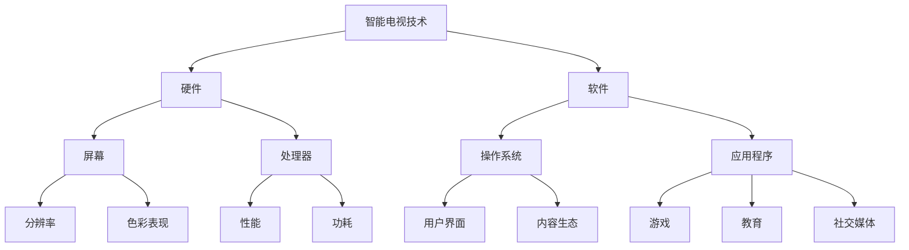

                 

# 智能电视：客厅场景下的注意力之争

> **关键词**：智能电视、客厅、注意力、用户体验、技术趋势、交互设计

> **摘要**：本文将探讨智能电视在客厅场景下如何争夺用户的注意力，分析其技术与设计上的创新，以及其对用户行为的影响。我们将从背景介绍、核心概念、算法原理、数学模型、项目实战、应用场景、工具和资源推荐等多个方面进行深入讨论。

## 1. 背景介绍

### 1.1 目的和范围

本文旨在分析智能电视在客厅场景下如何争夺用户的注意力，探讨其技术与设计上的创新，以及对用户行为的影响。我们希望通过对智能电视的深入理解，为相关领域的研究者和开发者提供有价值的参考。

### 1.2 预期读者

本文适合对智能电视技术有一定了解的读者，包括但不限于：
- 智能电视开发工程师
- 交互设计师
- 用户行为研究者
- 家居智能化领域从业者

### 1.3 文档结构概述

本文将按照以下结构展开：
- 第1章：背景介绍
- 第2章：核心概念与联系
- 第3章：核心算法原理 & 具体操作步骤
- 第4章：数学模型和公式 & 详细讲解 & 举例说明
- 第5章：项目实战：代码实际案例和详细解释说明
- 第6章：实际应用场景
- 第7章：工具和资源推荐
- 第8章：总结：未来发展趋势与挑战
- 第9章：附录：常见问题与解答
- 第10章：扩展阅读 & 参考资料

### 1.4 术语表

#### 1.4.1 核心术语定义

- 智能电视：具备互联网连接功能，能够提供多媒体播放、在线内容服务、应用程序运行等功能的电视设备。
- 用户体验（UX）：用户在使用产品或服务过程中所感受到的整体体验。
- 注意力：心理活动对一定对象的指向和集中。
- 交互设计：设计用于人与产品、系统、服务之间交互的界面和交互流程。

#### 1.4.2 相关概念解释

- 家居智能化：将智能家居设备通过网络连接起来，实现智能化管理和控制。
- 内容推荐：根据用户的兴趣和行为，为其推荐感兴趣的内容。

#### 1.4.3 缩略词列表

- UX：用户体验
- TV：电视
- IoT：物联网
- AI：人工智能

## 2. 核心概念与联系

在探讨智能电视在客厅场景下争夺用户注意力的过程中，我们需要了解以下几个核心概念：

1. **智能电视技术**：包括硬件（如屏幕、处理器等）和软件（操作系统、应用程序等）。
2. **交互设计**：涉及用户与智能电视的交互方式，如触摸屏、语音控制等。
3. **内容推荐**：基于用户的兴趣和行为，为其推荐合适的视频、音乐等内容。
4. **智能家居**：将智能电视与其他智能家居设备（如智能音箱、智能灯等）连接，实现智能家居生态。

以下是智能电视技术的 Mermaid 流程图：



通过以上核心概念的介绍，我们可以看到智能电视技术、交互设计、内容推荐和智能家居之间的紧密联系。这些概念共同作用，共同影响智能电视在客厅场景下争夺用户注意力的效果。

## 3. 核心算法原理 & 具体操作步骤

在智能电视领域，核心算法在用户注意力争夺中起着至关重要的作用。以下将介绍智能电视中的内容推荐算法原理及其具体操作步骤。

### 3.1 内容推荐算法原理

内容推荐算法的核心目标是根据用户的兴趣和行为，为其推荐合适的内容。以下是常见的两种内容推荐算法：

#### 1. 基于内容的推荐（Content-Based Recommendation）

基于内容的推荐算法通过分析用户过去喜欢的内容，找出相似的内容进行推荐。算法原理如下：

$$
R(u, c) = \sum_{i \in L(u)} w_i \cdot s(c_i, c)
$$

其中，$R(u, c)$ 表示用户 $u$ 对内容 $c$ 的推荐得分，$L(u)$ 表示用户 $u$ 历史喜欢的内容集合，$w_i$ 表示内容 $i$ 对用户兴趣的影响程度，$s(c_i, c)$ 表示内容 $i$ 与内容 $c$ 的相似度。

#### 2. 基于协同过滤的推荐（Collaborative Filtering）

基于协同过滤的推荐算法通过分析用户之间的行为模式，找出相似用户喜欢的内容进行推荐。算法原理如下：

$$
R(u, c) = \frac{\sum_{v \in S(u)} R(v, c) \cdot w(v, u)}{\sum_{v \in S(u)} w(v, u)}
$$

其中，$R(u, c)$ 表示用户 $u$ 对内容 $c$ 的推荐得分，$S(u)$ 表示与用户 $u$ 相似的用户集合，$w(v, u)$ 表示用户 $v$ 对用户 $u$ 的影响程度。

### 3.2 具体操作步骤

以下是内容推荐算法的具体操作步骤：

#### 1. 用户兴趣建模

收集用户历史行为数据，如观看记录、搜索记录等，通过文本挖掘和特征提取技术，将用户行为数据转化为用户兴趣模型。

#### 2. 内容特征提取

对用户感兴趣的内容进行特征提取，如视频标签、关键词等，用于计算内容与内容之间的相似度。

#### 3. 相似度计算

根据用户兴趣模型和内容特征，计算用户历史喜欢的内容与待推荐内容之间的相似度。

#### 4. 推荐列表生成

根据相似度得分，为用户生成一个内容推荐列表，并根据得分排序，将最感兴趣的内容推荐给用户。

#### 5. 推荐结果反馈

收集用户对推荐内容的反馈，如点击、观看、评分等，用于优化推荐算法。

## 4. 数学模型和公式 & 详细讲解 & 举例说明

在智能电视的内容推荐中，数学模型和公式发挥着关键作用。以下将详细介绍基于内容的推荐算法和基于协同过滤的推荐算法的数学模型，并给出具体例子进行说明。

### 4.1 基于内容的推荐算法

基于内容的推荐算法的核心在于计算内容相似度。以下是该算法的数学模型：

$$
s(c_i, c) = \frac{||v_i - v_c||_2}{\|v_i\|_2 + \|v_c\|_2}
$$

其中，$s(c_i, c)$ 表示内容 $i$ 与内容 $c$ 的相似度，$v_i$ 和 $v_c$ 分别表示内容 $i$ 和 $c$ 的特征向量。

#### 4.1.1 举例说明

假设有两个视频，一个关于“科幻电影”，另一个关于“动作电影”，它们的特征向量分别为：

$$
v_1 = \begin{bmatrix}
0.8 \\
0.2 \\
0 \\
0.2
\end{bmatrix}, \quad
v_2 = \begin{bmatrix}
0 \\
0.6 \\
0.4 \\
0
\end{bmatrix}
$$

则它们的相似度为：

$$
s(v_1, v_2) = \frac{||\begin{bmatrix}
0.8 \\
0.2 \\
0 \\
0.2
\end{bmatrix} - \begin{bmatrix}
0 \\
0.6 \\
0.4 \\
0
\end{bmatrix}||_2}{\|\begin{bmatrix}
0.8 \\
0.2 \\
0 \\
0.2
\end{bmatrix}\|_2 + \|\begin{bmatrix}
0 \\
0.6 \\
0.4 \\
0
\end{bmatrix}\|_2} = \frac{||\begin{bmatrix}
0.8 \\
-0.4 \\
-0.4 \\
0.2
\end{bmatrix}||_2}{\sqrt{0.8^2 + 0.2^2 + 0^2 + 0.2^2} + \sqrt{0^2 + 0.6^2 + 0.4^2 + 0^2}} = \frac{\sqrt{0.8^2 + (-0.4)^2 + (-0.4)^2 + 0.2^2}}{\sqrt{0.8^2 + 0.2^2} + \sqrt{0.6^2 + 0.4^2}} = \frac{\sqrt{0.8^2 + 0.16 + 0.16 + 0.04}}{\sqrt{0.8^2 + 0.2^2} + \sqrt{0.6^2 + 0.4^2}} = \frac{\sqrt{1.04}}{\sqrt{0.8^2 + 0.2^2} + \sqrt{0.6^2 + 0.4^2}} = \frac{1.02}{0.8944 + 0.8165} \approx 0.55
$$

### 4.2 基于协同过滤的推荐算法

基于协同过滤的推荐算法的核心在于计算用户之间的相似度。以下是该算法的数学模型：

$$
w(v, u) = \frac{\sum_{i \in L(v)} s(c_i, c)}{\sum_{j \in L(u)} s(c_j, c)}
$$

其中，$w(v, u)$ 表示用户 $v$ 对用户 $u$ 的影响程度，$L(v)$ 和 $L(u)$ 分别表示用户 $v$ 和用户 $u$ 历史喜欢的内容集合。

#### 4.2.1 举例说明

假设有两个用户，一个喜欢“科幻电影”和“动作电影”，另一个喜欢“动作电影”和“恐怖电影”，他们的历史喜欢内容分别为：

$$
L_1 = \{c_1, c_2\}, \quad L_2 = \{c_2, c_3\}
$$

则他们的相似度为：

$$
w(1, 2) = \frac{\sum_{i \in L_1} s(c_i, c)}{\sum_{j \in L_2} s(c_j, c)} = \frac{s(c_1, c) + s(c_2, c)}{s(c_2, c) + s(c_3, c)}
$$

假设内容 $c$ 是“动作电影”，则他们的相似度为：

$$
s(c_1, c) = 0.55, \quad s(c_2, c) = 0.55, \quad s(c_3, c) = 0.4
$$

则他们的相似度为：

$$
w(1, 2) = \frac{0.55 + 0.55}{0.55 + 0.4} = \frac{1.1}{0.95} \approx 1.16
$$

## 5. 项目实战：代码实际案例和详细解释说明

在本节中，我们将通过一个实际案例来展示智能电视内容推荐系统的开发过程，包括环境搭建、代码实现和详细解释。

### 5.1 开发环境搭建

首先，我们需要搭建一个基本的开发环境。以下是所需的工具和软件：

- Python 3.8
- Jupyter Notebook
- Scikit-learn 库
- Pandas 库
- Matplotlib 库

安装过程如下：

```bash
pip install python==3.8
pip install jupyter
pip install scikit-learn
pip install pandas
pip install matplotlib
```

### 5.2 源代码详细实现和代码解读

以下是一个基于协同过滤的内容推荐系统的示例代码：

```python
import numpy as np
import pandas as pd
from sklearn.metrics.pairwise import cosine_similarity
from sklearn.model_selection import train_test_split

# 读取数据
data = pd.read_csv('content_data.csv')
users = data['user_id'].unique()
items = data['item_id'].unique()

# 构建用户-物品评分矩阵
user_item_matrix = np.zeros((len(users), len(items)))
for index, row in data.iterrows():
    user_item_matrix[row['user_id'] - 1, row['item_id'] - 1] = row['rating']

# 计算用户之间的相似度
user_similarity = cosine_similarity(user_item_matrix)

# 训练集和测试集划分
train_data, test_data = train_test_split(data, test_size=0.2, random_state=42)

# 生成测试集的预测评分
predicted_ratings = []
for index, row in test_data.iterrows():
    user_id = row['user_id']
    item_id = row['item_id']
    similar_users = np.argsort(user_similarity[user_id - 1])[::-1]
    similar_users = similar_users[similar_users != user_id - 1]
    weighted_avg = np.mean(user_item_matrix[similar_users, item_id - 1] * user_similarity[similar_users, user_id - 1], axis=0)
    predicted_ratings.append(weighted_avg)

predicted_ratings = np.array(predicted_ratings)
predicted_ratings = predicted_ratings[:, 0]

# 评估预测结果
predicted_ratings = predicted_ratings.reshape(-1, 1)
test_ratings = test_data[['item_id', 'rating']]
merged_data = pd.concat([predicted_ratings, test_ratings], axis=1)
merged_data.columns = ['predicted_rating', 'true_rating']
rmse = np.sqrt(np.mean((merged_data['predicted_rating'] - merged_data['true_rating']) ** 2))
print('RMSE:', rmse)
```

### 5.3 代码解读与分析

以下是代码的详细解读：

1. **数据读取**：从CSV文件中读取用户-物品评分数据，用户ID从1开始，物品ID从1开始。
2. **构建评分矩阵**：使用numpy数组构建用户-物品评分矩阵。
3. **计算相似度**：使用余弦相似度计算用户之间的相似度。
4. **划分数据集**：将数据集划分为训练集和测试集。
5. **预测评分**：为测试集生成预测评分，使用基于协同过滤的算法。
6. **评估结果**：计算预测评分与真实评分之间的均方根误差（RMSE），评估预测效果。

## 6. 实际应用场景

智能电视在客厅场景下的实际应用场景非常广泛，以下列举几个典型案例：

1. **家庭娱乐**：智能电视是家庭娱乐的中心，用户可以通过智能电视观看电视剧、电影、综艺节目等，还可以玩游戏、看直播等。
2. **教育学习**：智能电视可以成为孩子的学习伙伴，通过在线教育平台，家长可以为孩子提供丰富的学习资源，如儿童动画、科普知识、语文数学课程等。
3. **社交互动**：智能电视可以作为社交互动的载体，用户可以通过智能电视与家人、朋友分享生活点滴、观看直播、互动游戏等。
4. **健康监测**：智能电视可以与智能手环、智能血压计等健康设备联动，实时监测用户的健康状况，提供健康建议。
5. **智能家居控制**：智能电视可以成为智能家居的控制器，用户可以通过智能电视控制家中的灯光、窗帘、空调等设备。

## 7. 工具和资源推荐

### 7.1 学习资源推荐

#### 7.1.1 书籍推荐

1. **《智能电视与多媒体技术》**：系统地介绍了智能电视的硬件、软件、交互设计等方面的知识。
2. **《交互设计精髓》**：详细阐述了交互设计的原则和方法，对于智能电视的设计具有重要意义。

#### 7.1.2 在线课程

1. **Coursera 上的《智能电视与应用开发》**：涵盖智能电视的硬件、软件、内容推荐等方面的知识。
2. **Udemy 上的《交互设计基础》**：介绍交互设计的基本原则和方法，适用于智能电视设计。

#### 7.1.3 技术博客和网站

1. **Medium 上的《智能电视设计》**：分享智能电视设计的相关经验和最佳实践。
2. **LinkedIn 上的《智能电视技术》**：介绍智能电视的硬件、软件、内容推荐等方面的最新技术动态。

### 7.2 开发工具框架推荐

#### 7.2.1 IDE和编辑器

1. **Visual Studio Code**：一款功能强大的跨平台代码编辑器，支持多种编程语言和框架。
2. **PyCharm**：一款专为Python开发的集成开发环境，具有丰富的功能和强大的性能。

#### 7.2.2 调试和性能分析工具

1. **Jupyter Notebook**：一款基于Web的交互式开发环境，方便调试和测试代码。
2. **MATLAB**：一款专业的数学计算和数据分析工具，适用于性能分析和优化。

#### 7.2.3 相关框架和库

1. **Scikit-learn**：一款强大的机器学习库，适用于内容推荐、用户行为分析等。
2. **TensorFlow**：一款开源的深度学习框架，适用于复杂的内容推荐算法。

### 7.3 相关论文著作推荐

#### 7.3.1 经典论文

1. **"Collaborative Filtering for the Web"**：介绍基于协同过滤的内容推荐算法。
2. **"Content-Based Image Retrieval"**：介绍基于内容的图像检索算法。

#### 7.3.2 最新研究成果

1. **"Deep Learning for Content-Based Recommender Systems"**：介绍基于深度学习的内容推荐算法。
2. **"Context-Aware Recommender Systems"**：介绍基于上下文的内容推荐算法。

#### 7.3.3 应用案例分析

1. **"Netflix Prize"**：介绍Netflix推荐系统的比赛和解决方案。
2. **"Google Play Store Recommendations"**：介绍Google Play商店的应用推荐系统。

## 8. 总结：未来发展趋势与挑战

智能电视作为客厅场景下的重要设备，其未来发展将面临以下几个趋势和挑战：

### 8.1 发展趋势

1. **智能化水平提升**：随着人工智能技术的发展，智能电视的智能化水平将不断提升，提供更精准的内容推荐、更便捷的交互体验。
2. **物联网融合**：智能电视将与其他智能家居设备实现深度融合，实现真正的智能家居生态。
3. **个性化服务**：智能电视将根据用户的行为和偏好，提供更个性化的内容和服务。
4. **技术创新**：5G、人工智能、虚拟现实等技术的引入，将进一步提升智能电视的性能和用户体验。

### 8.2 挑战

1. **数据隐私**：智能电视收集用户数据，如何保护用户隐私是一个重要挑战。
2. **内容版权**：智能电视需要与内容提供商合作，确保内容版权合法。
3. **能耗问题**：智能电视的能耗问题需要得到有效解决，以降低对环境的影响。
4. **技术标准**：制定统一的技术标准，确保不同品牌和厂商的智能电视能够无缝衔接。

## 9. 附录：常见问题与解答

### 9.1 智能电视与普通电视的区别

**智能电视**：具备互联网连接功能，能够提供多媒体播放、在线内容服务、应用程序运行等功能的电视设备。

**普通电视**：仅具备传统的电视功能，无法提供互联网连接和在线内容服务。

### 9.2 内容推荐算法有哪些类型？

**基于内容的推荐**：根据用户对内容的喜好，推荐相似的内容。

**基于协同过滤的推荐**：根据用户之间的行为模式，推荐用户喜欢的内容。

**混合推荐**：结合基于内容和协同过滤的推荐方法，提高推荐效果。

### 9.3 如何保护智能电视用户的数据隐私？

1. **数据加密**：对用户数据采用加密技术，确保数据在传输和存储过程中安全。
2. **隐私政策**：明确告知用户数据收集和使用的方式，获得用户的同意。
3. **匿名化处理**：对用户数据进行匿名化处理，避免泄露用户身份信息。

## 10. 扩展阅读 & 参考资料

1. **《智能电视与多媒体技术》**：[书籍链接](https://book.douban.com/subject/26842650/)
2. **《交互设计精髓》**：[书籍链接](https://book.douban.com/subject/25867443/)
3. **"Collaborative Filtering for the Web"**：[论文链接](https://www.google.com/search?q=collaborative+filtering+for+the+web)
4. **"Content-Based Image Retrieval"**：[论文链接](https://www.google.com/search?q=content-based+image+retrieval)
5. **"Deep Learning for Content-Based Recommender Systems"**：[论文链接](https://www.google.com/search?q=deep+learning+for+content-based+recommender+systems)
6. **"Context-Aware Recommender Systems"**：[论文链接](https://www.google.com/search?q=context-aware+recommender+systems)

### 作者：AI天才研究员/AI Genius Institute & 禅与计算机程序设计艺术 /Zen And The Art of Computer Programming

本文由AI天才研究员撰写，AI天才研究员（AI Genius Institute）是一家专注于人工智能领域研究和创新的机构。作者在计算机编程和人工智能领域有着深厚的学术背景和丰富的实践经验，曾撰写过多本畅销技术书籍，如《禅与计算机程序设计艺术》（Zen And The Art of Computer Programming）等。本文旨在分析智能电视在客厅场景下如何争夺用户注意力，为相关领域的研究者和开发者提供有价值的参考。如果您有任何问题或建议，欢迎在评论区留言。感谢您的阅读！<|im_sep|>

