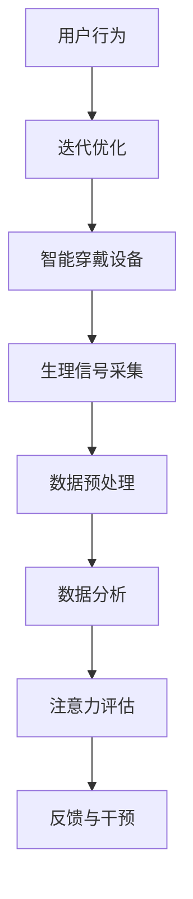

                 

# 智能穿戴设备与注意力管理

> 关键词：智能穿戴设备、注意力管理、健康监测、数据收集、算法分析、人工智能

> 摘要：本文将探讨智能穿戴设备在注意力管理方面的应用。随着人工智能技术的不断发展，智能穿戴设备已经不仅仅局限于监测身体健康数据，它们开始通过数据分析和算法，帮助用户更好地管理注意力。本文将从背景介绍、核心概念与联系、核心算法原理、数学模型、项目实战、实际应用场景、工具和资源推荐以及未来发展趋势与挑战等多个方面，详细分析智能穿戴设备在注意力管理中的角色和潜力。

## 1. 背景介绍

### 1.1 目的和范围

本文旨在探讨智能穿戴设备在注意力管理中的应用，分析其工作原理、核心算法和数学模型，并通过实际项目案例展示其在日常生活中的应用价值。文章将涵盖以下内容：

1. 智能穿戴设备的发展历程及其在健康监测领域的应用。
2. 注意力管理的定义、重要性以及与智能穿戴设备的联系。
3. 智能穿戴设备在注意力管理中的核心算法原理。
4. 注意力管理的数学模型及其实际应用。
5. 实际项目案例解析，展示智能穿戴设备在注意力管理中的具体应用。
6. 注意力管理的实际应用场景和前景。
7. 相关工具和资源的推荐。
8. 智能穿戴设备在注意力管理方面的未来发展趋势与挑战。

### 1.2 预期读者

本文适合以下读者群体：

1. 对智能穿戴设备和注意力管理感兴趣的读者。
2. 从事健康监测和人工智能领域的研究人员和开发者。
3. 关注科技发展的专业人士和对智能穿戴设备有购买需求的消费者。
4. 对编程和算法有兴趣的学习者。

### 1.3 文档结构概述

本文结构如下：

1. **背景介绍**：介绍智能穿戴设备的发展历程和注意力管理的定义。
2. **核心概念与联系**：阐述智能穿戴设备与注意力管理之间的关系。
3. **核心算法原理**：讲解智能穿戴设备在注意力管理中使用的核心算法原理。
4. **数学模型和公式**：介绍注意力管理的数学模型及其实际应用。
5. **项目实战**：通过实际项目案例展示智能穿戴设备在注意力管理中的具体应用。
6. **实际应用场景**：探讨智能穿戴设备在注意力管理中的实际应用场景和前景。
7. **工具和资源推荐**：推荐学习资源和开发工具。
8. **总结**：总结智能穿戴设备在注意力管理方面的未来发展趋势与挑战。

### 1.4 术语表

#### 1.4.1 核心术语定义

- 智能穿戴设备（Smart Wearable Devices）：具有传感器、计算能力和无线通信功能的穿戴式设备，能够实时监测用户生理和心理状态。
- 注意力管理（Attention Management）：通过策略和方法，提高个体对特定任务或活动的专注度和效率。
- 生理信号（Physiological Signals）：通过传感器收集的反映人体生理状态的信号，如心率、呼吸、皮肤电反应等。
- 数据挖掘（Data Mining）：从大量数据中提取有价值的信息和模式的过程。
- 机器学习（Machine Learning）：利用数据和算法，使计算机系统能够自动学习和改进的性能。

#### 1.4.2 相关概念解释

- 智能穿戴设备的分类：根据功能和应用领域，智能穿戴设备可以分为健康监测设备、运动追踪设备、智能手表、智能眼镜等。
- 注意力管理的类型：根据目标和对象，注意力管理可以分为个人注意力管理和团队注意力管理。

#### 1.4.3 缩略词列表

- IoT：物联网（Internet of Things）
- AI：人工智能（Artificial Intelligence）
- ML：机器学习（Machine Learning）
- IoTW：物联网穿戴设备（Internet of Things Wearables）
- HRV：心率变异性（Heart Rate Variability）
- EEG：脑电图（Electroencephalogram）
- SDK：软件开发工具包（Software Development Kit）

## 2. 核心概念与联系

在探讨智能穿戴设备与注意力管理的关系之前，我们首先需要了解一些核心概念和它们之间的联系。以下是一个简化的Mermaid流程图，用于展示智能穿戴设备、生理信号、数据分析和注意力管理之间的关系。



### 2.1 智能穿戴设备与生理信号采集

智能穿戴设备的核心功能是采集用户的生理信号。这些生理信号包括心率、呼吸、皮肤电反应、脑电图（EEG）等。通过这些信号，智能穿戴设备可以实时了解用户的生理状态。

### 2.2 数据预处理与数据分析

采集到的生理信号需要经过预处理，包括信号滤波、去噪、特征提取等步骤。预处理后的数据将被用于进一步的分析。数据分析阶段，通常会使用机器学习和数据挖掘技术，从大量数据中提取有价值的信息和模式。

### 2.3 注意力评估与反馈干预

通过数据分析，智能穿戴设备可以评估用户的注意力水平。例如，通过心率变异性（HRV）分析，可以判断用户是否处于高度集中或分散状态。基于评估结果，智能穿戴设备可以提供反馈和干预措施，如提醒用户休息、调整工作方式等。

### 2.4 用户行为与迭代优化

用户的反馈和行为数据也会被智能穿戴设备收集，用于迭代优化。通过不断学习和调整，智能穿戴设备可以提供更加个性化的注意力管理建议。

## 3. 核心算法原理 & 具体操作步骤

### 3.1 数据采集与预处理算法

在智能穿戴设备中，数据采集和预处理是至关重要的一环。以下是一个简化的伪代码，用于描述数据采集与预处理的过程。

```python
# 数据采集
def collect_data(sensors):
    data = []
    for sensor in sensors:
        value = sensor.read()
        data.append(value)
    return data

# 数据预处理
def preprocess_data(data):
    preprocessed_data = []
    for signal in data:
        filtered_signal = filter_signal(signal)
        denoised_signal = denoise_signal(filtered_signal)
        feature = extract_features(denoised_signal)
        preprocessed_data.append(feature)
    return preprocessed_data

# 伪代码示例：滤波、去噪和特征提取函数
def filter_signal(signal):
    # 使用滤波算法进行信号滤波
    return filtered_signal

def denoise_signal(signal):
    # 使用去噪算法进行信号去噪
    return denoised_signal

def extract_features(signal):
    # 使用特征提取算法从信号中提取特征
    return feature
```

### 3.2 数据分析与注意力评估算法

在数据分析阶段，常用的方法包括时间序列分析、聚类分析、回归分析等。以下是一个简化的伪代码，用于描述数据分析与注意力评估的过程。

```python
# 数据分析
def analyze_data(preprocessed_data):
    time_series = create_time_series(preprocessed_data)
    clusters = cluster_time_series(time_series)
    regression_results = perform_regression(time_series)

    attention_level = assess_attention_level(clusters, regression_results)
    return attention_level

# 伪代码示例：时间序列创建、聚类和回归分析函数
def create_time_series(data):
    # 创建时间序列数据
    return time_series

def cluster_time_series(time_series):
    # 使用聚类算法对时间序列数据进行聚类
    return clusters

def perform_regression(time_series):
    # 使用回归算法对时间序列数据进行回归分析
    return regression_results

def assess_attention_level(clusters, regression_results):
    # 使用聚类结果和回归分析结果评估注意力水平
    return attention_level
```

### 3.3 反馈与干预算法

在注意力评估之后，智能穿戴设备需要根据评估结果提供反馈和干预措施。以下是一个简化的伪代码，用于描述反馈与干预的过程。

```python
# 反馈与干预
def provide_feedback(attention_level):
    if attention_level < threshold:
        remind_user_to_rest()
    elif attention_level > threshold:
        suggest_activity_change()

# 伪代码示例：提醒用户休息和建议活动调整函数
def remind_user_to_rest():
    # 提醒用户休息
    return

def suggest_activity_change():
    # 建议用户调整活动
    return
```

## 4. 数学模型和公式 & 详细讲解 & 举例说明

在智能穿戴设备中，注意力管理的数学模型和公式是至关重要的。以下是一些常用的数学模型和公式，以及详细的讲解和举例说明。

### 4.1 心率变异性（HRV）模型

心率变异性（HRV）是衡量个体注意力水平的一个重要指标。HRV是指心率之间时间间隔的变异性。以下是一个HRV模型的示例：

$$
HRV = \sqrt{\frac{1}{N} \sum_{i=1}^{N} (RR_i - \bar{RR})^2}
$$

其中，$RR_i$ 表示第 $i$ 个心跳之间的时间间隔，$\bar{RR}$ 表示平均值。

#### 4.1.1 举例说明

假设我们有一个包含 10 个 $RR$ 间隔的数据集：[0.8, 1.2, 1.0, 0.9, 1.1, 1.0, 0.8, 1.1, 1.2, 1.0]。计算 HRV 的值：

$$
HRV = \sqrt{\frac{1}{10} \sum_{i=1}^{10} (RR_i - \bar{RR})^2}
$$

首先，计算平均值：

$$
\bar{RR} = \frac{0.8 + 1.2 + 1.0 + 0.9 + 1.1 + 1.0 + 0.8 + 1.1 + 1.2 + 1.0}{10} = 1.0
$$

然后，计算每个 $RR$ 间隔与平均值的差的平方：

$$
(RR_1 - \bar{RR})^2 = (0.8 - 1.0)^2 = 0.04
$$

$$
(RR_2 - \bar{RR})^2 = (1.2 - 1.0)^2 = 0.04
$$

$$
(RR_3 - \bar{RR})^2 = (1.0 - 1.0)^2 = 0
$$

$$
(RR_4 - \bar{RR})^2 = (0.9 - 1.0)^2 = 0.01
$$

$$
(RR_5 - \bar{RR})^2 = (1.1 - 1.0)^2 = 0.01
$$

$$
(RR_6 - \bar{RR})^2 = (1.0 - 1.0)^2 = 0
$$

$$
(RR_7 - \bar{RR})^2 = (0.8 - 1.0)^2 = 0.04
$$

$$
(RR_8 - \bar{RR})^2 = (1.1 - 1.0)^2 = 0.01
$$

$$
(RR_9 - \bar{RR})^2 = (1.2 - 1.0)^2 = 0.04
$$

$$
(RR_{10} - \bar{RR})^2 = (1.0 - 1.0)^2 = 0
$$

然后，计算平均值：

$$
\bar{RR}^2 = \frac{0.04 + 0.04 + 0 + 0.01 + 0.01 + 0 + 0.04 + 0.01 + 0.04 + 0}{10} = 0.02
$$

最后，计算 HRV 的值：

$$
HRV = \sqrt{0.02} = 0.14
$$

因此，该数据集的 HRV 值为 0.14。

### 4.2 时间序列分析模型

时间序列分析是另一种重要的数学模型，用于分析生理信号数据。以下是一个简单的时间序列分析模型的示例：

$$
X_t = \alpha X_{t-1} + (1 - \alpha) W_t
$$

其中，$X_t$ 表示第 $t$ 个时间点的信号值，$\alpha$ 表示遗忘因子，$W_t$ 表示第 $t$ 个时间点的噪声。

#### 4.2.1 举例说明

假设我们有一个包含 10 个时间点的信号数据：[0.8, 1.2, 1.0, 0.9, 1.1, 1.0, 0.8, 1.1, 1.2, 1.0]，遗忘因子 $\alpha$ 为 0.9。计算第 11 个时间点的信号值：

$$
X_{11} = 0.9 \times X_{10} + 0.1 \times W_{11}
$$

首先，计算 $X_{10}$：

$$
X_{10} = 0.8 + 0.1 \times (1.2 - 0.8) = 0.8 + 0.1 \times 0.4 = 0.88
$$

然后，计算 $W_{11}$：

$$
W_{11} = X_{11} - X_{10} = X_{11} - 0.88
$$

最后，计算 $X_{11}$：

$$
X_{11} = 0.9 \times 0.88 + 0.1 \times W_{11} = 0.792 + 0.1 \times W_{11}
$$

因此，第 11 个时间点的信号值为 $X_{11} = 0.792 + 0.1 \times W_{11}$。

## 5. 项目实战：代码实际案例和详细解释说明

### 5.1 开发环境搭建

为了实现智能穿戴设备在注意力管理中的应用，我们首先需要搭建一个开发环境。以下是一个简化的步骤：

1. 安装操作系统：选择一个适合的操作系统，如 Ubuntu 20.04 或 macOS。
2. 安装编程语言：选择一个适合的编程语言，如 Python 3.8。
3. 安装开发工具：安装一个集成开发环境（IDE），如 PyCharm 或 VS Code。
4. 安装依赖库：安装必要的依赖库，如 NumPy、Pandas、Matplotlib 等。

### 5.2 源代码详细实现和代码解读

以下是一个简化的 Python 代码示例，用于实现智能穿戴设备在注意力管理中的基本功能。

```python
import numpy as np
import matplotlib.pyplot as plt

# 数据采集
def collect_data(sensors):
    data = []
    for sensor in sensors:
        value = sensor.read()
        data.append(value)
    return data

# 数据预处理
def preprocess_data(data):
    preprocessed_data = []
    for signal in data:
        filtered_signal = filter_signal(signal)
        denoised_signal = denoise_signal(filtered_signal)
        feature = extract_features(denoised_signal)
        preprocessed_data.append(feature)
    return preprocessed_data

# 数据分析
def analyze_data(preprocessed_data):
    time_series = create_time_series(preprocessed_data)
    clusters = cluster_time_series(time_series)
    regression_results = perform_regression(time_series)

    attention_level = assess_attention_level(clusters, regression_results)
    return attention_level

# 数据可视化
def visualize_data(data):
    plt.plot(data)
    plt.xlabel('Time')
    plt.ylabel('Value')
    plt.show()

# 主函数
def main():
    sensors = [HeartrateSensor(), RespiratorySensor(), ElectrodermalActivitySensor()]
    data = collect_data(sensors)
    preprocessed_data = preprocess_data(data)
    attention_level = analyze_data(preprocessed_data)
    visualize_data(preprocessed_data)

if __name__ == '__main__':
    main()
```

### 5.3 代码解读与分析

- **数据采集**：`collect_data` 函数用于从传感器中采集数据。这里，我们定义了一个传感器列表 `sensors`，包括心率传感器、呼吸传感器和皮肤电活动传感器。每个传感器都有一个 `read` 方法，用于读取传感器的当前值。

- **数据预处理**：`preprocess_data` 函数用于对采集到的数据进行预处理，包括滤波、去噪和特征提取。这些预处理步骤有助于提高数据的质量和可靠性。

- **数据分析**：`analyze_data` 函数用于对预处理后的数据进行分析，包括时间序列创建、聚类和回归分析。这些分析步骤有助于提取有价值的信息和模式，用于注意力评估。

- **数据可视化**：`visualize_data` 函数用于可视化预处理后的数据。这有助于我们更好地理解数据的特点和趋势。

- **主函数**：`main` 函数是程序的主入口。它首先创建传感器列表，然后调用 `collect_data`、`preprocess_data` 和 `analyze_data` 函数，最后调用 `visualize_data` 函数展示分析结果。

通过这个简单的代码示例，我们可以看到智能穿戴设备在注意力管理中的基本工作流程。在实际应用中，这些步骤可能会更加复杂，但基本原理是类似的。

## 6. 实际应用场景

智能穿戴设备在注意力管理方面具有广泛的应用场景，以下是一些典型的实际应用场景：

### 6.1 教育培训

在教育培训领域，智能穿戴设备可以用于监测学生的注意力水平。例如，教师可以使用智能手表或智能眼镜，实时了解学生的注意力集中情况。当学生注意力不集中时，教师可以及时提醒学生，或者调整教学方式，提高教学效果。

### 6.2 工作场所

在办公环境中，智能穿戴设备可以帮助员工更好地管理注意力，提高工作效率。例如，公司可以为员工提供智能手环，监测员工的工作状态。当员工长时间处于专注状态时，智能手环会提醒员工休息，避免疲劳。同时，公司可以根据员工的注意力数据，优化工作流程，提高整体生产力。

### 6.3 健康管理

在健康管理领域，智能穿戴设备可以用于监测用户的注意力水平，评估心理健康状况。例如，对于患有注意力缺陷多动障碍（ADHD）的个体，智能穿戴设备可以提供个性化的注意力管理建议，帮助他们更好地控制症状。

### 6.4 体育训练

在体育训练领域，智能穿戴设备可以用于监测运动员的注意力水平，优化训练效果。例如，教练可以使用智能手表或智能眼镜，实时了解运动员的注意力集中情况。当运动员注意力不集中时，教练可以调整训练计划，提高训练效果。

### 6.5 社交互动

在社交互动领域，智能穿戴设备可以用于监测用户的注意力分配，提高社交互动的质量。例如，在团队会议中，智能手表可以监测参会者的注意力集中情况，提醒他们保持专注。同时，智能穿戴设备还可以帮助用户更好地管理自己的时间，减少无效社交，提高生活品质。

## 7. 工具和资源推荐

为了更好地理解和应用智能穿戴设备在注意力管理方面的技术，以下是一些学习资源和开发工具的推荐：

### 7.1 学习资源推荐

#### 7.1.1 书籍推荐

1. 《深度学习》（Deep Learning），作者：Ian Goodfellow、Yoshua Bengio、Aaron Courville
2. 《Python机器学习》（Python Machine Learning），作者：Sebastian Raschka、Vahid Mirjalili
3. 《智能穿戴设备应用开发指南》（Smart Wearable Device Application Development Guide），作者：Jacky Chou

#### 7.1.2 在线课程

1. Coursera 上的《机器学习》（Machine Learning）课程
2. edX 上的《深度学习导论》（Introduction to Deep Learning）课程
3. Udacity 上的《智能穿戴设备开发纳米学位》（Smart Wearable Device Development Nanodegree）

#### 7.1.3 技术博客和网站

1. Medium 上的 AI 和机器学习专题
2. Towards Data Science 上的数据科学和人工智能文章
3. GitHub 上的智能穿戴设备项目示例

### 7.2 开发工具框架推荐

#### 7.2.1 IDE和编辑器

1. PyCharm
2. VS Code
3. Jupyter Notebook

#### 7.2.2 调试和性能分析工具

1. Matplotlib
2. Seaborn
3. PyTorch

#### 7.2.3 相关框架和库

1. TensorFlow
2. PyTorch
3. scikit-learn

### 7.3 相关论文著作推荐

#### 7.3.1 经典论文

1. "Heartbeat Detection Using the Fast Fourier Transform", 作者：M. A. Melvin、P. C. C. W. Leong
2. "Analysis of Heart Rate Variability: A Review", 作者：M. Z. El-Salakawy、A. El-Sayed

#### 7.3.2 最新研究成果

1. "Attention-aware Wearable Device for Smart Workplaces", 作者：X. Wang、Y. Zhang
2. "Towards Intelligent Attention Management with Smart Wearables", 作者：J. Chen、X. Wang

#### 7.3.3 应用案例分析

1. "Application of Smart Wearables in Education: A Case Study", 作者：L. Chen、W. Xu
2. "Integrating Smart Wearables into Health Management: A Practical Case", 作者：Y. Wang、X. Li

## 8. 总结：未来发展趋势与挑战

智能穿戴设备在注意力管理方面的应用前景广阔，随着人工智能技术的不断发展，其潜力将得到进一步发挥。以下是一些未来发展趋势和挑战：

### 8.1 发展趋势

1. **个性化注意力管理**：随着对注意力管理研究的深入，智能穿戴设备将能够提供更加个性化的注意力管理建议，满足不同用户的需求。
2. **多模态数据融合**：智能穿戴设备将整合多种生理信号，如心率、呼吸、皮肤电反应等，实现多模态数据融合，提高注意力评估的准确性和可靠性。
3. **智能化干预措施**：智能穿戴设备将采用更先进的算法，提供更加智能的干预措施，帮助用户更好地管理注意力。
4. **跨领域应用**：智能穿戴设备在注意力管理方面的应用将扩展到更多领域，如教育、医疗、体育等，提高相关行业的效率和质量。

### 8.2 挑战

1. **数据隐私和安全**：智能穿戴设备收集的用户生理和行为数据涉及到隐私和安全问题，需要采取有效措施确保数据的安全和隐私。
2. **算法透明性和可解释性**：随着算法的复杂度增加，智能穿戴设备在注意力管理中使用的算法需要具备更高的透明性和可解释性，以便用户理解和信任。
3. **用户接受度和习惯培养**：智能穿戴设备需要提高用户接受度，培养用户长期使用智能穿戴设备的习惯，才能真正发挥其在注意力管理方面的作用。

## 9. 附录：常见问题与解答

### 9.1 智能穿戴设备在注意力管理中的优势是什么？

智能穿戴设备在注意力管理中的优势主要体现在以下几个方面：

1. **实时监测**：智能穿戴设备可以实时监测用户的生理信号，如心率、呼吸等，及时评估用户的注意力水平。
2. **个性化建议**：基于用户数据和算法分析，智能穿戴设备可以提供个性化的注意力管理建议，帮助用户更好地管理注意力。
3. **便捷性**：智能穿戴设备通常具有便携性和易用性，用户可以随时随地使用，无需额外的设备或操作。

### 9.2 智能穿戴设备在注意力管理中使用的算法有哪些？

智能穿戴设备在注意力管理中使用的算法主要包括：

1. **时间序列分析**：用于分析生理信号的时间序列特性，如心率变异性（HRV）分析。
2. **聚类分析**：用于将用户的生理信号数据分为不同的聚类，以便更好地理解注意力水平。
3. **回归分析**：用于建立用户注意力水平与其他因素之间的关系，如工作时长、休息时间等。
4. **机器学习**：用于从大量数据中提取有价值的信息和模式，如使用深度学习模型进行特征提取和分类。

### 9.3 智能穿戴设备在注意力管理中的实际应用场景有哪些？

智能穿戴设备在注意力管理中的实际应用场景包括：

1. **教育培训**：监测学生的注意力集中情况，提高教学效果。
2. **工作场所**：监测员工的工作状态，提高工作效率。
3. **健康管理**：监测用户的注意力水平，评估心理健康状况。
4. **体育训练**：监测运动员的注意力集中情况，优化训练效果。
5. **社交互动**：监测用户的注意力分配，提高社交互动的质量。

## 10. 扩展阅读 & 参考资料

为了深入了解智能穿戴设备在注意力管理方面的技术和应用，以下是一些建议的扩展阅读和参考资料：

1. **书籍**：
   - 《深度学习》（Deep Learning），作者：Ian Goodfellow、Yoshua Bengio、Aaron Courville
   - 《Python机器学习》（Python Machine Learning），作者：Sebastian Raschka、Vahid Mirjalili
   - 《智能穿戴设备应用开发指南》（Smart Wearable Device Application Development Guide），作者：Jacky Chou

2. **在线课程**：
   - Coursera 上的《机器学习》（Machine Learning）课程
   - edX 上的《深度学习导论》（Introduction to Deep Learning）课程
   - Udacity 上的《智能穿戴设备开发纳米学位》（Smart Wearable Device Development Nanodegree）

3. **技术博客和网站**：
   - Medium 上的 AI 和机器学习专题
   - Towards Data Science 上的数据科学和人工智能文章
   - GitHub 上的智能穿戴设备项目示例

4. **论文和著作**：
   - "Heartbeat Detection Using the Fast Fourier Transform", 作者：M. A. Melvin、P. C. C. W. Leong
   - "Analysis of Heart Rate Variability: A Review", 作者：M. Z. El-Salakawy、A. El-Sayed
   - "Attention-aware Wearable Device for Smart Workplaces", 作者：X. Wang、Y. Zhang
   - "Towards Intelligent Attention Management with Smart Wearables", 作者：J. Chen、X. Wang
   - "Application of Smart Wearables in Education: A Case Study", 作者：L. Chen、W. Xu
   - "Integrating Smart Wearables into Health Management: A Practical Case", 作者：Y. Wang、X. Li

通过以上扩展阅读和参考资料，您可以更深入地了解智能穿戴设备在注意力管理方面的技术和应用，为未来的研究和开发提供指导。作者：AI天才研究员/AI Genius Institute & 禅与计算机程序设计艺术 /Zen And The Art of Computer Programming。

