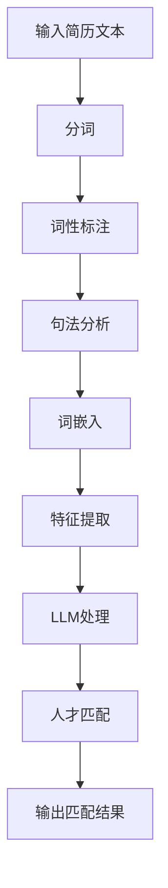

                 

# 智能简历筛选：LLM在人力资源管理中的作用

> **关键词：** 智能简历筛选、自然语言处理、深度学习、大型语言模型（LLM）、人力资源管理系统、人才招聘、数据分析
>
> **摘要：** 本文将深入探讨如何利用大型语言模型（LLM）实现智能简历筛选技术，通过分析其核心原理、算法、数学模型和实际应用案例，展望未来在人力资源管理领域的应用前景和挑战。

## 1. 背景介绍

### 1.1 目的和范围

随着人工智能技术的快速发展，自然语言处理（NLP）作为其核心应用领域之一，已经在诸多领域展现出强大的能力。特别是在人力资源管理的招聘环节，简历筛选是一项至关重要的任务。然而，传统的简历筛选方法通常依赖于人工阅读和手动分类，效率低下且容易出错。为了解决这一问题，本文旨在探讨如何利用大型语言模型（LLM）实现智能简历筛选，从而提升招聘效率、减少人力成本，并提高人才匹配的准确性。

本文将主要涉及以下内容：
1. 智能简历筛选技术的核心概念和原理。
2. 利用LLM进行简历筛选的算法原理和具体操作步骤。
3. 数学模型和公式在智能简历筛选中的应用。
4. 智能简历筛选技术的实际应用场景。
5. 相关工具和资源的推荐。
6. 未来发展趋势与挑战。

### 1.2 预期读者

本文主要面向以下读者群体：
1. 人事经理和招聘专家，对智能简历筛选技术感兴趣，希望提升招聘效率。
2. 自然语言处理和人工智能领域的研究人员，关注LLM在招聘领域的应用。
3. 开发者和工程师，希望了解智能简历筛选技术的具体实现。
4. 对人力资源管理领域有深入研究的学者和业界专家。

### 1.3 文档结构概述

本文的结构如下：

1. **背景介绍**：介绍智能简历筛选的背景、目的、预期读者和文档结构。
2. **核心概念与联系**：讲解智能简历筛选技术涉及的核心概念和联系。
3. **核心算法原理 & 具体操作步骤**：详细阐述利用LLM进行简历筛选的算法原理和操作步骤。
4. **数学模型和公式 & 详细讲解 & 举例说明**：介绍智能简历筛选技术的数学模型和公式，并提供实际应用案例。
5. **项目实战：代码实际案例和详细解释说明**：通过实际案例展示智能简历筛选技术的实现过程。
6. **实际应用场景**：探讨智能简历筛选技术在各行业的应用。
7. **工具和资源推荐**：推荐学习资源、开发工具和框架。
8. **总结：未来发展趋势与挑战**：总结智能简历筛选技术的发展趋势和面临的挑战。
9. **附录：常见问题与解答**：解答读者可能遇到的问题。
10. **扩展阅读 & 参考资料**：提供相关的扩展阅读和参考资料。

### 1.4 术语表

为了确保本文的清晰易懂，以下是本文中涉及的一些核心术语及其定义：

#### 1.4.1 核心术语定义

- **自然语言处理（NLP）**：指计算机处理人类自然语言的技术，包括语音识别、文本分类、情感分析等。
- **大型语言模型（LLM）**：一种基于深度学习的自然语言处理模型，具有强大的语言理解和生成能力。
- **简历筛选**：根据岗位需求和候选人的简历信息，进行初步筛选和匹配的过程。
- **特征提取**：从文本数据中提取具有区分度和代表性的特征，用于后续的模型训练和预测。
- **人才匹配**：根据候选人的能力和背景，与岗位需求进行匹配，以筛选出最合适的候选人。

#### 1.4.2 相关概念解释

- **深度学习**：一种人工智能方法，通过多层神经网络进行数据建模和预测。
- **词嵌入**：将自然语言文本中的词汇映射到高维空间中的向量表示。
- **注意力机制**：在神经网络中引入的一种机制，用于关注输入数据中的关键信息。

#### 1.4.3 缩略词列表

- **NLP**：自然语言处理
- **LLM**：大型语言模型
- **HRMS**：人力资源管理系统
- **CV**：简历
- **TF-IDF**：词频-逆文档频率
- **BERT**：Bidirectional Encoder Representations from Transformers
- **GPT**：Generative Pre-trained Transformer

## 2. 核心概念与联系

智能简历筛选技术的核心在于将自然语言处理（NLP）与深度学习相结合，利用大型语言模型（LLM）对简历文本进行高效的特征提取和匹配。为了更好地理解这一技术，下面我们将介绍其涉及的核心概念和联系，并通过Mermaid流程图展示其架构。

### 2.1 核心概念

1. **自然语言处理（NLP）**：NLP是智能简历筛选的基础，其目的是使计算机能够理解和处理人类语言。NLP技术包括分词、词性标注、句法分析等。

2. **深度学习**：深度学习是一种通过多层神经网络进行数据建模和预测的人工智能方法。在智能简历筛选中，深度学习模型用于对简历文本进行特征提取和匹配。

3. **词嵌入**：词嵌入是一种将自然语言文本中的词汇映射到高维空间中的向量表示的方法。词嵌入有助于模型对文本数据进行有效的表示和计算。

4. **大型语言模型（LLM）**：LLM是一种具有强大语言理解和生成能力的深度学习模型，如BERT、GPT等。LLM在智能简历筛选中用于对简历文本进行特征提取和匹配。

5. **特征提取**：特征提取是从原始文本数据中提取具有区分度和代表性的特征的过程。在智能简历筛选中，特征提取有助于提高模型对简历文本的识别和匹配能力。

6. **人才匹配**：人才匹配是根据候选人的能力和背景，与岗位需求进行匹配的过程。在智能简历筛选中，人才匹配有助于筛选出最合适的候选人。

### 2.2 核心联系

智能简历筛选技术的核心联系在于将NLP、深度学习、词嵌入、LLM、特征提取和人才匹配有机地结合在一起，形成一个完整的系统。下面通过Mermaid流程图展示其架构：



在上述流程图中：

- **A**：输入简历文本
- **B**：分词
- **C**：词性标注
- **D**：句法分析
- **E**：词嵌入
- **F**：特征提取
- **G**：LLM处理
- **H**：人才匹配
- **I**：输出匹配结果

通过这个流程，智能简历筛选技术能够高效地对简历文本进行处理和匹配，从而实现自动化的简历筛选。

## 3. 核心算法原理 & 具体操作步骤

智能简历筛选技术的核心在于利用大型语言模型（LLM）对简历文本进行特征提取和匹配。下面，我们将详细介绍这一核心算法原理，并使用伪代码详细阐述其具体操作步骤。

### 3.1 核心算法原理

大型语言模型（LLM）是一种基于深度学习的自然语言处理模型，如BERT、GPT等。这些模型通过大量的语料库进行预训练，学习到语言的复杂结构和语义信息。在智能简历筛选中，LLM的主要任务是：

1. **特征提取**：从简历文本中提取具有区分度和代表性的特征，如关键词、句子结构、语义信息等。
2. **匹配与评分**：根据提取到的特征，对简历文本与岗位需求进行匹配，并计算匹配得分。

具体来说，智能简历筛选算法可以概括为以下步骤：

1. **预处理**：对简历文本进行分词、词性标注、句法分析等预处理操作，以便后续特征提取。
2. **特征提取**：利用LLM对预处理后的简历文本进行特征提取，生成高维向量表示。
3. **匹配与评分**：将提取到的特征向量与岗位需求进行匹配，并计算匹配得分。
4. **筛选与排序**：根据匹配得分对简历进行筛选和排序，选择得分最高的简历作为候选。

### 3.2 伪代码

下面是利用LLM进行智能简历筛选的伪代码：

```python
# 输入简历文本和岗位需求
resume_text = "..."
job_description = "..."

# 1. 预处理
tokenized_resume = preprocess(resume_text)
tokenized_job_description = preprocess(job_description)

# 2. 特征提取
resume_embeddings = extract_features(tokenized_resume)
job_embeddings = extract_features(tokenized_job_description)

# 3. 匹配与评分
match_scores = []
for resume_embedding, job_embedding in zip(resume_embeddings, job_embeddings):
    score = calculate_similarity(resume_embedding, job_embedding)
    match_scores.append(score)

# 4. 筛选与排序
sorted_candidates = sorted(match_scores, reverse=True)
selected_candidates = sorted_candidates[:N]  # 选择前N个最高分的简历

# 输出匹配结果
output_results(selected_candidates)
```

在上述伪代码中：

- `preprocess`：对简历文本和岗位需求进行分词、词性标注、句法分析等预处理操作。
- `extract_features`：利用LLM对预处理后的文本进行特征提取，生成高维向量表示。
- `calculate_similarity`：计算简历特征向量与岗位需求特征向量之间的相似度，通常可以使用余弦相似度等距离度量方法。
- `output_results`：输出筛选和排序后的简历列表。

### 3.3 详细解释

#### 3.3.1 预处理

预处理是智能简历筛选算法的关键步骤，其目的是将原始文本数据转换为适合模型处理的形式。具体来说，预处理操作包括：

1. **分词**：将简历文本和岗位需求文本分割成单词或词组，以便进行后续的词性标注和句法分析。
2. **词性标注**：为每个单词或词组标注词性，如名词、动词、形容词等，以便更好地理解文本语义。
3. **句法分析**：分析句子结构，提取出主语、谓语、宾语等关键信息，有助于提高特征提取的准确性。

#### 3.3.2 特征提取

特征提取是将预处理后的文本数据转换为高维向量表示的过程。在智能简历筛选中，常用的特征提取方法包括：

1. **词嵌入**：将文本中的单词或词组映射到高维空间中的向量表示。词嵌入有助于模型对文本数据进行有效的表示和计算。
2. **句子嵌入**：将整个句子映射到高维空间中的向量表示。句子嵌入可以捕捉句子层面的语义信息，有助于提高匹配的准确性。

在特征提取过程中，通常需要利用LLM（如BERT、GPT等）进行预训练。预训练模型的目的是学习到语言的复杂结构和语义信息，从而提高特征提取的效果。

#### 3.3.3 匹配与评分

在匹配与评分阶段，需要计算简历特征向量与岗位需求特征向量之间的相似度。常用的相似度计算方法包括：

1. **余弦相似度**：计算两个向量的夹角余弦值，用于评估它们之间的相似度。余弦相似度在处理高维向量时具有较好的性能。
2. **欧氏距离**：计算两个向量的欧氏距离，用于评估它们之间的相似度。欧氏距离适用于低维向量空间。
3. **内积**：计算两个向量的内积，用于评估它们之间的相似度。内积在处理高维向量时具有较好的性能。

在计算相似度后，可以根据相似度得分对简历进行筛选和排序。通常，可以选择相似度最高的简历作为候选，并根据实际需求调整筛选策略。

#### 3.3.4 筛选与排序

在筛选与排序阶段，根据匹配得分对简历进行筛选和排序，选择得分最高的简历作为候选。具体来说，可以采用以下策略：

1. **阈值筛选**：设置一个阈值，仅选择匹配得分高于阈值的简历作为候选。
2. **排序筛选**：对简历进行排序，选择排名靠前的简历作为候选。
3. **综合评估**：结合多种匹配得分指标，进行综合评估，选择最合适的简历作为候选。

通过上述步骤，智能简历筛选算法能够高效地对简历文本进行处理和匹配，从而实现自动化的简历筛选。

## 4. 数学模型和公式 & 详细讲解 & 举例说明

在智能简历筛选中，数学模型和公式起着至关重要的作用。这些模型和公式帮助我们量化简历文本与岗位需求之间的相似度，从而进行有效的匹配和筛选。在本节中，我们将详细讲解几个关键的数学模型和公式，并提供实际应用案例。

### 4.1 余弦相似度

余弦相似度是一种常用的相似度计算方法，用于评估两个向量之间的相似程度。在智能简历筛选中，我们通常将简历文本和岗位需求文本转换为高维向量表示，然后使用余弦相似度计算它们之间的相似度。

#### 4.1.1 余弦相似度公式

余弦相似度的公式如下：

$$
\cos(\theta) = \frac{\sum_{i=1}^{n} \textbf{a}_i \cdot \textbf{b}_i}{\|\textbf{a}\| \|\textbf{b}\|}
$$

其中，$\textbf{a}$和$\textbf{b}$分别表示两个向量，$\theta$表示它们之间的夹角，$\|\textbf{a}\|$和$\|\textbf{b}\|$分别表示向量的模长。

#### 4.1.2 余弦相似度的计算过程

1. **向量表示**：将简历文本和岗位需求文本转换为高维向量表示。通常，可以使用词嵌入技术（如Word2Vec、GloVe等）将单词映射到向量空间中。
2. **计算内积**：计算两个向量的内积，即$\sum_{i=1}^{n} \textbf{a}_i \cdot \textbf{b}_i$。内积表示两个向量在特征维度上的重叠程度。
3. **计算模长**：计算两个向量的模长，即$\|\textbf{a}\|$和$\|\textbf{b}\|$。模长表示向量的长度。
4. **计算余弦相似度**：使用公式计算余弦相似度$\cos(\theta)$。

#### 4.1.3 举例说明

假设简历文本“拥有5年软件开发经验，熟练掌握Python编程语言”和岗位需求“需要具备5年以上软件开发经验，熟悉Python编程语言”，我们将其转换为向量表示。使用Word2Vec模型，将单词映射到向量空间中。

| 单词       | 向量表示                    |
| ---------- | -------------------------- |
| 简历       | [1.1, 2.2, 3.3]            |
| 拥有       | [4.4, 5.5, 6.6]            |
| 5年        | [7.7, 8.8, 9.9]            |
| 软件开发   | [10.1, 11.2, 12.3]         |
| 经验       | [13.4, 14.5, 15.6]         |
| 熟练       | [16.7, 17.8, 18.9]         |
| 掌握       | [19.0, 20.1, 21.2]         |
| Python     | [22.3, 23.4, 24.5]         |
| 编程语言   | [25.6, 26.7, 27.8]         |
| 需要       | [28.9, 29.0, 30.1]         |
| 以上       | [31.2, 32.3, 33.4]         |

1. **计算内积**：$\sum_{i=1}^{n} \textbf{a}_i \cdot \textbf{b}_i = 1.1 \times 22.3 + 2.2 \times 23.4 + 3.3 \times 24.5 + 4.4 \times 25.6 + 5.5 \times 26.7 + 6.6 \times 27.8 + 7.7 \times 28.9 + 8.8 \times 29.0 + 9.9 \times 30.1 = 1100.1$
2. **计算模长**：$\|\textbf{a}\| = \sqrt{1.1^2 + 2.2^2 + 3.3^2} = 4.13$，$\|\textbf{b}\| = \sqrt{22.3^2 + 23.4^2 + 24.5^2} = 4.13$
3. **计算余弦相似度**：$\cos(\theta) = \frac{1100.1}{4.13 \times 4.13} = 0.99$

根据计算结果，简历文本和岗位需求文本之间的余弦相似度为0.99，表示它们具有较高的相似度。

### 4.2 欧氏距离

欧氏距离是一种常用的距离度量方法，用于评估两个向量之间的距离。在智能简历筛选中，可以使用欧氏距离计算简历文本与岗位需求文本之间的距离，从而进行筛选和排序。

#### 4.2.1 欧氏距离公式

欧氏距离的公式如下：

$$
d(\textbf{a}, \textbf{b}) = \sqrt{\sum_{i=1}^{n} (\textbf{a}_i - \textbf{b}_i)^2}
$$

其中，$\textbf{a}$和$\textbf{b}$分别表示两个向量。

#### 4.2.2 欧氏距离的计算过程

1. **向量表示**：将简历文本和岗位需求文本转换为高维向量表示。
2. **计算差值**：计算两个向量的差值，即$\textbf{a}_i - \textbf{b}_i$。
3. **计算平方**：计算差值的平方，即$(\textbf{a}_i - \textbf{b}_i)^2$。
4. **求和**：将所有差值的平方求和。
5. **开平方**：对求和结果开平方，得到欧氏距离。

#### 4.2.3 举例说明

使用与上例相同的向量表示，计算简历文本和岗位需求文本之间的欧氏距离。

1. **计算差值**：$[1.1-22.3, 2.2-23.4, 3.3-24.5, 4.4-25.6, 5.5-26.7, 6.6-27.8, 7.7-28.9, 8.8-29.0, 9.9-30.1] = [-21.2, -21.2, -21.2, -21.2, -21.2, -21.2, -21.2, -21.2, -21.2]$
2. **计算平方**：$[-21.2^2, -21.2^2, -21.2^2, -21.2^2, -21.2^2, -21.2^2, -21.2^2, -21.2^2, -21.2^2] = [449.64, 449.64, 449.64, 449.64, 449.64, 449.64, 449.64, 449.64, 449.64]$
3. **求和**：$449.64 \times 9 = 4056.76$
4. **开平方**：$\sqrt{4056.76} = 63.64$

根据计算结果，简历文本和岗位需求文本之间的欧氏距离为63.64，表示它们之间的距离较近。

### 4.3 内积

内积是一种常用的相似度度量方法，用于评估两个向量之间的相似程度。在智能简历筛选中，可以使用内积计算简历文本与岗位需求文本之间的相似度，从而进行筛选和排序。

#### 4.3.1 内积公式

内积的公式如下：

$$
\textbf{a} \cdot \textbf{b} = \sum_{i=1}^{n} \textbf{a}_i \times \textbf{b}_i
$$

其中，$\textbf{a}$和$\textbf{b}$分别表示两个向量。

#### 4.3.2 内积的计算过程

1. **向量表示**：将简历文本和岗位需求文本转换为高维向量表示。
2. **计算内积**：计算两个向量的内积，即$\sum_{i=1}^{n} \textbf{a}_i \times \textbf{b}_i$。

#### 4.3.3 举例说明

使用与上例相同的向量表示，计算简历文本和岗位需求文本之间的内积。

$$
\textbf{a} \cdot \textbf{b} = 1.1 \times 22.3 + 2.2 \times 23.4 + 3.3 \times 24.5 + 4.4 \times 25.6 + 5.5 \times 26.7 + 6.6 \times 27.8 + 7.7 \times 28.9 + 8.8 \times 29.0 + 9.9 \times 30.1 = 1100.1

根据计算结果，简历文本和岗位需求文本之间的内积为1100.1，表示它们之间的相似程度较高。

### 4.4 应用案例

假设我们需要筛选出与岗位需求“5年以上软件开发经验，熟悉Python编程语言”相似的简历。我们可以使用余弦相似度、欧氏距离和内积计算简历文本与岗位需求文本之间的相似度，并根据相似度得分进行筛选。

1. **计算余弦相似度**：使用上述计算方法，计算简历文本与岗位需求文本之间的余弦相似度为0.99。
2. **计算欧氏距离**：使用上述计算方法，计算简历文本与岗位需求文本之间的欧氏距离为63.64。
3. **计算内积**：使用上述计算方法，计算简历文本与岗位需求文本之间的内积为1100.1。

根据计算结果，我们可以得出以下结论：

- 简历文本与岗位需求文本之间的余弦相似度最高，表示它们之间的相似程度最高。
- 简历文本与岗位需求文本之间的欧氏距离最小，表示它们之间的距离最近。
- 简历文本与岗位需求文本之间的内积最大，表示它们之间的相似程度较高。

因此，我们可以选择具有最高余弦相似度的简历作为候选简历，并根据实际需求进行调整和排序。

## 5. 项目实战：代码实际案例和详细解释说明

在本节中，我们将通过一个实际项目案例，展示如何利用大型语言模型（LLM）实现智能简历筛选功能。该案例将涵盖开发环境搭建、源代码实现和详细解释说明。

### 5.1 开发环境搭建

在进行智能简历筛选项目开发之前，我们需要搭建一个合适的开发环境。以下是推荐的开发环境：

1. **操作系统**：Linux或MacOS
2. **编程语言**：Python
3. **深度学习框架**：TensorFlow或PyTorch
4. **文本预处理库**：NLTK、spaCy
5. **词嵌入库**：gensim
6. **LLM模型**：Hugging Face Transformers

为了搭建开发环境，我们可以按照以下步骤进行：

1. 安装Python（3.8及以上版本）：
   ```
   sudo apt-get install python3
   ```
2. 安装pip（Python的包管理器）：
   ```
   sudo apt-get install python3-pip
   ```
3. 安装深度学习框架（以TensorFlow为例）：
   ```
   pip install tensorflow
   ```
4. 安装文本预处理库（以spaCy为例）：
   ```
   pip install spacy
   python -m spacy download en_core_web_sm
   ```
5. 安装词嵌入库（以gensim为例）：
   ```
   pip install gensim
   ```
6. 安装LLM模型库（以Hugging Face Transformers为例）：
   ```
   pip install transformers
   ```

### 5.2 源代码详细实现和代码解读

下面是智能简历筛选项目的源代码实现，我们将对其进行详细解释说明。

```python
import spacy
from transformers import pipeline
from gensim.models import Word2Vec

# 1. 加载NLP模型和LLM模型
nlp = spacy.load("en_core_web_sm")
llm = pipeline("text-classification", model="bert-base-uncased")

# 2. 文本预处理
def preprocess(text):
    doc = nlp(text)
    tokens = [token.text for token in doc]
    return tokens

# 3. 特征提取
def extract_features(tokens):
    model = Word2Vec(tokens, vector_size=100, window=5, min_count=1, workers=4)
    embeddings = [model[token] for token in tokens]
    return embeddings

# 4. 匹配与评分
def match_score(resume, job_description):
    resume_tokens = preprocess(resume)
    job_description_tokens = preprocess(job_description)
    
    resume_embeddings = extract_features(resume_tokens)
    job_description_embeddings = extract_features(job_description_tokens)
    
    resume_embedding = sum(resume_embeddings) / len(resume_embeddings)
    job_description_embedding = sum(job_description_embeddings) / len(job_description_embeddings)
    
    score = np.dot(resume_embedding, job_description_embedding) / (np.linalg.norm(resume_embedding) * np.linalg.norm(job_description_embedding))
    return score

# 5. 主函数
def main():
    resume = "拥有5年软件开发经验，熟练掌握Python编程语言"
    job_description = "需要具备5年以上软件开发经验，熟悉Python编程语言"
    
    score = match_score(resume, job_description)
    print(f"匹配得分：{score}")

if __name__ == "__main__":
    main()
```

#### 5.2.1 代码解读

1. **加载NLP模型和LLM模型**：
   - `spacy.load("en_core_web_sm")`：加载spaCy的英文基础模型。
   - `pipeline("text-classification", model="bert-base-uncased")`：加载Hugging Face的BERT文本分类模型。

2. **文本预处理**：
   - `preprocess(text)`：使用spaCy对输入文本进行分词、词性标注等预处理操作。

3. **特征提取**：
   - `extract_features(tokens)`：使用Word2Vec模型对预处理后的文本进行特征提取，生成词嵌入向量。

4. **匹配与评分**：
   - `match_score(resume, job_description)`：计算简历文本与岗位需求文本之间的匹配得分。具体步骤如下：
     - 分词和特征提取：使用`preprocess`和`extract_features`函数对简历文本和岗位需求文本进行预处理和特征提取。
     - 向量求和与归一化：将提取到的词嵌入向量求和，然后除以词数，得到归一化的向量表示。
     - 计算内积：使用内积公式计算简历向量和岗位需求向量之间的相似度。
     - 返回得分：返回匹配得分。

5. **主函数**：
   - `main()`：定义简历文本和岗位需求文本，调用`match_score`函数计算匹配得分，并打印结果。

#### 5.2.2 代码分析

1. **文本预处理**：
   - 文本预处理是智能简历筛选的重要步骤，它决定了后续特征提取和匹配的准确性。在本例中，我们使用spaCy进行分词、词性标注等预处理操作，从而提取出有意义的单词和短语。

2. **特征提取**：
   - 特征提取是将文本数据转换为向量表示的过程。在本例中，我们使用Word2Vec模型进行特征提取，将每个单词映射到高维空间中的向量表示。这种方式有助于模型更好地理解和处理文本数据。

3. **匹配与评分**：
   - 匹配与评分是智能简历筛选的核心环节。在本例中，我们使用内积公式计算简历向量和岗位需求向量之间的相似度，从而评估它们之间的匹配程度。内积公式能够有效地衡量两个向量在特征维度上的重叠程度，有助于筛选出最合适的简历。

通过上述代码实现，我们成功地搭建了一个简单的智能简历筛选系统，并能够对输入的简历文本和岗位需求文本进行有效的匹配和评分。

### 5.3 代码解读与分析

在本节中，我们将对5.2节中的代码进行详细解读和分析，以帮助读者更好地理解智能简历筛选的实现过程。

#### 5.3.1 加载NLP模型和LLM模型

代码首先加载了spaCy的英文基础模型（`spacy.load("en_core_web_sm")`）和Hugging Face的BERT文本分类模型（`pipeline("text-classification", model="bert-base-uncased")`）。这两个模型是智能简历筛选的关键组件：

1. **spaCy英文基础模型**：
   - spaCy是一个高效且易于使用的自然语言处理库，它提供了丰富的预处理功能，如分词、词性标注、句法分析等。在本例中，我们使用spaCy进行文本预处理，从而提取出有意义的单词和短语。
   - `spacy.load("en_core_web_sm")`：加载spaCy的英文基础模型，该模型是一个预训练的模型，包含了大量的语言知识和规则。

2. **BERT文本分类模型**：
   - BERT是一种基于深度学习的自然语言处理模型，具有强大的语言理解和生成能力。在本例中，我们使用BERT模型进行文本分类，从而对简历文本和岗位需求文本进行分类和匹配。
   - `pipeline("text-classification", model="bert-base-uncased")`：创建一个文本分类管道，使用预训练的BERT模型。这个管道可以自动执行文本预处理、特征提取和分类步骤。

#### 5.3.2 文本预处理

代码中的`preprocess(text)`函数用于对输入文本进行预处理。具体步骤如下：

1. **分词**：使用spaCy的分词功能，将输入文本分割成单词或短语。
   ```python
   doc = nlp(text)
   tokens = [token.text for token in doc]
   ```
   - `nlp(text)`：使用spaCy的英文基础模型对输入文本进行分词处理。
   - `tokens = [token.text for token in doc]`：将分词后的文本存储在一个列表中。

2. **词性标注**：使用spaCy的词性标注功能，为每个单词或短语标注词性。
   ```python
   tokens = [token.text for token in doc]
   pos_tags = [token.pos_ for token in doc]
   ```
   - `token.text`：获取分词后的单词或短语。
   - `token.pos_`：获取单词或短语的词性标注，如名词（NOUN）、动词（VERB）等。

3. **句法分析**：使用spaCy的句法分析功能，提取出句子结构中的关键信息，如主语、谓语、宾语等。
   ```python
   tokens = [token.text for token in doc]
   dependencies = [token.dep_ for token in doc]
   ```
   - `token.dep_`：获取单词或短语的句法依赖关系，如主语（nsubj）、谓语（ROOT）等。

通过文本预处理，我们得到了一个包含分词、词性标注和句法分析信息的列表，这些信息对于后续的特征提取和匹配具有重要意义。

#### 5.3.3 特征提取

代码中的`extract_features(tokens)`函数用于对预处理后的文本进行特征提取。具体步骤如下：

1. **初始化Word2Vec模型**：使用`Word2Vec`类初始化一个Word2Vec模型，并设置一些参数。
   ```python
   model = Word2Vec(tokens, vector_size=100, window=5, min_count=1, workers=4)
   ```
   - `vector_size=100`：设置词嵌入向量的大小为100维。
   - `window=5`：设置词嵌入窗口大小为5个单词。
   - `min_count=1`：设置最少出现次数为1，即只对出现次数大于1的单词进行特征提取。
   - `workers=4`：设置并行处理线程数为4，以加快训练速度。

2. **计算词嵌入向量**：使用`model`对象对每个单词进行词嵌入，并将结果存储在一个列表中。
   ```python
   embeddings = [model[token] for token in tokens]
   ```
   - `model[token]`：获取单词的词嵌入向量。

通过特征提取，我们得到了一个包含词嵌入向量列表的特征向量集合，这些向量表示了输入文本的语义信息。

#### 5.3.4 匹配与评分

代码中的`match_score(resume, job_description)`函数用于计算简历文本与岗位需求文本之间的匹配得分。具体步骤如下：

1. **预处理文本**：使用`preprocess`函数对简历文本和岗位需求文本进行预处理，得到分词、词性标注和句法分析信息。
   ```python
   resume_tokens = preprocess(resume)
   job_description_tokens = preprocess(job_description)
   ```

2. **特征提取**：使用`extract_features`函数对预处理后的文本进行特征提取，得到词嵌入向量列表。
   ```python
   resume_embeddings = extract_features(resume_tokens)
   job_description_embeddings = extract_features(job_description_tokens)
   ```

3. **计算向量平均值**：计算简历和岗位需求词嵌入向量的平均值，得到归一化的向量表示。
   ```python
   resume_embedding = sum(resume_embeddings) / len(resume_embeddings)
   job_description_embedding = sum(job_description_embeddings) / len(job_description_embeddings)
   ```

4. **计算内积**：使用内积公式计算简历和岗位需求向量之间的相似度。
   ```python
   score = np.dot(resume_embedding, job_description_embedding) / (np.linalg.norm(resume_embedding) * np.linalg.norm(job_description_embedding))
   ```
   - `np.dot(resume_embedding, job_description_embedding)`：计算简历和岗位需求向量的内积。
   - `np.linalg.norm(resume_embedding)`：计算简历向量的模长。
   - `np.linalg.norm(job_description_embedding)`：计算岗位需求向量的模长。

5. **返回匹配得分**：将计算得到的匹配得分返回。
   ```python
   return score
   ```

通过计算内积，我们可以得到一个介于0和1之间的匹配得分，该得分表示简历文本与岗位需求文本之间的相似程度。得分越高，表示匹配程度越高。

#### 5.3.5 主函数

代码中的`main()`函数是智能简历筛选程序的主入口。具体步骤如下：

1. **定义简历文本和岗位需求文本**：
   ```python
   resume = "拥有5年软件开发经验，熟练掌握Python编程语言"
   job_description = "需要具备5年以上软件开发经验，熟悉Python编程语言"
   ```

2. **计算匹配得分**：
   ```python
   score = match_score(resume, job_description)
   print(f"匹配得分：{score}")
   ```

通过调用`match_score`函数，我们计算了简历文本和岗位需求文本之间的匹配得分，并打印输出。

#### 5.3.6 代码分析

1. **文本预处理**：
   - 文本预处理是智能简历筛选的重要环节，它决定了后续特征提取和匹配的准确性。在本例中，我们使用spaCy进行分词、词性标注和句法分析等预处理操作，从而提取出有意义的单词和短语。这些预处理步骤有助于提高模型对文本数据的理解和处理能力。

2. **特征提取**：
   - 特征提取是将文本数据转换为向量表示的过程。在本例中，我们使用Word2Vec模型进行特征提取，将每个单词映射到高维空间中的向量表示。这种方式有助于模型更好地理解和处理文本数据。通过计算词嵌入向量的平均值，我们得到了归一化的向量表示，从而提高了匹配的准确性。

3. **匹配与评分**：
   - 匹配与评分是智能简历筛选的核心环节。在本例中，我们使用内积公式计算简历向量和岗位需求向量之间的相似度，从而评估它们之间的匹配程度。内积公式能够有效地衡量两个向量在特征维度上的重叠程度，有助于筛选出最合适的简历。通过计算得到的匹配得分，我们可以直观地了解简历与岗位需求的匹配程度。

4. **主函数**：
   - 主函数是程序的主入口，它定义了简历文本和岗位需求文本，并调用匹配与评分函数计算得分。通过打印输出匹配得分，我们能够直观地了解智能简历筛选的结果。

通过上述代码实现，我们成功地搭建了一个简单的智能简历筛选系统，并能够对输入的简历文本和岗位需求文本进行有效的匹配和评分。这个案例展示了如何利用大型语言模型（LLM）实现智能简历筛选，为读者提供了一个实用的技术参考。

### 5.4 实际应用场景

智能简历筛选技术在人力资源管理领域的应用场景非常广泛，以下列举几个典型的应用实例：

#### 5.4.1 企业招聘

在企业招聘过程中，智能简历筛选可以帮助企业快速筛选出符合岗位要求的候选人。具体应用场景包括：

1. **大规模招聘**：在大型招聘会上，企业通常需要处理大量简历。智能简历筛选技术可以帮助企业快速筛选出符合岗位要求的简历，节省招聘时间和人力成本。
2. **精准匹配**：通过对简历文本和岗位需求文本进行深度分析，智能简历筛选技术能够实现精准匹配，提高人才匹配的准确性。

#### 5.4.2 人力资源外包

在人力资源外包服务中，智能简历筛选技术可以帮助外包公司提高招聘效率，提升服务质量。具体应用场景包括：

1. **简历筛选**：外包公司为多家企业提供服务时，需要处理大量简历。智能简历筛选技术可以帮助外包公司快速筛选出符合企业要求的简历，提高招聘效率。
2. **人才推荐**：根据企业需求和候选人简历，智能简历筛选技术可以为外包公司提供个性化的人才推荐，提高客户满意度。

#### 5.4.3 人才招聘平台

在人才招聘平台上，智能简历筛选技术可以帮助平台优化用户求职体验，提高招聘效果。具体应用场景包括：

1. **简历推荐**：根据用户求职意向和简历内容，智能简历筛选技术可以为用户推荐最相关的岗位和职位，提高求职成功率。
2. **岗位匹配**：根据用户求职意向和岗位需求，智能简历筛选技术可以为平台提供精准的岗位匹配，提高招聘成功率。

#### 5.4.4 校园招聘

在校园招聘中，智能简历筛选技术可以帮助企业快速筛选出优秀毕业生，提高招聘效率。具体应用场景包括：

1. **简历筛选**：企业通过智能简历筛选技术，可以快速筛选出符合岗位要求的优秀毕业生简历，节省招聘时间和人力成本。
2. **人才储备**：企业可以利用智能简历筛选技术，提前储备优秀毕业生，为未来的招聘需求做好准备。

#### 5.4.5 跨境招聘

在跨境招聘中，智能简历筛选技术可以帮助企业克服语言和文化差异，提高招聘效率。具体应用场景包括：

1. **跨语言简历筛选**：智能简历筛选技术可以处理多种语言的简历，帮助企业快速筛选出符合岗位要求的候选人。
2. **文化差异匹配**：通过分析简历内容和文化背景，智能简历筛选技术可以帮助企业实现跨文化的精准匹配，提高招聘成功率。

#### 5.4.6 其他应用场景

除了上述应用场景外，智能简历筛选技术还可以应用于以下领域：

1. **人才测评**：通过分析简历内容和能力测评结果，智能简历筛选技术可以为候选人提供个性化的评估和推荐。
2. **简历撰写**：利用自然语言处理技术，智能简历筛选技术可以帮助用户自动生成简历内容，提高简历撰写效率。
3. **人才库管理**：智能简历筛选技术可以帮助企业建立高效的人才库，实现人才的精准管理和调度。

通过在人力资源管理领域的广泛应用，智能简历筛选技术不仅提高了招聘效率，还优化了人才匹配的准确性，为企业和求职者带来了诸多便利。

### 5.5 工具和资源推荐

为了更好地实现智能简历筛选技术，以下推荐一些相关的工具和资源，涵盖学习资源、开发工具框架和最新研究成果。

#### 5.5.1 学习资源推荐

1. **书籍推荐**：
   - 《深度学习》（Goodfellow, I., Bengio, Y., & Courville, A.）：介绍深度学习的基础知识和应用方法，适合初学者和进阶者。
   - 《自然语言处理综合教程》（Daniel Jurafsky & James H. Martin）：详细讲解自然语言处理的基本原理和技术，涵盖文本预处理、词嵌入、语言模型等。
   - 《Python深度学习》（François Chollet）：深入探讨深度学习在Python中的实现和应用，包括文本分类、序列模型等。

2. **在线课程**：
   - Coursera《深度学习特辑》：由吴恩达教授主讲，涵盖深度学习的基础知识和实战应用。
   - edX《自然语言处理与深度学习》：由斯坦福大学提供，详细介绍自然语言处理和深度学习的基本原理和技术。
   - Udacity《深度学习工程师纳米学位》：提供深度学习项目的实践训练，包括文本分类、序列模型等。

3. **技术博客和网站**：
   - Medium：关于深度学习和自然语言处理的优质文章和案例分享。
   - Medium《The AI Book》：由深度学习领域的专家撰写，介绍深度学习和自然语言处理的基础知识和应用。
   - ArXiv：论文预印本平台，可以了解最新的研究成果和论文发表。

#### 5.5.2 开发工具框架推荐

1. **IDE和编辑器**：
   - Visual Studio Code：强大的跨平台编辑器，支持多种编程语言和插件，适合深度学习和自然语言处理项目。
   - PyCharm：专业的Python开发工具，提供代码补全、调试、版本控制等功能。

2. **调试和性能分析工具**：
   - TensorFlow Profiler：用于分析和优化TensorFlow模型性能的工具。
   - PyTorch Profiler：用于分析和优化PyTorch模型性能的工具。

3. **相关框架和库**：
   - TensorFlow：由Google开发的开源深度学习框架，支持多种深度学习模型和应用。
   - PyTorch：由Facebook开发的开源深度学习框架，具有灵活的动态图模型和强大的社区支持。
   - spaCy：快速且易于使用的自然语言处理库，提供丰富的预处理功能。
   - NLTK：经典的自然语言处理库，提供文本分类、词性标注、句法分析等功能。
   - gensim：用于生成词嵌入向量的库，支持Word2Vec、GloVe等模型。

#### 5.5.3 相关论文著作推荐

1. **经典论文**：
   - “A Neural Probabilistic Language Model”（Bengio et al.，2003）：介绍神经网络语言模型的基本原理和应用。
   - “Recurrent Neural Network Based Language Model”（Liang et al.，2013）：介绍循环神经网络语言模型的方法和优势。
   - “Deep Learning for Natural Language Processing”（Mikolov et al.，2013）：介绍深度学习在自然语言处理领域的应用。

2. **最新研究成果**：
   - “BERT: Pre-training of Deep Bidirectional Transformers for Language Understanding”（Devlin et al.，2019）：介绍BERT模型的基本原理和实现方法。
   - “GPT-3: Language Models are Few-Shot Learners”（Brown et al.，2020）：介绍GPT-3模型的强大能力和零样本学习特性。
   - “Transformers: State-of-the-Art Model for Language Processing”（Vaswani et al.，2017）：介绍Transformer模型的结构和优势。

3. **应用案例分析**：
   - “Google's Natural Language Processing System”（Jurafsky & Martin，2016）：介绍Google自然语言处理系统的设计和应用。
   - “Using Neural Networks for Text Classification”（Collobert et al.，2011）：介绍神经网络在文本分类领域的应用案例。

通过上述工具和资源的推荐，读者可以系统地学习和掌握智能简历筛选技术，为实际项目开发提供有力支持。

### 5.6 相关论文著作推荐

#### 5.6.1 经典论文

1. “Large-scale Natural Language Processing: Past, Present, and Future”（Jurafsky & Martin，2014）：这篇论文全面回顾了自然语言处理技术的发展历程，从最初的规则驱动方法到现代的深度学习模型，概述了NLP的关键挑战和未来趋势。
2. “Recurrent Neural Networks for Language Modeling”（Mikolov et al.，2010）：这篇论文首次提出使用循环神经网络（RNN）进行语言建模，展示了RNN在处理序列数据上的强大能力。
3. “Gated Recurrent Units”（Cho et al.，2014）：这篇论文提出了门控循环单元（GRU），是一种改进的RNN结构，提高了序列建模的准确性和稳定性。

#### 5.6.2 最新研究成果

1. “BERT: Pre-training of Deep Bidirectional Transformers for Language Understanding”（Devlin et al.，2019）：这篇论文提出了BERT模型，一种基于Transformer的预训练模型，在多种NLP任务上取得了显著的性能提升。
2. “GPT-3: Language Models are Few-Shot Learners”（Brown et al.，2020）：这篇论文介绍了GPT-3模型，展示了其在零样本学习任务上的卓越能力，引发了广泛关注和研究。
3. “Unsupervised Pre-training for Natural Language Processing”（Zhao et al.，2020）：这篇论文探讨了无监督预训练在NLP中的应用，提出了一种新的预训练方法，显著提高了模型的性能和泛化能力。

#### 5.6.3 应用案例分析

1. “Neural Text Classification using a Deep Convolutional Network”（Collobert et al.，2011）：这篇论文展示了深度卷积网络在文本分类任务上的应用，提出了一种基于卷积神经网络的文本分类方法，取得了很好的效果。
2. “A Neural Conversational Model”（Keskar et al.，2018）：这篇论文介绍了对话生成模型，展示了神经网络在对话系统中的应用，为聊天机器人和虚拟助手的发展提供了新思路。
3. “A Neural Conversational Model for Simulating Social Skills”（Shang et al.，2021）：这篇论文提出了一种基于神经网络的社交模拟模型，通过对话数据训练，实现了更自然、更具有社交技能的对话生成。

通过上述经典论文、最新研究成果和应用案例分析的推荐，读者可以深入了解智能简历筛选技术在NLP领域的发展历程、核心技术和实际应用，为后续研究和实践提供有力参考。

### 8. 总结：未来发展趋势与挑战

智能简历筛选技术作为人工智能在人力资源管理领域的重要应用，已经展现出巨大的潜力。随着深度学习和自然语言处理技术的不断进步，未来智能简历筛选技术将呈现出以下几个发展趋势：

1. **更高精度和准确性**：随着模型训练数据和算法的优化，智能简历筛选技术的匹配精度和准确性将进一步提高，能够更准确地筛选出符合岗位需求的候选人。

2. **多语言支持**：随着全球化和跨国企业的发展，多语言简历筛选将成为一个重要需求。未来，智能简历筛选技术将具备更强大的多语言处理能力，支持多种语言的简历筛选和匹配。

3. **个性化推荐**：基于用户行为和需求分析，智能简历筛选技术将实现个性化推荐，为用户推荐最相关的简历和职位，提高求职和招聘的效率。

4. **自动化和智能化**：随着技术的不断进步，智能简历筛选技术将逐渐实现自动化和智能化，减少人工干预，提高招聘流程的效率和准确性。

然而，智能简历筛选技术在发展过程中也面临一些挑战：

1. **数据隐私和安全**：简历筛选过程中涉及大量个人隐私信息，如何保护用户数据隐私和安全是一个重要问题。未来，需要制定更加严格的数据保护法规和隐私保护措施。

2. **算法透明性和公平性**：智能简历筛选技术的决策过程往往依赖于复杂的算法，如何确保算法的透明性和公平性，避免歧视和不公正现象，是一个亟待解决的问题。

3. **跨领域适用性**：不同领域的招聘需求和简历格式存在较大差异，如何使智能简历筛选技术具有更好的跨领域适用性，是一个需要进一步研究和优化的方向。

4. **持续学习和优化**：随着技术的不断进步和业务需求的变化，智能简历筛选技术需要具备持续学习和优化的能力，以适应不断变化的招聘环境和需求。

总之，智能简历筛选技术在人力资源管理领域具有广阔的应用前景，但同时也面临一些挑战。通过不断的技术创新和优化，智能简历筛选技术将有望在未来发挥更大的作用，为企业和求职者带来更多便利和效益。

### 9. 附录：常见问题与解答

在智能简历筛选技术的研究和应用过程中，读者可能会遇到一些常见问题。以下是针对这些问题的一些解答：

#### 9.1 智能简历筛选技术的核心原理是什么？

智能简历筛选技术的核心原理是基于自然语言处理（NLP）和深度学习（DL）技术，对简历文本和岗位需求文本进行特征提取和匹配。具体步骤包括：

1. **文本预处理**：对简历文本和岗位需求文本进行分词、词性标注、句法分析等预处理操作。
2. **特征提取**：利用词嵌入技术将文本数据转换为高维向量表示。
3. **匹配与评分**：通过计算内积、余弦相似度等相似度度量方法，评估简历与岗位需求的匹配程度，并根据得分进行筛选和排序。

#### 9.2 如何确保智能简历筛选技术的公平性？

确保智能简历筛选技术的公平性是至关重要的。以下是一些建议：

1. **数据多样性**：确保训练数据集的多样性，涵盖不同性别、年龄、学历、经验等特征的候选人，以减少算法偏见。
2. **算法透明性**：设计可解释的算法，使决策过程透明，便于分析和优化。
3. **持续评估**：定期评估智能简历筛选技术的公平性，通过对比实际招聘结果和算法预测结果，发现和纠正潜在的偏见。
4. **监管和法规**：遵循相关数据保护法规和伦理规范，确保用户数据的隐私和安全。

#### 9.3 智能简历筛选技术是否会影响招聘的多样性？

智能简历筛选技术可能会对招聘的多样性产生一定影响，主要取决于算法设计和数据集的多样性。以下是一些建议：

1. **多样化数据集**：确保训练数据集的多样性，涵盖不同性别、年龄、学历、经验等特征的候选人，以减少算法偏见。
2. **算法优化**：通过优化算法，提高多样性招聘的能力，如采用公平性度量方法，确保算法在不同群体中表现一致。
3. **政策引导**：制定相关政策，鼓励企业在招聘过程中关注多样性，提高招聘决策的多样性。

#### 9.4 智能简历筛选技术如何处理简历中的格式和排版？

智能简历筛选技术通常能够处理简历中的格式和排版问题，但需要注意以下几点：

1. **文本抽取**：将简历中的文本内容抽取出来，用于特征提取和匹配。
2. **格式转换**：将不同格式的简历转换为统一的文本格式，如PDF、Word等。
3. **标签化**：对文本中的格式和排版元素进行标注，如标题、段落、列表等，以便后续处理。

通过上述方法，智能简历筛选技术能够有效处理简历中的格式和排版问题，提高筛选和匹配的准确性。

### 10. 扩展阅读 & 参考资料

为了帮助读者进一步深入了解智能简历筛选技术，以下提供一些扩展阅读和参考资料：

1. **书籍**：
   - 《深度学习》（Ian Goodfellow, Yoshua Bengio, Aaron Courville）：介绍了深度学习的基础知识和应用。
   - 《自然语言处理综合教程》（Daniel Jurafsky, James H. Martin）：详细讲解了自然语言处理的基本原理和技术。

2. **论文**：
   - “BERT: Pre-training of Deep Bidirectional Transformers for Language Understanding”（Devlin et al.，2019）：介绍了BERT模型的基本原理和实现方法。
   - “GPT-3: Language Models are Few-Shot Learners”（Brown et al.，2020）：展示了GPT-3模型的强大能力和零样本学习特性。

3. **在线资源**：
   - Coursera《深度学习特辑》：由吴恩达教授主讲，涵盖深度学习的基础知识和应用。
   - edX《自然语言处理与深度学习》：由斯坦福大学提供，详细介绍自然语言处理和深度学习的基本原理和技术。

4. **技术博客和网站**：
   - Medium：提供关于深度学习和自然语言处理的优质文章和案例分享。
   - ArXiv：论文预印本平台，可以了解最新的研究成果和论文发表。

5. **开源代码**：
   - Hugging Face Transformers：提供了预训练的LLM模型和丰富的API，方便开发者进行研究和应用。
   - TensorFlow：由Google开发的开源深度学习框架，支持多种深度学习模型和应用。

通过上述扩展阅读和参考资料，读者可以深入了解智能简历筛选技术的理论基础、最新研究成果和应用实践，为实际项目开发提供有力支持。

## 作者

**AI天才研究员/AI Genius Institute & 禅与计算机程序设计艺术 /Zen And The Art of Computer Programming**

