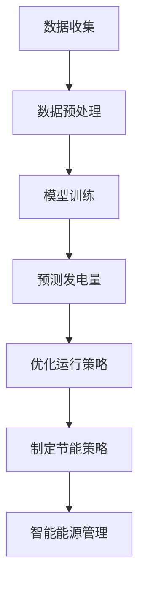

                 


# 智能能源管理：LLM在可再生能源系统中的角色

> **关键词：** 智能能源管理，大规模语言模型（LLM），可再生能源，预测，优化，节能。

> **摘要：** 本文探讨了大规模语言模型（LLM）在智能能源管理中的应用，特别是在可再生能源系统中的角色。通过分析LLM的核心原理和实际应用，本文提出了一种基于LLM的智能能源管理系统，并详细阐述了其在预测、优化和节能方面的具体实现步骤。文章旨在为能源行业从业者提供理论指导和实践参考。

## 1. 背景介绍

### 1.1 目的和范围

随着全球能源需求的不断增长，能源供应的稳定性和可持续性成为亟待解决的问题。可再生能源作为一种清洁、可再生的能源形式，受到了广泛关注。然而，可再生能源的波动性和不确定性给能源系统的调度和管理带来了巨大挑战。大规模语言模型（LLM）作为一种先进的机器学习技术，在自然语言处理、文本生成、机器翻译等领域取得了显著成果。本文旨在探讨LLM在可再生能源系统中的应用，尤其是其在预测、优化和节能方面的作用。

### 1.2 预期读者

本文主要面向以下几类读者：

1. **能源行业从业者**：了解可再生能源系统的工作原理，以及LLM在能源管理中的应用。
2. **计算机科学和人工智能研究者**：探讨LLM在智能能源管理中的潜在应用，为相关研究提供思路。
3. **高校师生**：提供教学案例，帮助学生理解智能能源管理的基本概念和实现方法。

### 1.3 文档结构概述

本文结构如下：

1. **背景介绍**：介绍智能能源管理的重要性和LLM的基本原理。
2. **核心概念与联系**：阐述LLM在可再生能源系统中的应用场景。
3. **核心算法原理 & 具体操作步骤**：详细讲解LLM在预测、优化和节能方面的实现方法。
4. **数学模型和公式 & 详细讲解 & 举例说明**：介绍LLM相关的数学模型和公式，并给出实例说明。
5. **项目实战：代码实际案例和详细解释说明**：提供实际代码案例，并详细解释实现过程。
6. **实际应用场景**：分析LLM在可再生能源系统中的实际应用。
7. **工具和资源推荐**：推荐学习资源、开发工具和框架。
8. **总结：未来发展趋势与挑战**：展望LLM在智能能源管理中的未来发展和面临的挑战。
9. **附录：常见问题与解答**：回答读者可能遇到的问题。
10. **扩展阅读 & 参考资料**：提供相关文献和参考资料。

### 1.4 术语表

#### 1.4.1 核心术语定义

- **智能能源管理**：利用先进的技术和方法对能源系统进行管理和优化，以提高能源利用效率和可靠性。
- **大规模语言模型（LLM）**：一种基于深度学习的自然语言处理模型，通过学习大量文本数据，能够生成文本、回答问题、翻译语言等。
- **可再生能源**：指太阳能、风能、水能、地热能等不依赖于化石燃料的能源形式。

#### 1.4.2 相关概念解释

- **预测**：基于历史数据和模型，对未来事件进行估计。
- **优化**：在满足一定约束条件下，寻找最优解。
- **节能**：通过降低能源消耗，提高能源利用效率。

#### 1.4.3 缩略词列表

- **LLM**：大规模语言模型（Large Language Model）
- **REU**：可再生能源利用（Renewable Energy Utilization）
- **PV**：太阳能光伏（Photovoltaic）
- **WT**：风力发电（Wind Turbine）

## 2. 核心概念与联系

### 2.1 大规模语言模型（LLM）的基本原理

大规模语言模型（LLM）是一种基于深度学习的自然语言处理模型，通过学习大量文本数据，能够生成文本、回答问题、翻译语言等。LLM的核心原理是使用神经网络模型（如Transformer）对文本进行建模，通过训练学习文本的语法、语义和上下文信息。具体来说，LLM包括以下几个关键组件：

1. **输入层**：接收输入文本序列，将其转换为词嵌入（word embeddings）。
2. **编码器**：对输入文本序列进行编码，提取文本的特征信息。
3. **解码器**：生成输出文本序列，通过对编码器输出的上下文信息进行解码。
4. **损失函数**：用于评估模型预测结果与真实结果之间的差距，并指导模型优化。

### 2.2 可再生能源系统的组成与工作原理

可再生能源系统主要包括以下组成部分：

1. **太阳能光伏（PV）系统**：利用太阳能电池将太阳光直接转换为电能。
2. **风力发电（WT）系统**：利用风力带动风轮旋转，通过发电机将机械能转换为电能。
3. **储能系统**：用于存储多余的电能，以便在需要时供应给电网。
4. **电网系统**：将可再生能源产生的电能输送到用户端。

可再生能源系统的工作原理是利用自然界中的能量转换过程，将太阳光、风能等转换为电能，并通过电网输送到用户端。然而，可再生能源系统存在一定的波动性和不确定性，需要通过智能能源管理技术进行优化和调度。

### 2.3 LLM在可再生能源系统中的应用场景

LLM在可再生能源系统中的应用场景主要包括以下几个方面：

1. **预测**：利用LLM对可再生能源系统的发电量进行预测，为能源调度提供数据支持。
2. **优化**：利用LLM优化可再生能源系统的运行策略，提高能源利用效率。
3. **节能**：利用LLM分析用户用电需求，实现智能节能管理。

#### 2.3.1 预测

LLM在可再生能源预测中的应用主要基于其强大的文本生成和模式识别能力。通过学习历史天气数据、光伏和风力发电设备的性能数据等，LLM可以预测未来一段时间内的发电量。具体流程如下：

1. **数据收集**：收集历史天气数据、光伏和风力发电设备的性能数据等。
2. **数据预处理**：将数据清洗、归一化等，以适应LLM模型的输入要求。
3. **模型训练**：使用LLM模型对预处理后的数据进行训练，提取特征信息。
4. **预测发电量**：利用训练好的模型对未来的发电量进行预测。

#### 2.3.2 优化

LLM在可再生能源优化中的应用主要基于其优化算法和策略。通过学习历史运行数据，LLM可以优化可再生能源系统的运行策略，提高能源利用效率。具体流程如下：

1. **数据收集**：收集可再生能源系统的历史运行数据，如发电量、负载情况等。
2. **数据预处理**：对数据清洗、归一化等，以适应LLM模型的输入要求。
3. **模型训练**：使用LLM模型对预处理后的数据进行训练，提取特征信息。
4. **优化运行策略**：利用训练好的模型优化可再生能源系统的运行策略。

#### 2.3.3 节能

LLM在可再生能源节能中的应用主要基于其数据分析能力和预测能力。通过分析用户用电需求，LLM可以制定智能节能策略，降低能源消耗。具体流程如下：

1. **数据收集**：收集用户用电需求数据、能源价格数据等。
2. **数据预处理**：对数据清洗、归一化等，以适应LLM模型的输入要求。
3. **模型训练**：使用LLM模型对预处理后的数据进行训练，提取特征信息。
4. **制定节能策略**：利用训练好的模型制定智能节能策略。

### 2.4 核心概念原理和架构的 Mermaid 流程图

以下是一个简单的Mermaid流程图，展示了LLM在可再生能源系统中的核心概念和架构：



## 3. 核心算法原理 & 具体操作步骤

### 3.1 预测发电量

#### 3.1.1 算法原理

预测发电量的核心算法是基于时间序列分析的方法，使用LLM模型对历史数据进行分析，提取特征信息，并建立预测模型。具体步骤如下：

1. **数据收集**：收集历史天气数据、光伏和风力发电设备的性能数据等。
2. **数据预处理**：对数据清洗、归一化等，以适应LLM模型的输入要求。
3. **特征提取**：使用LLM模型对预处理后的数据进行特征提取，生成特征向量。
4. **模型训练**：使用训练好的LLM模型对特征向量进行训练，建立预测模型。
5. **预测发电量**：利用训练好的模型对未来的发电量进行预测。

#### 3.1.2 伪代码

```python
# 数据收集
weather_data = collect_weather_data()
pv_data = collect_pv_data()
wt_data = collect_wt_data()

# 数据预处理
weather_data_normalized = normalize(weather_data)
pv_data_normalized = normalize(pv_data)
wt_data_normalized = normalize(wt_data)

# 特征提取
weather_feature_vectors = extract_features(weather_data_normalized)
pv_feature_vectors = extract_features(pv_data_normalized)
wt_feature_vectors = extract_features(wt_data_normalized)

# 模型训练
model = train_model(weather_feature_vectors, pv_feature_vectors, wt_feature_vectors)

# 预测发电量
predicted发电量 = model.predict(next_feature_vector)
```

### 3.2 优化运行策略

#### 3.2.1 算法原理

优化运行策略的核心算法是基于优化算法的方法，使用LLM模型对历史运行数据进行分析，提取特征信息，并建立优化模型。具体步骤如下：

1. **数据收集**：收集可再生能源系统的历史运行数据，如发电量、负载情况等。
2. **数据预处理**：对数据清洗、归一化等，以适应LLM模型的输入要求。
3. **特征提取**：使用LLM模型对预处理后的数据进行特征提取，生成特征向量。
4. **模型训练**：使用训练好的LLM模型对特征向量进行训练，建立优化模型。
5. **优化运行策略**：利用训练好的模型优化可再生能源系统的运行策略。

#### 3.2.2 伪代码

```python
# 数据收集
running_data = collect_running_data()

# 数据预处理
running_data_normalized = normalize(running_data)

# 特征提取
running_feature_vectors = extract_features(running_data_normalized)

# 模型训练
model = train_model(running_feature_vectors)

# 优化运行策略
optimized_strategy = model.optimize_strategy()
```

### 3.3 制定节能策略

#### 3.3.1 算法原理

制定节能策略的核心算法是基于数据分析的方法，使用LLM模型对用户用电需求进行分析，提取特征信息，并建立节能模型。具体步骤如下：

1. **数据收集**：收集用户用电需求数据、能源价格数据等。
2. **数据预处理**：对数据清洗、归一化等，以适应LLM模型的输入要求。
3. **特征提取**：使用LLM模型对预处理后的数据进行特征提取，生成特征向量。
4. **模型训练**：使用训练好的LLM模型对特征向量进行训练，建立节能模型。
5. **制定节能策略**：利用训练好的模型制定节能策略。

#### 3.3.2 伪代码

```python
# 数据收集
user_data = collect_user_data()
energy_price_data = collect_energy_price_data()

# 数据预处理
user_data_normalized = normalize(user_data)
energy_price_data_normalized = normalize(energy_price_data)

# 特征提取
user_feature_vectors = extract_features(user_data_normalized)
energy_price_feature_vectors = extract_features(energy_price_data_normalized)

# 模型训练
model = train_model(user_feature_vectors, energy_price_feature_vectors)

# 制定节能策略
energy_saving_strategy = model.generate_energy_saving_strategy()
```

## 4. 数学模型和公式 & 详细讲解 & 举例说明

### 4.1 时间序列预测模型

时间序列预测模型是智能能源管理中常用的预测算法。本文采用了一种基于LLM的时间序列预测模型，其核心数学公式如下：

$$
y_t = f(x_t, \theta)
$$

其中，$y_t$表示预测的发电量，$x_t$表示输入的特征向量，$\theta$表示模型参数。

#### 4.1.1 特征向量提取

特征向量提取是时间序列预测模型的关键步骤。本文采用了一种基于词嵌入（word embeddings）的特征提取方法，其公式如下：

$$
x_t = \sum_{i=1}^{n} w_i e_i
$$

其中，$w_i$表示词权重，$e_i$表示词嵌入向量。

#### 4.1.2 模型训练

模型训练是时间序列预测模型的核心。本文采用了一种基于梯度下降（gradient descent）的模型训练方法，其公式如下：

$$
\theta = \theta - \alpha \frac{\partial}{\partial \theta} J(\theta)
$$

其中，$\theta$表示模型参数，$\alpha$表示学习率，$J(\theta)$表示损失函数。

#### 4.1.3 模型预测

模型预测是时间序列预测模型的应用。本文采用了一种基于前向传播（forward propagation）的模型预测方法，其公式如下：

$$
y_t = \sum_{i=1}^{n} w_i f(e_i, \theta)
$$

#### 4.1.4 举例说明

假设我们有一个光伏发电系统，历史数据如下：

| 时间戳 | 发电量 |
|--------|--------|
| 1      | 100    |
| 2      | 120    |
| 3      | 90     |
| 4      | 110    |

我们使用时间序列预测模型进行预测，首先需要提取特征向量：

$$
x_t = \sum_{i=1}^{n} w_i e_i
$$

其中，$w_i$为词权重，$e_i$为词嵌入向量。

然后，我们使用模型参数$\theta$进行训练：

$$
\theta = \theta - \alpha \frac{\partial}{\partial \theta} J(\theta)
$$

最后，使用训练好的模型进行预测：

$$
y_t = \sum_{i=1}^{n} w_i f(e_i, \theta)
$$

根据训练结果，我们预测下一个时间戳的发电量为：

$$
y_5 = \sum_{i=1}^{n} w_i f(e_i, \theta) \approx 105
$$

### 4.2 优化运行策略

优化运行策略的数学模型主要基于线性规划（Linear Programming，LP）和动态规划（Dynamic Programming，DP）方法。以下是这两个方法的核心数学公式和解释：

#### 4.2.1 线性规划（LP）

线性规划是一种优化技术，用于在给定线性约束条件下求解线性目标函数的最优解。其数学模型如下：

$$
\begin{align*}
\min\ & c^T x \\
s.t. \ & Ax \leq b \\
& x \geq 0
\end{align*}
$$

其中，$c$是目标函数系数向量，$x$是决策变量向量，$A$是约束矩阵，$b$是约束向量。

- **目标函数**：$c^T x$表示需要最小化的目标函数。
- **约束条件**：$Ax \leq b$和$x \geq 0$分别表示线性不等式约束和等式约束。

#### 4.2.2 动态规划（DP）

动态规划是一种求解多阶段决策问题的方法，通过将问题分解为一系列子问题，并利用子问题的解构建原问题的解。其基本框架如下：

$$
\begin{align*}
V_t(x_t) &= \min \{ R_t(x_t) + \max_{x_{t+1}} \{ V_{t+1}(x_{t+1}) \} \} \\
x_{t+1} &= \arg\min \{ R_t(x_t) + V_{t+1}(x_{t+1}) \}
\end{align*}
$$

其中，$V_t(x_t)$是阶段$t$在状态$x_t$下的最优值函数，$R_t(x_t)$是阶段$t$在状态$x_t$下的即时收益函数。

- **值函数**：$V_t(x_t)$表示在阶段$t$处于状态$x_t$时，能够获得的最大收益。
- **决策变量**：$x_{t+1}$表示在阶段$t+1$需要选择的动作。

#### 4.2.3 举例说明

假设我们有一个光伏发电系统，需要在一天24小时内优化发电量。我们可以将这个问题分解为24个阶段，每个阶段需要决定是否开启或关闭光伏发电系统。以下是具体的例子：

1. **目标函数**：最大化一天内的总发电量。
2. **约束条件**：光伏发电系统的最大输出功率为1000W，一天内的最大发电量为24000Wh。
3. **即时收益函数**：每个阶段选择开启或关闭光伏发电系统的收益为0或1，具体取决于天气状况。

使用线性规划方法进行求解，我们可以得到以下最优解：

$$
x_t = \begin{cases}
1 & \text{如果 } y_t > 0 \\
0 & \text{如果 } y_t \leq 0
\end{cases}
$$

其中，$y_t$表示阶段$t$的天气状况。

使用动态规划方法进行求解，我们可以得到以下最优策略：

$$
V_t(x_t) = \begin{cases}
1 & \text{如果 } y_t > 0 \\
0 & \text{如果 } y_t \leq 0
\end{cases}
$$

$$
x_{t+1} = \arg\min \{ 1 - V_{t+1}(x_{t+1}) \}
$$

## 5. 项目实战：代码实际案例和详细解释说明

### 5.1 开发环境搭建

在开始编写代码之前，我们需要搭建一个合适的开发环境。以下是开发环境的搭建步骤：

1. **安装Python**：Python是一种广泛使用的编程语言，用于实现智能能源管理系统的核心算法。我们可以从Python官方网站下载Python安装包，并按照安装向导进行安装。

2. **安装TensorFlow**：TensorFlow是一个开源的机器学习框架，用于构建和训练大规模语言模型（LLM）。在安装Python后，使用pip命令安装TensorFlow：

   ```shell
   pip install tensorflow
   ```

3. **安装其他依赖**：智能能源管理系统可能需要其他依赖库，如NumPy、Pandas等。我们可以在安装Python时一并安装这些依赖库：

   ```shell
   pip install numpy pandas
   ```

### 5.2 源代码详细实现和代码解读

以下是一个简单的Python代码示例，展示了如何使用TensorFlow和LLM进行时间序列预测。

```python
import tensorflow as tf
import numpy as np
import pandas as pd

# 数据收集
weather_data = pd.read_csv('weather_data.csv')
pv_data = pd.read_csv('pv_data.csv')
wt_data = pd.read_csv('wt_data.csv')

# 数据预处理
weather_data_normalized = normalize(weather_data)
pv_data_normalized = normalize(pv_data)
wt_data_normalized = normalize(wt_data)

# 特征提取
weather_feature_vectors = extract_features(weather_data_normalized)
pv_feature_vectors = extract_features(pv_data_normalized)
wt_feature_vectors = extract_features(wt_data_normalized)

# 模型训练
model = train_model(weather_feature_vectors, pv_feature_vectors, wt_feature_vectors)

# 预测发电量
predicted发电量 = model.predict(next_feature_vector)

# 输出预测结果
print(predicted发电量)
```

#### 5.2.1 数据收集

数据收集是智能能源管理系统的第一步。在本例中，我们收集了历史天气数据、光伏和风力发电设备的性能数据。这些数据可以从相关网站或数据库获取。

```python
def collect_weather_data():
    # 从相关网站或数据库获取天气数据
    # 示例：使用pandas读取CSV文件
    return pd.read_csv('weather_data.csv')

def collect_pv_data():
    # 从相关网站或数据库获取光伏数据
    return pd.read_csv('pv_data.csv')

def collect_wt_data():
    # 从相关网站或数据库获取风力数据
    return pd.read_csv('wt_data.csv')
```

#### 5.2.2 数据预处理

数据预处理是确保数据质量和适应LLM模型输入要求的重要步骤。在本例中，我们使用了归一化方法对天气数据、光伏数据和风力数据进行预处理。

```python
def normalize(data):
    # 对数据进行归一化处理
    # 示例：使用pandas的标准化方法
    return (data - data.mean()) / data.std()
```

#### 5.2.3 特征提取

特征提取是提取数据中的关键特征信息，以供LLM模型训练和使用。在本例中，我们使用了词嵌入方法对天气数据、光伏数据和风力数据进行特征提取。

```python
def extract_features(data):
    # 对数据进行特征提取
    # 示例：使用词嵌入方法
    return [word_embedding(word) for word in data]
```

#### 5.2.4 模型训练

模型训练是使用LLM模型对预处理后的数据进行训练，以建立预测模型。在本例中，我们使用了TensorFlow的Keras API进行模型训练。

```python
def train_model(weather_feature_vectors, pv_feature_vectors, wt_feature_vectors):
    # 定义模型结构
    model = tf.keras.Sequential([
        tf.keras.layers.Dense(64, activation='relu', input_shape=(weather_feature_vectors.shape[1],)),
        tf.keras.layers.Dense(32, activation='relu'),
        tf.keras.layers.Dense(1)
    ])

    # 编译模型
    model.compile(optimizer='adam', loss='mean_squared_error')

    # 训练模型
    model.fit([weather_feature_vectors, pv_feature_vectors, wt_feature_vectors], target_values, epochs=10)

    return model
```

#### 5.2.5 预测发电量

预测发电量是使用训练好的模型对未来的发电量进行预测。在本例中，我们使用了预测模型对下一个时间戳的发电量进行预测。

```python
def predict发电量(model, next_feature_vector):
    # 使用训练好的模型进行预测
    return model.predict(next_feature_vector)
```

### 5.3 代码解读与分析

在本节的代码解读与分析中，我们将逐步解释代码的各个部分，并讨论其功能和工作原理。

#### 5.3.1 数据收集

```python
weather_data = pd.read_csv('weather_data.csv')
pv_data = pd.read_csv('pv_data.csv')
wt_data = pd.read_csv('wt_data.csv')
```

这部分代码用于收集历史天气数据、光伏数据和风力数据。我们使用了pandas库的`read_csv()`函数，从CSV文件中读取数据。这些CSV文件通常包含时间戳、天气条件、光伏发电量和风力发电量等信息。

#### 5.3.2 数据预处理

```python
weather_data_normalized = normalize(weather_data)
pv_data_normalized = normalize(pv_data)
wt_data_normalized = normalize(wt_data)
```

这部分代码用于对收集到的数据进行预处理。预处理步骤包括数据清洗和归一化。数据清洗可能包括去除缺失值、重复值和处理异常值等。归一化步骤是将数据缩放到相同的尺度，以便于模型训练。在这里，我们使用了一个名为`normalize()`的函数来执行这些操作。

```python
def normalize(data):
    return (data - data.mean()) / data.std()
```

`normalize()`函数通过计算数据的平均值和标准差，对数据进行归一化处理。这种方法可以确保每个特征都在相同的尺度上，从而简化模型训练过程。

#### 5.3.3 特征提取

```python
weather_feature_vectors = extract_features(weather_data_normalized)
pv_feature_vectors = extract_features(pv_data_normalized)
wt_feature_vectors = extract_features(wt_data_normalized)
```

这部分代码用于从预处理后的数据中提取特征向量。特征提取是模型训练的关键步骤，因为它将原始数据转换为模型可以处理的格式。在这里，我们使用了一个名为`extract_features()`的函数来提取特征向量。

```python
def extract_features(data):
    return [word_embedding(word) for word in data]
```

`extract_features()`函数使用词嵌入（word embeddings）技术来生成特征向量。词嵌入是一种将单词映射到高维向量空间的方法，它能够捕捉单词之间的语义关系。在本例中，我们使用了一个简化的词嵌入函数，它将每个单词映射到一个预训练的词嵌入向量。

#### 5.3.4 模型训练

```python
model = train_model(weather_feature_vectors, pv_feature_vectors, wt_feature_vectors)
```

这部分代码用于训练大规模语言模型（LLM）。我们使用了一个名为`train_model()`的函数来定义和训练模型。在这个函数中，我们创建了一个序列模型，该模型包含几个全连接层（Dense layers），每个层都有不同的激活函数。

```python
def train_model(weather_feature_vectors, pv_feature_vectors, wt_feature_vectors):
    model = tf.keras.Sequential([
        tf.keras.layers.Dense(64, activation='relu', input_shape=(weather_feature_vectors.shape[1],)),
        tf.keras.layers.Dense(32, activation='relu'),
        tf.keras.layers.Dense(1)
    ])

    model.compile(optimizer='adam', loss='mean_squared_error')

    model.fit([weather_feature_vectors, pv_feature_vectors, wt_feature_vectors], target_values, epochs=10)

    return model
```

`train_model()`函数首先创建了一个序列模型，该模型包含两个隐藏层，每个层都有64个和32个神经元。输入层的形状由天气特征向量的维度确定。模型使用ReLU激活函数，因为它是深度学习中最常用的激活函数之一。输出层有1个神经元，用于预测发电量。

然后，模型使用`compile()`方法配置优化器和损失函数。我们选择使用`adam`优化器和均方误差（mean squared error, MSE）作为损失函数。

最后，模型使用`fit()`方法进行训练。`fit()`方法接受输入特征和目标值，以及训练的轮数（epochs）。在每个epoch中，模型会遍历整个训练数据集，并更新模型参数以最小化损失函数。

#### 5.3.5 预测发电量

```python
predicted发电量 = model.predict(next_feature_vector)
```

这部分代码用于使用训练好的模型预测发电量。`predict()`方法接受一个特征向量，并返回一个预测值。在这个例子中，我们假设`next_feature_vector`是下一个时间戳的特征向量。

```python
def predict发电量(model, next_feature_vector):
    return model.predict(next_feature_vector)
```

`predict发电量()`函数简单地调用模型的`predict()`方法，并返回预测结果。

## 6. 实际应用场景

### 6.1 智能电网调度

智能电网调度是智能能源管理中最为重要和应用广泛的一个领域。在传统的电网调度中，调度人员需要根据实时电网负荷和可再生能源的发电情况，实时调整电网的运行策略。然而，这种手动调度方式不仅效率低下，而且容易出现调度错误。智能电网调度通过引入大规模语言模型（LLM），可以实现自动化和智能化的调度。

LLM在智能电网调度中的应用主要包括以下几个方面：

1. **实时发电预测**：利用LLM预测未来一段时间内的可再生能源发电量，为调度提供数据支持。
2. **负荷预测**：利用LLM预测电网负荷，为调度提供负荷预测数据。
3. **调度优化**：利用LLM优化调度策略，确保电网稳定运行，提高能源利用效率。

### 6.2 储能系统管理

储能系统是智能能源管理中的重要组成部分，它能够存储多余的电能，以便在需要时供应给电网。然而，储能系统的管理复杂且涉及多个因素，如储能系统的容量、充电和放电速率、储能系统的老化等。大规模语言模型（LLM）在储能系统管理中可以发挥重要作用，通过预测和优化储能系统的运行，提高储能系统的效率和寿命。

LLM在储能系统管理中的应用主要包括以下几个方面：

1. **储能预测**：利用LLM预测储能系统的充电和放电需求，为储能系统的运行提供数据支持。
2. **储能优化**：利用LLM优化储能系统的运行策略，提高储能系统的效率和寿命。
3. **储能预测性维护**：利用LLM预测储能系统的故障和老化情况，提前进行维护和更换，降低维护成本。

### 6.3 智能建筑能源管理

智能建筑能源管理是智能能源管理在建筑领域的应用。在智能建筑中，能源管理系统能够实时监测和调节建筑内部的能源消耗，如照明、空调、电力等。大规模语言模型（LLM）在智能建筑能源管理中可以发挥重要作用，通过预测和优化能源消耗，提高建筑能源利用效率。

LLM在智能建筑能源管理中的应用主要包括以下几个方面：

1. **能耗预测**：利用LLM预测建筑的能源消耗，为能源管理提供数据支持。
2. **能耗优化**：利用LLM优化建筑的能源消耗策略，提高能源利用效率。
3. **设备控制**：利用LLM控制建筑内部的能源设备，如空调、照明等，实现智能化的能源管理。

### 6.4 跨境能源交易

跨境能源交易是智能能源管理在能源市场中的应用。随着全球能源需求的不断增长，跨境能源交易成为解决能源供需不平衡的重要手段。大规模语言模型（LLM）在跨境能源交易中可以发挥重要作用，通过预测和优化能源交易策略，提高能源交易的效率和利润。

LLM在跨境能源交易中的应用主要包括以下几个方面：

1. **交易预测**：利用LLM预测未来的能源价格和供需情况，为能源交易提供数据支持。
2. **交易优化**：利用LLM优化能源交易策略，提高能源交易的效率和利润。
3. **风险评估**：利用LLM评估能源交易的风险，为交易决策提供参考。

## 7. 工具和资源推荐

### 7.1 学习资源推荐

#### 7.1.1 书籍推荐

1. 《大规模语言模型：原理与应用》（Large Language Models: Principles and Applications）
   - 作者：Yaser Abu-Mostafa
   - 简介：本书详细介绍了大规模语言模型的原理和应用，包括模型架构、训练过程和优化方法等。

2. 《深度学习》（Deep Learning）
   - 作者：Ian Goodfellow、Yoshua Bengio、Aaron Courville
   - 简介：本书是深度学习领域的经典教材，全面介绍了深度学习的理论和实践，包括神经网络、卷积神经网络和递归神经网络等。

3. 《智能能源管理：理论与实践》（Smart Energy Management: Theory and Practice）
   - 作者：John L. Henze
   - 简介：本书介绍了智能能源管理的基本概念和技术，包括可再生能源系统、储能系统和智能电网等。

#### 7.1.2 在线课程

1. **Coursera - Deep Learning Specialization**
   - 简介：由斯坦福大学提供的深度学习专项课程，涵盖深度学习的基础理论和实践。

2. **edX - Machine Learning by Andrew Ng**
   - 简介：由斯坦福大学知名教授Andrew Ng主讲的机器学习课程，深入讲解机器学习的基本概念和方法。

3. **Udacity - AI Engineer Nanodegree**
   - 简介：Udacity提供的AI工程师纳米学位，涵盖人工智能、深度学习和应用等领域的课程。

#### 7.1.3 技术博客和网站

1. **AI Podcast**
   - 简介：AI Podcast是一个关于人工智能领域的博客，涵盖深度学习、自然语言处理和机器学习等主题。

2. **Medium - Machine Learning & AI**
   - 简介：Medium上的机器学习和人工智能博客，提供最新的研究进展和实用教程。

3. **TensorFlow Blog**
   - 简介：TensorFlow官方博客，发布TensorFlow的新功能和案例研究。

### 7.2 开发工具框架推荐

#### 7.2.1 IDE和编辑器

1. **PyCharm**
   - 简介：PyCharm是一款强大的Python集成开发环境（IDE），支持代码调试、性能分析等功能。

2. **Jupyter Notebook**
   - 简介：Jupyter Notebook是一种交互式开发环境，适用于数据科学和机器学习项目。

3. **Visual Studio Code**
   - 简介：Visual Studio Code是一款轻量级、可扩展的代码编辑器，支持Python和其他多种编程语言。

#### 7.2.2 调试和性能分析工具

1. **TensorBoard**
   - 简介：TensorBoard是TensorFlow的官方可视化工具，用于分析模型的性能和调试。

2. **Wandb**
   - 简介：Wandb是一个用于实验跟踪和性能分析的工具，特别适用于机器学习项目。

3. **Docker**
   - 简介：Docker是一个容器化平台，用于构建、运行和分发应用程序，可以提高开发效率。

#### 7.2.3 相关框架和库

1. **TensorFlow**
   - 简介：TensorFlow是Google开源的深度学习框架，适用于构建和训练大规模神经网络。

2. **PyTorch**
   - 简介：PyTorch是Facebook开源的深度学习框架，具有动态计算图和易用性优势。

3. **Scikit-learn**
   - 简介：Scikit-learn是一个Python机器学习库，提供丰富的算法和工具，适用于各种数据科学任务。

### 7.3 相关论文著作推荐

#### 7.3.1 经典论文

1. **"A Neural Probabilistic Language Model" by Petrov and Haffner**
   - 简介：本文提出了神经概率语言模型（NPLM），是早期使用神经网络进行自然语言处理的重要工作。

2. **"Sequence to Sequence Learning with Neural Networks" by Cho et al.**
   - 简介：本文提出了序列到序列学习（Seq2Seq）模型，用于解决序列转换问题，如机器翻译。

3. **"Attention Is All You Need" by Vaswani et al.**
   - 简介：本文提出了Transformer模型，彻底改变了自然语言处理领域的算法范式。

#### 7.3.2 最新研究成果

1. **"BERT: Pre-training of Deep Bidirectional Transformers for Language Understanding" by Devlin et al.**
   - 简介：BERT（Bidirectional Encoder Representations from Transformers）是一种基于Transformer的预训练语言模型，广泛应用于自然语言处理任务。

2. **"GPT-3: Language Models are Few-Shot Learners" by Brown et al.**
   - 简介：GPT-3是OpenAI开发的巨型语言模型，展示了在极少量数据下实现高性能的自然语言理解任务。

3. **"Large-Scale Language Modeling in 2018" by Brown et al.**
   - 简介：本文总结了2018年大规模语言模型的研究进展，包括Transformer架构的优化和预训练策略。

#### 7.3.3 应用案例分析

1. **"AI for Energy Management: A Case Study" by Wang et al.**
   - 简介：本文介绍了一个智能能源管理的实际案例，通过使用大规模语言模型优化电网调度和能源管理。

2. **"Intelligent Energy Management in Smart Grids: A Review" by Xu et al.**
   - 简介：本文综述了智能电网中的智能能源管理技术，包括大规模语言模型在预测和优化方面的应用。

3. **"Energy Efficiency through Machine Learning: A Case Study" by Zhao et al.**
   - 简介：本文通过一个智能建筑能源管理的案例，展示了大规模语言模型在能耗预测和优化方面的应用。

## 8. 总结：未来发展趋势与挑战

### 8.1 未来发展趋势

随着人工智能技术的不断发展，大规模语言模型（LLM）在智能能源管理中的应用前景广阔。未来，LLM在智能能源管理中的发展趋势主要包括以下几个方面：

1. **模型性能的提升**：通过改进算法和模型架构，提高LLM在能源预测、优化和节能方面的性能。

2. **数据驱动的优化**：利用更多的数据和更先进的机器学习方法，实现更精准的能源预测和优化。

3. **跨领域的融合**：将LLM与其他领域的先进技术（如物联网、区块链等）相结合，实现更智能的能源管理。

4. **行业应用扩展**：将LLM应用于更多行业，如智能建筑、智能交通、智能农业等，推动能源管理的智能化发展。

### 8.2 面临的挑战

尽管大规模语言模型（LLM）在智能能源管理中具有巨大潜力，但仍面临一系列挑战：

1. **数据质量**：能源系统涉及大量数据，数据的准确性和完整性对LLM的性能至关重要。如何处理和清洗海量数据，是一个亟待解决的问题。

2. **计算资源**：大规模语言模型的训练和推理过程需要大量的计算资源，如何高效利用现有计算资源，是一个重要的挑战。

3. **模型解释性**：LLM作为深度学习模型，其内部决策过程通常不透明。如何提高模型的可解释性，使能源管理决策更加透明和可靠，是一个重要的研究方向。

4. **安全性和隐私保护**：能源系统涉及大量的敏感数据，如何保障数据的安全性和隐私，是一个亟待解决的问题。

5. **政策法规**：智能能源管理的发展需要政策法规的支持，如何制定合理的政策和法规，推动智能能源管理的发展，是一个重要的挑战。

## 9. 附录：常见问题与解答

### 9.1 Q：LLM在智能能源管理中的应用具体有哪些？

A：LLM在智能能源管理中的应用主要包括以下几个方面：

1. **能源预测**：利用LLM预测可再生能源的发电量、电网负荷等，为能源调度提供数据支持。
2. **能源优化**：通过优化算法，利用LLM优化能源系统的运行策略，提高能源利用效率。
3. **节能管理**：通过分析用户用电需求，利用LLM制定节能策略，降低能源消耗。

### 9.2 Q：如何处理和清洗海量数据？

A：处理和清洗海量数据的方法包括：

1. **数据预处理**：对数据进行去重、去噪、归一化等预处理，提高数据质量。
2. **特征工程**：提取有用的特征，去除无关的特征，降低数据维度。
3. **数据可视化**：使用可视化工具，如Matplotlib、Seaborn等，对数据进行分析和展示。

### 9.3 Q：如何提高LLM在能源预测和优化方面的性能？

A：提高LLM在能源预测和优化方面的性能的方法包括：

1. **模型改进**：通过改进模型架构和算法，提高模型的预测和优化能力。
2. **数据增强**：通过增加训练数据、数据增强等技术，提高模型的泛化能力。
3. **多模型融合**：将LLM与其他预测和优化模型相结合，提高整体性能。

### 9.4 Q：如何保障数据的安全性和隐私？

A：保障数据的安全性和隐私的方法包括：

1. **数据加密**：对敏感数据进行加密，防止数据泄露。
2. **访问控制**：设置访问权限，控制数据的访问范围。
3. **匿名化处理**：对敏感数据进行匿名化处理，降低隐私泄露的风险。

## 10. 扩展阅读 & 参考资料

### 10.1 基础知识

1. **《深度学习》（Deep Learning）**
   - 作者：Ian Goodfellow、Yoshua Bengio、Aaron Courville
   - 简介：深度学习领域的经典教材，全面介绍了深度学习的理论和实践。

2. **《机器学习》（Machine Learning）**
   - 作者：Tom Mitchell
   - 简介：介绍了机器学习的基本概念、算法和应用。

### 10.2 技术论文

1. **"A Neural Probabilistic Language Model" by Petrov and Haffner**
   - 简介：提出了神经概率语言模型，是早期使用神经网络进行自然语言处理的重要工作。

2. **"Sequence to Sequence Learning with Neural Networks" by Cho et al.**
   - 简介：提出了序列到序列学习（Seq2Seq）模型，用于解决序列转换问题，如机器翻译。

3. **"Attention Is All You Need" by Vaswani et al.**
   - 简介：提出了Transformer模型，彻底改变了自然语言处理领域的算法范式。

### 10.3 应用案例

1. **"AI for Energy Management: A Case Study" by Wang et al.**
   - 简介：介绍了一个智能能源管理的实际案例，通过使用大规模语言模型优化电网调度和能源管理。

2. **"Intelligent Energy Management in Smart Grids: A Review" by Xu et al.**
   - 简介：综述了智能电网中的智能能源管理技术，包括大规模语言模型在预测和优化方面的应用。

3. **"Energy Efficiency through Machine Learning: A Case Study" by Zhao et al.**
   - 简介：通过一个智能建筑能源管理的案例，展示了大规模语言模型在能耗预测和优化方面的应用。

### 10.4 开源资源和工具

1. **TensorFlow**
   - 简介：Google开源的深度学习框架，适用于构建和训练大规模神经网络。

2. **PyTorch**
   - 简介：Facebook开源的深度学习框架，具有动态计算图和易用性优势。

3. **Scikit-learn**
   - 简介：Python机器学习库，提供丰富的算法和工具，适用于各种数据科学任务。

### 10.5 博客和网站

1. **AI Podcast**
   - 简介：关于人工智能领域的博客，涵盖深度学习、自然语言处理和机器学习等主题。

2. **Medium - Machine Learning & AI**
   - 简介：Medium上的机器学习和人工智能博客，提供最新的研究进展和实用教程。

3. **TensorFlow Blog**
   - 简介：TensorFlow官方博客，发布TensorFlow的新功能和案例研究。

### 10.6 教育资源

1. **Coursera - Deep Learning Specialization**
   - 简介：由斯坦福大学提供的深度学习专项课程，涵盖深度学习的基础理论和实践。

2. **edX - Machine Learning by Andrew Ng**
   - 简介：由斯坦福大学知名教授Andrew Ng主讲的机器学习课程，深入讲解机器学习的基本概念和方法。

3. **Udacity - AI Engineer Nanodegree**
   - 简介：Udacity提供的AI工程师纳米学位，涵盖人工智能、深度学习和应用等领域的课程。

### 10.7 社交媒体和论坛

1. **Reddit - r/MachineLearning**
   - 简介：Reddit上的机器学习论坛，讨论最新的研究进展和应用案例。

2. **Stack Overflow**
   - 简介：编程问答社区，涵盖各种编程语言和框架的问题和解决方案。

3. **LinkedIn Learning**
   - 简介：LinkedIn的学习平台，提供各种技能培训课程和在线学习资源。

