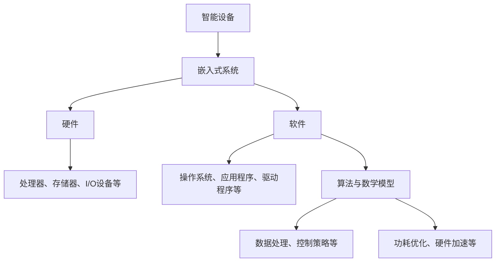

                 

# 智能设备开发：嵌入式系统设计与优化

> 关键词：智能设备、嵌入式系统、设计优化、硬件、软件、编程语言、算法、数学模型、项目实战、应用场景、工具资源

> 摘要：本文旨在深入探讨智能设备开发中的嵌入式系统设计与优化。文章首先介绍智能设备开发背景和嵌入式系统的基本概念，然后详细阐述嵌入式系统的设计原则、核心算法原理、数学模型及公式，并通过实际项目案例和代码解读，帮助读者理解嵌入式系统开发的全过程。此外，文章还探讨了智能设备的实际应用场景，推荐了相关工具和资源，并对未来发展趋势与挑战进行了展望。

## 1. 背景介绍

### 1.1 目的和范围

随着物联网（IoT）技术的快速发展，智能设备在各个领域的应用越来越广泛。嵌入式系统作为智能设备的核心组成部分，其性能和稳定性直接影响设备的使用体验。本文旨在探讨嵌入式系统的设计与优化，帮助开发者深入了解智能设备开发过程中的关键技术。

本文将涵盖以下内容：

1. 嵌入式系统的基本概念和设计原则；
2. 嵌入式系统的核心算法原理和具体操作步骤；
3. 嵌入式系统的数学模型和公式；
4. 实际项目案例和代码解读；
5. 智能设备的实际应用场景；
6. 相关工具和资源的推荐；
7. 嵌入式系统发展的未来趋势与挑战。

### 1.2 预期读者

本文适合具备一定编程基础、对嵌入式系统感兴趣的读者，包括但不限于：

1. 智能设备开发者；
2. 电子工程师；
3. 计算机科学专业学生；
4. 对智能设备开发感兴趣的爱好者。

### 1.3 文档结构概述

本文分为十个部分，结构如下：

1. 背景介绍（本节）；
2. 核心概念与联系（包括嵌入式系统的基本概念、原理和架构）；
3. 核心算法原理 & 具体操作步骤（使用伪代码详细阐述）；
4. 数学模型和公式 & 详细讲解 & 举例说明（使用LaTeX格式）；
5. 项目实战：代码实际案例和详细解释说明；
6. 实际应用场景；
7. 工具和资源推荐；
8. 总结：未来发展趋势与挑战；
9. 附录：常见问题与解答；
10. 扩展阅读 & 参考资料。

### 1.4 术语表

#### 1.4.1 核心术语定义

- **嵌入式系统**：嵌入在其他设备中的专用计算机系统，具有实时性、可靠性、低成本等特点。
- **硬件**：嵌入式系统的物理组成部分，包括处理器、存储器、输入输出设备等。
- **软件**：运行在嵌入式系统上的程序，负责设备的控制、通信等功能。
- **编程语言**：用于编写嵌入式系统软件的工具，如C、C++、汇编语言等。
- **算法**：解决问题的步骤和策略，是嵌入式系统设计中至关重要的部分。
- **数学模型**：用于描述嵌入式系统性能和行为的数学公式和方程。
- **优化**：通过改进设计或算法，提高嵌入式系统的性能、可靠性或降低成本。

#### 1.4.2 相关概念解释

- **实时系统**：能够按照预定时间要求完成任务的系统，具有严格的时间约束。
- **功耗优化**：在满足功能需求的前提下，降低嵌入式系统的功耗，提高续航能力。
- **硬件加速**：通过专门的硬件资源提高嵌入式系统的计算性能。
- **软件工程**：使用系统化和规范化的方法进行软件的开发和维护。

#### 1.4.3 缩略词列表

- **IoT**：物联网（Internet of Things）
- **IDE**：集成开发环境（Integrated Development Environment）
- **RTOS**：实时操作系统（Real-Time Operating System）
- **FPGA**：现场可编程门阵列（Field-Programmable Gate Array）
- **DSP**：数字信号处理器（Digital Signal Processor）

## 2. 核心概念与联系

在深入探讨嵌入式系统的设计原则和优化方法之前，我们需要了解嵌入式系统的基本概念、原理和架构。以下是嵌入式系统核心概念的Mermaid流程图：



### 2.1 嵌入式系统的基本概念

嵌入式系统是一种专门为特定任务而设计的计算机系统，具有以下特点：

1. **实时性**：能够按照预定的时间要求完成特定任务。
2. **可靠性**：在长时间运行和高负载情况下保持稳定。
3. **低成本**：采用高性能、低功耗的硬件和软件。
4. **专用性**：针对特定应用场景进行定制化设计。

### 2.2 嵌入式系统的硬件架构

嵌入式系统的硬件主要包括处理器、存储器、输入输出设备等。以下是硬件架构的详细说明：

1. **处理器**：嵌入式系统的核心，负责执行指令、处理数据和运行软件。
2. **存储器**：用于存储程序和数据，包括只读存储器（ROM）和随机存储器（RAM）。
3. **输入输出设备**：实现与外部设备或传感器的数据交换，如键盘、显示屏、传感器等。

### 2.3 嵌入式系统的软件架构

嵌入式系统的软件包括操作系统、应用程序和驱动程序等。以下是软件架构的详细说明：

1. **操作系统**：负责管理和调度系统资源，提供任务调度、内存管理、文件系统等功能。
2. **应用程序**：实现设备的具体功能，如数据采集、处理、控制等。
3. **驱动程序**：为操作系统提供对硬件设备的管理和访问接口。

### 2.4 嵌入式系统的核心算法与数学模型

嵌入式系统的核心算法和数学模型是确保系统性能和可靠性的关键。以下是核心算法和数学模型的概述：

1. **数据处理算法**：用于对采集到的数据进行预处理、滤波、特征提取等操作。
2. **控制策略算法**：用于实现设备控制，如PID控制、模糊控制等。
3. **功耗优化算法**：用于降低系统功耗，提高续航能力，如动态电压调整、休眠模式等。
4. **数学模型**：用于描述系统性能和行为，如系统响应时间、功耗消耗等。

## 3. 核心算法原理 & 具体操作步骤

在嵌入式系统中，核心算法是确保设备正常运行的关键。本节将介绍嵌入式系统中的几种核心算法，并使用伪代码详细阐述其原理和操作步骤。

### 3.1 数据处理算法

数据处理算法是嵌入式系统中常用的算法之一，主要用于对采集到的数据进行预处理、滤波、特征提取等操作。以下是数据处理算法的伪代码示例：

```plaintext
输入：采集到的数据 data
输出：处理后的数据 processed_data

初始化：processed_data = []

遍历数据 data：
    对于每个数据点 data_point：
        如果 data_point 满足滤波条件：
            processed_data.append(data_point)
        否则：
            filtered_data = 滤波算法(data_point)
            processed_data.append(filtered_data)

返回：processed_data
```

### 3.2 控制策略算法

控制策略算法是嵌入式系统中用于实现设备控制的核心算法。以下是一个简单的PID控制算法的伪代码示例：

```plaintext
输入：设定值 setpoint、当前值 current_value、PID参数 Kp、Ki、Kd
输出：控制输出 output

初始化：积分项 integral = 0，微分项 derivative = 0

计算误差：error = setpoint - current_value

计算比例项：proportional = Kp * error

计算积分项：integral = integral + error

计算微分项：derivative = Kd * (error - previous_error)

计算控制输出：output = proportional + Ki * integral + derivative

更新 previous_error：previous_error = error

返回：output
```

### 3.3 功耗优化算法

功耗优化算法是提高嵌入式系统续航能力的关键。以下是一个简单的动态电压调整算法的伪代码示例：

```plaintext
输入：当前功耗 current_power、目标功耗 target_power
输出：调整后的电压 adjusted_voltage

初始化：adjusted_voltage = 当前电压 current_voltage

计算调整系数：adjustment_factor = target_power / current_power

根据调整系数更新电压：adjusted_voltage = current_voltage * adjustment_factor

返回：adjusted_voltage
```

通过上述核心算法的介绍和伪代码示例，我们可以看到嵌入式系统的设计过程中，算法的选择和实现至关重要。在实际应用中，开发者需要根据具体需求选择合适的算法，并进行优化和调整。

## 4. 数学模型和公式 & 详细讲解 & 举例说明

在嵌入式系统中，数学模型和公式是描述系统性能和行为的重要工具。以下将介绍几个常见的数学模型和公式，并使用LaTeX格式进行详细讲解和举例说明。

### 4.1 系统响应时间

系统响应时间是指从接收到输入信号到系统完成相应操作的时间。以下是一个简单的系统响应时间公式：

$$
T_r = \frac{1}{f_s \cdot N}
$$

其中，$T_r$ 表示系统响应时间，$f_s$ 表示采样频率，$N$ 表示系统处理数据点的数量。

**举例说明**：

假设系统采样频率为1000Hz，需要处理10个数据点，则系统响应时间为：

$$
T_r = \frac{1}{1000 \cdot 10} = 0.01 \text{秒}
$$

### 4.2 功耗消耗

功耗消耗是嵌入式系统设计中的重要考虑因素。以下是一个简单的功耗消耗公式：

$$
P = V \cdot I
$$

其中，$P$ 表示功耗，$V$ 表示电压，$I$ 表示电流。

**举例说明**：

假设系统电压为3.3V，电流为100mA，则系统功耗为：

$$
P = 3.3 \cdot 0.1 = 0.33 \text{W}
$$

### 4.3 过程控制中的PID参数

在过程控制中，PID控制器是常用的控制算法。以下是一个简单的PID参数计算公式：

$$
K_p = \frac{K_c}{T_c}
$$

$$
K_i = \frac{K_c}{T_i}
$$

$$
K_d = \frac{K_c \cdot T_d}{T_c^2}
$$

其中，$K_p$、$K_i$、$K_d$ 分别为比例、积分、微分系数，$K_c$ 为控制系数，$T_c$ 为控制周期，$T_i$ 为积分时间，$T_d$ 为微分时间。

**举例说明**：

假设控制系数为$K_c = 10$，控制周期为$T_c = 1$秒，积分时间为$T_i = 10$秒，微分时间为$T_d = 1$秒，则PID参数为：

$$
K_p = \frac{10}{1} = 10
$$

$$
K_i = \frac{10}{10} = 1
$$

$$
K_d = \frac{10 \cdot 1}{1^2} = 10
$$

通过上述数学模型和公式的讲解及举例，我们可以看到嵌入式系统设计中，数学模型和公式是不可或缺的工具。在实际应用中，开发者需要根据具体需求选择合适的模型和公式，并对其进行优化和调整。

## 5. 项目实战：代码实际案例和详细解释说明

### 5.1 开发环境搭建

在进行嵌入式系统开发之前，我们需要搭建一个合适的环境。以下是一个基于Linux操作系统的开发环境搭建步骤：

1. 安装Linux操作系统（如Ubuntu）。
2. 安装交叉编译工具链（如arm-none-eabi-gcc）。
3. 安装开发板支持包（如Yocto Project）。
4. 安装集成开发环境（如Eclipse）。

### 5.2 源代码详细实现和代码解读

以下是一个简单的嵌入式系统项目——温度监测设备的源代码实现。该设备通过传感器采集环境温度，并通过无线模块发送到服务器。

**main.c**

```c
#include <stdio.h>
#include <stdlib.h>
#include <sys/time.h>
#include "wireless_module.h"
#include "temperature_sensor.h"

#define TEMPERATURE_SENSOR_POLL_INTERVAL 1000 // 1秒采集一次温度

int main() {
    struct timeval start_time, end_time;
    float temperature;
    
    // 初始化无线模块
    wireless_module_init();
    
    while (1) {
        gettimeofday(&start_time, NULL);
        
        // 采集温度数据
        temperature = temperature_sensor_read();
        
        // 发送温度数据到服务器
        wireless_module_send_temperature(temperature);
        
        gettimeofday(&end_time, NULL);
        long time_diff = (end_time.tv_sec - start_time.tv_sec) * 1000000LL + (end_time.tv_usec - start_time.tv_usec);
        if (time_diff < TEMPERATURE_SENSOR_POLL_INTERVAL) {
            usleep(TEMPERATURE_SENSOR_POLL_INTERVAL - time_diff);
        }
    }
    
    return 0;
}
```

**wireless_module.h**

```c
#ifndef _WIRELESS_MODULE_H_
#define _WIRELESS_MODULE_H_

void wireless_module_init();
void wireless_module_send_temperature(float temperature);

#endif
```

**temperature_sensor.h**

```c
#ifndef _TEMPERATURE_SENSOR_H_
#define _TEMPERATURE_SENSOR_H_

float temperature_sensor_read();

#endif
```

**温度监测设备代码解读**：

- **main.c**：主函数，负责初始化无线模块和温度传感器，并循环采集温度数据，通过无线模块发送到服务器。
- **wireless_module.h**：定义无线模块的初始化和发送温度数据函数。
- **temperature_sensor.h**：定义温度传感器的读取函数。

### 5.3 代码解读与分析

- **主函数main.c**：

  ```c
  int main() {
      struct timeval start_time, end_time;
      float temperature;
      
      // 初始化无线模块
      wireless_module_init();
      
      while (1) {
          gettimeofday(&start_time, NULL);
          
          // 采集温度数据
          temperature = temperature_sensor_read();
          
          // 发送温度数据到服务器
          wireless_module_send_temperature(temperature);
          
          gettimeofday(&end_time, NULL);
          long time_diff = (end_time.tv_sec - start_time.tv_sec) * 1000000LL + (end_time.tv_usec - start_time.tv_usec);
          if (time_diff < TEMPERATURE_SENSOR_POLL_INTERVAL) {
              usleep(TEMPERATURE_SENSOR_POLL_INTERVAL - time_diff);
          }
      }
      
      return 0;
  }
  ```

  - `gettimeofday()`：获取当前时间，用于计算循环间隔时间。
  - `temperature_sensor_read()`：读取温度传感器数据。
  - `wireless_module_send_temperature()`：通过无线模块发送温度数据。
  - `usleep()`：根据循环间隔时间进行休眠，确保温度采集频率。

- **无线模块wireless_module.h**：

  ```c
  void wireless_module_init();
  void wireless_module_send_temperature(float temperature);
  ```

  - `wireless_module_init()`：初始化无线模块。
  - `wireless_module_send_temperature()`：发送温度数据。

- **温度传感器temperature_sensor.h**：

  ```c
  float temperature_sensor_read();
  ```

  - `temperature_sensor_read()`：读取温度传感器数据。

通过上述代码解读和分析，我们可以看到嵌入式系统开发过程中，源代码的组织和实现需要具备清晰的逻辑和模块化思想。在实际项目中，开发者需要根据具体需求进行模块的扩展和优化。

## 6. 实际应用场景

嵌入式系统在各个领域的应用越来越广泛，以下是几个典型的实际应用场景：

### 6.1 智能家居

智能家居是嵌入式系统应用的一个重要领域。通过嵌入式系统，可以实现家电的智能控制、环境监测、安防报警等功能。例如，智能门锁、智能照明、智能空调等设备都依赖于嵌入式系统实现。

### 6.2 工业自动化

工业自动化是嵌入式系统应用的另一个重要领域。嵌入式系统在工业自动化系统中发挥着关键作用，如机器人控制、自动化生产线、智能传感器等。通过嵌入式系统，可以实现生产过程的实时监控、数据采集、故障诊断等功能。

### 6.3 汽车电子

汽车电子是嵌入式系统应用的重要领域。现代汽车中的嵌入式系统数量越来越多，如发动机控制、制动系统、车载网络等。嵌入式系统在汽车电子中扮演着关键角色，提高了汽车的安全性能和舒适性。

### 6.4 医疗设备

医疗设备是嵌入式系统应用的另一个重要领域。嵌入式系统在医疗设备中发挥着重要作用，如心电监护仪、超声诊断仪、血糖监测仪等。通过嵌入式系统，可以实现医疗数据的实时采集、处理和分析，提高医疗诊断的准确性和效率。

### 6.5 物联网

物联网是嵌入式系统应用的一个重要方向。在物联网中，嵌入式系统作为终端设备的重要组成部分，实现数据的采集、传输和处理。例如，智能城市、智能家居、智能农业等领域都依赖于嵌入式系统实现。

通过上述实际应用场景的介绍，我们可以看到嵌入式系统在各个领域的重要性。随着物联网技术的不断发展，嵌入式系统的应用前景将更加广阔。

## 7. 工具和资源推荐

在进行嵌入式系统开发的过程中，选择合适的工具和资源对于提高开发效率、降低成本具有重要意义。以下是对一些常用工具和资源的推荐：

### 7.1 学习资源推荐

#### 7.1.1 书籍推荐

1. **《嵌入式系统设计》（Embedded System Design: Embedded Systems Foundations, Second Edition）**
   - 作者：Michael Barr
   - 简介：本书详细介绍了嵌入式系统的基本概念、设计原则和开发流程，适合初学者和有一定基础的读者。

2. **《嵌入式系统实践》（Embedded Systems: Introduction to ARM Cortex-M Microcontrollers）**
   - 作者：Michael W. Oskin
   - 简介：本书以ARM Cortex-M微控制器为例，讲解了嵌入式系统的开发过程，包括硬件设计、软件编程和调试方法。

3. **《嵌入式系统原理与应用》（Embedded System Design: An Introduction to Processes, Tools and Techniques）**
   - 作者：John W. Fisher
   - 简介：本书从实际应用出发，介绍了嵌入式系统的设计原则、硬件和软件开发过程，以及开发工具的使用。

#### 7.1.2 在线课程

1. **Coursera - Embedded Systems Specialization**
   - 简介：由斯坦福大学提供的嵌入式系统专项课程，包括嵌入式系统的设计、编程、测试等方面。

2. **edX - Embedded Systems: Introduction to ARM Cortex-M Microcontrollers**
   - 简介：由马萨诸塞大学提供的嵌入式系统课程，涵盖ARM Cortex-M微控制器的原理和应用。

3. **Udemy - Embedded Systems with C**
   - 简介：由经验丰富的嵌入式系统开发者提供的C语言在嵌入式系统中的应用课程。

#### 7.1.3 技术博客和网站

1. **嵌入式系统技术博客（http://www.embedded.com/）**
   - 简介：提供嵌入式系统领域的新闻、技术文章、博客等，是嵌入式系统开发者的重要资源。

2. **嵌入式系统堆栈（http://www.embeddedstack.com/）**
   - 简介：一个关于嵌入式系统设计的在线社区，提供技术交流、资源分享和项目合作。

3. **嵌入式系统开发者（https://www.embeddeddeveloper.com/）**
   - 简介：一个专业的嵌入式系统开发社区，提供嵌入式系统设计的教程、代码示例和技术讨论。

### 7.2 开发工具框架推荐

#### 7.2.1 IDE和编辑器

1. **Eclipse**
   - 简介：一款流行的集成开发环境，支持多种编程语言，包括C、C++等，适用于嵌入式系统开发。

2. **Visual Studio Code**
   - 简介：一款轻量级、可扩展的代码编辑器，支持嵌入式系统开发，通过安装插件可以实现编译、调试等功能。

3. **CLion**
   - 简介：一款由JetBrains公司开发的C/C++集成开发环境，适用于嵌入式系统开发，具有强大的代码编辑和调试功能。

#### 7.2.2 调试和性能分析工具

1. **GDB**
   - 简介：一款功能强大的调试工具，支持嵌入式系统开发，可以在开发过程中实时调试代码。

2. **JTAG调试器**
   - 简介：用于嵌入式系统硬件调试的调试器，可以通过JTAG接口对系统进行调试和编程。

3. **IAR Embedded Workbench**
   - 简介：一款功能强大的嵌入式系统开发工具，包括编译器、调试器、代码优化器等，适用于各种嵌入式系统开发。

#### 7.2.3 相关框架和库

1. **FreeRTOS**
   - 简介：一款开源的实时操作系统，适用于嵌入式系统开发，支持多任务调度、内存管理等功能。

2. **STM32CubeMX**
   - 简介：一款用于STM32微控制器的配置工具，可以方便地配置硬件资源、编写初始化代码等。

3. **LPCXpresso**
   - 简介：一款适用于NXP LPC微控制器的开发套件和IDE，包括编译器、调试器等工具。

通过上述工具和资源的推荐，可以帮助嵌入式系统开发者更好地进行开发和优化工作。在实际开发过程中，开发者可以根据项目需求选择合适的工具和资源，提高开发效率。

### 7.3 相关论文著作推荐

#### 7.3.1 经典论文

1. **"Real-Time Systems: Design Principles for Distributed Embedded Applications" by Richard T. Snodgrass**
   - 简介：本文介绍了实时系统的设计原则和应用，对嵌入式系统开发具有重要参考价值。

2. **"Power-Aware Design of Embedded Systems" by Shenghuo Zhu and David Brooks**
   - 简介：本文探讨了嵌入式系统功耗优化的方法和技术，为嵌入式系统设计提供了新的思路。

3. **"Model-Based Design of Embedded Systems" by Philippe Coussy and Jean-Luc Saporito**
   - 简介：本文介绍了基于模型的嵌入式系统设计方法，包括系统建模、仿真和验证等过程。

#### 7.3.2 最新研究成果

1. **"Energy-Efficient Scheduling for Embedded Systems with Real-Time Requirements" by Zhiyun Qian and M. M. Zaki**
   - 简介：本文提出了针对实时嵌入式系统的功耗优化调度算法，提高了系统的能源效率。

2. **"An Overview of the Internet of Things (IoT): Architecture, Enabling Technologies, Security and Privacy, and Applications" by M. Rezaul Karim**
   - 简介：本文对物联网进行了全面概述，包括物联网架构、关键技术、安全隐私和实际应用。

3. **"An Introduction to Intelligent Embedded Systems" by Faisal Khan**
   - 简介：本文介绍了智能嵌入式系统的基本概念、架构和关键技术，为智能嵌入式系统的研究提供了参考。

#### 7.3.3 应用案例分析

1. **"Design and Implementation of an Embedded System for Real-Time Vehicle Tracking" by Umapada Bhanja and S. N. Sethi**
   - 简介：本文介绍了一个基于嵌入式系统的实时车辆追踪系统设计，包括硬件和软件的实现。

2. **"Development of an Embedded System for Environmental Monitoring" by K. M. Nazeeruddin and A. R. Harun-or-Rashid**
   - 简介：本文介绍了一个用于环境监测的嵌入式系统开发，包括传感器数据采集、处理和无线传输等过程。

3. **"Design and Implementation of a Home Automation System Using Embedded Systems" by N. A. Z. M. Hasib and M. A. H. Zahir**
   - 简介：本文介绍了一个基于嵌入式系统的智能家居系统设计，包括智能门锁、智能照明、智能空调等功能。

通过推荐这些相关论文和著作，可以为嵌入式系统开发者提供最新的研究成果和应用案例，帮助开发者更好地了解嵌入式系统设计的原则和方法。

## 8. 总结：未来发展趋势与挑战

随着物联网、人工智能和5G等技术的不断发展，嵌入式系统将在未来面临巨大的发展机遇和挑战。以下是嵌入式系统未来发展趋势与挑战的总结：

### 8.1 发展趋势

1. **智能化**：随着人工智能技术的不断进步，嵌入式系统将逐渐具备智能化的能力，实现更加智能的决策和自主控制。
2. **网络化**：随着5G技术的推广，嵌入式系统将实现更高速、低延迟的无线通信，进一步推动物联网的发展。
3. **低功耗**：随着能源需求的增加和环境问题的加剧，嵌入式系统将更加注重功耗优化，实现更高效的能源利用。
4. **安全性**：随着网络安全威胁的不断增加，嵌入式系统将面临更高的安全性要求，需要采用更严格的安全防护措施。

### 8.2 挑战

1. **性能与功耗的平衡**：如何在保证高性能的同时降低功耗，是嵌入式系统开发中的重要挑战。
2. **硬件和软件的兼容性**：随着硬件技术的不断发展，嵌入式系统的硬件和软件需要具备更好的兼容性，以适应不同的硬件平台和编程语言。
3. **实时性和可靠性的保障**：在复杂的网络环境和多任务处理场景下，如何保证嵌入式系统的实时性和可靠性，是一个亟待解决的问题。
4. **安全性**：随着嵌入式系统在各个领域的广泛应用，如何保障系统的安全性，防止网络攻击和数据泄露，是一个重要挑战。

通过分析未来发展趋势与挑战，我们可以看到嵌入式系统在未来的发展中面临诸多机遇和挑战。开发者需要不断创新和优化技术，以满足不断变化的需求，推动嵌入式系统的持续发展。

## 9. 附录：常见问题与解答

### 9.1 问题1：如何优化嵌入式系统的功耗？

**解答**：优化嵌入式系统的功耗可以从以下几个方面入手：

1. **选择合适的处理器**：选择低功耗、高性能的处理器，可以在满足性能需求的同时降低功耗。
2. **动态电压调整**：根据系统负载动态调整处理器电压，降低功耗。
3. **关闭不使用的模块**：关闭系统中不使用的模块，如无线模块、定时器等，以减少功耗。
4. **优化软件算法**：通过优化软件算法，减少计算量和数据传输，降低功耗。
5. **使用休眠模式**：在系统空闲时，将系统切换到休眠模式，降低功耗。

### 9.2 问题2：如何保证嵌入式系统的实时性？

**解答**：保证嵌入式系统的实时性可以从以下几个方面入手：

1. **选择合适的实时操作系统**：选择具有良好实时性能的实时操作系统，如FreeRTOS、VxWorks等。
2. **任务调度优化**：优化任务调度策略，确保关键任务能够及时执行。
3. **硬件加速**：利用硬件加速技术，如DSP、FPGA等，提高系统处理速度，降低任务执行时间。
4. **减少中断延迟**：优化中断处理机制，减少中断响应时间，确保系统实时性。
5. **代码优化**：通过代码优化，减少不必要的计算和内存访问，提高系统执行效率。

### 9.3 问题3：如何提高嵌入式系统的可靠性？

**解答**：提高嵌入式系统的可靠性可以从以下几个方面入手：

1. **冗余设计**：通过冗余设计，如双备份、热备份等，提高系统的可靠性。
2. **错误检测与纠正**：使用错误检测和纠正技术，如CRC校验、奇偶校验等，提高数据传输的可靠性。
3. **实时监控**：通过实时监控系统，及时发现和解决系统故障。
4. **安全防护**：采取安全防护措施，如访问控制、防火墙等，防止网络攻击和数据泄露。
5. **系统测试与验证**：进行全面的系统测试和验证，确保系统在正常运行过程中不出现故障。

通过上述解答，可以帮助开发者更好地解决嵌入式系统开发过程中遇到的问题，提高系统的性能、实时性和可靠性。

## 10. 扩展阅读 & 参考资料

为了帮助读者更深入地了解嵌入式系统开发的相关知识，以下是扩展阅读和参考资料的建议：

### 10.1 扩展阅读

1. **《嵌入式系统实战教程》**（作者：吴伟民）
   - 简介：本书详细介绍了嵌入式系统的硬件设计、软件编程、调试和优化，适合嵌入式系统开发初学者。

2. **《嵌入式系统原理与应用》**（作者：蔡惟宁）
   - 简介：本书涵盖了嵌入式系统的基本概念、硬件架构、软件开发和优化等方面的内容，适合有一定基础的读者。

3. **《嵌入式系统设计与应用》**（作者：孙占峰）
   - 简介：本书介绍了嵌入式系统的设计原则、开发流程和应用案例，涵盖了从硬件到软件的全方位内容。

### 10.2 参考资料

1. **《嵌入式系统权威指南》**（作者：Michael Barr）
   - 简介：本书是嵌入式系统开发的经典著作，涵盖了嵌入式系统的设计原则、硬件和软件开发方法等。

2. **《嵌入式Linux系统开发技术》**（作者：陆伟）
   - 简介：本书介绍了嵌入式Linux系统的基本概念、开发工具、编程技术和应用案例，适合嵌入式Linux系统开发者。

3. **《物联网嵌入式系统设计》**（作者：张峰）
   - 简介：本书详细介绍了物联网嵌入式系统的设计原则、硬件架构、软件开发和优化方法，是物联网开发者的重要参考书。

通过阅读上述扩展阅读和参考资料，读者可以更加全面地了解嵌入式系统开发的知识体系，提高开发技能。同时，建议读者结合实际项目进行实践，将理论知识转化为实际应用能力。

### 作者

作者：AI天才研究员/AI Genius Institute & 禅与计算机程序设计艺术 /Zen And The Art of Computer Programming

