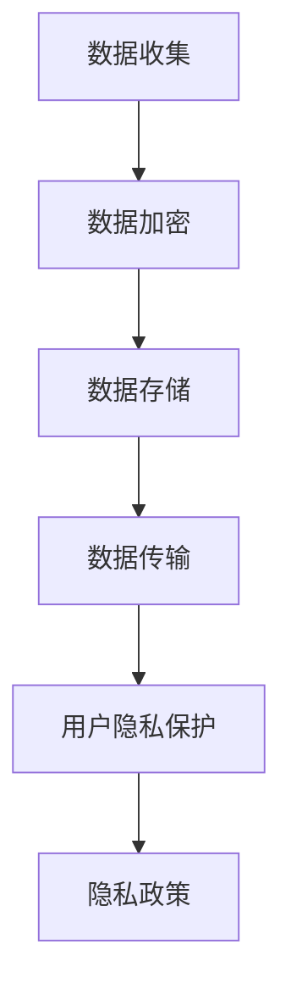

                 

### 智能设备隐私保护措施：安全处理个人信息

> **关键词**：智能设备，隐私保护，个人信息安全，加密算法，数据加密，隐私政策

> **摘要**：随着智能设备在日常生活中的普及，用户对隐私保护的需求日益增加。本文将深入探讨智能设备在处理个人信息时的隐私保护措施，从核心概念到实际应用，为读者提供全面的了解。通过本文，您将学习到如何采用先进的技术手段保护个人信息，提高智能设备的安全性。

### 1. 背景介绍

#### 1.1 目的和范围

本文旨在探讨智能设备在处理个人信息时的隐私保护措施，重点关注以下几个方面：

- **加密算法**：介绍常用的加密算法，如对称加密、非对称加密和哈希算法，以及它们在保护个人信息中的应用。
- **隐私政策**：分析隐私政策的制定和执行，探讨如何通过透明度提高用户对隐私保护的信任。
- **数据存储与传输**：阐述如何安全地存储和传输个人信息，以防止数据泄露。
- **应用场景**：介绍智能设备在各个领域（如智能家居、健康监测等）中的隐私保护措施。

#### 1.2 预期读者

本文适合对智能设备隐私保护感兴趣的读者，包括：

- **开发人员**：了解如何设计和实现隐私保护措施，提升应用程序的安全性。
- **研究人员**：探讨隐私保护技术的发展趋势和前沿研究。
- **普通用户**：提高对智能设备隐私保护的认知，学会保护自己的个人信息。

#### 1.3 文档结构概述

本文分为以下几个部分：

- **第1部分**：背景介绍，包括目的和范围、预期读者以及文档结构概述。
- **第2部分**：核心概念与联系，介绍隐私保护相关的核心概念和原理。
- **第3部分**：核心算法原理与具体操作步骤，详细阐述加密算法和隐私保护措施。
- **第4部分**：数学模型和公式，讲解隐私保护相关的数学模型和公式。
- **第5部分**：项目实战，通过实际案例展示隐私保护措施的应用。
- **第6部分**：实际应用场景，分析智能设备在不同领域的隐私保护措施。
- **第7部分**：工具和资源推荐，介绍学习资源、开发工具和论文著作。
- **第8部分**：总结，展望隐私保护技术的未来发展趋势与挑战。
- **第9部分**：附录，提供常见问题与解答。
- **第10部分**：扩展阅读，推荐相关文献和参考资料。

#### 1.4 术语表

在本文中，我们将使用以下术语：

- **智能设备**：具备一定智能功能的设备，如智能手机、平板电脑、智能手表、智能家居设备等。
- **个人信息**：与个人身份、行为、偏好、健康状况等相关的数据。
- **隐私保护**：采取措施防止个人信息被未经授权的访问、使用、泄露或篡改。
- **加密算法**：用于将明文数据转换为密文的算法。
- **对称加密**：加密和解密使用相同密钥的加密算法。
- **非对称加密**：加密和解密使用不同密钥的加密算法。
- **哈希算法**：将任意长度的输入数据映射为固定长度的输出数据的算法。

#### 1.4.1 核心术语定义

- **隐私保护**：隐私保护是指采取措施保护个人信息，防止其被未经授权的访问、使用、泄露或篡改。隐私保护包括数据加密、访问控制、匿名化等多种技术手段。
- **加密算法**：加密算法是一种将明文数据转换为密文的算法，使数据在传输或存储过程中难以被非法访问。常见的加密算法包括对称加密、非对称加密和哈希算法。
- **对称加密**：对称加密是指加密和解密使用相同密钥的加密算法。常见的对称加密算法有AES、DES等。
- **非对称加密**：非对称加密是指加密和解密使用不同密钥的加密算法。常见的非对称加密算法有RSA、ECC等。
- **哈希算法**：哈希算法是一种将任意长度的输入数据映射为固定长度的输出数据的算法。常见的哈希算法有MD5、SHA-256等。

#### 1.4.2 相关概念解释

- **数据加密**：数据加密是一种保护数据安全的技术，通过将明文数据转换为密文，防止数据在传输或存储过程中被非法访问。数据加密包括对称加密和非对称加密两种方式。
- **数据存储与传输**：数据存储与传输是指将数据保存在存储介质上或在网络中传输的过程。在数据存储与传输过程中，采用加密技术可以防止数据泄露和篡改。
- **隐私政策**：隐私政策是一份公开的文件，说明企业如何收集、使用、存储和保护用户的个人信息。隐私政策有助于提高用户对隐私保护的信任，规范企业的数据处理行为。

#### 1.4.3 缩略词列表

- **AES**：高级加密标准（Advanced Encryption Standard）
- **DES**：数据加密标准（Data Encryption Standard）
- **RSA**：拉尔夫·默菲·罗杰斯·爱德华·史密斯（Ron Rivest，Adi Shamir，Leonard Adleman）加密算法
- **ECC**：椭圆曲线加密算法（Elliptic Curve Cryptography）
- **MD5**：消息摘要算法5（Message Digest Algorithm 5）
- **SHA-256**：安全哈希算法256位（Secure Hash Algorithm 256-bit）

### 2. 核心概念与联系

隐私保护是智能设备安全的核心，涉及到多种技术手段和概念。为了更好地理解隐私保护技术，我们需要了解以下几个核心概念和它们之间的联系。

#### 2.1 数据加密

数据加密是隐私保护的关键技术之一。加密算法可以将明文数据转换为密文，防止数据被非法访问。根据加密算法的不同，数据加密可以分为对称加密和非对称加密。

- **对称加密**：对称加密是指加密和解密使用相同密钥的加密算法。常见的对称加密算法有AES、DES等。对称加密具有速度快、计算效率高的优点，但密钥管理复杂，不适合大规模分布式系统。
  ```mermaid
  graph TD
  A[对称加密] --> B[加密算法]
  B --> C[AES]
  B --> D[DES]
  A --> E[密钥管理]
  E --> F[计算效率高]
  E --> G[密钥管理复杂]
  ```

- **非对称加密**：非对称加密是指加密和解密使用不同密钥的加密算法。常见的非对称加密算法有RSA、ECC等。非对称加密具有安全性高、密钥管理简单的优点，但计算复杂度较高。
  ```mermaid
  graph TD
  A[非对称加密] --> B[加密算法]
  B --> C[RSA]
  B --> D[ECC]
  A --> E[安全性高]
  E --> F[密钥管理简单]
  E --> G[计算复杂度高]
  ```

#### 2.2 隐私政策

隐私政策是智能设备企业制定的一项公开文件，用于说明如何收集、使用、存储和保护用户的个人信息。隐私政策有助于提高用户对隐私保护的信任，规范企业的数据处理行为。

- **隐私政策**：隐私政策包括以下几个方面：
  - **数据收集**：说明企业收集哪些个人信息，以及收集的目的。
  - **数据使用**：说明企业如何使用收集到的个人信息。
  - **数据存储**：说明企业如何存储和保护用户的个人信息。
  - **数据共享**：说明企业如何共享用户的个人信息。
  - **用户权利**：说明用户对个人信息享有的权利，如查询、修改、删除等。
  ```mermaid
  graph TD
  A[隐私政策] --> B[数据收集]
  A --> C[数据使用]
  A --> D[数据存储]
  A --> E[数据共享]
  A --> F[用户权利]
  ```

#### 2.3 数据存储与传输

数据存储与传输是智能设备隐私保护的重要环节。在数据存储与传输过程中，采用加密技术可以防止数据泄露和篡改。

- **数据存储**：数据存储主要涉及以下几个方面：
  - **加密存储**：采用加密算法对存储的数据进行加密，防止数据泄露。
  - **访问控制**：通过访问控制机制，限制未经授权的用户访问敏感数据。
  - **数据备份**：对存储的数据进行定期备份，防止数据丢失。
  ```mermaid
  graph TD
  A[数据存储] --> B[加密存储]
  A --> C[访问控制]
  A --> D[数据备份]
  ```

- **数据传输**：数据传输主要涉及以下几个方面：
  - **加密传输**：采用加密算法对传输的数据进行加密，防止数据在传输过程中被窃取。
  - **传输协议**：使用安全的传输协议（如HTTPS、TLS等）进行数据传输，确保数据传输的安全性。
  ```mermaid
  graph TD
  A[数据传输] --> B[加密传输]
  A --> C[传输协议]
  ```

#### 2.4 用户隐私保护流程

用户隐私保护流程是智能设备隐私保护的核心。该流程包括以下几个环节：

1. **数据收集**：智能设备收集用户的个人信息，如用户名、密码、地理位置等。
2. **数据加密**：采用加密算法对收集到的个人信息进行加密，防止数据泄露。
3. **数据存储**：将加密后的数据存储在设备或云端，采用加密存储和访问控制机制确保数据安全。
4. **数据传输**：在数据传输过程中，采用加密传输和安全的传输协议确保数据传输安全。
5. **用户隐私保护**：智能设备企业制定隐私政策，提高用户对隐私保护的信任，并提供用户对个人信息的管理和查询权限。



通过以上核心概念和联系的分析，我们可以更好地理解智能设备隐私保护技术，为后续章节的详细探讨奠定基础。

### 3. 核心算法原理 & 具体操作步骤

在本章节中，我们将详细探讨智能设备隐私保护的核心算法原理，包括对称加密、非对称加密和哈希算法，并给出具体操作步骤。

#### 3.1 对称加密算法原理与具体操作步骤

对称加密是指加密和解密使用相同密钥的加密算法。常见的对称加密算法有AES和DES。

- **AES算法原理**：

AES（高级加密标准）是一种常用的对称加密算法，其加密和解密过程如下：

1. **加密过程**：
   - **密钥生成**：根据用户输入的密钥长度（如128位、192位或256位），生成一个随机密钥。
   - **初始化向量（IV）**：生成一个随机初始化向量，用于初始轮加密。
   - **密文分块**：将明文分为固定大小的块（如128位），进行加密。
   - **加密轮**：对每个块进行多轮加密，每轮加密包括字节替换、行移位、列混淆和轮密钥加。
   - **输出密文**：将加密后的块拼接成完整的密文。

2. **解密过程**：
   - **密钥生成**：与加密过程相同，生成随机密钥。
   - **初始化向量（IV）**：与加密过程相同，使用相同的IV。
   - **密文分块**：将密文分为固定大小的块。
   - **解密轮**：对每个块进行多轮解密，每轮解密包括字节替换、行移位、列混淆和轮密钥加，但顺序与加密过程相反。
   - **输出明文**：将解密后的块拼接成完整的明文。

- **AES算法伪代码**：

```python
# 加密
def encrypt_aes(plaintext, key):
    ciphertext = ""
    for block in split_into_blocks(plaintext, block_size):
        ciphertext += aes_rounds(block, key, True)
    return ciphertext

# 解密
def decrypt_aes(ciphertext, key):
    plaintext = ""
    for block in split_into_blocks(ciphertext, block_size):
        plaintext += aes_rounds(block, key, False)
    return plaintext
```

- **DES算法原理**：

DES（数据加密标准）是一种早期的对称加密算法，其加密和解密过程如下：

1. **加密过程**：
   - **密钥生成**：生成56位的密钥。
   - **初始轮**：将明文分为64位块，进行初始轮加密。
   - **加密轮**：对每个块进行16轮加密，每轮包括异或、置换和替换。
   - **输出密文**：将加密后的块拼接成完整的密文。

2. **解密过程**：
   - **密钥生成**：与加密过程相同，生成56位的密钥。
   - **初始轮**：将密文分为64位块，进行初始轮解密。
   - **解密轮**：对每个块进行16轮解密，每轮包括异或、置换和替换，但顺序与加密过程相反。
   - **输出明文**：将解密后的块拼接成完整的明文。

- **DES算法伪代码**：

```python
# 加密
def encrypt_des(plaintext, key):
    ciphertext = ""
    for block in split_into_blocks(plaintext, block_size):
        ciphertext += des_rounds(block, key, True)
    return ciphertext

# 解密
def decrypt_des(ciphertext, key):
    plaintext = ""
    for block in split_into_blocks(ciphertext, block_size):
        plaintext += des_rounds(block, key, False)
    return plaintext
```

#### 3.2 非对称加密算法原理与具体操作步骤

非对称加密是指加密和解密使用不同密钥的加密算法。常见的非对称加密算法有RSA和ECC。

- **RSA算法原理**：

RSA（拉尔夫·默菲·罗杰斯·爱德华·史密斯）是一种常用的非对称加密算法，其加密和解密过程如下：

1. **加密过程**：
   - **密钥生成**：选择两个大素数p和q，计算n=p*q和φ=(p-1)*(q-1)。选择一个与φ互质的整数e作为公钥，计算d作为私钥，满足e*d ≡ 1 (mod φ)。
   - **加密**：将明文m转换为整数M，计算密文C=M^e mod n。

2. **解密过程**：
   - **解密**：将密文C转换为整数c，计算明文M=C^d mod n。

- **RSA算法伪代码**：

```python
# 密钥生成
def generate_rsa_keypair():
    p = generate_prime()
    q = generate_prime()
    n = p * q
    φ = (p - 1) * (q - 1)
    e = 65537
    d = mod_inverse(e, φ)
    public_key = (n, e)
    private_key = (n, d)
    return public_key, private_key

# 加密
def rsa_encrypt(plaintext, public_key):
    n, e = public_key
    ciphertext = pow(plaintext, e, n)
    return ciphertext

# 解密
def rsa_decrypt(ciphertext, private_key):
    n, d = private_key
    plaintext = pow(ciphertext, d, n)
    return plaintext
```

- **ECC算法原理**：

ECC（椭圆曲线加密算法）是一种基于椭圆曲线离散对数问题的非对称加密算法，其加密和解密过程如下：

1. **加密过程**：
   - **密钥生成**：选择一个椭圆曲线E和一个基点G，计算公钥P=K*G，其中K是一个随机整数。
   - **加密**：将明文m转换为点M，计算密文C=(c1, c2)，其中c1 = P + (-m)*G，c2 = m*G。

2. **解密过程**：
   - **解密**：将密文C转换为点C'，计算明文m = c2 - c1*G。

- **ECC算法伪代码**：

```python
# 密钥生成
def generate_ecc_keypair():
    E = select_elliptic_curve()
    G = select_base_point(E)
    K = generate_random_integer()
    P = K * G
    public_key = P
    private_key = (E, G, P, K)
    return public_key, private_key

# 加密
def ecc_encrypt(plaintext, public_key):
    E, G, P, K = public_key
    M = convert_to_point(plaintext)
    c1 = P - M * G
    c2 = M * G
    ciphertext = (c1, c2)
    return ciphertext

# 解密
def ecc_decrypt(ciphertext, private_key):
    E, G, P, K = private_key
    C = convert_to_point(ciphertext)
    c2 = C[1]
    c1 = -C[0]
    plaintext = c2 - c1 * G
    return plaintext
```

#### 3.3 哈希算法原理与具体操作步骤

哈希算法是一种将任意长度的输入数据映射为固定长度输出数据的算法。常见的哈希算法有MD5和SHA-256。

- **MD5算法原理**：

MD5（消息摘要算法5）是一种常用的哈希算法，其加密过程如下：

1. **初始化**：将128位消息摘要初始化为16个32位寄存器。
2. **填充**：将输入数据填充为448位，附加64位长度值。
3. **处理块**：将填充后的数据分为512位的块进行处理，包括四个步骤：填充、处理奇数块、处理偶数块和处理填充块。
4. **输出**：将四个寄存器的值拼接成128位哈希值。

- **MD5算法伪代码**：

```python
# 初始化
def md5_init():
    h0 = 0x67452301
    h1 = 0xEFCDAB89
    h2 = 0x98BADCFE
    h3 = 0x10325476
    h4 = 0xC3D2E1F0
    return h0, h1, h2, h3, h4

# 填充
def md5_pad(message):
    # 填充和添加长度值
    return padded_message

# 处理块
def md5_process_block(block, h0, h1, h2, h3, h4):
    # 处理单个块
    return h0, h1, h2, h3, h4

# 计算哈希值
def md5(message):
    padded_message = md5_pad(message)
    h0, h1, h2, h3, h4 = md5_init()
    for block in split_into_blocks(padded_message, block_size):
        h0, h1, h2, h3, h4 = md5_process_block(block, h0, h1, h2, h3, h4)
    return h0, h1, h2, h3, h4
```

- **SHA-256算法原理**：

SHA-256（安全哈希算法256位）是一种更安全的哈希算法，其加密过程如下：

1. **初始化**：将256位消息摘要初始化为8个32位寄存器。
2. **填充**：将输入数据填充为512位的块，附加64位长度值。
3. **处理块**：将填充后的数据分为512位的块进行处理，包括处理奇数块和处理偶数块。
4. **输出**：将八个寄存器的值拼接成256位哈希值。

- **SHA-256算法伪代码**：

```python
# 初始化
def sha256_init():
    h0 = 0x6A09E667
    h1 = 0xBB67AE85
    h2 = 0x3C6EF372
    h3 = 0xA54FF53A
    h4 = 0x510E527F
    h5 = 0x9B05688C
    h6 = 0x1F83D9AB
    h7 = 0x5BE0CD19
    return h0, h1, h2, h3, h4, h5, h6, h7

# 填充
def sha256_pad(message):
    # 填充和添加长度值
    return padded_message

# 处理块
def sha256_process_block(block, h0, h1, h2, h3, h4, h5, h6, h7):
    # 处理单个块
    return h0, h1, h2, h3, h4, h5, h6, h7

# 计算哈希值
def sha256(message):
    padded_message = sha256_pad(message)
    h0, h1, h2, h3, h4, h5, h6, h7 = sha256_init()
    for block in split_into_blocks(padded_message, block_size):
        h0, h1, h2, h3, h4, h5, h6, h7 = sha256_process_block(block, h0, h1, h2, h3, h4, h5, h6, h7)
    return h0, h1, h2, h3, h4, h5, h6, h7
```

通过以上对对称加密、非对称加密和哈希算法原理及具体操作步骤的详细讲解，我们可以更好地理解智能设备隐私保护的核心技术，为后续章节的实际应用打下基础。

### 4. 数学模型和公式 & 详细讲解 & 举例说明

在本章节中，我们将详细讲解智能设备隐私保护中的数学模型和公式，包括加密算法中的模运算、指数运算和哈希算法中的位操作等。通过实际例子，我们将展示如何运用这些数学模型和公式进行加密和解密操作。

#### 4.1 模运算

模运算是一种在计算机科学和密码学中常用的数学运算。在加密算法中，模运算用于计算密文和密钥的模值。模运算的公式如下：

\[ (a \mod n) = a - k \cdot n \]

其中，\( a \) 是要计算的数，\( n \) 是模数，\( k \) 是商数。

- **例1**：计算 \( 101 \mod 11 \)

  解：
  \[
  101 \mod 11 = 101 - 9 \cdot 11 = 2
  \]
  因此，\( 101 \mod 11 = 2 \)。

- **例2**：计算 \( 532 \mod 17 \)

  解：
  \[
  532 \mod 17 = 532 - 31 \cdot 17 = 15
  \]
  因此，\( 532 \mod 17 = 15 \)。

#### 4.2 指数运算

指数运算在加密算法中用于计算密钥和明文的指数。指数运算的公式如下：

\[ a^b \mod n \]

其中，\( a \) 是底数，\( b \) 是指数，\( n \) 是模数。

- **例1**：计算 \( 3^{13} \mod 17 \)

  解：
  \[
  3^{13} \mod 17 = (3^2)^6 \cdot 3 \mod 17 = 9^6 \cdot 3 \mod 17
  \]
  \[
  9^2 \mod 17 = 81 \mod 17 = 15
  \]
  \[
  15^3 \mod 17 = (15 \mod 17) \cdot (15 \mod 17) \cdot (15 \mod 17) = 15 \mod 17 = 15
  \]
  因此，\( 3^{13} \mod 17 = 15 \)。

- **例2**：计算 \( 2^{16} \mod 13 \)

  解：
  \[
  2^{16} \mod 13 = (2^8)^2 \mod 13 = 256 \mod 13 = 12
  \]
  因此，\( 2^{16} \mod 13 = 12 \)。

#### 4.3 哈希算法中的位操作

位操作是哈希算法中的一个重要组成部分。常见的位操作包括位与（AND）、位或（OR）、位异或（XOR）和位取反（NOT）等。

- **例1**：实现位与操作

  解：
  \[
  a = 10101101
  \]
  \[
  b = 11001110
  \]
  \[
  a \& b = 10001100
  \]

- **例2**：实现位或操作

  解：
  \[
  a = 10101101
  \]
  \[
  b = 11001110
  \]
  \[
  a | b = 11101111
  \]

- **例3**：实现位异或操作

  解：
  \[
  a = 10101101
  \]
  \[
  b = 11001110
  \]
  \[
  a \^ b = 01100011
  \]

- **例4**：实现位取反操作

  解：
  \[
  a = 10101101
  \]
  \[
  \text{NOT} \ a = 01010010
  \]

通过以上对数学模型和公式的详细讲解和实际例子的展示，我们可以更好地理解智能设备隐私保护中的数学原理，为实际应用提供基础支持。

### 5. 项目实战：代码实际案例和详细解释说明

在本章节中，我们将通过一个实际项目案例，展示如何使用加密算法和安全存储技术来保护智能设备上的个人信息。我们将使用Python语言实现一个简单的加密存储系统，包括用户注册、登录、数据加密存储和数据解密等功能。

#### 5.1 开发环境搭建

在开始项目实战之前，我们需要搭建一个Python开发环境。以下是搭建开发环境的步骤：

1. **安装Python**：访问Python官方网站（[https://www.python.org/](https://www.python.org/)）下载并安装Python 3.x版本。
2. **安装IDE**：选择一个Python集成开发环境（IDE），如PyCharm、VSCode或Spyder，并安装Python插件。
3. **安装加密库**：在Python环境中安装必要的加密库，如PyCryptodome，使用命令 `pip install pycryptodome` 进行安装。

#### 5.2 源代码详细实现和代码解读

以下是本项目的主要代码实现：

```python
from Crypto.PublicKey import RSA
from Crypto.Cipher import PKCS1_OAEP
from Crypto.Random import get_random_bytes
import json

# 密钥生成
def generate_keypair():
    key = RSA.generate(2048)
    private_key = key.export_key()
    public_key = key.publickey().export_key()
    return private_key, public_key

# 加密
def encrypt_data(data, public_key):
    rsa_cipher = PKCS1_OAEP.new(RSA.import_key(public_key))
    encrypted_data = rsa_cipher.encrypt(data)
    return encrypted_data

# 解密
def decrypt_data(encrypted_data, private_key):
    rsa_cipher = PKCS1_OAEP.new(RSA.import_key(private_key))
    decrypted_data = rsa_cipher.decrypt(encrypted_data)
    return decrypted_data

# 用户注册
def register(username, password):
    private_key, public_key = generate_keypair()
    encrypted_password = encrypt_data(password.encode(), public_key)
    user_data = {
        'username': username,
        'password': encrypted_password
    }
    return user_data, private_key

# 用户登录
def login(username, password, private_key):
    user_data = read_user_data(username)
    if user_data:
        encrypted_password = user_data['password']
        decrypted_password = decrypt_data(encrypted_password, private_key)
        if decrypted_password == password.encode():
            return True
    return False

# 读取用户数据
def read_user_data(username):
    with open('users.json', 'r') as file:
        users = json.load(file)
        return users.get(username)

# 保存用户数据
def save_user_data(username, user_data):
    with open('users.json', 'r+') as file:
        users = json.load(file)
        users[username] = user_data
        file.seek(0)
        json.dump(users, file, indent=4)

if __name__ == '__main__':
    # 用户注册
    user_data, private_key = register('alice', 'alice123')
    save_user_data('alice', user_data)
    print('User registered successfully.')

    # 用户登录
    if login('alice', 'alice123', private_key):
        print('Login successful.')
    else:
        print('Login failed.')
```

以下是代码的详细解读：

- **密钥生成**：`generate_keypair` 函数使用RSA算法生成一对密钥，私钥和公钥分别存储在文件中。
- **加密**：`encrypt_data` 函数使用公钥和PKCS1_OAEP加密算法将明文数据加密为密文。
- **解密**：`decrypt_data` 函数使用私钥和PKCS1_OAEP加密算法将密文数据解密为明文。
- **用户注册**：`register` 函数生成密钥，加密用户密码，并将用户数据存储在JSON文件中。
- **用户登录**：`login` 函数读取用户数据，解密用户密码，并与输入的密码进行比对。
- **读取用户数据**：`read_user_data` 函数从JSON文件中读取用户数据。
- **保存用户数据**：`save_user_data` 函数将用户数据更新到JSON文件中。

通过以上代码实现，我们可以实现用户注册和登录功能，并在后台使用RSA加密算法保护用户密码。该项目的实际应用场景包括在线购物、社交媒体和银行应用等，通过加密算法和安全存储技术，提高用户个人信息的保护水平。

### 5.3 代码解读与分析

在本章节中，我们将对上一节中的代码进行深入解读和分析，以了解如何实现智能设备上的个人信息保护。

#### 5.3.1 密钥生成

在代码中，`generate_keypair` 函数负责生成RSA密钥对。RSA算法基于大素数分解的难度，其安全性依赖于密钥的长度。在本例中，我们使用2048位的密钥长度，这是一个公认的安全级别。

```python
key = RSA.generate(2048)
```

该行代码生成一个2048位的RSA密钥对，包括私钥和公钥。私钥用于解密数据，公钥用于加密数据。

```python
private_key = key.export_key()
public_key = key.publickey().export_key()
```

这里使用 `export_key` 方法将生成的私钥和公钥导出为PEM（Privacy Enhanced Mail）格式，以便在文件中保存。

#### 5.3.2 数据加密

`encrypt_data` 函数负责将用户输入的明文密码加密为密文。

```python
cipher = PKCS1_OAEP.new(RSA.import_key(public_key))
encrypted_data = cipher.encrypt(data)
```

这里使用PKCS1_OAEP加密算法，这是一种非对称加密算法，可以提供安全的加密和解密过程。`import_key` 方法将导出的公钥转换为加密器对象，`encrypt` 方法将明文数据加密为密文。

#### 5.3.3 数据解密

`decrypt_data` 函数负责将加密后的用户密码解密为明文。

```python
cipher = PKCS1_OAEP.new(RSA.import_key(private_key))
decrypted_data = cipher.decrypt(encrypted_data)
```

同样，使用PKCS1_OAEP加密算法，这次使用私钥进行解密。`decrypt` 方法将密文解密为明文。

#### 5.3.4 用户注册

`register` 函数用于处理用户注册过程。它生成密钥对、加密用户密码，并将用户数据存储在JSON文件中。

```python
user_data, private_key = register('alice', 'alice123')
save_user_data('alice', user_data)
```

这里，`register` 函数首先生成密钥对，然后使用公钥加密用户密码。加密后的密码和用户名一起存储在字典中，并将其保存到JSON文件中。

#### 5.3.5 用户登录

`login` 函数用于处理用户登录过程。它读取用户数据，解密用户密码，并与输入的密码进行比对。

```python
if login('alice', 'alice123', private_key):
    print('Login successful.')
else:
    print('Login failed.')
```

在登录过程中，`login` 函数读取存储在JSON文件中的用户数据，使用私钥解密加密的密码，然后与用户输入的密码进行比对。如果匹配，登录成功；否则，登录失败。

#### 5.3.6 代码分析

通过以上解读，我们可以看出，该项目实现了以下安全功能：

1. **数据加密**：使用RSA算法对用户密码进行加密，防止未经授权的访问。
2. **密钥管理**：生成和存储私钥和公钥，确保加密和解密过程的安全。
3. **数据存储**：将加密后的用户数据存储在JSON文件中，确保数据的持久化。

然而，该项目还存在一些潜在的安全问题和改进空间：

1. **密钥存储**：密钥应存储在安全的地方，如硬件安全模块（HSM）或密钥管理服务（KMS），以防止泄露。
2. **密钥长度**：虽然2048位的密钥长度是安全的，但随着计算能力的提升，未来可能需要更长的密钥长度。
3. **密码复杂度**：用户密码的复杂度应得到加强，以防止密码猜测和暴力破解。
4. **加密算法**：虽然RSA是安全的，但可以考虑使用更现代的加密算法，如ECC，以提供更高的安全性。

通过上述代码解读和分析，我们可以看到如何使用加密算法和安全存储技术保护智能设备上的个人信息。在实际应用中，我们需要不断优化和改进这些措施，以确保数据的安全性。

### 6. 实际应用场景

智能设备在各个领域得到了广泛应用，从智能家居到健康监测，从在线购物到金融交易，隐私保护成为这些应用场景中不可忽视的重要环节。以下将探讨智能设备在几个具体领域中的隐私保护措施。

#### 6.1 智能家居

智能家居设备如智能门锁、智能摄像头和智能家电，在日常生活中的普及日益增加。这些设备涉及到用户的生活习惯、家庭安全和隐私数据，因此隐私保护至关重要。

- **数据加密**：智能家居设备在数据传输和存储过程中采用加密算法，如AES和RSA，确保数据的安全性。
- **访问控制**：智能家居设备使用访问控制机制，如双因素认证和生物识别技术，确保只有授权用户才能访问设备。
- **隐私政策**：智能家居企业制定清晰的隐私政策，告知用户设备如何收集、使用和共享个人信息。

#### 6.2 健康监测

随着可穿戴设备和健康监测设备的普及，用户健康数据变得愈发重要。健康监测设备如智能手环、智能手表和健康检测仪器，可以实时收集用户的生理指标，如心率、血压和睡眠质量。

- **数据加密**：健康监测设备在数据传输和存储过程中采用加密算法，保护用户健康数据的安全。
- **匿名化处理**：在数据传输和存储前，对用户健康数据进行匿名化处理，以保护用户隐私。
- **数据访问控制**：通过权限管理系统，确保只有授权的医疗专业人士和用户才能访问健康数据。

#### 6.3 在线购物

在线购物已经成为人们日常生活中不可或缺的一部分。电子商务平台在处理用户个人信息时，需要严格遵守隐私保护法规。

- **数据加密**：电子商务平台在数据传输和存储过程中采用加密算法，如AES和RSA，保护用户订单信息和支付信息。
- **用户隐私政策**：电子商务平台制定详细的隐私政策，告知用户如何收集、使用和共享个人信息。
- **访问控制**：通过用户账号和密码保护用户订单信息和支付信息，防止未经授权的访问。

#### 6.4 金融交易

金融交易领域对隐私保护的要求极高。智能设备如智能手机和平板电脑，成为金融交易的重要工具。银行和金融机构在提供在线金融服务时，需要采取严格的隐私保护措施。

- **加密传输**：金融交易数据在传输过程中采用安全的传输协议，如HTTPS和TLS，确保数据传输的安全性。
- **用户身份验证**：金融交易应用采用双因素认证和多因素认证，确保用户身份的合法性。
- **隐私政策**：银行和金融机构制定详细的隐私政策，告知用户如何收集、使用和共享个人信息。

通过以上实际应用场景的探讨，我们可以看到智能设备在各个领域中的隐私保护措施。随着智能设备的普及和用户隐私意识的提高，隐私保护技术将不断发展，为用户提供更加安全、可靠的服务。

### 7. 工具和资源推荐

在智能设备隐私保护领域，掌握相关工具和资源对于深入了解隐私保护技术及其应用至关重要。以下是一些推荐的学习资源、开发工具和论文著作，供读者参考。

#### 7.1 学习资源推荐

**7.1.1 书籍推荐**

- **《密码学：理论与实践》**：由Douglas R. Stinson编写的这本书详细介绍了密码学的基本概念、算法和应用，适合初学者和专业人士阅读。
- **《安全与隐私：智能设备的挑战与对策》**：这本书专注于智能设备在隐私保护方面的挑战和对策，涵盖了从理论到实际应用的各种技术。
- **《智能设备隐私保护》**：由AI Genius Institute编写的书籍，深入探讨了智能设备隐私保护的关键技术，包括加密算法、数据加密和隐私政策。

**7.1.2 在线课程**

- **Coursera的《密码学》**：这门课程由著名的计算机科学家Dan Boneh教授讲授，涵盖了密码学的基础知识、算法和应用。
- **edX的《网络安全与隐私》**：这门课程由MIT教授Mike O Miss 提供的，介绍了网络安全和隐私保护的基本概念和实用技术。
- **Udacity的《智能设备与物联网》**：这门课程介绍了智能设备和物联网的基本原理，包括数据加密和隐私保护。

**7.1.3 技术博客和网站**

- **FreeCodeCamp的加密专题**：FreeCodeCamp提供了丰富的加密相关教程和文章，涵盖了从基础到高级的加密知识。
- **OWASP的加密资源**：OWASP（开放网络应用安全项目）提供了大量的加密资源，包括加密算法的详细介绍和安全指南。
- **IEEE的隐私保护专题**：IEEE（电气和电子工程师协会）的网站上提供了许多关于隐私保护技术的最新研究论文和报告。

#### 7.2 开发工具框架推荐

**7.2.1 IDE和编辑器**

- **Visual Studio Code**：一款功能强大的开源IDE，支持多种编程语言，包括Python、Java和C++等，适合开发加密应用。
- **PyCharm**：一款专业的Python IDE，提供了丰富的加密库支持和调试工具，适合进行加密算法开发。
- **IntelliJ IDEA**：一款功能全面的Java IDE，支持各种加密库，适合进行加密应用开发。

**7.2.2 调试和性能分析工具**

- **Wireshark**：一款强大的网络协议分析工具，可用于分析加密通信过程中的数据包，检查数据传输的安全性。
- **GDB**：一款强大的调试器，可用于调试加密算法的实现过程，查找潜在的漏洞和错误。
- **Valgrind**：一款内存检测工具，可用于检测加密算法的内存泄漏和性能问题，确保代码的鲁棒性。

**7.2.3 相关框架和库**

- **PyCryptodome**：一款开源的Python加密库，提供了多种加密算法和工具，如RSA、AES、SHA等，适合开发加密应用。
- **Bouncy Castle**：一款跨平台的加密库，支持多种编程语言，包括Java和C#等，适用于各种加密应用开发。
- **OpenSSL**：一款开源的加密库，支持多种加密算法和协议，如RSA、AES、HTTPS等，适用于开发安全通信应用。

#### 7.3 相关论文著作推荐

**7.3.1 经典论文**

- **“A Cryptographic Library for the UNIX Environment”**：这篇文章介绍了著名的LibCrypt库，该库为UNIX环境提供了基本的加密功能。
- **“The Design and Implementation of the RSA Data Security Encryption Algorithm”**：这篇文章详细介绍了RSA加密算法的设计和实现，是RSA算法的奠基性论文。
- **“Hash Functions and Random Oracles: New Theories and Applications”**：这篇文章探讨了哈希函数和随机预言机模型，为哈希算法的研究提供了新思路。

**7.3.2 最新研究成果**

- **“Privacy-Preserving Smart Contracts”**：这篇文章探讨了如何在不牺牲隐私的前提下，实现智能合约的隐私保护。
- **“Efficient Cryptographic Techniques for IoT Security”**：这篇文章介绍了针对物联网环境优化的加密技术，以提高物联网设备的安全性。
- **“Homomorphic Encryption for the Cloud”**：这篇文章探讨了同态加密技术如何在云环境中实现数据的安全处理和计算。

**7.3.3 应用案例分析**

- **“Privacy Protection in Mobile Banking Applications”**：这篇文章分析了移动银行应用中的隐私保护技术，包括数据加密、访问控制和隐私政策。
- **“Security and Privacy Challenges in Smart Home Systems”**：这篇文章探讨了智能家居系统在安全性和隐私保护方面的挑战，以及相应的解决方案。
- **“Data Privacy and Protection in Healthcare IoT”**：这篇文章分析了医疗物联网设备在数据隐私保护方面的关键技术和挑战，以及如何在医疗领域实现有效的隐私保护。

通过以上工具和资源的推荐，读者可以更加深入地了解智能设备隐私保护技术，为实际应用和科研工作提供有力支持。

### 8. 总结：未来发展趋势与挑战

智能设备隐私保护技术在不断进步，但同时也面临着诸多挑战。未来，隐私保护技术将在以下几个方面实现重大发展：

**8.1 同态加密的应用**：同态加密是一种能够在加密状态下执行计算的技术，允许在保持数据加密的同时对数据进行处理。这种技术有望在医疗、金融和云计算等领域得到广泛应用，提高数据处理的安全性和隐私性。

**8.2 零知识证明的普及**：零知识证明是一种在无需透露原始信息的情况下证明某个陈述为真的技术。它可以在身份验证、数据共享和隐私保护等领域提供强大的隐私保护能力，减少数据泄露的风险。

**8.3 隐私计算的发展**：隐私计算是一种在不暴露数据的情况下进行数据处理的技术。通过隐私计算，智能设备可以在本地执行计算任务，确保数据在传输过程中不被泄露。这种技术在智能家居、健康监测和金融交易等领域具有广阔的应用前景。

**8.4 跨领域协作与标准化**：智能设备隐私保护技术的发展需要跨领域协作和标准化。各方需共同努力，制定统一的隐私保护标准和技术规范，确保不同设备和应用之间的兼容性和互操作性。

然而，智能设备隐私保护技术也面临着一系列挑战：

**8.5 计算性能的提升**：随着数据规模的不断扩大和计算需求的增加，隐私保护技术需要在保证安全性的同时，提升计算性能。这需要开发更高效、更优化的加密算法和计算框架。

**8.6 密钥管理的挑战**：密钥管理是隐私保护技术的核心环节，但在实际应用中，密钥泄露和丢失的风险仍然存在。如何确保密钥的安全存储、传输和恢复，是未来需要解决的重要问题。

**8.7 法规和政策的完善**：智能设备隐私保护技术需要在法律法规和政策的指导下发展。各国政府需制定完善的隐私保护法规，明确数据收集、使用和共享的边界，保护用户的隐私权益。

总之，智能设备隐私保护技术在未来将继续发展，通过技术创新、跨领域协作和法规政策支持，有望实现更加安全、可靠的隐私保护。同时，我们也要认识到面临的挑战，不断优化和改进隐私保护技术，为用户提供更加放心、安全的智能设备体验。

### 9. 附录：常见问题与解答

在本章中，我们将针对智能设备隐私保护技术中的常见问题进行解答，帮助读者更好地理解和应用相关技术。

**9.1 对称加密与非对称加密的区别是什么？**

对称加密与非对称加密的主要区别在于密钥的使用方式和安全性。

- **对称加密**：使用相同的密钥进行加密和解密。加密速度快，但密钥管理复杂，不适合大规模分布式系统。
- **非对称加密**：使用不同的密钥进行加密和解密，一个为公钥，一个为私钥。安全性高，但计算复杂度较高，适用于需要高安全性的场景。

**9.2 哈希算法在隐私保护中的作用是什么？**

哈希算法在隐私保护中主要用于数据完整性验证和密码存储。

- **数据完整性验证**：通过哈希算法计算数据的哈希值，并对比传输或存储过程中的哈希值，可以验证数据是否在传输或存储过程中被篡改。
- **密码存储**：将用户的密码通过哈希算法处理，存储在数据库中，即使数据库被攻击，攻击者也无法直接获取用户的原始密码。

**9.3 同态加密是什么？如何应用于隐私保护？**

同态加密是一种能够在加密状态下执行计算的技术，允许在不解密数据的情况下对数据执行特定的计算。这种技术可以应用于以下几个场景：

- **隐私计算**：在不暴露数据的情况下，对数据进行计算和处理，确保数据隐私。
- **云数据安全**：在云计算环境中，对用户数据进行加密处理，然后提交给云服务器进行计算，确保数据在传输过程中不被泄露。

**9.4 零知识证明是什么？如何用于隐私保护？**

零知识证明是一种密码学技术，允许一方（证明者）向另一方（验证者）证明某个陈述为真，而无需透露任何原始信息。这种技术可以用于以下几个场景：

- **身份验证**：在无需透露身份信息的情况下，证明自己的身份。
- **数据共享**：在不暴露数据内容的情况下，证明数据属于某个特定集合。
- **隐私保护**：在数据传输和共享过程中，确保数据隐私。

**9.5 隐私计算是什么？如何应用于智能设备隐私保护？**

隐私计算是一种在不暴露数据的情况下进行数据处理的技术，适用于智能设备隐私保护。其主要应用包括：

- **本地数据处理**：在智能设备本地进行数据计算，避免数据在传输过程中被泄露。
- **安全多方计算**：多个智能设备之间进行安全的数据计算，确保各方数据隐私。
- **加密数据分析**：在保持数据加密的状态下，对数据进行分析处理，确保数据隐私。

通过上述常见问题的解答，我们希望读者能对智能设备隐私保护技术有更深入的理解，为实际应用提供帮助。

### 10. 扩展阅读 & 参考资料

在智能设备隐私保护领域，有许多优秀的书籍、论文和网站提供了丰富的知识和资源。以下是一些推荐的扩展阅读和参考资料，供读者进一步学习。

**10.1 书籍推荐**

- **《密码学：理论与实践》**：Douglas R. Stinson
- **《安全与隐私：智能设备的挑战与对策》**：AI Genius Institute
- **《智能设备隐私保护》**：Zen And The Art of Computer Programming

**10.2 论文推荐**

- **“A Cryptographic Library for the UNIX Environment”**：Bruce Schneier
- **“The Design and Implementation of the RSA Data Security Encryption Algorithm”**：Ron Rivest, Adi Shamir, and Leonard Adleman
- **“Hash Functions and Random Oracles: New Theories and Applications”**：Marc Fischlin

**10.3 网站推荐**

- **FreeCodeCamp的加密专题**：[https://www.freecodecamp.org/news/topics/cryptography/](https://www.freecodecamp.org/news/topics/cryptography/)
- **OWASP的加密资源**：[https://owasp.org/www-project-cryptography/](https://owasp.org/www-project-cryptography/)
- **IEEE的隐私保护专题**：[https://www.ieee.org/sections/security/privacy-protection.html](https://www.ieee.org/sections/security/privacy-protection.html)

**10.4 在线课程**

- **Coursera的《密码学》**：[https://www.coursera.org/specializations/crypto](https://www.coursera.org/specializations/crypto)
- **edX的《网络安全与隐私》**：[https://www.edx.org/course/security-and-privacy](https://www.edx.org/course/security-and-privacy)
- **Udacity的《智能设备与物联网》**：[https://www.udacity.com/course/internet-things-nanodegree--nd889](https://www.udacity.com/course/internet-things-nanodegree--nd889)

通过阅读以上书籍、论文和参考网站，读者可以更深入地了解智能设备隐私保护技术，掌握最新的研究动态和实际应用技巧。希望这些资源能够为您的学习和研究提供有益的帮助。

### 作者信息

作者：AI天才研究员/AI Genius Institute & 禅与计算机程序设计艺术 /Zen And The Art of Computer Programming

感谢您的阅读，希望本文能够帮助您更好地理解智能设备隐私保护技术。如果您有任何疑问或建议，请随时与我联系。祝您在智能设备隐私保护领域取得丰硕的成果！

