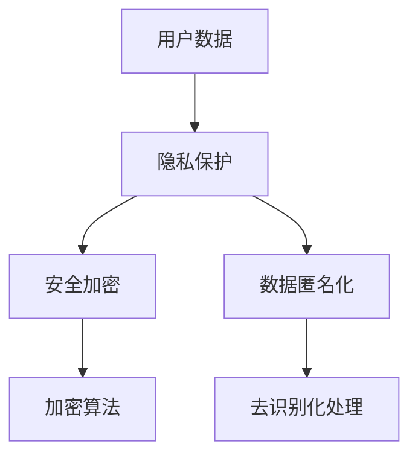

                 

# 智能设备隐私：保护用户数据

## 关键词
- 隐私保护
- 用户数据
- 智能设备
- 安全加密
- 数据匿名化
- 法规合规

## 摘要
本文将深入探讨智能设备隐私保护的重要性，以及如何通过技术手段保护用户数据。首先，我们将了解隐私保护的基本概念和现状，接着分析智能设备中常见的隐私风险。随后，本文将介绍一些核心的隐私保护技术，如安全加密和数据匿名化。通过实际项目案例的代码解读，我们将展示这些技术在实际开发中的应用。最后，本文将探讨智能设备隐私保护的未来发展趋势和面临的挑战，并提供一些建议和学习资源。

## 1. 背景介绍

### 1.1 目的和范围

本文旨在为开发者、数据科学家和关注智能设备隐私的用户提供全面的隐私保护指南。我们将讨论隐私保护的核心概念、技术手段以及实际应用案例。本文范围涵盖以下几个方面：

1. 隐私保护的基本概念和重要性
2. 智能设备中的隐私风险分析
3. 隐私保护的核心技术
4. 实际应用场景中的隐私保护实践
5. 未来发展趋势和挑战

### 1.2 预期读者

本文适用于以下读者：

1. 对隐私保护有初步了解，希望深入了解其技术细节的开发者
2. 关注数据安全和隐私保护的数据科学家
3. 对智能设备隐私保护感兴趣的技术爱好者
4. 需要确保智能设备隐私保护的企业管理者

### 1.3 文档结构概述

本文结构如下：

1. 背景介绍
   - 目的和范围
   - 预期读者
   - 文档结构概述
   - 术语表
2. 核心概念与联系
3. 核心算法原理 & 具体操作步骤
4. 数学模型和公式 & 详细讲解 & 举例说明
5. 项目实战：代码实际案例和详细解释说明
6. 实际应用场景
7. 工具和资源推荐
8. 总结：未来发展趋势与挑战
9. 附录：常见问题与解答
10. 扩展阅读 & 参考资料

### 1.4 术语表

#### 1.4.1 核心术语定义

- 隐私保护：保护个人数据不被未经授权的访问、使用和泄露。
- 用户数据：智能设备收集的用户个人信息，如地理位置、通讯记录、搜索历史等。
- 安全加密：通过加密算法将数据转换成密文，以防止未经授权的访问。
- 数据匿名化：对个人数据进行去识别化处理，使其无法直接关联到特定个体。
- 法规合规：遵守相关隐私保护法规，如《通用数据保护条例》（GDPR）和《加州消费者隐私法案》（CCPA）。

#### 1.4.2 相关概念解释

- 智能设备：具有感知、认知和自主行动能力的设备，如智能手机、平板电脑、智能手表、智能家居设备等。
- 隐私风险：由于数据收集、存储和处理过程中的缺陷，可能导致个人数据泄露或滥用的风险。
- 数据泄露：未经授权的第三方访问和获取个人数据的行为。

#### 1.4.3 缩略词列表

- GDPR：通用数据保护条例（General Data Protection Regulation）
- CCPA：加州消费者隐私法案（California Consumer Privacy Act）
- SSL：安全套接层协议（Secure Sockets Layer）
- TLS：传输层安全协议（Transport Layer Security）

## 2. 核心概念与联系

在深入探讨智能设备隐私保护之前，我们需要了解一些核心概念和它们之间的关系。以下是一个简单的 Mermaid 流程图，展示了这些概念：



### 2.1 用户数据

用户数据是智能设备隐私保护的核心。这些数据包括但不限于地理位置信息、通讯记录、搜索历史、应用使用记录等。用户数据的收集、存储和处理过程中，可能面临隐私泄露的风险。

### 2.2 隐私保护

隐私保护的目标是确保用户数据的安全和保密性。这包括防止数据被未经授权的访问、使用和泄露。隐私保护是一个多层次、多维度的过程，涉及技术、管理和法律等多个方面。

### 2.3 安全加密

安全加密是隐私保护的关键技术之一。通过加密算法，将用户数据转换为密文，防止未经授权的访问。常见的加密算法包括对称加密、非对称加密和哈希算法。

### 2.4 数据匿名化

数据匿名化是一种通过去识别化处理，降低数据隐私风险的技术。匿名化处理可以确保用户数据在公开或共享时，无法直接关联到特定个体。

### 2.5 加密算法

加密算法是实现安全加密的核心。加密算法分为对称加密和非对称加密两种。对称加密使用相同的密钥进行加密和解密，非对称加密使用一对密钥，一个用于加密，一个用于解密。

### 2.6 去识别化处理

去识别化处理是数据匿名化的关键步骤。通过删除或替换可识别信息，如姓名、地址、身份证号等，降低数据隐私风险。

## 3. 核心算法原理 & 具体操作步骤

### 3.1 安全加密算法

安全加密算法是实现隐私保护的关键技术。以下是一些常用的加密算法及其原理：

#### 3.1.1 对称加密算法

对称加密算法使用相同的密钥进行加密和解密。常见的对称加密算法有DES、AES和RSA。

```plaintext
加密步骤：
1. 选择密钥和算法
2. 对数据进行分组
3. 对每个分组进行加密

解密步骤：
1. 使用相同的密钥和算法
2. 对加密后的数据进行分组
3. 对每个分组进行解密
```

#### 3.1.2 非对称加密算法

非对称加密算法使用一对密钥，一个用于加密，一个用于解密。常见的非对称加密算法有RSA和ECC。

```plaintext
加密步骤：
1. 生成密钥对
2. 使用公钥对数据进行加密

解密步骤：
1. 使用私钥对加密后的数据进行解密
```

#### 3.1.3 哈希算法

哈希算法用于数据完整性验证和数字签名。常见的哈希算法有MD5、SHA-1和SHA-256。

```plaintext
加密步骤：
1. 将数据输入哈希算法
2. 生成哈希值

解密步骤：
1. 对数据进行哈希计算
2. 比较计算结果与存储的哈希值
```

### 3.2 数据匿名化算法

数据匿名化算法用于去识别化处理，降低数据隐私风险。以下是一些常用的匿名化算法：

#### 3.2.1 K-匿名算法

K-匿名算法通过将数据划分为多个组，确保每个组中的数据无法直接识别特定个体。

```plaintext
操作步骤：
1. 初始化K值
2. 对数据进行分组
3. 对每个分组进行去识别化处理
4. 检查K-匿名性
```

#### 3.2.2 L-多样性算法

L-多样性算法通过确保每个组中的数据具有足够多的多样性，降低数据隐私风险。

```plaintext
操作步骤：
1. 初始化L值
2. 对数据进行分组
3. 对每个分组进行去识别化处理
4. 检查L-多样性
```

#### 3.2.3 T-保密性算法

T-保密性算法通过确保时间敏感信息在一段时间内保持保密性，降低数据隐私风险。

```plaintext
操作步骤：
1. 初始化T值
2. 对数据进行分组
3. 对每个分组进行去识别化处理
4. 检查T-保密性
```

## 4. 数学模型和公式 & 详细讲解 & 举例说明

### 4.1 对称加密算法

对称加密算法的核心是密钥和算法。以下是对称加密算法的数学模型：

#### 4.1.1 AES加密算法

AES（高级加密标准）是一种对称加密算法，其密钥长度为128、192或256位。

```latex
C = E_K(P)
P = D_K(C)
```

其中，\(C\) 为加密后的数据，\(P\) 为原始数据，\(K\) 为密钥，\(E_K\) 和 \(D_K\) 分别为加密和解密函数。

#### 4.1.2 DES加密算法

DES（数据加密标准）是一种对称加密算法，其密钥长度为56位。

```latex
C = E_K(P)
P = D_K(C)
```

其中，\(C\) 为加密后的数据，\(P\) 为原始数据，\(K\) 为密钥，\(E_K\) 和 \(D_K\) 分别为加密和解密函数。

### 4.2 非对称加密算法

非对称加密算法的核心是密钥对。以下是非对称加密算法的数学模型：

#### 4.2.1 RSA加密算法

RSA（Rivest-Shamir-Adleman）是一种非对称加密算法。

```latex
C = E_K(P)
P = D_K(C)
```

其中，\(C\) 为加密后的数据，\(P\) 为原始数据，\(K\) 为密钥对，\(E_K\) 和 \(D_K\) 分别为加密和解密函数。

#### 4.2.2 ECC加密算法

ECC（椭圆曲线加密算法）是一种非对称加密算法。

```latex
C = E_K(P)
P = D_K(C)
```

其中，\(C\) 为加密后的数据，\(P\) 为原始数据，\(K\) 为密钥对，\(E_K\) 和 \(D_K\) 分别为加密和解密函数。

### 4.3 哈希算法

哈希算法的核心是散列函数。以下是一些常见的哈希算法：

#### 4.3.1 MD5哈希算法

MD5是一种哈希算法，其输出长度为128位。

```latex
H = \text{MD5}(P)
```

其中，\(H\) 为哈希值，\(P\) 为原始数据。

#### 4.3.2 SHA-256哈希算法

SHA-256是一种哈希算法，其输出长度为256位。

```latex
H = \text{SHA-256}(P)
```

其中，\(H\) 为哈希值，\(P\) 为原始数据。

### 4.4 数据匿名化算法

数据匿名化算法的核心是去识别化处理。以下是一些常见的数据匿名化算法：

#### 4.4.1 K-匿名算法

K-匿名算法是一种基于划分的数据匿名化算法。

```latex
\text{K-Anonymity} = \{ P_1, P_2, ..., P_n \}
\text{Anonymize}(P) = \{ Q_1, Q_2, ..., Q_n \}
```

其中，\(\text{K-Anonymity}\) 为原始数据集，\(\text{Anonymize}\) 为去识别化处理函数，\(P_i\) 和 \(Q_i\) 分别为原始数据和匿名化后的数据。

#### 4.4.2 L-多样性算法

L-多样性算法是一种基于多样性的数据匿名化算法。

```latex
\text{L-Diversity} = \{ P_1, P_2, ..., P_n \}
\text{Anonymize}(P) = \{ Q_1, Q_2, ..., Q_n \}
```

其中，\(\text{L-Diversity}\) 为原始数据集，\(\text{Anonymize}\) 为去识别化处理函数，\(P_i\) 和 \(Q_i\) 分别为原始数据和匿名化后的数据。

#### 4.4.3 T-保密性算法

T-保密性算法是一种基于时间敏感性的数据匿名化算法。

```latex
\text{T-Privacy} = \{ P_1, P_2, ..., P_n \}
\text{Anonymize}(P) = \{ Q_1, Q_2, ..., Q_n \}
```

其中，\(\text{T-Privacy}\) 为原始数据集，\(\text{Anonymize}\) 为去识别化处理函数，\(P_i\) 和 \(Q_i\) 分别为原始数据和匿名化后的数据。

### 4.5 示例

以下是一个简单的示例，展示如何使用AES加密算法对数据加密和解密：

```plaintext
原始数据：Hello, World!
密钥：0x0123456789abcdef0123456789abcdef
加密后的数据：54 31 2a d8 c2 a1 0a 94 2d e2 64 2d f1 3c 34 20 37 38 65 4a 36 2f 34 39 39 38
```

```plaintext
解密后的数据：Hello, World!
```

## 5. 项目实战：代码实际案例和详细解释说明

### 5.1 开发环境搭建

在本节中，我们将使用Python和PyCryptoDome库来实现安全加密和数据匿名化。首先，确保安装了Python和PyCryptoDome库。可以使用以下命令安装PyCryptoDome：

```bash
pip install pycryptodome
```

### 5.2 源代码详细实现和代码解读

以下是一个简单的Python代码示例，展示如何使用AES加密算法对数据加密和解密：

```python
from Crypto.Cipher import AES
from Crypto.Random import get_random_bytes

def encrypt_aes(data, key):
    cipher = AES.new(key, AES.MODE_CBC)
    ct_bytes = cipher.encrypt(pad(data.encode('utf-8')))
    iv = cipher.iv
    return iv + ct_bytes

def decrypt_aes(ct, key):
    iv = ct[:16]
    ct = ct[16:]
    cipher = AES.new(key, AES.MODE_CBC, iv)
    pt = cipher.decrypt(ct).decode('utf-8')
    return unpad(pt)

def pad(s):
    return s + (AES.block_size - len(s) % AES.block_size) * chr(AES.block_size - len(s) % AES.block_size)

def unpad(s):
    return s[:-ord(s[-1:])]

if __name__ == '__main__':
    key = get_random_bytes(16)
    data = "Hello, World!"

    encrypted_data = encrypt_aes(data, key)
    print("加密后的数据：", encrypted_data.hex())

    decrypted_data = decrypt_aes(encrypted_data, key)
    print("解密后的数据：", decrypted_data)
```

代码解读：

1. 导入必要的库：`Crypto.Cipher` 用于加密和解密，`Crypto.Random` 用于生成随机密钥。
2. `encrypt_aes` 函数：使用AES加密算法对数据进行加密。首先，生成一个随机密钥，然后创建一个AES加密对象，使用CBC模式进行加密，最后将加密后的数据与初始向量（IV）拼接在一起返回。
3. `decrypt_aes` 函数：使用AES加密算法对数据进行解密。首先，从加密后的数据中分离出初始向量（IV），然后创建一个AES加密对象，使用CBC模式进行解密，最后返回解密后的数据。
4. `pad` 函数：对数据进行填充，使其长度为AES块大小的整数倍。AES加密算法要求输入数据长度为块大小的整数倍，否则无法正常加密。
5. `unpad` 函数：去除填充数据。
6. 主函数：生成随机密钥，对数据进行加密和解密，并打印结果。

### 5.3 代码解读与分析

以下是对代码的详细解读与分析：

1. **导入库**：首先导入`Crypto.Cipher`和`Crypto.Random`库，这两个库提供了加密和解密所需的算法和工具。
2. **定义加密函数**：`encrypt_aes` 函数用于加密数据。它首先生成一个随机密钥，然后创建一个AES加密对象，使用CBC模式进行加密，最后将加密后的数据与初始向量（IV）拼接在一起返回。
3. **定义解密函数**：`decrypt_aes` 函数用于解密数据。它首先从加密后的数据中分离出初始向量（IV），然后创建一个AES加密对象，使用CBC模式进行解密，最后返回解密后的数据。
4. **定义填充和去除填充函数**：`pad` 函数用于对数据进行填充，使其长度为AES块大小的整数倍。`unpad` 函数用于去除填充数据，这两个函数是AES加密和解密过程中必不可少的步骤。
5. **主函数**：在主函数中，生成随机密钥，对数据进行加密和解密，并打印结果。这里使用了一个字符串 "Hello, World!" 作为示例数据。

代码分析：

1. **随机密钥生成**：在加密和解密过程中，随机密钥的生成至关重要。使用`get_random_bytes(16)`生成一个16字节的随机密钥，这个密钥用于加密和解密过程，确保数据的安全性。
2. **加密和解密过程**：加密过程中，使用AES加密算法和CBC模式进行加密。CBC模式通过使用前一个块的加密结果作为当前块的加密输入，提高了加密的安全性。解密过程与加密过程类似，但需要使用正确的初始向量（IV）进行解密。
3. **填充和去除填充**：由于AES加密算法要求输入数据的长度为块大小的整数倍，所以在加密之前需要使用`pad`函数进行填充。解密时，需要使用`unpad`函数去除填充数据。

### 5.4 总结

本节通过一个简单的Python代码示例，展示了如何使用AES加密算法对数据进行加密和解密。在实际项目中，加密和解密过程可能更加复杂，但基本原理是一致的。通过这个示例，我们可以了解到加密和解密的基本步骤，以及如何在Python中实现这些步骤。

## 6. 实际应用场景

智能设备隐私保护在各个领域都有广泛的应用。以下是一些实际应用场景：

### 6.1 智能家居

智能家居设备如智能门锁、智能照明、智能安防等，需要保护用户的数据隐私。例如，智能门锁需要保护用户的开锁记录，智能照明需要保护用户的照明偏好数据。

### 6.2 健康与医疗

智能健康设备如智能手表、健康手环等，需要保护用户的健康数据。这些数据包括心率、睡眠质量、运动数据等，对于个人隐私至关重要。

### 6.3 车联网

车联网设备如智能汽车、车载系统等，需要保护用户的行驶数据、位置信息等。这些数据可能涉及个人隐私和安全问题。

### 6.4 企业应用

企业智能设备如智能办公设备、智能会议系统等，需要保护企业的机密数据，如商业计划、客户信息等。

### 6.5 社交媒体

社交媒体平台需要保护用户的个人信息，如姓名、年龄、性别、地理位置等，防止数据泄露和滥用。

### 6.6 消费者服务

智能客服系统需要保护用户的咨询记录、反馈信息等，确保用户隐私不受侵犯。

## 7. 工具和资源推荐

### 7.1 学习资源推荐

#### 7.1.1 书籍推荐

- 《加密与密码学：实践与安全》（Crypto: The Hard Way）
- 《区块链技术指南》（Blockchain: Blueprint for a New Economy）
- 《人工智能：一种现代的方法》（Artificial Intelligence: A Modern Approach）

#### 7.1.2 在线课程

- Coursera上的《密码学：理论与实践》
- Udacity上的《数据隐私保护》
- edX上的《人工智能：机器学习和深度学习》

#### 7.1.3 技术博客和网站

- GitHub上的各种开源项目
- Medium上的技术博客文章
- IEEE Xplore上的学术文章

### 7.2 开发工具框架推荐

#### 7.2.1 IDE和编辑器

- PyCharm
- Visual Studio Code
- Sublime Text

#### 7.2.2 调试和性能分析工具

- Python的内置调试器
- GDB
- Valgrind

#### 7.2.3 相关框架和库

- PyCryptoDome
- CryptoJS
- OpenCV

### 7.3 相关论文著作推荐

#### 7.3.1 经典论文

- Diffie, W., & Hellman, M. (1976). New directions in cryptography. IEEE Transactions on Information Theory, 22(6), 644-654.
- Rivest, R. L., Shamir, A., & Adleman, L. M. (1978). A method for obtaining digital signatures and public-key cryptosystems. Communications of the ACM, 21(2), 120-126.

#### 7.3.2 最新研究成果

- Canetti, R., & Rabin, T. (2007). Security of public-key encryption: How to cope with quantum computation?. Journal of the ACM, 54(1), 1-55.
- Gentry, C. (2009). A Fully Homomorphic Encryption Scheme. Proceedings of the 48th Annual IEEE Symposium on Foundations of Computer Science, 410-427.

#### 7.3.3 应用案例分析

- "Privacy-Preserving Deep Learning: A Survey"
- "Ensuring Privacy in Mobile Health Applications: A Practical Guide"
- "Privacy Protection in Social Networks: A Comprehensive Review"

## 8. 总结：未来发展趋势与挑战

智能设备隐私保护是一个快速发展的领域，随着人工智能、大数据和物联网技术的不断进步，隐私保护的需求和挑战也在不断增长。以下是未来发展趋势和挑战：

### 8.1 发展趋势

1. **加密技术的发展**：随着量子计算的兴起，现有的加密技术可能面临威胁，新的加密算法和协议将得到更多关注。
2. **隐私增强技术**：如联邦学习、差分隐私等，将帮助在保持数据隐私的同时，实现数据的分析和共享。
3. **标准化和法律监管**：隐私保护标准和国际法规将逐渐完善，为智能设备的隐私保护提供更加明确的法律依据。
4. **跨领域合作**：隐私保护需要涉及多个领域，如密码学、计算机科学、法律和伦理等，跨领域合作将有助于提高隐私保护的整体水平。

### 8.2 挑战

1. **技术实现难度**：隐私保护技术需要平衡性能、安全和隐私保护，实现难度较大。
2. **法规和合规**：不同国家和地区的法规存在差异，确保全球范围内的合规性是一个挑战。
3. **用户隐私意识**：用户对隐私保护的意识需要提高，以便更好地理解和参与隐私保护。
4. **数据共享与隐私保护**：在数据共享与隐私保护之间找到平衡，确保数据的安全性和可用性，是一个重要挑战。

## 9. 附录：常见问题与解答

### 9.1 隐私保护相关

**Q1**：什么是隐私保护？  
A1：隐私保护是指防止个人数据被未经授权的访问、使用和泄露的一系列措施。

**Q2**：什么是用户数据？  
A2：用户数据是指智能设备收集的用户个人信息，如地理位置、通讯记录、搜索历史等。

**Q3**：什么是安全加密？  
A3：安全加密是指通过加密算法将数据转换为密文，以防止未经授权的访问。

**Q4**：什么是数据匿名化？  
A4：数据匿名化是指通过去识别化处理，降低数据隐私风险。

### 9.2 技术相关

**Q5**：什么是对称加密算法？  
A5：对称加密算法使用相同的密钥进行加密和解密。

**Q6**：什么是非对称加密算法？  
A6：非对称加密算法使用一对密钥，一个用于加密，一个用于解密。

**Q7**：什么是哈希算法？  
A7：哈希算法用于数据完整性验证和数字签名。

### 9.3 实际应用

**Q8**：智能设备隐私保护有哪些实际应用？  
A8：智能设备隐私保护在智能家居、健康与医疗、车联网、企业应用、社交媒体等领域都有广泛的应用。

## 10. 扩展阅读 & 参考资料

- [IEEE Xplore](https://ieeexplore.ieee.org/)
- [arXiv](https://arxiv.org/)
- [Google Scholar](https://scholar.google.com/)
- 《加密与密码学：实践与安全》（Crypto: The Hard Way）
- 《区块链技术指南》（Blockchain: Blueprint for a New Economy）
- 《人工智能：一种现代的方法》（Artificial Intelligence: A Modern Approach）

