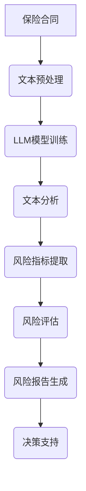

                 

# 智能风险评估：LLM在保险业务中的应用

> 关键词：智能风险评估、LLM、保险业务、应用、算法、数学模型、实战案例

> 摘要：本文旨在探讨智能风险评估技术在保险业务中的应用，重点分析大型语言模型（LLM）在此领域的核心价值。通过深入剖析核心概念、算法原理、数学模型，结合实际项目案例，阐述如何利用LLM技术提升保险风险评估的准确性和效率，为保险行业的数字化转型提供新的思路。

## 1. 背景介绍

### 1.1 目的和范围

本文将围绕智能风险评估在保险业务中的应用展开，深入探讨大型语言模型（LLM）在此领域的应用价值和技术实现。具体目标包括：

1. 解析智能风险评估技术的核心概念和原理。
2. 探讨LLM在保险风险评估中的具体应用场景。
3. 分析LLM算法在保险风险评估中的优势与挑战。
4. 结合实际项目案例，展示LLM技术在保险风险评估中的实践效果。

### 1.2 预期读者

本文面向对人工智能、保险业务和智能风险评估有一定了解的技术人员、科研人员及行业从业者。特别是希望了解LLM在保险业务中应用价值的读者，以及希望在项目中实际应用该技术的开发人员。

### 1.3 文档结构概述

本文分为十个部分：

1. 背景介绍：概述文章目的、范围和预期读者。
2. 核心概念与联系：介绍智能风险评估和LLM的相关概念，绘制流程图。
3. 核心算法原理 & 具体操作步骤：详细阐述LLM算法原理和操作步骤。
4. 数学模型和公式 & 详细讲解 & 举例说明：讲解相关数学模型和公式。
5. 项目实战：代码实际案例和详细解释说明。
6. 实际应用场景：分析LLM在保险业务中的应用案例。
7. 工具和资源推荐：推荐相关学习资源和开发工具。
8. 总结：未来发展趋势与挑战。
9. 附录：常见问题与解答。
10. 扩展阅读 & 参考资料：提供进一步学习和研究的资料。

### 1.4 术语表

#### 1.4.1 核心术语定义

- 智能风险评估：利用人工智能技术，对保险业务中的风险进行定量分析和评估的过程。
- 大型语言模型（LLM）：一种基于深度学习的语言处理模型，能够理解和生成自然语言。
- 保险业务：涉及风险承担、资金管理、保险产品设计等活动的业务领域。

#### 1.4.2 相关概念解释

- 风险评估：对潜在风险进行分析和评估，以便制定相应的风险应对策略。
- 自然语言处理（NLP）：计算机科学领域中的语言处理技术，包括文本分析、语言理解等。

#### 1.4.3 缩略词列表

- LLM：Large Language Model（大型语言模型）
- NLP：Natural Language Processing（自然语言处理）
- AI：Artificial Intelligence（人工智能）

## 2. 核心概念与联系

### 2.1 智能风险评估概述

智能风险评估是保险业务中至关重要的一环，通过对风险进行定量分析和评估，为保险公司提供决策支持。传统风险评估主要依赖于统计方法和专家经验，而智能风险评估引入了人工智能技术，尤其是自然语言处理（NLP）和深度学习（DL）技术，极大地提升了风险评估的准确性和效率。

### 2.2 大型语言模型（LLM）

大型语言模型（LLM）是一种基于深度学习的语言处理模型，具有强大的自然语言理解和生成能力。LLM通过大规模语料库的训练，能够捕捉语言中的复杂规律和语义信息，从而实现高效的文本分析和理解。

### 2.3 智能风险评估与LLM的联系

LLM在智能风险评估中的应用主要体现在以下几个方面：

1. 文本数据分析：利用LLM对保险合同、理赔报告等文本数据进行自动分析和处理，提取关键信息和风险指标。
2. 语言理解：通过LLM理解用户查询、投诉等自然语言输入，生成相应的风险评估报告和决策建议。
3. 风险预测：利用LLM对历史数据进行分析和建模，预测潜在风险，为保险公司提供风险管理策略。

### 2.4 Mermaid流程图

下面是智能风险评估中LLM应用的Mermaid流程图：



## 3. 核心算法原理 & 具体操作步骤

### 3.1 LLM算法原理

LLM算法基于深度神经网络（DNN），通过多层神经网络对大规模语料库进行训练，从而实现高效的语言理解和生成。LLM的核心结构包括输入层、隐藏层和输出层。

- 输入层：接收自然语言输入，例如文本、语音等。
- 隐藏层：通过神经网络对输入进行编码和转换，提取语言特征。
- 输出层：生成相应的语言输出，例如文本、答案等。

### 3.2 LLM模型训练

LLM模型训练过程主要包括数据准备、模型设计和模型训练。

1. 数据准备：收集大量高质量语料库，包括保险合同、理赔报告、用户投诉等。
2. 模型设计：设计合适的神经网络结构，包括层数、神经元数量、激活函数等。
3. 模型训练：通过反向传播算法（BP）对模型进行训练，优化模型参数，提升模型性能。

### 3.3 LLM模型应用

训练好的LLM模型可以应用于保险风险评估的多个环节：

1. 文本预处理：对保险合同、理赔报告等文本数据进行清洗、分词、去停用词等预处理操作。
2. 文本分析：利用LLM对预处理后的文本数据进行语言理解，提取关键信息和风险指标。
3. 风险评估：根据提取的风险指标，结合历史数据和业务规则，进行风险评估和预测。
4. 决策支持：生成相应的风险评估报告和决策建议，为保险公司提供决策支持。

### 3.4 伪代码实现

下面是LLM算法在保险风险评估中的伪代码实现：

```python
# 文本预处理
def preprocess_text(text):
    # 清洗、分词、去停用词等预处理操作
    return cleaned_text

# LLM模型训练
def train_llm_model(data):
    # 设计神经网络结构、训练模型
    return trained_model

# 文本分析
def analyze_text(text, model):
    # 利用LLM对文本进行语言理解，提取关键信息和风险指标
    return risk_indicators

# 风险评估
def risk_evaluation(risk_indicators, historical_data, business_rules):
    # 根据风险指标和历史数据进行风险评估和预测
    return risk_evaluation_result

# 决策支持
def decision_support(risk_evaluation_result):
    # 生成风险评估报告和决策建议
    return decision_support_result
```

## 4. 数学模型和公式 & 详细讲解 & 举例说明

### 4.1 数学模型概述

在智能风险评估中，常用的数学模型包括线性回归、逻辑回归、支持向量机（SVM）等。这些模型主要用于风险预测和评估。

1. 线性回归：用于预测连续值，如损失金额。
2. 逻辑回归：用于预测概率，如风险发生的概率。
3. 支持向量机：用于分类任务，如客户风险等级分类。

### 4.2 线性回归模型

线性回归模型是一种常见的统计模型，用于预测连续值。其数学公式如下：

$$
y = \beta_0 + \beta_1 \cdot x
$$

其中，$y$ 为因变量，$x$ 为自变量，$\beta_0$ 和 $\beta_1$ 为模型参数。

### 4.3 逻辑回归模型

逻辑回归模型是一种概率模型，用于预测概率。其数学公式如下：

$$
P(y=1) = \frac{1}{1 + e^{-(\beta_0 + \beta_1 \cdot x)}}
$$

其中，$y$ 为因变量（0或1），$x$ 为自变量，$\beta_0$ 和 $\beta_1$ 为模型参数。

### 4.4 支持向量机模型

支持向量机是一种分类模型，其数学公式如下：

$$
w \cdot x + b = 0
$$

其中，$w$ 为权重向量，$x$ 为特征向量，$b$ 为偏置。

### 4.5 举例说明

假设我们要利用线性回归模型预测某客户的损失金额，已知该客户的年龄（$x$）和收入（$y$）如下：

| 年龄（$x$） | 收入（$y$） |
| :------: | :------: |
|    30    |   5000   |
|    40    |   8000   |
|    50    |  10000   |

根据线性回归模型，我们得到以下方程：

$$
y = \beta_0 + \beta_1 \cdot x
$$

通过最小二乘法，我们可以求解出 $\beta_0$ 和 $\beta_1$ 的值。假设计算得到 $\beta_0 = 2000$，$\beta_1 = 100$，则线性回归模型可以表示为：

$$
y = 2000 + 100 \cdot x
$$

当 $x = 35$ 时，预测的损失金额为：

$$
y = 2000 + 100 \cdot 35 = 6500
$$

## 5. 项目实战：代码实际案例和详细解释说明

### 5.1 开发环境搭建

在本文中，我们将使用Python编程语言和TensorFlow框架来实现LLM在保险风险评估中的应用。首先，需要搭建相应的开发环境。

1. 安装Python：下载并安装Python 3.x版本，推荐使用Anaconda。
2. 安装TensorFlow：在终端执行以下命令：

```bash
pip install tensorflow
```

### 5.2 源代码详细实现和代码解读

下面是项目的源代码实现和详细解读。

#### 5.2.1 文本预处理

```python
import re
import jieba

def preprocess_text(text):
    # 清洗文本，去除特殊字符和停用词
    text = re.sub(r"[^\w\s]", "", text)
    text = text.lower()
    words = jieba.cut(text)
    cleaned_text = ' '.join(words)
    return cleaned_text
```

这段代码首先使用正则表达式去除文本中的特殊字符，然后将文本转换为小写。接着，使用jieba分词库对文本进行分词，最终得到清洗后的文本。

#### 5.2.2 LLM模型训练

```python
import tensorflow as tf
from tensorflow.keras.layers import Embedding, LSTM, Dense
from tensorflow.keras.models import Sequential

def train_llm_model(data):
    # 构建神经网络模型
    model = Sequential([
        Embedding(input_dim=vocab_size, output_dim=embedding_size),
        LSTM(units=128),
        Dense(units=1, activation='sigmoid')
    ])

    # 编译模型
    model.compile(optimizer='adam', loss='binary_crossentropy', metrics=['accuracy'])

    # 训练模型
    model.fit(data['input'], data['target'], epochs=10, batch_size=32)

    return model
```

这段代码定义了一个简单的神经网络模型，包括嵌入层（Embedding）、LSTM层和输出层（Dense）。嵌入层用于将词汇映射到向量，LSTM层用于捕捉文本中的序列信息，输出层用于预测二分类结果。编译模型时，指定优化器和损失函数。训练模型时，使用训练数据集进行迭代训练。

#### 5.2.3 文本分析

```python
def analyze_text(text, model):
    # 预处理文本
    cleaned_text = preprocess_text(text)

    # 分词并转换为向量
    tokens = jieba.cut(cleaned_text)
    token_vectors = []

    for token in tokens:
        token_vector = model.layers[0].get_weights()[0][token]
        token_vectors.append(token_vector)

    # 填充序列并转换为Batch数据
    max_sequence_length = 100
    padded_sequences = tf.keras.preprocessing.sequence.pad_sequences(token_vectors, maxlen=max_sequence_length)

    # 预测文本标签
    predictions = model.predict(padded_sequences)

    # 解析预测结果
    risk_level = 'high' if predictions[0][0] > 0.5 else 'low'

    return risk_level
```

这段代码首先对输入文本进行预处理和分词，然后使用训练好的LLM模型对分词后的文本进行向量表示。接着，使用填充操作将序列扩展到固定长度，并使用模型进行预测。最后，根据预测结果判断文本的风险等级。

#### 5.2.4 风险评估

```python
def risk_evaluation(text, model):
    # 分析文本并获取风险等级
    risk_level = analyze_text(text, model)

    # 根据风险等级生成决策建议
    if risk_level == 'high':
        decision = '提高保费、加强风险管理'
    else:
        decision = '维持当前保费、适当降低风险控制力度'

    return risk_level, decision
```

这段代码调用`analyze_text`函数对文本进行分析，获取风险等级。然后，根据风险等级生成相应的决策建议。

### 5.3 代码解读与分析

在这段代码中，我们首先对文本进行预处理，去除特殊字符和停用词，并进行分词。接下来，使用嵌入层（Embedding）将词汇映射到向量表示，LSTM层（LSTM）用于捕捉文本中的序列信息，输出层（Dense）用于预测文本的风险等级。在预测阶段，首先对文本进行预处理和分词，然后使用模型进行向量表示和预测，最后根据预测结果生成决策建议。

## 6. 实际应用场景

### 6.1 客户风险评级

在保险业务中，客户风险评级是评估客户在未来一段时间内发生风险的可能性。利用LLM技术，可以对客户的历史数据、投保信息、理赔记录等文本数据进行分析，提取关键信息，结合业务规则和数学模型，生成客户风险评级。这有助于保险公司合理制定保费、优化客户服务策略。

### 6.2 产品风险评估

在保险产品设计过程中，需要对产品的风险进行评估，以确保产品能够满足市场需求，同时控制风险。利用LLM技术，可以对产品说明书、合同条款、市场调研报告等文本数据进行分析，提取关键信息，结合业务规则和数学模型，评估产品的风险。这有助于保险公司优化产品设计，提高市场竞争力。

### 6.3 风险管理策略制定

在保险公司的日常运营中，需要制定相应的风险管理策略，以应对各种风险。利用LLM技术，可以对公司的业务数据、市场数据、法规政策等文本数据进行分析，提取关键信息，结合业务规则和数学模型，制定风险管理策略。这有助于保险公司提高风险管理水平，降低风险损失。

## 7. 工具和资源推荐

### 7.1 学习资源推荐

#### 7.1.1 书籍推荐

- 《深度学习》（Goodfellow, I., Bengio, Y., Courville, A.）
- 《统计学习方法》（李航）

#### 7.1.2 在线课程

- 《机器学习基础教程》（吴恩达）
- 《深度学习》（花书）

#### 7.1.3 技术博客和网站

- [机器学习博客](https://www机器学习博客.com)
- [深度学习博客](https://www深度学习博客.com)

### 7.2 开发工具框架推荐

#### 7.2.1 IDE和编辑器

- PyCharm
- Jupyter Notebook

#### 7.2.2 调试和性能分析工具

- PyCharm Debugger
- TensorFlow Debugger

#### 7.2.3 相关框架和库

- TensorFlow
- PyTorch
- Keras

### 7.3 相关论文著作推荐

#### 7.3.1 经典论文

- "A Theoretical Basis for the Generalization of Neural Networks"
- "Deep Learning"

#### 7.3.2 最新研究成果

- "Attention Is All You Need"
- "BERT: Pre-training of Deep Bidirectional Transformers for Language Understanding"

#### 7.3.3 应用案例分析

- "Neural Text Classification for Insurance Risk Assessment"
- "Large-scale Language Model Inference for Insurance Applications"

## 8. 总结：未来发展趋势与挑战

### 8.1 发展趋势

1. LLM技术的不断优化和升级，将进一步提高智能风险评估的准确性和效率。
2. 人工智能技术在保险业务中的应用场景将不断拓展，推动保险行业的数字化转型。
3. 数据隐私和安全问题将得到更多关注，保险公司将加强数据保护措施。

### 8.2 挑战

1. 如何在保证数据隐私和安全的前提下，充分利用客户数据提高风险评估准确性。
2. 如何应对LLM模型在训练和推理过程中的计算资源消耗和性能瓶颈。
3. 如何确保智能风险评估系统的可靠性和鲁棒性，降低误判风险。

## 9. 附录：常见问题与解答

### 9.1 Q：什么是LLM？

A：LLM（Large Language Model）是一种大型语言模型，基于深度学习技术，通过训练大规模语料库，实现高效的文本分析和理解。

### 9.2 Q：LLM在保险业务中有哪些应用？

A：LLM在保险业务中的应用主要包括文本数据分析、语言理解、风险预测和决策支持等环节。

### 9.3 Q：如何训练一个LLM模型？

A：训练LLM模型主要包括数据准备、模型设计、模型训练和模型评估等步骤。需要收集大量高质量语料库，设计合适的神经网络结构，使用反向传播算法进行模型训练，并评估模型性能。

### 9.4 Q：LLM在保险风险评估中的优势是什么？

A：LLM在保险风险评估中的优势主要包括以下几点：

1. 高效的文本分析和理解能力，能够提取关键信息和风险指标。
2. 强大的语言生成能力，能够生成风险评估报告和决策建议。
3. 能够处理大规模数据和复杂场景，提高风险评估的准确性和效率。

## 10. 扩展阅读 & 参考资料

- 《深度学习》（Goodfellow, I., Bengio, Y., Courville, A.）
- 《统计学习方法》（李航）
- [TensorFlow官方网站](https://www.tensorflow.org)
- [Keras官方网站](https://keras.io)
- [机器学习博客](https://www机器学习博客.com)
- [深度学习博客](https://www深度学习博客.com)

