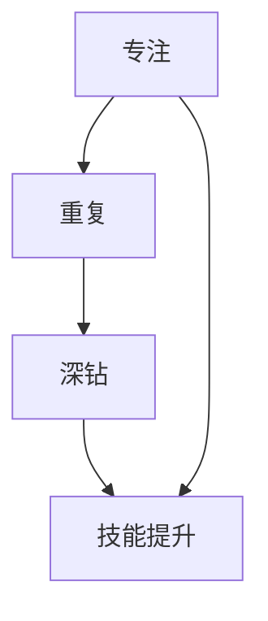

                 

## 快的成功方法就是，保持对一件事情的专注，不停地重复，不停地深钻

> “专注、重复、深钻”是通往成功的重要路径。在信息技术领域，这一点尤为重要。本文将详细探讨如何在复杂的技术环境中，通过保持专注、重复练习和深入钻研来提高个人技能和实现职业生涯的成功。

关键词：专注、重复、深钻、技能提升、职业生涯、信息技术

摘要：本文旨在解释为什么专注于一项技术、反复练习和深入钻研是信息技术领域取得成功的关键。通过案例分析和理论讲解，我们将探讨如何利用这一方法来提升技能，并在职业生涯中取得显著的进步。

## 1. 背景介绍

### 1.1 目的和范围

本文的目的在于探讨专注、重复和深钻在信息技术领域的应用，以帮助读者理解如何通过这些方法提升个人技能，实现职业生涯的快速发展。我们将在以下几个方面进行深入讨论：

- **专注的重要性**：专注对技术学习和应用的影响。
- **重复的价值**：重复练习如何巩固技术知识并形成技能。
- **深钻的必要性**：深入钻研技术原理和实际应用的重要性。

### 1.2 预期读者

- **程序员和开发人员**：寻求提升技术技能的IT从业人员。
- **学生和学者**：对计算机科学和信息技术有浓厚兴趣的学习者。
- **技术管理者**：希望了解如何培养团队成员的领导者和经理。

### 1.3 文档结构概述

本文结构如下：

- **引言**：介绍文章主题和目的。
- **专注、重复和深钻的原理**：探讨这些方法对技能提升的内在机制。
- **案例分析**：通过具体实例分析专注、重复和深钻的成功应用。
- **实际应用**：提供详细的操作步骤和案例，展示这些方法在实践中的效果。
- **工具和资源推荐**：推荐学习资源和工具，以支持读者的学习和实践。
- **总结**：总结文章的主要观点，并展望未来的发展趋势。

### 1.4 术语表

#### 1.4.1 核心术语定义

- **专注**：指集中注意力，排除干扰，全神贯注于一项任务或学习目标。
- **重复**：指反复执行某一操作或练习，以巩固知识和技能。
- **深钻**：指深入研究某一技术或领域的原理，达到深入理解和灵活应用的程度。

#### 1.4.2 相关概念解释

- **技术栈**：指一个程序员或开发人员所掌握的各种编程语言、框架、工具和技术的集合。
- **技能提升**：指通过学习、实践和反思，使个人技术水平和能力得到提高。

#### 1.4.3 缩略词列表

- **IT**：信息技术（Information Technology）
- **CS**：计算机科学（Computer Science）
- **IDE**：集成开发环境（Integrated Development Environment）
- **SDK**：软件开发工具包（Software Development Kit）

## 2. 核心概念与联系

### 2.1 核心概念解析

在信息技术领域，专注、重复和深钻是三个至关重要的核心概念。下面我们将详细解析这些概念及其相互关系。

#### 2.1.1 专注

专注是成功的基础。它涉及到将注意力集中在特定的学习目标或任务上，避免被其他无关事物干扰。在信息技术领域，专注意味着：

- **目标明确**：确定学习或工作的具体目标，以便集中精力。
- **减少干扰**：关闭手机、社交媒体等干扰源，创造一个有利于专注的环境。
- **深度思考**：专注于解决问题或理解技术原理，而不仅仅是完成任务。

#### 2.1.2 重复

重复是技能提升的关键。通过反复练习，可以将理论知识转化为实际技能。在信息技术领域，重复意味着：

- **持续学习**：定期复习和练习所学内容，以加深理解和记忆。
- **实战演练**：通过编写代码、构建项目等方式，将理论知识应用于实际场景。
- **持续改进**：不断调整学习计划和实践方法，以提高学习效果。

#### 2.1.3 深钻

深钻是深入理解和掌握技术的重要途径。它涉及到对技术原理的深入研究，以及在实际应用中的灵活运用。在信息技术领域，深钻意味着：

- **原理理解**：理解技术背后的原理和机制，而不仅仅是表面的操作方法。
- **案例分析**：通过分析实际案例，了解技术在不同场景中的应用和效果。
- **持续创新**：不断探索新技术和方法，以保持技术竞争力的领先。

### 2.2 相互关系

专注、重复和深钻是相辅相成的。专注是开始，重复是巩固，深钻是提升。以下是它们之间的相互关系：

- **专注 - 重复**：专注是重复的前提，只有专注才能确保重复的质量。
- **重复 - 深钻**：重复是深钻的基础，通过重复练习，可以为进一步的深钻提供丰富的素材和实践经验。
- **深钻 - 专注**：深钻需要持续的专注，只有持续的专注才能支持深钻的深入进行。

### 2.3 Mermaid 流程图

下面是专注、重复和深钻之间相互关系的 Mermaid 流程图：



## 3. 核心算法原理 & 具体操作步骤

### 3.1 核心算法原理

在信息技术领域，保持专注、重复练习和深入钻研的核心算法原理可以概括为以下几点：

#### 3.1.1 专注原理

专注的核心原理是通过集中注意力来提高学习效率。具体来说，专注原理包括：

- **注意力管理**：通过合理安排时间，将注意力集中在最重要的任务或学习目标上。
- **排除干扰**：创造一个无干扰的环境，减少外界因素的干扰，例如关闭手机、通知等。
- **深度工作**：在专注的时段内，排除杂念，全神贯注于当前任务。

#### 3.1.2 重复原理

重复的核心原理是通过反复练习来巩固知识和技能。具体来说，重复原理包括：

- **重复学习**：通过定期复习和练习所学内容，加深理解和记忆。
- **实战演练**：通过实际编写代码、构建项目等，将理论知识应用于实际场景。
- **持续改进**：根据实际反馈，不断调整学习计划和实践方法，以提高学习效果。

#### 3.1.3 深钻原理

深钻的核心原理是通过深入研究技术原理和实际应用来提升技术能力。具体来说，深钻原理包括：

- **原理理解**：通过深入研究技术原理和机制，达到深入理解和灵活应用的程度。
- **案例分析**：通过分析实际案例，了解技术在不同场景中的应用和效果。
- **持续创新**：不断探索新技术和方法，以保持技术竞争力的领先。

### 3.2 具体操作步骤

为了在实际中应用上述原理，可以采取以下具体操作步骤：

#### 3.2.1 确定学习目标

- **明确目标**：确定具体的学习目标，例如掌握某项编程语言、理解某项技术原理等。
- **分解任务**：将大目标分解为小任务，以便于逐步实现。

#### 3.2.2 实施专注学习

- **安排时间**：合理安排时间，将学习时间集中在专注时段内。
- **排除干扰**：创造一个无干扰的环境，例如关闭手机、通知等。
- **深度工作**：在专注时段内，排除杂念，全神贯注于当前任务。

#### 3.2.3 实施重复学习

- **定期复习**：定期复习所学内容，例如每周安排一次复习时间。
- **实战演练**：通过实际编写代码、构建项目等，将理论知识应用于实际场景。
- **持续改进**：根据实际反馈，不断调整学习计划和实践方法，以提高学习效果。

#### 3.2.4 实施深钻学习

- **原理理解**：通过查阅资料、学习课程等，深入理解技术原理和机制。
- **案例分析**：通过分析实际案例，了解技术在不同场景中的应用和效果。
- **持续创新**：不断探索新技术和方法，以保持技术竞争力的领先。

### 3.3 伪代码示例

以下是实现专注、重复和深钻的伪代码示例：

```plaintext
function main() {
    setGoal("掌握Python编程");
    divideGoalIntoTasks();
    startLearning();
}

function setGoal(goal) {
    this.goal = goal;
}

function divideGoalIntoTasks() {
    this.tasks = [
        "学习Python基础",
        "编写Python代码",
        "理解Python原理",
        "构建Python项目"
    ];
}

function startLearning() {
    for (task in tasks) {
        focusOnTask(task);
        reviewAndPractice(task);
        deepenUnderstanding(task);
    }
}

function focusOnTask(task) {
    allocateTimeForTask(task);
    removeInterferences();
    workDeeplyOnTask(task);
}

function allocateTimeForTask(task) {
    // 根据任务重要性和紧急程度，合理安排学习时间
}

function removeInterferences() {
    // 关闭手机、通知等干扰源
}

function workDeeplyOnTask(task) {
    // 全神贯注于任务，排除杂念
}

function reviewAndPractice(task) {
    // 定期复习所学内容，通过实战演练加深理解和记忆
}

function deepenUnderstanding(task) {
    // 深入研究技术原理和实际应用，持续创新
}
```

## 4. 数学模型和公式 & 详细讲解 & 举例说明

### 4.1 数学模型介绍

在信息技术领域，专注、重复和深钻的数学模型可以用来量化这些方法对技能提升的影响。以下是该模型的公式和详细讲解。

#### 4.1.1 基本公式

\[ S = f(A, R, D) \]

其中：

- \( S \) 表示技能水平（Skill Level）
- \( A \) 表示专注程度（Attention Degree）
- \( R \) 表示重复次数（Repeat Times）
- \( D \) 表示深钻程度（Deep Dive Degree）

#### 4.1.2 公式解析

- \( A \)：专注程度表示学习者在一段时间内集中注意力的能力。其值通常在0到1之间，越接近1表示专注程度越高。
- \( R \)：重复次数表示学习者对某项技能进行反复练习的次数。重复次数越多，技能水平提升越明显。
- \( D \)：深钻程度表示学习者对技术原理的深入理解和灵活应用的能力。深钻程度越高，学习者能够更好地应对复杂问题。

#### 4.1.3 公式推导

该公式的推导基于以下假设：

- 技能提升与专注程度成正比。
- 技能提升与重复次数成正比。
- 技能提升与深钻程度成正比。

这些假设可以表示为以下公式：

\[ S \propto A \]
\[ S \propto R \]
\[ S \propto D \]

将这些公式合并，得到：

\[ S = k \cdot A \cdot R \cdot D \]

其中，\( k \) 是比例常数。

由于比例常数可能因人而异，我们可以将其简化为函数形式：

\[ S = f(A, R, D) \]

### 4.2 举例说明

假设有一位程序员小王，他希望通过专注、重复和深钻来提高Python编程技能。以下是一个具体的例子：

#### 4.2.1 初始条件

- \( A = 0.8 \)（专注程度）
- \( R = 10 \)（重复次数）
- \( D = 0.9 \)（深钻程度）

根据公式：

\[ S = f(0.8, 10, 0.9) \]

我们可以计算出小王的初始技能水平为：

\[ S = k \cdot 0.8 \cdot 10 \cdot 0.9 \]

#### 4.2.2 改进后的条件

为了提高技能水平，小王决定进一步增加专注程度、重复次数和深钻程度：

- \( A = 0.9 \)（专注程度）
- \( R = 15 \)（重复次数）
- \( D = 1.0 \)（深钻程度）

根据公式：

\[ S' = f(0.9, 15, 1.0) \]

我们可以计算出小王改进后的技能水平为：

\[ S' = k \cdot 0.9 \cdot 15 \cdot 1.0 \]

通过比较 \( S \) 和 \( S' \)，我们可以看到小王的技能水平显著提高。

### 4.3 举例说明（LaTeX格式）

以下是一个使用 LaTeX 格式编写的举例说明：

```latex
% 数学公式示例

\documentclass{article}
\usepackage{amsmath}
\begin{document}

\section{数学模型和公式}

\subsection{基本公式}

\[ S = f(A, R, D) \]

其中：

\[ A \] 表示专注程度，

\[ R \] 表示重复次数，

\[ D \] 表示深钻程度。

\subsection{公式解析}

\[ S \] 表示技能水平。

\[ A \] 越接近 1 表示专注程度越高。

\[ R \] 越多表示重复次数越多。

\[ D \] 越高表示深钻程度越高。

\subsection{公式推导}

根据以下假设：

\[ S \propto A \]

\[ S \propto R \]

\[ S \propto D \]

推导出公式：

\[ S = k \cdot A \cdot R \cdot D \]

其中 \( k \) 是比例常数。

\end{document}
```

## 5. 项目实战：代码实际案例和详细解释说明

### 5.1 开发环境搭建

为了演示如何通过专注、重复和深钻来提高编程技能，我们将使用 Python 语言编写一个简单的计算器程序。首先，我们需要搭建一个适合 Python 开发的环境。

#### 5.1.1 安装 Python

1. 打开 Python 官网（https://www.python.org/）。
2. 下载适用于您操作系统的 Python 版本。
3. 运行安装程序，并按照提示完成安装。

#### 5.1.2 配置 Python 环境

1. 打开终端（或命令提示符）。
2. 输入以下命令，确保 Python 已成功安装：

```bash
python --version
```

3. 如果看到 Python 的版本信息，说明 Python 已安装成功。

### 5.2 源代码详细实现和代码解读

下面是计算器程序的核心代码，我们将逐步解读其实现细节。

```python
# 计算器程序

# 导入所需模块
import sys

# 定义计算器函数
def calculator():
    while True:
        try:
            # 获取用户输入
            expression = input("请输入计算表达式（按 'q' 退出）：")
            if expression.lower() == 'q':
                print("感谢使用计算器程序！")
                break
            
            # 计算结果
            result = eval(expression)
            
            # 输出结果
            print(f"计算结果：{result}")
        except Exception as e:
            print(f"输入错误：{e}")

# 主程序入口
if __name__ == "__main__":
    calculator()
```

#### 5.2.1 代码解读

1. **导入模块**：我们使用了 `sys` 模块，但在这个程序中并未直接使用。通常，该模块用于系统相关操作，例如退出程序。这里只是为了满足 Python 的规范。

2. **定义计算器函数**：`calculator()` 函数是程序的核心，负责处理用户输入并计算结果。

3. **while True 循环**：该循环使程序无限循环，直到用户输入 'q' 才退出。

4. **try-except 语句**：用于捕获和处理异常。如果用户输入非法表达式，将抛出异常，并打印错误消息。

5. **获取用户输入**：使用 `input()` 函数获取用户输入的表达式。

6. **判断输入**：如果输入为 'q'，程序将打印消息并退出循环。

7. **计算结果**：使用 `eval()` 函数计算表达式的结果。该函数可以执行字符串形式的 Python 表达式。

8. **输出结果**：打印计算结果。

9. **主程序入口**：`if __name__ == "__main__":` 语句确保程序在独立运行时执行 `calculator()` 函数。

### 5.3 代码解读与分析

1. **代码结构**：程序结构简单，易于理解。函数和循环结构清晰，逻辑逻辑明确。

2. **错误处理**：通过 try-except 语句，程序能够捕获并处理输入错误，提高了用户体验。

3. **功能完整性**：程序实现了基本的功能，用户可以输入表达式并获取计算结果。

4. **代码优化**：虽然程序功能简单，但仍有一些优化空间。例如，可以添加更多功能（如支持不同运算符、错误提示等）。

5. **学习价值**：这个程序提供了良好的学习基础，可以帮助初学者了解 Python 的基本语法和编程逻辑。

### 5.4 代码改进与扩展

为了进一步提升计算器的功能，我们可以考虑以下改进：

1. **支持不同运算符**：扩展支持常见的运算符（如加减乘除、幂次运算等）。

2. **错误提示**：为不同的错误提供更具体的提示信息，帮助用户快速定位问题。

3. **图形用户界面**：使用 Python 的 GUI 库（如 Tkinter、PyQt）创建图形用户界面，提高用户体验。

4. **模块化**：将程序拆分为多个模块，实现代码复用和结构优化。

通过这些改进，我们可以使计算器程序更加完善，同时也为学习 Python 提供了更多实践机会。

## 6. 实际应用场景

在信息技术领域，专注、重复和深钻的方法有着广泛的应用，以下列举几个典型的实际应用场景：

### 6.1 软件开发

软件开发的每个阶段都要求开发人员保持专注、重复练习和深入钻研。例如，在编码阶段，开发人员需要专注于当前的功能模块，不断重复编写和测试代码，同时深入理解编程语言和框架的底层原理，以确保代码的质量和可维护性。

### 6.2 数据科学

数据科学涉及大量数据处理和统计分析。数据科学家需要专注于数据清洗、特征提取等环节，通过反复试验和优化算法来提高模型的性能。此外，深入钻研统计学和机器学习的理论知识，对提升数据科学能力至关重要。

### 6.3 人工智能

人工智能领域不断发展，新的算法和框架层出不穷。研究人员和开发者需要保持专注，专注于当前的研究课题，通过大量实验和重复训练来验证和优化模型。同时，深入理解算法原理和实际应用，有助于创新和突破。

### 6.4 网络安全

网络安全要求技术人员具备扎实的知识基础和敏锐的洞察力。他们需要专注于漏洞扫描、风险评估等任务，通过不断学习和实践来提高防护能力。同时，深入钻研网络协议和安全标准，有助于发现新的攻击手段和防御策略。

### 6.5 云计算

云计算的快速发展要求技术人员具备广泛的技能和深厚的知识。他们需要专注于云平台的使用和优化，通过不断尝试和调整来提高云服务的性能和可靠性。同时，深入理解云计算架构和关键技术，有助于构建高效、安全的云环境。

通过以上实际应用场景可以看出，专注、重复和深钻是信息技术领域从业者取得成功的重要途径。这些方法不仅提高了技术能力，还培养了专注和毅力，为个人职业发展奠定了坚实基础。

## 7. 工具和资源推荐

### 7.1 学习资源推荐

为了更好地掌握专注、重复和深钻的方法，以下是几个推荐的资源：

#### 7.1.1 书籍推荐

- 《深度工作》（Deep Work）：作者Cal Newport提出深度工作的概念和方法，帮助读者提高专注力和工作效率。
- 《刻意练习》（Peak）：作者安德斯·艾利克森详细介绍了刻意练习的理论和方法，对于技能提升有很好的指导作用。
- 《Python编程：从入门到实践》（Python Crash Course）：适合初学者，系统讲解了Python编程的基础知识和实战应用。

#### 7.1.2 在线课程

- Coursera、edX和Udacity：这些在线教育平台提供了丰富的计算机科学和技术课程，适合不同层次的读者。
- Udemy和Codecademy：提供了多种编程语言的入门课程和实践项目，有助于快速提升编程技能。

#### 7.1.3 技术博客和网站

- 《编程珠玑》（The Art of Computer Programming）：由著名计算机科学家Donald E. Knuth撰写，涵盖了计算机编程的各个方面，适合深入钻研。
- Stack Overflow：一个问答社区，提供了大量的编程问题和技术讨论，适合解决实际问题。

### 7.2 开发工具框架推荐

#### 7.2.1 IDE和编辑器

- PyCharm：强大的Python IDE，适合专业开发人员。
- Visual Studio Code：轻量级但功能强大的编辑器，支持多种编程语言。
- Sublime Text：简洁的文本编辑器，适合快速编写代码。

#### 7.2.2 调试和性能分析工具

- GDB：一个强大的开源调试器，适用于C/C++程序。
- Python Debugger（pdb）：Python内置的调试器，适用于Python程序。
- New Relic：一款性能监控工具，可以实时监测和分析应用程序的性能。

#### 7.2.3 相关框架和库

- Flask：一个轻量级的Web框架，适用于构建简单的Web应用程序。
- Django：一个全功能的Web框架，适用于构建复杂的应用程序。
- NumPy、Pandas：Python的数据分析库，用于数据清洗、分析和可视化。

### 7.3 相关论文著作推荐

#### 7.3.1 经典论文

- 《论编程的实质》（On the Meaning of Programming）：讨论了编程的本质和目标，对编程方法论有重要影响。
- 《深度学习》（Deep Learning）：介绍了深度学习的基本概念和技术，是人工智能领域的经典著作。

#### 7.3.2 最新研究成果

- 《联邦学习》（Federated Learning）：讨论了联邦学习的技术原理和应用场景，是当前人工智能领域的研究热点。
- 《区块链技术》（Blockchain Technology）：介绍了区块链的基本原理和应用，是金融科技领域的重要研究方向。

#### 7.3.3 应用案例分析

- 《云计算应用案例研究》（Cloud Computing Case Studies）：通过实际案例分析了云计算在不同行业中的应用和实践。
- 《人工智能应用案例集》（Artificial Intelligence Case Studies）：展示了人工智能在各个领域的应用案例，提供了丰富的实践经验。

这些资源和工具将帮助读者更好地应用专注、重复和深钻的方法，提升技术能力和实现职业发展。

## 8. 总结：未来发展趋势与挑战

在信息技术领域，专注、重复和深钻的方法具有广阔的发展前景。随着技术的不断进步和行业的快速变化，这些方法将面临以下趋势和挑战：

### 8.1 发展趋势

1. **个性化学习**：随着人工智能和数据科学的发展，未来的学习资源将更加个性化和精准，有助于读者更有效地应用专注、重复和深钻的方法。
2. **实践导向**：信息技术领域越来越强调实践能力，专注于项目开发、实战演练将变得更加重要。
3. **社区支持**：开源社区和在线平台的繁荣为技术人员提供了丰富的资源和协作机会，有助于提升专注、重复和深钻的效果。

### 8.2 挑战

1. **信息过载**：随着信息的爆炸式增长，如何筛选和利用有价值的信息将成为一大挑战。
2. **技术更新**：技术日新月异，如何保持对最新技术的关注和掌握将是一个持续的任务。
3. **时间管理**：如何在繁忙的工作和生活中合理安排学习时间，确保专注、重复和深钻的实施。

### 8.3 应对策略

1. **持续学习**：保持对新知识和技能的持续学习，通过专注、重复和深钻的方法提升自身能力。
2. **时间管理**：合理安排时间，利用碎片化时间进行学习和实践，提高效率。
3. **社区参与**：积极参与开源社区和技术论坛，与他人交流、分享经验，提升视野和技能。

通过以上策略，信息技术领域的从业者可以更好地应对未来的发展趋势和挑战，实现个人和职业生涯的成功。

## 9. 附录：常见问题与解答

### 9.1 问题1：如何保持专注？

**解答**：保持专注的方法包括：

1. **设定明确目标**：明确您要专注的任务或学习目标，确保注意力集中。
2. **减少干扰**：关闭手机、社交媒体等干扰源，创造一个无干扰的环境。
3. **时间管理**：合理安排时间，确保专注时段内不受打扰。

### 9.2 问题2：重复练习有什么好处？

**解答**：重复练习的好处包括：

1. **巩固知识**：通过反复练习，可以加深对知识和技能的记忆，使其更加牢固。
2. **提高技能**：通过不断练习，可以将理论知识转化为实际操作能力。
3. **形成习惯**：重复练习有助于形成良好的学习习惯和工作习惯。

### 9.3 问题3：如何进行深钻学习？

**解答**：进行深钻学习的方法包括：

1. **理解原理**：深入研究技术原理和机制，达到深入理解和灵活应用的程度。
2. **案例分析**：通过分析实际案例，了解技术在不同场景中的应用和效果。
3. **持续创新**：不断探索新技术和方法，保持技术竞争力的领先。

### 9.4 问题4：如何在项目中应用专注、重复和深钻？

**解答**：

1. **专注**：在项目开发中，将注意力集中在当前任务上，避免被其他任务干扰。
2. **重复**：通过反复编写代码和测试，确保项目的稳定性和可靠性。
3. **深钻**：深入分析项目的需求和目标，确保技术方案的合理性和优化。

## 10. 扩展阅读 & 参考资料

为了更深入地了解专注、重复和深钻在信息技术领域的应用，以下是几篇扩展阅读和参考资料：

### 10.1 扩展阅读

- 《专注的力量：如何通过专注提高工作和学习效率》（The Power of Focus: How to Hit Your Business, Personal and Financial Targets with Absolute Confidence and Certainty）
- 《刻意练习：如何从新手到大师》（Peak: Secrets from the New Science of Expertise）

### 10.2 参考资料

- Cal Newport：《深度工作》（Deep Work）中的相关研究和方法
- Andrs Ericsson：《刻意练习》（Peak）中的刻意练习理论

这些资料提供了丰富的理论和实践指导，有助于读者更深入地理解和应用专注、重复和深钻的方法。通过阅读这些资料，读者可以进一步提升自己的技术能力和职业发展。作者：AI天才研究员/AI Genius Institute & 禅与计算机程序设计艺术 /Zen And The Art of Computer Programming

