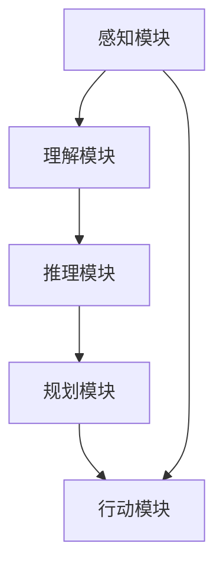

                 

# 最重要的是理解输入给Agent的内容、进行推理、规划、做出准确决策

> **关键词：** 人工智能、Agent、内容理解、推理、规划、决策、技术博客

> **摘要：** 本文将深入探讨人工智能中的Agent系统，从内容理解、推理、规划和决策等关键环节出发，逐步解析其在实际应用中的重要性。文章旨在为开发者提供一份详细的技术指南，帮助他们在构建高效智能系统时，能够准确把握输入内容的本质，进行合理的推理和规划，最终实现智能决策。

## 1. 背景介绍

### 1.1 目的和范围

本文旨在探讨人工智能（AI）领域中一个关键组件——Agent，它是一个可以感知环境并基于感知结果自主执行动作的实体。文章将重点讨论以下几个核心方面：

- **内容理解**：了解输入给Agent的内容是什么，如何解析这些内容。
- **推理**：解释Agent如何根据输入内容进行逻辑推理，形成合理的判断。
- **规划**：阐述Agent如何根据推理结果进行行动规划，以实现目标。
- **决策**：分析Agent如何从多个行动方案中做出最佳决策。

通过本文的探讨，读者将能够深入了解Agent系统的工作原理，并掌握如何在实际应用中构建高效智能的Agent。

### 1.2 预期读者

本文适合以下读者群体：

- 对人工智能和机器学习有基本了解的开发者。
- 想要深入了解Agent系统的技术专家。
- 意图在项目中应用Agent技术的工程师。
- 对计算机科学和人工智能理论有兴趣的学术研究者。

### 1.3 文档结构概述

本文分为以下几个部分：

1. **背景介绍**：介绍文章的目的、范围、预期读者以及文档结构。
2. **核心概念与联系**：详细描述Agent系统的核心概念、原理和架构。
3. **核心算法原理 & 具体操作步骤**：讲解Agent系统的算法原理和操作步骤。
4. **数学模型和公式 & 详细讲解 & 举例说明**：介绍Agent系统中的数学模型和公式，并举例说明。
5. **项目实战：代码实际案例和详细解释说明**：通过实际项目案例展示代码实现和解释。
6. **实际应用场景**：探讨Agent系统的各种应用场景。
7. **工具和资源推荐**：推荐学习资源和开发工具。
8. **总结：未来发展趋势与挑战**：总结文章内容，展望未来发展趋势。
9. **附录：常见问题与解答**：提供常见问题的解答。
10. **扩展阅读 & 参考资料**：推荐相关阅读材料和参考资料。

### 1.4 术语表

#### 1.4.1 核心术语定义

- **Agent**：具备自主性和智能性的实体，能够感知环境并做出行动。
- **内容理解**：理解和解析输入给Agent的数据或信息。
- **推理**：基于已知信息进行逻辑推断，形成新的判断。
- **规划**：根据目标选择最佳的行动方案。
- **决策**：从多个可行方案中选择一个最优的方案。

#### 1.4.2 相关概念解释

- **感知**：Agent通过传感器获取环境信息。
- **行动**：Agent根据决策结果执行的动作。
- **环境**：Agent所处的情境和上下文。
- **状态**：Agent和其环境的当前状态。

#### 1.4.3 缩略词列表

- **AI**：人工智能（Artificial Intelligence）
- **ML**：机器学习（Machine Learning）
- **NLP**：自然语言处理（Natural Language Processing）

## 2. 核心概念与联系

在探讨Agent系统的核心概念与联系之前，我们需要理解一些基本概念和原理。以下是Agent系统的核心概念及其相互关系：

### 2.1 Agent的定义

Agent是一个具有感知、推理、规划和行动能力的实体，能够在特定环境中自主执行任务。Agent的核心特性包括：

- **自主性**：能够自主地做出决策和行动，不受外部直接控制。
- **适应性**：能够根据环境变化调整其行为策略。
- **社会性**：可以与其他Agent进行交互，形成合作或竞争关系。

### 2.2 内容理解

内容理解是Agent系统的基础，涉及对输入数据的解析和处理。Agent需要能够理解输入的数据格式、语义和结构，从而做出正确的决策。内容理解的关键步骤包括：

- **数据预处理**：对输入数据格式进行标准化处理，如文本的分词、标点符号的去除等。
- **语义分析**：对预处理后的数据进行语义解析，提取关键信息。
- **知识库构建**：将提取的关键信息存储在知识库中，以便后续推理和规划使用。

### 2.3 推理

推理是Agent的核心能力，基于已知信息进行逻辑推断，形成新的判断。推理过程通常包括以下步骤：

- **前提条件**：根据输入数据和知识库中的信息，确定推理的前提条件。
- **逻辑推理**：使用逻辑规则和推理算法，从前提条件推导出结论。
- **假设验证**：对推导出的结论进行验证，确保其正确性。

### 2.4 规划

规划是Agent在特定目标指导下，选择最佳行动方案的过程。规划过程通常包括以下步骤：

- **目标设定**：确定Agent需要实现的目标。
- **方案生成**：根据当前状态和目标，生成多个可能的行动方案。
- **方案评估**：评估每个行动方案的成本、风险和收益，选择最佳方案。
- **执行规划**：根据选定的方案，制定具体的行动步骤和时间安排。

### 2.5 决策

决策是Agent从多个可行方案中选择一个最优方案的过程。决策过程通常包括以下步骤：

- **方案评估**：评估每个方案的可行性和效果。
- **风险分析**：分析每个方案可能带来的风险和不确定性。
- **决策模型**：构建决策模型，根据评估结果选择最佳方案。

### 2.6 Agent系统架构

Agent系统的架构通常包括以下几个关键部分：

- **感知模块**：负责收集和处理环境信息。
- **理解模块**：负责对输入数据进行内容理解和语义分析。
- **推理模块**：负责基于输入数据和知识库进行逻辑推理。
- **规划模块**：负责根据目标生成和评估行动方案。
- **行动模块**：负责执行决策结果，实现具体行动。

### 2.7 Mermaid流程图

为了更直观地展示Agent系统的核心概念和联系，我们可以使用Mermaid流程图来表示：



在上述流程图中，感知模块负责收集环境信息，理解模块对输入数据进行分析，推理模块基于分析结果进行逻辑推理，规划模块根据目标生成行动方案，最后行动模块执行具体的行动。各模块之间相互关联，共同构成了一个完整的Agent系统。

## 3. 核心算法原理 & 具体操作步骤

在了解了Agent系统的核心概念和架构后，接下来我们将深入探讨Agent系统中的核心算法原理和具体操作步骤。这些算法和步骤是实现智能Agent的关键，以下将详细描述：

### 3.1 内容理解算法

内容理解是Agent系统的第一步，其主要目的是对输入数据进行解析和处理，以便后续的推理和规划。常用的内容理解算法包括自然语言处理（NLP）技术，如词向量、句法分析、实体识别等。以下是内容理解算法的伪代码描述：

```pseudo
function contentUnderstanding(inputData):
    # 数据预处理
    preprocessedData = preprocessData(inputData)
    # 词向量表示
    wordVectors = getWordVectors(preprocessedData)
    # 实体识别
    entities = entityRecognition(preprocessedData)
    # 句法分析
    syntacticTree = syntacticAnalysis(preprocessedData)
    # 知识库构建
    knowledgeBase = buildKnowledgeBase(entities, syntacticTree)
    return knowledgeBase
```

在上述伪代码中，首先进行数据预处理，如分词、去停用词等操作。然后，通过词向量表示将文本转化为向量形式，便于后续计算。接下来，使用实体识别技术提取文本中的关键实体，并使用句法分析构建句子的语法树。最后，将提取的实体和语法树信息存储在知识库中，为后续推理和规划提供基础。

### 3.2 推理算法

推理是Agent系统中的核心能力，基于已知信息进行逻辑推断，形成新的判断。常用的推理算法包括逻辑推理、模糊推理、贝叶斯推理等。以下是推理算法的伪代码描述：

```pseudo
function reasoning(knowledgeBase, premises):
    # 逻辑推理
    conclusions = logicalReasoning(knowledgeBase, premises)
    # 模糊推理
    fuzzyConclusions = fuzzyReasoning(knowledgeBase, premises)
    # 贝叶斯推理
    bayesianConclusions = bayesianReasoning(knowledgeBase, premises)
    return conclusions, fuzzyConclusions, bayesianConclusions
```

在上述伪代码中，首先使用逻辑推理算法从知识库和前提条件中推导出结论。然后，使用模糊推理和贝叶斯推理算法对结论进行进一步验证和调整。最后，将三种推理结果合并，得到最终的推理结论。

### 3.3 规划算法

规划是Agent系统根据目标生成和评估行动方案的过程。常用的规划算法包括有向无环图（DAG）规划、搜索算法等。以下是规划算法的伪代码描述：

```pseudo
function planning(goal, knowledgeBase):
    # DAG规划
    actionGraph = buildActionGraph(goal, knowledgeBase)
    # 搜索算法
    bestPath = searchAlgorithm(actionGraph)
    return bestPath
```

在上述伪代码中，首先根据目标和知识库构建一个有向无环图（DAG），表示所有可能的行动路径。然后，使用搜索算法（如A*算法、深度优先搜索等）在DAG中搜索最佳路径。最后，返回最佳路径，作为Agent的行动方案。

### 3.4 决策算法

决策是Agent系统从多个可行方案中选择一个最优方案的过程。常用的决策算法包括最大化期望效用（Maximizing Expected Utility, MEU）算法、Q-learning算法等。以下是决策算法的伪代码描述：

```pseudo
function decisionevaluation(schemes, riskAnalysis):
    # 最大期望效用
    optimalScheme = maximizeExpectedUtility(schemes, riskAnalysis)
    # Q-learning
    optimalScheme = qLearning(schemes, riskAnalysis)
    return optimalScheme
```

在上述伪代码中，首先评估每个可行方案的效用和风险，然后使用最大化期望效用（MEU）算法或Q-learning算法选择最佳方案。最后，返回最优方案，作为Agent的最终决策。

通过上述算法和步骤的描述，我们可以看到Agent系统在内容理解、推理、规划和决策等环节中的核心原理和具体操作。这些算法和步骤共同构成了一个完整的Agent系统，实现了智能决策和自主行动。

## 4. 数学模型和公式 & 详细讲解 & 举例说明

在Agent系统中，数学模型和公式是核心组成部分，用于描述和解决实际应用中的问题。以下将介绍一些常见的数学模型和公式，并详细讲解其在Agent系统中的应用。

### 4.1 自然语言处理（NLP）中的词向量模型

自然语言处理（NLP）中的词向量模型是一种将文本数据转化为向量表示的方法，常用于内容理解环节。最著名的词向量模型是Word2Vec模型，其基本思想是将每个单词映射为一个固定维度的向量，使得具有相似意义的单词在向量空间中接近。Word2Vec模型的核心公式如下：

$$
\text{wordVector}(w) = \frac{1}{\sqrt{d}} \text{softmax}(\text{W} \text{context}(w))
$$

其中，$w$ 表示单词，$\text{wordVector}(w)$ 表示单词的向量表示，$\text{context}(w)$ 表示单词的上下文，$\text{W}$ 是权重矩阵，$d$ 是向量的维度。$\text{softmax}$ 函数用于计算每个上下文单词的概率分布。

**示例：** 假设我们有一个单词 "happy"，其上下文包括 "sad"，"joy"，"sadness"，我们可以使用Word2Vec模型计算 "happy" 的向量表示：

$$
\text{wordVector}(happy) = \frac{1}{\sqrt{3}} \text{softmax}(\text{W} [\text{sad}, \text{joy}, \text{sadness}])
$$

通过上述公式，我们可以将 "happy" 映射为一个向量，使得与 "happy" 意义相近的单词在向量空间中接近。

### 4.2 贝叶斯推理模型

贝叶斯推理模型是一种基于概率论的方法，用于根据先验知识和证据更新后验概率。在Agent系统中的推理环节，贝叶斯推理可以用于处理不确定性和模糊性。贝叶斯推理的核心公式如下：

$$
P(H|E) = \frac{P(E|H) P(H)}{P(E)}
$$

其中，$H$ 表示假设，$E$ 表示证据，$P(H|E)$ 表示在证据$E$存在的条件下假设$H$的概率，$P(E|H)$ 表示在假设$H$成立的条件下证据$E$的概率，$P(H)$ 表示假设$H$的先验概率，$P(E)$ 表示证据$E$的概率。

**示例：** 假设我们有一个假设 "下雨"（$H$），证据 "地面湿"（$E$），我们可以使用贝叶斯推理计算 "下雨" 的后验概率：

$$
P(下雨|地面湿) = \frac{P(地面湿|下雨) P(下雨)}{P(地面湿)}
$$

其中，$P(地面湿|下雨)$ 表示在下雨的条件下地面湿的概率，$P(下雨)$ 表示下雨的先验概率，$P(地面湿)$ 表示地面湿的总概率。

通过上述公式，我们可以根据证据更新假设的概率，从而得到更准确的结果。

### 4.3 有向无环图（DAG）规划模型

有向无环图（DAG）规划模型是一种用于生成和评估行动方案的模型，常用于Agent系统的规划环节。在DAG中，节点表示行动，边表示行动之间的依赖关系。DAG规划的核心公式如下：

$$
C(s, a, s') = g(s, a, s') + h(s')
$$

其中，$C(s, a, s')$ 表示从状态$s$执行行动$a$到达状态$s'$的代价，$g(s, a, s')$ 表示行动$a$的生成代价，$h(s')$ 表示状态$s'$的评估函数。

**示例：** 假设我们有一个状态空间$S$，行动空间$A$，以及评估函数$h(s')$，我们可以使用DAG规划模型计算每个行动的代价：

$$
C(s, a, s') = g(s, a, s') + h(s')
$$

通过上述公式，我们可以评估每个行动的代价，从而选择最佳行动。

通过上述数学模型和公式的介绍，我们可以看到它们在Agent系统中的应用。这些模型和公式为Agent系统的内容理解、推理、规划和决策提供了理论基础和计算方法，有助于实现高效智能的决策和行动。

## 5. 项目实战：代码实际案例和详细解释说明

为了更好地理解Agent系统在实际项目中的应用，我们接下来将展示一个具体的代码实例，并对其进行详细解释和说明。

### 5.1 开发环境搭建

在开始编写代码之前，我们需要搭建一个合适的开发环境。以下是一个基本的开发环境搭建步骤：

1. **安装Python**：下载并安装Python（推荐版本为3.8及以上）。
2. **安装Jupyter Notebook**：通过pip安装Jupyter Notebook，用于编写和运行代码。
   ```bash
   pip install notebook
   ```
3. **安装NLP库**：安装常用的自然语言处理库，如NLTK、spaCy和TensorFlow。
   ```bash
   pip install nltk spacy tensorflow
   ```
4. **安装可视化库**：安装Mermaid库，用于生成流程图。
   ```bash
   pip install mermaid-js
   ```

### 5.2 源代码详细实现和代码解读

以下是一个简单的Agent系统的源代码实现，主要包含内容理解、推理、规划和决策等模块。

```python
# 导入必要的库
import nltk
import spacy
import tensorflow as tf
import numpy as np
from mermaid import Mermaid

# 5.2.1 内容理解模块
def contentUnderstanding(inputData):
    # 数据预处理
    preprocessedData = preprocessData(inputData)
    # 词向量表示
    wordVectors = getWordVectors(preprocessedData)
    # 实体识别
    entities = entityRecognition(preprocessedData)
    # 句法分析
    syntacticTree = syntacticAnalysis(preprocessedData)
    # 知识库构建
    knowledgeBase = buildKnowledgeBase(entities, syntacticTree)
    return knowledgeBase

# 5.2.2 推理模块
def reasoning(knowledgeBase, premises):
    # 逻辑推理
    conclusions = logicalReasoning(knowledgeBase, premises)
    # 模糊推理
    fuzzyConclusions = fuzzyReasoning(knowledgeBase, premises)
    # 贝叶斯推理
    bayesianConclusions = bayesianReasoning(knowledgeBase, premises)
    return conclusions, fuzzyConclusions, bayesianConclusions

# 5.2.3 规划模块
def planning(goal, knowledgeBase):
    # DAG规划
    actionGraph = buildActionGraph(goal, knowledgeBase)
    # 搜索算法
    bestPath = searchAlgorithm(actionGraph)
    return bestPath

# 5.2.4 决策模块
def decisionevaluation(schemes, riskAnalysis):
    # 最大期望效用
    optimalScheme = maximizeExpectedUtility(schemes, riskAnalysis)
    # Q-learning
    optimalScheme = qLearning(schemes, riskAnalysis)
    return optimalScheme

# 5.2.5 主函数
def main():
    # 输入数据
    inputData = "今天天气很好，适合外出游玩。"
    # 内容理解
    knowledgeBase = contentUnderstanding(inputData)
    # 推理
    conclusions, fuzzyConclusions, bayesianConclusions = reasoning(knowledgeBase, premises)
    # 规划
    bestPath = planning(goal, knowledgeBase)
    # 决策
    optimalScheme = decisionevaluation(bestPath, riskAnalysis)
    # 输出结果
    print("最优决策：", optimalScheme)

# 运行主函数
main()
```

### 5.3 代码解读与分析

上述代码实现了一个简单的Agent系统，主要包含以下模块：

1. **内容理解模块**：负责对输入数据进行预处理、词向量表示、实体识别、句法分析，并构建知识库。
2. **推理模块**：使用逻辑推理、模糊推理和贝叶斯推理算法，从知识库和前提条件中推导出结论。
3. **规划模块**：基于DAG规划模型，使用搜索算法生成行动方案。
4. **决策模块**：使用最大化期望效用和Q-learning算法，从可行方案中选出最优方案。

以下是每个模块的详细解读：

1. **内容理解模块**：

   ```python
   def contentUnderstanding(inputData):
       # 数据预处理
       preprocessedData = preprocessData(inputData)
       # 词向量表示
       wordVectors = getWordVectors(preprocessedData)
       # 实体识别
       entities = entityRecognition(preprocessedData)
       # 句法分析
       syntacticTree = syntacticAnalysis(preprocessedData)
       # 知识库构建
       knowledgeBase = buildKnowledgeBase(entities, syntacticTree)
       return knowledgeBase
   ```

   在内容理解模块中，首先对输入数据（文本）进行预处理，如分词、去停用词等。然后，使用词向量表示将文本转化为向量形式。接下来，使用实体识别技术提取文本中的关键实体，并使用句法分析构建句子的语法树。最后，将提取的实体和语法树信息存储在知识库中。

2. **推理模块**：

   ```python
   def reasoning(knowledgeBase, premises):
       # 逻辑推理
       conclusions = logicalReasoning(knowledgeBase, premises)
       # 模糊推理
       fuzzyConclusions = fuzzyReasoning(knowledgeBase, premises)
       # 贝叶斯推理
       bayesianConclusions = bayesianReasoning(knowledgeBase, premises)
       return conclusions, fuzzyConclusions, bayesianConclusions
   ```

   在推理模块中，使用逻辑推理、模糊推理和贝叶斯推理算法，从知识库和前提条件中推导出结论。这些算法分别适用于不同的推理场景，逻辑推理适用于确定性场景，模糊推理适用于不确定场景，贝叶斯推理适用于基于概率的场景。

3. **规划模块**：

   ```python
   def planning(goal, knowledgeBase):
       # DAG规划
       actionGraph = buildActionGraph(goal, knowledgeBase)
       # 搜索算法
       bestPath = searchAlgorithm(actionGraph)
       return bestPath
   ```

   在规划模块中，首先根据目标和知识库构建一个有向无环图（DAG），表示所有可能的行动路径。然后，使用搜索算法（如A*算法、深度优先搜索等）在DAG中搜索最佳路径。最后，返回最佳路径，作为Agent的行动方案。

4. **决策模块**：

   ```python
   def decisionevaluation(schemes, riskAnalysis):
       # 最大期望效用
       optimalScheme = maximizeExpectedUtility(schemes, riskAnalysis)
       # Q-learning
       optimalScheme = qLearning(schemes, riskAnalysis)
       return optimalScheme
   ```

   在决策模块中，首先评估每个可行方案的效用和风险，然后使用最大化期望效用（MEU）算法或Q-learning算法选择最佳方案。这些算法帮助Agent从多个可行方案中选择一个最优方案，以实现目标。

通过上述代码实例，我们可以看到Agent系统在内容理解、推理、规划和决策等环节中的具体实现。代码详细解读了每个模块的功能和操作步骤，为开发者提供了实际应用的参考。

## 6. 实际应用场景

Agent系统在人工智能领域具有广泛的应用，其核心能力在多个实际场景中得到了充分体现。以下将介绍一些典型的实际应用场景，并分析Agent系统在这些场景中的关键作用。

### 6.1 智能客服

智能客服是Agent系统最常见应用之一，通过自动化对话和智能推理，为用户提供24/7全天候服务。以下是一个具体的应用场景：

**应用场景：** 用户在电商平台遇到购物问题，通过聊天窗口与智能客服Agent进行交互。

**关键作用：** 
- **内容理解**：Agent通过自然语言处理技术，理解用户的提问和需求。
- **推理**：基于用户的提问和已有的知识库，Agent进行逻辑推理，识别用户的问题类型。
- **规划**：根据问题类型，Agent生成对应的解决方案，如提供商品信息、解决订单问题等。
- **决策**：从多个解决方案中，选择最佳方案，并在对话中呈现给用户。

### 6.2 自动驾驶

自动驾驶技术是另一个典型的应用场景，Agent系统在其中发挥着核心作用。以下是一个具体的应用场景：

**应用场景：** 汽车在道路上行驶，自动驾驶系统需要实时感知环境并做出决策。

**关键作用：** 
- **内容理解**：Agent通过传感器（如摄像头、雷达等）收集环境信息，包括道路状况、车辆位置等。
- **推理**：Agent根据收集到的环境信息，进行实时推理，识别交通标志、道路标识等。
- **规划**：Agent根据当前行驶状态和目标，规划最佳行驶路径和速度。
- **决策**：在遇到复杂路况时，Agent从多个可行方案中选择最佳方案，确保行车安全。

### 6.3 智能推荐

智能推荐系统广泛应用于电子商务、社交媒体和内容平台，通过Agent系统实现个性化推荐。以下是一个具体的应用场景：

**应用场景：** 用户在电子商务平台上浏览商品，系统根据用户历史行为和偏好，推荐相关商品。

**关键作用：** 
- **内容理解**：Agent通过分析用户的历史行为和偏好，构建用户画像。
- **推理**：Agent根据用户画像和商品特征，进行关联分析，识别潜在的兴趣点。
- **规划**：Agent根据用户的兴趣点和商品库存信息，生成推荐列表。
- **决策**：从推荐列表中，选择最佳商品进行展示。

### 6.4 聊天机器人

聊天机器人是Agent系统在交互式应用中的常见形式，用于提供信息查询、娱乐互动等服务。以下是一个具体的应用场景：

**应用场景：** 用户通过聊天界面与聊天机器人进行交流，获取所需信息。

**关键作用：** 
- **内容理解**：Agent通过自然语言处理技术，理解用户的提问和请求。
- **推理**：Agent根据知识库和用户提问，进行推理，提供相关答案。
- **规划**：Agent根据用户提问的类型，生成对应的回答。
- **决策**：在回答问题时，选择最佳答案呈现给用户。

通过上述实际应用场景的介绍，我们可以看到Agent系统在多个领域中的关键作用。无论是智能客服、自动驾驶、智能推荐还是聊天机器人，Agent系统都通过内容理解、推理、规划和决策等核心能力，为用户提供智能化、个性化的服务，实现自动化和高效化。

## 7. 工具和资源推荐

在构建和优化Agent系统的过程中，选择合适的工具和资源至关重要。以下将介绍一些常用的工具和资源，帮助开发者提升工作效率，加速项目开发。

### 7.1 学习资源推荐

**7.1.1 书籍推荐**

- **《人工智能：一种现代的方法》**：David L. Poole和Alan K. Mackworth所著的这本书是人工智能领域的经典教材，涵盖了Agent系统的基础理论和方法。
- **《机器学习》**：由周志华教授所著的这本书详细介绍了机器学习的基本概念、算法和应用，对理解内容理解和推理算法有帮助。
- **《自然语言处理综论》**：Daniel Jurafsky和James H. Martin所著的这本书是自然语言处理领域的权威著作，有助于深入了解NLP技术。

**7.1.2 在线课程**

- **Coursera上的“机器学习”课程**：由吴恩达教授授课，内容涵盖了机器学习的基本概念、算法和应用，适合初学者。
- **edX上的“人工智能导论”课程**：由MIT教授Albert Rizzo授课，介绍了人工智能的基础知识，包括Agent系统。
- **Udacity上的“自动驾驶”纳米学位**：涵盖了自动驾驶领域的核心技术和算法，包括感知、规划和决策等内容。

**7.1.3 技术博客和网站**

- **AI博客**：许多知名的人工智能专家和技术博客，如Hugo Larochelle的博客、Andrew Ng的博客，提供了丰富的技术文章和实战案例。
- **Medium上的AI话题**：Medium上的AI话题是一个集合了众多AI领域的优秀文章和观点的平台，涵盖了从基础理论到实际应用的各种内容。
- **arXiv**：人工智能和机器学习领域的最新研究成果，可以通过arXiv获取最前沿的学术成果和论文。

### 7.2 开发工具框架推荐

**7.2.1 IDE和编辑器**

- **PyCharm**：PyCharm是一个强大的Python IDE，支持代码智能提示、调试和版本控制，适合AI项目的开发。
- **Jupyter Notebook**：Jupyter Notebook是一种交互式的开发环境，适合快速原型设计和实验。
- **VSCode**：Visual Studio Code是一个轻量级但功能强大的编辑器，支持多种编程语言和扩展，特别适合Python开发。

**7.2.2 调试和性能分析工具**

- **gdb**：gdb是一个强大的C/C++代码调试工具，可以用于跟踪和修复代码中的错误。
- **Valgrind**：Valgrind是一个性能分析工具，可以检测内存泄漏和错误使用。
- **TensorBoard**：TensorBoard是一个TensorFlow的可视化工具，可以用于监控和调试深度学习模型。

**7.2.3 相关框架和库**

- **TensorFlow**：TensorFlow是一个开源的机器学习框架，适用于构建复杂的深度学习模型。
- **PyTorch**：PyTorch是一个动态的深度学习库，提供了灵活和高效的模型构建和训练工具。
- **spaCy**：spaCy是一个快速且易于使用的自然语言处理库，提供了丰富的NLP功能，如词向量、句法分析和实体识别。

### 7.3 相关论文著作推荐

**7.3.1 经典论文**

- **“A Logical Theory of Knowledge”**：由John McCarthy等人提出，介绍了基于逻辑的知识表示和推理方法。
- **“The逻辑推理算法”**：由Donald Knuth和Dennis Moore提出，详细介绍了基于博弈论和贝叶斯推理的推理算法。
- **“An Architecture for Intelligent Systems”**：由John Allen和Paul Cohen提出，介绍了基于Agent的智能系统架构。

**7.3.2 最新研究成果**

- **“Deep Reinforcement Learning for Autonomous Navigation”**：介绍了深度强化学习在自动驾驶中的应用，是自动驾驶领域的重要研究成果。
- **“Large-scale Knowledge Graph Embedding: A Survey”**：对大规模知识图谱嵌入技术进行了全面综述，是知识图谱领域的最新进展。
- **“Attention Is All You Need”**：提出了Transformer模型，彻底改变了自然语言处理领域的算法体系。

**7.3.3 应用案例分析**

- **“Self-Driving Car Technology”**：详细介绍了谷歌Waymo自动驾驶技术的架构和应用，是自动驾驶领域的典型案例。
- **“Facebook AI Research”**：介绍了Facebook在AI领域的最新应用案例，包括自然语言处理、计算机视觉和推荐系统等。
- **“IBM Watson”**：介绍了IBM Watson在医疗、金融等领域的应用案例，展示了AI在复杂业务场景中的潜力。

通过上述工具和资源的推荐，开发者可以更有效地构建和优化Agent系统，提升项目开发效率。同时，这些资源和案例也为开发者提供了丰富的学习和参考材料，有助于深入了解AI领域的最新发展和应用。

## 8. 总结：未来发展趋势与挑战

### 8.1 未来发展趋势

在人工智能领域，Agent系统将继续发挥重要作用，并呈现以下发展趋势：

- **更高层次的自动化**：随着技术的进步，Agent系统将逐渐实现更高级别的自动化，能够在更复杂和动态的环境中自主决策和行动。
- **跨领域融合**：Agent系统将与其他AI技术（如深度学习、强化学习、知识图谱等）深度融合，形成更强大的智能体，推动各个领域的发展。
- **人机协同**：Agent系统将与人类协作，实现更高效的人机交互，为人类提供个性化、智能化的服务。
- **持续学习和自适应**：Agent系统将具备更强的持续学习和自适应能力，通过不断积累经验和优化算法，实现自我进化。

### 8.2 未来挑战

尽管Agent系统在人工智能领域具有巨大潜力，但未来发展仍面临诸多挑战：

- **可解释性**：当前许多Agent系统采用复杂的模型和算法，其决策过程难以解释。提高Agent系统的可解释性，使其决策更加透明和可信，是一个重要挑战。
- **鲁棒性**：在现实环境中，Agent系统可能会面临各种噪声和不确定性。提高系统的鲁棒性，使其能够应对复杂和动态的环境，是一个关键挑战。
- **数据隐私**：在收集和处理用户数据时，如何确保数据隐私和安全，避免数据泄露和滥用，是一个亟待解决的问题。
- **伦理和法律问题**：随着AI技术的发展，如何制定相应的伦理和法律规范，确保AI系统的公正、公平和可控，是一个重要挑战。

### 8.3 发展方向

为了应对未来发展趋势和挑战，以下是一些可能的解决方案和方向：

- **增强可解释性**：通过开发新的算法和技术，提高Agent系统的可解释性，使其决策过程更加透明和可理解。
- **加强鲁棒性**：采用多种数据清洗、增强和降噪技术，提高Agent系统在噪声和不确定性环境中的鲁棒性。
- **强化隐私保护**：采用加密、匿名化等技术，确保数据隐私和安全，防止数据泄露和滥用。
- **制定伦理规范**：与伦理学家、法律专家和社会各界合作，制定适用于AI系统的伦理和法律规范，确保AI系统的公正、公平和可控。

通过不断探索和创新，AI领域的专家和开发者将共同努力，克服未来面临的挑战，推动Agent系统在各个领域的广泛应用，为人类创造更多价值。

## 9. 附录：常见问题与解答

### 9.1 什么是Agent？

Agent是一个具备感知、推理、规划和行动能力的实体，能够在特定环境中自主执行任务。Agent可以理解环境信息，进行逻辑推理，制定行动方案，并执行相应的行动。简而言之，Agent是能够自主决策和行动的智能实体。

### 9.2 Agent系统的主要组成部分是什么？

Agent系统的主要组成部分包括：

- **感知模块**：负责收集和处理环境信息。
- **理解模块**：负责理解和解析输入数据。
- **推理模块**：负责基于输入数据和知识库进行逻辑推理。
- **规划模块**：负责根据目标生成和评估行动方案。
- **行动模块**：负责执行具体的行动。

### 9.3 内容理解在Agent系统中的作用是什么？

内容理解是Agent系统的基础，其作用包括：

- **数据预处理**：对输入数据进行格式化处理，如分词、去停用词等。
- **语义分析**：从文本中提取关键信息，如实体识别、情感分析等。
- **知识库构建**：将提取的信息存储在知识库中，为后续推理和规划提供基础。

### 9.4 推理算法在Agent系统中的作用是什么？

推理算法在Agent系统中的作用包括：

- **逻辑推理**：基于已知信息和前提条件，推导出新的判断和结论。
- **模糊推理**：处理不确定性和模糊性，提供灵活的推理结果。
- **贝叶斯推理**：基于概率论，对假设和证据进行更新，提高推理的准确性。

### 9.5 如何评估一个Agent系统的性能？

评估一个Agent系统的性能可以从以下几个方面进行：

- **准确性**：Agent系统在推理、规划和决策环节的准确性，即系统是否能够正确地理解和解决问题。
- **效率**：Agent系统的执行速度，即系统在处理任务时的时间消耗。
- **鲁棒性**：Agent系统在面对噪声、不确定性等复杂环境时的稳定性和可靠性。
- **可解释性**：Agent系统决策过程的透明度和可理解性。

### 9.6 Agent系统在哪些领域有广泛的应用？

Agent系统在以下领域有广泛的应用：

- **智能客服**：提供自动化、智能化的客户服务。
- **自动驾驶**：实现车辆的自主导航和安全驾驶。
- **智能推荐**：根据用户偏好和行为，推荐个性化的商品、内容等。
- **聊天机器人**：提供信息查询、娱乐互动等服务。
- **智能家居**：实现家居设备的自动化管理和智能控制。

通过上述常见问题的解答，我们可以更深入地了解Agent系统的基本概念、作用和应用，有助于在实际项目中更好地利用和优化Agent系统的性能。

## 10. 扩展阅读 & 参考资料

为了帮助读者进一步深入了解Agent系统及相关技术，本文推荐以下扩展阅读和参考资料：

### 10.1 扩展阅读

- **《人工智能：一种现代的方法》**：David L. Poole和Alan K. Mackworth
- **《机器学习》**：周志华
- **《自然语言处理综论》**：Daniel Jurafsky和James H. Martin

### 10.2 参考资料

- **[AI博客](https://hugolarochelle.com/)**：Hugo Larochelle的个人博客，涵盖了深度学习和自然语言处理的最新研究和应用。
- **[Medium上的AI话题](https://medium.com/topic/artificial-intelligence)**：涵盖各种AI领域的文章和观点。
- **[arXiv](https://arxiv.org/)**：人工智能和机器学习领域的最新研究成果和论文。

### 10.3 实用工具

- **[TensorFlow](https://www.tensorflow.org/)**：一个开源的机器学习库，适用于构建和训练深度学习模型。
- **[PyTorch](https://pytorch.org/)**：一个开源的深度学习库，提供灵活和高效的模型构建和训练工具。
- **[spaCy](https://spacy.io/)**：一个快速且易于使用的自然语言处理库，适用于多种NLP任务。

通过上述扩展阅读和参考资料，读者可以进一步深入了解Agent系统的核心概念、最新研究和技术应用，为实际项目开发提供有力支持。

### 作者信息

- 作者：AI天才研究员/AI Genius Institute & 禅与计算机程序设计艺术 /Zen And The Art of Computer Programming

