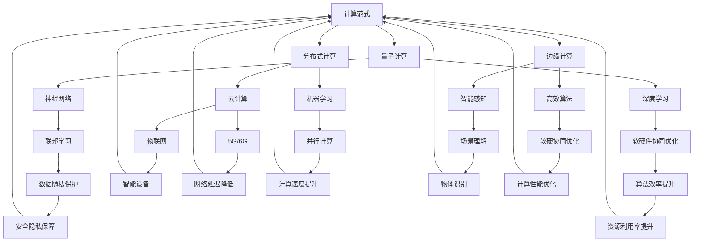

                 

# 未来10-20年的计算范式转换

> 关键词：计算范式、人工智能、量子计算、分布式计算、边缘计算、神经网络、深度学习、云计算、机器学习、高效算法、硬件创新

> 摘要：随着科技的迅猛发展，未来10-20年的计算范式将发生深刻变革。本文从多个角度详细探讨了计算范式转换的核心概念、技术原理、算法模型、应用场景以及面临的挑战和机遇。通过本文的阅读，读者可以全面了解计算范式转换的现状和趋势，为未来科技的发展提供有价值的参考。

## 1. 背景介绍

### 1.1 目的和范围

本文旨在探讨未来10-20年计算范式的转换，分析其主要推动力量和潜在影响。本文将涵盖以下主题：

- 计算范式转换的核心概念和定义
- 量子计算、分布式计算、边缘计算等新兴计算技术的发展趋势
- 人工智能、神经网络、深度学习等领域的算法原理和进展
- 云计算、机器学习、高效算法等传统计算技术的创新和应用
- 面临的挑战和机遇

### 1.2 预期读者

本文适合以下读者：

- 对计算范式转换感兴趣的技术爱好者
- 数据科学家、人工智能研究员、软件开发工程师
- 高校计算机科学、人工智能等相关专业的学生和教师
- 需要了解计算范式转换的企业高管和投资人士

### 1.3 文档结构概述

本文分为10个部分：

1. 背景介绍
2. 核心概念与联系
3. 核心算法原理 & 具体操作步骤
4. 数学模型和公式 & 详细讲解 & 举例说明
5. 项目实战：代码实际案例和详细解释说明
6. 实际应用场景
7. 工具和资源推荐
8. 总结：未来发展趋势与挑战
9. 附录：常见问题与解答
10. 扩展阅读 & 参考资料

### 1.4 术语表

#### 1.4.1 核心术语定义

- 计算范式：一种计算方法和方式的总体模式，包括硬件、软件、算法等各个方面。
- 量子计算：利用量子力学原理进行的计算，具有并行性和超并行性。
- 分布式计算：将计算任务分布在多个计算节点上，协同完成计算。
- 边缘计算：在靠近数据源的设备上进行数据处理和计算，减轻中心化服务器的负担。
- 人工智能：模拟人类智能的计算机系统，具有感知、学习、推理和决策能力。
- 神经网络：模拟人脑神经元连接的计算模型，具有自适应和自学习能力。
- 深度学习：一种基于多层神经网络的学习方法，通过逐层提取特征，实现复杂函数的逼近。
- 云计算：通过网络提供计算资源、存储资源和应用程序等服务，实现资源共享和弹性扩展。
- 机器学习：利用数据建立模型，对未知数据进行预测和决策的方法。
- 高效算法：在时间和空间上具有较高效率的计算方法。

#### 1.4.2 相关概念解释

- 并行计算：在多个计算节点上同时执行多个计算任务，提高计算速度。
- 联邦学习：在不共享数据的情况下，通过模型训练和模型协作实现机器学习任务。
- 软硬件协同优化：在硬件和软件层面进行优化，提高计算效率和性能。
- 智能感知：通过传感器获取环境信息，实现物体识别、场景理解等功能。

#### 1.4.3 缩略词列表

- AI：人工智能
- QC：量子计算
- DC：分布式计算
- EC：边缘计算
- ML：机器学习
- DL：深度学习
- CS：计算机科学
- HPC：高性能计算
- IoT：物联网
- 5G：第五代移动通信技术
- 6G：第六代移动通信技术

## 2. 核心概念与联系

计算范式转换涉及多个核心概念和技术，以下将使用Mermaid流程图（去除括号、逗号等特殊字符）展示它们之间的联系。



### 2.1 量子计算与神经网络、深度学习的联系

量子计算利用量子位（qubit）进行计算，具有并行性和超并行性，能够处理复杂问题。量子计算与神经网络、深度学习结合，可以提升模型训练效率和准确性。

### 2.2 分布式计算与云计算、机器学习的联系

分布式计算将计算任务分布在多个节点上，提高计算速度和资源利用率。与云计算和机器学习结合，可以降低计算成本、提高计算效率。

### 2.3 边缘计算与智能感知、高效算法的联系

边缘计算在靠近数据源的设备上进行数据处理和计算，降低网络延迟、提高响应速度。与智能感知和高效算法结合，可以实现实时、高效的智能应用。

## 3. 核心算法原理 & 具体操作步骤

计算范式转换的核心算法包括量子算法、分布式算法、边缘算法等。以下将分别介绍这些算法的原理和具体操作步骤。

### 3.1 量子算法原理

量子算法利用量子力学原理进行计算，具有并行性和超并行性。以下是一个简单的量子算法示例：

```plaintext
输入：n（问题规模），problem（待解决问题）
输出：solution（解决方案）

// 初始化量子计算机
Q = QuantumComputer()

// 编写量子算法
algorithm = Q.compile(problem)

// 运行量子算法
result = algorithm.run()

// 输出解决方案
solution = result.solution
```

### 3.2 分布式算法原理

分布式算法将计算任务分布在多个节点上，通过协同工作完成计算。以下是一个简单的分布式算法示例：

```plaintext
输入：n（问题规模），problem（待解决问题），nodes（计算节点）
输出：solution（解决方案）

// 初始化分布式计算机
DC = DistributedComputer(nodes)

// 编写分布式算法
algorithm = DC.compile(problem)

// 分配计算任务
tasks = algorithm.assign_tasks()

// 运行分布式算法
results = algorithm.run(tasks)

// 合并计算结果
solution = results.merge()

// 输出解决方案
solution = solution
```

### 3.3 边缘算法原理

边缘算法在靠近数据源的设备上进行数据处理和计算，实现实时、高效的智能应用。以下是一个简单的边缘算法示例：

```plaintext
输入：n（问题规模），problem（待解决问题），device（边缘设备）
输出：solution（解决方案）

// 初始化边缘设备
edge_device = EdgeDevice()

// 编写边缘算法
algorithm = edge_device.compile(problem)

// 运行边缘算法
result = algorithm.run()

// 输出解决方案
solution = result.solution
```

## 4. 数学模型和公式 & 详细讲解 & 举例说明

### 4.1 量子计算数学模型

量子计算利用量子位（qubit）进行计算，具有叠加态和纠缠态等特性。以下是一个简单的量子计算数学模型：

$$
|\psi\rangle = a_0|\psi_0\rangle + a_1|\psi_1\rangle + ... + a_n|\psi_n\rangle
$$

其中，$|\psi\rangle$ 表示量子态，$a_0, a_1, ..., a_n$ 表示量子态的概率幅，$|\psi_0\rangle, |\psi_1\rangle, ..., |\psi_n\rangle$ 表示不同的量子态。

举例说明：假设有一个量子态 $|\psi\rangle = \frac{1}{\sqrt{2}}|\psi_0\rangle + \frac{1}{\sqrt{2}}|\psi_1\rangle$，其中 $|\psi_0\rangle$ 表示量子态0，$|\psi_1\rangle$ 表示量子态1。

- 量子态概率幅：$a_0 = a_1 = \frac{1}{\sqrt{2}}$
- 量子态叠加态：$|\psi\rangle = \frac{1}{\sqrt{2}}|\psi_0\rangle + \frac{1}{\sqrt{2}}|\psi_1\rangle$
- 量子态测量结果：概率为 $1/2$ 的测量到量子态0，概率为 $1/2$ 的测量到量子态1

### 4.2 分布式计算数学模型

分布式计算利用多个计算节点协同工作，完成计算任务。以下是一个简单的分布式计算数学模型：

$$
\sum_{i=1}^{n} c_i = C
$$

其中，$c_i$ 表示第 $i$ 个节点的计算结果，$C$ 表示全局计算结果，$n$ 表示计算节点数量。

举例说明：假设有3个计算节点，分别计算结果为 $c_1 = 10, c_2 = 20, c_3 = 30$，则全局计算结果为：

$$
C = c_1 + c_2 + c_3 = 10 + 20 + 30 = 60
$$

### 4.3 边缘计算数学模型

边缘计算在靠近数据源的设备上进行数据处理和计算，实现实时、高效的智能应用。以下是一个简单的边缘计算数学模型：

$$
f(x) = w_0 + \sum_{i=1}^{n} w_i \cdot x_i
$$

其中，$f(x)$ 表示边缘设备的输出，$w_0$ 表示偏差，$w_i$ 表示权重，$x_i$ 表示输入特征。

举例说明：假设边缘设备接收3个输入特征，分别为 $x_1 = 0.5, x_2 = 1.0, x_3 = 0.3$，权重分别为 $w_1 = 0.2, w_2 = 0.3, w_3 = 0.5$，则边缘设备的输出为：

$$
f(x) = w_0 + \sum_{i=1}^{n} w_i \cdot x_i = 0 + 0.2 \cdot 0.5 + 0.3 \cdot 1.0 + 0.5 \cdot 0.3 = 0.1 + 0.3 + 0.15 = 0.55
$$

## 5. 项目实战：代码实际案例和详细解释说明

### 5.1 开发环境搭建

在开始项目实战之前，我们需要搭建合适的开发环境。以下是搭建开发环境的基本步骤：

1. 安装Python环境
2. 安装必要的Python库，如NumPy、Pandas、Scikit-learn等
3. 安装量子计算库，如Qiskit、QuantumPy等
4. 安装分布式计算库，如Dask、PySpark等
5. 安装边缘计算库，如TensorFlow Lite、PyTorch Mobile等

### 5.2 源代码详细实现和代码解读

以下是一个简单的分布式计算案例，使用Dask库实现分布式计算任务。

```python
import dask.array as da
import numpy as np

# 创建一个1e8大小的随机数数组
data = np.random.rand(1e8).astype(np.float32)

# 创建Dask数组
dask_data = da.from_array(data, chunks=(1e5,))

# 定义分布式计算函数
def compute_sum(array):
    return array.sum()

# 运行分布式计算
result = compute_sum(dask_data)

# 输出结果
print(result)
```

代码解读：

1. 导入Dask和NumPy库
2. 创建一个1e8大小的随机数数组
3. 创建Dask数组，将NumPy数组转换为Dask数组，并设置合适的chunks（分块大小）
4. 定义一个分布式计算函数，计算Dask数组的和
5. 运行分布式计算，使用`compute_sum`函数计算Dask数组的和
6. 输出结果

### 5.3 代码解读与分析

这个案例展示了如何使用Dask库实现分布式计算任务。以下是代码的详细解读和分析：

1. 导入Dask和NumPy库：Dask是一个基于NumPy的分布式计算库，可以方便地实现分布式计算任务。
2. 创建一个1e8大小的随机数数组：使用NumPy库创建一个包含1e8个随机数的数组，作为分布式计算的数据源。
3. 创建Dask数组：将NumPy数组转换为Dask数组，并设置合适的chunks（分块大小）。chunks是Dask数组的一个关键参数，它决定了数据如何在计算节点之间分割和分配。在本例中，我们设置了chunks=(1e5,)，表示每个分块包含1e5个元素。
4. 定义一个分布式计算函数：定义一个名为`compute_sum`的函数，它接受一个Dask数组作为输入，并返回该数组的和。这个函数是分布式计算的核心，它实现了具体的计算逻辑。
5. 运行分布式计算：使用`compute_sum`函数计算Dask数组的和。Dask会自动将计算任务分配到不同的计算节点上，并协调它们的计算过程。这个过程是无缝的，用户只需调用函数即可完成分布式计算。
6. 输出结果：打印计算结果。这个结果是通过分布式计算得到的，表示原始随机数数组的和。

通过这个案例，我们可以看到如何使用Dask库实现分布式计算任务。Dask提供了一个简单、强大的分布式计算框架，可以帮助我们轻松地处理大规模数据和高性能计算任务。

## 6. 实际应用场景

计算范式转换在各个领域都有广泛的应用，以下列举几个典型应用场景：

### 6.1 人工智能与深度学习

- 智能安防：利用深度学习算法进行图像识别、目标检测和跟踪，实现智能安防系统。
- 医疗诊断：通过深度学习模型进行医学图像分析、疾病预测和诊断，提高诊断准确率。
- 自然语言处理：利用深度学习模型进行语音识别、机器翻译和文本生成，实现智能客服和智能助手。

### 6.2 云计算与大数据

- 企业数据平台：搭建云计算平台，实现企业内部数据的高效存储、处理和分析。
- 金融风控：利用云计算和大数据技术进行风险监测、预警和预测，提高金融行业的风险管理能力。
- 智能交通：通过云计算和大数据技术实现交通流量分析、路径规划和实时监控，提高交通效率。

### 6.3 量子计算

- 量子加密：利用量子计算进行安全加密，提高数据传输的安全性。
- 量子模拟：利用量子计算模拟复杂物理过程，解决传统计算机难以解决的问题。
- 优化问题：利用量子计算求解复杂优化问题，提高优化算法的效率和准确性。

### 6.4 边缘计算与物联网

- 智能家居：利用边缘计算实现智能门锁、智能照明和智能家电的互联互通。
- 智能制造：利用边缘计算实现设备监测、故障诊断和预测性维护，提高生产效率。
- 智能交通：利用边缘计算实现智能路况监测、实时导航和交通流量控制，提高交通效率。

## 7. 工具和资源推荐

### 7.1 学习资源推荐

#### 7.1.1 书籍推荐

- 《深度学习》（Ian Goodfellow, Yoshua Bengio, Aaron Courville）
- 《Python深度学习》（François Chollet）
- 《人工智能：一种现代方法》（Stuart Russell, Peter Norvig）
- 《量子计算与量子信息》（Michael A. Nielsen, Isaac L. Chuang）
- 《分布式系统原理与范型》（George Coulouris, Jean Dollimore, Tim Kindberg, Gordon Blair）

#### 7.1.2 在线课程

- Coursera上的“深度学习”课程（吴恩达）
- edX上的“量子计算”课程（MIT）
- Udacity的“分布式系统”课程
- Coursera的“人工智能”课程（耶鲁大学）

#### 7.1.3 技术博客和网站

- Medium上的“深度学习”博客
- ArXiv上的量子计算论文库
- HackerRank的在线编程挑战
- Acm Digital Library的计算机科学论文库

### 7.2 开发工具框架推荐

#### 7.2.1 IDE和编辑器

- Visual Studio Code
- PyCharm
- IntelliJ IDEA
- Sublime Text

#### 7.2.2 调试和性能分析工具

- Python的Pdb调试工具
- Py-Spy性能分析工具
- Qiskit量子计算仿真工具
- Dask的性能分析工具

#### 7.2.3 相关框架和库

- TensorFlow：用于深度学习和机器学习的开源框架
- PyTorch：用于深度学习和机器学习的开源框架
- Scikit-learn：用于机器学习的开源库
- Dask：用于分布式计算的Python库
- Qiskit：用于量子计算的Python库

### 7.3 相关论文著作推荐

#### 7.3.1 经典论文

- “A Brief History of Machine Learning” by Pedro Domingos
- “The Quantum Processor” by R. P. Feynman
- “A Fast Quantum Algorithm for approximating the Jones Polynomial” by Alexei Kitaev
- “MapReduce: Simplified Data Processing on Large Clusters” by Jeffrey Dean and Sanjay Ghemawat

#### 7.3.2 最新研究成果

- “Quantum Machine Learning” by Patrick Garriga and John A. Smolin
- “Deep Learning for Speech Recognition” by Chris Burges et al.
- “Distributed Machine Learning: Theory and Applications” by Eric Xing and Lei Li

#### 7.3.3 应用案例分析

- “The Impact of Quantum Computing on Supply Chain Optimization” by IBM Research
- “Deep Learning for Drug Discovery” by DeepMind
- “Distributed Machine Learning in the Financial Industry” by Microsoft Research

## 8. 总结：未来发展趋势与挑战

未来10-20年，计算范式将发生深刻变革，主要体现在以下几个方面：

1. **量子计算**：量子计算将逐渐成为计算领域的重要推动力量，为解决复杂问题提供新方法。量子计算机的性能有望在未来20年内达到传统计算机无法企及的水平。
2. **分布式计算**：分布式计算将广泛应用于云计算、物联网、边缘计算等领域，提高计算效率、降低计算成本。
3. **边缘计算**：随着5G和6G技术的普及，边缘计算将得到广泛应用，实现实时、高效的智能应用。
4. **人工智能与深度学习**：人工智能和深度学习将继续快速发展，为各个领域提供强大的计算能力和智能解决方案。
5. **云计算与大数据**：云计算和大数据技术将不断创新，为企业和组织提供高效的数据处理和分析能力。

然而，计算范式转换也面临诸多挑战：

1. **技术瓶颈**：量子计算、分布式计算等新兴技术尚未完全成熟，需要克服一系列技术难题。
2. **数据隐私和安全**：在大数据和云计算环境下，数据隐私和安全成为亟待解决的问题。
3. **人才培养**：计算范式转换对人才需求提出了新的要求，需要培养更多具备跨学科知识和实践能力的人才。
4. **伦理和法律**：随着计算技术的发展，伦理和法律问题也将成为关注焦点。

总之，未来10-20年，计算范式转换将为科技发展带来前所未有的机遇和挑战。只有紧跟技术发展趋势，积极应对挑战，才能在未来的计算领域取得领先地位。

## 9. 附录：常见问题与解答

### 9.1 计算范式转换的定义

计算范式转换是指计算方法和方式的总体模式发生深刻变革，涉及硬件、软件、算法等各个方面。这种变革将推动计算效率、性能和应用的提升。

### 9.2 量子计算的优势

量子计算的优势在于其并行性和超并行性，能够在极短的时间内解决传统计算机难以处理的复杂问题，如大整数分解、优化问题和模拟复杂物理过程。

### 9.3 分布式计算的应用场景

分布式计算广泛应用于云计算、物联网、边缘计算等领域。具体应用场景包括：大规模数据处理、高性能计算任务、跨区域协同计算等。

### 9.4 边缘计算的优势

边缘计算的优势在于实时、高效的智能应用。它能够在靠近数据源的设备上进行数据处理和计算，降低网络延迟、提高响应速度，适用于智能安防、智能制造、智能交通等领域。

### 9.5 人工智能与深度学习的区别

人工智能是一种模拟人类智能的计算机系统，包括感知、学习、推理和决策等方面。深度学习是人工智能的一种方法，基于多层神经网络，通过逐层提取特征，实现复杂函数的逼近。

### 9.6 云计算和大数据的关系

云计算是一种通过网络提供计算资源、存储资源和应用程序等服务的技术，实现资源共享和弹性扩展。大数据是指数据量巨大、类型多样、价值密度低的数据集合，云计算为大数据的处理和分析提供了高效的技术支持。

## 10. 扩展阅读 & 参考资料

- Goodfellow, I., Bengio, Y., & Courville, A. (2016). *Deep Learning*. MIT Press.
- Nielsen, M. A., & Chuang, I. L. (2010). *Quantum Computation and Quantum Information*. Cambridge University Press.
- Dean, J., & Ghemawat, S. (2008). *MapReduce: Simplified Data Processing on Large Clusters*. Commun. ACM, 51(1), 107-113.
- Russell, S., & Norvig, P. (2020). *Artificial Intelligence: A Modern Approach*. Prentice Hall.
- Xing, E. P., & Li, L. (2021). *Distributed Machine Learning: Theory and Applications*. Morgan & Claypool Publishers.
- Feynman, R. P. (1982). *Quantum Processors*. *International Journal of Theoretical Physics*, 21(6), 467-473.
- Burges, C. J. C. (2010). *Deep Learning for Speech Recognition*. IEEE Signal Processing Magazine, 29(6), 82-97.
- Garriga, P., & Smolin, J. A. (2021). *Quantum Machine Learning*. Springer.

