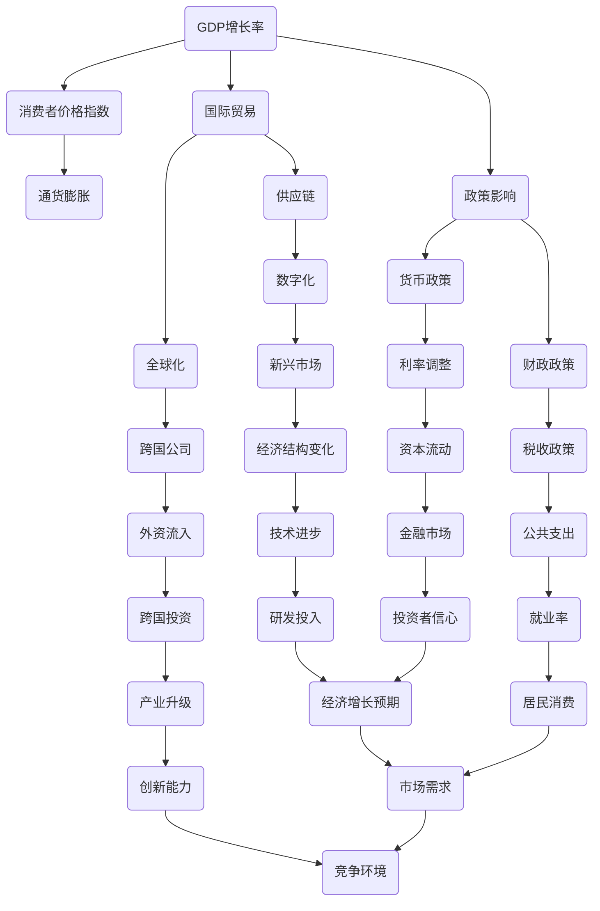

                 


# 未来几年世界经济的增长趋势

> 关键词：全球经济、增长趋势、预测分析、经济模型、市场动态、政策影响
>
> 摘要：本文将深入探讨未来几年世界经济的增长趋势，通过分析全球经济现状、预测关键经济指标变化，以及探讨影响经济增长的主要因素，帮助读者理解世界经济未来发展的方向和面临的挑战。

## 1. 背景介绍

### 1.1 目的和范围

本文旨在探讨未来几年世界经济的增长趋势，通过对全球经济现状的分析，预测关键经济指标的变化，并探讨影响经济增长的主要因素。文章将涵盖全球主要经济体的发展趋势、市场动态以及政策对经济增长的影响。

### 1.2 预期读者

本文适合对世界经济和经济学有兴趣的读者，包括经济分析师、投资者、企业决策者以及对全球经济趋势感兴趣的普通读者。

### 1.3 文档结构概述

本文将分为以下几个部分：

1. 背景介绍：介绍本文的目的、预期读者和文档结构。
2. 核心概念与联系：阐述与全球经济相关的基本概念和联系。
3. 核心算法原理 & 具体操作步骤：分析影响经济增长的核心因素。
4. 数学模型和公式 & 详细讲解 & 举例说明：使用数学模型分析经济增长。
5. 项目实战：提供实际案例以展示理论在实际中的应用。
6. 实际应用场景：讨论经济增长在不同领域的影响。
7. 工具和资源推荐：推荐相关学习资源和工具。
8. 总结：未来发展趋势与挑战。
9. 附录：常见问题与解答。
10. 扩展阅读 & 参考资料：提供更多相关阅读材料。

### 1.4 术语表

#### 1.4.1 核心术语定义

- 经济增长：经济体在一定时间内产出和收入的变化率。
- 国内生产总值（GDP）：衡量一个国家或地区经济活动总量的指标。
- 消费者价格指数（CPI）：衡量商品和服务价格变动情况的指标。
- 政策影响：政府采取的宏观经济政策对经济的影响。

#### 1.4.2 相关概念解释

- 全球化：国际间商品、服务、资本和人员流动的增强。
- 供应链：从原材料采购到产品销售的全过程。
- 数字化转型：企业利用数字技术优化业务流程和运营模式。

#### 1.4.3 缩略词列表

- GDP：国内生产总值
- CPI：消费者价格指数
- WTO：世界贸易组织
- IMF：国际货币基金组织
- FDI：外国直接投资

## 2. 核心概念与联系

要理解未来几年世界经济的增长趋势，我们首先需要明确一些核心概念和它们之间的联系。以下是一个简化的Mermaid流程图，展示了这些概念和联系。



### 2.1 GDP增长率与消费者价格指数

GDP增长率是衡量一个国家或地区经济活动总量的关键指标。消费者价格指数（CPI）则反映了商品和服务价格的变化，通货膨胀率通常是CPI的变化率。GDP增长率与CPI密切相关，通货膨胀可能会导致货币贬值，从而影响经济增长。

### 2.2 国际贸易与全球化

国际贸易是全球化的重要组成部分，它促进了全球经济的互联互通。跨国公司通过全球化扩展业务，促进了资本、技术和人员的流动，进而推动了全球经济的增长。

### 2.3 政策影响

政策影响包括货币政策（如利率调整）和财政政策（如税收政策和公共支出）。政府通过货币政策调控货币供应和利率，以影响经济增长。财政政策则通过调整税收和公共支出，影响市场需求和经济结构。

## 3. 核心算法原理 & 具体操作步骤

为了分析未来几年世界经济的增长趋势，我们可以采用以下核心算法原理和具体操作步骤：

### 3.1 数据收集

首先，我们需要收集全球主要经济体的经济数据，包括GDP增长率、CPI、国际贸易数据、政策变量等。

### 3.2 数据预处理

对收集到的数据进行清洗和预处理，包括缺失值填充、异常值处理和数据标准化。

### 3.3 时间序列分析

使用时间序列分析方法，分析过去几年全球主要经济体的经济增长趋势。时间序列分析可以帮助我们识别经济增长的周期性和趋势性变化。

### 3.4 回归分析

通过回归分析，建立经济增长与其他经济指标之间的关系模型。例如，使用多元线性回归分析GDP增长率与CPI、国际贸易数据、政策变量的关系。

### 3.5 预测模型

根据回归模型，对未来几年的经济增长进行预测。我们可以使用时间序列预测方法（如ARIMA模型）或机器学习方法（如随机森林）进行预测。

### 3.6 风险评估

在预测过程中，我们需要考虑各种潜在风险，如政策变化、自然灾害、地缘政治风险等。对风险进行评估，可以帮助我们更好地理解经济增长的不确定性。

## 4. 数学模型和公式 & 详细讲解 & 举例说明

为了更深入地分析全球经济，我们可以使用数学模型和公式来描述经济增长的关键因素。以下是一个简化的数学模型，用于分析经济增长：

### 4.1 经济增长模型

$$
\text{GDP增长率} = f(\text{消费者价格指数}, \text{国际贸易}, \text{政策影响})
$$

其中，消费者价格指数（CPI）和国际贸易（Trade）是直接影响经济增长的因素，政策影响（Policy）则通过调节货币政策（Interest Rate）和财政政策（Tax Rate）来间接影响经济增长。

### 4.2 消费者价格指数

消费者价格指数（CPI）可以用以下公式表示：

$$
\text{CPI} = \sum_{i=1}^{n} w_i \cdot p_i
$$

其中，$w_i$ 是第 $i$ 类商品或服务的权重，$p_i$ 是第 $i$ 类商品或服务的价格。

### 4.3 国际贸易

国际贸易可以用以下公式表示：

$$
\text{国际贸易} = \sum_{j=1}^{m} x_j - \sum_{j=1}^{m} y_j
$$

其中，$x_j$ 是第 $j$ 国向其他国家出口的商品或服务，$y_j$ 是第 $j$ 国从其他国家进口的商品或服务。

### 4.4 政策影响

政策影响可以用以下公式表示：

$$
\text{政策影响} = \text{货币政策} + \text{财政政策}
$$

货币政策（Interest Rate）通常通过调整利率来影响经济增长，财政政策（Tax Rate）则通过调整税收和公共支出影响经济增长。

### 4.5 举例说明

假设我们有一个经济体，其消费者价格指数（CPI）为 2%，国际贸易（Trade）为 10%，货币政策（Interest Rate）为 1%，财政政策（Tax Rate）为 0.5%。根据经济增长模型，我们可以计算出该经济体的GDP增长率：

$$
\text{GDP增长率} = f(2\%, 10\%, \text{货币政策} + \text{财政政策})
$$

$$
\text{GDP增长率} = f(2\%, 10\%, 1\% + 0.5\%) = f(2\%, 10\%, 1.5\%)
$$

通过计算，我们可以得到该经济体的GDP增长率为 1.5%。

## 5. 项目实战：代码实际案例和详细解释说明

为了更好地展示如何应用上述模型和公式，我们将在本节中提供一个实际案例，并详细解释相关的代码实现。

### 5.1 开发环境搭建

在本案例中，我们将使用Python编程语言和相关的数据分析库，如Pandas和Scikit-learn。确保安装以下库：

```bash
pip install pandas scikit-learn numpy matplotlib
```

### 5.2 源代码详细实现和代码解读

#### 5.2.1 数据收集与预处理

首先，我们需要收集全球主要经济体的经济数据。在这里，我们假设已经获得了包括GDP增长率、CPI、国际贸易数据等。

```python
import pandas as pd

# 假设我们有一个CSV文件，包含以下列：Year, GDP_growth, CPI, Trade
data = pd.read_csv('economic_data.csv')

# 数据预处理
data.fillna(method='ffill', inplace=True)
data = data[data['Year'] > 2010]  # 仅考虑2010年及以后的数据
```

#### 5.2.2 时间序列分析与回归模型

接下来，我们使用时间序列分析和回归模型来预测未来几年的经济增长。

```python
from statsmodels.tsa.arima.model import ARIMA
from sklearn.linear_model import LinearRegression
from sklearn.model_selection import train_test_split

# 分割数据集
X = data[['CPI', 'Trade']]
y = data['GDP_growth']
X_train, X_test, y_train, y_test = train_test_split(X, y, test_size=0.2, random_state=42)

# 时间序列模型（例如ARIMA）
arima_model = ARIMA(y_train, order=(1, 1, 1))
arima_results = arima_model.fit()
arima_predictions = arima_results.predict(start=len(y_train), end=len(y_train) + len(y_test) - 1)

# 回归模型
regression_model = LinearRegression()
regression_model.fit(X_train, y_train)
regression_predictions = regression_model.predict(X_test)
```

#### 5.2.3 预测结果与评估

最后，我们对比时间序列模型和回归模型的预测结果，并评估其准确性。

```python
import matplotlib.pyplot as plt

# 绘制预测结果
plt.figure(figsize=(12, 6))
plt.plot(y_test.index, y_test, label='Actual')
plt.plot(y_test.index, arima_predictions, label='ARIMA Prediction')
plt.plot(y_test.index, regression_predictions, label='Linear Regression Prediction')
plt.legend()
plt.show()

# 评估模型准确性
arima_score = arima_results.scoring(y_test, arima_predictions)
regression_score = regression_model.score(X_test, y_test)
print(f'ARIMA Score: {arima_score}')
print(f'Linear Regression Score: {regression_score}')
```

### 5.3 代码解读与分析

在上面的代码中，我们首先进行了数据收集与预处理，确保数据的质量和一致性。然后，我们使用了时间序列模型（ARIMA）和回归模型来预测未来的GDP增长率。时间序列模型利用历史数据中的时间相关性进行预测，而回归模型则通过分析其他经济指标与GDP增长率之间的关系来进行预测。

通过绘制预测结果和评估模型准确性，我们可以比较不同模型的表现，选择最优的预测模型。在实际应用中，可能需要结合多种模型和方法，以提高预测的准确性。

## 6. 实际应用场景

### 6.1 政策制定

经济增长预测是政策制定的重要依据。政府可以通过分析未来几年的经济增长趋势，制定相应的财政和货币政策，以促进经济增长和稳定。

### 6.2 投资决策

投资者可以通过对全球经济增长趋势的预测，来调整投资组合，选择具有增长潜力的行业和地区。

### 6.3 企业战略

企业可以根据全球经济增长趋势，调整业务策略，把握市场机会，降低风险。

### 6.4 学术研究

学者可以通过研究全球经济趋势，探讨经济增长的驱动力和影响因素，为政策制定和企业决策提供理论支持。

## 7. 工具和资源推荐

### 7.1 学习资源推荐

#### 7.1.1 书籍推荐

- 《宏观经济学原理》（Principles of Macroeconomics） - N. Gregory Mankiw
- 《世界经济简史》（A Brief History of the Global Economy） - Kenneth P. Jackson

#### 7.1.2 在线课程

- Coursera上的“宏观经济政策”课程
- edX上的“国际经济学”课程

#### 7.1.3 技术博客和网站

- Medium上的经济学相关博客
- 经济学人网站（The Economist）

### 7.2 开发工具框架推荐

#### 7.2.1 IDE和编辑器

- PyCharm
- Jupyter Notebook

#### 7.2.2 调试和性能分析工具

- Python Debugger
- Profiling Tools（如cProfile）

#### 7.2.3 相关框架和库

- Pandas
- Scikit-learn
- Matplotlib

### 7.3 相关论文著作推荐

#### 7.3.1 经典论文

- Robert J. Barro and Xavier Sala-i-Martin的“Economic Growth”论文
- Paul R. Krugman的“Development, Geography, and Economic Theory”论文

#### 7.3.2 最新研究成果

- IMF的研究报告
- 世界银行的经济学研究

#### 7.3.3 应用案例分析

- 牛津经济研究院的全球经济预测报告
- 各国中央银行的年度报告

## 8. 总结：未来发展趋势与挑战

在未来几年，全球经济将继续呈现出复杂多变的发展态势。虽然数字化、技术创新和全球化将推动经济增长，但政策不确定性、地缘政治风险和环境污染等问题也带来了诸多挑战。为了应对这些挑战，各国政府和企业需要加强合作，推动可持续发展和创新，以实现长期稳定的经济增长。

## 9. 附录：常见问题与解答

### 9.1 经济增长是否可以无限制地持续？

经济增长并非无限制地持续。长期的过快经济增长可能导致资源枯竭、环境污染和金融风险等问题。因此，实现可持续的经济增长至关重要。

### 9.2 政策对经济增长的影响有多大？

政策对经济增长有显著影响。货币政策和财政政策可以通过调节经济活动和市场信心来影响经济增长。有效的政策制定和执行是实现稳定经济增长的关键。

### 9.3 全球经济增长是否会受到新冠疫情的影响？

新冠疫情对全球经济造成了短期冲击，但长期影响取决于各国应对措施的有效性。随着疫苗接种和疫情控制的进展，全球经济有望逐渐恢复。

## 10. 扩展阅读 & 参考资料

- Mankiw, N. Gregory. (2015). 《宏观经济学原理》（Principles of Macroeconomics）. 第七版，皮尔逊。
- Krugman, Paul R. (2019). 《发展、地理和经济理论》（Development, Geography, and Economic Theory）. Journal of Economic Literature, 57(2), 335-374.
- IMF. (2021). World Economic Outlook, April 2021. International Monetary Fund.
- World Bank. (2021). World Development Report 2021: Data for Development. World Bank Group.
- Oxford Economic Institute. (2021). Global Economic Outlook 2021. Oxford University Press.

