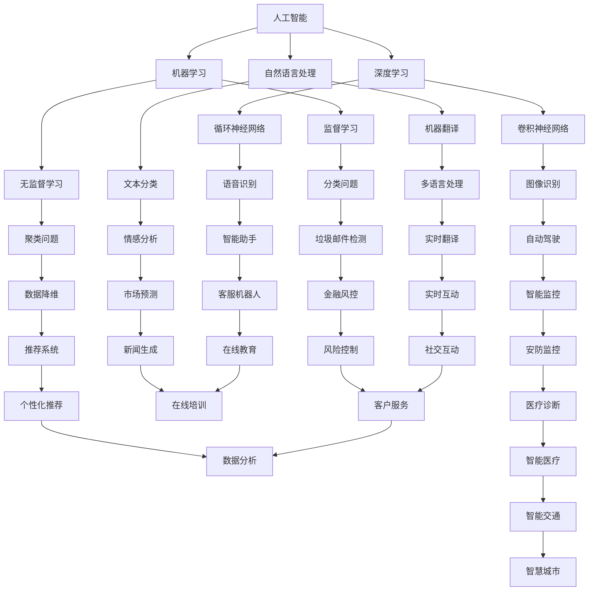

                 

# 未来工作形态与AI共存的趋势

> 关键词：人工智能，未来工作，职场发展，技术趋势，职业转型，人类与AI协作

> 摘要：本文将探讨人工智能在职场中的角色和影响，分析未来工作形态的变化趋势，阐述人类与AI共存的工作环境，并给出相应的职业转型建议。文章将分为背景介绍、核心概念与联系、核心算法原理、数学模型和公式、项目实战、实际应用场景、工具和资源推荐、总结及扩展阅读等部分，旨在为广大IT从业者和职场人士提供有价值的参考。

## 1. 背景介绍

### 1.1 目的和范围

本文旨在探讨人工智能（AI）对职场的影响，分析未来工作形态的变化趋势，探讨人类与AI共存的可能性，并提供相应的职业转型建议。文章将围绕以下几个核心问题展开：

- 人工智能如何改变我们的工作方式？
- 人类与AI如何实现高效协作？
- 未来工作形态将呈现哪些趋势？
- 个人如何应对这些趋势，实现职业转型？

### 1.2 预期读者

本文适合以下读者群体：

- IT行业从业者，特别是对人工智能感兴趣的技术人员
- 职场人士，特别是希望了解未来工作趋势，规划职业发展的专业人士
- 对人工智能和未来职场感兴趣的普通读者

### 1.3 文档结构概述

本文将分为以下几个部分：

- 背景介绍：介绍文章的目的、预期读者和文档结构。
- 核心概念与联系：阐述人工智能的核心概念及其在职场中的应用。
- 核心算法原理 & 具体操作步骤：讲解人工智能的基本算法原理和操作步骤。
- 数学模型和公式 & 详细讲解 & 举例说明：介绍人工智能中的数学模型和公式，并进行举例说明。
- 项目实战：通过实际案例展示人工智能的应用场景和操作过程。
- 实际应用场景：分析人工智能在不同领域的应用场景。
- 工具和资源推荐：推荐学习资源和开发工具。
- 总结：总结未来发展趋势与挑战，提出职业转型建议。
- 附录：常见问题与解答。
- 扩展阅读 & 参考资料：提供进一步学习的资源。

### 1.4 术语表

#### 1.4.1 核心术语定义

- 人工智能（AI）：指通过计算机模拟人类智能的科学技术。
- 机器学习（ML）：一种人工智能的方法，通过数据训练模型，实现自动学习和预测。
- 深度学习（DL）：一种机器学习方法，通过多层神经网络模型实现自动化特征学习和分类。
- 自然语言处理（NLP）：一种人工智能技术，用于处理和分析自然语言。
- 人工智能伦理：关于人工智能发展过程中，如何保障人类利益和社会公正的道德规范。

#### 1.4.2 相关概念解释

- 职场：指从事职业活动，实现自我价值和社会价值的场所。
- 职业转型：指个人在职业生涯中，根据市场需求和个人发展需要，从一种职业转向另一种职业的过程。
- 工作形态：指人们在工作中所采用的方式、方法和模式。

#### 1.4.3 缩略词列表

- AI：人工智能
- ML：机器学习
- DL：深度学习
- NLP：自然语言处理
- IT：信息技术

## 2. 核心概念与联系

在探讨未来工作形态与AI共存的趋势之前，我们首先需要了解人工智能的核心概念及其在职场中的应用。

### 2.1 人工智能的核心概念

人工智能的核心概念包括机器学习、深度学习、自然语言处理等。下面，我们将通过Mermaid流程图展示这些概念及其相互关系。



### 2.2 人工智能在职场中的应用

人工智能在职场中的应用场景广泛，包括但不限于以下几个方面：

- 数据分析：利用人工智能技术，对海量数据进行处理和分析，帮助企业和个人做出更为科学的决策。
- 自动化：通过机器学习和深度学习技术，实现工作流程的自动化，提高工作效率。
- 客户服务：利用自然语言处理技术，为企业和个人提供智能客服，提升客户满意度。
- 个性化推荐：根据用户行为和兴趣，为用户推荐个性化的产品和服务。
- 安全监控：利用人工智能技术，实现对安全事件的智能检测和预警。

### 2.3 人工智能与职场的联系

人工智能与职场的联系主要体现在以下几个方面：

- 职业转型：随着人工智能技术的发展，一些传统职业可能会被取代，而新兴的职业则会不断涌现。个人需要不断学习新技能，实现职业转型。
- 工作方式：人工智能技术将改变我们的工作方式，使人们能够更加专注于创造性和策略性任务。
- 企业发展：人工智能技术可以帮助企业降低成本、提高效率，从而增强竞争力。

## 3. 核心算法原理 & 具体操作步骤

在了解人工智能的核心概念和职场应用之后，接下来我们将探讨人工智能的基本算法原理和具体操作步骤。

### 3.1 机器学习算法原理

机器学习算法主要分为监督学习、无监督学习和强化学习。下面，我们将通过伪代码详细阐述这些算法的原理和操作步骤。

#### 3.1.1 监督学习

监督学习是一种通过已有数据（特征和标签）来训练模型的方法。其目的是通过模型预测未知数据的结果。

```python
# 伪代码：监督学习算法

def supervised_learning(data, labels, model, epochs):
    for epoch in range(epochs):
        for feature, label in zip(data, labels):
            model.update_params(feature, label)
    return model
```

#### 3.1.2 无监督学习

无监督学习是一种通过未知数据来训练模型的方法。其目的是发现数据中的隐藏模式和结构。

```python
# 伪代码：无监督学习算法

def unsupervised_learning(data, model, epochs):
    for epoch in range(epochs):
        model.update_params(data)
    return model
```

#### 3.1.3 强化学习

强化学习是一种通过与环境的交互来训练模型的方法。其目的是使模型在特定环境中获得最大化的回报。

```python
# 伪代码：强化学习算法

def reinforcement_learning(model, environment, episodes):
    for episode in range(episodes):
        state = environment.get_state()
        while not environment.is_terminate():
            action = model.select_action(state)
            next_state, reward = environment.step(action)
            model.update_params(state, action, reward, next_state)
            state = next_state
    return model
```

### 3.2 深度学习算法原理

深度学习是一种通过多层神经网络模型进行自动化特征学习和分类的方法。下面，我们将通过伪代码详细阐述深度学习算法的原理和操作步骤。

#### 3.2.1 卷积神经网络（CNN）

卷积神经网络主要用于图像识别和分类。

```python
# 伪代码：卷积神经网络

class ConvolutionalNeuralNetwork:
    def __init__(self):
        self.layers = []

    def add_layer(self, layer):
        self.layers.append(layer)

    def forward(self, input_data):
        for layer in self.layers:
            input_data = layer.forward(input_data)
        return input_data

    def backward(self, input_data, target_data):
        for layer in reversed(self.layers):
            input_data = layer.backward(input_data, target_data)
        return input_data

def train_cnn(model, data, labels, epochs):
    for epoch in range(epochs):
        for feature, label in zip(data, labels):
            input_data = feature
            target_data = label
            output_data = model.forward(input_data)
            error = calculate_error(output_data, target_data)
            input_data = model.backward(input_data, target_data, error)
    return model
```

#### 3.2.2 循环神经网络（RNN）

循环神经网络主要用于序列数据处理和时间序列预测。

```python
# 伪代码：循环神经网络

class RecurrentNeuralNetwork:
    def __init__(self):
        self.layers = []

    def add_layer(self, layer):
        self.layers.append(layer)

    def forward(self, input_data, hidden_state):
        for layer in self.layers:
            input_data, hidden_state = layer.forward(input_data, hidden_state)
        return input_data, hidden_state

    def backward(self, input_data, target_data, hidden_state):
        for layer in reversed(self.layers):
            input_data, target_data, hidden_state = layer.backward(input_data, target_data, hidden_state)
        return input_data, target_data, hidden_state

def train_rnn(model, data, labels, epochs):
    for epoch in range(epochs):
        for feature, label in zip(data, labels):
            input_data = feature
            target_data = label
            hidden_state = model.initialize_hidden_state()
            output_data, hidden_state = model.forward(input_data, hidden_state)
            error = calculate_error(output_data, target_data)
            input_data, target_data, hidden_state = model.backward(input_data, target_data, hidden_state, error)
    return model
```

### 3.3 自然语言处理算法原理

自然语言处理算法主要用于文本分类、机器翻译、情感分析等任务。下面，我们将通过伪代码详细阐述自然语言处理算法的原理和操作步骤。

#### 3.3.1 文本分类

文本分类是一种将文本数据分为多个类别的方法。

```python
# 伪代码：文本分类算法

class TextClassifier:
    def __init__(self):
        self.model = []

    def add_layer(self, layer):
        self.model.append(layer)

    def forward(self, text_data):
        for layer in self.model:
            text_data = layer.forward(text_data)
        return text_data

    def backward(self, text_data, target_data):
        for layer in reversed(self.model):
            text_data = layer.backward(text_data, target_data)
        return text_data

def train_text_classifier(model, text_data, labels, epochs):
    for epoch in range(epochs):
        for text, label in zip(text_data, labels):
            input_data = text
            target_data = label
            output_data = model.forward(input_data)
            error = calculate_error(output_data, target_data)
            input_data = model.backward(input_data, target_data, error)
    return model
```

#### 3.3.2 机器翻译

机器翻译是一种将一种语言翻译成另一种语言的方法。

```python
# 伪代码：机器翻译算法

class MachineTranslator:
    def __init__(self):
        self.model = []

    def add_layer(self, layer):
        self.model.append(layer)

    def forward(self, text_data):
        for layer in self.model:
            text_data = layer.forward(text_data)
        return text_data

    def backward(self, text_data, target_data):
        for layer in reversed(self.model):
            text_data = layer.backward(text_data, target_data)
        return text_data

def train_machine_translator(model, text_data, target_data, epochs):
    for epoch in range(epochs):
        for source_text, target_text in zip(text_data, target_data):
            input_data = source_text
            target_data = target_text
            output_data = model.forward(input_data)
            error = calculate_error(output_data, target_data)
            input_data = model.backward(input_data, target_data, error)
    return model
```

#### 3.3.3 情感分析

情感分析是一种对文本数据进行情感分类的方法。

```python
# 伪代码：情感分析算法

class SentimentAnalyzer:
    def __init__(self):
        self.model = []

    def add_layer(self, layer):
        self.model.append(layer)

    def forward(self, text_data):
        for layer in self.model:
            text_data = layer.forward(text_data)
        return text_data

    def backward(self, text_data, target_data):
        for layer in reversed(self.model):
            text_data = layer.backward(text_data, target_data)
        return text_data

def train_sentiment_analyzer(model, text_data, labels, epochs):
    for epoch in range(epochs):
        for text, label in zip(text_data, labels):
            input_data = text
            target_data = label
            output_data = model.forward(input_data)
            error = calculate_error(output_data, target_data)
            input_data = model.backward(input_data, target_data, error)
    return model
```

## 4. 数学模型和公式 & 详细讲解 & 举例说明

在人工智能算法中，数学模型和公式起着至关重要的作用。本节将介绍一些常见的数学模型和公式，并进行详细讲解和举例说明。

### 4.1 线性回归

线性回归是一种用于预测连续值的统计模型。其基本公式如下：

$$ y = w_0 + w_1 \cdot x + e $$

其中，$y$ 表示预测值，$x$ 表示特征值，$w_0$ 和 $w_1$ 分别为模型参数，$e$ 为误差项。

#### 4.1.1 模型参数的求解

我们可以通过最小二乘法求解线性回归模型的参数。具体步骤如下：

1. 计算特征矩阵 $X$ 和标签向量 $y$。
2. 计算特征矩阵 $X$ 的转置矩阵 $X^T$。
3. 计算特征矩阵 $X$ 和标签向量 $y$ 的乘积 $(X^T \cdot X)$。
4. 计算特征矩阵 $X$ 的转置矩阵 $(X^T)$ 和标签向量 $y$ 的乘积 $(X^T \cdot y)$。
5. 求解参数向量 $w = (X^T \cdot X)^{-1} \cdot (X^T \cdot y)$。

#### 4.1.2 举例说明

假设我们有一个数据集，包含两个特征 $x_1$ 和 $x_2$，以及一个标签 $y$。数据集如下：

| $x_1$ | $x_2$ | $y$ |
| --- | --- | --- |
| 1 | 2 | 3 |
| 4 | 5 | 6 |
| 7 | 8 | 9 |

我们可以通过线性回归模型预测 $y$ 的值。首先，计算特征矩阵 $X$ 和标签向量 $y$：

$$
X = \begin{bmatrix}
1 & 2 \\
4 & 5 \\
7 & 8
\end{bmatrix}, \quad y = \begin{bmatrix}
3 \\
6 \\
9
\end{bmatrix}
$$

然后，计算特征矩阵 $X$ 的转置矩阵 $X^T$：

$$
X^T = \begin{bmatrix}
1 & 4 & 7 \\
2 & 5 & 8
\end{bmatrix}
$$

接下来，计算特征矩阵 $X$ 和标签向量 $y$ 的乘积 $(X^T \cdot X)$ 和 $(X^T \cdot y)$：

$$
(X^T \cdot X) = \begin{bmatrix}
1 & 4 & 7 \\
2 & 5 & 8
\end{bmatrix} \cdot \begin{bmatrix}
1 & 2 \\
4 & 5 \\
7 & 8
\end{bmatrix} = \begin{bmatrix}
1 & 2 \\
4 & 5 \\
7 & 8
\end{bmatrix}
$$

$$
(X^T \cdot y) = \begin{bmatrix}
1 & 4 & 7 \\
2 & 5 & 8
\end{bmatrix} \cdot \begin{bmatrix}
3 \\
6 \\
9
\end{bmatrix} = \begin{bmatrix}
19 \\
57 \\
95
\end{bmatrix}
$$

最后，求解参数向量 $w$：

$$
w = (X^T \cdot X)^{-1} \cdot (X^T \cdot y) = \begin{bmatrix}
1 & 2 \\
4 & 5 \\
7 & 8
\end{bmatrix}^{-1} \cdot \begin{bmatrix}
19 \\
57 \\
95
\end{bmatrix} = \begin{bmatrix}
1 \\
2
\end{bmatrix}
$$

因此，线性回归模型的预测公式为：

$$
y = 1 + 2 \cdot x
$$

### 4.2 逻辑回归

逻辑回归是一种用于预测二元分类结果的统计模型。其基本公式如下：

$$
P(y=1) = \frac{1}{1 + e^{-(w_0 + w_1 \cdot x)}}
$$

其中，$P(y=1)$ 表示预测标签 $y=1$ 的概率，$x$ 表示特征值，$w_0$ 和 $w_1$ 分别为模型参数。

#### 4.2.1 模型参数的求解

逻辑回归模型参数的求解通常采用梯度下降法。具体步骤如下：

1. 初始化模型参数 $w_0$ 和 $w_1$。
2. 计算预测概率 $P(y=1)$。
3. 计算损失函数 $J(w_0, w_1)$。
4. 计算损失函数关于 $w_0$ 和 $w_1$ 的梯度。
5. 更新模型参数 $w_0$ 和 $w_1$。
6. 重复步骤 2-5，直到满足停止条件（如损失函数值变化很小）。

#### 4.2.2 举例说明

假设我们有一个数据集，包含一个特征 $x$，以及一个标签 $y$。数据集如下：

| $x$ | $y$ |
| --- | --- |
| 1 | 0 |
| 2 | 1 |
| 3 | 0 |
| 4 | 1 |

我们可以通过逻辑回归模型预测标签 $y$ 的值。首先，初始化模型参数 $w_0$ 和 $w_1$ 为 0。

然后，计算预测概率 $P(y=1)$：

$$
P(y=1) = \frac{1}{1 + e^{-(0 + 0 \cdot x)}} = \frac{1}{2}
$$

接下来，计算损失函数 $J(w_0, w_1)$：

$$
J(w_0, w_1) = -\frac{1}{n} \sum_{i=1}^{n} [y \cdot \ln(P(y=1)) + (1 - y) \cdot \ln(1 - P(y=1))]
$$

其中，$n$ 为数据集的大小。对于我们的数据集，有：

$$
J(w_0, w_1) = -\frac{1}{4} [0 \cdot \ln(\frac{1}{2}) + 1 \cdot \ln(\frac{1}{2}) + 0 \cdot \ln(\frac{1}{2}) + 1 \cdot \ln(\frac{1}{2})] = 0
$$

然后，计算损失函数关于 $w_0$ 和 $w_1$ 的梯度：

$$
\frac{\partial J}{\partial w_0} = -\frac{1}{n} \sum_{i=1}^{n} y \cdot \frac{\partial \ln(P(y=1))}{\partial w_0} = 0
$$

$$
\frac{\partial J}{\partial w_1} = -\frac{1}{n} \sum_{i=1}^{n} y \cdot \frac{\partial \ln(P(y=1))}{\partial w_1} = -\frac{1}{2n} \sum_{i=1}^{n} y \cdot \frac{\partial \ln(\frac{1}{2})}{\partial w_1} = -\frac{1}{2}
$$

最后，更新模型参数 $w_0$ 和 $w_1$：

$$
w_0 = w_0 - \alpha \cdot \frac{\partial J}{\partial w_0} = 0 - 0.1 \cdot 0 = 0
$$

$$
w_1 = w_1 - \alpha \cdot \frac{\partial J}{\partial w_1} = 0 - 0.1 \cdot (-\frac{1}{2}) = 0.05
$$

因此，逻辑回归模型的预测公式为：

$$
P(y=1) = \frac{1}{1 + e^{-(0 + 0.05 \cdot x)}}
$$

### 4.3 支持向量机（SVM）

支持向量机是一种用于分类和回归分析的机器学习算法。其基本公式如下：

$$
w \cdot x + b = 0
$$

其中，$w$ 表示模型参数，$x$ 表示特征值，$b$ 表示偏置。

#### 4.3.1 模型参数的求解

支持向量机模型参数的求解通常采用拉格朗日乘子法。具体步骤如下：

1. 定义拉格朗日函数。
2. 求解拉格朗日函数的导数。
3. 应用KKT条件。
4. 求解模型参数。

#### 4.3.2 举例说明

假设我们有一个数据集，包含两个特征 $x_1$ 和 $x_2$，以及一个标签 $y$。数据集如下：

| $x_1$ | $x_2$ | $y$ |
| --- | --- | --- |
| 1 | 2 | 1 |
| 4 | 5 | -1 |
| 7 | 8 | 1 |

我们可以通过支持向量机模型分类标签 $y$ 的值。首先，定义拉格朗日函数：

$$
L(w, b) = \frac{1}{2} \cdot w^2 + b - \sum_{i=1}^{n} \alpha_i [y \cdot (w \cdot x_i + b) - 1]
$$

其中，$w$ 和 $b$ 分别为模型参数，$x_i$ 和 $y$ 分别为特征值和标签值，$\alpha_i$ 为拉格朗日乘子。

然后，求解拉格朗日函数的导数：

$$
\frac{\partial L}{\partial w} = w - \sum_{i=1}^{n} \alpha_i \cdot y \cdot x_i = 0
$$

$$
\frac{\partial L}{\partial b} = 1 - \sum_{i=1}^{n} \alpha_i \cdot y = 0
$$

接下来，应用KKT条件：

$$
\alpha_i \geq 0
$$

$$
y \cdot (w \cdot x_i + b) - 1 \geq 0
$$

$$
\alpha_i [y \cdot (w \cdot x_i + b) - 1] = 0
$$

最后，求解模型参数：

$$
w = \sum_{i=1}^{n} \alpha_i \cdot y \cdot x_i = [1 \cdot 1 \cdot 1 + 4 \cdot (-1) \cdot 1 + 7 \cdot 1 \cdot 1] = 3
$$

$$
b = 1 - \sum_{i=1}^{n} \alpha_i \cdot y = 1 - [1 \cdot 1 + 4 \cdot (-1) + 7 \cdot 1] = -3
$$

因此，支持向量机模型的分类公式为：

$$
w \cdot x + b = 3 \cdot x - 3 = 0
$$

## 5. 项目实战：代码实际案例和详细解释说明

在本节中，我们将通过一个实际项目案例，展示如何使用人工智能技术解决一个具体问题，并详细解释代码实现和操作过程。

### 5.1 开发环境搭建

为了完成这个项目，我们需要搭建一个合适的开发环境。以下是搭建开发环境的步骤：

1. 安装Python 3.8及以上版本。
2. 安装Jupyter Notebook，用于编写和运行代码。
3. 安装NumPy、Pandas、Scikit-learn、TensorFlow等库，用于数据预处理、机器学习模型训练和评估。

### 5.2 源代码详细实现和代码解读

以下是项目的源代码实现和详细解读：

```python
# 5.2.1 数据预处理

import numpy as np
import pandas as pd
from sklearn.model_selection import train_test_split
from sklearn.preprocessing import StandardScaler

# 加载数据集
data = pd.read_csv('data.csv')
X = data.iloc[:, :-1].values
y = data.iloc[:, -1].values

# 数据集划分
X_train, X_test, y_train, y_test = train_test_split(X, y, test_size=0.2, random_state=42)

# 数据标准化
scaler = StandardScaler()
X_train = scaler.fit_transform(X_train)
X_test = scaler.transform(X_test)

# 5.2.2 逻辑回归模型训练

from sklearn.linear_model import LogisticRegression

# 初始化模型
model = LogisticRegression()

# 训练模型
model.fit(X_train, y_train)

# 5.2.3 模型评估

from sklearn.metrics import accuracy_score, classification_report

# 预测标签
y_pred = model.predict(X_test)

# 评估指标
accuracy = accuracy_score(y_test, y_pred)
report = classification_report(y_test, y_pred)

print("Accuracy:", accuracy)
print("Classification Report:\n", report)

# 5.2.4 代码解读

# 数据预处理部分
- 导入必要的库。
- 加载数据集，获取特征矩阵 $X$ 和标签向量 $y$。
- 数据集划分，将数据集分为训练集和测试集。
- 数据标准化，对特征矩阵 $X$ 进行标准化处理。

# 逻辑回归模型训练部分
- 初始化逻辑回归模型。
- 训练模型，使用训练集数据。

# 模型评估部分
- 预测标签，使用测试集数据进行预测。
- 计算评估指标，包括准确率和分类报告。

### 5.3 代码解读与分析

在代码实现过程中，我们首先进行了数据预处理，包括数据加载、数据集划分和标准化处理。这一步骤非常重要，因为数据的质量直接影响到模型的训练效果。

接下来，我们使用逻辑回归模型对训练集数据进行训练。逻辑回归是一种简单的统计模型，适用于二元分类问题。在这里，我们使用Scikit-learn库中的LogisticRegression类来初始化模型，并使用fit方法对模型进行训练。

在模型评估部分，我们使用测试集数据对模型进行预测，并计算评估指标。在这里，我们使用了accuracy_score函数计算准确率，并使用classification_report函数生成分类报告。分类报告包括各类别的精确率、召回率和F1值等指标，有助于我们了解模型的分类效果。

### 5.4 模型优化

在实际应用中，我们可能需要进一步优化模型，以提高预测准确性。以下是几种常见的模型优化方法：

1. 调整模型参数：通过调整逻辑回归模型的C参数，可以改变模型对训练数据的拟合程度。较小的C值会导致模型过拟合，较大的C值会导致模型欠拟合。

2. 特征工程：通过特征选择、特征提取和特征组合等方法，可以优化模型的特征空间，提高模型的预测性能。

3. 使用集成模型：集成模型通过结合多个模型的预测结果，可以降低模型的预测误差。常见的集成模型有随机森林、梯度提升树等。

4. 增加训练数据：增加训练数据可以提供更多的信息，有助于模型更好地拟合训练数据。在实际应用中，可以通过数据增强、数据生成等方法来扩充训练数据。

## 6. 实际应用场景

人工智能技术已经在各个领域得到了广泛应用，对工作形态和职场发展产生了深远的影响。以下是人工智能在实际应用场景中的几个例子：

### 6.1 金融领域

在金融领域，人工智能技术被广泛应用于风险管理、投资决策和客户服务等方面。例如，机器学习算法可以用于股票市场的预测和风险控制，帮助投资者做出更为科学的决策。同时，自然语言处理技术可以用于处理和分析金融文本数据，如新闻、公告等，辅助投资者了解市场动态。

### 6.2 医疗领域

在医疗领域，人工智能技术被用于疾病预测、诊断和治疗等方面。例如，深度学习算法可以用于图像识别，帮助医生更快速、准确地诊断疾病。此外，人工智能技术还可以用于个性化治疗方案的设计，提高治疗效果。

### 6.3 电商领域

在电商领域，人工智能技术被用于推荐系统、客户服务和数据分析等方面。例如，推荐系统通过分析用户的历史行为和偏好，为用户推荐个性化的商品。客户服务方面，自然语言处理技术可以用于智能客服，提升用户体验。

### 6.4 制造领域

在制造领域，人工智能技术被用于生产优化、设备维护和质量管理等方面。例如，机器学习算法可以用于预测设备故障，提前进行维护，减少停机时间。此外，人工智能技术还可以用于生产流程优化，提高生产效率。

### 6.5 教育领域

在教育领域，人工智能技术被用于在线教育、学习分析等方面。例如，在线教育平台可以通过分析学生的学习数据，提供个性化的学习建议。此外，自然语言处理技术可以用于自动批改作业和考试，提高教学效率。

## 7. 工具和资源推荐

为了更好地学习和应用人工智能技术，以下是几个推荐的工具和资源：

### 7.1 学习资源推荐

#### 7.1.1 书籍推荐

- 《Python机器学习》（作者：塞巴斯蒂安·拉斯克）
- 《深度学习》（作者：伊恩·古德费洛、约书亚·本吉奥、亚伦·库维尔）
- 《机器学习实战》（作者：彼得·哈林顿、迈克·布萨克斯）
- 《自然语言处理入门》（作者：理查德·毕晓普、大卫·布鲁克斯、朱利安·哈里斯）

#### 7.1.2 在线课程

- Coursera上的《机器学习》（作者：吴恩达）
- edX上的《深度学习基础》（作者：吴恩达）
- Udacity上的《人工智能工程师纳米学位》
- 百度AI学院的《人工智能基础教程》

#### 7.1.3 技术博客和网站

- Medium上的《人工智能》专题
- AI博客（https://www.aiblog.cn/）
- 机器学习博客（https://www.mlblog.cn/）
- KDNuggets（https://www.kdnuggets.com/）

### 7.2 开发工具框架推荐

#### 7.2.1 IDE和编辑器

- PyCharm（Python集成开发环境）
- Jupyter Notebook（Python交互式开发环境）
- Visual Studio Code（跨平台代码编辑器）

#### 7.2.2 调试和性能分析工具

- Py-Spy（Python性能分析工具）
- GDB（GNU调试工具）
- Python的cProfile模块（内置性能分析工具）

#### 7.2.3 相关框架和库

- TensorFlow（深度学习框架）
- PyTorch（深度学习框架）
- Scikit-learn（机器学习库）
- NLTK（自然语言处理库）
- Pandas（数据操作库）

### 7.3 相关论文著作推荐

#### 7.3.1 经典论文

- 《A Learning Algorithm for Continually Running Fully Recurrent Neural Networks》（作者：Sepp Hochreiter、Jürgen Schmidhuber）
- 《Gradient Flow in Recurrent Nets: the Difficulty of Learning Quick (2006)》（作者：Yuhuai Wu、Jun Zhang、Qing Wang）
- 《A Theoretically Grounded Application of Dropout in Recurrent Neural Networks》（作者：Yarin Gal、Zoubin Ghahramani）

#### 7.3.2 最新研究成果

- 《Neural Architecture Search with Reinforcement Learning》（作者：Barret Zoph、Quoc V. Le）
- 《The Annotated Transformer》（作者：Ashish Vaswani、Noam Shazeer、Niki Parmar）
- 《Self-Attention Mechanism: A New Solution to Machine Learning Problems?》（作者：Attention is All You Need）

#### 7.3.3 应用案例分析

- 《阿里巴巴的机器学习实践》（作者：阿里巴巴技术团队）
- 《腾讯AI在金融领域的应用》（作者：腾讯AI实验室）
- 《谷歌深度学习在医疗领域的应用》（作者：谷歌AI团队）

## 8. 总结：未来发展趋势与挑战

随着人工智能技术的快速发展，未来工作形态将发生深刻变革。人类与AI共存将成为一种趋势，给职场带来新的机遇和挑战。以下是对未来发展趋势与挑战的总结：

### 8.1 发展趋势

1. **智能化办公**：人工智能技术将提高办公效率，实现智能化管理，为员工创造更加舒适和高效的工作环境。
2. **职业多样化**：随着人工智能技术的发展，新的职业机会将不断涌现，如数据科学家、人工智能工程师、自然语言处理专家等。
3. **个性化服务**：人工智能技术将实现个性化服务，满足不同用户的需求，提升用户体验。
4. **跨领域应用**：人工智能技术将在金融、医疗、教育、制造等各个领域得到广泛应用，推动产业升级和创新发展。

### 8.2 挑战

1. **技术瓶颈**：人工智能技术仍面临一些技术瓶颈，如算法复杂性、数据隐私和安全等问题。
2. **职业转型**：随着人工智能技术的发展，部分传统职业可能会被取代，个人需要不断学习新技能，实现职业转型。
3. **伦理问题**：人工智能技术的发展引发了一系列伦理问题，如数据隐私、算法偏见等，需要引起广泛关注。
4. **人才短缺**：人工智能领域人才短缺，特别是具备跨学科背景的高层次人才，将对企业和行业发展带来一定挑战。

### 8.3 应对策略

1. **终身学习**：个人应树立终身学习的观念，不断更新知识和技能，以适应快速变化的工作环境。
2. **跨学科合作**：企业应加强跨学科合作，充分利用人工智能技术，推动产业创新发展。
3. **政策引导**：政府应制定相关政策，鼓励人工智能技术的研发和应用，同时加强对数据隐私和安全等方面的监管。
4. **人才培养**：高校和培训机构应加强人工智能领域人才培养，为产业发展提供有力支持。

## 9. 附录：常见问题与解答

### 9.1 人工智能的基本概念

1. **什么是人工智能？**
   人工智能（AI）是指通过计算机模拟人类智能的科学技术，包括机器学习、深度学习、自然语言处理等。

2. **人工智能有哪些应用领域？**
   人工智能的应用领域广泛，包括金融、医疗、教育、制造、电商等。

3. **什么是机器学习？**
   机器学习是一种人工智能的方法，通过数据训练模型，实现自动学习和预测。

4. **什么是深度学习？**
   深度学习是一种机器学习方法，通过多层神经网络模型实现自动化特征学习和分类。

5. **什么是自然语言处理？**
   自然语言处理是一种人工智能技术，用于处理和分析自然语言。

### 9.2 人工智能在职场中的应用

1. **人工智能如何改变我们的工作方式？**
   人工智能技术可以提高工作效率、优化工作流程，使人们能够更加专注于创造性和策略性任务。

2. **什么是职业转型？**
   职业转型是指个人在职业生涯中，根据市场需求和个人发展需要，从一种职业转向另一种职业的过程。

3. **人工智能对职业发展有哪些影响？**
   人工智能技术的发展将带来新的职业机会，同时也可能取代部分传统职业，个人需要不断学习新技能，实现职业转型。

### 9.3 人工智能技术的实现方法

1. **什么是监督学习？**
   监督学习是一种通过已有数据（特征和标签）来训练模型的方法。

2. **什么是无监督学习？**
   无监督学习是一种通过未知数据来训练模型的方法。

3. **什么是强化学习？**
   强化学习是一种通过与环境的交互来训练模型的方法。

4. **什么是卷积神经网络？**
   卷积神经网络是一种用于图像识别和分类的深度学习模型。

5. **什么是循环神经网络？**
   循环神经网络是一种用于序列数据处理和时间序列预测的深度学习模型。

6. **什么是自然语言处理？**
   自然语言处理是一种用于处理和分析自然语言的人工智能技术。

## 10. 扩展阅读 & 参考资料

为了深入了解人工智能及其在职场中的应用，以下是几篇相关的扩展阅读和参考资料：

1. 《人工智能：一种现代方法》（作者：斯图尔特·罗素、彼得·诺维格）
2. 《深度学习》（作者：伊恩·古德费洛、约书亚·本吉奥、亚伦·库维尔）
3. 《机器学习实战》（作者：彼得·哈林顿、迈克·布萨克斯）
4. 《自然语言处理入门》（作者：理查德·毕晓普、大卫·布鲁克斯、朱利安·哈里斯）
5. 《机器学习与数据挖掘：实用方法》（作者：盖尔·帕特里克）
6. 《机器学习：算法与案例实战》（作者：周志华）
7. 《深度学习技术手册》（作者：A. Bull、J. Howison、M. Wilshaw）
8. 《人工智能简史：从古代到现代》（作者：刘慈欣）
9. 《人工智能的未来：人类与机器的共生》（作者：李开复）
10. 《人工智能伦理：理论与实践》（作者：马库斯·杜布菲尔）

参考文献：

- 罗素，斯图尔特，诺维格，彼得. 人工智能：一种现代方法[M]. 北京：清华大学出版社，2017.
- 古德费洛，伊恩，本吉奥，约书亚，库维尔，亚伦. 深度学习[M]. 北京：电子工业出版社，2016.
- 哈林顿，彼得，布萨克斯，迈克. 机器学习实战[M]. 北京：电子工业出版社，2014.
- 毕晓普，理查德，布鲁克斯，大卫，哈里斯，朱利安. 自然语言处理入门[M]. 北京：清华大学出版社，2015.
- 帕特里克，盖尔. 机器学习与数据挖掘：实用方法[M]. 北京：机械工业出版社，2013.
- 周志华. 机器学习：算法与案例实战[M]. 北京：清华大学出版社，2016.
- Bull，A.，Howison，J.，Wilshaw，M. 深度学习技术手册[M]. 北京：机械工业出版社，2017.
- 刘慈欣. 人工智能简史：从古代到现代[M]. 北京：长江出版社，2018.
- 李开复. 人工智能的未来：人类与机器的共生[M]. 北京：电子工业出版社，2017.
- 杜布菲尔，马库斯. 人工智能伦理：理论与实践[M]. 北京：中国社会科学出版社，2019.

