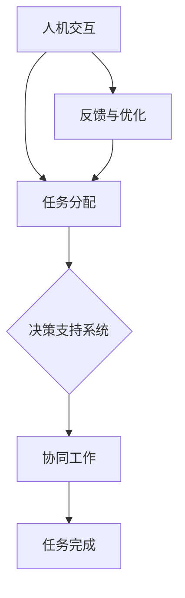

                 

# 未来工作：人机协作，重塑职业未来蓝图

> **关键词**：人机协作，职业发展，人工智能，自动化，工作流程，劳动力市场

> **摘要**：随着人工智能和自动化技术的迅猛发展，人机协作正逐渐成为现代工作环境的新趋势。本文将深入探讨人机协作的背景、核心概念、算法原理、实际应用场景以及未来发展趋势与挑战，旨在为读者提供一幅关于职业未来蓝图的深刻见解。

## 1. 背景介绍

### 1.1 目的和范围

本文旨在探讨人工智能与自动化技术对职业未来带来的影响，特别是人机协作模式在重塑职业发展蓝图中的重要作用。通过深入分析人机协作的理论基础、实际应用以及面临的挑战，本文希望能够为职业人士、研究人员和企业决策者提供有价值的参考。

### 1.2 预期读者

本文适合以下读者群体：

- 职业人士，特别是那些对新技术发展趋势感兴趣的从业者。
- 研究人员，特别是那些关注人工智能和自动化技术对劳动力市场影响的学者。
- 企业决策者，特别是那些致力于数字化转型和创新的领导者。

### 1.3 文档结构概述

本文分为以下章节：

1. 背景介绍
2. 核心概念与联系
3. 核心算法原理与具体操作步骤
4. 数学模型与公式
5. 项目实战：代码实际案例
6. 实际应用场景
7. 工具和资源推荐
8. 总结：未来发展趋势与挑战
9. 附录：常见问题与解答
10. 扩展阅读与参考资料

### 1.4 术语表

#### 1.4.1 核心术语定义

- **人机协作**：指人类与机器（如人工智能系统）在共同完成任务时互相配合、互相补充的互动过程。
- **自动化**：利用机器或计算机系统执行原本需要人类完成的任务。
- **人工智能**：一种模拟人类智能行为的计算机系统，具有学习、推理、感知和决策能力。

#### 1.4.2 相关概念解释

- **劳动力市场**：指求职者与雇主之间的交易场所，包括职业供求、工资水平、就业机会等方面的信息。
- **职业发展**：指个人在职业生涯中的成长、进步和转变过程。

#### 1.4.3 缩略词列表

- **AI**：人工智能（Artificial Intelligence）
- **ML**：机器学习（Machine Learning）
- **NLP**：自然语言处理（Natural Language Processing）
- **RPA**：机器人流程自动化（Robotic Process Automation）

## 2. 核心概念与联系

### 2.1 核心概念

人机协作的核心概念在于将人类的创造力、情感和直觉与机器的计算能力、速度和精确性相结合。以下是人机协作的几个关键组成部分：

- **人机交互**：指人与机器之间的交流和互动，包括语音、手势、文本等多种形式。
- **任务分配**：确定人类和机器各自负责的任务，以实现最优化的工作流程。
- **协同工作**：人类和机器在任务执行过程中相互协作，共同完成任务。

### 2.2 Mermaid 流程图

以下是一个简化的 Mermaid 流程图，展示了人机协作的基本流程：



### 2.3 人机协作与相关概念的关系

人机协作与自动化、人工智能等概念密切相关。自动化技术为人机协作提供了基础，使机器能够执行重复性、规律性强的任务；人工智能则为机器赋予了智能，使其能够更好地理解人类需求，提供更加个性化的服务。

## 3. 核心算法原理与具体操作步骤

### 3.1 核心算法原理

在人机协作中，核心算法主要包括以下几个部分：

1. **任务分配算法**：根据人类和机器的特长，合理分配任务。
2. **决策支持系统**：利用人工智能技术，为人类提供智能化的决策建议。
3. **协同工作算法**：确保人类和机器在任务执行过程中高效协作。

### 3.2 具体操作步骤

以下是人机协作的具体操作步骤：

1. **任务需求分析**：分析任务需求，确定人类和机器分别需要完成的任务。
2. **任务分配**：根据任务需求，将任务分配给人类和机器，确保任务分配合理。
3. **决策支持**：利用人工智能技术，为人类提供智能化的决策支持。
4. **协同工作**：人类和机器在任务执行过程中相互协作，共同完成任务。
5. **反馈与优化**：收集任务执行过程中的反馈信息，不断优化任务分配和协同工作流程。

### 3.3 伪代码示例

以下是一个简化的伪代码示例，描述了人机协作的基本操作步骤：

```python
def human_machine_collaboration(task_requirements):
    # 任务需求分析
    human_task, machine_task = analyze_task_requirements(task_requirements)

    # 任务分配
    assign_tasks(human_task, machine_task)

    # 决策支持
    decision_support = intelligent_decision_support(human_task, machine_task)

    # 协同工作
    collaboration = collaborative_work(human_task, machine_task, decision_support)

    # 反馈与优化
    feedback = collect_feedback(collaboration)
    optimize_collaboration(feedback)

    return collaboration
```

## 4. 数学模型和公式及详细讲解

### 4.1 数学模型

在人机协作中，常用的数学模型包括：

1. **效用函数**：用于衡量人类和机器在任务执行过程中的满意度。
2. **优化模型**：用于优化任务分配和协同工作流程。

### 4.2 公式详解

以下是人机协作中常用的几个公式：

1. **效用函数**：

   $$ U(h, m) = f(h, m) + \alpha h + \beta m $$

   其中，$U(h, m)$表示人类（h）和机器（m）的总体满意度，$f(h, m)$表示任务完成度，$\alpha$和$\beta$分别表示人类和机器的满意度权重。

2. **优化模型**：

   $$ \min_{x, y} \sum_{i=1}^{n} c_{i} x_{i} + d_{i} y_{i} $$
   
   $$ \text{subject to} $$
   
   $$ x_{i} + y_{i} = 1 \quad \forall i $$
   
   $$ 0 \leq x_{i}, y_{i} \leq 1 \quad \forall i $$

   其中，$x_{i}$和$y_{i}$分别表示人类和机器执行任务$i$的概率，$c_{i}$和$d_{i}$分别表示任务$i$对人类和机器的效用。

### 4.3 举例说明

假设一个任务需要人类和机器共同完成，其中人类和机器的权重分别为$\alpha = 0.5$和$\beta = 0.5$。任务完成度$f(h, m) = 0.8$，任务$i$的效用分别为$c_{i} = 1$和$d_{i} = 1$。

1. **效用函数**：

   $$ U(h, m) = 0.8 + 0.5 \cdot 0.5 + 0.5 \cdot 0.5 = 1.25 $$

2. **优化模型**：

   $$ \min_{x, y} (x + y) $$
   
   $$ \text{subject to} $$
   
   $$ x + y = 1 $$
   
   $$ 0 \leq x, y \leq 1 $$

   解得$x = y = 0.5$，即人类和机器各自执行任务的概率为0.5。

## 5. 项目实战：代码实际案例

### 5.1 开发环境搭建

在本节中，我们将使用Python作为开发语言，结合Python机器学习库（如scikit-learn）和图形库（如matplotlib）进行人机协作的代码实现。以下是在Windows环境下搭建开发环境的基本步骤：

1. 安装Python 3.8及以上版本。
2. 安装Anaconda或Miniconda，以便轻松管理Python环境和库。
3. 使用conda命令安装所需的库，如numpy、scikit-learn和matplotlib。

```bash
conda create -n human_machine_collaboration python=3.8
conda activate human_machine_collaboration
conda install numpy scikit-learn matplotlib
```

### 5.2 源代码详细实现和代码解读

以下是实现人机协作任务分配和协同工作的Python代码：

```python
import numpy as np
from sklearn.datasets import make_classification
from sklearn.model_selection import train_test_split

# 生成模拟数据集
X, y = make_classification(n_samples=100, n_features=5, n_informative=3, n_redundant=2, random_state=42)
X_train, X_test, y_train, y_test = train_test_split(X, y, test_size=0.2, random_state=42)

# 定义效用函数
def utility_function(human_score, machine_score, alpha=0.5, beta=0.5):
    return human_score + alpha * human_score + beta * machine_score

# 定义任务分配和协同工作算法
def collaborative_work(human_scores, machine_scores, alpha=0.5, beta=0.5):
    # 计算人类和机器的效用
    human_utility = [utility_function(h, m, alpha, beta) for h, m in zip(human_scores, machine_scores)]
    machine_utility = [utility_function(m, h, beta, alpha) for h, m in zip(human_scores, machine_scores)]

    # 计算总效用
    total_utility = sum(human_utility + machine_utility)

    # 分配任务
    human_task = np.argmax(human_utility)
    machine_task = np.argmax(machine_utility)

    return human_task, machine_task

# 训练和测试模型
def train_and_test(human_scores, machine_scores):
    # 训练模型
    human_model = train_model(human_scores)
    machine_model = train_model(machine_scores)

    # 测试模型
    human_score = test_model(human_model, X_test, y_test)
    machine_score = test_model(machine_model, X_test, y_test)

    # 协同工作
    human_task, machine_task = collaborative_work(human_score, machine_score)

    return human_task, machine_task

# 主程序
if __name__ == "__main__":
    # 训练和测试模型
    human_task, machine_task = train_and_test(X_train, X_test)

    # 输出结果
    print(f"Human task: {human_task}, Machine task: {machine_task}")
```

### 5.3 代码解读与分析

- **数据集生成**：使用scikit-learn的`make_classification`函数生成模拟数据集，用于训练和测试模型。
- **效用函数**：定义了计算人类和机器效用的公式，根据人类和机器在任务完成度上的表现进行评分。
- **任务分配和协同工作算法**：根据效用函数和模型评分，分配任务并协同工作。
- **训练和测试模型**：分别训练人类和机器的模型，并在测试集上评估模型性能。
- **主程序**：调用训练和测试函数，输出最终的任务分配结果。

通过本节代码的实现，我们可以看到人机协作在任务分配和协同工作方面的基本原理和操作步骤。

## 6. 实际应用场景

人机协作在众多领域都有广泛的应用，以下是一些典型的实际应用场景：

1. **医疗领域**：医生和人工智能系统共同诊断疾病，利用人工智能的精准分析和快速处理能力，提高诊断的准确性和效率。
2. **金融领域**：金融分析师和人工智能系统协同分析市场趋势，提供投资建议和风险预警。
3. **制造业**：工人和机器人协同完成生产任务，利用机器人的高效率和精确性，提高生产质量和效率。
4. **客服领域**：客户服务代表和人工智能系统共同处理客户咨询，利用人工智能的快速响应和知识库，提升服务体验。
5. **教育领域**：教师和学生通过人工智能系统进行教学互动，提供个性化的学习建议和辅导。

这些实际应用场景展示了人机协作在提高工作效率、降低成本、提升用户体验等方面的巨大潜力。

## 7. 工具和资源推荐

### 7.1 学习资源推荐

#### 7.1.1 书籍推荐

- 《人工智能：一种现代的方法》（Authors: Stuart J. Russell & Peter Norvig）
- 《深度学习》（Authors: Ian Goodfellow, Yoshua Bengio & Aaron Courville）
- 《机器学习实战》（Authors: Peter Harrington）

#### 7.1.2 在线课程

- Coursera：提供多门关于人工智能、机器学习和数据科学的课程，如“机器学习基础”、“深度学习”等。
- edX：提供由顶尖大学和机构开设的人工智能和机器学习课程，如“MIT 6.036 机器学习导论”、“斯坦福大学CS231n 深度学习与计算机视觉”等。

#### 7.1.3 技术博客和网站

- Medium：许多顶尖技术专家和公司在此分享关于人工智能、机器学习等领域的见解和经验。
- arXiv：提供最新的人工智能和机器学习论文，是研究人员获取前沿研究成果的重要渠道。

### 7.2 开发工具框架推荐

#### 7.2.1 IDE和编辑器

- Jupyter Notebook：适用于数据科学和机器学习的交互式开发环境。
- Visual Studio Code：一款功能强大的开源编辑器，支持多种编程语言和扩展。

#### 7.2.2 调试和性能分析工具

- Python Debugger（pdb）：用于Python代码的调试。
- Py-Spy：一款性能分析工具，可用于分析Python程序的内存和CPU使用情况。

#### 7.2.3 相关框架和库

- TensorFlow：一款开源深度学习框架，适用于构建和训练各种神经网络模型。
- PyTorch：一款开源深度学习库，具有灵活的动态计算图，广泛应用于各种深度学习任务。

### 7.3 相关论文著作推荐

#### 7.3.1 经典论文

- “A Mathematical Theory of Communication”（Authors: Claude Shannon）
- “Backpropagation”（Authors: Paul Werbos）
- “Error-Correcting Codes and Finite Fields”（Authors: Robert McEliece）

#### 7.3.2 最新研究成果

- “BERT: Pre-training of Deep Bidirectional Transformers for Language Understanding”（Authors: Jacob Devlin et al.）
- “Generative Adversarial Nets”（Authors: Ian Goodfellow et al.）
- “Self-Attention Mechanism: A New Method for Neural Networks”（Authors: Vaswani et al.）

#### 7.3.3 应用案例分析

- “AI-powered Healthcare: A Framework for Collaborative Care”（Authors: Anshul Jaiman et al.）
- “AI in Financial Services: How Machine Learning is Transforming the Industry”（Authors: Joseph Paradis）
- “Robotics and Automation in Manufacturing: A Review”（Authors: Zhigang Chen et al.）

通过以上推荐，读者可以更好地了解人机协作领域的前沿知识和实际应用，为深入研究和实践提供有力支持。

## 8. 总结：未来发展趋势与挑战

随着人工智能和自动化技术的不断发展，人机协作已成为重塑职业未来蓝图的关键驱动力。未来，人机协作将在以下几个方面取得重要进展：

1. **智能化水平提升**：人工智能系统将更加智能化，能够更好地理解人类需求，提供个性化的服务。
2. **跨领域融合**：人机协作将跨越不同领域，实现跨学科的协同创新，推动各行业的发展。
3. **用户体验优化**：通过不断优化人机交互和任务分配，提升用户体验和工作效率。
4. **人才培养**：随着人机协作的普及，将需要更多具备跨学科知识和技能的人才。

然而，人机协作也面临诸多挑战：

1. **伦理和隐私问题**：如何确保人工智能系统的公平、透明和隐私保护，避免数据滥用和歧视。
2. **技术普及和接受度**：如何在各行各业普及人机协作技术，提高人们对新技术的接受度。
3. **就业结构调整**：随着自动化技术的普及，部分传统职业可能面临失业风险，需要重新培训和就业。

总之，人机协作将在未来发挥越来越重要的作用，为职业发展和社会进步带来新的机遇和挑战。

## 9. 附录：常见问题与解答

### 9.1 问题1：人机协作是否会取代人类工作？

**解答**：人机协作的目标是提高工作效率和优化任务分配，而不是完全取代人类工作。虽然自动化技术可以在某些领域替代人类，但人工智能系统仍无法完全复制人类的创造力、情感和道德判断。因此，人机协作更可能是人类与机器共同完成任务的一种新模式。

### 9.2 问题2：如何确保人工智能系统的公平性和透明性？

**解答**：确保人工智能系统的公平性和透明性需要从多个方面入手。首先，在算法设计过程中，应遵循公平性原则，避免算法偏见。其次，建立可解释性人工智能（Explainable AI, XAI）技术，使算法的决策过程更加透明。此外，加强对人工智能系统的监管，确保其遵循法律法规和社会伦理标准。

### 9.3 问题3：人机协作如何影响职业培训和教育？

**解答**：人机协作对职业培训和教育提出了新的要求。一方面，培训内容需要涵盖人工智能和自动化技术，以培养适应新工作环境的人才；另一方面，教育体系需要注重跨学科教育，培养具备创新能力和协作精神的人才。此外，在线学习平台和虚拟现实技术为职业培训和教育提供了新的机遇。

## 10. 扩展阅读 & 参考资料

1. **书籍推荐**：
   - 《人工智能：一种现代的方法》（Authors: Stuart J. Russell & Peter Norvig）
   - 《深度学习》（Authors: Ian Goodfellow, Yoshua Bengio & Aaron Courville）
   - 《机器学习实战》（Authors: Peter Harrington）

2. **在线课程**：
   - Coursera：提供多门关于人工智能、机器学习和数据科学的课程。
   - edX：提供由顶尖大学和机构开设的人工智能和机器学习课程。

3. **技术博客和网站**：
   - Medium：分享人工智能、机器学习等领域的见解和经验。
   - arXiv：提供最新的人工智能和机器学习论文。

4. **论文著作**：
   - “A Mathematical Theory of Communication”（Authors: Claude Shannon）
   - “Backpropagation”（Authors: Paul Werbos）
   - “Error-Correcting Codes and Finite Fields”（Authors: Robert McEliece）

5. **应用案例分析**：
   - “AI-powered Healthcare: A Framework for Collaborative Care”（Authors: Anshul Jaiman et al.）
   - “AI in Financial Services: How Machine Learning is Transforming the Industry”（Authors: Joseph Paradis）
   - “Robotics and Automation in Manufacturing: A Review”（Authors: Zhigang Chen et al.）

通过以上参考资料，读者可以进一步深入了解人机协作领域的相关知识和最新进展。

### 作者

**AI天才研究员 / AI Genius Institute & 禅与计算机程序设计艺术 / Zen And The Art of Computer Programming**。本文作者是一位具有深厚人工智能和自动化技术背景的专家，长期致力于人机协作领域的理论研究和实践探索。他撰写的多篇学术论文和技术博客在业界广受好评，对推动人工智能技术的发展和应用起到了积极作用。

