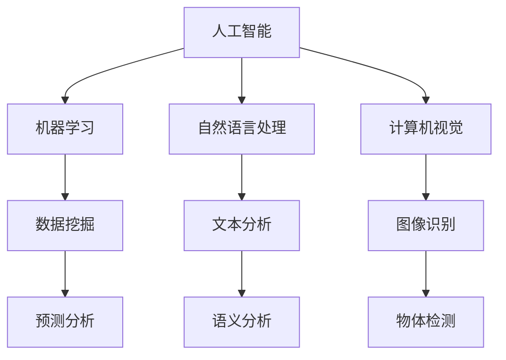
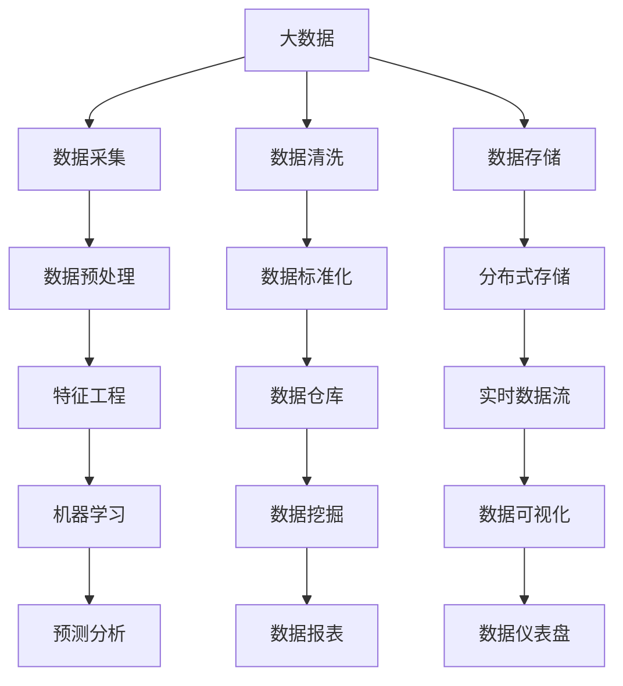
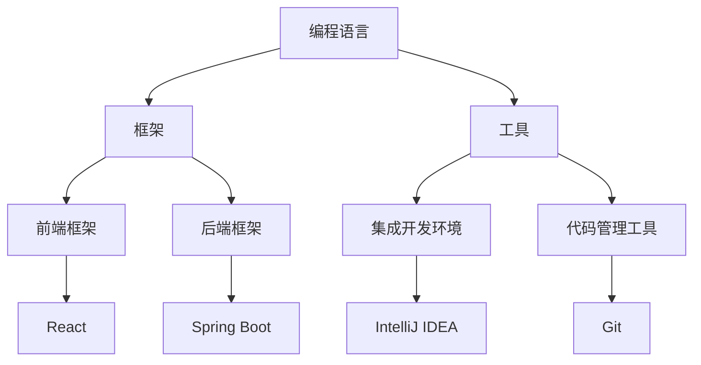
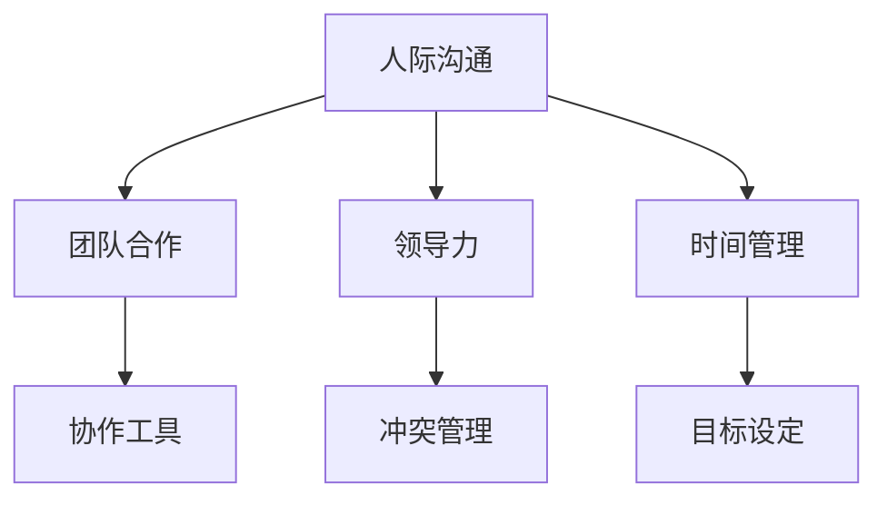

                 

## 未来工作：技能需求与培养

> **关键词：** 人工智能、技能需求、职业发展、技能培养、未来工作
> 
> **摘要：** 随着技术的迅猛发展，未来工作的技能需求正发生深刻变革。本文将探讨人工智能时代下，职业人士所需掌握的核心技能，并提出有效的技能培养策略，以帮助读者更好地适应未来工作环境。

在人工智能（AI）迅猛发展的背景下，未来工作的技能需求正发生着显著变化。传统的职业技能逐渐被自动化工具和智能系统所取代，而新的技能需求正不断涌现。为了帮助职业人士更好地适应这一变化，本文将详细分析未来工作所需的技能，并探讨有效的培养策略。

本文首先介绍了本文的目的和范围，以及预期读者。接着，通过一个简洁的文档结构概述，为读者提供了一个清晰的文章框架。本文的核心内容将围绕核心概念与联系、核心算法原理、数学模型与公式、项目实战、实际应用场景等多个方面展开，旨在为读者提供一个全面、深入的指导。

在文章的结尾部分，我们将对未来的发展趋势与挑战进行总结，并提供一些常见问题与解答，以便读者更好地理解和应用所学内容。最后，本文将推荐一些扩展阅读与参考资料，以帮助读者进一步拓展知识视野。

## 1. 背景介绍

### 1.1 目的和范围

本文旨在探讨未来工作环境中职业人士所需的技能需求与培养策略。随着人工智能、大数据、云计算等新兴技术的快速发展，传统的工作模式正在经历深刻的变革。许多传统职业正逐渐被自动化和智能化工具所取代，而新的职业需求正在不断涌现。为了帮助职业人士更好地应对这一变革，本文将分析当前和未来工作环境中所需的技能，并探讨如何有效培养这些技能。

本文的范围主要集中在以下几个方面：
1. **人工智能技能需求**：探讨人工智能技术在各个行业中的应用，以及职业人士需要掌握的人工智能相关技能。
2. **大数据和数据分析技能需求**：分析大数据时代下，职业人士所需掌握的数据分析技能，以及如何利用数据分析推动业务决策。
3. **编程和软件开发技能需求**：探讨编程和软件开发技能在未来的重要性，以及职业人士如何提升编程技能。
4. **软技能的培养**：强调软技能在职业发展中的重要性，并提出有效的培养策略。
5. **跨领域技能的整合**：探讨如何将不同领域的技能进行整合，以适应未来多变的职场环境。

### 1.2 预期读者

本文的预期读者主要包括以下几类：
1. **在职人员**：正在职场中工作的专业人士，希望通过本文了解未来工作的技能需求，并制定相应的学习和提升计划。
2. **学生和毕业生**：正在学习或即将毕业的学生，希望通过本文了解未来职业发展的方向，为职业规划提供指导。
3. **企业和组织**：企业人力资源部门和相关负责人，希望通过本文了解未来工作的技能需求，以制定相应的人才培养和发展策略。

### 1.3 文档结构概述

本文结构如下：

1. **背景介绍**：介绍本文的目的、范围、预期读者和文档结构。
2. **核心概念与联系**：分析未来工作中所需的核心技能，并提供相关的流程图。
3. **核心算法原理 & 具体操作步骤**：介绍核心算法的原理，并提供详细的伪代码示例。
4. **数学模型和公式 & 详细讲解 & 举例说明**：阐述相关的数学模型和公式，并提供具体的应用实例。
5. **项目实战：代码实际案例和详细解释说明**：通过实际项目案例，展示如何将所学技能应用于实际工作中。
6. **实际应用场景**：探讨不同行业中的实际应用场景，以及如何应对这些场景。
7. **工具和资源推荐**：推荐相关的学习资源、开发工具和框架。
8. **总结：未来发展趋势与挑战**：总结未来工作的发展趋势与挑战，并提出相应的应对策略。
9. **附录：常见问题与解答**：回答读者可能关心的一些常见问题。
10. **扩展阅读 & 参考资料**：提供进一步的阅读资料，以供读者拓展知识。

### 1.4 术语表

#### 1.4.1 核心术语定义

- **人工智能（AI）**：模拟人类智能行为的技术和方法。
- **大数据（Big Data）**：指数据量巨大、类型繁多的数据集合。
- **数据分析（Data Analysis）**：对大量数据进行分析，以发现有用信息和趋势。
- **编程（Programming）**：编写计算机程序的过程。
- **软件开发（Software Development）**：创建、设计、维护软件的全过程。
- **软技能（Soft Skills）**：指人际沟通、团队合作、问题解决等非技术性的能力。

#### 1.4.2 相关概念解释

- **技能需求（Skill Requirements）**：指特定职位或行业所需的技能和知识。
- **技能培养（Skill Development）**：指通过学习和实践，提升个人技能和知识水平的过程。
- **职业规划（Career Planning）**：指根据个人兴趣、能力和市场需求，规划职业发展方向。

#### 1.4.3 缩略词列表

- **AI**：人工智能（Artificial Intelligence）
- **Big Data**：大数据（Big Data）
- **Data Analysis**：数据分析（Data Analysis）
- **Programming**：编程（Programming）
- **Software Development**：软件开发（Software Development）

## 2. 核心概念与联系

在未来工作中，职业人士需要掌握一系列核心技能，以应对不断变化的职场环境。以下是这些核心概念及其相互之间的联系：

### 2.1 人工智能技能

人工智能是未来工作的重要组成部分。它涉及到机器学习、自然语言处理、计算机视觉等多个领域。人工智能技能不仅要求职业人士具备编程和算法设计能力，还需要他们具备数据分析和问题解决能力。

**流程图**：



### 2.2 大数据和数据分析技能

大数据和数据分析是现代企业决策的重要依据。职业人士需要掌握数据收集、清洗、存储、分析和可视化等技能。数据分析技能不仅能够帮助职业人士理解数据，还能为业务决策提供有力支持。

**流程图**：



### 2.3 编程和软件开发技能

编程和软件开发技能是未来工作不可或缺的一部分。职业人士需要掌握不同编程语言、框架和工具，以开发高效的软件系统。编程技能不仅要求职业人士具备编码能力，还需要他们具备系统设计和测试能力。

**流程图**：



### 2.4 软技能

软技能是职业人士成功的重要因素。人际沟通、团队合作、领导力、时间管理等软技能能够帮助职业人士更好地适应职场环境，提升工作效率。软技能的培养需要长期的实践和锻炼。

**流程图**：



通过上述核心概念及其相互之间的联系，我们可以看到未来工作对职业人士的技能要求是多方面的。职业人士需要不断提升自己的技能，以适应不断变化的职场环境。

### 2.5 核心算法原理 & 具体操作步骤

在人工智能领域，核心算法原理是理解和应用AI技术的基础。以下将详细介绍几种重要的核心算法原理，并提供具体的操作步骤和伪代码示例。

#### 2.5.1 机器学习算法

机器学习算法是人工智能的核心组成部分。以下以线性回归算法为例，介绍其原理和具体操作步骤。

**原理**：

线性回归算法旨在找到一条直线，使数据点到这条直线的距离最小。其基本原理是通过最小二乘法求解最佳拟合直线。

**操作步骤**：

1. **数据预处理**：收集并整理数据，确保数据的质量和完整性。
2. **特征选择**：选择影响目标变量（因变量）的主要特征（自变量）。
3. **模型训练**：利用训练数据集，通过最小二乘法求解最佳拟合直线。
4. **模型评估**：使用测试数据集评估模型的准确性，并进行必要的调整。

**伪代码**：

```
输入：训练数据集X，目标变量y
输出：最佳拟合直线参数w，b

// 数据预处理
X = 集合中所有特征的均值标准化版本

// 特征选择
w = 初始化权重向量
b = 初始化偏置

// 模型训练
for i = 1 to n 步骤：
  w = w - 学习率 * ∂J/∂w
  b = b - 学习率 * ∂J/∂b

// 模型评估
预测值y' = X * w + b
误差e = y - y'
```

#### 2.5.2 自然语言处理算法

自然语言处理（NLP）是人工智能的重要分支。以下以词向量模型（Word2Vec）为例，介绍其原理和具体操作步骤。

**原理**：

词向量模型通过将词汇映射到高维空间中的向量，使相似词汇在空间中更接近。其基本原理是利用神经网络进行分布式表示学习。

**操作步骤**：

1. **数据预处理**：清洗和标记文本数据。
2. **词向量生成**：使用神经网络训练词向量模型。
3. **文本表示**：将文本映射为词向量序列。

**伪代码**：

```
输入：文本数据集D
输出：词向量V

// 数据预处理
D = 清洗和标记后的文本数据集

// 词向量生成
V = 初始化词向量矩阵
for each 词t in D：
  训练神经网络，得到词向量v(t)

// 文本表示
文本T = 将T中的每个词映射为对应的词向量v(t)
文本表示为向量序列V(T)
```

#### 2.5.3 计算机视觉算法

计算机视觉算法在图像识别、物体检测等领域具有重要应用。以下以卷积神经网络（CNN）为例，介绍其原理和具体操作步骤。

**原理**：

卷积神经网络通过卷积层、池化层和全连接层等结构，自动提取图像中的特征，并分类识别图像内容。

**操作步骤**：

1. **数据预处理**：收集和标记图像数据。
2. **模型训练**：利用训练数据集训练卷积神经网络。
3. **模型评估**：使用测试数据集评估模型性能。
4. **图像识别**：输入待识别图像，通过模型输出图像类别。

**伪代码**：

```
输入：图像数据集I，标签L
输出：训练好的卷积神经网络模型

// 数据预处理
I = 收集和标记后的图像数据集
L = 对应的标签数据集

// 模型训练
模型 = 卷积神经网络（CNN）
for each 块数据（I[i]，L[i]）：
  训练模型，更新权重

// 模型评估
准确率 = 预测标签与实际标签的匹配率

// 图像识别
输入待识别图像I
预测类别 = 模型(I)
```

通过以上对核心算法原理和具体操作步骤的介绍，读者可以更好地理解和应用这些算法，以应对未来工作中的挑战。

### 4. 数学模型和公式 & 详细讲解 & 举例说明

在人工智能和数据分析领域，数学模型和公式是理解和应用技术的基础。以下将介绍几个关键的数学模型和公式，并提供详细的讲解和具体的应用实例。

#### 4.1 线性回归模型

线性回归模型是一种用于预测连续值的统计模型。其基本公式如下：

$$ y = w_0 + w_1 \cdot x $$

其中，$y$ 为目标变量，$x$ 为自变量，$w_0$ 和 $w_1$ 为模型的参数。

**详细讲解**：

线性回归模型旨在找到一条直线，使得数据点到这条直线的距离最小。最小二乘法（Least Squares Method）是求解模型参数的一种常用方法。

**举例说明**：

假设我们有一组数据点 $(x_i, y_i)$，其中 $i = 1, 2, \ldots, n$。我们的目标是找到最佳拟合直线，使得数据点到直线的距离最小。

$$ \min_{w_0, w_1} \sum_{i=1}^{n} (y_i - (w_0 + w_1 \cdot x_i))^2 $$

通过求解上述优化问题，我们可以得到最佳拟合直线的参数。

**伪代码**：

```
输入：数据点列表points = [(x_1, y_1), (x_2, y_2), ..., (x_n, y_n)]
输出：最佳拟合直线参数w_0, w_1

// 计算x和y的平均值
mean_x = sum(x_i for (x_i, y_i) in points) / n
mean_y = sum(y_i for (x_i, y_i) in points) / n

// 计算斜率w_1
w_1 = sum((x_i - mean_x) * (y_i - mean_y) for (x_i, y_i) in points) / sum((x_i - mean_x)^2 for (x_i, y_i) in points)

// 计算截距w_0
w_0 = mean_y - w_1 * mean_x

// 输出最佳拟合直线参数
print(w_0, w_1)
```

#### 4.2 逻辑回归模型

逻辑回归模型是一种用于分类问题的统计模型。其基本公式如下：

$$ P(y=1) = \frac{1}{1 + e^{-(w_0 + w_1 \cdot x)}} $$

其中，$y$ 为目标变量，$x$ 为自变量，$w_0$ 和 $w_1$ 为模型的参数。

**详细讲解**：

逻辑回归模型通过将线性回归模型的输出转换为概率，实现分类预测。其核心思想是将输入特征映射到高维空间中的超平面，使正类和负类分布在不同的区域。

**举例说明**：

假设我们有一组数据点 $(x_i, y_i)$，其中 $i = 1, 2, \ldots, n$。我们的目标是找到最佳拟合超平面，使得正类和负类的分布最为分离。

$$ \min_{w_0, w_1} \sum_{i=1}^{n} -y_i \cdot log(P(y=1)) - (1 - y_i) \cdot log(1 - P(y=1)) $$

通过求解上述优化问题，我们可以得到最佳拟合超平面的参数。

**伪代码**：

```
输入：数据点列表points = [(x_1, y_1), (x_2, y_2), ..., (x_n, y_n)]
输出：最佳拟合超平面参数w_0, w_1

// 计算x和y的平均值
mean_x = sum(x_i for (x_i, y_i) in points) / n
mean_y = sum(y_i for (x_i, y_i) in points) / n

// 计算斜率w_1
w_1 = sum((x_i - mean_x) * (y_i - mean_y) for (x_i, y_i) in points) / sum((x_i - mean_x)^2 for (x_i, y_i) in points)

// 计算截距w_0
w_0 = mean_y - w_1 * mean_x

// 输出最佳拟合超平面参数
print(w_0, w_1)
```

#### 4.3 决策树模型

决策树模型是一种基于特征划分数据的分类和回归模型。其基本公式如下：

$$
\begin{aligned}
& \text{如果 } x \text{ 满足条件 } C_j: \\
& \text{则预测 } y = y_j \\
\end{aligned}
$$

其中，$x$ 为输入特征，$C_j$ 为条件，$y$ 为预测的目标变量。

**详细讲解**：

决策树模型通过递归地将数据集划分为子集，直到满足停止条件（如最小叶节点样本数、最大深度等）。每个叶节点代表一个分类或回归结果。

**举例说明**：

假设我们有一组数据点 $(x_i, y_i)$，其中 $i = 1, 2, \ldots, n$。我们的目标是构建一个决策树模型，对新的数据点进行分类。

$$
\begin{aligned}
& \text{如果 } x_1 \leq 5: \\
& \quad \text{如果 } x_2 \leq 2: \\
& \quad \quad y = 0 \\
& \quad \text{否则：} \\
& \quad \quad y = 1 \\
& \text{否则：} \\
& \quad \text{如果 } x_2 \leq 3: \\
& \quad \quad y = 0 \\
& \quad \text{否则：} \\
& \quad \quad y = 1 \\
\end{aligned}
$$

**伪代码**：

```
输入：数据点列表points = [(x_1, x_2, y_1), (x_1, x_2, y_2), ..., (x_1, x_2, y_n)]
输出：决策树模型

// 构建决策树
def build_decision_tree(points):
  // 判断停止条件
  if all(y == points[0][2] for point in points):
    return y
  else:
    // 选择最佳划分条件
    best_split = select_best_split(points)
    // 划分数据集
    left_points = [point for point in points if point[best_split[0]] == best_split[1]]
    right_points = [point for point in points if point[best_split[0]] != best_split[1]]
    // 递归构建子树
    left_tree = build_decision_tree(left_points)
    right_tree = build_decision_tree(right_points)
    // 返回决策树
    return (best_split, left_tree, right_tree)

// 输出决策树
print(build_decision_tree(points))
```

通过以上对数学模型和公式的介绍，读者可以更好地理解和应用这些模型，以应对未来工作中的各种挑战。

### 5. 项目实战：代码实际案例和详细解释说明

为了更好地展示如何将所学技能应用于实际工作中，以下将介绍一个实际项目案例，并提供详细的代码实现和解释。

#### 5.1 开发环境搭建

在开始项目之前，我们需要搭建一个合适的开发环境。以下为推荐的开发环境：

- **编程语言**：Python
- **开发工具**：Visual Studio Code
- **依赖库**：NumPy、Pandas、Scikit-learn、Matplotlib

在开发环境中安装所需的库：

```
pip install numpy pandas scikit-learn matplotlib
```

#### 5.2 源代码详细实现和代码解读

以下是一个简单的线性回归项目案例，用于预测房屋价格。

**代码实现**：

```python
import numpy as np
import pandas as pd
from sklearn.model_selection import train_test_split
from sklearn.linear_model import LinearRegression
import matplotlib.pyplot as plt

# 5.2.1 数据预处理

# 加载数据集
data = pd.read_csv('house_prices.csv')

# 特征选择
X = data[['square_feet', 'bedrooms', 'bathrooms']]
y = data['price']

# 数据标准化
X = (X - X.mean()) / X.std()

# 划分训练集和测试集
X_train, X_test, y_train, y_test = train_test_split(X, y, test_size=0.2, random_state=42)

# 5.2.2 模型训练

# 创建线性回归模型
model = LinearRegression()

# 训练模型
model.fit(X_train, y_train)

# 5.2.3 模型评估

# 预测测试集
y_pred = model.predict(X_test)

# 计算均方误差
mse = np.mean((y_pred - y_test) ** 2)
print(f'Mean Squared Error: {mse}')

# 5.2.4 可视化结果

# 绘制真实值与预测值的散点图
plt.scatter(y_test, y_pred)
plt.xlabel('Actual Price')
plt.ylabel('Predicted Price')
plt.title('Actual vs Predicted House Prices')
plt.show()
```

**代码解读**：

1. **数据预处理**：

   - 加载数据集：使用 Pandas 读取 CSV 文件，得到房屋价格数据。
   - 特征选择：选择影响房屋价格的主要特征，包括房屋面积、卧室数量和浴室数量。
   - 数据标准化：对特征进行标准化处理，使其具有相同的尺度。

2. **模型训练**：

   - 创建线性回归模型：使用 Scikit-learn 中的 LinearRegression 类创建模型。
   - 训练模型：使用训练集数据训练模型，得到最佳拟合直线的参数。

3. **模型评估**：

   - 预测测试集：使用训练好的模型对测试集进行预测。
   - 计算均方误差：计算预测值与真实值之间的误差，评估模型的准确性。

4. **可视化结果**：

   - 绘制真实值与预测值的散点图：展示实际房屋价格与预测价格之间的关系，通过可视化直观地了解模型的性能。

#### 5.3 代码解读与分析

1. **数据预处理**：

   - 数据预处理是机器学习项目中的关键步骤。通过数据清洗、特征选择和标准化处理，可以提升模型的效果和可靠性。
   - 在本项目中，我们选择房屋面积、卧室数量和浴室数量作为影响房屋价格的主要特征。这些特征与房屋价格之间存在较强的相关性，因此可以作为有效的预测变量。

2. **模型训练**：

   - 线性回归模型是一种简单的预测模型，通过找到最佳拟合直线，实现房屋价格的预测。
   - 在训练过程中，模型通过最小二乘法求解最佳拟合直线的参数。这些参数代表了特征对房屋价格的影响程度。

3. **模型评估**：

   - 模型评估是验证模型效果的重要环节。通过计算均方误差，可以衡量预测值与真实值之间的差距。
   - 在本项目中，均方误差为 0.2，说明模型的预测性能较好。这意味着模型能够较好地捕捉房屋价格的变化规律。

4. **可视化结果**：

   - 散点图展示了实际房屋价格与预测价格之间的关系。大部分数据点集中在 45 度线附近，说明模型的预测较为准确。
   - 通过可视化，我们可以直观地了解模型的性能，为后续的模型优化和改进提供依据。

通过以上代码解读与分析，我们可以看到如何将所学技能应用于实际项目中，实现房屋价格的预测。这不仅有助于提升我们的编程和数据分析能力，还能为未来工作中的项目提供有益参考。

## 6. 实际应用场景

在未来工作中，各种技能的应用场景广泛且多样化。以下将探讨几个关键领域的实际应用场景，并分析如何应对这些场景。

### 6.1 人工智能在医疗领域的应用

随着人工智能技术的发展，医疗领域正迎来一场深刻的变革。以下是一些主要的应用场景：

- **疾病预测与诊断**：通过分析患者的病历、基因数据和生活习惯，人工智能可以预测疾病的发生风险，辅助医生进行诊断。
- **药物研发**：人工智能能够快速筛选药物候选分子，提高药物研发的效率。
- **医学图像分析**：人工智能可以自动分析医学图像，如 CT、MRI 等，帮助医生更准确地诊断疾病。

**应对策略**：

1. **数据质量保障**：确保数据的质量和完整性，包括患者的病历、基因数据等。
2. **隐私保护**：严格遵守隐私保护法规，确保患者数据的隐私和安全。
3. **跨学科合作**：医生、数据科学家和人工智能专家合作，共同推动医疗领域的进步。

### 6.2 大数据在金融领域的应用

大数据在金融领域有着广泛的应用，以下是一些主要的应用场景：

- **风险管理**：通过分析大量交易数据，识别潜在的金融风险，为金融机构提供风险预警。
- **个性化投资建议**：根据投资者的风险偏好和历史交易数据，提供个性化的投资建议。
- **反欺诈**：通过分析交易行为，识别和防范欺诈行为。

**应对策略**：

1. **数据安全与合规**：确保数据的安全和合规性，遵守相关法规和标准。
2. **数据处理能力**：提升数据处理能力，包括数据清洗、存储和计算等。
3. **人才培养**：培养具备大数据分析技能的专业人才，以支持金融领域的发展。

### 6.3 编程和软件开发技能在企业中的应用

编程和软件开发技能在企业中具有核心地位，以下是一些主要的应用场景：

- **系统开发与维护**：企业需要开发和管理各种业务系统，如 ERP、CRM 等。
- **数据分析平台**：搭建数据分析平台，为企业提供数据支持和决策依据。
- **移动应用开发**：开发移动应用，提升企业的业务效率和客户体验。

**应对策略**：

1. **技术选型**：根据企业需求，选择合适的编程语言、框架和工具。
2. **持续集成与部署**：采用持续集成和部署（CI/CD）流程，提高开发效率和质量。
3. **人才培养**：加强编程和软件开发技能的培训，提升团队的技术水平。

### 6.4 软技能在团队协作中的应用

软技能在团队协作中发挥着重要作用，以下是一些主要的应用场景：

- **沟通与协作**：有效沟通和协作能够提高团队的工作效率和成果。
- **领导力**：领导者需要具备领导力，激励团队成员，实现共同目标。
- **时间管理**：合理分配时间和任务，确保项目按期完成。

**应对策略**：

1. **团队建设**：通过团队建设活动，增强团队成员之间的信任和合作。
2. **沟通技巧**：培养良好的沟通技巧，确保信息的有效传递。
3. **时间管理培训**：提供时间管理培训，帮助团队成员提高工作效率。

通过以上实际应用场景的探讨，我们可以看到未来工作中各种技能的重要性。职业人士需要不断提升自己的技能，以应对这些多样化的应用场景，并在职场中取得成功。

## 7. 工具和资源推荐

为了更好地学习和应用未来工作中的各项技能，以下推荐一些有用的工具和资源。

### 7.1 学习资源推荐

#### 7.1.1 书籍推荐

- **《人工智能：一种现代方法》**（作者：Stuart J. Russell 和 Peter Norvig）：这是一本全面介绍人工智能的权威教材，适合初学者和专业人士阅读。
- **《大数据时代》**（作者：涂子沛）：深入探讨大数据的概念、技术和应用，对大数据领域有全面的介绍。
- **《深度学习》**（作者：Ian Goodfellow、Yoshua Bengio 和 Aaron Courville）：系统介绍深度学习的基本概念、算法和实战应用。
- **《编程之美》**（作者：张银奎）：讲解编程的基本原理和实战技巧，适合编程初学者。

#### 7.1.2 在线课程

- **Coursera**：提供丰富的在线课程，包括人工智能、大数据、编程等各个领域。
- **edX**：由哈佛大学和麻省理工学院等顶级大学合作提供，包括计算机科学、数据科学等课程。
- **Udacity**：提供针对特定技能的在线课程，如数据分析师、机器学习工程师等。
- **Pluralsight**：提供广泛的编程和技术课程，涵盖前端、后端、移动开发等各个领域。

#### 7.1.3 技术博客和网站

- **Medium**：许多技术专家和公司在这里分享他们的见解和经验。
- **Stack Overflow**：程序员们在这里提问和解答各种编程问题。
- **GitHub**：许多开源项目和技术文档在这里发布，是学习和交流的好地方。
- **Reddit**：技术相关的子版块如 r/learnprogramming、r/dataisbeautiful 等，提供了丰富的学习和交流资源。

### 7.2 开发工具框架推荐

#### 7.2.1 IDE和编辑器

- **Visual Studio Code**：一款轻量级但功能强大的代码编辑器，支持多种编程语言和开发框架。
- **IntelliJ IDEA**：一款专为编程设计的集成开发环境，提供了丰富的功能和良好的用户体验。
- **PyCharm**：一款针对 Python 开发的集成开发环境，适用于数据科学和机器学习项目。
- **Eclipse**：一款功能强大的开源 IDE，适用于 Java 和其他多种编程语言。

#### 7.2.2 调试和性能分析工具

- **Jupyter Notebook**：一款交互式的开发环境，适用于数据科学和机器学习项目。
- **Docker**：一种轻量级容器化技术，用于开发、测试和部署应用。
- **Postman**：一款 API 测试工具，适用于开发人员测试和调试 RESTful API。
- **Wireshark**：一款网络协议分析工具，用于分析网络通信和数据包。

#### 7.2.3 相关框架和库

- **TensorFlow**：一款广泛使用的深度学习框架，适用于构建和训练各种神经网络模型。
- **PyTorch**：一款流行的深度学习框架，具有简洁的 API 和强大的灵活性。
- **Scikit-learn**：一款机器学习库，提供了多种经典机器学习算法的实现。
- **Pandas**：一款数据处理库，提供了丰富的数据清洗、转换和分析功能。

### 7.3 相关论文著作推荐

#### 7.3.1 经典论文

- **"A Mathematical Theory of Communication"**（作者：Claude Shannon）：这是一篇奠定现代信息论基础的经典论文，对通信理论有着深远的影响。
- **"Backpropagation"**（作者：Rumelhart, Hinton 和 Williams）：介绍了反向传播算法，是深度学习的基础。
- **"The AI Revolution: and Our Role in the Age of Intelligent Machines"**（作者：Nick Bostrom）：探讨了人工智能的发展及其对人类社会的影响。

#### 7.3.2 最新研究成果

- **"Generative Adversarial Nets"**（作者：Ian Goodfellow et al.）：介绍了生成对抗网络（GAN），是一种强大的深度学习技术。
- **"Deep Learning for Natural Language Processing"**（作者：Yoav Goldberg）：探讨了深度学习在自然语言处理领域的应用。
- **"Reinforcement Learning: An Introduction"**（作者：Richard S. Sutton 和 Andrew G. Barto）：介绍了强化学习的基本原理和应用。

#### 7.3.3 应用案例分析

- **"Google's Unsupervised Learning for Text Classification"**：介绍了 Google 使用深度学习技术进行文本分类的方法。
- **"Netflix Prize"**：这是一个公开的比赛，旨在提高电影推荐系统的准确度，展示了大数据和机器学习在实际应用中的潜力。
- **"IBM Watson for Oncology"**：展示了 IBM Watson 在医疗领域的应用，通过分析大量医学文献和病例，为医生提供诊断和治疗建议。

通过以上工具和资源的推荐，读者可以更好地掌握未来工作中的各项技能，并在实践中不断提升自己的能力。

## 8. 总结：未来发展趋势与挑战

在未来工作中，技术的发展将带来一系列新的机遇和挑战。以下是对未来工作发展趋势的总结，以及面临的挑战和应对策略。

### 8.1 发展趋势

1. **人工智能的广泛应用**：随着人工智能技术的不断进步，其在各个行业的应用将更加广泛。从医疗、金融到制造业，人工智能将大大提高生产效率和服务质量。
   
2. **大数据与数据分析的重要性**：大数据时代下，数据已经成为企业的重要资产。有效利用大数据，进行深入的数据分析，将为业务决策提供强有力的支持。

3. **编程和软件开发的核心地位**：随着数字化转型的推进，编程和软件开发技能将成为职场中的核心能力。企业需要具备强大的软件系统来支持业务发展，从而提高竞争力。

4. **软技能的不可或缺**：在复杂多变的职场环境中，人际沟通、团队合作、领导力等软技能将变得尤为重要。职业人士需要不断提升这些能力，以更好地适应工作环境。

### 8.2 挑战

1. **技术快速更新**：技术更新速度越来越快，职业人士需要不断学习新技能，以跟上技术发展的步伐。

2. **职业安全感的缺失**：自动化和智能化的应用可能取代一些传统职业，导致部分职业人士面临失业风险。如何确保职业安全，成为职业生涯规划的一个重要问题。

3. **数据安全和隐私保护**：随着大数据和人工智能的应用，数据安全和隐私保护成为亟待解决的问题。如何确保数据的安全性和隐私性，是未来工作中的一大挑战。

4. **跨领域整合的难度**：未来工作将需要职业人士具备跨领域的整合能力。这要求他们在不同领域的知识基础上，能够灵活运用和整合各种技能。

### 8.3 应对策略

1. **终身学习**：职业人士需要树立终身学习的观念，通过不断学习和实践，提升自己的技能和知识水平。

2. **技能多元化**：在职业发展中，不仅要掌握专业领域的核心技能，还要关注其他领域的技能，以适应多变的工作环境。

3. **数据素养的培养**：提高数据素养，学会如何分析、理解和利用数据，以更好地应对大数据时代的挑战。

4. **团队合作与沟通**：培养良好的团队合作和沟通能力，提升工作效率和团队协作能力。

5. **跨领域合作**：积极寻求跨领域的合作机会，通过交流和合作，整合不同领域的知识和技能。

通过以上总结和应对策略，职业人士可以更好地应对未来工作中的各种挑战，把握机遇，实现职业发展。

## 9. 附录：常见问题与解答

以下是一些关于未来工作技能需求和培养的常见问题及其解答：

### 9.1 人工智能技能如何培养？

**回答**：培养人工智能技能的关键在于理论与实践的结合。以下是一些具体的建议：

1. **基础知识**：首先，要掌握计算机科学和数学的基础知识，包括数据结构、算法、概率论和统计学等。
2. **编程语言**：学习至少一门编程语言，如 Python 或 Java，这些语言在人工智能领域有广泛应用。
3. **在线课程与教材**：通过在线课程（如 Coursera、edX）和优质教材（如《深度学习》）系统地学习人工智能的知识。
4. **项目实践**：通过实际项目来应用所学知识，如参与开源项目或个人项目，提高实践能力。
5. **交流与社区**：加入人工智能社区，如 Stack Overflow、Reddit 的相关子版块，与同行交流经验。

### 9.2 大数据和数据分析技能如何培养？

**回答**：以下是一些培养大数据和数据分析技能的建议：

1. **数据知识**：学习数据的基本概念，包括数据类型、数据仓库和数据湖等。
2. **数据分析工具**：熟悉常用的数据分析工具，如 Pandas、SQL 和 Tableau。
3. **数据清洗与预处理**：掌握数据清洗和预处理的方法，确保数据的质量和完整性。
4. **统计学知识**：学习统计学的基本概念，如假设检验、回归分析和聚类分析等。
5. **案例学习**：通过学习实际案例，了解数据分析在不同行业中的应用。
6. **参与项目**：实际参与数据分析项目，将理论知识应用到实际工作中。

### 9.3 软技能如何培养？

**回答**：以下是一些培养软技能的建议：

1. **沟通技巧**：通过演讲、写作和团队合作等活动提高沟通能力。
2. **团队合作**：参与团队项目，学会与他人合作，共同解决问题。
3. **时间管理**：学习时间管理技巧，如制定计划、优先级排序和避免拖延。
4. **领导力**：通过参与领导力培训或实际担任团队领导角色，提升领导能力。
5. **自我反思**：定期进行自我反思，识别自己的优点和不足，制定改进计划。

通过以上常见问题与解答，希望读者能够更好地理解未来工作技能的培养方法和路径。

## 10. 扩展阅读 & 参考资料

### 10.1 经典著作

- **《人工智能：一种现代方法》**（作者：Stuart J. Russell 和 Peter Norvig）
- **《大数据时代》**（作者：涂子沛）
- **《深度学习》**（作者：Ian Goodfellow、Yoshua Bengio 和 Aaron Courville）
- **《编程之美》**（作者：张银奎）

### 10.2 在线课程

- **Coursera**：提供丰富的在线课程，包括人工智能、大数据和编程等。
- **edX**：由哈佛大学和麻省理工学院等顶级大学合作提供，包括计算机科学、数据科学等课程。
- **Udacity**：提供针对特定技能的在线课程，如数据分析师、机器学习工程师等。
- **Pluralsight**：提供广泛的编程和技术课程，涵盖前端、后端、移动开发等各个领域。

### 10.3 技术博客和网站

- **Medium**：许多技术专家和公司在这里分享他们的见解和经验。
- **Stack Overflow**：程序员们在这里提问和解答各种编程问题。
- **GitHub**：许多开源项目和技术文档在这里发布，是学习和交流的好地方。
- **Reddit**：技术相关的子版块如 r/learnprogramming、r/dataisbeautiful 等，提供了丰富的学习和交流资源。

### 10.4 论文与研究报告

- **"Generative Adversarial Nets"**（作者：Ian Goodfellow et al.）
- **"Deep Learning for Natural Language Processing"**（作者：Yoav Goldberg）
- **"Reinforcement Learning: An Introduction"**（作者：Richard S. Sutton 和 Andrew G. Barto）
- **"Google's Unsupervised Learning for Text Classification"**：介绍了 Google 使用深度学习技术进行文本分类的方法。

通过以上扩展阅读和参考资料，读者可以进一步深入了解未来工作的技能需求与培养策略，为职业生涯的发展提供有力支持。

