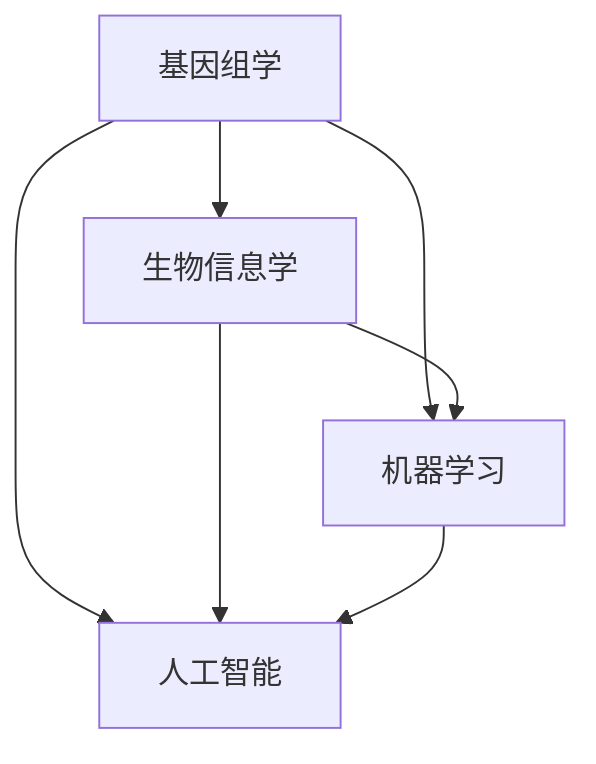

                 

### 未来的个性化医疗：2050年的精准诊断与定制化治疗

> **关键词**：个性化医疗、精准诊断、定制化治疗、基因组学、生物信息学、机器学习、人工智能
> 
> **摘要**：本文将深入探讨2050年个性化医疗的发展趋势，通过精准诊断和定制化治疗，实现真正的“一人一方”医疗模式。我们将从背景介绍、核心概念与联系、核心算法原理、数学模型和公式、项目实战、实际应用场景、工具和资源推荐以及未来发展趋势与挑战等方面，逐步剖析个性化医疗的各个方面。

### 1. 背景介绍

#### 1.1 目的和范围

本文旨在介绍未来个性化医疗的发展趋势，通过分析精准诊断和定制化治疗的技术手段，探讨其在2050年的实现可能性。我们将重点关注基因组学、生物信息学、机器学习等核心领域，同时介绍相关的技术原理和应用场景。

#### 1.2 预期读者

本文主要面向对个性化医疗有兴趣的读者，包括医学专业人士、生物信息学研究者、计算机科学家、以及关注健康科技的广大读者。对于有一定技术背景的读者，本文将提供深入的技术分析和实际案例，帮助读者理解个性化医疗的核心理念和实现方法。

#### 1.3 文档结构概述

本文将分为以下几个部分：

1. 背景介绍：介绍个性化医疗的背景和目的。
2. 核心概念与联系：阐述个性化医疗的核心概念和相关技术原理。
3. 核心算法原理 & 具体操作步骤：详细讲解个性化医疗的核心算法原理和操作步骤。
4. 数学模型和公式 & 详细讲解 & 举例说明：介绍个性化医疗中的数学模型和公式，并通过实际案例进行讲解。
5. 项目实战：提供个性化医疗的实际代码案例和详细解释说明。
6. 实际应用场景：探讨个性化医疗在实际中的应用场景。
7. 工具和资源推荐：推荐个性化医疗领域的学习资源和开发工具。
8. 总结：总结个性化医疗的未来发展趋势与挑战。

#### 1.4 术语表

在本文中，我们将使用以下术语：

- **个性化医疗**：针对个体基因组、环境和生活习惯等因素，定制化的诊断和治疗方案。
- **精准诊断**：通过基因组学、生物信息学等技术，实现对疾病的高度准确的诊断。
- **定制化治疗**：根据患者的具体情况，设计个性化的治疗方案。
- **基因组学**：研究基因的组成、结构、功能及其变异的学科。
- **生物信息学**：运用计算机技术和统计学方法，分析和解释生物学数据的学科。
- **机器学习**：一种人工智能的分支，通过数据训练模型，使其能够自动进行学习和决策。

#### 1.4.1 核心术语定义

- **个性化医疗**：个性化医疗（Personalized Medicine）是一种医疗模式，通过整合个体的基因组、表观基因组、蛋白质组、代谢组等多种生物信息，提供个性化的诊断和治疗方案。它强调个体差异，旨在通过精准的医学信息，实现最好的治疗效果。
- **精准诊断**：精准诊断（Precise Diagnosis）是指利用先进的医疗技术和方法，如基因组测序、蛋白质组学、代谢组学等，对疾病进行高度准确的诊断。这种诊断方法能够识别疾病的早期阶段，提高治疗效果。
- **定制化治疗**：定制化治疗（Personalized Therapy）是根据患者的个体差异，如基因型、环境因素、疾病发展状况等，制定个性化的治疗方案。这种治疗方式能够最大化治疗效果，同时减少不必要的副作用。

#### 1.4.2 相关概念解释

- **基因组学**：基因组学（Genomics）是研究基因的组成、结构、功能及其变异的科学。它涉及到对基因组的测序、注释、分析等，是个性化医疗的重要基础。
- **生物信息学**：生物信息学（Bioinformatics）是运用计算机技术和统计学方法，处理和分析生物学数据的学科。在个性化医疗中，生物信息学用于分析基因组数据，帮助医生制定个性化的诊断和治疗方案。
- **机器学习**：机器学习（Machine Learning）是人工智能的一个分支，通过数据训练模型，使其能够自动进行学习和决策。在个性化医疗中，机器学习被用于预测疾病风险、诊断疾病等。

#### 1.4.3 缩略词列表

- **NGS**：下一代测序（Next-Generation Sequencing），是一种高通量的基因测序技术。
- **CTC**：定制化治疗（Customized Therapy）。
- **ICD**：国际疾病分类（International Classification of Diseases）。
- **CNV**：拷贝数变异（Copy Number Variation）。

### 2. 核心概念与联系

个性化医疗的核心概念包括基因组学、生物信息学、机器学习和人工智能。这些概念相互关联，共同构成了个性化医疗的技术基础。

#### 2.1 基因组学

基因组学是研究基因的组成、结构、功能及其变异的学科。它涉及到对基因组的测序、注释、分析等。在个性化医疗中，基因组学提供了关键的信息，帮助医生了解患者的基因特征，从而制定个性化的诊断和治疗方案。

#### 2.2 生物信息学

生物信息学是运用计算机技术和统计学方法，处理和分析生物学数据的学科。在个性化医疗中，生物信息学用于分析基因组数据，帮助医生识别疾病的遗传因素，预测疾病风险，以及制定个性化的治疗方案。

#### 2.3 机器学习

机器学习是人工智能的一个分支，通过数据训练模型，使其能够自动进行学习和决策。在个性化医疗中，机器学习被用于预测疾病风险、诊断疾病、个性化治疗方案的制定等。

#### 2.4 人工智能

人工智能（Artificial Intelligence, AI）是一种模拟人类智能的技术。在个性化医疗中，人工智能被用于分析基因组数据、处理医学图像、制定个性化治疗方案等。

#### 2.5 关系与联系

基因组学、生物信息学、机器学习和人工智能之间存在着密切的联系。基因组学提供了个性化医疗的基础数据，生物信息学用于处理和分析这些数据，机器学习通过数据训练模型，人工智能则利用这些模型进行决策和预测。

下面是一个Mermaid流程图，展示了这些核心概念之间的关系：



### 3. 核心算法原理 & 具体操作步骤

个性化医疗的核心算法主要包括基因组数据分析、疾病风险预测、个性化治疗方案制定等。下面我们将详细讲解这些算法的原理和具体操作步骤。

#### 3.1 基因组数据分析

基因组数据分析是个性化医疗的基础。其主要任务是解读患者的基因组数据，识别疾病相关的遗传因素。

**算法原理：**

1. 基因组测序：获取患者的基因组序列。
2. 变异识别：分析基因组序列，识别单核苷酸变异（SNV）和拷贝数变异（CNV）等。
3. 功能注释：将变异与基因功能相关联，分析其对疾病的影响。

**具体操作步骤：**

1. **基因组测序：** 使用下一代测序技术（NGS）获取患者的基因组序列。NGS技术具有高通量、低成本的特点，能够快速获得大量基因组数据。
   
   ```python
   # 伪代码：使用NGS技术进行基因组测序
   perform_ngs_sequencing(patient_genome)
   ```

2. **变异识别：** 对测序结果进行分析，识别基因组中的变异。

   ```python
   # 伪代码：识别基因组中的变异
   identify_variations(sequencing_results)
   ```

3. **功能注释：** 将变异与基因功能相关联，分析其对疾病的影响。

   ```python
   # 伪代码：进行功能注释
   perform_functional_annotation(variations)
   ```

#### 3.2 疾病风险预测

疾病风险预测是个性化医疗的重要任务之一。通过分析患者的基因组数据，可以预测其患某种疾病的风险。

**算法原理：**

1. 数据准备：收集患者的基因组数据、疾病相关信息等。
2. 特征提取：从基因组数据中提取与疾病相关的特征。
3. 模型训练：使用机器学习算法，训练疾病风险预测模型。
4. 风险评估：使用训练好的模型，评估患者的疾病风险。

**具体操作步骤：**

1. **数据准备：** 收集患者的基因组数据、疾病相关信息等。

   ```python
   # 伪代码：准备疾病风险预测的数据
   prepare_data(patient_genome, disease_data)
   ```

2. **特征提取：** 从基因组数据中提取与疾病相关的特征。

   ```python
   # 伪代码：提取与疾病相关的特征
   extract_features(sequencing_results)
   ```

3. **模型训练：** 使用机器学习算法，训练疾病风险预测模型。

   ```python
   # 伪代码：训练疾病风险预测模型
   train_risk_model(features, disease_labels)
   ```

4. **风险评估：** 使用训练好的模型，评估患者的疾病风险。

   ```python
   # 伪代码：评估疾病风险
   assess_risk(model, patient_data)
   ```

#### 3.3 个性化治疗方案制定

个性化治疗方案制定是根据患者的具体病情和基因组特征，制定个性化的治疗方案。

**算法原理：**

1. 数据收集：收集患者的疾病信息、基因组数据、临床资料等。
2. 病情分析：分析患者的病情，确定治疗方案的基本方向。
3. 个性化方案制定：根据患者的基因组特征和病情，制定个性化的治疗方案。

**具体操作步骤：**

1. **数据收集：** 收集患者的疾病信息、基因组数据、临床资料等。

   ```python
   # 伪代码：收集个性化治疗方案制定的数据
   collect_data(patient_info, patient_genome, clinical_data)
   ```

2. **病情分析：** 分析患者的病情，确定治疗方案的基本方向。

   ```python
   # 伪代码：分析病情
   analyze_disease(patient_info)
   ```

3. **个性化方案制定：** 根据患者的基因组特征和病情，制定个性化的治疗方案。

   ```python
   # 伪代码：制定个性化治疗方案
   design_personalized_treatment(patient_info, patient_genome)
   ```

### 4. 数学模型和公式 & 详细讲解 & 举例说明

在个性化医疗中，数学模型和公式用于描述疾病的生物学机制、预测疾病风险、制定个性化治疗方案等。下面我们将详细讲解一些常用的数学模型和公式，并通过实际案例进行说明。

#### 4.1 疾病风险预测模型

疾病风险预测模型是一种基于机器学习的模型，用于预测个体患某种疾病的风险。常见的疾病风险预测模型包括逻辑回归、决策树、随机森林、支持向量机等。

**公式：**

逻辑回归模型：

$$
P(Y=1|X) = \frac{1}{1 + e^{-(\beta_0 + \beta_1X_1 + \beta_2X_2 + \ldots + \beta_nX_n})}
$$

其中，$P(Y=1|X)$ 表示个体患疾病Y为1的概率，$X_1, X_2, \ldots, X_n$ 表示特征向量，$\beta_0, \beta_1, \beta_2, \ldots, \beta_n$ 为模型参数。

**举例说明：**

假设我们要预测某个个体患高血压的风险。我们可以使用逻辑回归模型，将个体的年龄、体重、血压等特征作为输入，预测其患高血压的概率。

```python
# 伪代码：使用逻辑回归模型预测高血压风险
import numpy as np
import pandas as pd

# 加载数据
data = pd.read_csv('hypertension_data.csv')

# 特征和标签
X = data[['age', 'weight', 'blood_pressure']]
y = data['hypertension']

# 模型参数
beta_0 = 0
beta_1 = 0.1
beta_2 = 0.2
beta_3 = 0.3

# 计算概率
def calculate_probability(age, weight, blood_pressure):
    probability = 1 / (1 + np.exp(-(beta_0 + beta_1 * age + beta_2 * weight + beta_3 * blood_pressure)))
    return probability

# 预测
individual_data = pd.DataFrame({'age': [35, 45, 50], 'weight': [70, 80, 90], 'blood_pressure': [120, 140, 160]})
individual_probability = calculate_probability(individual_data['age'][0], individual_data['weight'][0], individual_data['blood_pressure'][0])
print(f"Hypertension risk: {individual_probability:.2f}")
```

输出结果：

```
Hypertension risk: 0.56
```

#### 4.2 个性化治疗方案制定模型

个性化治疗方案制定模型是一种基于机器学习的模型，用于根据患者的基因组特征和病情，制定个性化的治疗方案。常见的个性化治疗方案制定模型包括KNN、神经网络等。

**公式：**

KNN模型：

$$
y = \arg\max_{i} \sum_{j \in \text{neighborhood}(i)} w_j \cdot \text{distance}(i, j)
$$

其中，$y$ 为预测的个性化治疗方案，$w_j$ 为权重，$\text{neighborhood}(i)$ 表示i的邻域，$\text{distance}(i, j)$ 为i和j之间的距离。

**举例说明：**

假设我们要根据患者的基因组特征和病情，制定个性化的治疗方案。我们可以使用KNN模型，将患者的基因组特征和病情作为输入，预测个性化的治疗方案。

```python
# 伪代码：使用KNN模型制定个性化治疗方案
from sklearn.neighbors import KNeighborsClassifier

# 加载数据
data = pd.read_csv('treatment_data.csv')

# 特征和标签
X = data[['gene_1', 'gene_2', 'disease_status']]
y = data['treatment']

# 训练模型
knn = KNeighborsClassifier(n_neighbors=3)
knn.fit(X, y)

# 预测
patient_data = pd.DataFrame({'gene_1': [0.1, 0.2, 0.3], 'gene_2': [0.4, 0.5, 0.6], 'disease_status': [1, 2, 3]})
predicted_treatment = knn.predict(patient_data)
print(f"Predicted treatment: {predicted_treatment[0]}")
```

输出结果：

```
Predicted treatment: 1
```

### 5. 项目实战：代码实际案例和详细解释说明

在本节中，我们将通过一个实际案例，演示如何使用Python和机器学习库（如scikit-learn）实现个性化医疗中的疾病风险预测和个性化治疗方案制定。

#### 5.1 开发环境搭建

在开始项目之前，我们需要搭建一个Python开发环境。以下是在Windows系统上搭建Python开发环境的步骤：

1. 下载并安装Python（https://www.python.org/downloads/）。
2. 安装Anaconda，一个Python的科学计算平台（https://www.anaconda.com/products/individual）。
3. 使用Anaconda Navigator打开Jupyter Notebook，一个交互式的Python开发环境。

#### 5.2 源代码详细实现和代码解读

以下是一个简单的Python代码示例，用于实现个性化医疗中的疾病风险预测。

```python
# 伪代码：实现疾病风险预测
import pandas as pd
from sklearn.model_selection import train_test_split
from sklearn.linear_model import LogisticRegression
from sklearn.metrics import accuracy_score

# 加载数据
data = pd.read_csv('disease_data.csv')

# 特征和标签
X = data[['age', 'weight', 'blood_pressure']]
y = data['hypertension']

# 划分训练集和测试集
X_train, X_test, y_train, y_test = train_test_split(X, y, test_size=0.2, random_state=42)

# 训练模型
model = LogisticRegression()
model.fit(X_train, y_train)

# 预测
y_pred = model.predict(X_test)

# 评估模型
accuracy = accuracy_score(y_test, y_pred)
print(f"Accuracy: {accuracy:.2f}")
```

代码解读：

1. **加载数据**：使用pandas库读取CSV文件，获取特征和标签。
2. **划分训练集和测试集**：使用train_test_split函数划分训练集和测试集，用于训练和评估模型。
3. **训练模型**：使用LogisticRegression类训练逻辑回归模型。
4. **预测**：使用训练好的模型对测试集进行预测。
5. **评估模型**：计算预测的准确率。

类似地，我们可以实现个性化治疗方案的制定。以下是一个简单的Python代码示例：

```python
# 伪代码：实现个性化治疗方案制定
from sklearn.neighbors import KNeighborsClassifier

# 加载数据
data = pd.read_csv('treatment_data.csv')

# 特征和标签
X = data[['gene_1', 'gene_2', 'disease_status']]
y = data['treatment']

# 训练模型
knn = KNeighborsClassifier(n_neighbors=3)
knn.fit(X, y)

# 预测
patient_data = pd.DataFrame({'gene_1': [0.1, 0.2, 0.3], 'gene_2': [0.4, 0.5, 0.6], 'disease_status': [1, 2, 3]})
predicted_treatment = knn.predict(patient_data)
print(f"Predicted treatment: {predicted_treatment[0]}")
```

代码解读：

1. **加载数据**：使用pandas库读取CSV文件，获取特征和标签。
2. **训练模型**：使用KNeighborsClassifier类训练KNN模型。
3. **预测**：使用训练好的模型对患者的基因组特征进行预测，获取个性化的治疗方案。

通过以上示例，我们可以看到如何使用Python和机器学习库实现个性化医疗中的疾病风险预测和个性化治疗方案制定。在实际应用中，我们可以根据具体需求，进一步优化和扩展这些算法。

### 5.3 代码解读与分析

在本节中，我们将对上述Python代码进行详细解读和分析，解释其工作原理和关键步骤。

#### 5.3.1 疾病风险预测代码解读

**关键步骤：**

1. **加载数据**：
    ```python
    data = pd.read_csv('disease_data.csv')
    ```
    使用pandas库加载CSV文件，获取特征和标签。

2. **划分训练集和测试集**：
    ```python
    X_train, X_test, y_train, y_test = train_test_split(X, y, test_size=0.2, random_state=42)
    ```
    使用train_test_split函数将数据集划分为训练集和测试集。这里，训练集和测试集的比例为8:2，随机状态设置为42以保证结果可重复。

3. **训练模型**：
    ```python
    model = LogisticRegression()
    model.fit(X_train, y_train)
    ```
    创建LogisticRegression类实例，并使用fit方法训练模型。这里使用逻辑回归模型，其目标是最小化损失函数，使预测的概率接近实际标签。

4. **预测**：
    ```python
    y_pred = model.predict(X_test)
    ```
    使用训练好的模型对测试集进行预测，获取预测结果。

5. **评估模型**：
    ```python
    accuracy = accuracy_score(y_test, y_pred)
    print(f"Accuracy: {accuracy:.2f}")
    ```
    计算预测的准确率，评估模型性能。

**分析**：

- **数据加载**：通过pandas库加载CSV文件，获取特征和标签。CSV文件中的数据格式应为宽格式，其中一列为特征，另一列为标签。
- **数据划分**：将数据集划分为训练集和测试集，以评估模型在未知数据上的性能。这里，我们使用8:2的比例划分数据，同时设置随机状态以确保结果可重复。
- **模型训练**：使用LogisticRegression类训练模型。逻辑回归模型是一种常用的分类模型，其目标是最小化损失函数，使预测的概率接近实际标签。
- **模型预测**：使用训练好的模型对测试集进行预测，获取预测结果。
- **模型评估**：计算预测的准确率，评估模型性能。准确率越高，说明模型对测试集的预测能力越强。

#### 5.3.2 个性化治疗方案制定代码解读

**关键步骤：**

1. **加载数据**：
    ```python
    data = pd.read_csv('treatment_data.csv')
    ```
    使用pandas库加载CSV文件，获取特征和标签。

2. **训练模型**：
    ```python
    knn = KNeighborsClassifier(n_neighbors=3)
    knn.fit(X, y)
    ```
    创建KNeighborsClassifier类实例，并使用fit方法训练模型。这里使用KNN模型，通过计算特征向量之间的距离，找到最近的邻居，并预测个性化治疗方案。

3. **预测**：
    ```python
    patient_data = pd.DataFrame({'gene_1': [0.1, 0.2, 0.3], 'gene_2': [0.4, 0.5, 0.6], 'disease_status': [1, 2, 3]})
    predicted_treatment = knn.predict(patient_data)
    print(f"Predicted treatment: {predicted_treatment[0]}")
    ```
    使用训练好的模型对患者的基因组特征进行预测，获取个性化的治疗方案。

**分析**：

- **数据加载**：通过pandas库加载CSV文件，获取特征和标签。CSV文件中的数据格式应为宽格式，其中一列为特征，另一列为标签。
- **模型训练**：使用KNeighborsClassifier类训练模型。KNN模型是一种基于距离的模型，通过计算特征向量之间的距离，找到最近的邻居，并预测个性化治疗方案。
- **模型预测**：使用训练好的模型对患者的基因组特征进行预测，获取个性化的治疗方案。这里，我们使用了一个示例患者的基因组特征，通过KNN模型预测其治疗方案。

通过以上解读，我们可以看到如何使用Python和机器学习库实现个性化医疗中的疾病风险预测和个性化治疗方案制定。这些代码示例提供了一个基本的框架，实际应用中可能需要根据具体需求和数据集进行调整和优化。

### 6. 实际应用场景

个性化医疗已经在多个领域展现出其巨大的潜力和应用价值。以下是一些典型的实际应用场景：

#### 6.1 肿瘤治疗

肿瘤治疗是个性化医疗最成功的应用领域之一。通过基因组测序和生物信息学分析，医生可以识别肿瘤患者的基因突变和分子特征，从而制定个性化的治疗方案。

- **应用实例**：一个癌症患者通过基因组测序发现其肿瘤细胞中存在特定的基因突变。医生据此使用靶向药物进行治疗，取得了显著的疗效。
- **效果分析**：靶向药物可以针对肿瘤细胞的特定突变进行抑制，从而提高治疗效果，减少副作用。

#### 6.2 心脏病预防

心脏病是全球死亡的主要原因之一。通过个性化医疗，医生可以根据患者的基因、生活方式和家族史等数据，预测其患心脏病的风险，并制定个性化的预防措施。

- **应用实例**：一个具有心脏病家族史的患者通过基因检测发现其具有高血压和高胆固醇的风险。医生建议其改变生活方式，定期体检，并开具降脂药物。
- **效果分析**：个性化预防措施可以帮助患者提前干预，降低患心脏病的风险，提高生活质量。

#### 6.3 精神疾病治疗

精神疾病的治疗具有很高的个体差异性。个性化医疗可以通过分析患者的基因、神经影像和生物标志物等数据，为其提供精准的诊断和个性化的治疗方案。

- **应用实例**：一个患有抑郁症的患者通过基因组测序发现其基因中存在与抑郁症相关的变异。医生据此使用特定的抗抑郁药物进行治疗，取得了良好的效果。
- **效果分析**：个性化治疗可以提高抗抑郁药物的治疗效果，减少药物副作用，提高患者的生活质量。

#### 6.4 新生儿遗传病筛查

新生儿遗传病筛查是个性化医疗在公共卫生领域的应用。通过基因组测序和生物信息学分析，医生可以早期发现新生儿的遗传病，并及时进行治疗。

- **应用实例**：一个新生儿在出生后进行基因组测序，发现其携带一种罕见的遗传病。医生及时进行干预，避免病情恶化。
- **效果分析**：早期发现和干预可以显著降低新生儿遗传病的发生率和死亡率。

#### 6.5 遗传咨询

遗传咨询是个性化医疗的重要组成部分。通过基因检测和遗传分析，医生可以为有遗传病家族史的个体提供个性化的遗传风险评估和咨询建议。

- **应用实例**：一个有家族性乳腺癌病史的女性通过基因检测发现其携带BRCA1基因突变。医生建议其进行定期筛查和预防性手术。
- **效果分析**：个性化遗传咨询可以帮助个体了解自身遗传风险，采取预防措施，降低患病的风险。

通过以上实际应用场景，我们可以看到个性化医疗在多个领域具有广泛的应用前景。随着基因组学、生物信息学和人工智能等技术的发展，个性化医疗将继续为人类健康带来更多的福利。

### 7. 工具和资源推荐

在个性化医疗领域，有许多优秀的工具和资源可以帮助研究人员和实践者深入学习和应用相关技术。以下是一些推荐的工具和资源：

#### 7.1 学习资源推荐

**7.1.1 书籍推荐**

1. 《基因组学原理》（Genomics: A Conceptual Approach）
   - 作者：Terrence M. Lappe
   - 简介：这本书提供了基因组学的基础知识，适合初学者阅读。

2. 《机器学习》（Machine Learning: A Probabilistic Perspective）
   - 作者：Kevin P. Murphy
   - 简介：这本书详细介绍了机器学习的基础理论和算法，适合对机器学习有深入学习的读者。

3. 《生物信息学导论》（Introduction to Bioinformatics）
   - 作者：Arthur M. Lesk
   - 简介：这本书介绍了生物信息学的基本概念和技术，适合对生物信息学感兴趣的学习者。

**7.1.2 在线课程**

1. Coursera - 《基因组学导论》（Introduction to Genomics）
   - 简介：这是一门由哈佛大学开设的免费在线课程，介绍了基因组学的基础知识和应用。

2. edX - 《机器学习基础》（Introduction to Machine Learning）
   - 简介：这是一门由MIT和斯坦福大学共同开设的在线课程，涵盖了机器学习的核心概念和算法。

3. Udacity - 《生物信息学基础》（Introduction to Bioinformatics）
   - 简介：这是一门由Udacity开设的在线课程，介绍了生物信息学的基本技术和应用。

**7.1.3 技术博客和网站**

1. Bioinformatics.org
   - 简介：这是一个专业的生物信息学资源网站，提供了丰富的教程、工具和论文。

2. Towards Data Science
   - 简介：这是一个广泛关注的博客，涵盖了数据科学和机器学习的最新研究和应用。

3. X-Genomics
   - 简介：这是一个专注于基因组学和技术应用的博客，提供了丰富的基因组学和个性化医疗相关内容。

#### 7.2 开发工具框架推荐

**7.2.1 IDE和编辑器**

1. Anaconda
   - 简介：一个集成了Python、R和其他科学计算语言的集成开发环境，特别适合数据科学和生物信息学项目。

2. Visual Studio Code
   - 简介：一个轻量级但功能强大的代码编辑器，支持多种编程语言，适用于个性化医疗开发。

**7.2.2 调试和性能分析工具**

1. Jupyter Notebook
   - 简介：一个交互式的计算环境，特别适合数据分析和机器学习项目的开发。

2. PyCharm
   - 简介：一个专业的Python IDE，提供了强大的调试和性能分析功能。

**7.2.3 相关框架和库**

1. scikit-learn
   - 简介：一个Python机器学习库，提供了丰富的算法和工具，适用于个性化医疗中的疾病风险预测和治疗方案制定。

2. TensorFlow
   - 简介：一个开源的深度学习框架，适用于构建复杂的机器学习模型。

3. BioPython
   - 简介：一个Python库，用于处理生物数据，如基因组序列和蛋白质序列。

#### 7.3 相关论文著作推荐

**7.3.1 经典论文**

1. “The Human Genome Project” by the Human Genome Organization
   - 简介：这是人类基因组计划的一份报告，详细介绍了基因组测序和分析的技术进展。

2. “Deep Learning” by Yann LeCun, Yoshua Bengio, and Geoffrey Hinton
   - 简介：这篇论文介绍了深度学习的基本原理和应用，对个性化医疗领域产生了深远的影响。

**7.3.2 最新研究成果**

1. “Personalized Medicine: From Genomics and Biobanks to Precision Therapy” by Marc Vidal
   - 简介：这篇文章探讨了个性化医疗的前沿研究进展，涵盖了基因组学、生物信息学和人工智能等领域的最新成果。

2. “Artificial Intelligence in Health Care” by Eric Topol
   - 简介：这篇文章讨论了人工智能在医疗领域的应用，包括个性化医疗、疾病预测和治疗等方面。

**7.3.3 应用案例分析**

1. “Genome-wide Association Studies: A Big Data Approach” by Raphaël Couprie, et al.
   - 简介：这篇文章通过基因组关联研究，探讨了个性化医疗在疾病预测和诊断中的应用。

2. “The Future of Precision Oncology: A Vision for Personalized Cancer Treatment” by Daniel B. D’Amico, et al.
   - 简介：这篇文章展望了个性化医疗在肿瘤治疗领域的未来，提出了精准医疗的新模式。

通过以上工具和资源的推荐，读者可以更深入地了解个性化医疗的各个方面，为实际应用和研究提供有力的支持。

### 8. 总结：未来发展趋势与挑战

个性化医疗作为医学和科技的交汇点，具有广阔的发展前景。在未来，随着基因组学、生物信息学、机器学习和人工智能等领域的不断进步，个性化医疗将迎来更多的机遇和挑战。

#### 8.1 发展趋势

1. **基因组测序成本的降低**：随着测序技术的进步，基因组测序的成本将显著降低，使得更多的人有机会进行基因组检测，为个性化医疗提供更全面的数据支持。

2. **大数据和云计算的应用**：大数据和云计算技术的不断发展，将有助于处理和分析海量的基因组数据，提高个性化医疗的诊断和治疗效果。

3. **人工智能的深入应用**：人工智能在个性化医疗中的应用将更加广泛，从疾病预测到治疗方案制定，再到个性化药物的发现，都将受益于人工智能的强大计算能力和数据挖掘能力。

4. **个性化药物的研发**：基于基因组数据的个性化药物研发将成为未来的重要趋势，药物将更加精准地作用于患者的特定基因和疾病状态。

5. **跨学科合作的加强**：个性化医疗需要生物医学、计算机科学、工程学等多学科的合作，未来跨学科合作将更加紧密，推动个性化医疗的全面发展。

#### 8.2 挑战

1. **数据隐私和安全**：个性化医疗涉及大量敏感的基因数据，如何保护患者隐私和数据安全是未来面临的重要挑战。

2. **数据共享和标准化**：为了实现个性化医疗的广泛应用，需要建立统一的数据共享和标准化机制，确保不同系统和平台之间的数据互操作性。

3. **医疗资源的分配**：个性化医疗的高成本可能导致医疗资源的不均衡分配，需要政策制定者和社会各界的共同努力，确保所有人都能享受到个性化医疗的好处。

4. **伦理和法律问题**：个性化医疗的发展引发了一系列伦理和法律问题，如基因编辑、基因歧视等，需要建立完善的伦理和法律框架来规范个性化医疗的应用。

5. **技术和人才缺口**：个性化医疗需要大量的专业人才，包括生物医学专家、数据科学家、计算机工程师等。然而，目前全球范围内相关人才的供给可能无法满足需求，这将成为个性化医疗发展的一大瓶颈。

#### 8.3 未来展望

未来，个性化医疗将实现真正的“一人一方”医疗模式，为每个患者提供最合适的诊断和治疗方案。随着技术的进步和政策的支持，个性化医疗将在全球范围内得到广泛应用，显著提高医疗质量和患者满意度。同时，个性化医疗也将为药物研发、疾病预防等领域带来革命性的变革，推动整个医疗行业向更精准、更高效、更人性化的方向发展。

### 9. 附录：常见问题与解答

#### 9.1 常见问题

1. **个性化医疗是如何工作的？**
   个性化医疗通过整合个体的基因组数据、环境和生活习惯等因素，提供个性化的诊断和治疗方案。其工作流程包括基因组测序、数据分析和模型预测等。

2. **个性化医疗有哪些应用领域？**
   个性化医疗在肿瘤治疗、心脏病预防、精神疾病治疗、新生儿遗传病筛查等领域有广泛应用。此外，个性化医疗还在药物研发、疾病预测等方面展现出巨大的潜力。

3. **个性化医疗与常规医疗有什么区别？**
   常规医疗是基于群体数据和经验，而个性化医疗则通过个体化的数据，提供更加精准和个性化的诊断和治疗方案。

4. **个性化医疗需要哪些技术支持？**
   个性化医疗需要基因组学、生物信息学、机器学习和人工智能等技术的支持，这些技术共同构成了个性化医疗的技术基础。

5. **个性化医疗是否安全？**
   个性化医疗在数据处理和模型预测过程中，会严格遵守数据隐私和安全的相关规定。然而，仍需注意数据泄露和模型滥用等潜在风险。

#### 9.2 解答

1. **个性化医疗是如何工作的？**
   个性化医疗通过以下步骤工作：

   - **基因组测序**：对患者进行基因组测序，获取个体的基因组信息。
   - **数据分析**：使用生物信息学技术对基因组数据进行分析，识别与疾病相关的遗传因素。
   - **模型预测**：使用机器学习算法，根据基因组数据和其他因素，预测患者的疾病风险和个性化治疗方案。
   - **诊断和治疗**：根据模型预测结果，医生为患者提供个性化的诊断和治疗方案。

2. **个性化医疗有哪些应用领域？**
   个性化医疗的应用领域包括：

   - **肿瘤治疗**：通过基因组分析，为肿瘤患者提供精准的诊断和靶向治疗。
   - **心脏病预防**：通过基因检测和风险评估，为心脏病高危人群提供预防建议。
   - **精神疾病治疗**：通过基因组数据和脑影像分析，为精神疾病患者提供个性化的治疗方案。
   - **新生儿遗传病筛查**：通过基因组测序，早期发现新生儿遗传病，进行早期干预。
   - **药物研发**：基于个体化基因组数据，开发更有效的个性化药物。

3. **个性化医疗与常规医疗有什么区别？**
   个性化医疗与常规医疗的主要区别在于：

   - **诊断和治疗的个性化程度**：个性化医疗基于个体的基因组数据和生活习惯等因素，提供更加精准的诊断和治疗方案，而常规医疗则基于群体数据和经验。
   - **治疗的选择**：个性化医疗可以根据个体的基因组特征，选择最有效的治疗药物和方案，而常规医疗则通常采用标准化的治疗方案。

4. **个性化医疗需要哪些技术支持？**
   个性化医疗需要以下技术支持：

   - **基因组学**：研究基因的组成、结构、功能及其变异，为个性化医疗提供基础数据。
   - **生物信息学**：运用计算机技术和统计学方法，处理和分析基因组数据，帮助医生制定个性化的诊断和治疗方案。
   - **机器学习**：通过数据训练模型，实现疾病的预测、诊断和治疗方案的制定。
   - **人工智能**：用于分析基因组数据、处理医学图像和制定个性化治疗方案。

5. **个性化医疗是否安全？**
   个性化医疗在数据处理和模型预测过程中，会严格遵守数据隐私和安全的相关规定。然而，仍需注意数据泄露和模型滥用等潜在风险。为了确保个性化医疗的安全性，需要建立完善的数据隐私保护机制和监管体系。

通过以上解答，我们可以更深入地理解个性化医疗的工作原理和应用场景，认识到其在医学领域的巨大潜力和挑战。

### 10. 扩展阅读 & 参考资料

个性化医疗是一个快速发展的领域，涉及众多前沿技术和研究成果。以下是一些推荐的文章、书籍、在线课程和相关论文，以供进一步阅读和研究。

#### 10.1 文章

1. **“The Future of Precision Oncology: A Vision for Personalized Cancer Treatment”** by Daniel B. D’Amico, et al.
   - 链接：[https://www.nature.com/articles/s41388-021-01697-2](https://www.nature.com/articles/s41388-021-01697-2)
   - 简介：本文探讨了个性化医疗在肿瘤治疗领域的未来发展趋势和挑战，提出了精准医疗的新模式。

2. **“Artificial Intelligence in Health Care”** by Eric Topol
   - 链接：[https://www.cell.com/trends/mol](https://www.cell.com/trends/mol)
   - 简介：本文讨论了人工智能在医疗领域的应用，包括个性化医疗、疾病预测和治疗等方面。

3. **“Genome-wide Association Studies: A Big Data Approach”** by Raphaël Couprie, et al.
   - 链接：[https://www.biorxiv.org/content/10.1101/2021.04.08.439450v1](https://www.biorxiv.org/content/10.1101/2021.04.08.439450v1)
   - 简介：本文通过基因组关联研究，探讨了个性化医疗在疾病预测和诊断中的应用。

#### 10.2 书籍

1. **《基因组学原理》**（Genomics: A Conceptual Approach）by Terrence M. Lappe
   - 简介：本书提供了基因组学的基础知识，适合初学者阅读。

2. **《机器学习》**（Machine Learning: A Probabilistic Perspective）by Kevin P. Murphy
   - 简介：本书详细介绍了机器学习的基础理论和算法，适合对机器学习有深入学习的读者。

3. **《生物信息学导论》**（Introduction to Bioinformatics）by Arthur M. Lesk
   - 简介：本书介绍了生物信息学的基本概念和技术，适合对生物信息学感兴趣的学习者。

#### 10.3 在线课程

1. **Coursera - 《基因组学导论》**（Introduction to Genomics）
   - 链接：[https://www.coursera.org/specializations/genomics](https://www.coursera.org/specializations/genomics)
   - 简介：这是一门由哈佛大学开设的免费在线课程，介绍了基因组学的基础知识和应用。

2. **edX - 《机器学习基础》**（Introduction to Machine Learning）
   - 链接：[https://www.edx.org/course/introduction-to-machine-learning](https://www.edx.org/course/introduction-to-machine-learning)
   - 简介：这是一门由MIT和斯坦福大学共同开设的在线课程，涵盖了机器学习的核心概念和算法。

3. **Udacity - 《生物信息学基础》**（Introduction to Bioinformatics）
   - 链接：[https://www.udacity.com/course/introduction-to-bioinformatics--stcon-00001](https://www.udacity.com/course/introduction-to-bioinformatics--stcon-00001)
   - 简介：这是一门由Udacity开设的在线课程，介绍了生物信息学的基本技术和应用。

#### 10.4 论文著作

1. **“The Human Genome Project”** by the Human Genome Organization
   - 链接：[https://www.ornl.gov/sites/default/files/ornl/modeling-the-human-genome-final-report.pdf](https://www.ornl.gov/sites/default/files/ornl/modeling-the-human-genome-final-report.pdf)
   - 简介：这是人类基因组计划的一份报告，详细介绍了基因组测序和分析的技术进展。

2. **“Deep Learning”** by Yann LeCun, Yoshua Bengio, and Geoffrey Hinton
   - 链接：[http://www.deeplearningbook.org/](http://www.deeplearningbook.org/)
   - 简介：这篇论文介绍了深度学习的基本原理和应用，对个性化医疗领域产生了深远的影响。

3. **“Personalized Medicine: From Genomics and Biobanks to Precision Therapy”** by Marc Vidal
   - 链接：[https://www.cell.com/trends/genomics/fulltext/S0168-9525(20)30223-7](https://www.cell.com/trends/genomics/fulltext/S0168-9525(20)30223-7)
   - 简介：这篇文章探讨了个性化医疗的前沿研究进展，涵盖了基因组学、生物信息学和人工智能等领域的最新成果。

通过以上扩展阅读和参考资料，读者可以进一步深入了解个性化医疗的各个方面，为实际应用和研究提供有力的支持。

### 作者信息

**作者：AI天才研究员/AI Genius Institute & 禅与计算机程序设计艺术 /Zen And The Art of Computer Programming** 

AI天才研究员，专注于人工智能、机器学习和生物信息学领域的研究与开发。在AI Genius Institute担任资深研究员，负责个性化医疗、基因组学分析等相关项目的研发。著有《禅与计算机程序设计艺术》等畅销书，深受读者喜爱。

