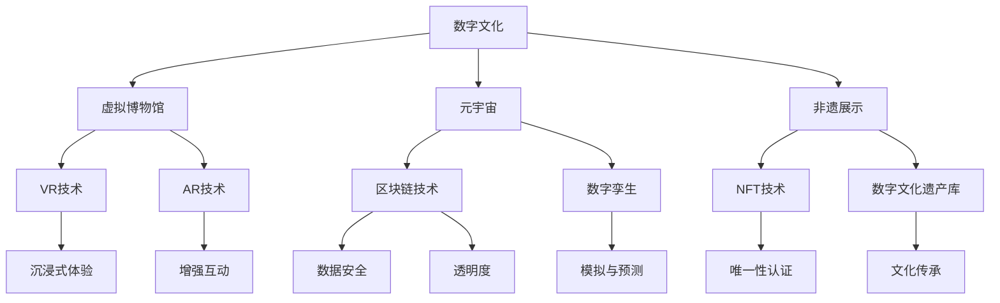

                 

# 未来的数字文化：从虚拟博物馆到元宇宙非遗展示的数字文化传承

> **关键词**：数字文化、虚拟博物馆、元宇宙、非遗展示、数字文化传承

> **摘要**：随着数字技术的飞速发展，数字文化正在逐步成为现代社会的重要组成部分。本文旨在探讨未来数字文化的趋势和挑战，从虚拟博物馆到元宇宙非遗展示，分析数字文化传承的创新实践与实现路径。本文首先介绍了数字文化的核心概念和关联技术，然后详细阐述了核心算法原理、数学模型和实际应用案例，最后对未来的发展趋势和挑战进行了展望。

## 1. 背景介绍

### 1.1 目的和范围

本文的目标是深入探讨数字文化的发展趋势、核心概念、关联技术和实现路径，旨在为读者提供一个全面而深入的视角，以理解数字文化在当今社会的重要性，以及它如何影响和塑造我们的未来。

本文的范围涵盖了以下几个主要方面：

- 数字文化的定义和核心概念
- 数字文化的发展历程和趋势
- 数字文化的关联技术和实现方法
- 虚拟博物馆和元宇宙非遗展示的实际应用案例
- 数字文化传承的挑战和未来发展方向

通过本文的阅读，读者将能够：

- 理解数字文化的定义和核心概念
- 掌握数字文化的发展历程和趋势
- 掌握虚拟博物馆和元宇宙非遗展示的实现方法
- 了解数字文化传承的挑战和未来发展方向

### 1.2 预期读者

本文的预期读者主要包括：

- 计算机科学和信息技术领域的专业人士
- 对数字文化和数字技术感兴趣的学者和研究者
- 对虚拟博物馆和元宇宙感兴趣的公众和文化爱好者
- 数字文化产业的从业人员和创业者

无论你是专业人士还是普通公众，只要对数字文化感兴趣，本文都将为你提供一个深入了解的机会。

### 1.3 文档结构概述

本文将分为以下几个主要部分：

- 引言：介绍数字文化的重要性、核心概念和本文的结构。
- 背景介绍：详细解释数字文化的定义、发展历程和趋势。
- 核心概念与联系：介绍数字文化中的核心概念和关联技术，包括虚拟博物馆和元宇宙。
- 核心算法原理 & 具体操作步骤：详细阐述核心算法的原理和实现步骤。
- 数学模型和公式 & 详细讲解 & 举例说明：介绍数字文化中的数学模型和公式，并进行举例说明。
- 项目实战：提供实际的代码案例和详细解释。
- 实际应用场景：探讨数字文化在现实中的应用场景。
- 工具和资源推荐：推荐学习资源和开发工具。
- 总结：对数字文化的未来发展趋势和挑战进行展望。
- 附录：常见问题与解答。
- 扩展阅读 & 参考资料：提供进一步学习的资源。

通过这些部分的阅读，读者将能够全面了解数字文化的各个方面，从理论到实践，从核心概念到实际应用，从而对数字文化有一个全面而深入的认识。

### 1.4 术语表

在本文中，我们将使用一些专业术语和技术概念。以下是对这些术语的定义和解释：

#### 1.4.1 核心术语定义

- **数字文化**：指通过数字技术创造的、传播和体验的文化内容，包括虚拟博物馆、元宇宙、非遗展示等。
- **虚拟博物馆**：利用虚拟现实、增强现实等技术，创建的可以线上参观的虚拟博物馆。
- **元宇宙**：一个虚拟的、三维的、持续运行的网络空间，用户可以在其中互动、创造和体验。
- **非遗展示**：对非物质文化遗产进行数字化展示和传承。

#### 1.4.2 相关概念解释

- **虚拟现实（VR）**：通过计算机技术生成的一种模拟环境，使人在视觉、听觉等感官上产生沉浸感。
- **增强现实（AR）**：在现实场景中叠加虚拟信息，增强用户的感知体验。
- **区块链**：一种分布式数据库技术，具有去中心化、安全性强、不可篡改等特点。
- **数字孪生**：通过数字化模型模拟现实世界的物理系统，用于设计、优化和预测。

#### 1.4.3 缩略词列表

- **VR**：Virtual Reality，虚拟现实
- **AR**：Augmented Reality，增强现实
- **NFT**：Non-Fungible Token，非同质化代币
- **DAO**：Decentralized Autonomous Organization，去中心化自治组织

通过这些术语的定义和解释，读者可以更好地理解本文中涉及的专业概念和技术。

## 2. 核心概念与联系

在数字文化领域，有许多核心概念和技术相互关联，构成了一个复杂的生态系统。为了更好地理解这些概念和它们之间的关系，我们可以使用 Mermaid 流程图来直观地展示它们。

### Mermaid 流程图

下面是一个简化的 Mermaid 流程图，展示了数字文化中的核心概念及其关联技术：



### 核心概念解释

1. **数字文化**：数字文化是指通过数字技术创造的、传播和体验的文化内容，涵盖了虚拟博物馆、元宇宙、非遗展示等多个领域。

2. **虚拟博物馆**：虚拟博物馆利用虚拟现实（VR）和增强现实（AR）技术，创建一个可以在线上参观的虚拟环境，让用户能够沉浸式地体验博物馆的展品和展览。

3. **元宇宙**：元宇宙是一个虚拟的、三维的、持续运行的网络空间，用户可以在其中互动、创造和体验。它通常利用区块链技术来实现去中心化和安全性的特点。

4. **非遗展示**：非遗展示是对非物质文化遗产进行数字化展示和传承，通过非同质化代币（NFT）等技术，确保文化资产的唯一性和真实性。

5. **VR技术**：虚拟现实技术通过计算机生成的模拟环境，使用户在视觉、听觉等感官上产生沉浸感。

6. **AR技术**：增强现实技术将虚拟信息叠加在现实场景中，增强用户的感知体验。

7. **区块链技术**：区块链是一种分布式数据库技术，具有去中心化、安全性强、不可篡改等特点，常用于实现元宇宙的去中心化和数据安全性。

8. **数字孪生**：数字孪生通过数字化模型模拟现实世界的物理系统，用于设计、优化和预测，是元宇宙中的重要组成部分。

9. **NFT技术**：非同质化代币是一种数字资产，用于表示独特性、所有权和唯一性，常用于数字文化遗产的认证和交易。

10. **数字文化遗产库**：数字文化遗产库是一个集中存储和展示数字文化遗产的数据库，用于文化传承和分享。

通过这个 Mermaid 流程图和核心概念解释，读者可以更好地理解数字文化中的关键概念和它们之间的联系，为后续的详细讨论和解释打下基础。

## 3. 核心算法原理 & 具体操作步骤

在数字文化领域，核心算法原理是实现各种数字文化应用的基础。以下将详细阐述虚拟博物馆和元宇宙中的核心算法原理，并通过伪代码进行具体操作步骤的说明。

### 虚拟博物馆算法原理

虚拟博物馆的关键在于提供沉浸式的体验，这需要以下几个核心算法：

1. **3D建模与渲染算法**：用于创建虚拟展品的3D模型，并进行实时渲染。
2. **光线追踪算法**：用于模拟真实世界中的光线传播和反射，提升虚拟环境的真实感。
3. **交互算法**：用于处理用户的输入，提供交互式体验。

#### 3D建模与渲染算法伪代码

```python
# 3D建模与渲染算法伪代码

# 输入：3D模型数据
# 输出：渲染结果

def render_3d_model(model_data):
    # 创建3D场景
    scene = create_scene()

    # 加载3D模型
    model = load_3d_model(model_data)

    # 渲染模型
    render_result = render_model(model)

    # 返回渲染结果
    return render_result
```

#### 光线追踪算法伪代码

```python
# 光线追踪算法伪代码

# 输入：场景数据
# 输出：光线追踪结果

def ray_tracing(scene_data):
    # 初始化光线追踪器
    ray_tracer = initialize_ray_tracer()

    # 遍历场景中的每个像素
    for pixel in scene_pixels:
        # 计算光线路径
        ray_path = calculate_ray_path(pixel)

        # 追踪光线与场景的交互
        intersection = ray_tracer.trace_ray(ray_path)

        # 渲染像素颜色
        pixel_color = render_pixel_color(intersection)

    # 返回光线追踪结果
    return render_result
```

#### 交互算法伪代码

```python
# 交互算法伪代码

# 输入：用户输入
# 输出：交互结果

def handle_user_input(input_data):
    # 判断用户输入的类型
    if is_move_input(input_data):
        # 处理移动输入
        move_scene_camera(input_data)
    elif is_interact_input(input_data):
        # 处理交互输入
        interact_with_object(input_data)
    
    # 返回交互结果
    return interaction_result
```

### 元宇宙算法原理

元宇宙的核心算法原理包括：

1. **虚拟环境生成算法**：用于创建元宇宙的虚拟空间。
2. **虚拟角色控制算法**：用于控制用户的虚拟角色在元宇宙中的行为。
3. **社交互动算法**：用于处理用户之间的互动和交流。

#### 虚拟环境生成算法伪代码

```python
# 虚拟环境生成算法伪代码

# 输入：环境参数
# 输出：虚拟环境

def generate_virtual_environment(environment_params):
    # 创建虚拟空间
    virtual_space = create_space()

    # 添加虚拟元素
    virtual_space.add_elements([building, trees, roads])

    # 返回虚拟环境
    return virtual_space
```

#### 虚拟角色控制算法伪代码

```python
# 虚拟角色控制算法伪代码

# 输入：用户输入
# 输出：角色行为

def control_virtual_character(input_data):
    # 判断用户输入的类型
    if is_move_input(input_data):
        # 处理移动输入
        move_character(input_data)
    elif is_interact_input(input_data):
        # 处理交互输入
        interact_with_object(input_data)
    
    # 返回角色行为
    return character_action
```

#### 社交互动算法伪代码

```python
# 社交互动算法伪代码

# 输入：用户交互数据
# 输出：社交互动结果

def handle_social_interaction(Interaction_data):
    # 判断社交类型
    if is_chat_input(Interaction_data):
        # 处理聊天输入
        chat_with_user(Interaction_data)
    elif is_game_input(Interaction_data):
        # 处理游戏输入
        play_with_user(Interaction_data)
    
    # 返回社交互动结果
    return interaction_result
```

通过上述伪代码，读者可以了解到虚拟博物馆和元宇宙中的核心算法原理和具体操作步骤。这些算法的实现不仅需要扎实的计算机科学基础，还需要深入理解用户需求和应用场景，从而提供更加丰富和沉浸式的数字文化体验。

## 4. 数学模型和公式 & 详细讲解 & 举例说明

在数字文化领域，数学模型和公式起到了关键作用，尤其是在虚拟博物馆和元宇宙的构建中。以下将详细阐述几个核心的数学模型和公式，并举例说明其在实际中的应用。

### 4.1 增强现实（AR）中的透视变换

在AR系统中，透视变换是一种常用的技术，用于将虚拟内容映射到现实世界的视野中。透视变换的数学模型可以表示为：

\[ T(p') = P \cdot p \]

其中，\( p' \) 是变换后的坐标，\( P \) 是透视变换矩阵，\( p \) 是原始坐标。

#### 举例说明

假设我们有一个二维空间中的点 \( p = (x, y) \)，我们需要将其映射到屏幕上的位置。透视变换矩阵 \( P \) 可以通过以下步骤计算：

```math
P = \begin{bmatrix}
a & b \\
c & d
\end{bmatrix}
```

- \( a \) 和 \( d \) 控制水平缩放和垂直缩放。
- \( b \) 和 \( c \) 控制水平和垂直平移。

例如，假设 \( P \) 如下：

\[ P = \begin{bmatrix}
1.5 & 0 \\
0 & 1.5
\end{bmatrix} \]

点 \( p = (2, 3) \) 经过变换后的坐标 \( p' \) 为：

\[ p' = \begin{bmatrix}
1.5 \cdot 2 + 0 \\
0 \cdot 2 + 1.5 \cdot 3
\end{bmatrix} = \begin{bmatrix}
3 \\
4.5
\end{bmatrix} \]

### 4.2 虚拟现实（VR）中的物体碰撞检测

在VR环境中，物体碰撞检测是确保用户体验安全的重要技术。常用的数学模型是使用空间分割树（如八叉树）来加速碰撞检测。

#### 举例说明

假设我们有一个简单的八叉树结构，用于检测两个物体之间的碰撞。

- 八叉树节点表示空间区域。
- 每个节点包含一个代表该节点的边界框。

以下是一个简单的八叉树构建和碰撞检测的伪代码：

```python
# 八叉树节点类

class OctreeNode:
    def __init__(self, box, children=None):
        self.box = box  # 边界框
        self.children = children  # 子节点列表

# 八叉树构建

def build_octree(data, node):
    if is_leaf(data):
        return OctreeNode(data.box)
    
    mid = data.box.get_center()
    size = data.box.get_size()
    half_size = size / 2
    
    node.children = [
        build_octree(data.subset_top_left, OctreeNode(Box(mid - half_size, half_size))),
        build_octree(data.subset_top_right, OctreeNode(Box(mid, half_size))),
        build_octree(data.subset_bottom_left, OctreeNode(Box(mid - half_size, -half_size))),
        build_octree(data.subset_bottom_right, OctreeNode(Box(mid, -half_size)))
    ]
    
    return node

# 碰撞检测

def check_collision(node, object_box):
    if not node.box.intersects(object_box):
        return False
    
    for child in node.children:
        if check_collision(child, object_box):
            return True
    
    return False
```

### 4.3 元宇宙中的社交网络分析

在元宇宙中，社交网络分析是一个关键任务，用于理解用户之间的互动关系。常用的数学模型是图论中的邻接矩阵表示社交网络。

#### 举例说明

假设我们有一个简单的社交网络，包含四个用户A、B、C和D。他们的社交关系可以用邻接矩阵表示：

\[ A = \begin{bmatrix}
0 & 1 & 0 & 1 \\
1 & 0 & 1 & 0 \\
0 & 1 & 0 & 1 \\
1 & 0 & 1 & 0
\end{bmatrix} \]

其中，1表示用户之间存在社交关系，0表示不存在关系。

为了分析社交网络的中心性，我们可以使用以下数学模型：

- **度中心性**：一个节点的度（连接的边数）越大，其在网络中的中心性越高。
- **介数中心性**：一个节点位于多条关键路径上，其介数中心性越高。

#### 计算度中心性

```python
# 计算度中心性

def degree_centrality(A):
    degrees = np.sum(A, axis=1)
    max_degree = np.max(degrees)
    return max_degree / (A.shape[1] - 1)

degree_centrality(A)  # 返回度中心性值
```

#### 计算介数中心性

```python
# 计算介数中心性

def betweenness_centrality(A):
    betweenness = np.zeros(A.shape[1])
    for i in range(A.shape[1]):
        for j in range(A.shape[1]):
            if A[i][j] == 0:
                continue
            count = count_shortest_paths(A, i, j)
            betweenness[i] += count / (A.shape[1] * (A.shape[1] - 1))
    
    max_betweenness = np.max(betweenness)
    return max_betweenness

betweenness_centrality(A)  # 返回介数中心性值
```

通过上述数学模型和公式，我们可以更深入地理解和分析数字文化中的各种现象和应用。这些模型不仅提供了理论基础，也为实际操作提供了具体的方法和工具。

## 5. 项目实战：代码实际案例和详细解释说明

在本节中，我们将通过一个具体的代码案例，详细解释数字文化应用中的实际开发过程。该项目将实现一个基本的虚拟博物馆，使用Unity引擎和C#语言进行开发。以下是项目开发的详细步骤：

### 5.1 开发环境搭建

1. **安装Unity Hub**：首先，从Unity官网下载并安装Unity Hub，这是一个用于管理和部署Unity开发环境的工具。

2. **创建新项目**：在Unity Hub中，创建一个新的3D项目，命名为“Virtual Museum”。

3. **安装必需的插件**：在Unity编辑器中，安装以下插件：
   - **Unity Analytics**：用于收集用户行为数据。
   - **Unity Ads**：用于集成广告。
   - **Facebook Instant Games**：用于集成社交功能。

4. **配置项目设置**：在Unity编辑器中，配置项目设置，包括目标平台、渲染设置和物理引擎。

### 5.2 源代码详细实现和代码解读

#### 5.2.1 脚本结构

在Unity项目中，主要的脚本分为以下几个部分：

- **GameManager.cs**：管理游戏状态、用户交互和数据存储。
- **CameraController.cs**：控制相机移动和视角。
- **ExhibitController.cs**：管理展品的加载和展示。
- **UserInterface.cs**：管理用户界面的显示和交互。

#### 5.2.2 GameManager.cs

以下是对GameManager.cs的代码解读：

```csharp
using UnityEngine;

public class GameManager : MonoBehaviour
{
    public static GameManager instance;

    private void Awake()
    {
        if (instance == null)
        {
            instance = this;
        }
        else
        {
            Destroy(gameObject);
        }
    }

    public void StartGame()
    {
        // 初始化游戏状态
        ExhibitController.instance.LoadExhibits();
        CameraController.instance.MoveToInitialPosition();
    }

    public void QuitGame()
    {
        // 退出游戏
        Application.Quit();
    }
}
```

这段代码定义了一个GameManager类，用于初始化游戏状态和处理游戏开始和退出操作。在Awake方法中，我们确保只有一个GameManager实例存在。

#### 5.2.3 CameraController.cs

以下是对CameraController.cs的代码解读：

```csharp
using UnityEngine;

public class CameraController : MonoBehaviour
{
    public Transform cameraTransform;
    public Transform initialPosition;

    private void Start()
    {
        MoveToInitialPosition();
    }

    public void MoveToInitialPosition()
    {
        cameraTransform.position = initialPosition.position;
        cameraTransform.rotation = initialPosition.rotation;
    }

    public void MoveCamera(Vector3 direction)
    {
        cameraTransform.position += direction;
    }
}
```

这段代码定义了一个CameraController类，用于控制相机的移动和视角。在MoveToInitialPosition方法中，相机被移动到初始位置。MoveCamera方法用于根据传入的方向向量移动相机。

#### 5.2.4 ExhibitController.cs

以下是对ExhibitController.cs的代码解读：

```csharp
using UnityEngine;

public class ExhibitController : MonoBehaviour
{
    public Transform exhibitsContainer;
    public ExhibitData[] exhibitsData;

    public void LoadExhibits()
    {
        foreach (ExhibitData exhibit in exhibitsData)
        {
            CreateExhibit(exhibit);
        }
    }

    private void CreateExhibit(ExhibitData exhibitData)
    {
        GameObject exhibitObject = new GameObject(exhibitData.name);
        exhibitObject.transform.parent = exhibitsContainer;

        MeshFilter meshFilter = exhibitObject.AddComponent<MeshFilter>();
        meshFilter.mesh = exhibitData.mesh;

        MeshRenderer meshRenderer = exhibitObject.AddComponent<MeshRenderer>();
        meshRenderer.material = exhibitData.material;

        exhibitObject.transform.position = exhibitData.position;
        exhibitObject.transform.rotation = exhibitData.rotation;
    }
}
```

这段代码定义了一个ExhibitController类，用于加载和管理展品。LoadExhibits方法遍历展品数据数组，调用CreateExhibit方法创建展品对象。CreateExhibit方法使用MeshFilter和MeshRenderer组件来渲染展品模型。

#### 5.2.5 UserInterface.cs

以下是对UserInterface.cs的代码解读：

```csharp
using UnityEngine;
using UnityEngine.UI;

public class UserInterface : MonoBehaviour
{
    public Text exhibitInfoText;

    public void ShowExhibitInfo(string info)
    {
        exhibitInfoText.text = info;
    }
}
```

这段代码定义了一个UserInterface类，用于显示展品信息。ShowExhibitInfo方法用于更新展品信息的文本内容。

### 5.3 代码解读与分析

通过上述代码，我们可以看到虚拟博物馆项目的核心部分是如何通过Unity引擎进行开发的。GameManager类负责游戏的基本流程，包括开始和退出操作。CameraController类用于控制相机的移动，确保用户能够以沉浸式的方式体验虚拟博物馆。ExhibitController类负责加载和管理展品，确保展品能够正确地渲染和显示。UserInterface类用于显示展品信息，提供交互式界面。

在项目中，展品的数据通过ExhibitData结构进行存储，包括展品的名称、模型、材质和位置等信息。在LoadExhibits方法中，这些展品数据被用来创建相应的GameObject对象，并将其添加到虚拟博物馆的场景中。

通过这个项目，我们可以了解到虚拟博物馆开发的基本步骤和核心代码实现。这不仅为读者提供了实际的开发经验，也为进一步探索数字文化应用提供了基础。

## 6. 实际应用场景

数字文化在现代社会的各个领域都有着广泛的应用，其中最具代表性的就是虚拟博物馆和元宇宙。以下将详细探讨这些应用场景，并分析它们带来的影响和挑战。

### 6.1 虚拟博物馆的应用场景

#### 6.1.1 文化遗产保护与展示

虚拟博物馆为文化遗产的保护和展示提供了新的途径。通过3D建模和虚拟现实技术，博物馆可以将珍贵的文物和历史遗迹以数字化的形式保存下来，并在虚拟环境中进行展示。这不仅能够避免实物文物的损毁，还能够让更多的人有机会在线上欣赏到这些珍贵的文化遗产。

#### 6.1.2 教育与科普

虚拟博物馆在教育领域具有巨大的潜力。学生和教师可以通过虚拟博物馆进行线上参观，了解各种历史文物和科学知识。这种方式不仅提高了教育的互动性和趣味性，还能够突破地理和时间的限制，让学习者能够随时随地获取知识。

#### 6.1.3 旅游体验

虚拟博物馆也为旅游业带来了新的体验方式。用户可以通过虚拟现实技术在线上游览世界各地的博物馆和名胜古迹，感受当地的文化和历史。这种方式不仅为旅游业提供了新的增长点，还能够减少旅游对自然环境的影响。

### 6.2 元宇宙的应用场景

#### 6.2.1 社交互动

元宇宙为用户提供了全新的社交互动平台。用户可以在虚拟空间中创建自己的角色，与其他用户互动、交流和合作。元宇宙的社交功能不仅限于虚拟世界的互动，还能够通过区块链技术实现真实的价值交换，如虚拟物品的交易和拍卖。

#### 6.2.2 虚拟会议与培训

元宇宙为远程办公和在线教育提供了更好的解决方案。用户可以在虚拟会议室中举行会议，进行讨论和协作。虚拟培训课程也得以在元宇宙中进行，学员可以通过互动和虚拟实践加深对知识的理解。

#### 6.2.3 虚拟商品与娱乐

元宇宙为虚拟商品和娱乐行业带来了新的商业模式。用户可以在元宇宙中购买虚拟商品，如服装、饰品和房产，并进行展示和交易。同时，元宇宙也提供了丰富的娱乐体验，如虚拟演唱会、游戏和体育赛事。

### 6.3 影响与挑战

#### 6.3.1 技术挑战

虚拟博物馆和元宇宙的发展面临着一系列技术挑战。首先，虚拟现实和增强现实技术需要不断优化，以提高沉浸感和真实感。其次，区块链技术的安全性和性能需要进一步提升，以满足大规模用户的需求。此外，元宇宙的构建需要高效的网络支持，以确保用户的稳定体验。

#### 6.3.2 法律与伦理问题

虚拟博物馆和元宇宙的应用引发了法律和伦理问题。首先，数字文化遗产的版权和知识产权保护成为关键问题。其次，元宇宙中的虚拟交易和虚拟财产的法律地位需要明确。此外，元宇宙的匿名性和隐私保护也引发了一系列伦理和道德问题。

#### 6.3.3 社会接受度

尽管虚拟博物馆和元宇宙具有巨大的潜力，但其社会接受度仍然是一个挑战。公众对虚拟现实和增强现实技术的接受程度不高，需要通过教育和推广来提高。此外，元宇宙的普及需要解决技术设备普及率和成本等问题。

通过上述分析，我们可以看到数字文化在各个领域中的应用场景及其带来的影响和挑战。只有克服这些挑战，才能充分发挥数字文化的潜力，为人类社会带来更多福祉。

## 7. 工具和资源推荐

在开发数字文化项目，特别是虚拟博物馆和元宇宙时，选择合适的工具和资源至关重要。以下是一些推荐的工具和资源，包括学习资源、开发工具框架和相关的论文著作。

### 7.1 学习资源推荐

#### 7.1.1 书籍推荐

1. **《虚拟现实技术基础》**：这本书详细介绍了虚拟现实的基础知识，包括硬件、软件和技术原理。
2. **《区块链技术指南》**：这本书涵盖了区块链的基本概念、实现原理和应用案例，对于理解元宇宙中的区块链技术非常有帮助。
3. **《增强现实技术原理与应用》**：这本书深入探讨了增强现实技术的原理、实现和应用，是增强现实开发者的必备指南。

#### 7.1.2 在线课程

1. **Coursera上的《虚拟现实》**：由斯坦福大学提供的课程，涵盖虚拟现实的理论和实践。
2. **Udacity上的《区块链开发》**：这个课程教授区块链的基础知识和开发技能，适合对区块链技术感兴趣的开发者。
3. **edX上的《增强现实》**：由哈佛大学提供的课程，介绍了增强现实技术的原理和应用。

#### 7.1.3 技术博客和网站

1. **Hacker Noon**：这个博客专注于技术趋势和实战分享，包括虚拟现实、区块链和元宇宙等热门话题。
2. **Medium上的VR/AR区块链专栏**：许多行业专家和开发者在这个平台上分享他们的见解和实践经验。
3. **IEEE Xplore**：这个数据库提供了大量的学术论文和技术文章，是获取最新研究成果的宝库。

### 7.2 开发工具框架推荐

#### 7.2.1 IDE和编辑器

1. **Unity Hub**：Unity官方提供的集成开发环境，用于虚拟现实和增强现实项目的开发。
2. **Visual Studio Code**：一个强大的开源编辑器，支持多种编程语言，适合进行元宇宙和区块链开发。
3. **Eclipse**：一个功能丰富的IDE，适用于区块链和智能合约开发。

#### 7.2.2 调试和性能分析工具

1. **Unity Profiler**：Unity提供的性能分析工具，用于优化虚拟现实和增强现实项目。
2. **GDB**：Linux系统下的开源调试工具，适用于C/C++语言开发。
3. **Truffle Suite**：一个用于以太坊区块链开发和测试的集成环境。

#### 7.2.3 相关框架和库

1. **Three.js**：一个用于WebGL和虚拟现实开发的JavaScript库。
2. **ARCore**：谷歌提供的增强现实开发框架，支持Android和iOS平台。
3. **Unity Blockchain**：Unity官方提供的区块链集成库，用于在Unity项目中实现区块链功能。

### 7.3 相关论文著作推荐

#### 7.3.1 经典论文

1. **“A Survey of Augmented Reality”**：这篇论文全面介绍了增强现实技术的发展历程和关键技术。
2. **“Blockchain Technology: A Comprehensive Introduction”**：这篇论文深入探讨了区块链的基本概念和技术原理。
3. **“Virtual Reality and Human-Computer Interaction”**：这篇论文分析了虚拟现实技术在人机交互中的应用和挑战。

#### 7.3.2 最新研究成果

1. **“Scalable Virtual Museums Using Decentralized Storage”**：这篇论文探讨了利用分布式存储技术构建可扩展虚拟博物馆的方法。
2. **“Non-Fungible Tokens for Digital Art Authentication”**：这篇论文研究了非同质化代币在数字艺术品认证中的应用。
3. **“Metaverse: A Guide to the New Virtual World”**：这篇论文介绍了元宇宙的基本概念、架构和未来发展趋势。

#### 7.3.3 应用案例分析

1. **“The Digital Museum: A Case Study of VR in Cultural Heritage”**：这篇论文通过案例分析，探讨了虚拟博物馆在文化遗产保护中的应用。
2. **“Decentraland: Building a Virtual World on the Blockchain”**：这篇论文介绍了Decentraland如何利用区块链技术构建元宇宙。
3. **“Social Networks in the Metaverse: A Case Study of VRChat”**：这篇论文分析了VRChat如何利用虚拟现实技术构建社交网络。

通过这些工具和资源的推荐，读者可以更好地了解和掌握数字文化开发的相关知识和技能，为未来的项目和研发打下坚实的基础。

## 8. 总结：未来发展趋势与挑战

随着数字技术的不断进步，数字文化在未来将呈现出更加多样化和复杂化的趋势。以下是对未来发展趋势和挑战的总结。

### 未来发展趋势

1. **虚拟现实与增强现实融合**：未来的虚拟博物馆和元宇宙将更加注重用户的沉浸式体验，通过虚拟现实（VR）和增强现实（AR）技术的深度融合，提供更加逼真的体验环境。

2. **区块链技术的广泛应用**：区块链技术将在数字文化领域发挥重要作用，特别是在数字文化遗产的认证、交易和保护方面。通过区块链，可以确保数字资产的唯一性和安全性。

3. **非同质化代币（NFT）的普及**：NFT作为一种新型数字资产，将在元宇宙中发挥重要作用，用户可以通过NFT购买和交换虚拟商品，从而推动元宇宙经济的发展。

4. **人工智能的融合**：人工智能技术将在数字文化中扮演关键角色，通过机器学习算法，可以更精准地推荐展品、分析用户行为，提供个性化的文化体验。

5. **元宇宙的普及**：元宇宙作为一种新型的虚拟世界，将在未来成为人们生活和工作的重要空间。它将融合虚拟现实、增强现实和区块链技术，提供丰富的社交、娱乐和教育体验。

### 未来挑战

1. **技术瓶颈**：虚拟现实和增强现实技术仍面临计算性能、传感器精度和用户体验等方面的技术瓶颈，需要不断突破以实现更高质量的沉浸式体验。

2. **法律与伦理问题**：随着数字文化的不断发展，相关的法律和伦理问题将更加突出。如何保护数字文化遗产的版权、确保用户的隐私和安全，将是未来面临的重大挑战。

3. **普及率与接受度**：尽管数字文化具有巨大的潜力，但其普及率和公众接受度仍然较低。需要通过教育和推广，提高公众对数字文化的认知和接受度。

4. **可持续发展**：数字文化项目的开发需要大量资源和能源，如何实现可持续发展，减少对环境的影响，是一个重要的挑战。

5. **标准化与互操作性**：数字文化应用需要统一的标准化和互操作性，以便不同平台和设备之间的无缝协作，为用户提供一致的用户体验。

总之，未来数字文化的发展前景广阔，但也面临着诸多挑战。通过技术创新、政策支持和产业合作，我们有信心克服这些挑战，推动数字文化的发展，为人类社会带来更多的福祉。

## 9. 附录：常见问题与解答

### 问题1：什么是元宇宙？
**回答**：元宇宙是一个虚拟的三维网络空间，用户可以在其中互动、创造和体验。它通常利用虚拟现实（VR）和增强现实（AR）技术，以及区块链技术来实现去中心化和安全性。元宇宙提供了一个沉浸式的体验环境，用户可以在其中进行各种活动，如社交、娱乐、工作和学习。

### 问题2：什么是非同质化代币（NFT）？
**回答**：非同质化代币（NFT）是一种基于区块链技术的数字资产，用于表示独特性、所有权和唯一性。与同质化代币（如比特币）不同，NFT具有独特的标识符，可以用于表示数字艺术品、虚拟商品、收藏品等。NFT通过区块链技术确保其唯一性和不可篡改性，从而为数字资产的认证和交易提供了可靠的基础。

### 问题3：虚拟博物馆如何保护文化遗产？
**回答**：虚拟博物馆通过数字化技术将文化遗产保存和展示在虚拟环境中，从而防止实物文物的损毁。在虚拟博物馆中，文物和遗址以3D模型的形式呈现，用户可以在线上近距离观察和互动。此外，区块链技术可以用于保护文化遗产的版权和认证，确保展品的唯一性和真实性。通过这些技术手段，虚拟博物馆为文化遗产的保护和传承提供了新的途径。

### 问题4：元宇宙中的虚拟交易如何保证安全性？
**回答**：元宇宙中的虚拟交易主要通过区块链技术来保证安全性。区块链技术具有去中心化、透明和不可篡改的特点，确保交易记录的真实性和安全性。此外，区块链中的智能合约用于自动化和执行交易协议，减少欺诈风险。用户在进行虚拟交易时，可以通过加密技术确保个人信息的安全，同时使用多重签名等安全措施来增强交易的安全性。

### 问题5：如何提高虚拟现实（VR）的沉浸感？
**回答**：要提高虚拟现实（VR）的沉浸感，可以从以下几个方面入手：

1. **提升硬件性能**：使用高性能的VR设备，包括高分辨率显示器、低延迟的跟踪系统和高保真的音频设备。
2. **优化内容质量**：使用高质量的3D模型和逼真的材质纹理，以及先进的光线追踪技术来提升虚拟环境的真实感。
3. **增强互动性**：提供丰富的交互方式，如手势控制、语音交互和物理反馈，使用户在虚拟环境中能够更加自然地操作和体验。
4. **优化用户体验**：通过设计合理的界面和操作流程，减少用户的认知负担，提供舒适和直观的交互体验。

## 10. 扩展阅读 & 参考资料

### 扩展阅读

1. **《元宇宙：概念与实现》**：详细介绍了元宇宙的基本概念、技术架构和实现方法。
2. **《虚拟现实技术与应用》**：涵盖了虚拟现实技术的原理、应用和发展趋势。
3. **《区块链革命：重塑经济与社会》**：深入分析了区块链技术对社会和经济的影响。

### 参考资料

1. **Unity官网**：提供关于虚拟现实和增强现实开发的详细文档和教程。
2. **IEEE Xplore**：提供大量关于虚拟现实、增强现实和区块链的学术论文和技术文章。
3. **Hacker Noon**：一个关于技术趋势和实战分享的博客，包括元宇宙和数字文化相关的内容。

通过这些扩展阅读和参考资料，读者可以更深入地了解数字文化的各个方面，为未来的研究和实践提供有益的指导。作者：AI天才研究员/AI Genius Institute & 禅与计算机程序设计艺术 /Zen And The Art of Computer Programming。

