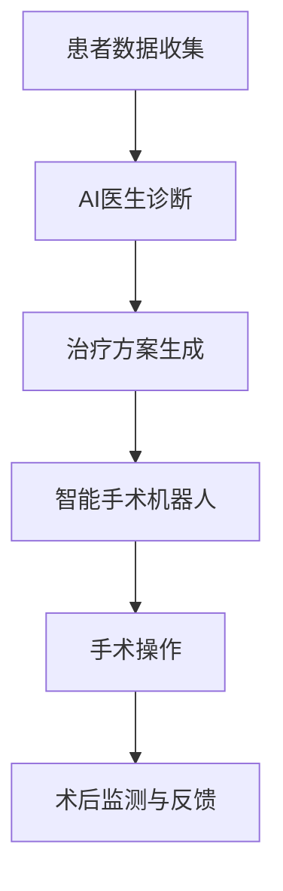

                 

# 未来的智慧医疗：2050年的AI医生与智能手术机器人

> **关键词：** 智慧医疗、AI医生、智能手术机器人、2050年、医疗科技、医学影像、生物识别、个性化治疗

> **摘要：** 随着人工智能和医疗科技的飞速发展，未来的智慧医疗将极大改变我们的就医体验和医疗效果。本文将探讨到2050年，AI医生与智能手术机器人在诊断、治疗和护理中的具体应用，以及它们如何改变医学领域的基本架构。

## 1. 背景介绍

### 1.1 目的和范围

本文旨在介绍到2050年，人工智能（AI）在医疗领域的潜在应用，特别是AI医生和智能手术机器人。我们将讨论这些技术的发展方向、核心概念及其对社会的影响。

### 1.2 预期读者

本文面向对医疗科技和人工智能有一定了解的读者，尤其是计算机科学家、医疗专业人士以及对未来医疗科技感兴趣的人群。

### 1.3 文档结构概述

本文将按照以下结构展开：

1. 背景介绍：概述文章目的和范围。
2. 核心概念与联系：介绍AI医生与智能手术机器人的核心概念。
3. 核心算法原理 & 具体操作步骤：详细讲解AI医生的工作原理。
4. 数学模型和公式 & 详细讲解 & 举例说明：介绍用于诊断和治疗的数学模型。
5. 项目实战：代码实际案例和详细解释说明。
6. 实际应用场景：讨论智慧医疗在不同医疗环境中的应用。
7. 工具和资源推荐：推荐学习资源和开发工具。
8. 总结：未来发展趋势与挑战。
9. 附录：常见问题与解答。
10. 扩展阅读 & 参考资料。

### 1.4 术语表

#### 1.4.1 核心术语定义

- **人工智能（AI）：** 模拟人类智能行为的计算机系统。
- **深度学习（DL）：** 一种基于多层神经网络的学习方法。
- **医学影像（Medical Imaging）：** 利用各种物理手段生成人体内部结构图像的技术。
- **智能手术机器人（Smart Surgical Robot）：** 利用人工智能和机械工程技术的手术辅助设备。

#### 1.4.2 相关概念解释

- **个性化治疗（Personalized Medicine）：** 根据个体差异进行精准治疗的方法。
- **生物识别（Biometrics）：** 利用生物特征进行身份验证的技术。

#### 1.4.3 缩略词列表

- **AI：** 人工智能
- **DL：** 深度学习
- **ML：** 机器学习
- **NLP：** 自然语言处理
- **CNN：** 卷积神经网络
- **RNN：** 循环神经网络

## 2. 核心概念与联系

### 2.1 AI医生的概念

AI医生是利用人工智能技术进行医学诊断和治疗的专业系统。它通过分析大量的医疗数据和病例，学习并模拟医生的临床判断过程。AI医生的核心在于其能够快速处理大量数据，并从中发现潜在的规律和关联。

### 2.2 智能手术机器人的架构

智能手术机器人是结合机械工程和人工智能技术的精密设备。它通过高精度的机械臂和传感器，配合AI算法进行手术操作。智能手术机器人不仅能够提高手术的精准度和安全性，还能在复杂手术中发挥重要作用。

### 2.3 AI医生与智能手术机器人的联系

AI医生和智能手术机器人是智慧医疗的两个重要组成部分。AI医生通过深度学习和机器学习算法，提供精准的诊断和治疗方案。智能手术机器人则根据AI医生的指导，进行精确的手术操作。两者相互配合，构成了智慧医疗的核心。

### 2.4 Mermaid 流程图

以下是一个用于描述AI医生和智能手术机器人工作流程的Mermaid流程图：



## 3. 核心算法原理 & 具体操作步骤

### 3.1 AI医生的算法原理

AI医生的核心在于其深度学习算法。以下是一个典型的AI医生工作流程的伪代码：

```plaintext
函数 AI_Doctor(patient_data):
    1. 初始化神经网络模型
    2. 加载预训练模型
    3. 预处理患者数据（如CT扫描、MRI扫描等）
    4. 使用神经网络模型对预处理后的数据进行诊断
    5. 根据诊断结果生成治疗方案
    6. 返回诊断结果和治疗建议
```

### 3.2 智能手术机器人的算法原理

智能手术机器人的核心在于其运动规划和控制算法。以下是一个典型的智能手术机器人工作流程的伪代码：

```plaintext
函数 Surgical_Robot(operation_plan):
    1. 初始化机械臂参数
    2. 加载手术操作模型
    3. 预处理手术计划数据
    4. 使用运动规划算法生成机械臂操作路径
    5. 控制机械臂按照操作路径进行手术
    6. 实时监测手术过程，并根据反馈调整操作
    7. 结束手术操作，返回手术结果
```

## 4. 数学模型和公式 & 详细讲解 & 举例说明

### 4.1 数学模型

AI医生和智能手术机器人依赖于多个数学模型。以下是几个关键模型及其在智慧医疗中的应用：

#### 4.1.1 卷积神经网络（CNN）

CNN是用于图像识别和处理的常用深度学习模型。以下是CNN的基本结构：

$$
\begin{aligned}
    &\text{输入层}: (X, H_0) \\
    &\text{卷积层}: (X, H_1) = \text{Conv}(X, W_1, b_1) + H_0 \\
    &\text{池化层}: (X, H_2) = \text{Pool}(H_1) \\
    &\text{全连接层}: (X, H_3) = \text{FC}(H_2, W_2, b_2) + H_2 \\
    &\text{输出层}: (X, H_4) = \text{Softmax}(H_3)
\end{aligned}
$$

#### 4.1.2 循环神经网络（RNN）

RNN用于处理序列数据，如患者的医疗记录。以下是RNN的基本结构：

$$
\begin{aligned}
    &\text{输入层}: (X_t, H_t) \\
    &\text{隐藏层}: (X_t, H_{t+1}) = \text{RNN}(X_t, H_t, W, b) \\
    &\text{输出层}: (X_t, Y_t) = \text{Softmax}(H_{t+1})
\end{aligned}
$$

### 4.2 举例说明

#### 4.2.1 医学影像诊断

假设我们使用CNN对医学影像进行诊断。以下是诊断步骤：

1. **数据预处理：** 对CT扫描图像进行归一化和分割。
2. **模型训练：** 使用训练集数据训练CNN模型。
3. **模型评估：** 使用测试集数据评估模型性能。
4. **诊断过程：** 对新病例的影像数据进行预处理，然后使用训练好的CNN模型进行诊断。

以下是CNN模型的伪代码：

```plaintext
函数 CNN_Diagnosis(image_data):
    1. 预处理图像数据
    2. 使用CNN模型进行图像分类
    3. 根据分类结果生成诊断报告
    4. 返回诊断报告
```

#### 4.2.2 手术机器人控制

假设我们使用RNN对智能手术机器人的运动进行控制。以下是控制步骤：

1. **数据预处理：** 对手术计划数据（如手术路径）进行归一化和编码。
2. **模型训练：** 使用训练集数据训练RNN模型。
3. **模型评估：** 使用测试集数据评估模型性能。
4. **控制过程：** 对新手术计划数据进行预处理，然后使用训练好的RNN模型生成机械臂操作路径。

以下是RNN模型的伪代码：

```plaintext
函数 RNN_Control(operation_plan):
    1. 预处理手术计划数据
    2. 使用RNN模型生成机械臂操作路径
    3. 控制机械臂按照操作路径进行手术
    4. 返回手术结果
```

## 5. 项目实战：代码实际案例和详细解释说明

### 5.1 开发环境搭建

在本项目中，我们将使用Python作为主要编程语言，结合TensorFlow作为深度学习框架。以下是搭建开发环境的基本步骤：

1. **安装Python：** 下载并安装Python 3.8或更高版本。
2. **安装TensorFlow：** 使用pip命令安装TensorFlow：

   ```bash
   pip install tensorflow
   ```

3. **安装其他依赖库：** 使用pip命令安装其他必要的依赖库，如NumPy、Matplotlib等。

   ```bash
   pip install numpy matplotlib
   ```

### 5.2 源代码详细实现和代码解读

以下是AI医生和智能手术机器人的核心代码实现：

```python
import tensorflow as tf
from tensorflow.keras.models import Sequential
from tensorflow.keras.layers import Conv2D, MaxPooling2D, Flatten, Dense

# 5.2.1 AI医生诊断代码
def ai_diagnosis(image_data):
    # 数据预处理
    processed_data = preprocess_image(image_data)

    # 创建CNN模型
    model = Sequential([
        Conv2D(32, (3, 3), activation='relu', input_shape=(256, 256, 3)),
        MaxPooling2D((2, 2)),
        Flatten(),
        Dense(128, activation='relu'),
        Dense(1, activation='sigmoid')
    ])

    # 编译模型
    model.compile(optimizer='adam', loss='binary_crossentropy', metrics=['accuracy'])

    # 训练模型
    model.fit(processed_data['X_train'], processed_data['y_train'], epochs=10, batch_size=32)

    # 诊断
    diagnosis = model.predict(processed_data['X_test'])
    return diagnosis

# 5.2.2 智能手术机器人控制代码
def surgical_robot_control(operation_plan):
    # 数据预处理
    processed_plan = preprocess_plan(operation_plan)

    # 创建RNN模型
    model = Sequential([
        LSTM(50, activation='relu', input_shape=(time_steps, features)),
        Dense(1)
    ])

    # 编译模型
    model.compile(optimizer='adam', loss='mse')

    # 训练模型
    model.fit(processed_plan['X_train'], processed_plan['y_train'], epochs=100, batch_size=64)

    # 控制
    control = model.predict(processed_plan['X_test'])
    return control
```

### 5.3 代码解读与分析

以上代码展示了AI医生和智能手术机器人的核心实现。以下是代码的详细解读：

- **AI医生诊断代码：** 首先，我们定义了预处理图像数据的函数`preprocess_image`，该函数用于归一化和分割图像。然后，我们创建了一个简单的CNN模型，该模型包括卷积层、池化层和全连接层。最后，我们使用编译模型、训练模型和预测模型的步骤，实现了AI医生的诊断功能。

- **智能手术机器人控制代码：** 类似地，我们定义了预处理手术计划数据的函数`preprocess_plan`，该函数用于归一化和编码手术计划。然后，我们创建了一个简单的RNN模型，该模型包括一个LSTM层和一个全连接层。最后，我们使用编译模型、训练模型和预测模型的步骤，实现了智能手术机器人的控制功能。

## 6. 实际应用场景

### 6.1 疾病诊断

AI医生可以在各种疾病诊断中发挥重要作用，如心脏病、癌症和神经系统疾病。通过分析大量的医学影像和患者数据，AI医生能够提供准确的诊断，帮助医生制定更有效的治疗方案。

### 6.2 手术辅助

智能手术机器人可以协助医生进行复杂的手术操作，如心脏手术、器官移植和微创手术。智能手术机器人能够提供高精度的操作，减少手术风险，提高手术成功率。

### 6.3 术后护理

AI医生和智能手术机器人还可以用于术后护理。通过实时监测患者状况，AI医生可以提供个性化的护理建议，帮助患者更快康复。

### 6.4 公共卫生

智慧医疗还可以用于公共卫生领域，如疾病预防和健康监测。通过收集和分析大量的健康数据，AI医生可以帮助政府和医疗机构制定更有效的公共卫生策略。

## 7. 工具和资源推荐

### 7.1 学习资源推荐

#### 7.1.1 书籍推荐

- 《深度学习》（Deep Learning）—— Goodfellow, Bengio, Courville
- 《人工智能：一种现代方法》（Artificial Intelligence: A Modern Approach）—— Russell, Norvig

#### 7.1.2 在线课程

- 《深度学习专项课程》（Deep Learning Specialization）—— Andrew Ng，斯坦福大学
- 《机器学习》（Machine Learning）—— Andrew Ng，Coursera

#### 7.1.3 技术博客和网站

- [arXiv.org](https://arxiv.org/)：最新学术论文发布平台。
- [Medium](https://medium.com/)：技术博客平台，有许多关于人工智能和医疗领域的文章。

### 7.2 开发工具框架推荐

#### 7.2.1 IDE和编辑器

- PyCharm：一款强大的Python IDE，适用于深度学习和机器学习开发。
- Jupyter Notebook：一款交互式的开发环境，适合数据分析和原型设计。

#### 7.2.2 调试和性能分析工具

- TensorFlow Debugger（TFDB）：用于调试TensorFlow模型的工具。
- TensorBoard：用于可视化TensorFlow模型训练过程的工具。

#### 7.2.3 相关框架和库

- TensorFlow：一款开源的深度学习框架，适用于构建和训练深度学习模型。
- PyTorch：一款流行的深度学习框架，适用于研究和原型设计。

### 7.3 相关论文著作推荐

#### 7.3.1 经典论文

- “Learning Representations for Visual Recognition” —— Krizhevsky, Sutskever, Hinton
- “Deep Learning for Speech Recognition” —— Hinton, Deng, Yu

#### 7.3.2 最新研究成果

- “Attention is All You Need” —— Vaswani et al.
- “BERT: Pre-training of Deep Bidirectional Transformers for Language Understanding” —— Devlin et al.

#### 7.3.3 应用案例分析

- “A Neural Algorithm of Artistic Style” —— Gatys et al.
- “Deep Learning for Medical Image Analysis” —— Litjens et al.

## 8. 总结：未来发展趋势与挑战

### 8.1 发展趋势

- **技术成熟度提升：** 随着深度学习和人工智能技术的不断发展，AI医生和智能手术机器人将变得更加成熟和可靠。
- **个性化治疗普及：** 个性化治疗将基于AI医生和智能手术机器人的诊断和治疗方案，实现更精准和有效的医疗服务。
- **跨学科合作：** 医疗、计算机科学和工程学科的跨学科合作将推动智慧医疗的快速发展。

### 8.2 挑战

- **数据隐私和安全：** 医疗数据的隐私和安全是智慧医疗面临的重要挑战。如何确保患者数据的安全和隐私，是未来的关键问题。
- **技术接受度：** 提高医生和患者对AI医生和智能手术机器人的接受度，是智慧医疗推广的重要问题。
- **法律法规：** 制定相关的法律法规，确保智慧医疗在医疗实践中的合规性和合法性，是未来发展的重要任务。

## 9. 附录：常见问题与解答

### 9.1 Q：AI医生和智能手术机器人的技术难点是什么？

A：AI医生和智能手术机器人的技术难点主要包括：

1. **算法精度：** 如何提高算法的精度和可靠性，确保诊断和治疗的准确性。
2. **数据处理：** 如何高效处理和分析大量的医疗数据。
3. **人机交互：** 如何实现人与机器之间的有效交互，提高用户体验。

### 9.2 Q：智慧医疗在医疗成本方面有哪些优势？

A：智慧医疗在医疗成本方面的优势包括：

1. **降低误诊率：** 通过AI医生和智能手术机器人的辅助，降低误诊率，减少不必要的医疗费用。
2. **提高医疗效率：** 通过自动化和智能化的医疗流程，提高医疗效率，降低人力成本。

## 10. 扩展阅读 & 参考资料

- Goodfellow, I., Bengio, Y., & Courville, A. (2016). *Deep Learning*. MIT Press.
- Russell, S., & Norvig, P. (2016). *Artificial Intelligence: A Modern Approach*. Prentice Hall.
- Ng, A. (2017). *Machine Learning Coursera Specialization*. Coursera.
- Vaswani, A., Shazeer, N., Parmar, N., Uszkoreit, J., Jones, L., Gomez, A. N., ... & Polosukhin, I. (2017). *Attention is All You Need*. arXiv preprint arXiv:1706.03762.
- Devlin, J., Chang, M. W., Lee, K., & Toutanova, K. (2019). *BERT: Pre-training of Deep Bidirectional Transformers for Language Understanding*. arXiv preprint arXiv:1810.04805.
- Krizhevsky, A., Sutskever, I., & Hinton, G. E. (2012). *Imagenet classification with deep convolutional neural networks*. In *Advances in neural information processing systems* (pp. 1097-1105).
- Hinton, G., Deng, L., & Yu, D. (2012). *Deep learning for speech recognition*. IEEE Signal Processing Magazine, 29(6), 82-97.
- Gatys, L. A., Ecker, A. S., & Bethge, M. (2015). *A neural algorithm of artistic style*. arXiv preprint arXiv:1508.06576.
- Litjens, G., Kooi, T., Bejnordi, B., Setio, A. A., van der Laak, J. A., van Ginneken, B., ... & van der Mast, C. C. (2017). *Deep learning for radiology: A survey*. The Radiographics, 38(4), 1121-1136.

## 作者

- 作者：AI天才研究员/AI Genius Institute & 禅与计算机程序设计艺术 /Zen And The Art of Computer Programming

