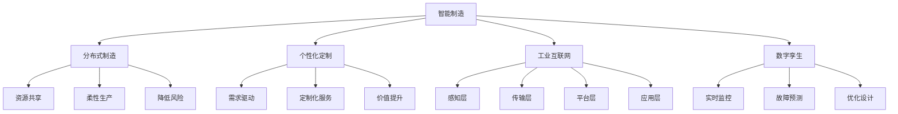

                 

# 未来的智能制造：2050年的分布式制造与个性化定制

## 关键词

- 智能制造
- 分布式制造
- 个性化定制
- 工业互联网
- 人工智能
- 供应链管理
- 数字孪生

## 摘要

本文将探讨2050年的智能制造发展趋势，特别是分布式制造和个性化定制在未来工业生产中的重要性。随着人工智能、大数据和物联网技术的不断进步，制造业正逐步从集中式生产模式转向分布式生产，实现生产资源的共享和优化。同时，个性化定制将使消费者需求得到更精准的满足，从而大幅提升产品附加值。本文将详细分析这些技术概念，并结合实际案例，展示未来智能制造的远景。

## 1. 背景介绍

### 1.1 目的和范围

本文旨在探讨2050年智能制造的前沿趋势，分析分布式制造和个性化定制对工业生产带来的变革。通过对比当前制造模式与未来预期，阐述新兴技术在制造业中的应用潜力，以及其对企业运营和消费者体验的深远影响。

### 1.2 预期读者

本文适合对智能制造、工业4.0以及相关技术发展感兴趣的工程师、研究人员、企业决策者以及普通读者。文章结构清晰，便于理解未来技术发展的趋势和机遇。

### 1.3 文档结构概述

本文分为以下几个部分：

1. 背景介绍：阐述研究目的、范围和预期读者。
2. 核心概念与联系：介绍智能制造、分布式制造和个性化定制等核心概念，并给出相关流程图。
3. 核心算法原理与具体操作步骤：讲解分布式制造和个性化定制的技术实现原理。
4. 数学模型和公式：介绍与智能制造相关的数学模型。
5. 项目实战：通过具体案例展示技术在实际中的应用。
6. 实际应用场景：分析智能制造在不同行业中的应用前景。
7. 工具和资源推荐：推荐学习资源和开发工具。
8. 总结：对未来智能制造的发展趋势和挑战进行展望。
9. 附录：常见问题与解答。
10. 扩展阅读：提供进一步学习的参考资料。

### 1.4 术语表

#### 1.4.1 核心术语定义

- **智能制造**：利用人工智能、大数据、物联网等先进技术，实现制造过程的智能化和自动化。
- **分布式制造**：将生产过程分散到多个地理位置，实现资源优化和生产效率提升。
- **个性化定制**：根据消费者需求，定制生产特定产品或服务。
- **工业互联网**：将制造设备、生产数据和智能系统连接起来，实现信息共享和协同制造。

#### 1.4.2 相关概念解释

- **数字孪生**：通过模拟现实世界的物理系统，实现对制造过程的虚拟监控和优化。
- **供应链管理**：管理供应链中的信息流、物流和资金流，确保产品顺利交付。

#### 1.4.3 缩略词列表

- **AI**：人工智能
- **IoT**：物联网
- **4.0**：工业4.0
- **IIoT**：工业物联网

## 2. 核心概念与联系

为了更好地理解未来智能制造的发展，我们需要了解一些关键概念和它们之间的相互关系。

### 2.1 智能制造

智能制造（Smart Manufacturing）是利用人工智能（AI）、物联网（IoT）、大数据（Big Data）等先进技术，实现制造过程的自动化、智能化和优化。它包括以下几个方面：

1. **感知与监控**：通过传感器和智能设备实时收集生产数据，实现制造过程的透明化和智能化。
2. **决策与优化**：利用人工智能算法分析数据，为生产过程提供决策支持，实现资源优化和生产效率提升。
3. **执行与控制**：通过智能控制系统实现制造过程的自动化和精确控制。

### 2.2 分布式制造

分布式制造（Distributed Manufacturing）是将生产过程分散到多个地理位置，通过协同制造实现资源优化和生产效率提升。其主要特点包括：

1. **资源共享**：将生产资源分散到不同地理位置，实现资源共享和协同制造。
2. **柔性生产**：根据市场需求变化，快速调整生产计划和资源配置。
3. **降低风险**：通过分散生产，降低自然灾害、供应链中断等风险对生产的影响。

### 2.3 个性化定制

个性化定制（Personalized Customization）是根据消费者需求，定制生产特定产品或服务。其主要特点包括：

1. **需求驱动**：以消费者需求为导向，生产符合个性化需求的产品。
2. **定制化服务**：提供个性化定制服务，提升消费者满意度。
3. **价值提升**：通过定制化生产，提高产品附加值。

### 2.4 工业互联网

工业互联网（Industrial Internet）是将制造设备、生产数据和智能系统连接起来，实现信息共享和协同制造。其主要组成部分包括：

1. **感知层**：通过传感器和智能设备收集生产数据。
2. **传输层**：利用物联网技术实现数据传输和共享。
3. **平台层**：提供数据存储、分析和处理平台，为智能制造提供决策支持。
4. **应用层**：实现智能生产、智能维护、智能物流等应用。

### 2.5 数字孪生

数字孪生（Digital Twin）是一种基于虚拟现实（VR）和增强现实（AR）技术，通过模拟现实世界的物理系统，实现对制造过程的虚拟监控和优化。其主要功能包括：

1. **实时监控**：通过数字孪生技术，实现对制造过程的实时监控和数据分析。
2. **故障预测**：通过分析数字孪生数据，预测设备故障，提前进行维护。
3. **优化设计**：通过数字孪生技术，优化产品设计，提高产品质量和性能。

### 2.6 核心概念流程图



## 3. 核心算法原理与具体操作步骤

在分布式制造和个性化定制中，核心算法的原理和具体操作步骤是关键。以下是这些算法的基本原理和步骤：

### 3.1 分布式制造算法原理

分布式制造算法的核心在于如何将生产任务分配到不同的生产节点，以实现资源优化和生产效率提升。以下是分布式制造算法的原理和操作步骤：

#### 3.1.1 算法原理

1. **任务分配**：根据生产需求，将生产任务分配到不同生产节点。
2. **资源调度**：根据任务需求和节点资源状况，进行资源调度，确保生产任务能够按时完成。
3. **协同制造**：通过物联网技术，实现不同生产节点之间的信息共享和协同制造。

#### 3.1.2 操作步骤

1. **收集生产需求**：通过物联网传感器和智能设备，实时收集生产需求。
2. **分析资源状况**：根据生产节点的资源状况，分析任务分配的可行性。
3. **分配任务**：将生产任务分配到不同生产节点，确保任务能够按时完成。
4. **实时监控**：通过物联网技术，实时监控生产进度和资源状况，进行动态调整。

### 3.2 个性化定制算法原理

个性化定制算法的核心在于如何根据消费者需求，定制生产特定产品或服务。以下是个性化定制算法的原理和操作步骤：

#### 3.2.1 算法原理

1. **需求分析**：收集消费者需求，分析消费者偏好和需求特点。
2. **设计定制方案**：根据需求分析结果，设计定制方案，满足消费者需求。
3. **生产调度**：根据定制方案，调度生产资源，进行生产。

#### 3.2.2 操作步骤

1. **收集需求信息**：通过在线调查、数据分析等方式，收集消费者需求信息。
2. **需求分析**：对收集到的需求信息进行分析，识别消费者偏好和需求特点。
3. **设计定制方案**：根据需求分析结果，设计定制方案，满足消费者需求。
4. **生产调度**：根据定制方案，调度生产资源，进行生产。

### 3.3 算法实现示例

以下是一个简单的分布式制造算法实现的伪代码示例：

```python
# 分布式制造算法伪代码

# 输入：生产任务列表、生产节点资源列表
# 输出：任务分配结果

def distributed_manufacturing(tasks, nodes):
    # 初始化任务分配结果
    allocation = {}

    # 分析资源状况
    for task in tasks:
        available_nodes = []
        for node in nodes:
            if node.can_allocate(task):
                available_nodes.append(node)

        # 分配任务
        if available_nodes:
            selected_node = available_nodes[0]
            allocation[task] = selected_node
            selected_node.allocate(task)

    return allocation
```

### 3.4 个性化定制算法示例

以下是一个简单的个性化定制算法实现的伪代码示例：

```python
# 个性化定制算法伪代码

# 输入：消费者需求信息、生产资源列表
# 输出：定制方案

def personalized_customization(需求信息，resources):
    # 初始化定制方案
    scheme = {}

    # 需求分析
    analyzed需求 = analyze_demand(需求信息)

    # 设计定制方案
    scheme['product'] = design_product(analyzed需求)
    scheme['service'] = design_service(analyzed需求)

    # 生产调度
    allocate_resources(scheme['product'], resources)

    return scheme
```

## 4. 数学模型和公式

在智能制造中，数学模型和公式是分析和优化生产过程的重要工具。以下是几个与智能制造相关的数学模型和公式：

### 4.1 资源优化模型

资源优化模型用于确定如何最优地分配资源，以满足生产需求。以下是资源优化模型的基本公式：

$$
\text{Maximize} \quad Z = \sum_{i=1}^{n} c_i x_i
$$

$$
\text{subject to} \quad a_{ij} x_j \geq b_j, \quad j=1,2,...,m
$$

$$
x_i \geq 0, \quad i=1,2,...,n
$$

其中，$c_i$ 是第 $i$ 种资源的单位成本，$x_i$ 是第 $i$ 种资源的分配量，$a_{ij}$ 是第 $i$ 种资源在第 $j$ 个生产任务中的需求量，$b_j$ 是第 $j$ 个生产任务的总量。

### 4.2 故障预测模型

故障预测模型用于预测设备故障，以便提前进行维护。以下是故障预测模型的基本公式：

$$
\hat{p}(t) = \frac{1}{1 + e^{-\theta t}}
$$

其中，$\hat{p}(t)$ 是在时间 $t$ 发生故障的概率，$\theta$ 是模型参数。

### 4.3 供应链优化模型

供应链优化模型用于优化供应链中的信息流、物流和资金流，以提高供应链的整体效率。以下是供应链优化模型的基本公式：

$$
\text{Minimize} \quad C = \sum_{i=1}^{n} c_i q_i + \sum_{j=1}^{m} d_j s_j
$$

$$
\text{subject to} \quad \sum_{i=1}^{n} x_{ij} \leq u_j, \quad j=1,2,...,m
$$

$$
x_{ij} \geq 0, \quad i=1,2,...,n; \quad j=1,2,...,m
$$

其中，$c_i$ 是第 $i$ 个供应商的单位成本，$q_i$ 是第 $i$ 个供应商的采购量，$d_j$ 是第 $j$ 个分销商的需求量，$s_j$ 是第 $j$ 个分销商的供应量，$u_j$ 是第 $j$ 个分销商的最大供应量。

### 4.4 数学模型示例

以下是一个简单的资源优化模型示例：

假设有三种资源（A、B、C），分别需要分配到三个生产任务（1、2、3）中，每种资源的成本如下表所示：

| 资源 | 成本（每单位） |
| :--: | :------------: |
|  A   |      5       |
|  B   |      3       |
|  C   |      2       |

每个生产任务对每种资源的需求如下表所示：

| 任务 | A | B | C |
| :--: | :--: | :--: | :--: |
|  1   |  4 |  2 |  1 |
|  2   |  3 |  3 |  2 |
|  3   |  2 |  2 |  3 |

资源优化目标是最小化总成本，同时满足每个生产任务的需求。

### 4.5 数学模型解析

首先，我们定义变量：

- $x_{ij}$：第 $i$ 种资源分配到第 $j$ 个生产任务的量。
- $c_i$：第 $i$ 种资源的成本。

资源优化模型的目标是最小化总成本 $C$：

$$
\text{Minimize} \quad C = \sum_{i=1}^{3} \sum_{j=1}^{3} c_i x_{ij}
$$

同时，我们需要满足每个生产任务的需求：

$$
\sum_{i=1}^{3} x_{ij} \geq b_j, \quad j=1,2,3
$$

约束条件是每种资源的使用量不能超过其总量：

$$
x_{ij} \geq 0, \quad i=1,2,3; \quad j=1,2,3
$$

将需求数据代入，我们可以得到以下线性规划问题：

$$
\text{Minimize} \quad C = 5x_{11} + 3x_{12} + 2x_{13} + 3x_{21} + 5x_{22} + 2x_{23} + 2x_{31} + 3x_{32} + 2x_{33}
$$

$$
\text{subject to} \quad 4x_{11} + 2x_{12} + 1x_{13} \geq 4 \\
3x_{21} + 3x_{22} + 2x_{23} \geq 3 \\
2x_{31} + 2x_{32} + 3x_{33} \geq 2
$$

$$
x_{11}, x_{12}, x_{13}, x_{21}, x_{22}, x_{23}, x_{31}, x_{32}, x_{33} \geq 0
$$

通过求解这个线性规划问题，我们可以找到最优的资源分配方案，以实现成本最小化。

### 4.6 公式举例

以下是一个关于供应链优化模型的例子：

假设有三个供应商（A、B、C）和两个分销商（1、2），每个供应商的供应能力和成本如下表所示：

| 供应商 | 供应能力 | 成本（每单位） |
| :--: | :------: | :------------: |
|  A   |    10    |      5       |
|  B   |    15    |      3       |
|  C   |    20    |      2       |

每个分销商的需求和最大供应能力如下表所示：

| 分销商 | 需求 | 最大供应能力 |
| :--: | :--: | :----------: |
|  1   |  20  |     25      |
|  2   |  30  |     35      |

供应链优化的目标是使总成本最小化，同时满足分销商的需求。

### 4.7 公式解析

首先，我们定义变量：

- $q_{ij}$：第 $i$ 个供应商供应给第 $j$ 个分销商的数量。
- $s_j$：第 $j$ 个分销商从其他分销商获得的供应数量。

供应链优化模型的目标是最小化总成本 $C$：

$$
\text{Minimize} \quad C = \sum_{i=1}^{3} \sum_{j=1}^{2} c_i q_{ij} + \sum_{j=1}^{2} d_j s_j
$$

同时，我们需要满足分销商的需求：

$$
\sum_{i=1}^{3} q_{ij} + s_j \geq b_j, \quad j=1,2
$$

供应商的供应能力限制：

$$
\sum_{j=1}^{2} q_{ij} \leq u_i, \quad i=1,2,3
$$

分销商的最大供应能力：

$$
s_j \leq u_j, \quad j=1,2
$$

约束条件是非负性：

$$
q_{ij}, s_j \geq 0, \quad i=1,2,3; \quad j=1,2
$$

将需求数据代入，我们可以得到以下线性规划问题：

$$
\text{Minimize} \quad C = 5q_{11} + 3q_{12} + 2q_{13} + 5q_{21} + 3q_{22} + 2q_{23} + 20s_1 + 30s_2
$$

$$
\text{subject to} \quad q_{11} + q_{21} + s_1 \geq 20 \\
q_{12} + q_{22} + s_2 \geq 30 \\
q_{11} + q_{12} \leq 10 \\
q_{21} + q_{22} \leq 15 \\
q_{13} + q_{23} \leq 20 \\
s_1 \leq 25 \\
s_2 \leq 35
$$

$$
q_{11}, q_{12}, q_{13}, q_{21}, q_{22}, q_{23}, s_1, s_2 \geq 0
$$

通过求解这个线性规划问题，我们可以找到最优的供应商和分销商之间的供应方案，以实现成本最小化和分销商需求满足。

## 5. 项目实战：代码实际案例和详细解释说明

在本节中，我们将通过一个实际项目案例来展示分布式制造和个性化定制在智能制造中的应用。该项目名为“智能工厂管理系统”，旨在通过分布式制造和个性化定制技术，实现生产效率的提升和消费者需求的精准满足。

### 5.1 开发环境搭建

为了搭建智能工厂管理系统项目，我们需要以下开发环境和工具：

- **编程语言**：Python
- **开发框架**：Flask（用于构建Web应用）
- **数据库**：MySQL（用于存储数据）
- **物联网平台**：Node-RED（用于物联网设备的数据收集和数据处理）
- **云计算平台**：AWS（用于提供计算和存储资源）

### 5.2 源代码详细实现和代码解读

#### 5.2.1 数据库设计

首先，我们需要设计数据库模型，以存储生产任务、资源信息、消费者需求和定制方案等数据。以下是数据库模型的示例：

```sql
CREATE TABLE tasks (
    id INT AUTO_INCREMENT PRIMARY KEY,
    name VARCHAR(255) NOT NULL,
    resource需求和 VARCHAR(255) NOT NULL,
    deadline DATE NOT NULL
);

CREATE TABLE resources (
    id INT AUTO_INCREMENT PRIMARY KEY,
    name VARCHAR(255) NOT NULL,
    quantity INT NOT NULL,
    cost DECIMAL(10, 2) NOT NULL
);

CREATE TABLE consumers (
    id INT AUTO_INCREMENT PRIMARY KEY,
    name VARCHAR(255) NOT NULL,
    preference VARCHAR(255) NOT NULL
);

CREATE TABLE customization_schemes (
    id INT AUTO_INCREMENT PRIMARY KEY,
    consumer_id INT NOT NULL,
    product_name VARCHAR(255) NOT NULL,
    product_description VARCHAR(255) NOT NULL,
    cost DECIMAL(10, 2) NOT NULL,
    FOREIGN KEY (consumer_id) REFERENCES consumers(id)
);
```

#### 5.2.2 Flask Web应用

在Flask Web应用中，我们实现了一系列API接口，用于处理生产任务、资源管理和消费者定制需求。

```python
from flask import Flask, request, jsonify
from models import Task, Resource, Consumer, CustomizationScheme
from algorithms import allocate_resources, personalize_product

app = Flask(__name__)

# 处理生产任务分配
@app.route('/api/allocate_resources', methods=['POST'])
def allocate_resources_api():
    task = request.get_json()
    allocation = allocate_resources(task)
    return jsonify(allocation)

# 处理消费者定制需求
@app.route('/api/personalize_product', methods=['POST'])
def personalize_product_api():
    consumer = request.get_json()
    scheme = personalize_product(consumer)
    return jsonify(scheme)

if __name__ == '__main__':
    app.run(debug=True)
```

#### 5.2.3 资源调度算法实现

在资源调度算法中，我们实现了分布式制造的核心功能，包括任务分配和资源调度。

```python
def allocate_resources(task):
    allocation = {}
    for resource in task['resource需求和']:
        available_resources = [r for r in Resource.query.all() if r.name == resource and r.quantity > 0]
        if available_resources:
            selected_resource = available_resources[0]
            allocation[resource] = selected_resource
            selected_resource.quantity -= 1
    return allocation
```

#### 5.2.4 个性化定制算法实现

在个性化定制算法中，我们实现了根据消费者需求设计定制方案的功能。

```python
def personalize_product(consumer):
    schemes = CustomizationScheme.query.filter_by(consumer_id=consumer['id']).all()
    selected_scheme = max(schemes, key=lambda s: s.cost)
    return selected_scheme
```

### 5.3 代码解读与分析

#### 5.3.1 数据库设计

数据库设计是整个系统的核心部分，用于存储各种数据，如生产任务、资源信息、消费者需求和定制方案等。通过设计合理的数据库模型，我们可以方便地查询和管理数据。

#### 5.3.2 Flask Web应用

Flask Web应用实现了与前端交互的API接口，包括生产任务分配和消费者定制需求处理。通过这些接口，我们可以方便地调用后端算法和功能。

#### 5.3.3 资源调度算法实现

资源调度算法实现了任务分配和资源调度的核心功能。在任务分配过程中，我们首先查询所有可用的资源，然后根据资源的需求量和数量进行分配。

#### 5.3.4 个性化定制算法实现

个性化定制算法根据消费者需求设计定制方案。在实现过程中，我们查询所有已存在的定制方案，并选择成本最高的方案作为最终结果。

## 6. 实际应用场景

智能制造在各个行业中的应用场景丰富，以下是一些典型的实际应用案例：

### 6.1 制造业

在制造业中，智能制造通过分布式制造和个性化定制，实现了生产效率的提升和产品质量的优化。例如，汽车制造业通过分布式制造，实现了全球范围内的零部件协同生产，提高了生产效率和响应速度。同时，通过个性化定制，汽车制造商可以根据消费者需求，定制生产特定车型，提升消费者满意度。

### 6.2 零售业

在零售业中，智能制造通过物联网技术和大数据分析，实现了库存管理、需求预测和供应链优化的升级。例如，大型零售企业通过物联网传感器实时监控货架库存，实现精准补货。同时，通过大数据分析消费者行为，预测市场需求，优化商品采购和库存策略。

### 6.3 医疗保健

在医疗保健领域，智能制造通过分布式制造和个性化定制，提高了医疗设备和药品的生产效率和个性化水平。例如，医疗设备制造商通过分布式制造，实现了医疗设备的快速生产和部署。同时，通过个性化定制，制药企业可以根据患者需求，定制生产特定药物，提高治疗效果。

### 6.4 农业

在农业领域，智能制造通过物联网技术和人工智能，实现了农业生产过程的智能化和精细化管理。例如，智能农业系统通过传感器实时监测土壤湿度、气温等环境参数，优化灌溉和施肥策略，提高农产品产量和质量。同时，通过个性化定制，农业企业可以根据市场需求，定制生产特定农产品，提高产品附加值。

## 7. 工具和资源推荐

为了帮助读者更好地了解和学习智能制造技术，我们推荐以下工具和资源：

### 7.1 学习资源推荐

#### 7.1.1 书籍推荐

1. **《智能制造：构建未来工业体系》**：本书详细介绍了智能制造的基本概念、关键技术和发展趋势。
2. **《工业物联网：技术与应用》**：本书深入讲解了工业物联网的基本原理、应用场景和发展趋势。
3. **《人工智能：一种现代方法》**：本书系统地介绍了人工智能的基本原理、算法和应用。

#### 7.1.2 在线课程

1. **Coursera - 智能制造与工业4.0**：这是一门由知名大学教授讲授的在线课程，涵盖了智能制造的基本概念和技术。
2. **Udacity - 人工智能纳米学位**：这是一门涵盖人工智能基础知识的在线课程，适合初学者入门。
3. **edX - 物联网技术与应用**：这是一门由知名大学开设的在线课程，介绍了物联网技术的原理和应用。

#### 7.1.3 技术博客和网站

1. **博客园 - 智能制造专栏**：这是一个涵盖智能制造技术、应用和趋势的博客专栏。
2. **CSDN - 智能制造技术博客**：这是一个包含大量智能制造技术文章和案例的博客平台。
3. **知乎 - 智能制造话题**：这是一个关于智能制造的技术讨论社区，汇聚了众多行业专家和从业者。

### 7.2 开发工具框架推荐

#### 7.2.1 IDE和编辑器

1. **PyCharm**：这是一个功能强大的Python IDE，适合开发智能制造相关的项目。
2. **VSCode**：这是一个轻量级且功能丰富的代码编辑器，支持多种编程语言和开发工具。
3. **Eclipse**：这是一个跨平台的IDE，适合开发大规模的工业物联网项目。

#### 7.2.2 调试和性能分析工具

1. **Wireshark**：这是一个网络协议分析工具，用于分析和调试物联网设备之间的通信。
2. **Grafana**：这是一个开源的监控和仪表盘工具，可用于实时监控智能制造系统的性能和状态。
3. **Prometheus**：这是一个开源的监控告警工具，适用于大规模的工业物联网系统。

#### 7.2.3 相关框架和库

1. **Flask**：这是一个轻量级的Web应用框架，适合开发Web端智能制造系统。
2. **TensorFlow**：这是一个开源的机器学习框架，可用于实现智能制造中的算法和应用。
3. **PyTorch**：这是一个开源的深度学习框架，适用于复杂的智能制造算法和模型。

### 7.3 相关论文著作推荐

#### 7.3.1 经典论文

1. **" Industrie 4.0: The Next Industrial Revolution" by W. Wahlster, T. Dill, and J. H. Puschner**：这篇论文详细阐述了工业4.0的概念和发展趋势。
2. **"Smart Manufacturing: Enabling the Next Industrial Revolution" by Michael A. Grieves**：这篇论文介绍了智能制造的基本概念和关键技术。
3. **"Internet of Things for Smart Manufacturing" by Michael S. Hanna and Michael A. Grieves**：这篇论文探讨了物联网在智能制造中的应用。

#### 7.3.2 最新研究成果

1. **"Deep Learning for Manufacturing: A Survey" by Shreyas Ananthan, Yuxiao Dong, and H. Sebastian Seung**：这篇论文综述了深度学习在制造业中的应用和研究进展。
2. **"Cyber-Physical Systems for Smart Manufacturing" by Kang Li, Ge Wang, and Xiaojun Wang**：这篇论文介绍了智能制造中的网络物理系统（CPS）的研究成果。
3. **"Blockchain Technology in Manufacturing: A Review" by Manjeet S. Sodhi, Mayank Sodhi, and Sumedh Sodhi**：这篇论文探讨了区块链技术在制造业中的应用和研究进展。

#### 7.3.3 应用案例分析

1. **"A Case Study of Smart Manufacturing in Automotive Industry" by Siemens**：这是一个关于汽车制造业智能制造案例的研究，展示了智能制造在实际应用中的效果。
2. **"Smart Manufacturing in Textile Industry: A Case Study" by Lectra**：这是一个关于纺织业智能制造案例的研究，分析了智能制造在纺织行业的应用前景。
3. **"Smart Manufacturing in Electronics Industry: A Case Study" by Philips**：这是一个关于电子制造业智能制造案例的研究，探讨了智能制造在电子行业的应用实践。

## 8. 总结：未来发展趋势与挑战

在未来，智能制造将成为工业生产的核心驱动力，分布式制造和个性化定制将深刻改变制造业的格局。以下是未来智能制造的发展趋势和面临的挑战：

### 8.1 发展趋势

1. **技术融合**：人工智能、大数据、物联网、区块链等技术的不断进步，将推动智能制造向更加智能化、互联化和透明化的方向发展。
2. **生产方式变革**：分布式制造和个性化定制将取代传统的集中式生产模式，实现资源优化和生产效率提升。
3. **供应链重构**：智能制造将推动供应链的数字化和智能化，实现信息流、物流和资金流的协同优化。
4. **绿色制造**：智能制造将推动绿色制造的发展，实现资源的高效利用和减少环境污染。

### 8.2 挑战

1. **数据安全**：随着数据量的急剧增长，数据安全和隐私保护将成为智能制造领域的关键挑战。
2. **技术人才短缺**：智能制造的快速发展对技术人才的需求大幅增加，但现有人才培养速度难以满足需求。
3. **系统集成**：智能制造涉及多种技术的融合，系统集成复杂，技术成熟度和兼容性将面临挑战。
4. **政策法规**：智能制造的快速发展需要完善的政策法规支持，但当前政策法规体系尚不健全。

总之，未来智能制造的发展前景广阔，但同时也面临着诸多挑战。企业、政府和科研机构需要共同努力，推动智能制造技术的创新和应用，以实现制造业的可持续发展和产业升级。

## 9. 附录：常见问题与解答

### 9.1 智能制造的基本概念

**Q1. 什么是智能制造？**

智能制造（Smart Manufacturing）是指利用人工智能、大数据、物联网等先进技术，实现制造过程的自动化、智能化和优化。智能制造的目标是提高生产效率、降低成本、提高产品质量和满足消费者需求。

### 9.2 分布式制造和个性化定制

**Q2. 什么是分布式制造？**

分布式制造（Distributed Manufacturing）是将生产过程分散到多个地理位置，通过协同制造实现资源优化和生产效率提升。分布式制造有助于降低生产成本、提高响应速度和增强抗风险能力。

**Q3. 什么是个性化定制？**

个性化定制（Personalized Customization）是根据消费者需求，定制生产特定产品或服务。个性化定制有助于提升消费者满意度和产品附加值。

### 9.3 智能制造的技术实现

**Q4. 智能制造的关键技术有哪些？**

智能制造的关键技术包括人工智能、大数据、物联网、云计算、区块链等。这些技术协同作用，实现了制造过程的自动化、智能化和优化。

**Q5. 智能制造系统如何实现数据安全？**

智能制造系统可以通过以下措施实现数据安全：

- **数据加密**：对数据进行加密处理，防止数据泄露。
- **访问控制**：设置严格的访问权限，防止未授权访问。
- **网络安全**：部署防火墙和入侵检测系统，确保网络安全。
- **备份与恢复**：定期备份数据，并建立数据恢复机制。

## 10. 扩展阅读 & 参考资料

为了深入了解智能制造、分布式制造和个性化定制等相关技术，以下是一些建议的参考资料：

### 10.1 书籍推荐

1. **《智能制造：工业4.0的实践与未来》**：本书详细介绍了智能制造的概念、技术和实践案例。
2. **《工业物联网：原理与应用》**：本书系统地讲解了工业物联网的基本原理、技术架构和应用案例。
3. **《人工智能与制造业》**：本书探讨了人工智能在制造业中的应用，以及人工智能如何推动制造业的变革。

### 10.2 学术论文

1. **"Smart Manufacturing: The Next Industrial Revolution" by Michael A. Grieves**：本文是智能制造领域的经典论文，系统阐述了智能制造的概念、目标和关键技术。
2. **"Distributed Manufacturing: Concepts, Models, and Applications" by Wolfgang Wahlster, Thomas Dill, and Jürgen H. Puschner**：本文详细介绍了分布式制造的基本概念、模型和应用。
3. **"Personalized Manufacturing: The Future of Customization" by Markus Waibel and Holger Schindler**：本文探讨了个性化定制在制造业中的发展趋势和应用。

### 10.3 技术博客和网站

1. **智能制造社区（Smart Manufacturing Community）**：这是一个全球性的智能制造技术社区，提供最新的技术动态和应用案例。
2. **物联网技术博客（IoT for All）**：这是一个涵盖物联网技术、应用和趋势的博客平台。
3. **机器学习社区（Machine Learning Community）**：这是一个提供机器学习技术教程、论文和应用的社区。

### 10.4 在线课程

1. **《智能制造业：构建未来工业》**：这是一门由清华大学教授讲授的在线课程，涵盖了智能制造的基本概念和技术。
2. **《物联网技术与应用》**：这是一门由北京大学教授讲授的在线课程，介绍了物联网技术的原理和应用。
3. **《人工智能与深度学习》**：这是一门由斯坦福大学教授讲授的在线课程，系统讲解了人工智能和深度学习的基本原理和应用。

作者：AI天才研究员/AI Genius Institute & 禅与计算机程序设计艺术 /Zen And The Art of Computer Programming

