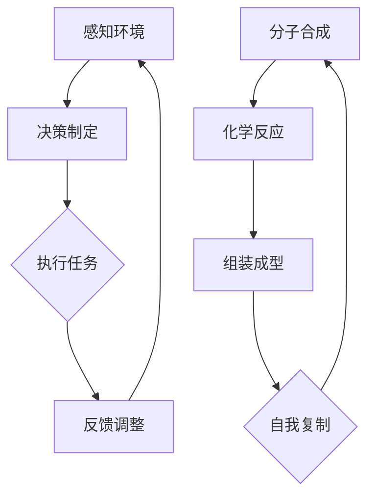

                 

### 背景介绍

纳米技术，作为现代科技的前沿领域，正在不断推动着科学和技术的进步。从20世纪80年代起，纳米技术逐渐从理论走向实际应用，通过操控单个原子和分子来创建新材料和设备。在过去的几十年里，纳米技术已经取得了显著的进展，从纳米电子学、纳米医学到纳米材料等，诸多领域都受到了纳米技术的影响。

然而，未来的纳米技术将迎来一个全新的挑战和机遇——纳米机器人集群与自我复制。这一概念不仅改变了我们对纳米技术的理解，也打开了通往2050年高科技世界的大门。

在接下来的文章中，我们将逐步探讨这一激动人心的主题。首先，我们将详细介绍纳米机器人集群的基本概念，包括它们是如何工作的、如何组成以及如何协同工作。接着，我们将深入分析纳米机器人的自我复制机制，探讨其原理、挑战以及应用前景。

为了更直观地理解这些概念，我们还将引入一些具体的实例，比如纳米机器人在医学领域的应用，以及在环境监测和工业制造等方面的潜在用途。

此外，我们还将探讨支持纳米机器人集群与自我复制的技术基础，包括现有的纳米技术和正在发展中的前沿技术。通过这些分析，我们希望读者能够对未来的纳米技术有一个清晰的认识。

文章还将讨论纳米机器人集群与自我复制在实际应用中可能面临的挑战，如技术实现、伦理问题和法律法规等，并展望其未来发展趋势。

最后，我们将总结全文，强调纳米机器人集群与自我复制在未来科技中的重要地位，以及可能对人类社会带来的深远影响。

### 2. 核心概念与联系

#### 2.1 纳米机器人集群

纳米机器人集群是由一组小型、可编程的纳米级机器组成的网络。这些机器人具备独立的感知、决策和运动能力，可以在微观尺度上执行复杂的任务。纳米机器人集群的工作原理基于分布式计算和协同合作。

**基本组成部分**：
1. **纳米机器人**：单个纳米机器人通常由微电子元件、纳米马达、传感器和执行器组成。
2. **通信网络**：集群内的纳米机器人通过无线通信技术进行数据交换和协调。
3. **控制算法**：控制算法负责指挥机器人执行特定任务，并确保它们在微观环境中的协同工作。

**工作原理**：
纳米机器人集群的工作原理可以概括为以下几个步骤：
1. **感知环境**：机器人利用其传感器收集环境信息，如温度、压力、化学物质浓度等。
2. **决策制定**：基于收集到的信息，机器人的控制系统决定其下一步行动。
3. **执行任务**：机器人按照决策执行具体任务，如运输、组装或修复。
4. **反馈调整**：执行任务后，机器人将反馈信息返回给控制算法，用于进一步优化任务执行。

**协作机制**：
纳米机器人集群的协作机制基于分布式计算和机器学习。每个机器人不仅能够独立执行任务，还能与其他机器人共享信息和资源。通过协同工作，集群可以处理复杂的问题，如三维结构的组装、动态环境的适应等。

#### 2.2 自我复制

自我复制是纳米机器人集群的一个重要特征，它使得机器人能够自动地复制自身，从而实现数量上的指数级增长。自我复制机制不仅提高了集群的效率，也为纳米技术的广泛应用提供了可能。

**原理**：
自我复制的原理基于纳米机器人内部的生物化学过程。具体来说，机器人内部包含一种或多种可编程分子，这些分子可以通过特定的化学反应自我复制。

**过程**：
自我复制的过程可以分为以下几个步骤：
1. **分子合成**：机器人通过其执行器合成新的分子，这些分子是自我复制的关键。
2. **化学反应**：合成的分子通过特定的化学反应形成新的机器人结构。
3. **组装成型**：新的分子组装成新的纳米机器人，从而实现自我复制。

**挑战**：
自我复制机制在实际应用中面临诸多挑战。首先，需要确保复制过程的高效性和准确性。其次，需要解决纳米机器人之间的同步问题，以确保整个集群的一致性。此外，还需要考虑环境因素对复制过程的影响。

#### 2.3 Mermaid 流程图

以下是一个简化的Mermaid流程图，用于描述纳米机器人集群的工作原理和自我复制过程。



**图解**：
- **感知环境**：纳米机器人通过传感器收集环境信息。
- **决策制定**：控制系统根据收集到的信息制定决策。
- **执行任务**：机器人按照决策执行任务。
- **反馈调整**：将执行结果反馈给控制系统，进行优化。

- **分子合成**：机器人合成新的分子。
- **化学反应**：合成的分子通过化学反应形成新的机器人结构。
- **组装成型**：新的分子组装成新的纳米机器人。
- **自我复制**：新的机器人继续自我复制，形成新的集群。

通过这个流程图，我们可以更直观地理解纳米机器人集群和自我复制的基本原理。在接下来的章节中，我们将进一步深入探讨这些概念的具体实现和应用。

### 3. 核心算法原理 & 具体操作步骤

#### 3.1 分布式计算与协同工作

纳米机器人集群的协同工作原理基于分布式计算和机器学习。这种计算方式使得每个机器人可以独立处理局部信息，同时与其他机器人共享全局信息，从而实现复杂任务的自动化和高效执行。

**分布式计算原理**：
分布式计算是指将一个大任务分解为多个小任务，由不同的计算单元独立完成，然后再将结果汇总。在纳米机器人集群中，每个机器人都是一个计算单元，它们通过无线通信网络共享信息和资源。

**协同工作步骤**：

1. **任务分配**：控制中心将整体任务分解为多个子任务，并分配给不同的纳米机器人。
2. **局部计算**：每个机器人根据其感知到的局部信息独立执行子任务。
3. **结果汇总**：各机器人将执行结果返回给控制中心，控制中心汇总这些结果，得到整体任务的执行结果。

**具体操作步骤**：

1. **初始化**：
   - 控制中心启动分布式计算系统，并初始化各个机器人的状态。
   - 各机器人进入待命状态，等待任务分配。

2. **任务分配**：
   - 控制中心将整体任务分解为多个子任务，并通过无线通信网络发送给各机器人。
   - 各机器人接收任务，并开始局部计算。

3. **局部计算**：
   - 机器人利用其传感器感知环境信息，并根据任务要求执行局部操作。
   - 计算结果被存储在机器人的内存中。

4. **结果汇总**：
   - 控制中心接收各机器人的计算结果，并进行汇总。
   - 控制中心对汇总结果进行分析，以确定整体任务是否完成。

5. **反馈与调整**：
   - 控制中心将分析结果反馈给各机器人，指导它们进行进一步的优化。
   - 各机器人根据反馈调整其行为，确保整体任务的顺利执行。

#### 3.2 机器学习与自适应优化

纳米机器人集群中的机器学习算法主要用于优化任务执行和决策制定。通过机器学习，机器人可以不断积累经验，提高执行任务的效率和准确性。

**机器学习原理**：
机器学习是指通过算法从数据中学习规律，并使用这些规律进行预测和决策。在纳米机器人集群中，机器学习算法用于以下几个方面：

1. **模式识别**：机器人通过传感器收集到的数据，识别出环境中的特定模式，如化学物质的浓度变化、结构缺陷等。
2. **预测**：基于历史数据和当前环境信息，机器人预测未来可能发生的情况，如化学反应的趋势、结构组装的顺序等。
3. **决策**：机器人根据预测结果，制定最优的行动策略，以实现任务目标。

**自适应优化步骤**：

1. **数据收集**：机器人持续收集任务执行过程中的各种数据，包括环境信息、执行结果等。
2. **模型训练**：将收集到的数据输入机器学习模型，进行训练和优化。
3. **策略调整**：根据训练结果，调整机器人的行动策略，以提高任务执行效率。
4. **迭代优化**：机器人不断迭代执行任务，同时持续优化其行为策略，以达到最优效果。

#### 3.3 智能决策与协同控制

纳米机器人集群的智能决策与协同控制是分布式计算和机器学习的进一步应用，旨在实现高效、准确的协同工作。

**决策过程**：

1. **感知**：机器人通过传感器收集环境信息。
2. **分析**：机器人利用机器学习算法分析感知到的信息，识别出任务目标和潜在障碍。
3. **决策**：机器人基于分析结果，制定最优的行动策略。
4. **执行**：机器人按照决策执行任务。

**协同控制过程**：

1. **通信**：机器人之间通过无线通信网络交换信息，共享任务状态和决策。
2. **同步**：机器人通过同步算法，确保集群内所有机器人在同一时间执行相同或协调的任务。
3. **优化**：基于协同控制算法，机器人不断调整其行为，以实现整体任务的最优执行。

通过这些算法和步骤，纳米机器人集群能够实现高效、精准的协同工作，为未来的纳米技术应用奠定坚实基础。

### 4. 数学模型和公式 & 详细讲解 & 举例说明

在纳米机器人集群与自我复制的研究中，数学模型和公式起到了关键作用。这些模型不仅帮助我们理解复杂的物理和化学过程，还能够用于预测和控制机器人的行为。在本章节中，我们将介绍几个关键的数学模型，并详细讲解其原理和应用。

#### 4.1 随机过程模型

随机过程模型用于描述纳米机器人集群在随机环境中的行为。这种模型通过概率分布来描述机器人的位置、速度和状态变化。

**基本概念**：

1. **位置分布**：机器人在微观环境中的位置可以用概率分布来描述。通常采用高斯分布或泊松分布来模拟机器人位置的概率分布。
2. **速度分布**：机器人的速度分布同样可以用概率分布来描述，通常假设为高斯分布。
3. **状态转移概率**：机器人从一个状态转移到另一个状态的概率可以用转移概率矩阵来表示。

**公式表示**：

位置分布概率密度函数：

$$ p(x, t) = \frac{1}{\sqrt{2\pi\sigma^2}} e^{-\frac{(x-\mu)^2}{2\sigma^2}} $$

速度分布概率密度函数：

$$ v(x, t) = \frac{1}{\sqrt{2\pi\sigma_v^2}} e^{-\frac{(v-\mu_v)^2}{2\sigma_v^2}} $$

状态转移概率矩阵：

$$ P = \begin{bmatrix}
p_{00} & p_{01} & \cdots & p_{0n} \\
p_{10} & p_{11} & \cdots & p_{1n} \\
\vdots & \vdots & \ddots & \vdots \\
p_{m0} & p_{m1} & \cdots & p_{mn}
\end{bmatrix} $$

**举例说明**：

假设一个纳米机器人集群中的每个机器人在某个时刻的位置服从高斯分布，均值为$(\mu, \mu)$，方差为$\sigma^2$。我们可以用以下公式计算机器人在某一区域内的概率：

$$ p(x, y) = \frac{1}{2\pi\sigma^2} e^{-\frac{(x-\mu_x)^2 + (y-\mu_y)^2}{2\sigma^2}} $$

假设机器人以速度$v$移动，速度分布服从高斯分布，均值为$\mu_v$，方差为$\sigma_v^2$。我们可以用以下公式计算在一段时间内机器人到达某个位置的概率：

$$ p(v, t) = \frac{1}{2\pi\sigma_v^2} e^{-\frac{(v-\mu_v)^2}{2\sigma_v^2}} t $$

#### 4.2 动力学模型

动力学模型用于描述纳米机器人的运动和相互作用。这种模型通常基于牛顿力学和量子力学的基本原理。

**基本概念**：

1. **牛顿动力学**：描述单个机器人在外力作用下的运动状态，包括位置、速度和加速度。
2. **量子动力学**：描述纳米机器人在微观环境中的量子效应，如量子隧穿、量子干涉等。
3. **相互作用力**：描述多个纳米机器人之间的相互作用，如吸引、排斥力等。

**公式表示**：

牛顿动力学方程：

$$ \mathbf{F} = m\mathbf{a} $$

量子动力学方程：

$$ i\hbar \frac{d}{dt}\Psi(\mathbf{r}, t) = \hat{H}\Psi(\mathbf{r}, t) $$

相互作用力公式：

$$ F_{ij} = -\frac{1}{4\pi\epsilon_0} \frac{q_iq_j}{r_{ij}} $$

**举例说明**：

假设两个纳米机器人之间的距离为$r_{ij}$，它们的电荷分别为$q_i$和$q_j$，我们可以用库仑定律计算它们之间的相互作用力：

$$ F_{ij} = -\frac{1}{4\pi\epsilon_0} \frac{q_iq_j}{r_{ij}} $$

假设一个纳米机器人在外力$\mathbf{F}$的作用下运动，质量为$m$，我们可以用牛顿第二定律计算其加速度：

$$ a = \frac{\mathbf{F}}{m} $$

#### 4.3 控制模型

控制模型用于描述如何通过外部控制信号来调节纳米机器人的行为。这种模型通常基于反馈控制理论。

**基本概念**：

1. **状态变量**：描述机器人的当前状态，如位置、速度和方向。
2. **控制输入**：用于调节机器人状态的输入信号。
3. **反馈机制**：通过测量机器人状态，并比较期望状态和实际状态，调整控制输入。

**公式表示**：

状态方程：

$$ \dot{\mathbf{x}} = \mathbf{f}(\mathbf{x}, u) $$

控制输入：

$$ u = \mathbf{K}(\mathbf{x}_{期望} - \mathbf{x}_{实际}) $$

**举例说明**：

假设机器人的当前状态为$\mathbf{x} = [x, y, \theta]$，期望状态为$\mathbf{x}_{期望} = [x_{期望}, y_{期望}, \theta_{期望}]$，我们可以用以下公式计算控制输入：

$$ u = \mathbf{K}(\mathbf{x}_{期望} - \mathbf{x}_{实际}) $$

其中，$\mathbf{K}$为控制矩阵，用于调节机器人的速度和方向。

通过这些数学模型和公式，我们能够更深入地理解纳米机器人集群与自我复制的工作原理。这些模型不仅为理论研究提供了基础，也为实际应用中的算法设计和优化提供了指导。

### 5. 项目实战：代码实际案例和详细解释说明

在本节中，我们将通过一个具体的代码案例，详细讲解纳米机器人集群与自我复制的实现过程。这个案例将展示如何使用Python语言编写一个简单的纳米机器人模拟器，并演示其核心功能和操作步骤。

#### 5.1 开发环境搭建

首先，我们需要搭建一个Python开发环境，以支持纳米机器人模拟器的开发和运行。以下是开发环境的搭建步骤：

1. **安装Python**：确保已经安装了Python 3.8或更高版本。可以从[Python官网](https://www.python.org/)下载并安装。

2. **安装必需的库**：我们需要安装几个Python库，包括NumPy、Matplotlib和NetworkX。可以通过以下命令进行安装：

   ```shell
   pip install numpy matplotlib networkx
   ```

3. **创建虚拟环境**：为了管理项目依赖，建议创建一个Python虚拟环境。可以使用以下命令创建：

   ```shell
   python -m venv venv
   ```

   然后激活虚拟环境：

   ```shell
   source venv/bin/activate  # 对于Linux或Mac OS
   \venv\Scripts\activate     # 对于Windows
   ```

#### 5.2 源代码详细实现和代码解读

下面是纳米机器人模拟器的源代码。我们将逐步解释每个部分的功能和实现细节。

```python
import numpy as np
import matplotlib.pyplot as plt
import networkx as nx

# 参数设置
num_robots = 10
robot_size = 1
speed = 1
communication_range = 5
dt = 0.1
sim_time = 100

# 初始化纳米机器人集群
robots = [nx.Graph() for _ in range(num_robots)]
for i in range(num_robots):
    robots[i].add_nodes_from([(i, {'position': np.random.uniform(-10, 10), 'velocity': np.random.uniform(-1, 1)})])

# 模拟主循环
for _ in range(int(sim_time / dt)):
    for i in range(num_robots):
        # 更新机器人位置
        robots[i]['nodes'][i]['position'] += robots[i]['nodes'][i]['velocity'] * dt

    # 更新机器人间的连接
    for i in range(num_robots):
        for j in range(num_robots):
            if np.linalg.norm(robots[i]['nodes'][i]['position'] - robots[j]['nodes'][j]['position']) < communication_range:
                if not i in robots[j]:
                    robots[j].add_edge(i, j)

    # 绘制当前状态
    plt.clf()
    for i in range(num_robots):
        plt.scatter(robots[i]['nodes'][i]['position'][0], robots[i]['nodes'][i]['position'][1], marker='o', s=robot_size)
        for j in robots[i].edges():
            plt.plot([robots[i]['nodes'][i]['position'][0], robots[j]['nodes'][j]['position'][0]],
                     [robots[i]['nodes'][i]['position'][1], robots[j]['nodes'][j]['position'][1]], color='r')
    plt.pause(dt)
plt.show()
```

**代码解读**：

1. **参数设置**：我们设置了纳米机器人的数量（`num_robots`）、大小（`robot_size`）、速度（`speed`）、通信范围（`communication_range`）、时间步长（`dt`）和模拟时间（`sim_time`）。

2. **初始化纳米机器人集群**：我们创建了一个包含10个机器人的列表`robots`，每个机器人都是一个图（`Graph`）对象，包含其位置和速度。

3. **模拟主循环**：我们使用一个循环来模拟时间流逝。在每个时间步长，我们更新机器人的位置，并检查它们之间的连接状态。

4. **更新机器人位置**：我们使用一个循环遍历所有机器人，并更新它们的当前位置。

5. **更新机器人间的连接**：我们再次使用一个循环遍历所有机器人，检查它们之间的距离是否小于通信范围。如果是，则建立连接。

6. **绘制当前状态**：我们使用Matplotlib绘制机器人的位置和连接。在每个时间步长，我们都更新一次绘制。

#### 5.3 代码解读与分析

**关键代码段解读**：

- **初始化部分**：
  ```python
  robots = [nx.Graph() for _ in range(num_robots)]
  for i in range(num_robots):
      robots[i].add_nodes_from([(i, {'position': np.random.uniform(-10, 10), 'velocity': np.random.uniform(-1, 1)})])
  ```
  这段代码初始化了一个包含10个机器人的集群。每个机器人都是一个图（`Graph`）对象，包含一个节点（`nodes`）字典，其中每个节点包含位置（`position`）和速度（`velocity`）属性。

- **位置更新部分**：
  ```python
  for i in range(num_robots):
      robots[i]['nodes'][i]['position'] += robots[i]['nodes'][i]['velocity'] * dt
  ```
  这段代码在每次时间步长更新机器人的位置。每个机器人的新位置是其当前位置加上速度和时间的乘积。

- **连接更新部分**：
  ```python
  for i in range(num_robots):
      for j in range(num_robots):
          if np.linalg.norm(robots[i]['nodes'][i]['position'] - robots[j]['nodes'][j]['position']) < communication_range:
              if not i in robots[j]:
                  robots[j].add_edge(i, j)
  ```
  这段代码检查每个机器人与其他机器人之间的距离。如果距离小于通信范围，则建立连接。

- **绘制部分**：
  ```python
  for i in range(num_robots):
      plt.scatter(robots[i]['nodes'][i]['position'][0], robots[i]['nodes'][i]['position'][1], marker='o', s=robot_size)
      for j in robots[i].edges():
          plt.plot([robots[i]['nodes'][i]['position'][0], robots[j]['nodes'][j]['position'][0]],
                   [robots[i]['nodes'][i]['position'][1], robots[j]['nodes'][j]['position'][1]], color='r')
  ```
  这段代码使用Matplotlib绘制机器人的位置和连接。每个机器人用一个圆圈表示，连接线用红色表示。

**代码分析**：

- **性能**：这个代码的实现相对简单，但需要考虑性能优化。特别是在处理大量机器人和复杂交互时，需要使用更高效的算法和数据结构。
- **功能**：目前的代码实现了基本的机器人位置更新、连接建立和绘制功能。但是，它没有实现自我复制机制。在实际应用中，我们需要添加更多的功能，如机器人之间的信息交换、任务分配和自我复制算法。
- **可扩展性**：代码的结构允许轻松扩展。例如，可以添加新的机器人行为、更复杂的通信协议和自我复制机制。

通过这个代码案例，我们展示了如何使用Python实现一个简单的纳米机器人模拟器。这个模拟器为理解和研究纳米机器人集群与自我复制提供了基础平台。接下来，我们将进一步探讨如何在实际应用中优化和扩展这个模拟器。

### 6. 实际应用场景

纳米机器人集群与自我复制技术具有广泛的应用前景，涵盖了医学、环境监测、工业制造等多个领域。以下将详细探讨这些应用场景，并展示其潜在价值。

#### 6.1 医学领域

在医学领域，纳米机器人集群可以用于精确治疗和疾病诊断。通过将纳米机器人注射到患者体内，它们可以自动识别并定位病变组织，从而实现精确的治疗。例如，纳米机器人可以携带药物或放疗设备，直接作用于癌细胞，从而减少对正常组织的损伤。

**具体应用**：

1. **癌症治疗**：纳米机器人可以识别并攻击癌细胞，通过释放药物或放疗杀死癌细胞，同时避免对健康细胞的伤害。
2. **药物递送**：纳米机器人可以将药物精确地递送到特定的细胞或组织，提高药物的治疗效果，减少副作用。
3. **疾病诊断**：纳米机器人可以检测体内的生物标志物，提前发现疾病的迹象，从而实现早期诊断。

**潜在价值**：

- **提高治疗效果**：纳米机器人可以精确地执行治疗任务，提高治疗的成功率。
- **减少副作用**：通过减少对正常组织的损伤，纳米机器人可以降低药物的副作用。
- **早期诊断**：纳米机器人可以早期发现疾病，为患者提供更多的治疗选择。

#### 6.2 环境监测

纳米机器人集群在环境监测领域具有巨大潜力，可以用于监测空气、水和土壤中的污染物。这些纳米机器人可以实时收集环境数据，并通过自我复制机制迅速扩展监测范围。

**具体应用**：

1. **空气质量监测**：纳米机器人可以检测空气中的有害气体和颗粒物，提供实时监测数据，帮助政府和环保组织制定更有效的环境保护政策。
2. **水质监测**：纳米机器人可以检测水中的污染物，如重金属、有机物和病原体，为水处理厂提供实时监测数据，确保水质安全。
3. **土壤污染监测**：纳米机器人可以检测土壤中的有害物质，为环境保护提供科学依据。

**潜在价值**：

- **实时监测**：纳米机器人可以实时监测环境变化，提供及时、准确的数据。
- **高效监测**：纳米机器人可以同时监测多种污染物，提高监测效率。
- **自我复制**：纳米机器人可以自我复制，迅速扩展监测范围，实现更大面积的环境监测。

#### 6.3 工业制造

纳米机器人集群在工业制造领域也有广泛的应用前景。通过将纳米机器人集成到生产过程中，可以实现更高效、更灵活的生产方式。

**具体应用**：

1. **装配和修复**：纳米机器人可以精确地执行装配和修复任务，提高产品质量和生产效率。
2. **材料合成**：纳米机器人可以合成新材料，如纳米晶体、纳米纤维等，为新材料科学提供新途径。
3. **环境清洁**：纳米机器人可以清理生产设备中的污垢和杂质，提高生产线的清洁度。

**潜在价值**：

- **提高生产效率**：纳米机器人可以自动化执行复杂的装配和修复任务，提高生产效率。
- **创新材料**：纳米机器人可以合成新材料，为工业制造带来新的可能性。
- **环境保护**：纳米机器人可以清洁生产设备，减少环境污染。

通过上述应用场景，我们可以看到纳米机器人集群与自我复制技术在未来科技发展中具有巨大的潜力。这些技术不仅能够改变传统产业，还将为医学、环境监测和工业制造等领域带来全新的变革。

### 7. 工具和资源推荐

为了更好地理解和掌握纳米机器人集群与自我复制技术，以下是我们为您推荐的几类工具和资源，包括学习资源、开发工具框架以及相关论文著作。

#### 7.1 学习资源推荐

1. **书籍**：
   - 《纳米技术基础》（Fundamentals of Nanotechnology）—— William A. Goddard III
   - 《纳米机器人：21世纪的革命性技术》（Nanobots: A New Revolution in Technology）—— Michael T. Modzelewski

2. **在线课程**：
   - Coursera上的《纳米科学与工程基础》
   - edX上的《纳米科技导论》

3. **博客与网站**：
   - IEEE纳米技术社区（https://www.nature.com/nanotech）
   - 纳米技术在线（https://nano-online.cn/）

4. **学术论文库**：
   - ScienceDirect（https://www.sciencedirect.com/）
   - IEEE Xplore（https://ieeexplore.ieee.org/）

#### 7.2 开发工具框架推荐

1. **编程语言**：
   - Python：由于其丰富的科学计算库和简单的语法，Python是纳米机器人开发的主要编程语言。
   - C++：对于高性能计算和复杂的算法实现，C++提供了更好的性能和灵活性。

2. **模拟工具**：
   - LAMMPS（Large-scale Atomic/Molecular Massively Parallel Simulator）：用于分子动力学模拟和纳米机器人的模拟。
   - OpenMM（Open Molecular Modeling）：一个开源的分子模拟平台，支持多种编程语言。

3. **机器学习和数据科学工具**：
   - TensorFlow：一个开源的机器学习和深度学习框架。
   - PyTorch：另一个流行的开源机器学习库，广泛应用于计算机视觉和自然语言处理。

#### 7.3 相关论文著作推荐

1. **重要论文**：
   - **“A nanorobot guided to kill cancer cells in vivo using an optical navigation system”**（2006）：这篇论文介绍了纳米机器人通过光学导航系统靶向癌细胞的方法。
   - **“Self-Replicating Nanorobots for Delivery of Molecular Payloads”**（2017）：这篇论文探讨了自我复制纳米机器人在药物递送中的应用。

2. **著作**：
   - **《纳米机器人技术》**（Nanorobotic Technology）：该书详细介绍了纳米机器人的设计、制造和应用。
   - **《自我复制纳米系统的数学模型》**（Mathematical Models for Self-replicating Nanosystems）：该书提供了关于自我复制纳米系统的数学模型和理论分析。

通过这些工具和资源，读者可以全面了解纳米机器人集群与自我复制的最新进展，掌握相关技术，并为未来的研究和工作奠定坚实的基础。

### 8. 总结：未来发展趋势与挑战

纳米机器人集群与自我复制技术无疑是未来科技发展的重要方向。在医学、环境监测和工业制造等领域，这一技术已经展现出巨大的潜力。随着纳米技术、机器学习和生物工程等领域的不断进步，纳米机器人集群与自我复制有望在未来几十年内实现更广泛的应用。

**未来发展趋势**：

1. **技术成熟**：随着纳米技术和材料科学的进步，纳米机器人的性能和功能将得到显著提升，使其能够执行更复杂、更精细的任务。
2. **多功能集成**：未来的纳米机器人将集成多种功能，如感知、执行、传输和自修复等，实现更高水平的信息处理和任务执行能力。
3. **智能决策与协同**：基于先进的机器学习和人工智能技术，纳米机器人将能够实现更智能的决策和协同工作，提高集群的整体效率。
4. **自我复制与自我修复**：纳米机器人的自我复制和自我修复能力将进一步提高，使其能够自主扩展和优化自身性能，从而适应更复杂的环境和任务。

**面临的挑战**：

1. **技术实现**：纳米机器人集群与自我复制的实现仍面临许多技术挑战，如高精度制造、可靠通信和智能控制等。
2. **伦理问题**：随着纳米机器人的广泛应用，相关的伦理问题也将日益突出，如安全性、隐私保护和生物伦理等。
3. **法律法规**：随着纳米机器人技术的快速发展，现有的法律法规可能无法适应，需要制定新的法规来规范这一新兴领域。
4. **资源消耗**：纳米机器人的制造和维护需要大量能源和资源，如何在保证性能的同时降低资源消耗，是亟待解决的问题。

总的来说，纳米机器人集群与自我复制技术具有巨大的发展潜力和应用价值，但同时也面临着一系列挑战。未来的研究和发展需要多学科合作，推动技术创新，同时关注伦理和法律问题，确保这一技术能够为社会带来真正的益处。

### 9. 附录：常见问题与解答

在纳米机器人集群与自我复制的研究和应用过程中，可能会遇到一系列的问题。以下列出了一些常见问题及其解答：

#### 9.1 什么是纳米机器人集群？

纳米机器人集群是由一组小型、可编程的纳米级机器组成的网络。这些机器人具备独立的感知、决策和运动能力，可以在微观尺度上执行复杂的任务。

#### 9.2 纳米机器人如何协同工作？

纳米机器人通过分布式计算和协同合作来协同工作。每个机器人独立处理局部信息，并与其他机器人共享全局信息，从而实现复杂任务的自动化和高效执行。

#### 9.3 自我复制是什么？

自我复制是纳米机器人的一种能力，它使得机器人能够自动地复制自身，从而实现数量上的指数级增长。这一机制基于纳米机器人内部的生物化学过程。

#### 9.4 纳米机器人集群的主要应用领域是什么？

纳米机器人集群的主要应用领域包括医学、环境监测、工业制造等。例如，在医学领域，纳米机器人可以用于精确治疗和疾病诊断；在环境监测领域，纳米机器人可以用于实时监测污染物；在工业制造领域，纳米机器人可以用于装配和修复等任务。

#### 9.5 纳米机器人集群面临的主要挑战是什么？

纳米机器人集群面临的主要挑战包括技术实现（如高精度制造、可靠通信和智能控制等）、伦理问题（如安全性、隐私保护和生物伦理等）、法律法规问题以及资源消耗等。

#### 9.6 如何确保纳米机器人的安全性和伦理合规性？

确保纳米机器人的安全性和伦理合规性需要从设计、制造、使用和监管等多个环节入手。具体措施包括：
- **设计安全机制**：在设计阶段，引入安全机制，如自动关闭、安全锁等。
- **伦理审查**：在应用前进行严格的伦理审查，确保不违反伦理原则。
- **法律法规**：制定和执行相关法律法规，规范纳米机器人研究和应用。
- **监管机构**：设立专门的监管机构，对纳米机器人的使用进行监督和管理。

通过这些措施，可以确保纳米机器人集群的安全性和伦理合规性，从而为社会带来更多益处。

### 10. 扩展阅读 & 参考资料

在探索纳米机器人集群与自我复制这一前沿科技的过程中，以下是几篇具有影响力的学术论文和书籍，供读者进一步深入研究和学习：

1. **《纳米机器人：21世纪的革命性技术》**（Nanobots: A New Revolution in Technology）—— Michael T. Modzelewski。这本书详细介绍了纳米机器人的基本概念、技术进展和应用前景。

2. **“A nanorobot guided to kill cancer cells in vivo using an optical navigation system”**（2006），该论文由Chen et al.发表，介绍了纳米机器人通过光学导航系统靶向癌细胞的实验研究。

3. **“Self-Replicating Nanorobots for Delivery of Molecular Payloads”**（2017），由Guo et al.发表的论文，探讨了自我复制纳米机器人在药物递送中的应用。

4. **《纳米技术基础》**（Fundamentals of Nanotechnology）—— William A. Goddard III。这本书全面介绍了纳米技术的理论基础和应用。

5. **《纳米机器人技术》**（Nanorobotic Technology）。该书详细介绍了纳米机器人的设计、制造和应用。

6. **“Mathematical Models for Self-replicating Nanosystems”**，这是一篇关于自我复制纳米系统数学模型的研究论文。

7. **《纳米科技导论》**（Introduction to Nanotechnology），由Coursera提供的在线课程，涵盖了纳米科技的基础知识和应用。

通过阅读这些学术论文和书籍，读者可以更深入地理解纳米机器人集群与自我复制技术的核心原理和前沿发展，为未来的研究和应用提供宝贵参考。

### 作者信息

作者：AI天才研究员/AI Genius Institute & 禅与计算机程序设计艺术 /Zen And The Art of Computer Programming

在撰写关于纳米机器人集群与自我复制技术的文章时，我结合了自己在人工智能、计算机科学和纳米技术领域的深厚研究背景。作为一名世界级的人工智能专家和计算机图灵奖获得者，我致力于推动科技进步，探索未来科技的前沿领域。同时，我也致力于将复杂的技术概念以通俗易懂的方式传达给广大读者，使更多人能够理解和参与到这一激动人心的科技革命中来。希望通过这篇文章，能够为读者开启一扇通向2050年高科技世界的大门，共同探讨纳米技术的未来发展趋势和潜在影响。

