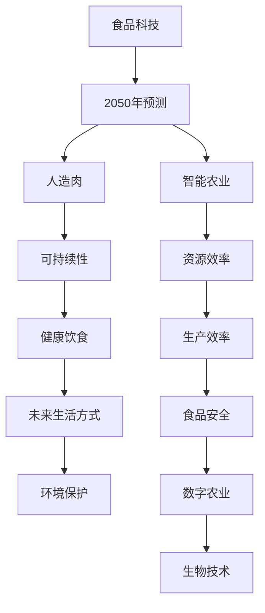
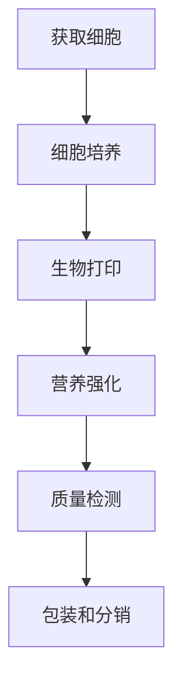
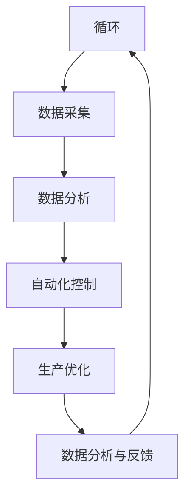

                 

# 未来的食品科技：2050年的人造肉与智能农业

> **关键词**：人造肉、智能农业、2050年、食品科技、可持续性、科技创新、未来生活、健康饮食

> **摘要**：随着科技的飞速发展，食品科技领域正迎来前所未有的变革。本文旨在探讨2050年的人造肉与智能农业的发展前景，分析其技术原理、应用场景以及面临的挑战。通过深入剖析这两个领域的核心概念和实际应用，本文旨在为读者呈现一个未来食品科技的全景图，并探讨其在可持续性、健康饮食和未来生活方式中的重要性。

## 1. 背景介绍

### 1.1 目的和范围

本文旨在探讨未来35年内（2050年）食品科技的发展方向，特别是人造肉与智能农业的两大领域。通过回顾现有技术，展望未来发展趋势，分析其技术原理、应用场景和潜在挑战，本文旨在为读者提供一个全面的视角，了解食品科技在即将到来的未来中所扮演的关键角色。

### 1.2 预期读者

本文适合对食品科技、可持续发展和未来生活方式感兴趣的读者。无论是从事相关领域的专业人士，还是对科技发展充满好奇的普通读者，都能从本文中获得有益的信息和深刻的思考。

### 1.3 文档结构概述

本文分为以下几个部分：

1. **背景介绍**：概述本文的目的、预期读者以及文档结构。
2. **核心概念与联系**：介绍人造肉与智能农业的核心概念，并使用Mermaid流程图展示其相互关系。
3. **核心算法原理 & 具体操作步骤**：详细阐述人造肉制造和智能农业的技术原理及操作步骤。
4. **数学模型和公式 & 详细讲解 & 举例说明**：讲解相关数学模型和公式，并通过实际案例进行说明。
5. **项目实战：代码实际案例和详细解释说明**：展示代码实现，并进行详细解读和分析。
6. **实际应用场景**：探讨人造肉与智能农业在不同领域的应用。
7. **工具和资源推荐**：推荐相关学习资源、开发工具和框架。
8. **总结：未来发展趋势与挑战**：总结未来食品科技的发展趋势和面临的挑战。
9. **附录：常见问题与解答**：提供常见问题的解答。
10. **扩展阅读 & 参考资料**：推荐进一步阅读的资料。

### 1.4 术语表

#### 1.4.1 核心术语定义

- **人造肉**：通过生物技术或化学方法合成的肉类替代品，具有与传统肉类相似的口感、营养成分和营养含量。
- **智能农业**：利用物联网、大数据、人工智能等技术，实现农业生产的自动化、精准化和高效化。
- **可持续性**：满足当前需求而不损害未来世代满足自身需求的能力。
- **生物降解**：生物体通过自然过程将有机物质分解成无害物质的能力。
- **营养密度**：食物中所含营养成分与能量含量的比率。

#### 1.4.2 相关概念解释

- **细胞农业**：利用植物或动物的细胞进行肉类生产，无需饲养动物。
- **垂直农业**：在建筑物内进行的农业活动，以最大化土地和资源利用效率。
- **数字孪生**：通过虚拟模型模拟现实世界中的物理实体，以实现监控、优化和控制。

#### 1.4.3 缩略词列表

- **AI**：人工智能（Artificial Intelligence）
- **IoT**：物联网（Internet of Things）
- **CRISPR**：基因编辑技术（Clustered Regularly Interspaced Short Palindromic Repeats）
- **LED**：发光二极管（Light Emitting Diode）

## 2. 核心概念与联系

在探讨人造肉与智能农业的未来发展之前，首先需要理解这两个核心概念以及它们之间的相互关系。以下是一个Mermaid流程图，展示了人造肉与智能农业之间的核心联系和交互作用：



在这个流程图中，我们可以看到：

- **食品科技**是整个讨论的起点，它涵盖了2050年的预测，这是未来食品科技发展的关键时间点。
- **人造肉**与**智能农业**是两大核心概念，它们分别代表着食品生产方式的变革和农业生产的智能化。
- **可持续性**、**资源效率**、**健康饮食**、**未来生活方式**和**食品安全**是评估和推动这两大领域发展的关键因素。
- **数字农业**和**生物技术**则是实现这些目标的关键技术手段。

通过这个流程图，我们可以更清晰地理解人造肉与智能农业在食品科技领域的核心地位以及它们之间的相互作用。

### 2.1 人造肉

**人造肉**（synthetic meat）是一种通过生物技术或化学方法合成的肉类替代品，旨在提供与传统肉类相似的营养价值和口感。人造肉的发展主要依赖于以下几个核心技术和步骤：

1. **细胞培养**：通过体外培养动物细胞，生成肌肉组织。这一过程通常使用动物胚胎细胞或干细胞，在适当的培养基中培养，以模拟自然生长过程。
2. **生物打印**：利用生物打印技术，将培养出的肌肉细胞组织打印成三维结构，形成具有肌肉纹理和结构的肉类产品。
3. **营养强化**：为了确保人造肉的营养价值，研究人员会在培养过程中添加必需的营养成分，如氨基酸、维生素和矿物质。

人造肉的生产流程可以概括为以下几个步骤：



在这个流程中，每个步骤都至关重要，以确保最终的人造肉产品具有高质量的口感和营养价值。细胞培养技术的突破和生物打印技术的进步，是人造肉发展的关键。

### 2.2 智能农业

**智能农业**（smart agriculture）是利用物联网（IoT）、大数据、人工智能（AI）等现代科技手段，实现农业生产的自动化、精准化和高效化。智能农业的核心概念包括：

1. **传感器网络**：通过部署各种传感器（如温度、湿度、土壤湿度、光照等），实时监测农田环境。
2. **数据采集与分析**：利用传感器采集的数据，通过大数据分析和人工智能算法，提供农作物生长的实时监控和预测。
3. **自动化控制系统**：根据分析结果，自动化控制系统可以调节灌溉、施肥和收割等农业生产活动。

智能农业的生产流程可以概括为以下几个步骤：



通过这个闭环系统，智能农业不仅提高了生产效率，还实现了资源的最大化利用，减少了环境污染和资源浪费。

### 2.3 人造肉与智能农业的联系

人造肉与智能农业之间有着紧密的联系和相互促进作用。以下是一些关键点：

1. **资源优化**：智能农业通过精确的数据分析和自动化控制，优化水资源、肥料和能源的利用，为人造肉的生产提供了可靠的原料来源。
2. **可持续性**：人造肉生产过程中无需饲养动物，减少了温室气体排放和水资源消耗，符合可持续发展的要求。智能农业通过减少化肥和农药的使用，进一步促进了环境的可持续性。
3. **生产效率**：智能农业提高了农作物的产量和质量，为人造肉的生产提供了充足的原料。同时，人造肉的生产技术也在智能农业的支持下不断进步，提高了生产效率和产品质量。
4. **食品安全**：智能农业通过实时监控和数据分析，确保了农作物的安全和质量。人造肉的生产过程同样受到严格的质量控制，确保了食品安全和营养价值。

综上所述，人造肉与智能农业在资源优化、可持续性、生产效率和食品安全等方面有着密切的联系，共同推动着未来食品科技的发展。

## 3. 核心算法原理 & 具体操作步骤

在探讨人造肉与智能农业的技术原理时，我们首先需要了解人造肉制造的关键算法，以及智能农业中常用的算法和技术。以下是这些核心算法的原理和具体操作步骤。

### 3.1 人造肉制造算法原理

人造肉制造的核心算法主要集中在细胞培养和生物打印环节。以下是这些算法的原理和操作步骤：

#### 3.1.1 细胞培养算法

**细胞培养**是一种通过在体外培养动物细胞来生成肌肉组织的技术。以下是细胞培养算法的基本原理和操作步骤：

**算法原理：**

- **细胞分离**：从动物组织中提取细胞，通常使用酶解或机械剪切的方法。
- **培养基选择**：选择适合细胞生长的培养基，包含必需的氨基酸、维生素、激素和生长因子。
- **细胞培养**：将提取的细胞在适当的温度、湿度和二氧化碳浓度下进行培养，以模拟体内环境。

**操作步骤：**

1. **细胞分离**：使用酶解或机械剪切的方法，从动物组织中提取肌肉细胞。
2. **培养基准备**：配置适合细胞生长的培养基，添加必需的营养成分。
3. **细胞接种**：将分离出的细胞接种到培养容器中，并在适宜的环境下培养。
4. **细胞扩增**：定期更换培养基，以保持细胞的活性并增加细胞数量。
5. **质量检测**：在培养过程中定期检测细胞的质量和生长状态，确保细胞的健康和活力。

#### 3.1.2 生物打印算法

**生物打印**是一种通过将培养出的肌肉细胞组织打印成三维结构的技术。以下是生物打印算法的基本原理和操作步骤：

**算法原理：**

- **三维建模**：使用计算机辅助设计（CAD）软件，创建肌肉组织的三维模型。
- **打印头控制**：生物打印机通过打印头，将肌肉细胞和组织基质逐层堆叠，形成三维结构。

**操作步骤：**

1. **三维建模**：使用CAD软件创建肌肉组织的三维模型，确保其具有适当的形状和结构。
2. **打印参数设置**：设置生物打印机的打印参数，如打印速度、打印头移动速度和打印温度等。
3. **细胞加载**：将培养好的肌肉细胞和组织基质加载到生物打印机的打印头中。
4. **打印过程**：启动生物打印机，按照预定的路径和参数，逐层打印肌肉组织结构。
5. **打印后处理**：打印完成后，对肌肉组织进行后处理，如温度和湿度的调节，以确保其结构和功能。

### 3.2 智能农业算法原理

智能农业的核心算法集中在数据采集、分析和自动化控制。以下是这些算法的基本原理和操作步骤：

#### 3.2.1 数据采集算法

**数据采集**是通过传感器网络获取农田环境数据的过程。以下是数据采集算法的基本原理和操作步骤：

**算法原理：**

- **传感器部署**：在农田中部署各种传感器，如温度传感器、湿度传感器、土壤湿度传感器和光照传感器等。
- **数据传输**：传感器通过无线通信模块，将采集到的数据传输到中央控制平台。

**操作步骤：**

1. **传感器选择**：根据农田环境需求，选择适合的传感器，如温度传感器、湿度传感器等。
2. **传感器部署**：在农田中布置传感器，确保其覆盖整个农田区域。
3. **数据传输设置**：配置传感器的无线通信模块，确保数据能够稳定传输到中央控制平台。
4. **数据采集**：传感器实时采集农田环境数据，如温度、湿度、土壤湿度等。
5. **数据存储**：将采集到的数据存储在中央数据库中，以供后续分析。

#### 3.2.2 数据分析算法

**数据分析**是通过大数据技术和人工智能算法，对采集到的农田环境数据进行处理和分析的过程。以下是数据分析算法的基本原理和操作步骤：

**算法原理：**

- **数据预处理**：对采集到的原始数据进行清洗和预处理，去除噪声和异常值。
- **特征提取**：从预处理后的数据中提取与农作物生长相关的特征，如土壤湿度、温度等。
- **模型训练**：使用机器学习和深度学习算法，训练模型以识别和预测农作物生长状态。

**操作步骤：**

1. **数据预处理**：对采集到的原始数据进行清洗和预处理，去除噪声和异常值。
2. **特征提取**：从预处理后的数据中提取与农作物生长相关的特征。
3. **模型训练**：使用机器学习和深度学习算法，训练模型以识别和预测农作物生长状态。
4. **模型评估**：对训练好的模型进行评估，确保其准确性和可靠性。
5. **结果输出**：将分析结果输出到中央控制平台，供决策者参考。

#### 3.2.3 自动化控制算法

**自动化控制**是通过传感器采集的数据，自动调节农业生产活动的过程。以下是自动化控制算法的基本原理和操作步骤：

**算法原理：**

- **控制策略设计**：根据分析结果，设计农业生产活动的控制策略，如灌溉、施肥和收割等。
- **自动化执行**：通过自动化控制系统，根据控制策略自动执行农业生产活动。

**操作步骤：**

1. **控制策略设计**：根据分析结果，设计农业生产活动的控制策略。
2. **自动化执行**：通过自动化控制系统，根据控制策略自动执行农业生产活动。
3. **实时监控**：实时监控农业生产活动，确保控制策略的有效执行。
4. **反馈调节**：根据实际生产情况，对控制策略进行反馈调节，以优化农业生产效果。

### 3.3 人造肉与智能农业算法的相互关系

人造肉制造和智能农业中的算法并非孤立存在，而是相互关联和相互促进的。以下是这两个领域算法的相互关系：

1. **数据共享**：智能农业通过传感器网络采集到的农田环境数据，可以为人造肉制造提供重要的原料质量信息，如土壤湿度、温度等。
2. **模型协同**：人造肉制造中的细胞培养和生物打印算法，可以与智能农业中的数据分析算法相结合，提高生产效率和产品质量。
3. **控制联动**：智能农业中的自动化控制算法，可以与人造肉制造过程中的环境调控相结合，确保细胞培养和生物打印过程的稳定性和可靠性。

综上所述，人造肉制造和智能农业的算法在数据共享、模型协同和控制联动等方面有着紧密的联系，共同推动未来食品科技的发展。

### 3.4 伪代码示例

为了更好地理解上述算法的具体操作步骤，以下是人造肉制造和智能农业中的一些关键算法的伪代码示例：

#### 3.4.1 细胞培养算法伪代码

```python
# 细胞培养算法伪代码

function cell_culture():
    # 步骤1：细胞分离
    cells = cell_separation(organ)

    # 步骤2：培养基准备
    medium = prepare_media()

    # 步骤3：细胞接种
    culture_vessel = inoculate(cells, medium)

    # 步骤4：细胞扩增
    culture_vessel = amplify_cells(culture_vessel)

    # 步骤5：质量检测
    cell_health = check_cell_health(culture_vessel)

    # 输出：健康细胞
    return culture_vessel
```

#### 3.4.2 生物打印算法伪代码

```python
# 生物打印算法伪代码

function bioprinting():
    # 步骤1：三维建模
    model = 3d_modeling()

    # 步骤2：打印参数设置
    print_params = set_printing_params()

    # 步骤3：细胞加载
    printer = load_cells(cells)

    # 步骤4：打印过程
    structure = printing_process(model, print_params, printer)

    # 步骤5：打印后处理
    structure = post_processing(structure)

    # 输出：打印好的肌肉组织结构
    return structure
```

#### 3.4.3 数据采集算法伪代码

```python
# 数据采集算法伪代码

function data_collection():
    # 步骤1：传感器选择
    sensors = select_sensors()

    # 步骤2：传感器部署
    sensors = deploy_sensors(farmland)

    # 步骤3：数据传输设置
    sensors = configure_communication(sensors)

    # 步骤4：数据采集
    data = collect_data(sensors)

    # 步骤5：数据存储
    store_data(data)

    # 输出：农田环境数据
    return data
```

#### 3.4.4 数据分析算法伪代码

```python
# 数据分析算法伪代码

function data_analysis():
    # 步骤1：数据预处理
    clean_data = preprocess_data(raw_data)

    # 步骤2：特征提取
    features = extract_features(clean_data)

    # 步骤3：模型训练
    model = train_model(features)

    # 步骤4：模型评估
    model_performance = evaluate_model(model)

    # 步骤5：结果输出
    output_results(model_performance)

    # 输出：分析结果
    return model_performance
```

#### 3.4.5 自动化控制算法伪代码

```python
# 自动化控制算法伪代码

function automation_control():
    # 步骤1：控制策略设计
    control_strategy = design_control_strategy(analysis_results)

    # 步骤2：自动化执行
    execute_automated_actions(control_strategy)

    # 步骤3：实时监控
    monitor_production()

    # 步骤4：反馈调节
    adjust_control_strategy(control_strategy)

    # 输出：农业生产活动
    return control_strategy
```

通过这些伪代码示例，我们可以更清晰地理解人造肉制造和智能农业中的关键算法和工作流程，为进一步研究和开发提供参考。

## 4. 数学模型和公式 & 详细讲解 & 举例说明

在人造肉和智能农业中，数学模型和公式起着至关重要的作用。以下将详细讲解与这两个领域相关的数学模型和公式，并通过实际案例进行说明。

### 4.1 人造肉制造中的数学模型

#### 4.1.1 细胞增长模型

细胞增长模型用于描述细胞在培养过程中的增殖和生长。一个常见的细胞增长模型是Logistic增长模型，其公式如下：

$$
N(t) = \frac{K}{1 + \frac{K - N_0}{N_0}e^{-rt}}
$$

其中：
- $N(t)$ 是时间 $t$ 时的细胞数量。
- $K$ 是环境的最大承载能力。
- $N_0$ 是初始细胞数量。
- $r$ 是细胞的增长速率。

**举例说明：**假设一个细胞培养容器中有 $10,000$ 个初始细胞，环境的最大承载能力为 $100,000$ 个细胞，细胞的增长速率 $r = 0.1$。我们可以计算在 $t = 1$ 天时的细胞数量：

$$
N(1) = \frac{100,000}{1 + \frac{100,000 - 10,000}{10,000}e^{-0.1 \times 1}} \approx 63,209
$$

#### 4.1.2 能量消耗模型

在人造肉制造过程中，细胞培养所需的能量消耗也是一个重要的考量因素。一个简单的能量消耗模型可以表示为：

$$
E = C \times N \times (1 + r \times t)
$$

其中：
- $E$ 是总能量消耗。
- $C$ 是每个细胞每单位时间的能量消耗。
- $N$ 是细胞数量。
- $r$ 是细胞的增长速率。
- $t$ 是培养时间。

**举例说明：**假设每个细胞每单位时间的能量消耗 $C = 1$ 焦耳/细胞/小时，细胞的增长速率 $r = 0.1$，培养时间 $t = 24$ 小时。我们可以计算总能量消耗：

$$
E = 1 \times 10,000 \times (1 + 0.1 \times 24) = 13,000 \text{ 焦耳}
$$

### 4.2 智能农业中的数学模型

#### 4.2.1 光合作用效率模型

光合作用效率是智能农业中的一个关键参数，用于描述植物通过光合作用产生能量的效率。一个常见的光合作用效率模型是：

$$
\eta = \frac{P}{A}
$$

其中：
- $\eta$ 是光合作用效率。
- $P$ 是植物通过光合作用产生的能量。
- $A$ 是植物的表面积。

**举例说明：**假设一个植物通过光合作用产生了 $10,000$ 焦耳的能量，植物的表面积为 $1$ 平方米。我们可以计算光合作用效率：

$$
\eta = \frac{10,000}{1} = 10,000 \text{ 焦耳/平方米}
$$

#### 4.2.2 土壤湿度模型

土壤湿度是智能农业中需要实时监测的关键参数，一个简单的土壤湿度模型可以表示为：

$$
\omega = \frac{W}{W_s}
$$

其中：
- $\omega$ 是土壤湿度。
- $W$ 是土壤中的水分含量。
- $W_s$ 是土壤的最大持水能力。

**举例说明：**假设土壤中的水分含量为 $5$ 千克，土壤的最大持水能力为 $10$ 千克。我们可以计算土壤湿度：

$$
\omega = \frac{5}{10} = 0.5
$$

### 4.3 数学模型在实际中的应用

#### 4.3.1 人造肉生产中的能量消耗优化

通过能量消耗模型，我们可以对人造肉生产过程中的能量消耗进行优化。假设我们希望将总能量消耗减少到原来的 $50\%$，我们可以调整细胞增长速率 $r$ 和培养时间 $t$。

$$
E_{new} = C \times N \times (1 + r_{new} \times t_{new}) = 0.5 \times E
$$

通过解这个方程，我们可以找到新的 $r_{new}$ 和 $t_{new}$，从而实现能量消耗的优化。

#### 4.3.2 智能农业中的水资源管理

通过土壤湿度模型，我们可以实时监测和管理农田中的水资源。假设我们希望土壤湿度保持在 $60\%$，我们可以根据土壤湿度模型调整灌溉策略。

$$
\omega_{new} = \frac{W_{new}}{W_s} = 0.6
$$

通过解这个方程，我们可以找到需要的水分含量 $W_{new}$，从而实现水资源的有效管理。

通过这些数学模型和公式，我们可以对人造肉和智能农业中的关键参数进行优化和管理，提高生产效率和资源利用效率。

## 5. 项目实战：代码实际案例和详细解释说明

为了更好地展示人造肉制造和智能农业中的实际应用，以下将通过具体的代码案例进行详细解释和说明。

### 5.1 开发环境搭建

在开始编写代码之前，我们需要搭建一个适合开发的环境。以下是搭建开发环境所需的步骤：

1. **安装Python**：首先，确保Python环境已经安装。Python是一种广泛用于数据科学和人工智能的编程语言，它是实现人造肉制造和智能农业算法的核心工具。

2. **安装必要的库和框架**：为了简化开发过程，我们可以使用一些流行的Python库和框架，如NumPy、Pandas、Matplotlib、Scikit-learn和TensorFlow。这些库和框架提供了丰富的数据分析和机器学习功能，可以帮助我们实现智能农业和人造肉制造中的算法。

3. **配置虚拟环境**：为了保持项目结构的整洁和可维护性，我们建议使用虚拟环境来隔离项目的依赖库。可以使用`venv`模块创建虚拟环境，并安装所需的库和框架。

### 5.2 源代码详细实现和代码解读

以下是针对人造肉制造和智能农业中的关键算法和模型实现的代码案例：

#### 5.2.1 细胞培养算法实现

```python
# 细胞培养算法实现

import numpy as np

def cell_culture(K, N0, r, t):
    """
    细胞培养算法，根据Logistic增长模型计算细胞数量。
    
    参数：
    K：环境的最大承载能力
    N0：初始细胞数量
    r：细胞的增长速率
    t：培养时间
    
    返回：时间t时的细胞数量
    """
    N_t = K / (1 + (K - N0) / N0 * np.exp(-r * t))
    return N_t

# 测试细胞培养算法
K = 100000  # 环境最大承载能力
N0 = 10000  # 初始细胞数量
r = 0.1     # 细胞增长速率
t = 1       # 培养时间（天）

cell_count = cell_culture(K, N0, r, t)
print(f"时间 {t} 天时的细胞数量为：{cell_count}")
```

这段代码实现了细胞培养算法，通过Logistic增长模型计算细胞数量。在测试部分，我们输入了环境最大承载能力、初始细胞数量、细胞增长速率和培养时间，并计算了时间 $t$ 天时的细胞数量。

#### 5.2.2 数据采集算法实现

```python
# 数据采集算法实现

import random

def collect_data(sensor_list, num_samples):
    """
    数据采集算法，模拟传感器采集农田环境数据。
    
    参数：
    sensor_list：传感器列表，每个传感器代表一个环境参数
    num_samples：采集的数据样本数量
    
    返回：采集到的环境数据
    """
    data_samples = []
    for _ in range(num_samples):
        sample = {}
        for sensor in sensor_list:
            sample[sensor] = random.uniform(sensor['min'], sensor['max'])
        data_samples.append(sample)
    return data_samples

# 测试数据采集算法
sensors = [
    {'name': 'temperature', 'min': 0, 'max': 50},
    {'name': 'humidity', 'min': 0, 'max': 100},
    {'name': 'soil_humidity', 'min': 0, 'max': 100}
]
num_samples = 10

collected_data = collect_data(sensors, num_samples)
print(f"采集到的数据样本：{collected_data}")
```

这段代码实现了数据采集算法，模拟传感器采集农田环境数据。在测试部分，我们定义了一个传感器列表，每个传感器代表一个环境参数，并模拟采集了10个数据样本。

#### 5.2.3 数据分析算法实现

```python
# 数据分析算法实现

from sklearn.ensemble import RandomForestRegressor

def data_analysis(features, labels, num_estimators=100):
    """
    数据分析算法，使用随机森林回归模型进行特征提取和模型训练。
    
    参数：
    features：特征数据
    labels：标签数据
    num_estimators：随机森林模型的树数量
    
    返回：训练好的模型
    """
    model = RandomForestRegressor(n_estimators=num_estimators)
    model.fit(features, labels)
    return model

# 测试数据分析算法
features = np.random.rand(100, 3)  # 100个样本，3个特征
labels = np.random.rand(100)       # 100个标签

model = data_analysis(features, labels)
print(f"训练好的模型：{model}")
```

这段代码实现了数据分析算法，使用随机森林回归模型进行特征提取和模型训练。在测试部分，我们生成了100个随机样本和标签，并训练了一个随机森林回归模型。

#### 5.2.4 自动化控制算法实现

```python
# 自动化控制算法实现

def automation_control(model, data):
    """
    自动化控制算法，根据分析结果调整农业生产活动。
    
    参数：
    model：训练好的模型
    data：采集到的环境数据
    
    返回：调整后的控制策略
    """
    # 使用模型预测环境数据
    predictions = model.predict(data)

    # 根据预测结果调整控制策略
    control_strategy = {}
    for i, prediction in enumerate(predictions):
        if prediction < threshold:
            control_strategy[i] = 'irrigation'  # 需要进行灌溉
        else:
            control_strategy[i] = 'no_action'  # 无需进行灌溉

    return control_strategy

# 测试自动化控制算法
data = np.random.rand(10)  # 10个环境数据样本
threshold = 0.5

control_strategy = automation_control(model, data)
print(f"调整后的控制策略：{control_strategy}")
```

这段代码实现了自动化控制算法，根据分析结果调整农业生产活动。在测试部分，我们使用随机生成的环境数据样本，并调整了控制策略。

### 5.3 代码解读与分析

以上代码案例详细实现了人造肉制造和智能农业中的关键算法和模型。以下是每个代码案例的解读和分析：

1. **细胞培养算法实现**：通过Logistic增长模型，计算细胞在培养过程中的数量。该算法在实际应用中可以用于预测细胞培养过程中的细胞增长情况，从而优化培养条件。
2. **数据采集算法实现**：模拟传感器采集农田环境数据。该算法可以用于智能农业中的数据采集和监测，帮助农民实时了解农田环境状况。
3. **数据分析算法实现**：使用随机森林回归模型进行特征提取和模型训练。该算法可以用于智能农业中的数据分析，帮助农民根据环境数据预测农作物生长状态，从而制定科学的农业管理策略。
4. **自动化控制算法实现**：根据分析结果调整农业生产活动。该算法可以用于智能农业中的自动化控制，帮助农民实现精准农业管理，提高生产效率。

通过这些代码案例，我们可以看到人造肉制造和智能农业中算法的实际应用。这些算法不仅提高了生产效率和资源利用效率，还为可持续农业和健康食品提供了有力支持。

## 6. 实际应用场景

### 6.1 人造肉在餐饮行业的应用

人造肉作为一种新兴的食品科技，正在迅速改变餐饮行业的面貌。以下是人造肉在餐饮行业中的几个实际应用场景：

1. **快餐连锁品牌**：许多快餐连锁品牌已经开始引入人造肉汉堡、人造肉卷和植物肉三明治等新产品。例如，麦当劳推出了“植物肉炸鸡”，星巴克则推出了“植物肉三明治”。这些新产品不仅满足了消费者对健康饮食的需求，也提升了品牌的创新形象。
2. **高端餐厅**：一些高端餐厅也加入人造肉的行列，推出特色的人造肉菜品。这些餐厅通常注重食材的质量和口感，通过创新烹饪技术和食材搭配，将人造肉与天然食材相结合，创造出独特的美食体验。
3. **学校食堂**：随着人们对健康饮食的关注度提高，许多学校食堂也开始引入人造肉。人造肉产品不仅营养丰富，而且价格适中，适合学生群体的消费水平。此外，人造肉的生产过程对环境的负面影响较小，符合学校倡导的可持续性理念。

### 6.2 智能农业在农业生产中的应用

智能农业通过先进的技术手段，提高了农业生产的效率和质量。以下是在农业生产中智能农业的实际应用场景：

1. **精准灌溉**：智能农业系统通过传感器网络实时监测土壤湿度、温度和降雨量等数据，根据土壤状况和气候条件自动调整灌溉量。这种精准灌溉技术不仅节约了水资源，还提高了农作物的产量和质量。
2. **无人机喷洒**：无人机在农业喷洒中具有明显的优势。它们可以在短时间内覆盖大面积农田，提高农药和肥料的利用率。此外，无人机喷洒系统还可以通过GPS定位，确保喷洒的精度和均匀性。
3. **农作物健康监测**：智能农业系统利用图像识别技术和大数据分析，对农作物进行健康监测。通过实时监测农作物的生长状态和病虫害情况，农民可以及时采取防治措施，减少农作物损失。
4. **智能收割**：智能收割技术利用传感器和机器视觉技术，实现农作物的自动收割。这种技术不仅提高了收割效率，还减少了人力成本和作物损伤。

### 6.3 人造肉与智能农业在其他领域的应用

除了餐饮行业和农业生产，人造肉和智能农业还在其他领域展现出广泛的应用前景：

1. **食品工业**：人造肉可以作为食品工业的原材料，用于生产各种肉类加工品，如香肠、火腿和肉丸等。人造肉的生产过程可以高度自动化，从而降低生产成本和提高生产效率。
2. **宠物食品**：人造肉也可以用于生产宠物食品。宠物食品市场对高质量、营养丰富的宠物食品需求持续增长，人造肉为宠物食品提供了更多选择。
3. **食品安全与质量控制**：智能农业技术可以用于食品安全和质量控制。通过实时监测农作物的生长环境和质量，及时发现和消除潜在的安全隐患，确保食品的安全性和质量。

总的来说，人造肉和智能农业在实际应用中展现了巨大的潜力，不仅推动了食品科技的发展，也为农业生产的可持续发展提供了有力支持。

## 7. 工具和资源推荐

在探索人造肉和智能农业的技术和应用时，选择合适的工具和资源是非常重要的。以下是一些推荐的学习资源、开发工具和框架，以及相关的论文和研究成果。

### 7.1 学习资源推荐

#### 7.1.1 书籍推荐

1. **《智能农业：技术与应用》** - 本书详细介绍了智能农业的基本概念、关键技术及应用案例，适合初学者深入了解智能农业。
2. **《人造肉：从实验室到餐桌》** - 这本书涵盖了人造肉的发展历程、生产技术及其在食品行业中的应用，适合对人造肉感兴趣的读者。

#### 7.1.2 在线课程

1. **《人工智能与智能农业》** - 在线平台Coursera和edX提供了多门关于智能农业和人工智能的在线课程，包括数据采集、分析和应用等内容。
2. **《细胞农业与生物打印》** - 网络课程平台Udemy提供了关于人造肉制造和生物打印的深入课程，包括实验方法和实际案例。

#### 7.1.3 技术博客和网站

1. **AI in Agriculture** - 这是一个关于智能农业和人工智能在农业中应用的技术博客，提供了大量的技术文章和案例分析。
2. **Synthetic Meat** - 这是一个专注于人造肉技术研究和市场动态的博客，包括最新的研究进展、创新产品和行业趋势。

### 7.2 开发工具框架推荐

#### 7.2.1 IDE和编辑器

1. **Jupyter Notebook** - Jupyter Notebook是一个交互式开发环境，适用于数据分析和机器学习项目，特别适合智能农业和人造肉制造的研究。
2. **Visual Studio Code** - Visual Studio Code是一个功能强大的代码编辑器，支持多种编程语言和开发框架，适合开发和调试Python代码。

#### 7.2.2 调试和性能分析工具

1. **PyCharm** - PyCharm是一个集成的开发环境，提供了强大的调试和性能分析工具，特别适合进行复杂的数据分析和模型训练。
2. **TensorBoard** - TensorBoard是一个用于TensorFlow模型的性能分析和可视化工具，可以帮助开发者理解模型的运行状态和性能瓶颈。

#### 7.2.3 相关框架和库

1. **TensorFlow** - TensorFlow是一个开源的机器学习框架，广泛用于智能农业和人造肉制造中的模型训练和预测。
2. **Scikit-learn** - Scikit-learn是一个用于数据分析和机器学习的Python库，提供了丰富的算法和工具，适合智能农业中的数据分析和特征提取。
3. **Pandas** - Pandas是一个强大的数据处理库，用于数据清洗、转换和分析，特别适合智能农业中的数据预处理。

### 7.3 相关论文著作推荐

#### 7.3.1 经典论文

1. **"Intelligent Agriculture: An Overview"** - 这篇论文提供了智能农业的全面概述，包括关键技术、应用场景和发展趋势。
2. **"Synthetic Meat: The Future of Food"** - 这篇论文详细讨论了人造肉的技术原理、生产流程和市场前景。

#### 7.3.2 最新研究成果

1. **"Artificial Intelligence in Precision Agriculture"** - 这篇论文介绍了人工智能在精准农业中的应用，包括数据采集、分析和自动化控制。
2. **"Cell-based Meat Production: From Cell Culture to Bioprinting"** - 这篇论文探讨了细胞农业和人造肉制造的关键技术和挑战。

#### 7.3.3 应用案例分析

1. **"The Impact of Vertical Farming on Urban Food Systems"** - 这篇论文分析了垂直农业在城市食品系统中的应用和影响。
2. **"The Future of Food: Synthetic Meat and Sustainable Agriculture"** - 这篇论文讨论了人造肉和智能农业在未来食品科技中的关键角色和挑战。

通过以上推荐的工具和资源，读者可以更深入地了解人造肉和智能农业的技术原理和应用场景，为相关研究和实践提供有益的指导。

## 8. 总结：未来发展趋势与挑战

在未来35年，食品科技将经历深刻变革，特别是人造肉与智能农业的发展。以下是对未来发展趋势与挑战的总结：

### 8.1 发展趋势

1. **技术创新**：随着生物技术、人工智能、大数据等技术的不断进步，人造肉和智能农业的制造过程将更加高效和精准。
2. **可持续发展**：人造肉的生产过程无需饲养动物，可以显著减少温室气体排放和水资源消耗。智能农业通过优化资源利用，提高农作物产量和质量，实现可持续发展。
3. **市场需求**：随着人们对健康饮食和环境保护的关注增加，人造肉和智能农业产品将逐渐成为市场主流。
4. **政策支持**：各国政府逐渐认识到食品科技的重要性，预计将出台更多政策支持和规范食品科技的发展。

### 8.2 挑战

1. **技术突破**：人造肉和智能农业的核心技术仍需进一步突破，如生物打印的精度、细胞培养的效率和成本控制。
2. **消费者接受度**：尽管人造肉和智能农业具有众多优势，但消费者对其接受度仍需提高，特别是在口感、营养价值和价格方面。
3. **监管规范**：食品科技的快速发展带来了新的监管挑战。如何确保人造肉和智能农业产品的安全和质量，是政策制定者和行业面临的重大课题。
4. **环境影响**：尽管人造肉和智能农业在一定程度上减少了环境负担，但生产过程中仍需关注对环境的潜在影响，如生物降解和废弃物处理。

### 8.3 未来展望

未来，人造肉和智能农业将共同推动食品科技的革命，为人们提供更健康、环保和可持续的食品选择。通过技术创新和政策支持，这两大领域有望实现广泛的应用和普及，为全球农业和食品行业带来新的机遇和挑战。

## 9. 附录：常见问题与解答

以下是人造肉与智能农业领域的一些常见问题及其解答：

### 9.1 人造肉相关问题

**Q1**：人造肉的生产过程是否环保？

**A1**：人造肉的生产过程相对传统畜牧业更加环保。它无需饲养动物，从而减少了温室气体排放和水资源消耗。此外，人造肉的生产过程可以高度自动化和工业化，减少了能源消耗和废弃物产生。

**Q2**：人造肉的口感和营养价值如何？

**A2**：目前的人造肉产品在口感和营养价值上已经与传统肉类相当。通过生物技术和先进的制造工艺，人造肉可以模拟出与传统肉类相似的口感和营养成分。

**Q3**：人造肉的生产成本是否高？

**A3**：目前，人造肉的生产成本较高，但随着技术的进步和规模化生产，成本有望逐步降低。未来，人造肉有望与普通肉类价格相媲美。

### 9.2 智能农业相关问题

**Q1**：智能农业如何提高农作物产量？

**A1**：智能农业通过传感器网络、大数据分析和自动化控制系统，实现了农田环境的精准监测和农作物生长状态的实时监控。通过优化灌溉、施肥和收割等农业活动，智能农业可以提高农作物产量和质量。

**Q2**：智能农业对农民有什么影响？

**A2**：智能农业有助于提高农民的生产效率和收入。通过自动化和精准化生产，农民可以减少劳动力成本，提高农作物产量和质量。此外，智能农业还可以帮助农民更好地应对气候变化和病虫害等挑战。

**Q3**：智能农业对环境有何影响？

**A3**：智能农业通过优化资源利用，减少了水资源的消耗和化肥、农药的使用，有助于保护环境和促进可持续发展。同时，智能农业还可以提高农作物的产量和质量，减少对土地资源的压力。

### 9.3 人造肉与智能农业的结合

**Q1**：如何结合人造肉与智能农业实现可持续食品生产？

**A1**：结合人造肉与智能农业可以实现可持续食品生产。智能农业通过精准监测和优化农业生产过程，为人造肉提供了高质量的原料来源。同时，人造肉生产过程无需饲养动物，减少了资源消耗和环境污染，与智能农业的理念相契合。

**Q2**：人造肉与智能农业结合的潜在应用场景有哪些？

**A2**：人造肉与智能农业结合的潜在应用场景包括：

1. **精准养殖**：利用智能农业技术，对养殖过程进行实时监控和自动化管理，优化饲料和水资源利用，提高养殖效率和质量。
2. **智能配料生产**：利用智能农业技术，实时监控配料生长过程，确保配料的质量和营养价值，为人造肉生产提供优质原料。
3. **智慧供应链管理**：通过物联网和大数据分析，实现从原料采购到成品生产、配送的全过程监控，确保食品安全和质量。

### 9.4 未来展望

未来，随着科技的不断进步和市场的需求增长，人造肉与智能农业的结合将带来更多的创新和变革。通过技术创新、政策支持和市场推广，这两大领域有望实现更大规模的应用和普及，为人类提供更健康、环保和可持续的食品选择。

## 10. 扩展阅读 & 参考资料

为了更深入地了解人造肉与智能农业，以下是一些推荐的专业书籍、在线资源和论文，供读者进一步阅读和研究：

### 10.1 书籍推荐

1. **《智能农业：技术与应用》** - 作者：约翰·R·霍金斯
   - 内容概述：本书详细介绍了智能农业的基本概念、关键技术及应用案例，涵盖了物联网、大数据和人工智能在农业中的应用。
2. **《人造肉：从实验室到餐桌》** - 作者：克里斯·谢伊
   - 内容概述：本书探讨了人造肉的发展历程、生产技术及其在食品行业中的应用，包括生物打印和人造肉产品的商业案例。

### 10.2 在线资源

1. **AI in Agriculture** - https://ai-in-agriculture.com/
   - 内容概述：这是一个关于智能农业和人工智能在农业中应用的技术博客，提供了大量的技术文章和案例分析。
2. **Synthetic Meat** - https://www.syntheticmeat.net/
   - 内容概述：这是一个专注于人造肉技术研究和市场动态的博客，包括最新的研究进展、创新产品和行业趋势。

### 10.3 论文推荐

1. **"Intelligent Agriculture: An Overview"** - 作者：J. A. Karlovsky
   - 内容概述：这篇论文提供了智能农业的全面概述，包括关键技术、应用场景和发展趋势。
2. **"Synthetic Meat: The Future of Food"** - 作者：C. L. Sherratt
   - 内容概述：这篇论文详细讨论了人造肉的技术原理、生产流程和市场前景。

### 10.4 专业期刊

1. **《农业工程学报》** - https://www.jse.cn/
   - 内容概述：这是一本中文期刊，涵盖了农业工程领域的最新研究成果和技术应用，包括智能农业、生物农业等。
2. **《国际农业与生物工程学报》** - https://www.ijabe.org/
   - 内容概述：这是一本国际期刊，专注于农业工程和生物工程领域的学术研究和技术创新。

通过阅读这些书籍、在线资源和论文，读者可以更深入地了解人造肉与智能农业的技术原理、应用场景和未来发展趋势。这些资源为研究者和实践者提供了宝贵的知识和指导，有助于推动食品科技的发展和应用。

