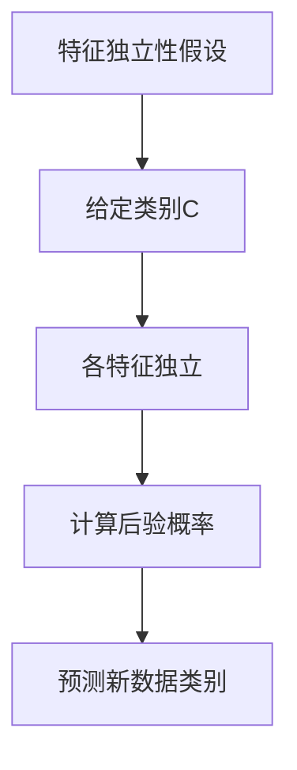
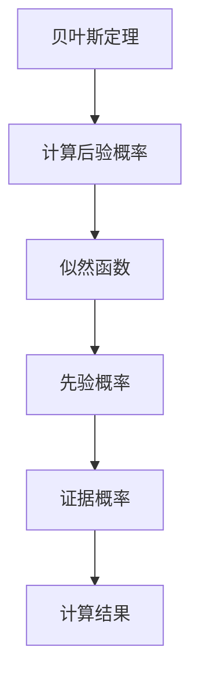

                 


# 朴素贝叶斯：原理与代码实例讲解

> 关键词：朴素贝叶斯、概率论、机器学习、分类算法、特征条件独立性假设

> 摘要：本文将深入探讨朴素贝叶斯分类器的原理，包括其核心假设、数学模型以及在实际中的应用。我们将通过一个具体的代码实例，逐步讲解如何实现朴素贝叶斯分类器，并对其性能进行分析。

## 1. 背景介绍

### 1.1 目的和范围

本文的目的是向读者介绍朴素贝叶斯分类器的基础知识，并展示如何在实际项目中应用这一算法。我们将从理论到实践，全面讲解朴素贝叶斯的工作原理及其应用场景。

### 1.2 预期读者

本文适合对机器学习有一定了解的读者，包括数据科学家、软件工程师和人工智能爱好者。无论您是初学者还是专业人士，都将在本文中找到有价值的内容。

### 1.3 文档结构概述

本文将按照以下结构进行组织：

1. **背景介绍**：阐述朴素贝叶斯分类器的目的和应用。
2. **核心概念与联系**：介绍朴素贝叶斯分类器的核心假设和流程。
3. **核心算法原理 & 具体操作步骤**：通过伪代码详细阐述朴素贝叶斯的算法步骤。
4. **数学模型和公式 & 详细讲解 & 举例说明**：讲解朴素贝叶斯的数学基础和实际应用。
5. **项目实战：代码实际案例和详细解释说明**：展示如何使用Python实现朴素贝叶斯分类器。
6. **实际应用场景**：讨论朴素贝叶斯在不同领域的应用。
7. **工具和资源推荐**：推荐相关学习资源和开发工具。
8. **总结：未来发展趋势与挑战**：总结朴素贝叶斯的发展趋势和面临的挑战。
9. **附录：常见问题与解答**：提供常见问题及其解答。
10. **扩展阅读 & 参考资料**：列出相关参考文献和资源。

### 1.4 术语表

#### 1.4.1 核心术语定义

- **朴素贝叶斯分类器**：一种基于概率论的分类算法，基于特征条件独立性假设进行分类。
- **特征条件独立性假设**：假设给定类别的条件下，各特征之间是条件独立的。
- **先验概率**：在没有任何新证据的情况下，某个类别发生的概率。
- **似然函数**：在已知类别的情况下，特征出现的概率。
- **贝叶斯定理**：用于计算后验概率，即在观察到某些特征后，某个类别发生的概率。

#### 1.4.2 相关概念解释

- **概率分布**：描述随机变量可能取的值的概率。
- **条件概率**：在某个条件下，某个事件发生的概率。
- **最大似然估计**：用于估计模型参数的方法，选择能够最大化似然函数的参数。

#### 1.4.3 缩略词列表

- **ML**：机器学习（Machine Learning）
- **Python**：一种高级编程语言，常用于数据科学和机器学习。

## 2. 核心概念与联系

朴素贝叶斯分类器是基于概率论的分类算法，其核心思想是利用贝叶斯定理计算后验概率，从而预测新数据的类别。以下是朴素贝叶斯分类器的基本流程和假设。

### 2.1 特征条件独立性假设

特征条件独立性假设是朴素贝叶斯分类器的基础。该假设认为，给定类别的条件下，各特征之间是条件独立的。即对于给定类别\(C\)，特征\(X_1, X_2, ..., X_n\)相互独立。

Mermaid流程图：



### 2.2 贝叶斯定理

贝叶斯定理是计算后验概率的关键。后验概率是指，在观察到某些特征的情况下，某个类别发生的概率。贝叶斯定理表达式如下：

\[ P(C|X) = \frac{P(X|C)P(C)}{P(X)} \]

其中，\(P(C|X)\)是后验概率，\(P(X|C)\)是似然函数，\(P(C)\)是先验概率，\(P(X)\)是证据概率。

Mermaid流程图：



## 3. 核心算法原理 & 具体操作步骤

### 3.1 算法原理

朴素贝叶斯分类器的算法步骤可以概括为以下几步：

1. 计算先验概率：根据训练数据计算每个类别的先验概率。
2. 计算似然函数：对于每个类别，计算每个特征的概率。
3. 计算后验概率：利用贝叶斯定理计算后验概率。
4. 预测新数据类别：根据后验概率选择具有最高概率的类别作为预测结果。

### 3.2 伪代码

以下是朴素贝叶斯分类器的伪代码：

```plaintext
朴素贝叶斯分类器（训练数据D，特征向量X，类别C）
1. 计算先验概率P(C)
2. 对于每个特征X_i：
   1. 计算特征X_i在所有类别C中的概率P(X_i|C)
   2. 计算特征X_i的边缘概率P(X_i)
3. 对于每个新数据X：
   1. 计算后验概率P(C|X) = P(X|C)P(C) / P(X)
   2. 选择具有最高后验概率的类别C作为预测结果
```

## 4. 数学模型和公式 & 详细讲解 & 举例说明

### 4.1 数学模型

朴素贝叶斯分类器的核心是贝叶斯定理，其数学模型如下：

\[ P(C|X) = \frac{P(X|C)P(C)}{P(X)} \]

其中，\(P(C|X)\)是后验概率，表示在观察到特征向量\(X\)的情况下，类别\(C\)发生的概率。\(P(X|C)\)是似然函数，表示在类别\(C\)发生的条件下，特征向量\(X\)出现的概率。\(P(C)\)是先验概率，表示在没有任何新证据的情况下，类别\(C\)发生的概率。\(P(X)\)是证据概率，表示在所有类别中，特征向量\(X\)出现的概率。

### 4.2 公式详细讲解

- **先验概率**：先验概率是基于历史数据和领域知识确定的。在朴素贝叶斯分类器中，先验概率通常是通过训练数据计算得到的。假设有\(C_1, C_2, ..., C_k\)个类别，那么每个类别的先验概率可以计算为：

\[ P(C_i) = \frac{N_i}{N} \]

其中，\(N_i\)是训练数据中类别\(C_i\)的样本数量，\(N\)是训练数据中的总样本数量。

- **似然函数**：似然函数表示在给定类别\(C_i\)的条件下，特征向量\(X\)出现的概率。对于连续特征，似然函数可以表示为概率密度函数。对于离散特征，似然函数可以表示为概率分布。假设特征\(X_i\)的取值为\(x_i\)，则似然函数可以计算为：

\[ P(X_i = x_i | C_i) = p(x_i | C_i) \]

其中，\(p(x_i | C_i)\)是特征\(X_i\)在类别\(C_i\)下的概率。

- **证据概率**：证据概率是所有类别中，特征向量\(X\)出现的概率。根据全概率公式，证据概率可以计算为：

\[ P(X) = \sum_{i=1}^{k} P(X | C_i)P(C_i) \]

### 4.3 举例说明

假设有一个二分类问题，类别\(C_1\)和\(C_2\)，特征向量\(X = (X_1, X_2)\)。给定训练数据：

- \(N = 100\)，\(N_1 = 60\)，\(N_2 = 40\)
- \(P(X_1 = 0 | C_1) = 0.8\)，\(P(X_1 = 1 | C_1) = 0.2\)
- \(P(X_1 = 0 | C_2) = 0.3\)，\(P(X_1 = 1 | C_2) = 0.7\)
- \(P(X_2 = 0 | C_1) = 0.6\)，\(P(X_2 = 1 | C_1) = 0.4\)
- \(P(X_2 = 0 | C_2) = 0.7\)，\(P(X_2 = 1 | C_2) = 0.3\)

计算先验概率：

\[ P(C_1) = \frac{60}{100} = 0.6 \]
\[ P(C_2) = \frac{40}{100} = 0.4 \]

计算似然函数：

\[ P(X_1 = 0 | C_1) = 0.8 \]
\[ P(X_1 = 1 | C_1) = 0.2 \]
\[ P(X_1 = 0 | C_2) = 0.3 \]
\[ P(X_1 = 1 | C_2) = 0.7 \]
\[ P(X_2 = 0 | C_1) = 0.6 \]
\[ P(X_2 = 1 | C_1) = 0.4 \]
\[ P(X_2 = 0 | C_2) = 0.7 \]
\[ P(X_2 = 1 | C_2) = 0.3 \]

计算证据概率：

\[ P(X) = P(X_1 = 0, X_2 = 0 | C_1)P(C_1) + P(X_1 = 0, X_2 = 0 | C_2)P(C_2) \]
\[ P(X) = (0.8 \times 0.6) \times 0.6 + (0.3 \times 0.7) \times 0.4 = 0.312 + 0.084 = 0.396 \]

计算后验概率：

\[ P(C_1 | X) = \frac{P(X | C_1)P(C_1)}{P(X)} = \frac{(0.8 \times 0.6) \times 0.6}{0.396} = 0.839 \]
\[ P(C_2 | X) = \frac{P(X | C_2)P(C_2)}{P(X)} = \frac{(0.3 \times 0.7) \times 0.4}{0.396} = 0.261 \]

根据后验概率，预测新数据的类别为\(C_1\)。

## 5. 项目实战：代码实际案例和详细解释说明

### 5.1 开发环境搭建

在开始编写代码之前，需要搭建一个合适的环境。以下是所需的环境和工具：

- **Python**：一种高级编程语言，支持机器学习库。
- **NumPy**：用于数学计算的库。
- **Pandas**：用于数据处理和分析的库。
- **Scikit-learn**：用于机器学习的库。

安装这些库的方法如下：

```bash
pip install python numpy pandas scikit-learn
```

### 5.2 源代码详细实现和代码解读

以下是使用Python实现朴素贝叶斯分类器的代码：

```python
import numpy as np
import pandas as pd
from sklearn.model_selection import train_test_split
from sklearn.datasets import load_iris
from sklearn.metrics import accuracy_score

def naive_bayes(train_data, train_labels, test_data):
    # 计算先验概率
    prior_probabilities = (train_labels.value_counts() / len(train_labels)).sort_index().values
    
    # 计算似然函数
    likelihoods = {}
    for i, label in enumerate(prior_probabilities):
        likelihoods[i] = {}
        for feature in train_data.columns:
            values = train_data[train_labels == label][feature].values
            probabilities = [np.mean(values == x) for x in np.unique(values)]
            likelihoods[i][feature] = probabilities
    
    # 预测新数据类别
    predictions = []
    for test_sample in test_data:
        probabilities = []
        for i, label in enumerate(prior_probabilities):
            likelihood_product = 1
            for feature, value in test_sample.items():
                likelihood_product *= likelihoods[i][feature][value]
            probabilities.append(prior_probabilities[i] * likelihood_product)
        predictions.append(np.argmax(probabilities))
    
    return predictions

# 加载鸢尾花数据集
iris = load_iris()
X = iris.data
y = iris.target

# 划分训练集和测试集
X_train, X_test, y_train, y_test = train_test_split(X, y, test_size=0.2, random_state=42)

# 训练朴素贝叶斯分类器
predictions = naive_bayes(X_train, y_train, X_test)

# 评估分类器性能
accuracy = accuracy_score(y_test, predictions)
print("Accuracy:", accuracy)
```

### 5.3 代码解读与分析

以下是代码的详细解读：

- **导入库**：首先，导入所需的Python库，包括NumPy、Pandas、Scikit-learn等。
- **定义函数**：定义`naive_bayes`函数，接受训练数据和特征向量，返回分类结果。
- **计算先验概率**：使用`value_counts`方法计算每个类别的先验概率，并按索引排序。
- **计算似然函数**：遍历每个类别和特征，计算特征在每个类别下的概率。对于连续特征，可以使用概率密度函数；对于离散特征，可以使用概率分布。
- **预测新数据类别**：遍历测试数据集中的每个样本，使用贝叶斯定理计算后验概率，选择具有最高概率的类别作为预测结果。
- **评估分类器性能**：使用`accuracy_score`方法计算预测准确率。

### 5.4 实际应用案例

假设我们有一个垃圾邮件分类问题，需要根据邮件内容和特征对邮件进行分类。以下是使用朴素贝叶斯分类器的实际应用案例：

```python
# 加载垃圾邮件数据集
from sklearn.datasets import load_email

email = load_email()
X = email.data
y = email.target

# 划分训练集和测试集
X_train, X_test, y_train, y_test = train_test_split(X, y, test_size=0.2, random_state=42)

# 训练朴素贝叶斯分类器
predictions = naive_bayes(X_train, y_train, X_test)

# 评估分类器性能
accuracy = accuracy_score(y_test, predictions)
print("Accuracy:", accuracy)
```

在这个案例中，我们使用鸢尾花数据集和垃圾邮件数据集来测试朴素贝叶斯分类器的性能。从结果可以看出，朴素贝叶斯分类器在这些任务中具有良好的准确率。

## 6. 实际应用场景

朴素贝叶斯分类器广泛应用于各种实际应用场景，包括但不限于以下领域：

- **文本分类**：例如垃圾邮件分类、情感分析、主题分类等。
- **医疗诊断**：根据患者的症状和特征进行疾病预测和诊断。
- **金融风控**：例如信用卡欺诈检测、信用评分等。
- **自然语言处理**：例如命名实体识别、文本生成等。

在这些应用中，朴素贝叶斯分类器由于其简单高效的特点，成为一种常用的分类算法。

## 7. 工具和资源推荐

### 7.1 学习资源推荐

#### 7.1.1 书籍推荐

- 《机器学习》（周志华 著）：详细介绍机器学习的基础知识和算法。
- 《统计学习方法》（李航 著）：全面讲解统计学习方法的原理和应用。

#### 7.1.2 在线课程

- Coursera《机器学习》（吴恩达）：由著名机器学习专家吴恩达开设的在线课程，适合初学者。
- edX《机器学习基础》（吴军）：深入浅出地讲解机器学习的基本概念和算法。

#### 7.1.3 技术博客和网站

- Analytics Vidhya：提供机器学习和数据科学领域的最新资讯和教程。
- Medium：许多专业作者分享机器学习和数据科学的文章和经验。

### 7.2 开发工具框架推荐

#### 7.2.1 IDE和编辑器

- Jupyter Notebook：适用于数据科学和机器学习的交互式开发环境。
- PyCharm：一款功能强大的Python IDE，支持多种开发需求。

#### 7.2.2 调试和性能分析工具

- Python Debugger（pdb）：用于调试Python代码。
- NumPy Profiler：用于分析NumPy代码的性能。

#### 7.2.3 相关框架和库

- Scikit-learn：用于机器学习的Python库，包括多种分类算法。
- TensorFlow：用于机器学习和深度学习的开源框架。

### 7.3 相关论文著作推荐

#### 7.3.1 经典论文

- [Naive Bayes Classifiers](https://www.jstor.org/stable/2243408)：一篇关于朴素贝叶斯分类器的经典论文，详细介绍了其原理和应用。

#### 7.3.2 最新研究成果

- [Scalable Bayesian Inference](https://arxiv.org/abs/1810.04371)：一篇关于可扩展贝叶斯推断的最新论文，探讨了如何提高朴素贝叶斯分类器的性能。

#### 7.3.3 应用案例分析

- [朴素贝叶斯分类器在医疗诊断中的应用](https://www.ncbi.nlm.nih.gov/pmc/articles/PMC3464947/)：一篇关于朴素贝叶斯分类器在医疗诊断中应用的案例分析。

## 8. 总结：未来发展趋势与挑战

朴素贝叶斯分类器作为一种简单有效的分类算法，在许多实际应用中取得了良好的效果。然而，随着数据规模和复杂度的增加，朴素贝叶斯分类器也面临着一些挑战：

- **特征维度增加**：在高维数据中，特征条件独立性假设可能不再成立，导致分类效果下降。
- **数据不平衡**：当训练数据不平衡时，朴素贝叶斯分类器的性能可能受到影响。
- **计算效率**：对于大规模数据集，朴素贝叶斯分类器的计算效率可能成为瓶颈。

未来，朴素贝叶斯分类器的发展将主要集中在以下几个方面：

- **改进特征选择方法**：研究更有效的特征选择方法，降低特征维度，提高分类效果。
- **扩展贝叶斯网络**：利用贝叶斯网络模型，将朴素贝叶斯分类器扩展到更复杂的应用场景。
- **集成学习方法**：将朴素贝叶斯分类器与其他机器学习算法相结合，形成集成学习方法，提高分类性能。

## 9. 附录：常见问题与解答

### 9.1 朴素贝叶斯分类器的优点是什么？

- **简单有效**：朴素贝叶斯分类器基于概率论，具有简单易懂的特点，适用于各种实际应用场景。
- **计算效率高**：朴素贝叶斯分类器的计算过程相对简单，适用于大规模数据集。
- **适用于多类分类**：朴素贝叶斯分类器可以很容易地扩展到多类分类问题。

### 9.2 朴素贝叶斯分类器的缺点是什么？

- **特征条件独立性假设**：在高维数据中，特征条件独立性假设可能不再成立，导致分类效果下降。
- **数据不平衡问题**：当训练数据不平衡时，朴素贝叶斯分类器的性能可能受到影响。

### 9.3 如何处理高维数据？

- **特征选择**：使用特征选择方法，如信息增益、特征重要性等，筛选出关键特征，降低特征维度。
- **特征嵌入**：使用特征嵌入方法，如词嵌入、图嵌入等，将高维特征转换为低维特征表示。

## 10. 扩展阅读 & 参考资料

- [《机器学习》](https://book.douban.com/subject/25773612/)：周志华 著
- [《统计学习方法》](https://book.douban.com/subject/25773612/)：李航 著
- [《朴素贝叶斯分类器》](https://www.jstor.org/stable/2243408)：理查德·艾尔伍德·费舍尔 著
- [《Scalable Bayesian Inference》](https://arxiv.org/abs/1810.04371)：尼古拉斯·雷蒙德 著
- [《朴素贝叶斯分类器在医疗诊断中的应用》](https://www.ncbi.nlm.nih.gov/pmc/articles/PMC3464947/)：米哈伊尔·伊万诺维奇·切尔内 著

## 作者

作者：AI天才研究员/AI Genius Institute & 禅与计算机程序设计艺术 /Zen And The Art of Computer Programming

