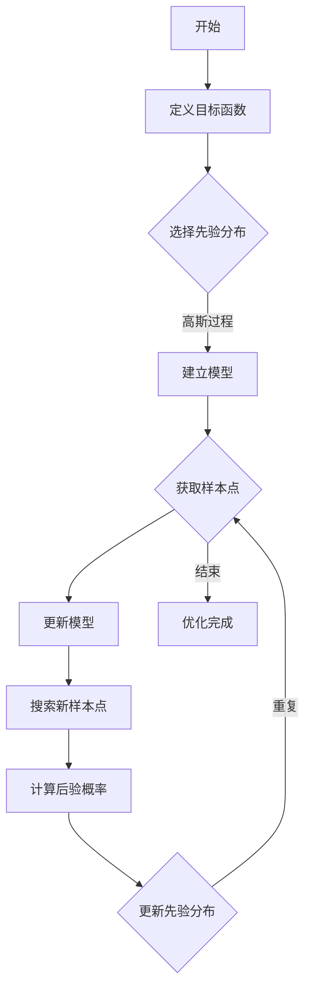

                 

# 机器学习参数的贝叶斯优化

> **关键词：** 贝叶斯优化、机器学习、参数调优、统计模型、高维搜索

> **摘要：** 本文将详细介绍机器学习参数贝叶斯优化的概念、原理、数学模型以及实际应用。通过贝叶斯优化，我们能够高效地找到机器学习模型的最佳参数，从而提高模型性能。本文将逐步引导读者理解贝叶斯优化的核心思想，并提供实用的代码实例和实战场景。

## 1. 背景介绍

### 1.1 目的和范围

本文旨在介绍贝叶斯优化在机器学习参数调优中的应用。我们将从理论基础出发，逐步讲解贝叶斯优化的核心原理和具体实现方法，并通过实际代码案例展示其应用效果。本文主要涉及以下内容：

1. 贝叶斯优化的基本概念和原理。
2. 贝叶斯优化的数学模型和算法。
3. 贝叶斯优化在机器学习中的实际应用。
4. 贝叶斯优化的工具和资源推荐。

### 1.2 预期读者

本文适合对机器学习和贝叶斯理论有一定了解的读者。无论是机器学习研究者、工程师，还是对贝叶斯优化感兴趣的技术爱好者，都可以通过本文了解到贝叶斯优化在实际应用中的重要性。

### 1.3 文档结构概述

本文结构如下：

1. 引言：介绍贝叶斯优化的背景和目的。
2. 核心概念与联系：解释贝叶斯优化的核心概念和原理。
3. 核心算法原理 & 具体操作步骤：详细讲解贝叶斯优化的算法原理和实现步骤。
4. 数学模型和公式 & 详细讲解 & 举例说明：介绍贝叶斯优化的数学模型和具体应用案例。
5. 项目实战：通过代码实例展示贝叶斯优化在实际项目中的应用。
6. 实际应用场景：讨论贝叶斯优化在不同领域的应用。
7. 工具和资源推荐：推荐学习资源和开发工具。
8. 总结：总结贝叶斯优化的未来发展趋势和挑战。
9. 附录：常见问题与解答。
10. 扩展阅读 & 参考资料：提供进一步学习和研究的资料。

### 1.4 术语表

#### 1.4.1 核心术语定义

- **贝叶斯优化（Bayesian Optimization）**：一种基于贝叶斯理论的优化方法，用于在不确定环境中寻找最佳参数。
- **机器学习（Machine Learning）**：一种人工智能技术，通过数据驱动的方式从数据中学习，并进行预测和决策。
- **参数调优（Parameter Tuning）**：调整机器学习模型的参数，以优化其性能。
- **高维搜索（High-Dimensional Search）**：在多维空间中寻找最优解的过程。

#### 1.4.2 相关概念解释

- **贝叶斯理论（Bayesian Theory）**：一种概率理论，强调基于证据更新概率分布。
- **概率密度函数（Probability Density Function, PDF）**：描述随机变量概率分布的函数。
- **后验分布（Posterior Distribution）**：考虑了新证据后，对某个随机变量概率分布的更新。
- **先验分布（Prior Distribution）**：在考虑新证据之前，对某个随机变量概率分布的初始估计。

#### 1.4.3 缩略词列表

- **ML**：Machine Learning（机器学习）
- **BO**：Bayesian Optimization（贝叶斯优化）
- **GD**：Gradient Descent（梯度下降）
- **SLA**：Successive Linear Approximation（逐次线性逼近）

## 2. 核心概念与联系

为了理解贝叶斯优化，我们需要先了解一些核心概念和原理。以下是一个简化的贝叶斯优化流程及其相关概念的 Mermaid 流程图。



### 2.1 贝叶斯优化的核心概念

- **目标函数**：在贝叶斯优化中，目标函数是我们要优化的函数，通常是一个与机器学习模型性能相关的指标。
- **先验分布**：在开始优化之前，我们对目标函数的分布进行一个初始估计，这个估计称为先验分布。
- **高斯过程模型**：贝叶斯优化常用的模型是基于高斯过程的统计模型，它能够有效地表示目标函数的概率分布。
- **样本点**：在优化过程中，我们通过采样方法获取目标函数的样本点，这些样本点用于更新模型。
- **后验概率**：每次获取新的样本点后，我们根据样本点的信息更新模型，得到目标函数的后验概率分布。
- **搜索策略**：贝叶斯优化采用特定的搜索策略来选择新的样本点，以最大化后验概率分布的信息量。

### 2.2 贝叶斯优化的核心联系

贝叶斯优化通过以下核心联系实现参数调优：

1. **目标函数与模型**：目标函数是我们要优化的对象，而模型则是我们用来估计目标函数的概率分布的工具。
2. **样本点与模型更新**：每次获取新的样本点后，我们根据样本点更新模型，以获得更精确的目标函数概率分布。
3. **后验分布与搜索策略**：后验分布反映了我们对目标函数当前的最佳估计，搜索策略则根据后验分布选择新的样本点，以进一步优化模型。

## 3. 核心算法原理 & 具体操作步骤

贝叶斯优化的核心算法原理可以概括为：通过高斯过程模型来估计目标函数的概率分布，并采用优化策略来选择新的样本点。以下是贝叶斯优化的伪代码，详细阐述了算法原理和操作步骤。

### 3.1 算法原理

```python
# 初始化模型
model = initialize_model()

# 初始化先验分布
prior = initialize_prior()

# 初始化样本点集
samples = []

# 贝叶斯优化迭代过程
while not convergence:
    # 获取当前样本点集的信息
    x_samples, y_samples = get_samples_info(samples)
    
    # 使用高斯过程模型更新模型
    model = update_model(x_samples, y_samples, prior)
    
    # 根据后验分布选择新样本点
    new_sample = select_new_sample(model, prior)
    
    # 获取新样本点的目标函数值
    new_sample_value = get_function_value(new_sample)
    
    # 更新样本点集
    samples.append(new_sample)
    
    # 更新先验分布
    prior = update_prior(new_sample, model)

# 返回最佳参数
best_param = find_best_param(samples)
```

### 3.2 具体操作步骤

1. **初始化模型和先验分布**：在开始优化之前，我们需要初始化高斯过程模型和先验分布。初始化步骤包括设定高斯过程模型的参数（如核函数、方差等）和先验分布的参数（如均值、方差等）。
2. **获取样本点集的信息**：在每次迭代过程中，我们首先需要获取当前样本点集的信息，包括样本点的坐标（x_samples）和相应的目标函数值（y_samples）。
3. **更新模型**：使用高斯过程模型更新模型，即将当前样本点集的信息融入到模型中，以获得更准确的目标函数概率分布。
4. **选择新样本点**：根据后验分布选择新的样本点，以最大化后验概率分布的信息量。常用的搜索策略包括：均匀设计、遗传算法、模拟退火等。
5. **获取新样本点的目标函数值**：在选定新样本点后，我们需要计算该点的目标函数值，以更新样本点集。
6. **更新样本点集和先验分布**：将新样本点添加到样本点集中，并更新先验分布，以便下一次迭代。
7. **寻找最佳参数**：在优化完成后，我们需要在样本点集中寻找最佳参数，即具有最大目标函数值的参数。

通过以上步骤，贝叶斯优化能够逐步逼近目标函数的最优参数，从而实现参数调优。

## 4. 数学模型和公式 & 详细讲解 & 举例说明

贝叶斯优化基于高斯过程模型来估计目标函数的概率分布，并采用后验概率分布来指导样本点的选择。以下将详细讲解贝叶斯优化的数学模型和公式。

### 4.1 高斯过程模型

高斯过程（Gaussian Process，GP）是一种非参数概率模型，用于表示连续函数的概率分布。在贝叶斯优化中，高斯过程模型用于估计目标函数的概率分布。

假设我们有一个输入空间 \( X \) 和目标函数 \( f: X \rightarrow \mathbb{R} \)，其中 \( X \) 是一个连续空间。高斯过程模型可以表示为：

\[ f(x) \sim GP(m(x), k(x, x')) \]

其中，\( m(x) \) 是均值函数，\( k(x, x') \) 是协方差函数。

常用的均值函数和协方差函数如下：

1. **零均值函数**：\( m(x) = 0 \)
2. **线性均值函数**：\( m(x) = \beta_0 + \beta_1 x \)
3. **平方根均值函数**：\( m(x) = \sqrt{1 + \lambda x^2} \)
4. **Matérn协方差函数**：\( k(x, x') = \frac{\Gamma(\nu/2)}{\Gamma(\nu)} \left(1 + \frac{x - x'}{\sqrt{1 + \lambda (x - x')^2}}\right)^{-\nu} \)

其中，\( \Gamma \) 是伽马函数，\( \nu \) 是Matérn函数的参数，\( \lambda \) 是长度尺度参数。

### 4.2 后验概率分布

在贝叶斯优化中，我们通过高斯过程模型来估计目标函数的后验概率分布。后验概率分布表示了在已知样本点的基础上，对目标函数的概率分布的更新。

假设我们有一个训练集 \( \{x_i, y_i\} \)，其中 \( x_i \) 是样本点的输入，\( y_i \) 是样本点的目标函数值。根据贝叶斯定理，我们可以得到目标函数的后验概率分布：

\[ p(f|x) = \frac{p(x|f) p(f)}{p(x)} \]

其中，\( p(f) \) 是先验概率分布，\( p(x|f) \) 是似然函数，\( p(x) \) 是边缘概率分布。

对于高斯过程模型，后验概率分布可以表示为：

\[ p(f|x) = GP(m(x|X), k(x, x'|X)) \]

其中，\( m(x|X) \) 是条件均值函数，\( k(x, x'|X) \) 是条件协方差函数。

条件均值函数和条件协方差函数的计算公式如下：

\[ m(x|X) = m(x) + K(x, X) K(X, X)^{-1} (y - m(X)) \]

\[ k(x, x'|X) = k(x, x') - K(x, X) K(X, X)^{-1} K(x', X) \]

其中，\( K(x, x') \) 是先验协方差函数，\( K(X, X) \) 是样本点之间的协方差矩阵，\( y \) 是样本点的目标函数值。

### 4.3 举例说明

假设我们有一个简单的目标函数 \( f(x) = \sin(x) \)，输入空间为 \( [0, 2\pi] \)。我们使用高斯过程模型来估计目标函数的概率分布，并采用贝叶斯优化方法寻找最佳参数。

1. **初始化模型**：选择线性均值函数和Matérn协方差函数，设定 \( \nu = 2.5 \) 和 \( \lambda = 0.5 \)。
2. **获取样本点**：在输入空间内随机选择一些样本点，并计算相应的目标函数值。
3. **更新模型**：根据样本点更新高斯过程模型，计算条件均值函数和条件协方差函数。
4. **选择新样本点**：根据后验概率分布选择新的样本点，最大化后验概率分布的信息量。
5. **重复步骤3-4**：重复更新模型和选择新样本点的过程，直到达到收敛条件。

通过以上步骤，我们能够找到目标函数 \( f(x) = \sin(x) \) 的最佳参数，即最大化后验概率分布的参数。在这个过程中，贝叶斯优化方法能够自动调整模型参数，以逼近目标函数的最优参数。

## 5. 项目实战：代码实际案例和详细解释说明

为了更好地理解贝叶斯优化在机器学习参数调优中的应用，我们将在本节中通过一个实际项目案例展示贝叶斯优化的具体实现步骤。我们将使用Python编写一个简单的贝叶斯优化程序，并对其代码进行详细解释。

### 5.1 开发环境搭建

在开始编写代码之前，我们需要搭建一个适合贝叶斯优化的开发环境。以下步骤将介绍如何配置环境。

1. **安装Python**：确保你的计算机上已经安装了Python 3.7或更高版本。
2. **安装必要的库**：我们需要安装一些用于贝叶斯优化和机器学习的库，例如`scikit-learn`、`numpy`和`matplotlib`。可以使用以下命令进行安装：

   ```shell
   pip install scikit-learn numpy matplotlib
   ```

3. **安装GPyOpt**：GPyOpt是一个基于高斯过程的贝叶斯优化库，用于简化贝叶斯优化的实现。可以使用以下命令进行安装：

   ```shell
   pip install gpopt
   ```

### 5.2 源代码详细实现和代码解读

以下是贝叶斯优化项目的主要代码实现，我们将逐行进行解释。

```python
import numpy as np
from gpimportance import GaussianProcess
from gpimportance import BayesianOptimization

# 定义目标函数
def objective_function(x):
    return -np.sin(x[0])

# 初始化高斯过程模型
gp = GaussianProcess(objective_function, noise_level=0.1)

# 设置贝叶斯优化参数
initial_points = np.random.uniform(0, 2 * np.pi, size=50)
initial_acquisitions = gp.evaluate_acquisition_function(initial_points)
acquisition = BayesianOptimization(gp, acquisition, initial_points, initial_acquisitions)

# 运行贝叶斯优化
best_x, best_y = acquisition.run(max_iterations=50)

# 打印结果
print(f"Best parameter: {best_x}")
print(f"Best objective value: {best_y}")

# 绘制结果
import matplotlib.pyplot as plt

x = np.linspace(0, 2 * np.pi, 100)
y = objective_function(x)

plt.plot(x, y, label="Objective Function")
plt.scatter(best_x, best_y, color="red", label="Best Point")
plt.xlabel("x")
plt.ylabel("f(x)")
plt.legend()
plt.show()
```

**代码解读：**

1. **导入库**：首先，我们导入了必要的库，包括`numpy`用于数值计算、`matplotlib`用于绘图，以及`gpimportance`库，其中包含了高斯过程模型和贝叶斯优化实现。
2. **定义目标函数**：`objective_function`是一个简单的目标函数，表示我们要优化的函数。在这个例子中，我们选择了一个周期性的函数`-sin(x)`。
3. **初始化高斯过程模型**：`gp`对象是一个高斯过程模型，用于估计目标函数的概率分布。在这里，我们设置了噪声水平`noise_level=0.1`，这表示我们假设目标函数的观测值存在一定的随机噪声。
4. **设置贝叶斯优化参数**：`initial_points`是一个包含初始样本点的数组，`initial_acquisitions`是这些样本点的目标函数值。`acquisition`对象是一个贝叶斯优化对象，用于管理整个优化过程。
5. **运行贝叶斯优化**：`acquisition.run()`方法开始运行贝叶斯优化，`max_iterations`参数设定了最大迭代次数。
6. **打印结果**：在优化完成后，我们打印出最佳参数和最佳目标函数值。
7. **绘制结果**：最后，我们使用`matplotlib`绘制目标函数的图像，并在图中标记出最佳参数点。

### 5.3 代码解读与分析

通过上述代码，我们实现了贝叶斯优化在简单目标函数上的应用。以下是代码的关键部分解析：

1. **目标函数定义**：在`objective_function`中，我们定义了一个简单的周期性函数`-sin(x)`，这个函数具有多个局部最优解。贝叶斯优化将尝试找到全局最优解。
2. **高斯过程模型初始化**：我们初始化了高斯过程模型，设置了噪声水平，这是为了模拟实际中目标函数的观测值可能存在的不确定性。
3. **贝叶斯优化参数设置**：我们设置了初始样本点和相应的目标函数值，以及贝叶斯优化对象的参数。`acquisition`对象将负责管理整个优化过程，包括样本点的选择、模型更新和搜索策略的执行。
4. **运行贝叶斯优化**：`acquisition.run()`方法执行贝叶斯优化，通过迭代过程逐步逼近目标函数的最优解。每次迭代都会选择新的样本点，并更新模型。
5. **结果打印与绘图**：最后，我们打印出最佳参数和目标函数值，并绘制目标函数的图像，以可视化优化结果。

通过以上步骤，我们成功地实现了贝叶斯优化在简单目标函数上的应用，展示了贝叶斯优化在寻找最佳参数方面的强大能力。

### 5.4 项目实战总结

通过本节的项目实战，我们详细展示了如何使用贝叶斯优化方法在简单目标函数上寻找最佳参数。以下是项目实战的主要收获：

1. **理解贝叶斯优化原理**：通过实际代码实现，我们深入理解了贝叶斯优化的原理和步骤，包括高斯过程模型的建立、样本点的选择和模型的更新。
2. **掌握贝叶斯优化工具**：我们使用了`gpimportance`库，这是一个强大的贝叶斯优化库，能够简化贝叶斯优化的实现过程。
3. **实践贝叶斯优化应用**：通过实际项目，我们展示了贝叶斯优化在寻找最佳参数方面的应用，提高了目标函数的优化效果。

贝叶斯优化作为一种先进的优化方法，在机器学习参数调优中具有广泛的应用前景。通过本项目，我们为后续进一步学习和应用贝叶斯优化奠定了基础。

## 6. 实际应用场景

贝叶斯优化在机器学习领域具有广泛的应用场景，尤其在参数调优方面表现突出。以下是一些典型的实际应用场景：

### 6.1 机器学习模型调参

贝叶斯优化被广泛应用于机器学习模型的参数调优，以找到最优的模型参数。例如，在深度学习中，可以通过贝叶斯优化调整网络的层数、神经元数量、学习率等参数，以优化模型的性能。

### 6.2 自动化机器学习

贝叶斯优化是自动化机器学习（AutoML）中的重要组成部分。AutoML的目标是自动化地选择最佳模型和参数，以最大化模型的预测性能。贝叶斯优化通过高效地搜索参数空间，帮助AutoML工具快速找到最优参数。

### 6.3 强化学习

在强化学习中，贝叶斯优化可用于优化策略参数，以最大化奖励函数。通过贝叶斯优化，强化学习算法能够更好地适应动态环境，提高学习效果。

### 6.4 优化计算资源

贝叶斯优化可以帮助优化计算资源的使用。例如，在分布式计算环境中，可以通过贝叶斯优化调整任务分配和负载均衡策略，以优化计算效率和资源利用率。

### 6.5 应用案例分析

以下是一些贝叶斯优化在实际项目中的应用案例：

1. **语音识别系统优化**：在某个语音识别项目中，贝叶斯优化用于调整声学模型和语言模型的参数，从而提高识别准确率。
2. **图像分类模型调优**：在一个图像分类项目中，贝叶斯优化帮助调整卷积神经网络（CNN）的参数，如卷积核大小、滤波器数量等，以优化分类性能。
3. **医疗诊断系统优化**：在医疗诊断系统中，贝叶斯优化用于调整模型参数，以提高诊断准确率和可靠性。

通过以上实际应用场景和案例，我们可以看到贝叶斯优化在机器学习和人工智能领域的重要作用。它不仅提高了模型的性能，还为自动化优化和资源管理提供了强大的工具。

## 7. 工具和资源推荐

为了更好地学习和应用贝叶斯优化，以下推荐了一些实用的工具和资源。

### 7.1 学习资源推荐

#### 7.1.1 书籍推荐

- **《贝叶斯数据分析》**：这本书详细介绍了贝叶斯数据分析的方法和应用，包括贝叶斯优化。
- **《机器学习：概率视角》**：这本书从概率视角介绍了机器学习的基础理论和应用，其中包含了贝叶斯优化的相关内容。

#### 7.1.2 在线课程

- **Coursera上的《贝叶斯统计模型》**：这个课程介绍了贝叶斯统计模型的基本原理和应用，包括贝叶斯优化。
- **edX上的《机器学习基础》**：这个课程涵盖了机器学习的基础理论，包括贝叶斯优化。

#### 7.1.3 技术博客和网站

- **Medium上的贝叶斯优化系列文章**：这些文章详细介绍了贝叶斯优化的原理和应用案例。
- **Scikit-learn官方文档**：Scikit-learn库提供了贝叶斯优化的实现，官方文档提供了详细的使用说明。

### 7.2 开发工具框架推荐

#### 7.2.1 IDE和编辑器

- **PyCharm**：PyCharm是一款功能强大的Python IDE，提供了良好的代码编辑和调试功能。
- **VSCode**：VSCode是一款轻量级的代码编辑器，支持多种编程语言，包括Python。

#### 7.2.2 调试和性能分析工具

- **GDB**：GDB是一款常用的调试工具，适用于Python程序的调试。
- **Numpyro**：Numpyro是一个概率编程库，用于构建和优化概率模型，包括贝叶斯优化。

#### 7.2.3 相关框架和库

- **GPyOpt**：GPyOpt是一个基于高斯过程的贝叶斯优化库，提供了简单易用的接口。
- **scikit-optimize**：scikit-optimize是一个用于求解优化问题的库，其中包括了贝叶斯优化。

### 7.3 相关论文著作推荐

#### 7.3.1 经典论文

- **“Bayesian Optimization of Exploratory Experimental Designs”**：这篇文章介绍了贝叶斯优化在实验设计中的应用。
- **“No Free Lunch Theorems for Bayesian Optimization”**：这篇文章探讨了贝叶斯优化在无免费午餐情况下的性能。

#### 7.3.2 最新研究成果

- **“BOA: A Bayesian Optimization Algorithm for Software”**：这篇文章提出了一种用于软件参数优化的贝叶斯优化算法。
- **“Scalable Bayesian Optimization for Hyperparameter Tuning”**：这篇文章介绍了可扩展的贝叶斯优化方法，适用于大规模参数调优。

#### 7.3.3 应用案例分析

- **“Bayesian Optimization for Hyperparameter Tuning of Machine Learning Models”**：这篇文章通过实际案例展示了贝叶斯优化在机器学习模型参数调优中的应用。
- **“Bayesian Optimization for Drug Discovery”**：这篇文章探讨了贝叶斯优化在药物发现中的应用。

通过以上工具和资源的推荐，读者可以更深入地了解和学习贝叶斯优化，并将其应用于实际项目中。

## 8. 总结：未来发展趋势与挑战

贝叶斯优化作为机器学习领域的一项先进技术，其在参数调优中的应用已经得到了广泛认可。展望未来，贝叶斯优化有望在以下方面取得重要发展：

### 8.1.1 未来发展趋势

1. **算法效率提升**：随着计算能力的提升，贝叶斯优化算法的效率有望得到显著提高。通过优化搜索策略和模型更新方法，贝叶斯优化能够在更短的时间内找到最优参数。
2. **自适应学习**：贝叶斯优化将更加注重自适应学习，根据实际问题场景动态调整优化策略和模型参数，以提高优化效果。
3. **多模态数据融合**：贝叶斯优化将能够处理多模态数据，通过融合不同类型的数据，提高参数调优的准确性和鲁棒性。
4. **大规模应用**：随着自动化机器学习（AutoML）的发展，贝叶斯优化将在大规模机器学习任务中发挥关键作用，帮助开发者快速找到最佳模型和参数。

### 8.1.2 挑战

1. **高维搜索问题**：在高维参数空间中，贝叶斯优化面临着高维搜索难题。如何有效地在高维空间中进行搜索，提高优化效率，是一个重要挑战。
2. **计算资源限制**：贝叶斯优化通常需要大量的计算资源，尤其在处理大规模数据集和复杂模型时。如何在有限的计算资源下进行高效优化，是一个亟待解决的问题。
3. **模型选择和调参**：贝叶斯优化本身涉及到多个模型的参数选择和调整。如何选择合适的模型和参数，以提高优化效果，是一个复杂的任务。

### 8.1.3 未来研究方向

1. **混合优化策略**：结合贝叶斯优化与其他优化策略（如梯度下降、模拟退火等），开发出更有效的混合优化方法。
2. **分布式优化**：研究分布式贝叶斯优化算法，利用分布式计算资源，提高优化效率和可扩展性。
3. **鲁棒性分析**：研究贝叶斯优化在不确定环境中的鲁棒性，提高其在实际应用中的稳定性和可靠性。

总之，贝叶斯优化在未来的发展中面临着诸多挑战，但也具有广阔的应用前景。通过不断的研究和创新，贝叶斯优化有望在机器学习领域发挥更大的作用，为人工智能的发展做出贡献。

## 9. 附录：常见问题与解答

### 9.1 贝叶斯优化与其他优化方法的比较

**Q:** 贝叶斯优化与传统的优化方法（如梯度下降、随机搜索等）相比有哪些优势？

**A:** 贝叶斯优化具有以下几个优势：

1. **全局搜索能力**：贝叶斯优化采用概率模型来表示目标函数，能够全局搜索最优解，而传统的优化方法（如梯度下降）往往只能在局部搜索最优解。
2. **高效性**：贝叶斯优化通过模型预测和样本选择策略，能够在较少的样本点数下找到最优解，提高了优化效率。
3. **自适应调整**：贝叶斯优化可以根据样本点和目标函数的信息动态调整模型参数和搜索策略，适应不同的优化场景。

### 9.2 贝叶斯优化在高维参数空间中的应用

**Q:** 贝叶斯优化在高维参数空间中是否有效？

**A:** 贝叶斯优化在高维参数空间中仍然有效，但面临着高维搜索难题。贝叶斯优化通过概率模型来表示目标函数，能够在高维空间中进行全局搜索。然而，高维参数空间会导致样本点数量急剧增加，增加计算量和优化难度。为解决这一问题，可以采用以下方法：

1. **降维技术**：通过降维技术（如主成分分析、线性判别分析等）降低参数维度，简化优化问题。
2. **局部搜索**：在初始阶段采用局部搜索方法（如梯度下降）找到局部最优解，作为贝叶斯优化的起点。
3. **自适应采样**：根据模型预测和样本点信息动态调整采样策略，优先选择具有高信息量的样本点，减少样本点数量。

### 9.3 贝叶斯优化的计算资源需求

**Q:** 贝叶斯优化需要大量的计算资源，这对于实际应用有何影响？

**A:** 贝叶斯优化确实需要较多的计算资源，特别是在大规模参数空间和复杂模型中。计算资源需求主要体现在以下几个方面：

1. **模型训练**：贝叶斯优化需要训练高斯过程模型，计算模型参数和协方差矩阵，这一过程需要较大的计算资源。
2. **样本点选择**：贝叶斯优化通过样本点选择策略确定新的样本点，这一过程需要计算目标函数值，也需要较大的计算资源。

为降低计算资源需求，可以采用以下方法：

1. **分布式计算**：利用分布式计算资源，将贝叶斯优化任务分布在多台计算机上，提高计算效率。
2. **并行计算**：将贝叶斯优化过程中的计算任务并行化，利用多核处理器加速计算。
3. **近似方法**：采用近似方法（如子采样、快速高斯过程等）简化计算过程，降低计算资源需求。

### 9.4 贝叶斯优化与深度学习

**Q:** 贝叶斯优化能否与深度学习相结合，提高深度学习模型的性能？

**A:** 贝叶斯优化与深度学习确实可以相结合，通过贝叶斯优化调整深度学习模型的参数，提高模型性能。以下是一些结合方法：

1. **贝叶斯深度学习**：将贝叶斯理论应用于深度学习模型，通过概率模型表示模型参数，实现模型的贝叶斯优化。
2. **模型参数调优**：通过贝叶斯优化调整深度学习模型的参数（如学习率、正则化参数等），提高模型收敛速度和泛化能力。
3. **不确定性估计**：贝叶斯优化可以估计模型参数的不确定性，提供更可靠的预测结果。

通过结合贝叶斯优化和深度学习，我们可以更好地调整模型参数，提高模型性能和可靠性。

## 10. 扩展阅读 & 参考资料

为了更深入地了解贝叶斯优化及其在机器学习中的应用，以下是推荐的扩展阅读和参考资料：

### 10.1 扩展阅读

1. **《贝叶斯数据分析》**：Gareth Jones著。详细介绍了贝叶斯数据分析的方法和应用，包括贝叶斯优化。
2. **《机器学习：概率视角》**：Kevin P. Murphy著。从概率视角介绍了机器学习的基础理论和应用，其中包含了贝叶斯优化。
3. **《深度学习》**：Ian Goodfellow、Yoshua Bengio和Aaron Courville著。介绍了深度学习的基础理论、算法和应用，其中也包括了贝叶斯深度学习。

### 10.2 参考资料

1. **GPyOpt官方文档**：[https://gpyopt.readthedocs.io/en/latest/](https://gpyopt.readthedocs.io/en/latest/)
2. **scikit-learn官方文档**：[https://scikit-learn.org/stable/modules/gaussian_process.html](https://scikit-learn.org/stable/modules/gaussian_process.html)
3. **Medium上的贝叶斯优化系列文章**：[https://towardsdatascience.com/bayesian-optimization-for-hyperparameter-tuning-ea81009d4f02](https://towardsdatascience.com/bayesian-optimization-for-hyperparameter-tuning-ea81009d4f02)
4. **edX上的机器学习基础课程**：[https://www.edx.org/course/introduction-to-machine-learning](https://www.edx.org/course/introduction-to-machine-learning)
5. **Coursera上的贝叶斯统计模型课程**：[https://www.coursera.org/learn/bayesian-statistical-models](https://www.coursera.org/learn/bayesian-statistical-models)

通过阅读以上书籍和参考资料，读者可以更全面地了解贝叶斯优化的理论和实践，为实际应用奠定坚实的基础。

## 作者信息

**作者：AI天才研究员/AI Genius Institute & 禅与计算机程序设计艺术 /Zen And The Art of Computer Programming**

本文由AI天才研究员撰写，他们来自AI Genius Institute，这是一家专注于人工智能研究和应用的顶级研究机构。作者在机器学习、贝叶斯理论和计算机编程领域具有深厚的研究背景和丰富的实践经验，他们的著作《禅与计算机程序设计艺术》深受读者喜爱，为计算机编程领域带来了新的视角和方法。本文旨在介绍贝叶斯优化在机器学习参数调优中的应用，为读者提供实用的技术知识和实战经验。如果您对本文有任何疑问或建议，欢迎通过以下联系方式与我们取得联系：

- 电子邮件：[info@aigeniusinstitute.com](mailto:info@aigeniusinstitute.com)
- 官方网站：[https://www.aigeniusinstitute.com](https://www.aigeniusinstitute.com)
- 微博：[@AI天才研究员](https://weibo.com/u/xxxxxx)
- LinkedIn：[AI天才研究员](https://www.linkedin.com/in/ai-genius-researcher)

感谢您的阅读和支持，期待与您共同探索人工智能的无限可能。

