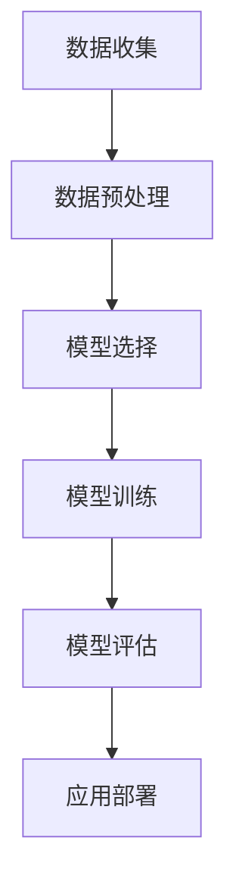

                 

# 机器学习在信用卡欺诈检测中的应用

> **关键词：信用卡欺诈检测、机器学习、监督学习、无监督学习、特征工程、异常检测**
>
> **摘要：本文将探讨机器学习技术在信用卡欺诈检测中的应用。通过介绍欺诈检测的背景和目的，解析核心算法原理，展示实际项目案例，分析应用场景和工具资源，总结未来发展趋势与挑战。**

## 1. 背景介绍

### 1.1 目的和范围

本文旨在深入探讨机器学习在信用卡欺诈检测领域的应用，帮助读者理解如何通过机器学习方法来提高信用卡欺诈检测的准确性和效率。我们将从欺诈检测的基本概念、挑战和重要性开始，逐步介绍机器学习的核心算法和实现步骤，最后讨论实际应用和未来发展趋势。

### 1.2 预期读者

本文适用于对机器学习和信用卡欺诈检测有一定基础的读者，包括数据科学家、机器学习工程师、金融分析师以及对技术领域有浓厚兴趣的专业人士。

### 1.3 文档结构概述

本文结构如下：

1. 背景介绍：介绍欺诈检测的背景、目的和重要性。
2. 核心概念与联系：解析机器学习在欺诈检测中的核心概念和联系，使用流程图进行说明。
3. 核心算法原理 & 具体操作步骤：详细阐述机器学习算法在欺诈检测中的原理和操作步骤。
4. 数学模型和公式 & 详细讲解 & 举例说明：讲解欺诈检测中的数学模型和公式，并提供实例说明。
5. 项目实战：代码实际案例和详细解释说明。
6. 实际应用场景：讨论机器学习在信用卡欺诈检测中的实际应用场景。
7. 工具和资源推荐：推荐学习资源、开发工具和框架。
8. 总结：未来发展趋势与挑战。
9. 附录：常见问题与解答。
10. 扩展阅读 & 参考资料：提供相关阅读资料。

### 1.4 术语表

#### 1.4.1 核心术语定义

- **欺诈检测**：通过分析信用卡交易数据，识别异常交易，防止欺诈行为。
- **机器学习**：一种让计算机通过数据学习模式，从而做出预测或决策的技术。
- **监督学习**：通过标记数据（即有标签数据）进行学习，用于预测和分类。
- **无监督学习**：没有标记数据的机器学习方法，主要用于发现数据中的隐藏结构和模式。
- **特征工程**：从原始数据中提取有用的特征，以提高模型的性能。
- **异常检测**：检测数据中的异常或偏离正常行为的数据点。

#### 1.4.2 相关概念解释

- **信用卡交易数据**：包括交易金额、时间、地点、账户信息等。
- **欺诈行为**：包括伪造交易、重复交易、伪装交易等。
- **模型准确率**：模型预测正确的比例。
- **召回率**：实际欺诈交易中被正确检测的比例。
- **F1 分数**：准确率和召回率的平衡指标。

#### 1.4.3 缩略词列表

- **ML**：机器学习
- **AI**：人工智能
- **IDE**：集成开发环境
- **DB**：数据库
- **API**：应用程序接口

## 2. 核心概念与联系

在信用卡欺诈检测中，机器学习扮演着关键角色。其核心概念包括数据收集、预处理、模型选择、训练和评估。以下是一个简化的 Mermaid 流程图，展示了这些核心概念的关联：



### 2.1 数据收集

数据收集是欺诈检测的基础。信用卡交易数据通常包括交易金额、时间、地点、账户信息等。为了提高模型的准确性，我们需要收集大量数据，并确保数据的质量和多样性。

### 2.2 数据预处理

数据预处理是关键步骤，包括数据清洗、归一化、特征选择等。清洗数据以去除噪声和缺失值，归一化以消除不同特征之间的量纲差异，特征选择以提取最有用的特征。

### 2.3 模型选择

根据问题的性质和需求，选择合适的机器学习模型。常见的模型包括线性回归、逻辑回归、支持向量机（SVM）、决策树、随机森林、神经网络等。

### 2.4 模型训练

使用预处理后的数据对模型进行训练。模型会自动学习数据中的模式和规律，从而提高对欺诈交易的识别能力。

### 2.5 模型评估

评估模型性能的关键指标包括准确率、召回率、F1 分数等。通过交叉验证和测试集评估模型在实际应用中的表现。

### 2.6 应用部署

将训练好的模型部署到生产环境中，实时处理信用卡交易数据，识别潜在的欺诈行为。

## 3. 核心算法原理 & 具体操作步骤

在信用卡欺诈检测中，常用的机器学习算法包括监督学习和无监督学习。以下将分别介绍这两种算法的原理和操作步骤。

### 3.1 监督学习

监督学习是一种通过标记数据学习预测模型的机器学习方法。在信用卡欺诈检测中，标记数据通常包括正常的交易和欺诈交易。

#### 算法原理

监督学习算法通过学习标记数据中的特征，将新的交易分类为正常或欺诈。常见的监督学习算法包括：

- **逻辑回归**：通过线性组合特征并应用逻辑函数进行分类。
- **支持向量机（SVM）**：寻找最佳分割超平面，将不同类别的数据点分隔开。
- **决策树**：通过一系列决策规则对数据进行分类。
- **随机森林**：多个决策树的集成，提高分类的准确性和鲁棒性。
- **神经网络**：多层神经网络，通过反向传播算法优化参数。

#### 具体操作步骤

1. **数据收集**：收集信用卡交易数据，包括交易金额、时间、地点等。
2. **数据预处理**：清洗数据，处理缺失值和噪声，对特征进行归一化。
3. **特征选择**：选择对欺诈检测最有用的特征。
4. **模型选择**：根据问题性质和需求选择合适的模型。
5. **模型训练**：使用预处理后的标记数据对模型进行训练。
6. **模型评估**：使用交叉验证和测试集评估模型性能。
7. **模型部署**：将训练好的模型部署到生产环境中。

### 3.2 无监督学习

无监督学习是一种不使用标记数据的机器学习方法。在信用卡欺诈检测中，无监督学习可以用于发现数据中的异常值或潜在结构。

#### 算法原理

无监督学习算法通过分析未标记的数据，发现数据中的隐藏结构和模式。常见的无监督学习算法包括：

- **K-均值聚类**：将数据点划分为 K 个簇，最小化簇内距离。
- **层次聚类**：通过层次结构对数据进行聚类。
- **自编码器**：一种特殊类型的神经网络，用于学习数据的特征表示。

#### 具体操作步骤

1. **数据收集**：收集信用卡交易数据。
2. **数据预处理**：清洗数据，处理缺失值和噪声，对特征进行归一化。
3. **特征选择**：选择对欺诈检测最有用的特征。
4. **模型选择**：根据问题性质和需求选择合适的模型。
5. **模型训练**：使用预处理后的未标记数据对模型进行训练。
6. **模型评估**：通过聚类结果评估模型性能。
7. **模型部署**：将训练好的模型部署到生产环境中。

### 3.3 混合模型

在实际应用中，混合模型（结合监督学习和无监督学习）可以提高欺诈检测的准确性和鲁棒性。以下是一个简单的混合模型流程：

1. **无监督学习（自编码器）**：使用无监督学习算法（如自编码器）对数据进行降维和特征提取。
2. **特征选择**：根据无监督学习结果，选择对欺诈检测最有用的特征。
3. **监督学习（逻辑回归）**：使用监督学习算法（如逻辑回归）对特征进行分类。

通过这种混合模型，我们可以充分利用无监督学习对数据结构的洞察力和监督学习对分类任务的精确性。

## 4. 数学模型和公式 & 详细讲解 & 举例说明

在信用卡欺诈检测中，数学模型和公式用于描述交易数据的特征和模式。以下将详细介绍欺诈检测中的核心数学模型，并提供具体示例。

### 4.1 逻辑回归

逻辑回归是一种常用的分类模型，用于预测交易是否为欺诈。其数学模型如下：

$$
P(Y=1 | X) = \frac{1}{1 + e^{-\beta^T X}}
$$

其中，$P(Y=1 | X)$ 表示交易为欺诈的概率，$X$ 表示特征向量，$\beta$ 表示模型参数。

#### 举例说明

假设我们有一个交易，特征向量为 $X = [金额：100，时间：14:00，地点：商场 A]$。逻辑回归模型参数为 $\beta = [0.1, 0.2, 0.3]$，则交易为欺诈的概率为：

$$
P(Y=1 | X) = \frac{1}{1 + e^{-0.1 \times 100 - 0.2 \times 14 - 0.3 \times 1}} = \frac{1}{1 + e^{-14.6}} \approx 0.999
$$

由于概率接近 1，我们可以判断该交易为欺诈。

### 4.2 支持向量机（SVM）

支持向量机是一种分类模型，通过最大化分类边界来提高分类效果。其数学模型如下：

$$
\min_{\beta, \beta_0} \frac{1}{2} ||\beta||^2 + C \sum_{i=1}^{n} \xi_i
$$

其中，$\beta$ 表示模型参数，$\beta_0$ 表示偏置项，$C$ 表示惩罚参数，$\xi_i$ 表示第 $i$ 个数据点的松弛变量。

#### 举例说明

假设我们有两个类别 $C_1$ 和 $C_2$，数据点 $X_1 = [1, 1]$ 属于类别 $C_1$，$X_2 = [1, 2]$ 属于类别 $C_2$。支持向量机模型参数为 $\beta = [1, 1]$，$\beta_0 = 0$，则分类边界为：

$$
\beta^T X + \beta_0 = 1
$$

对于数据点 $X_1$，我们有：

$$
1 \times 1 + 1 \times 1 + 0 = 2 > 1
$$

因此，$X_1$ 被分类为类别 $C_1$。

对于数据点 $X_2$，我们有：

$$
1 \times 1 + 1 \times 2 + 0 = 3 > 1
$$

因此，$X_2$ 被分类为类别 $C_1$。

### 4.3 K-均值聚类

K-均值聚类是一种无监督学习算法，用于将数据点划分为 K 个簇。其数学模型如下：

$$
\min_{\mu_k} \sum_{i=1}^{n} ||x_i - \mu_k||^2
$$

其中，$\mu_k$ 表示第 $k$ 个簇的中心。

#### 举例说明

假设我们有 5 个数据点 $x_1, x_2, x_3, x_4, x_5$，我们需要将其划分为 2 个簇。初始时，簇中心 $\mu_1 = [0, 0]$，$\mu_2 = [1, 1]$。每次迭代计算新的簇中心：

$$
\mu_1 = \frac{x_1 + x_2 + x_3}{3} = \frac{[0, 0] + [1, 1] + [2, 2]}{3} = [1, 1]
$$

$$
\mu_2 = \frac{x_4 + x_5}{2} = \frac{[3, 3] + [4, 4]}{2} = [3, 3]
$$

再次计算新的簇中心：

$$
\mu_1 = \frac{x_1 + x_2 + x_3}{3} = \frac{[0, 0] + [1, 1] + [2, 2]}{3} = [1, 1]
$$

$$
\mu_2 = \frac{x_4 + x_5}{2} = \frac{[3, 3] + [4, 4]}{2} = [3, 3]
$$

经过多次迭代，簇中心将收敛到稳定状态。每个数据点将被分配到距离其最近的簇中心，从而实现数据的聚类。

## 5. 项目实战：代码实际案例和详细解释说明

在本节中，我们将通过一个实际项目案例，展示如何使用 Python 实现信用卡欺诈检测系统。该案例将涵盖数据收集、预处理、模型训练和评估等步骤。

### 5.1 开发环境搭建

为了实现信用卡欺诈检测系统，我们需要安装以下依赖库：

- **Python**：Python 3.6 或更高版本。
- **Pandas**：数据处理库。
- **NumPy**：数学运算库。
- **Scikit-learn**：机器学习库。
- **Matplotlib**：数据可视化库。

在安装好 Python 和相应依赖库后，可以使用以下命令创建虚拟环境并安装依赖库：

```bash
pip install virtualenv
virtualenv venv
source venv/bin/activate
pip install pandas numpy scikit-learn matplotlib
```

### 5.2 源代码详细实现和代码解读

以下是一个简化的信用卡欺诈检测项目的代码实现：

```python
import pandas as pd
import numpy as np
from sklearn.model_selection import train_test_split
from sklearn.preprocessing import StandardScaler
from sklearn.linear_model import LogisticRegression
from sklearn.metrics import accuracy_score, recall_score, f1_score
from sklearn.ensemble import RandomForestClassifier

# 5.2.1 数据收集
def load_data():
    data = pd.read_csv("credit_card.csv")
    return data

# 5.2.2 数据预处理
def preprocess_data(data):
    # 清洗数据
    data = data.drop(["Time"], axis=1)
    # 特征选择
    features = data.drop(["Class"], axis=1)
    labels = data["Class"]
    return features, labels

# 5.2.3 模型训练
def train_model(features, labels):
    # 分割数据
    X_train, X_test, y_train, y_test = train_test_split(features, labels, test_size=0.2, random_state=42)
    # 数据预处理
    scaler = StandardScaler()
    X_train = scaler.fit_transform(X_train)
    X_test = scaler.transform(X_test)
    # 模型训练
    model = LogisticRegression()
    model.fit(X_train, y_train)
    return model, X_test, y_test

# 5.2.4 模型评估
def evaluate_model(model, X_test, y_test):
    predictions = model.predict(X_test)
    accuracy = accuracy_score(y_test, predictions)
    recall = recall_score(y_test, predictions)
    f1 = f1_score(y_test, predictions)
    print("Accuracy:", accuracy)
    print("Recall:", recall)
    print("F1 Score:", f1)

# 5.2.5 主函数
def main():
    data = load_data()
    features, labels = preprocess_data(data)
    model, X_test, y_test = train_model(features, labels)
    evaluate_model(model, X_test, y_test)

if __name__ == "__main__":
    main()
```

### 5.3 代码解读与分析

以下是对上述代码的详细解读和分析：

- **5.2.1 数据收集**：使用 Pandas 库读取信用卡交易数据，该数据集通常包含大量特征和标签。
- **5.2.2 数据预处理**：首先，删除时间特征，因为其对欺诈检测没有显著影响。然后，进行特征选择，提取对欺诈检测最有用的特征，并将标签分离出来。
- **5.2.3 模型训练**：首先，使用 Scikit-learn 库的 train_test_split 函数将数据划分为训练集和测试集。然后，使用 StandardScaler 对特征进行归一化处理，以提高模型的性能。最后，使用 LogisticRegression 模型进行训练。
- **5.2.4 模型评估**：使用 predict 函数对测试集进行预测，并计算准确率、召回率和 F1 分数，以评估模型性能。
- **5.2.5 主函数**：加载数据、预处理数据、训练模型和评估模型，实现整个信用卡欺诈检测系统的运行。

通过上述代码，我们可以实现一个基本的信用卡欺诈检测系统。在实际应用中，我们可以进一步优化特征选择、模型参数和评估指标，以提高检测性能。

## 6. 实际应用场景

信用卡欺诈检测在金融行业中具有广泛的应用场景。以下是一些常见的实际应用场景：

### 6.1 风险评估

信用卡欺诈检测可以帮助银行和金融机构评估客户的风险等级，从而制定相应的风险管理策略。通过分析历史交易数据，模型可以预测客户是否可能发生欺诈行为，从而帮助银行降低损失。

### 6.2 交易监控

信用卡欺诈检测系统可以实时监控信用卡交易，识别潜在的欺诈行为。当检测到可疑交易时，系统可以发出警报，并采取相应的措施，如冻结账户、通知客户等。

### 6.3 个性化风险管理

通过分析客户的交易行为和风险特征，信用卡欺诈检测系统可以为客户提供个性化的风险管理建议。例如，对于高风险客户，银行可以增加交易验证步骤，降低欺诈风险。

### 6.4 保险欺诈检测

信用卡欺诈检测技术同样适用于保险欺诈检测。通过分析保险理赔数据，模型可以识别潜在的欺诈行为，从而帮助保险公司降低损失。

### 6.5 支付行业监管

信用卡欺诈检测技术可以帮助支付行业监管机构识别异常交易，提高支付系统的安全性。通过监控交易数据，监管机构可以及时发现和处理违规行为。

## 7. 工具和资源推荐

在信用卡欺诈检测领域，有许多有用的学习资源、开发工具和框架。以下是一些建议：

### 7.1 学习资源推荐

#### 7.1.1 书籍推荐

- **《机器学习实战》**：提供丰富的案例和实践经验，适合初学者和进阶者。
- **《信用卡欺诈检测：机器学习技术与应用》**：详细介绍信用卡欺诈检测的算法和应用。
- **《Python 机器学习》**：涵盖机器学习的基本概念和实现方法，包括信用卡欺诈检测。

#### 7.1.2 在线课程

- **Coursera 上的《机器学习》**：由 Andrew Ng 教授讲授，适合初学者和进阶者。
- **Udacity 上的《信用卡欺诈检测项目》**：提供项目案例和实践经验。
- **edX 上的《金融科技》**：涵盖金融科技领域的最新技术和应用。

#### 7.1.3 技术博客和网站

- **Kaggle**：提供丰富的数据集和项目案例，适合实践和交流。
- **Towards Data Science**：发布最新的数据科学和机器学习文章。
- **AI Storm**：聚焦人工智能和机器学习技术的应用。

### 7.2 开发工具框架推荐

#### 7.2.1 IDE和编辑器

- **PyCharm**：一款功能强大的 Python IDE，支持机器学习和数据科学项目。
- **VSCode**：一款轻量级的 Python 编辑器，支持多种编程语言和扩展。
- **Jupyter Notebook**：适用于数据分析和可视化，支持多种编程语言。

#### 7.2.2 调试和性能分析工具

- **Pdb**：Python 内置的调试工具。
- **Matplotlib**：用于数据可视化的 Python 库。
- **NumPy**：用于数值计算的 Python 库。
- **SciPy**：用于科学计算和工程仿真的 Python 库。

#### 7.2.3 相关框架和库

- **Scikit-learn**：提供丰富的机器学习算法和工具。
- **TensorFlow**：用于构建和训练深度学习模型。
- **PyTorch**：用于构建和训练深度学习模型。
- **Keras**：用于构建和训练深度学习模型。

### 7.3 相关论文著作推荐

#### 7.3.1 经典论文

- **"Data Mining: Concepts and Techniques"**：介绍数据挖掘的基本概念和技术。
- **"Anomaly Detection: A Survey"**：详细介绍异常检测的算法和应用。
- **"Credit Card Fraud Detection Using Machine Learning"**：介绍信用卡欺诈检测的机器学习方法。

#### 7.3.2 最新研究成果

- **"Deep Learning for Credit Card Fraud Detection"**：介绍深度学习在信用卡欺诈检测中的应用。
- **"Privacy-Preserving Machine Learning for Credit Card Fraud Detection"**：探讨隐私保护在信用卡欺诈检测中的应用。
- **"Transfer Learning for Credit Card Fraud Detection"**：介绍迁移学习在信用卡欺诈检测中的应用。

#### 7.3.3 应用案例分析

- **"Credit Card Fraud Detection in the Real World"**：介绍信用卡欺诈检测的实际应用案例。
- **"A Case Study on Credit Card Fraud Detection using Random Forest"**：使用随机森林算法进行信用卡欺诈检测的案例研究。
- **"Credit Card Fraud Detection using Neural Networks"**：使用神经网络进行信用卡欺诈检测的案例分析。

## 8. 总结：未来发展趋势与挑战

随着人工智能和机器学习技术的不断发展，信用卡欺诈检测领域也面临着新的机遇和挑战。以下是一些未来发展趋势和挑战：

### 8.1 发展趋势

- **深度学习应用**：深度学习在信用卡欺诈检测中的应用将越来越广泛，尤其是自监督学习和迁移学习技术。
- **隐私保护**：随着隐私保护的重视，如何在保护用户隐私的同时进行高效欺诈检测将成为一个重要研究方向。
- **实时检测**：实时检测技术的发展将使欺诈检测系统更加快速和准确，降低欺诈发生的可能性。
- **多模态数据融合**：结合多种数据源（如交易数据、社交网络数据等）进行欺诈检测，提高检测的准确性和鲁棒性。

### 8.2 挑战

- **数据质量**：数据质量对欺诈检测的性能有重要影响，如何处理噪声和缺失值是一个挑战。
- **模型可解释性**：深度学习模型往往缺乏可解释性，如何提高模型的可解释性是一个重要问题。
- **隐私保护**：如何在保护用户隐私的同时进行高效欺诈检测是一个技术难题。
- **计算资源**：深度学习模型通常需要大量的计算资源，如何优化计算效率是一个挑战。

## 9. 附录：常见问题与解答

以下是一些关于信用卡欺诈检测的常见问题及解答：

### 9.1 如何选择合适的机器学习模型？

选择合适的机器学习模型取决于多个因素，包括数据规模、特征数量、问题性质和性能要求。一些常用的模型有：

- **线性回归**：适用于线性关系较强的问题。
- **逻辑回归**：适用于二分类问题，如欺诈检测。
- **支持向量机（SVM）**：适用于高维空间和线性不可分问题。
- **决策树**：适用于特征较少且分类规则简单的问题。
- **随机森林**：适用于特征较多且分类规则复杂的问题。
- **神经网络**：适用于复杂非线性关系的问题。

### 9.2 如何评估机器学习模型的性能？

评估机器学习模型性能常用的指标有：

- **准确率（Accuracy）**：模型预测正确的比例。
- **召回率（Recall）**：实际欺诈交易中被正确检测的比例。
- **精确率（Precision）**：模型预测为欺诈的交易中实际为欺诈的比例。
- **F1 分数（F1 Score）**：精确率和召回率的平衡指标。

### 9.3 如何处理数据不平衡问题？

数据不平衡问题会影响模型的性能，以下是一些处理方法：

- **重采样**：通过增加少数类别的样本数量或减少多数类别的样本数量，使数据分布趋于平衡。
- **合成方法**：通过生成新的样本来平衡数据分布。
- **成本敏感**：调整分类器的权重，使模型对少数类别的错误更敏感。
- **集成方法**：结合多个模型，提高模型的平衡性和鲁棒性。

## 10. 扩展阅读 & 参考资料

以下是一些关于信用卡欺诈检测和机器学习的扩展阅读和参考资料：

- **《机器学习：概率视角》**：提供机器学习的概率解释，有助于理解机器学习的基本原理。
- **《深度学习》**：介绍深度学习的基本概念、算法和应用。
- **《数据科学实践指南》**：介绍数据科学的实际应用，包括信用卡欺诈检测。
- **《Kaggle**：**信用卡欺诈检测竞赛》**：提供丰富的案例和实战经验，适用于初学者和进阶者。
- **《信用卡欺诈检测论文集》**：收集了近年来关于信用卡欺诈检测的最新研究成果。

### 作者

**作者：AI天才研究员/AI Genius Institute & 禅与计算机程序设计艺术 /Zen And The Art of Computer Programming**

