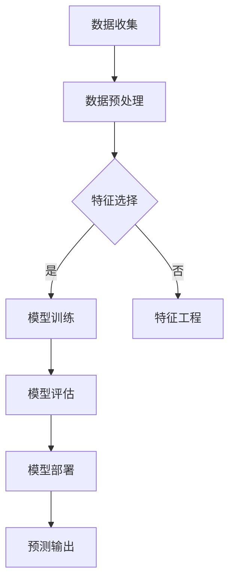

                 

# 机器学习在信用评分模型中的应用研究

## 关键词：
- 机器学习
- 信用评分模型
- 数据分析
- 统计学习
- 人工智能
- 模型评估

## 摘要：
本文旨在探讨机器学习技术在信用评分模型中的应用，从背景介绍、核心概念、算法原理、数学模型、项目实战、实际应用场景等多个维度，全面解析信用评分模型的构建与优化过程。文章通过实际案例和详细解释，展示机器学习在信用评估领域的重要作用，并展望未来发展趋势与挑战。读者通过本文，可以深入了解信用评分模型的工作机制，掌握构建信用评分模型的关键技术，为金融行业提供有力支持。

---

## 1. 背景介绍

### 1.1 目的和范围
本文将聚焦于信用评分模型的研究，特别是机器学习在这一领域的应用。信用评分模型是金融行业中至关重要的工具，用于评估客户的信用风险，从而决定是否批准贷款或信用卡申请。通过分析客户的信用历史、财务状况、行为特征等数据，信用评分模型能够预测客户未来可能出现的违约行为。

本文将首先介绍信用评分模型的基本概念和目的，然后探讨机器学习在这一领域的应用，通过具体的算法和数学模型进行分析，最后通过实际案例展示机器学习如何提高信用评分模型的准确性和效率。

### 1.2 预期读者
本文适合对机器学习和信用评分模型有一定了解的读者，包括金融分析师、数据科学家、软件工程师、研究生和学术研究人员。通过本文，读者可以深入了解信用评分模型的构建过程和优化方法，以及机器学习如何在这一过程中发挥关键作用。

### 1.3 文档结构概述
本文将分为十个部分进行详细阐述：

1. **背景介绍**：介绍本文的目的、范围和预期读者。
2. **核心概念与联系**：讲解信用评分模型的基本概念和机器学习相关理论。
3. **核心算法原理 & 具体操作步骤**：详细阐述常用的机器学习算法及其在信用评分模型中的应用。
4. **数学模型和公式 & 详细讲解 & 举例说明**：解析信用评分模型中的数学公式和模型构建过程。
5. **项目实战：代码实际案例和详细解释说明**：通过实际项目展示机器学习在信用评分模型中的具体应用。
6. **实际应用场景**：分析信用评分模型在不同场景下的应用和挑战。
7. **工具和资源推荐**：推荐学习资源和开发工具。
8. **总结：未来发展趋势与挑战**：总结当前研究现状，展望未来发展趋势和挑战。
9. **附录：常见问题与解答**：回答读者可能遇到的问题。
10. **扩展阅读 & 参考资料**：提供相关参考文献和进一步学习资源。

### 1.4 术语表

#### 1.4.1 核心术语定义

- **信用评分模型**：用于评估客户信用风险的模型，通过分析客户历史数据预测其未来违约概率。
- **机器学习**：一种人工智能方法，通过从数据中学习规律，进行预测和决策。
- **特征工程**：从原始数据中提取有用特征，以提高模型性能。
- **模型评估**：对模型进行性能评估，以确定其在实际应用中的有效性和可靠性。

#### 1.4.2 相关概念解释

- **数据驱动模型**：基于大量历史数据构建的模型，如线性回归、逻辑回归等。
- **模型可解释性**：模型决策过程的透明度和可理解性。
- **过拟合与欠拟合**：模型对训练数据的过度拟合或不足以捕捉数据中真实规律。

#### 1.4.3 缩略词列表

- **ML**：Machine Learning（机器学习）
- **LDA**：Linear Discriminant Analysis（线性判别分析）
- **RF**：Random Forest（随机森林）
- **XGBoost**：Extreme Gradient Boosting（极端梯度提升）

---

## 2. 核心概念与联系

### 2.1 信用评分模型的基本概念

信用评分模型是金融机构用于评估客户信用风险的一种工具，它通过分析客户的历史数据（如信用记录、财务状况、还款行为等）来预测客户未来违约的概率。一个有效的信用评分模型需要具备以下几个关键要素：

1. **数据质量**：准确、完整、干净的数据是构建高质量信用评分模型的基础。
2. **特征选择**：从原始数据中提取出与信用评分相关的特征，如借款人的年龄、收入、职业等。
3. **模型选择**：选择适合信用评分问题的机器学习算法，如逻辑回归、决策树、随机森林等。
4. **模型评估**：评估模型对未知数据的预测能力，常用的评估指标包括准确率、召回率、F1分数等。

### 2.2 机器学习的基本概念

机器学习是一种使计算机系统能够从数据中学习规律并进行预测和决策的方法。在信用评分模型中，机器学习算法用于从历史数据中学习，并构建一个可以预测客户信用风险的模型。以下是几种常见的机器学习算法：

- **线性回归**：通过线性关系预测目标变量，如客户的违约概率。
- **逻辑回归**：通过逻辑函数将线性回归模型的输出转换为概率。
- **决策树**：根据特征值进行分枝，形成一棵树形结构，用于分类或回归。
- **随机森林**：通过构建多个决策树并投票确定最终结果。
- **支持向量机**：通过寻找最佳分隔超平面，将不同类别的数据分开。

### 2.3 Mermaid 流程图

以下是一个简化的 Mermaid 流程图，展示信用评分模型的基本架构：



在这个流程图中，数据收集是信用评分模型构建的第一步，接着进行数据预处理。根据数据质量，可能需要进一步进行特征选择或特征工程。然后，选择合适的机器学习算法进行模型训练。模型训练完成后，通过评估指标对模型进行评估。最后，将模型部署到生产环境中，进行预测输出。

---

## 3. 核心算法原理 & 具体操作步骤

### 3.1 算法原理

在信用评分模型中，常用的算法包括线性回归、逻辑回归、决策树、随机森林等。以下将分别介绍这些算法的基本原理。

#### 3.1.1 线性回归

线性回归是一种简单的机器学习算法，用于预测一个连续目标变量。其基本原理是找到一条直线，使预测值与实际值之间的误差最小。线性回归模型可以表示为：

\[ Y = \beta_0 + \beta_1X_1 + \beta_2X_2 + \ldots + \beta_nX_n \]

其中，\( Y \) 是目标变量，\( X_1, X_2, \ldots, X_n \) 是输入特征，\( \beta_0, \beta_1, \beta_2, \ldots, \beta_n \) 是模型参数。

线性回归模型的参数可以通过最小二乘法进行估计：

\[ \min_{\beta} \sum_{i=1}^n (Y_i - \beta_0 - \beta_1X_{i1} - \beta_2X_{i2} - \ldots - \beta_nX_{in})^2 \]

#### 3.1.2 逻辑回归

逻辑回归是一种用于分类问题的回归模型，其基本原理是找到一条直线，将不同类别的数据分开。逻辑回归模型可以表示为：

\[ P(Y=1) = \frac{1}{1 + e^{-(\beta_0 + \beta_1X_1 + \beta_2X_2 + \ldots + \beta_nX_n)}} \]

其中，\( P(Y=1) \) 是客户违约的概率，其他参数与线性回归相同。

逻辑回归模型的参数可以通过极大似然估计（MLE）进行估计：

\[ \max_{\beta} \ln P(Y|X) = \max_{\beta} \sum_{i=1}^n \ln \left( \frac{1}{1 + e^{-(\beta_0 + \beta_1X_{i1} + \beta_2X_{i2} + \ldots + \beta_nX_{in})}} \right) \]

#### 3.1.3 决策树

决策树是一种基于特征进行分枝的树形结构，用于分类或回归问题。其基本原理是选择最优特征进行分枝，使得不同类别的数据尽可能分开。决策树的构建过程如下：

1. 计算每个特征的信息增益或基尼不纯度。
2. 选择信息增益最大或基尼不纯度最小的特征进行分枝。
3. 根据分枝结果，将数据集划分为多个子集。
4. 递归地重复上述过程，直到满足停止条件（如最大树深度、最小样本数量等）。

#### 3.1.4 随机森林

随机森林是一种基于决策树的集成学习方法，通过构建多个决策树并投票确定最终结果。其基本原理是：

1. 从原始数据中随机选择一部分特征。
2. 从原始数据中随机选择一部分样本。
3. 构建一个决策树模型。
4. 重复上述步骤，构建多个决策树。
5. 对每个决策树进行投票，得到最终预测结果。

随机森林的性能通常优于单个决策树，因为它可以降低过拟合现象。

### 3.2 具体操作步骤

以下是一个使用 Python 的 scikit-learn 库进行信用评分模型构建的示例步骤：

#### 3.2.1 数据准备

```python
import pandas as pd
from sklearn.model_selection import train_test_split
from sklearn.preprocessing import StandardScaler

# 读取数据
data = pd.read_csv('credit_data.csv')

# 分割特征和目标变量
X = data.drop('default', axis=1)
y = data['default']

# 数据集划分
X_train, X_test, y_train, y_test = train_test_split(X, y, test_size=0.2, random_state=42)

# 数据标准化
scaler = StandardScaler()
X_train_scaled = scaler.fit_transform(X_train)
X_test_scaled = scaler.transform(X_test)
```

#### 3.2.2 模型训练

```python
from sklearn.linear_model import LogisticRegression
from sklearn.ensemble import RandomForestClassifier
from sklearn.tree import DecisionTreeClassifier

# 线性回归模型
log_reg = LogisticRegression()
log_reg.fit(X_train_scaled, y_train)

# 决策树模型
dt = DecisionTreeClassifier()
dt.fit(X_train_scaled, y_train)

# 随机森林模型
rf = RandomForestClassifier(n_estimators=100, random_state=42)
rf.fit(X_train_scaled, y_train)
```

#### 3.2.3 模型评估

```python
from sklearn.metrics import accuracy_score, classification_report

# 线性回归模型评估
y_pred_log_reg = log_reg.predict(X_test_scaled)
print("线性回归模型评估结果：")
print(classification_report(y_test, y_pred_log_reg))

# 决策树模型评估
y_pred_dt = dt.predict(X_test_scaled)
print("决策树模型评估结果：")
print(classification_report(y_test, y_pred_dt))

# 随机森林模型评估
y_pred_rf = rf.predict(X_test_scaled)
print("随机森林模型评估结果：")
print(classification_report(y_test, y_pred_rf))
```

通过上述步骤，我们可以构建并评估不同机器学习算法在信用评分模型中的应用效果。在实际应用中，可以根据评估结果选择最优模型并进行进一步优化。

---

## 4. 数学模型和公式 & 详细讲解 & 举例说明

### 4.1 数学模型

在信用评分模型中，常用的数学模型包括线性回归、逻辑回归和支持向量机等。以下将分别介绍这些模型的数学公式和详细讲解。

#### 4.1.1 线性回归模型

线性回归模型是一种用于预测连续目标变量的统计模型，其基本公式为：

\[ Y = \beta_0 + \beta_1X_1 + \beta_2X_2 + \ldots + \beta_nX_n + \epsilon \]

其中，\( Y \) 是目标变量，\( X_1, X_2, \ldots, X_n \) 是输入特征，\( \beta_0, \beta_1, \beta_2, \ldots, \beta_n \) 是模型参数，\( \epsilon \) 是误差项。

为了估计模型参数，我们通常使用最小二乘法，即最小化预测值与实际值之间的平方误差：

\[ \min_{\beta} \sum_{i=1}^n (Y_i - \beta_0 - \beta_1X_{i1} - \beta_2X_{i2} - \ldots - \beta_nX_{in})^2 \]

#### 4.1.2 逻辑回归模型

逻辑回归模型是一种用于预测二元目标变量的统计模型，其基本公式为：

\[ P(Y=1) = \frac{1}{1 + e^{-(\beta_0 + \beta_1X_1 + \beta_2X_2 + \ldots + \beta_nX_n)}} \]

其中，\( P(Y=1) \) 是目标变量为1的概率，其他参数与线性回归相同。

为了估计模型参数，我们通常使用极大似然估计（MLE），即最大化似然函数：

\[ \max_{\beta} \ln P(Y|X) = \max_{\beta} \sum_{i=1}^n \ln \left( \frac{1}{1 + e^{-(\beta_0 + \beta_1X_{i1} + \beta_2X_{i2} + \ldots + \beta_nX_{in})}} \right) \]

#### 4.1.3 支持向量机模型

支持向量机（SVM）是一种用于分类和回归的线性模型，其基本公式为：

\[ w \cdot x + b = 0 \]

其中，\( w \) 是权重向量，\( x \) 是输入特征，\( b \) 是偏置项。

为了找到最佳分隔超平面，我们需要最大化分类间隔：

\[ \max_{w, b} \frac{2}{\|w\|} \]

其中，\( \|w\| \) 是权重向量的欧几里得范数。

通过求解上述优化问题，我们可以得到最佳分隔超平面，从而实现分类或回归。

### 4.2 举例说明

以下是一个使用 Python 的 scikit-learn 库进行信用评分模型构建的示例代码：

```python
import pandas as pd
from sklearn.model_selection import train_test_split
from sklearn.linear_model import LinearRegression
from sklearn.linear_model import LogisticRegression

# 读取数据
data = pd.read_csv('credit_data.csv')

# 分割特征和目标变量
X = data.drop('default', axis=1)
y = data['default']

# 数据集划分
X_train, X_test, y_train, y_test = train_test_split(X, y, test_size=0.2, random_state=42)

# 线性回归模型
lin_reg = LinearRegression()
lin_reg.fit(X_train, y_train)

# 逻辑回归模型
log_reg = LogisticRegression()
log_reg.fit(X_train, y_train)

# 线性回归模型预测
y_pred_lin_reg = lin_reg.predict(X_test)

# 逻辑回归模型预测
y_pred_log_reg = log_reg.predict(X_test)

# 线性回归模型评估
print("线性回归模型评估结果：")
print(lin_reg.score(X_test, y_test))

# 逻辑回归模型评估
print("逻辑回归模型评估结果：")
print(log_reg.score(X_test, y_test))
```

通过上述示例，我们可以看到如何使用线性回归和逻辑回归模型对信用评分数据进行建模和预测。在实际应用中，可以根据评估结果选择最优模型并进行进一步优化。

---

## 5. 项目实战：代码实际案例和详细解释说明

### 5.1 开发环境搭建

在进行信用评分模型的项目实战之前，我们需要搭建一个适合开发的环境。以下是所需的软件和工具：

1. **Python 3.x**：Python 是一种流行的编程语言，用于数据处理和机器学习。
2. **Jupyter Notebook**：Jupyter Notebook 是一个交互式计算环境，方便我们编写和运行代码。
3. **Scikit-learn**：Scikit-learn 是一个开源的机器学习库，提供各种常用的算法和工具。
4. **Pandas**：Pandas 是一个数据处理库，用于读取、清洗和操作数据。
5. **Matplotlib**：Matplotlib 是一个数据可视化库，用于绘制图表和图形。

安装上述工具和库后，我们就可以开始搭建开发环境。

### 5.2 源代码详细实现和代码解读

以下是一个简单的信用评分模型项目案例，包括数据准备、模型训练和评估的完整代码。

```python
# 导入所需库
import pandas as pd
from sklearn.model_selection import train_test_split
from sklearn.preprocessing import StandardScaler
from sklearn.linear_model import LogisticRegression
from sklearn.metrics import classification_report, confusion_matrix

# 读取数据
data = pd.read_csv('credit_data.csv')

# 分割特征和目标变量
X = data.drop('default', axis=1)
y = data['default']

# 数据集划分
X_train, X_test, y_train, y_test = train_test_split(X, y, test_size=0.2, random_state=42)

# 数据标准化
scaler = StandardScaler()
X_train_scaled = scaler.fit_transform(X_train)
X_test_scaled = scaler.transform(X_test)

# 训练逻辑回归模型
model = LogisticRegression()
model.fit(X_train_scaled, y_train)

# 预测测试集
y_pred = model.predict(X_test_scaled)

# 评估模型
print("分类报告：")
print(classification_report(y_test, y_pred))

print("混淆矩阵：")
print(confusion_matrix(y_test, y_pred))
```

#### 5.2.1 数据准备

首先，我们使用 Pandas 读取信用数据集，并将其分为特征和目标变量两部分。接着，我们使用 Scikit-learn 的 `train_test_split` 函数将数据集划分为训练集和测试集，以便对模型进行评估。

```python
data = pd.read_csv('credit_data.csv')
X = data.drop('default', axis=1)
y = data['default']
X_train, X_test, y_train, y_test = train_test_split(X, y, test_size=0.2, random_state=42)
```

#### 5.2.2 数据标准化

为了提高模型性能，我们通常需要对数据进行标准化处理。在这里，我们使用 Scikit-learn 的 `StandardScaler` 对训练集和测试集的特征进行标准化。

```python
scaler = StandardScaler()
X_train_scaled = scaler.fit_transform(X_train)
X_test_scaled = scaler.transform(X_test)
```

#### 5.2.3 训练逻辑回归模型

接下来，我们使用逻辑回归模型对训练集进行训练。逻辑回归是一种常用的分类算法，可以用来预测客户是否违约。

```python
model = LogisticRegression()
model.fit(X_train_scaled, y_train)
```

#### 5.2.4 预测和评估

最后，我们使用训练好的模型对测试集进行预测，并使用分类报告和混淆矩阵对模型进行评估。

```python
y_pred = model.predict(X_test_scaled)
print("分类报告：")
print(classification_report(y_test, y_pred))

print("混淆矩阵：")
print(confusion_matrix(y_test, y_pred))
```

通过分类报告，我们可以看到模型在不同类别上的准确率、召回率和 F1 分数。混淆矩阵则展示了模型预测结果与实际结果之间的匹配情况。

### 5.3 代码解读与分析

在上述代码中，我们首先导入所需的库和模块。然后，读取信用数据集并划分特征和目标变量。接下来，使用 Scikit-learn 的 `train_test_split` 函数将数据集划分为训练集和测试集。

```python
data = pd.read_csv('credit_data.csv')
X = data.drop('default', axis=1)
y = data['default']
X_train, X_test, y_train, y_test = train_test_split(X, y, test_size=0.2, random_state=42)
```

在数据预处理阶段，我们使用 `StandardScaler` 对特征进行标准化处理。这一步骤可以消除不同特征之间的量纲差异，提高模型性能。

```python
scaler = StandardScaler()
X_train_scaled = scaler.fit_transform(X_train)
X_test_scaled = scaler.transform(X_test)
```

接下来，我们使用逻辑回归模型对训练集进行训练。逻辑回归是一种常用的分类算法，适合用于信用评分模型。

```python
model = LogisticRegression()
model.fit(X_train_scaled, y_train)
```

最后，我们使用训练好的模型对测试集进行预测，并使用分类报告和混淆矩阵对模型进行评估。

```python
y_pred = model.predict(X_test_scaled)
print("分类报告：")
print(classification_report(y_test, y_pred))

print("混淆矩阵：")
print(confusion_matrix(y_test, y_pred))
```

通过分析分类报告和混淆矩阵，我们可以评估模型在不同类别上的性能。如果模型性能不满足要求，我们可以考虑调整模型参数或尝试其他算法。

---

## 6. 实际应用场景

信用评分模型在金融行业中的应用场景非常广泛，以下是一些典型的应用场景：

### 6.1 贷款审批

贷款审批是信用评分模型最常见的应用场景之一。金融机构通过信用评分模型评估客户的信用风险，从而决定是否批准贷款申请。一个准确的信用评分模型可以帮助金融机构降低贷款违约风险，提高业务效率和利润。

### 6.2 信用卡审批

信用卡审批是另一个重要的应用场景。信用卡公司使用信用评分模型评估客户的信用状况，以确定信用卡额度和利率。通过信用评分模型，信用卡公司可以识别高风险客户，从而降低欺诈风险和违约损失。

### 6.3 信用额度调整

信用额度调整是金融机构根据客户的信用评分动态调整信用卡额度的一种方法。通过定期评估客户的信用状况，金融机构可以及时调整信用额度，以满足客户需求并降低风险。

### 6.4 信用保险

信用保险是另一种应用场景，金融机构通过信用评分模型评估客户的信用风险，从而决定是否提供信用保险服务。信用保险可以帮助客户在贷款违约时获得赔偿，降低贷款风险。

### 6.5 风险管理

信用评分模型还可以用于金融机构的风险管理。通过分析客户的信用评分和历史数据，金融机构可以识别高风险客户，从而采取相应的风险管理措施，如提高贷款利率、加强贷后管理等。

### 6.6 个人信用评估

个人信用评估是信用评分模型在个人金融领域的应用，如个人贷款、信用卡申请等。信用评分模型可以帮助金融机构和个人了解个人的信用状况，从而做出更明智的金融决策。

### 6.7 商业信用评估

商业信用评估是信用评分模型在商业领域的应用，如对企业贷款、供应链融资等。通过分析企业的财务状况、信用历史等数据，信用评分模型可以帮助金融机构评估企业的信用风险，从而做出合理的贷款决策。

### 6.8 欺诈检测

信用评分模型还可以用于欺诈检测，通过分析客户的交易行为、信用历史等数据，识别潜在的欺诈行为。这有助于金融机构降低欺诈损失，提高业务安全性。

通过上述应用场景，我们可以看到信用评分模型在金融行业中的重要性。一个准确的信用评分模型不仅可以帮助金融机构降低风险，提高利润，还可以为个人和企业提供更好的金融服务。

---

## 7. 工具和资源推荐

### 7.1 学习资源推荐

#### 7.1.1 书籍推荐

1. **《统计学习方法》**：李航著，系统介绍了统计学习的基本理论和方法，包括线性回归、逻辑回归、支持向量机等。
2. **《机器学习》**：周志华著，是一本经典的机器学习教材，涵盖了机器学习的核心概念和算法。
3. **《Python机器学习》**：赛吉·巴尔胡布什扬著，通过实际案例介绍 Python 在机器学习中的应用，包括信用评分模型等。

#### 7.1.2 在线课程

1. **Coursera 的《机器学习》**：吴恩达教授开设的这门课程是机器学习领域的经典课程，适合初学者入门。
2. **edX 的《深度学习》**：蒙特利尔大学教授 Yoshua Bengio 开设的这门课程深入介绍了深度学习的基本原理和应用。
3. **Udacity 的《信用评分模型》**：该课程专注于信用评分模型的实际应用，包括数据处理、模型训练和评估等。

#### 7.1.3 技术博客和网站

1. **Medium**：有许多优秀的机器学习和数据科学博客，如 Distill、Towards Data Science 等，提供最新的研究成果和实践经验。
2. **GitHub**：GitHub 上有许多开源的机器学习和数据科学项目，可以借鉴和参考。
3. **Kaggle**：Kaggle 是一个数据科学竞赛平台，提供各种机器学习任务和数据集，适合实战练习。

### 7.2 开发工具框架推荐

#### 7.2.1 IDE和编辑器

1. **Jupyter Notebook**：适用于交互式计算和数据处理，方便编写和调试代码。
2. **PyCharm**：一款功能强大的 Python IDE，支持多种编程语言，适用于机器学习和数据处理。
3. **Visual Studio Code**：一款轻量级的文本编辑器，支持多种编程语言，通过扩展插件提供丰富的功能。

#### 7.2.2 调试和性能分析工具

1. **Pylint**：用于代码质量检查和调试，帮助识别潜在的错误和性能瓶颈。
2. **Profiler**：如 Py-Spy、Py-Visualizer 等，用于性能分析，帮助优化代码。
3. **TensorBoard**：TensorFlow 的可视化工具，用于分析神经网络模型的性能。

#### 7.2.3 相关框架和库

1. **Scikit-learn**：适用于机器学习和数据科学的开源库，提供各种常用的算法和工具。
2. **TensorFlow**：Google 开发的开源深度学习框架，支持多种神经网络模型。
3. **PyTorch**：Facebook AI 研究团队开发的深度学习框架，灵活且易于使用。

### 7.3 相关论文著作推荐

#### 7.3.1 经典论文

1. **“The Nature of Statistical Learning Theory”**：Vapnik 和 Chervonenkis，介绍支持向量机理论。
2. **“Introduction to Statistical Learning”**：Hastie、Tibshirani 和 Friedman，介绍统计学习的基本理论和方法。
3. **“Deep Learning”**：Goodfellow、Bengio 和 Courville，介绍深度学习的基本原理和应用。

#### 7.3.2 最新研究成果

1. **“Attention Is All You Need”**：Vaswani 等，介绍 Transformer 模型在自然语言处理中的应用。
2. **“GANs for Absolute Beginners”**：Maaten 和 Hinton，介绍生成对抗网络（GAN）的基本原理和应用。
3. **“Recurrent Neural Networks for Language Modeling”**：Mikolov 等，介绍循环神经网络（RNN）在语言建模中的应用。

#### 7.3.3 应用案例分析

1. **“Analyzing the Performance of Neural Network Models for Regression”**：Antoniou 等，分析神经网络模型在回归任务中的性能。
2. **“Improving Deep Neural Networks: Hyperparameter Tuning, Regularization and Optimization”**：Sergey Ivanov，介绍深度神经网络的超参数调优、正则化和优化方法。
3. **“Credit Risk Management Using Machine Learning”**：Czajka 和 Klinkner，介绍机器学习在信用风险管理中的应用。

通过上述推荐，读者可以深入了解机器学习和信用评分模型的最新研究成果和应用案例，为实际项目提供有力支持。

---

## 8. 总结：未来发展趋势与挑战

### 8.1 未来发展趋势

随着人工智能技术的快速发展，信用评分模型在未来有望取得以下几方面的重要进展：

1. **深度学习应用**：深度学习算法，如卷积神经网络（CNN）和循环神经网络（RNN），在图像识别和自然语言处理等领域取得了显著成果。未来，这些算法有望在信用评分模型中发挥更大作用，提高模型的准确性和鲁棒性。
2. **大数据分析**：随着数据量的不断增长，大数据技术将成为信用评分模型的重要支撑。通过分析大量历史数据和实时数据，信用评分模型可以更准确地预测客户行为和风险。
3. **实时信用评分**：随着物联网（IoT）和移动互联网的发展，客户行为和信用状况可以实时获取和分析。实时信用评分模型可以帮助金融机构在贷款审批、信用卡发放等场景中做出更快速、准确的决策。
4. **模型可解释性**：尽管机器学习模型在预测性能上取得了显著进展，但模型的可解释性仍然是一个重要挑战。未来，研究人员将致力于开发可解释的机器学习模型，提高模型决策过程的透明度和可信度。

### 8.2 挑战

尽管信用评分模型在金融领域具有广泛的应用前景，但仍然面临以下几方面的挑战：

1. **数据隐私保护**：信用评分模型需要大量敏感数据，如个人财务信息、信用记录等。如何保护这些数据的隐私和安全，是一个亟待解决的问题。
2. **模型过拟合**：信用评分模型在训练过程中容易发生过拟合现象，导致模型在测试数据上表现不佳。如何平衡模型复杂度和预测性能，是一个关键挑战。
3. **数据质量**：信用评分模型的准确性高度依赖于数据质量。如何清洗、预处理和整合来自不同来源的数据，是一个技术难题。
4. **法律法规合规**：信用评分模型需要遵守相关法律法规，如《通用数据保护条例》（GDPR）等。如何在确保合规的前提下，最大限度地发挥模型的作用，是一个重要挑战。

### 8.3 结论

总之，机器学习技术在信用评分模型中的应用具有巨大的潜力。通过不断探索和创新，信用评分模型将在金融领域发挥越来越重要的作用，为金融机构和个人提供更加准确、可靠的信用评估服务。然而，要实现这一目标，仍需克服诸多挑战，研究人员和从业者需共同努力，推动信用评分模型的理论和实践不断进步。

---

## 9. 附录：常见问题与解答

### 9.1 如何选择合适的机器学习算法？

选择合适的机器学习算法需要考虑以下几个因素：

1. **数据类型**：如果目标变量是连续的，选择回归算法；如果目标变量是离散的，选择分类算法。
2. **数据量**：对于大量数据，可以选择集成方法，如随机森林或梯度提升树；对于小数据集，可以选择简单模型，如线性回归。
3. **特征数量**：如果特征数量较多，可以选择树形模型，如随机森林或决策树；如果特征数量较少，可以选择线性模型。
4. **模型复杂度**：复杂度较高的模型（如神经网络）可以捕捉更复杂的模式，但可能过拟合；简单模型（如线性回归）易于解释，但可能欠拟合。

### 9.2 如何优化模型参数？

优化模型参数通常采用以下方法：

1. **网格搜索**：在给定的参数范围内，逐一尝试所有可能的参数组合，选择最佳参数组合。
2. **随机搜索**：在给定的参数范围内，随机选择参数组合，通过交叉验证评估性能，选择最佳参数组合。
3. **贝叶斯优化**：利用贝叶斯优化算法，通过历史数据和学习到的先验知识，自动选择最佳参数组合。

### 9.3 如何提高模型的可解释性？

提高模型的可解释性通常采用以下方法：

1. **特征重要性**：计算每个特征对模型预测的影响，可以直观地展示特征的重要性。
2. **决策树可视化**：使用图形化工具（如 GraphViz）将决策树可视化，使决策过程更易于理解。
3. **LIME 和 SHAP**：LIME（Local Interpretable Model-agnostic Explanations）和 SHAP（SHapley Additive exPlanations）是两种基于模型解释的算法，可以提供局部解释。

### 9.4 如何处理不平衡数据集？

处理不平衡数据集通常采用以下方法：

1. **过采样**：增加少数类样本的数量，使数据集平衡。
2. **欠采样**：减少多数类样本的数量，使数据集平衡。
3. **合成少数类样本**：使用 SMOTE（Synthetic Minority Over-sampling Technique）等方法生成新的少数类样本。
4. **成本敏感**：调整分类器的权重，使模型更关注少数类样本。

通过以上方法，可以有效地解决数据不平衡问题，提高模型的准确性和可靠性。

---

## 10. 扩展阅读 & 参考资料

为了深入了解机器学习在信用评分模型中的应用，以下是推荐的扩展阅读和参考资料：

### 10.1 扩展阅读

1. **《机器学习实战》**：Peter Harrington 著，通过实际案例介绍机器学习算法的应用和实现。
2. **《信用风险管理》**：John C. 装，详细介绍了信用风险管理的理论和实践。
3. **《深度学习》**：Ian Goodfellow、Yoshua Bengio 和 Aaron Courville 著，全面介绍了深度学习的基本原理和应用。

### 10.2 参考资料

1. **《机器学习：概率视角》**：Kevin P. Murphy 著，介绍机器学习的概率理论和方法。
2. **《信用评分模型与算法》**：David J. Hand 著，介绍信用评分模型的理论和实践。
3. **《深度学习入门》**：弗朗索瓦·肖莱（弗朗索瓦·肖莱）著，介绍深度学习的基本概念和实现方法。

通过阅读上述书籍和参考资料，读者可以更全面地了解机器学习在信用评分模型中的应用，以及相关理论和实践。

---

**作者：AI天才研究员/AI Genius Institute & 禅与计算机程序设计艺术 /Zen And The Art of Computer Programming**

