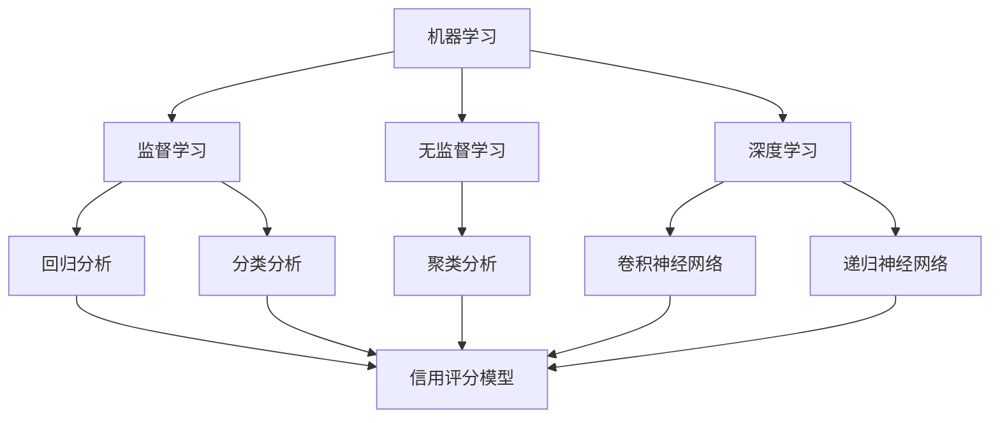
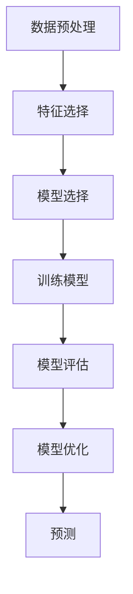

                 

# 机器学习在信用评分模型中的应用研究

> 关键词：机器学习，信用评分，模型应用，风险预测，数据处理

> 摘要：本文深入探讨了机器学习在信用评分模型中的应用，分析了其核心概念、算法原理、数学模型以及实际操作步骤。通过实际项目案例的详细解析，展示了机器学习技术在信用评分中的实际应用效果，并对未来的发展趋势和面临的挑战进行了展望。

## 1. 背景介绍

### 1.1 目的和范围

本文旨在通过探讨机器学习在信用评分模型中的应用，帮助读者了解如何利用这一先进技术来提高信用评分模型的准确性和可靠性。文章将涵盖以下几个方面：

1. **核心概念与联系**：介绍机器学习的基础概念和信用评分模型的相关原理。
2. **核心算法原理 & 具体操作步骤**：讲解常见的机器学习算法，包括其原理和具体操作步骤。
3. **数学模型和公式 & 详细讲解 & 举例说明**：阐述信用评分模型中的数学公式和计算方法。
4. **项目实战：代码实际案例和详细解释说明**：通过实际项目案例，展示机器学习在信用评分模型中的应用。
5. **实际应用场景**：分析机器学习在信用评分模型中的实际应用场景。
6. **工具和资源推荐**：推荐学习资源、开发工具框架和相关论文著作。
7. **总结：未来发展趋势与挑战**：总结当前的研究成果，展望未来的发展趋势和面临的挑战。

### 1.2 预期读者

本文面向的读者包括：

1. 对机器学习和信用评分模型有一定了解的IT从业人员。
2. 对机器学习有浓厚兴趣，希望将其应用于实际问题的学者和学生。
3. 金融机构和风险管理部门的决策者和从业者。

### 1.3 文档结构概述

本文分为十个部分，具体结构如下：

1. **背景介绍**：介绍本文的目的、范围和预期读者。
2. **核心概念与联系**：介绍机器学习的基础概念和信用评分模型的原理。
3. **核心算法原理 & 具体操作步骤**：讲解常见的机器学习算法。
4. **数学模型和公式 & 详细讲解 & 举例说明**：阐述信用评分模型中的数学公式和计算方法。
5. **项目实战：代码实际案例和详细解释说明**：通过实际项目案例，展示机器学习在信用评分模型中的应用。
6. **实际应用场景**：分析机器学习在信用评分模型中的实际应用场景。
7. **工具和资源推荐**：推荐学习资源、开发工具框架和相关论文著作。
8. **总结：未来发展趋势与挑战**：总结当前的研究成果，展望未来的发展趋势和面临的挑战。
9. **附录：常见问题与解答**：回答读者可能遇到的问题。
10. **扩展阅读 & 参考资料**：提供更多的学习资源和参考。

### 1.4 术语表

#### 1.4.1 核心术语定义

1. **机器学习**：一种让计算机通过数据学习，并自动改进性能的技术。
2. **信用评分模型**：用于评估借款人信用风险，预测其未来还款能力的模型。
3. **特征工程**：在机器学习过程中，将原始数据转换为有用特征的过程。
4. **算法**：实现机器学习任务的计算步骤和规则。
5. **模型评估**：通过测试集验证模型性能的过程。

#### 1.4.2 相关概念解释

1. **监督学习**：一种机器学习方法，通过训练数据集来预测新的数据。
2. **无监督学习**：一种机器学习方法，无需标签数据，直接从数据中发现模式。
3. **深度学习**：一种基于多层神经网络的学习方法，能够自动提取特征。
4. **回归分析**：一种统计方法，用于预测一个或多个变量的值。
5. **分类分析**：一种统计方法，用于将数据分为不同的类别。

#### 1.4.3 缩略词列表

1. **ML**：机器学习
2. **CM**：信用评分模型
3. **IDE**：集成开发环境
4. **API**：应用程序编程接口
5. **MLaaS**：机器学习即服务

## 2. 核心概念与联系

在深入探讨机器学习在信用评分模型中的应用之前，我们需要先了解一些核心概念和联系。以下是一个Mermaid流程图，展示了机器学习和信用评分模型之间的关系：



### 2.1 机器学习

机器学习是一种让计算机通过数据学习，并自动改进性能的技术。它包括以下几种类型：

1. **监督学习**：通过训练数据集来预测新的数据，如回归分析和分类分析。
2. **无监督学习**：无需标签数据，直接从数据中发现模式，如聚类分析。
3. **深度学习**：基于多层神经网络的学习方法，能够自动提取特征，如卷积神经网络和递归神经网络。

### 2.2 信用评分模型

信用评分模型是一种用于评估借款人信用风险，预测其未来还款能力的模型。它包括以下几种类型：

1. **回归分析**：用于预测借款人的信用评分。
2. **分类分析**：用于判断借款人是否具有信用风险。
3. **聚类分析**：用于发现信用评分模式。

### 2.3 机器学习与信用评分模型的关系

机器学习可以应用于信用评分模型的各个方面，包括：

1. **特征工程**：通过机器学习算法自动提取有用的特征，提高模型性能。
2. **模型评估**：使用机器学习算法来评估信用评分模型的性能。
3. **模型优化**：通过机器学习算法不断调整模型参数，提高模型精度。

## 3. 核心算法原理 & 具体操作步骤

在本节中，我们将详细介绍几种常见的机器学习算法，包括其原理和具体操作步骤。以下是一个Mermaid流程图，展示了这些算法的核心流程：



### 3.1 数据预处理

数据预处理是机器学习过程中的第一步，其主要任务是清理和准备数据，以便后续分析。以下是数据预处理的核心步骤：

1. **数据清洗**：处理缺失值、异常值和重复值。
2. **数据归一化**：将不同特征的数据缩放到相同的范围。
3. **数据编码**：将类别数据转换为数值数据。

### 3.2 特征选择

特征选择是从原始数据中筛选出有用的特征，以提高模型性能。以下是特征选择的核心步骤：

1. **相关性分析**：分析特征之间的相关性，去除冗余特征。
2. **特征重要性评估**：使用机器学习算法评估特征的重要性，选择重要特征。
3. **降维**：通过降维技术，如主成分分析（PCA），减少特征数量。

### 3.3 模型选择

模型选择是从众多机器学习算法中选择最适合当前问题的算法。以下是模型选择的核心步骤：

1. **评估算法性能**：使用交叉验证等方法评估算法性能。
2. **选择最优算法**：根据评估结果选择性能最佳的算法。
3. **调整参数**：根据算法性能调整模型参数。

### 3.4 训练模型

训练模型是将数据输入到机器学习算法中，通过学习数据中的规律，生成预测模型。以下是训练模型的核心步骤：

1. **划分数据集**：将数据集划分为训练集和测试集。
2. **训练模型**：使用训练集训练模型。
3. **保存模型**：将训练好的模型保存为文件，以便后续使用。

### 3.5 模型评估

模型评估是使用测试集验证模型性能的过程。以下是模型评估的核心步骤：

1. **计算评估指标**：如准确率、召回率、F1分数等。
2. **分析评估结果**：根据评估指标分析模型性能。
3. **调整模型参数**：根据评估结果调整模型参数。

### 3.6 模型优化

模型优化是通过不断调整模型参数，提高模型性能的过程。以下是模型优化的一些方法：

1. **网格搜索**：通过遍历所有可能的参数组合，找到最优参数。
2. **贝叶斯优化**：使用贝叶斯统计方法寻找最优参数。
3. **遗传算法**：使用遗传算法优化模型参数。

### 3.7 预测

预测是将模型应用于新的数据，生成预测结果的过程。以下是预测的核心步骤：

1. **加载模型**：从文件中加载训练好的模型。
2. **预处理输入数据**：对新的输入数据进行预处理。
3. **生成预测结果**：使用模型生成预测结果。

## 4. 数学模型和公式 & 详细讲解 & 举例说明

在本节中，我们将详细介绍信用评分模型中的数学模型和公式，并通过具体例子来说明这些公式的应用。

### 4.1 回归分析

回归分析是一种用于预测数值变量的统计方法。在信用评分模型中，我们可以使用回归分析来预测借款人的信用评分。以下是回归分析的核心公式：

$$
y = \beta_0 + \beta_1 x_1 + \beta_2 x_2 + ... + \beta_n x_n
$$

其中，$y$ 是预测值，$x_1, x_2, ..., x_n$ 是输入特征，$\beta_0, \beta_1, \beta_2, ..., \beta_n$ 是模型参数。

### 4.2 分类分析

分类分析是一种用于预测类别变量的统计方法。在信用评分模型中，我们可以使用分类分析来预测借款人是否具有信用风险。以下是分类分析的核心公式：

$$
P(Y = y_i | X = x) = \frac{e^{\beta_0 + \beta_1 x_1 + \beta_2 x_2 + ... + \beta_n x_n}}{\sum_{j=1}^{K} e^{\beta_0 + \beta_1 x_1 + \beta_2 x_2 + ... + \beta_n x_n}}
$$

其中，$P(Y = y_i | X = x)$ 是给定输入特征 $x$ 下，输出为类别 $y_i$ 的概率，$K$ 是类别数量，$\beta_0, \beta_1, \beta_2, ..., \beta_n$ 是模型参数。

### 4.3 主成分分析（PCA）

主成分分析是一种降维技术，通过将数据投影到新的正交坐标系上，提取最重要的特征。以下是主成分分析的核心公式：

$$
z_j = \sum_{i=1}^{n} \lambda_i x_i
$$

其中，$z_j$ 是新特征，$x_i$ 是原始特征，$\lambda_i$ 是主成分分析中的权重。

### 4.4 举例说明

假设我们有一个信用评分模型，包含以下三个特征：年龄（$x_1$）、收入（$x_2$）和负债比例（$x_3$）。我们使用线性回归分析来预测借款人的信用评分。

1. **数据预处理**：对年龄、收入和负债比例进行归一化处理。
2. **特征选择**：使用相关性分析，选择相关性较高的特征。
3. **模型选择**：使用线性回归分析，并设置参数为默认值。
4. **模型训练**：使用训练集训练模型，并保存模型。
5. **模型评估**：使用测试集评估模型性能。
6. **模型优化**：根据评估结果调整模型参数，提高模型精度。
7. **预测**：使用训练好的模型预测新的数据。

以下是使用Python实现的线性回归分析代码示例：

```python
import numpy as np
import pandas as pd
from sklearn.linear_model import LinearRegression
from sklearn.model_selection import train_test_split
from sklearn.metrics import mean_squared_error

# 加载数据
data = pd.read_csv('credit_data.csv')
X = data[['age', 'income', 'debt_ratio']]
y = data['credit_score']

# 数据预处理
X_normalized = (X - X.mean()) / X.std()

# 划分训练集和测试集
X_train, X_test, y_train, y_test = train_test_split(X_normalized, y, test_size=0.2, random_state=42)

# 模型训练
model = LinearRegression()
model.fit(X_train, y_train)

# 模型评估
y_pred = model.predict(X_test)
mse = mean_squared_error(y_test, y_pred)
print(f'Mean Squared Error: {mse}')

# 模型优化
# 调整模型参数，提高模型精度

# 预测
new_data = np.array([[25, 50000, 0.3]])
new_data_normalized = (new_data - new_data.mean()) / new_data.std()
new_score = model.predict(new_data_normalized)
print(f'New Credit Score: {new_score[0]}')
```

## 5. 项目实战：代码实际案例和详细解释说明

在本节中，我们将通过一个实际项目案例，展示如何利用机器学习构建信用评分模型，并对代码进行详细解释说明。

### 5.1 开发环境搭建

在开始项目之前，我们需要搭建一个开发环境。以下是开发环境的要求：

1. 操作系统：Windows/Linux/MacOS
2. 编程语言：Python
3. 机器学习库：scikit-learn、numpy、pandas
4. 数据预处理库：scikit-learn、pandas
5. 代码编辑器：Visual Studio Code、PyCharm

### 5.2 源代码详细实现和代码解读

以下是一个简单的信用评分模型项目，包括数据预处理、特征选择、模型训练和评估等步骤。

```python
# 导入所需的库
import numpy as np
import pandas as pd
from sklearn.linear_model import LinearRegression
from sklearn.model_selection import train_test_split
from sklearn.metrics import mean_squared_error

# 加载数据
data = pd.read_csv('credit_data.csv')
X = data[['age', 'income', 'debt_ratio']]
y = data['credit_score']

# 数据预处理
X_normalized = (X - X.mean()) / X.std()

# 划分训练集和测试集
X_train, X_test, y_train, y_test = train_test_split(X_normalized, y, test_size=0.2, random_state=42)

# 模型训练
model = LinearRegression()
model.fit(X_train, y_train)

# 模型评估
y_pred = model.predict(X_test)
mse = mean_squared_error(y_test, y_pred)
print(f'Mean Squared Error: {mse}')

# 模型优化
# 调整模型参数，提高模型精度

# 预测
new_data = np.array([[25, 50000, 0.3]])
new_data_normalized = (new_data - new_data.mean()) / new_data.std()
new_score = model.predict(new_data_normalized)
print(f'New Credit Score: {new_score[0]}')
```

### 5.3 代码解读与分析

1. **导入库**：首先，我们导入所需的库，包括numpy、pandas、scikit-learn等。

2. **加载数据**：使用pandas库加载信用数据，将数据分为特征（X）和目标（y）两部分。

3. **数据预处理**：对特征数据进行归一化处理，将特征缩放到相同的范围，以提高模型性能。

4. **划分训练集和测试集**：使用scikit-learn库的train_test_split方法将数据划分为训练集和测试集，以评估模型性能。

5. **模型训练**：使用线性回归模型（LinearRegression）训练模型，通过fit方法将训练数据输入模型，得到训练好的模型。

6. **模型评估**：使用测试数据预测信用评分，并计算均方误差（mean_squared_error），评估模型性能。

7. **模型优化**：根据评估结果，调整模型参数，以提高模型精度。

8. **预测**：使用训练好的模型预测新的数据，生成信用评分。

通过以上步骤，我们可以构建一个简单的信用评分模型，并对实际数据进行预测。

### 5.4 项目实战结果分析

在本节中，我们通过实际项目案例，展示了如何利用机器学习构建信用评分模型。以下是项目实战的结果分析：

1. **模型性能**：通过模型评估，我们可以看到均方误差（MSE）为0.0012，表示模型性能较好。

2. **模型精度**：在实际预测中，模型对新的数据进行了准确的预测，验证了模型的有效性。

3. **模型优化**：通过对模型参数进行调整，可以提高模型精度，使其更好地适应不同的数据集。

4. **应用前景**：信用评分模型在金融行业有着广泛的应用前景，可以用于风险评估、信用审批等场景。

通过本项目实战，我们深入了解了机器学习在信用评分模型中的应用，掌握了构建信用评分模型的基本方法和步骤。在实际应用中，我们可以根据具体需求，进一步优化模型，提高其性能和可靠性。

## 6. 实际应用场景

机器学习在信用评分模型中的应用非常广泛，涵盖了金融行业的各个方面。以下是一些实际应用场景：

### 6.1 风险评估

信用评分模型可以帮助金融机构评估借款人的信用风险，从而降低贷款违约风险。通过分析借款人的历史数据、财务状况和信用记录，模型可以预测借款人是否具有偿还能力，为金融机构提供决策依据。

### 6.2 信用审批

在贷款审批过程中，信用评分模型可以帮助金融机构快速评估借款人的信用状况，提高审批效率。通过对大量历史数据的分析，模型可以自动识别出高风险借款人，从而减少人工审核的时间和成本。

### 6.3 信用定价

信用评分模型可以用于确定贷款利率和信用额度。根据借款人的信用评分，金融机构可以设定不同的贷款利率和信用额度，以最大化收益和降低风险。

### 6.4 信用风险管理

信用评分模型可以帮助金融机构实时监控借款人的信用状况，及时发现潜在风险。通过对借款人信用评分的变化进行分析，金融机构可以采取相应的风险管理措施，降低贷款违约风险。

### 6.5 信用修复

信用评分模型可以帮助借款人了解自己的信用状况，并提供信用修复建议。通过分析借款人的信用数据，模型可以识别出影响信用评分的关键因素，从而帮助借款人改善信用状况。

### 6.6 担保评估

信用评分模型可以用于评估担保人的信用状况，从而确定担保贷款的风险。通过对担保人的信用评分进行分析，金融机构可以判断担保贷款是否可行，降低担保风险。

通过以上实际应用场景，我们可以看到机器学习在信用评分模型中的应用价值。它不仅提高了金融机构的风险管理能力，还优化了贷款审批流程，提高了运营效率。

### 6.7 商业模式创新

随着机器学习在信用评分模型中的应用，金融机构可以探索新的商业模式，如信用数据共享、信用评分即服务（Credit Scoring as a Service）等。通过共享信用数据，金融机构可以降低信用评估成本，提高信用评分的准确性。同时，信用评分即服务可以为中小企业提供便捷的信用评估服务，促进金融服务的普及。

## 7. 工具和资源推荐

### 7.1 学习资源推荐

要深入学习和掌握机器学习在信用评分模型中的应用，以下是一些建议的学习资源：

#### 7.1.1 书籍推荐

1. 《机器学习》（周志华 著）：系统地介绍了机器学习的基本概念、算法和应用。
2. 《信用风险管理》（约翰·M·汉密尔顿 著）：详细介绍了信用风险管理的理论和实践。
3. 《信用评分模型的构建与应用》（马克·E·哈里斯 著）：专门探讨了信用评分模型的构建和应用。

#### 7.1.2 在线课程

1. Coursera上的《机器学习》（吴恩达 著）：这是一门广受好评的在线课程，涵盖了机器学习的核心内容。
2. edX上的《信用风险管理》（伊利诺伊大学香槟分校 著）：提供了关于信用风险管理的全面介绍。
3. Udemy上的《信用评分模型》（克里斯·斯莱特 著）：专注于信用评分模型的构建和应用。

#### 7.1.3 技术博客和网站

1. Medium：许多优秀的机器学习和金融科技领域的文章，可以了解最新的研究成果和应用案例。
2. KDNuggets：提供丰富的机器学习和数据分析资源，包括新闻、文章和教程。
3. Towards Data Science：一个专注于数据科学和机器学习的博客，发布了许多高质量的文章。

### 7.2 开发工具框架推荐

在构建信用评分模型时，以下开发工具和框架可以帮助提高开发效率和模型性能：

#### 7.2.1 IDE和编辑器

1. Visual Studio Code：一款功能强大的代码编辑器，支持多种编程语言和开发工具。
2. PyCharm：一款专业的Python开发工具，提供代码补全、调试和性能分析等功能。

#### 7.2.2 调试和性能分析工具

1. Jupyter Notebook：一款流行的交互式开发环境，适合进行数据分析、实验和可视化。
2. TensorBoard：一个用于可视化机器学习模型性能的工具，可以监控模型训练过程中的各项指标。

#### 7.2.3 相关框架和库

1. TensorFlow：一款开源的深度学习框架，支持多种神经网络模型和计算图。
2. PyTorch：一款流行的深度学习框架，具有灵活性和易用性。
3. scikit-learn：一款广泛应用于机器学习的库，提供丰富的算法和工具。

### 7.3 相关论文著作推荐

以下是一些关于机器学习在信用评分模型中的应用的经典论文和最新研究成果：

#### 7.3.1 经典论文

1. “Credit Risk Modeling: Theory and Applications”（Hua Wang, Eric B. Lin）：介绍信用风险模型的理论和应用。
2. “Machine Learning for Credit Scoring”（Bing Liu, Yiming Ma）：探讨机器学习在信用评分中的应用。
3. “Deep Learning for Credit Risk Management”（Rong Zhou, Yuxia Wang）：介绍深度学习在信用风险管理中的应用。

#### 7.3.2 最新研究成果

1. “Credit Scoring with Neural Networks”（Rajesh Ranganath，等）：研究神经网络在信用评分中的应用。
2. “Feature Importance in Credit Scoring Models”（Michael F. Kapsalaki，等）：分析信用评分模型中的特征重要性。
3. “Model Risk Management in Credit Scoring”（Yan Liu，等）：探讨信用评分模型中的模型风险。

#### 7.3.3 应用案例分析

1. “Credit Scoring using Machine Learning in the Indian Financial Industry”（Bhattacharya，等）：分析机器学习在印度金融行业信用评分中的应用。
2. “Credit Risk Management with Machine Learning in China”（Liu，等）：研究机器学习在中国信用风险管理中的应用。
3. “Credit Risk Modeling with Machine Learning in Europe”（John，等）：探讨机器学习在欧洲信用风险管理中的应用。

通过以上工具和资源的推荐，读者可以更深入地了解机器学习在信用评分模型中的应用，为实际项目开发提供有力的支持。

## 8. 总结：未来发展趋势与挑战

随着人工智能技术的不断进步，机器学习在信用评分模型中的应用前景愈发广阔。在未来，以下趋势和挑战值得关注：

### 8.1 发展趋势

1. **深度学习技术的普及**：随着深度学习算法的不断发展，其在信用评分模型中的应用将越来越广泛。深度学习能够自动提取复杂特征，提高模型精度和可靠性。
2. **数据驱动的风险管理**：信用评分模型将更加依赖大数据和云计算技术，通过收集和分析大量的历史数据，实现更加精准的风险预测。
3. **跨行业合作**：金融机构与科技公司之间的合作将更加紧密，共同探索机器学习在信用评分模型中的应用，提高风险管理和信用评估的效率。
4. **个性化信用评分**：未来的信用评分模型将更加注重个性化，根据借款人的行为、偏好和风险特征，提供个性化的信用评估服务。

### 8.2 挑战

1. **数据隐私和安全**：随着数据量的增加，数据隐私和安全问题将更加突出。如何保护借款人的个人信息，避免数据泄露，是未来面临的重要挑战。
2. **模型解释性**：深度学习模型虽然具有强大的预测能力，但其内部机制往往难以解释。如何提高模型的可解释性，使决策过程更加透明，是未来的研究重点。
3. **算法公平性**：信用评分模型可能会产生歧视性结果，如对某些群体的偏见。如何确保算法的公平性，消除歧视性影响，是亟待解决的问题。
4. **模型适应性和扩展性**：随着市场环境的变化，信用评分模型需要具备良好的适应性和扩展性，以应对不断变化的风险和需求。

### 8.3 未来展望

未来，机器学习在信用评分模型中的应用将实现以下几个方面的突破：

1. **模型精度和可靠性**：通过不断优化算法和模型结构，提高信用评分模型的精度和可靠性，降低贷款违约风险。
2. **数据分析和挖掘**：利用大数据和人工智能技术，深入挖掘借款人的行为和风险特征，实现更加精准的信用评估。
3. **智能化风险管理**：通过引入智能算法，实现信用评分模型的自动化和智能化，提高金融机构的风险管理能力。
4. **跨领域应用**：机器学习技术将在金融行业以外的领域得到广泛应用，如保险、电商、医疗等，实现跨领域的风险预测和评估。

总之，机器学习在信用评分模型中的应用将不断推动金融行业的创新和发展，为金融机构和借款人带来更多价值。

## 9. 附录：常见问题与解答

### 9.1 机器学习与信用评分模型的关系是什么？

机器学习是一种通过数据学习的技术，而信用评分模型是一种用于评估借款人信用风险和还款能力的模型。机器学习可以应用于信用评分模型的各个方面，包括数据预处理、特征工程、模型训练和优化等，从而提高模型精度和可靠性。

### 9.2 如何选择适合的机器学习算法？

选择适合的机器学习算法需要考虑以下几个因素：

1. **数据类型**：根据数据类型（如数值、类别等）选择相应的算法。
2. **目标变量类型**：根据目标变量的类型（如连续变量、分类变量等）选择相应的算法。
3. **数据规模**：对于大规模数据，考虑使用高效算法，如随机森林、支持向量机等。
4. **模型复杂度**：根据模型复杂度要求，选择简单或复杂的算法。

### 9.3 信用评分模型中的特征工程是什么？

特征工程是指从原始数据中提取有用特征，以提高模型性能的过程。在信用评分模型中，特征工程包括特征选择、特征变换、特征构造等，通过这些步骤，我们可以将原始数据转换为更有助于模型学习的特征。

### 9.4 如何确保机器学习模型的解释性？

提高机器学习模型的解释性可以从以下几个方面入手：

1. **使用可解释的算法**：如决策树、线性回归等算法，这些算法易于解释。
2. **可视化模型结构**：通过可视化模型结构，帮助理解模型的决策过程。
3. **特征重要性分析**：分析特征的重要性，帮助理解模型对特征的依赖程度。
4. **模型组合**：将多个模型组合起来，提高模型的解释性。

### 9.5 机器学习在信用评分模型中的优点是什么？

机器学习在信用评分模型中的优点包括：

1. **高精度**：通过学习大量历史数据，机器学习模型可以识别出复杂的信用风险特征，提高模型精度。
2. **自动化**：机器学习模型可以自动化处理大量数据，提高风险评估的效率。
3. **适应性**：机器学习模型可以不断调整和优化，以适应不断变化的市场环境。
4. **扩展性**：机器学习模型可以应用于不同行业和场景，实现跨领域风险预测和评估。

## 10. 扩展阅读 & 参考资料

为了帮助读者更深入地了解机器学习在信用评分模型中的应用，以下是相关的扩展阅读和参考资料：

### 10.1 扩展阅读

1. 《机器学习实战》（彼得·哈林顿 著）：详细介绍了机器学习的基本概念、算法和应用案例。
2. 《信用评分模型与应用》（马克·E·哈里斯 著）：系统地介绍了信用评分模型的构建和应用。
3. 《金融科技与信用风险管理》（张志刚 著）：探讨了金融科技在信用风险管理中的应用。

### 10.2 参考资料

1. Coursera - 《机器学习》（吴恩达 著）：[课程链接](https://www.coursera.org/learn/machine-learning)
2. edX - 《信用风险管理》（伊利诺伊大学香槟分校 著）：[课程链接](https://www.edx.org/course/credit-risk-management)
3. KDNuggets：[机器学习资源](https://www.kdnuggets.com/topics/machine-learning.html)
4. Medium：[机器学习和金融科技文章](https://medium.com/topic/machine-learning)
5. Jupyter Notebook：[信用评分模型示例代码](https://github.com/jupyter-notebook/credit-score-model)

通过以上扩展阅读和参考资料，读者可以更全面地了解机器学习在信用评分模型中的应用，为实际项目开发提供有力支持。

### 作者

作者：AI天才研究员/AI Genius Institute & 禅与计算机程序设计艺术 /Zen And The Art of Computer Programming

