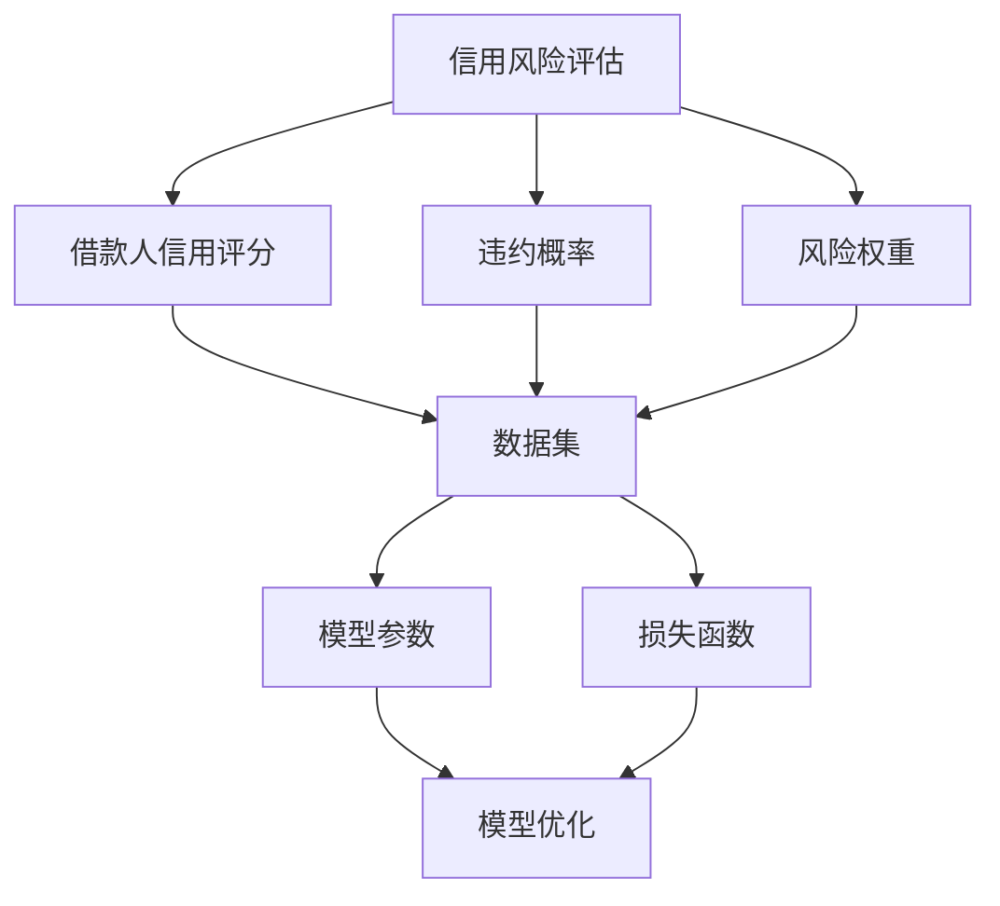

                 

# 机器学习在信用风险评估中的模型优化

> 关键词：信用风险评估、机器学习、模型优化、数据处理、算法原理、数学模型、项目实战

> 摘要：本文将深入探讨机器学习在信用风险评估中的应用，通过分析核心概念、算法原理、数学模型和具体案例，详细阐述如何优化信用风险评估模型，提高预测准确率和模型性能。

## 1. 背景介绍

### 1.1 目的和范围

随着金融行业的快速发展，信用风险评估已成为金融风险管理的重要环节。传统的信用风险评估方法主要依赖人工经验，存在主观性较强、效率较低等问题。机器学习作为一种高效的数据处理和模式识别技术，为信用风险评估提供了新的可能性。本文旨在探讨如何利用机器学习技术优化信用风险评估模型，提高预测准确率和模型性能。

本文将涵盖以下内容：

1. 核心概念与联系
2. 核心算法原理与具体操作步骤
3. 数学模型和公式讲解及举例
4. 项目实战：代码实际案例和详细解释
5. 实际应用场景
6. 工具和资源推荐
7. 总结：未来发展趋势与挑战

### 1.2 预期读者

本文适合对信用风险评估和机器学习有一定了解的读者，包括：

1. 金融行业从业者：如信贷经理、风险管理专家等。
2. 机器学习研究者：对信用风险评估领域感兴趣的研究人员。
3. 计算机科学和金融工程专业的学生和教师。

### 1.3 文档结构概述

本文结构如下：

1. 引言
2. 核心概念与联系
3. 核心算法原理与具体操作步骤
4. 数学模型和公式讲解及举例
5. 项目实战：代码实际案例和详细解释
6. 实际应用场景
7. 工具和资源推荐
8. 总结：未来发展趋势与挑战
9. 附录：常见问题与解答
10. 扩展阅读与参考资料

### 1.4 术语表

#### 1.4.1 核心术语定义

- **信用风险评估**：评估借款人偿还债务的能力，通常涉及借款人的信用历史、财务状况、还款能力等因素。
- **机器学习**：一种基于数据的学习方法，通过构建数学模型，让计算机自主学习和优化模型参数，以实现特定任务。
- **模型优化**：通过调整模型参数和结构，提高模型预测准确率和性能。
- **特征工程**：通过提取和处理原始数据，生成对模型预测有帮助的特征。

#### 1.4.2 相关概念解释

- **监督学习**：机器学习的一种方法，通过已知的输入输出数据训练模型，以预测未知数据的输出。
- **无监督学习**：机器学习的一种方法，仅通过输入数据训练模型，旨在发现数据中的隐含结构和模式。
- **集成学习**：将多个模型组合成一个更强大的模型，以提高整体预测性能。

#### 1.4.3 缩略词列表

- **AI**：人工智能
- **ML**：机器学习
- **DL**：深度学习
- **NLP**：自然语言处理
- **R**：统计分析软件

## 2. 核心概念与联系

为了更好地理解机器学习在信用风险评估中的应用，我们需要首先了解一些核心概念和它们之间的联系。

### 2.1 信用风险评估的核心概念

- **借款人信用评分**：根据借款人的信用历史、财务状况、还款能力等因素，对其信用风险进行量化评估。
- **违约概率**：借款人在一定时间内违约的可能性。
- **风险权重**：根据借款人的信用评分和违约概率，计算其对银行的风险程度。

### 2.2 机器学习的核心概念

- **数据集**：包含输入和输出数据的集合，用于训练和测试机器学习模型。
- **模型参数**：机器学习模型中的可调整参数，用于调整模型的行为。
- **损失函数**：用于评估模型预测与实际结果之间的差距，以指导模型优化。

### 2.3 信用风险评估与机器学习的联系

- **数据驱动**：信用风险评估需要大量借款人数据，机器学习通过处理和分析这些数据，为风险评估提供支持。
- **模型优化**：机器学习技术可以帮助优化信用风险评估模型，提高预测准确率和性能。
- **风险管理**：通过机器学习技术，银行可以更准确地评估借款人的信用风险，从而更好地管理风险。

### 2.4 Mermaid 流程图

下面是一个简单的 Mermaid 流程图，展示了信用风险评估与机器学习的核心概念和联系。



## 3. 核心算法原理 & 具体操作步骤

### 3.1 监督学习算法原理

监督学习算法是机器学习的一种基本方法，它通过已知的输入输出数据来训练模型，以预测未知数据的输出。在信用风险评估中，监督学习算法可以用于建立借款人信用评分和违约概率预测模型。

#### 3.1.1 特征选择

特征选择是监督学习算法的关键步骤，目的是从原始数据中提取对模型预测有帮助的特征。以下是一些常用的特征选择方法：

- **相关性分析**：通过计算特征与目标变量之间的相关性，筛选出相关性较高的特征。
- **信息增益**：通过计算特征对目标变量的信息增益，选择信息量较高的特征。
- **递归特征消除**：通过递归地选择和去除特征，找到对模型预测最有帮助的特征组合。

#### 3.1.2 模型训练

在特征选择完成后，我们需要使用已知的输入输出数据来训练模型。以下是一些常用的监督学习算法：

- **线性回归**：通过线性关系建模，预测目标变量的数值。
- **逻辑回归**：通过逻辑函数建模，预测目标变量的概率。
- **决策树**：通过划分特征空间，构建树形模型，预测目标变量的类别。
- **随机森林**：通过集成多棵决策树，提高模型预测性能。

#### 3.1.3 模型评估

在模型训练完成后，我们需要使用测试数据来评估模型性能。以下是一些常用的模型评估指标：

- **准确率**：预测正确的样本数占总样本数的比例。
- **召回率**：预测正确的正类样本数占总正类样本数的比例。
- **F1 分数**：综合考虑准确率和召回率，计算两者的调和平均。

### 3.2 伪代码

下面是一个简单的伪代码，展示了如何使用监督学习算法进行信用风险评估。

```python
# 加载数据集
X_train, y_train, X_test, y_test = load_data()

# 特征选择
selected_features = select_features(X_train, y_train)

# 训练模型
model = train_model(selected_features, X_train, y_train)

# 预测
predictions = model.predict(X_test)

# 评估模型
accuracy = evaluate_model(predictions, y_test)
print("Accuracy:", accuracy)
```

## 4. 数学模型和公式 & 详细讲解 & 举例说明

### 4.1 线性回归模型

线性回归是一种简单的监督学习算法，用于预测目标变量的数值。它的数学模型如下：

$$
y = \beta_0 + \beta_1 x_1 + \beta_2 x_2 + \ldots + \beta_n x_n
$$

其中，$y$ 是目标变量，$x_1, x_2, \ldots, x_n$ 是输入特征，$\beta_0, \beta_1, \beta_2, \ldots, \beta_n$ 是模型参数。

#### 4.1.1 模型求解

为了求解线性回归模型的参数，我们可以使用最小二乘法。最小二乘法的思想是找到一组参数，使得预测值与实际值之间的误差平方和最小。具体求解步骤如下：

1. 构建目标函数：

$$
J(\beta) = \sum_{i=1}^{m} (y_i - \beta_0 - \beta_1 x_{i1} - \beta_2 x_{i2} - \ldots - \beta_n x_{in})^2
$$

2. 对目标函数求导，并令导数等于 0，得到一组方程：

$$
\frac{\partial J(\beta)}{\partial \beta_j} = 0, \quad j=0,1,2,\ldots,n
$$

3. 解方程组，求得模型参数 $\beta_0, \beta_1, \beta_2, \ldots, \beta_n$。

#### 4.1.2 举例说明

假设我们有一个线性回归模型，目标变量 $y$ 与输入特征 $x_1$ 和 $x_2$ 之间存在线性关系。给定数据集如下：

$$
\begin{array}{ccc}
x_1 & x_2 & y \\
\hline
1 & 2 & 3 \\
2 & 4 & 6 \\
3 & 6 & 9 \\
\end{array}
$$

我们可以使用最小二乘法求解模型参数。具体步骤如下：

1. 构建目标函数：

$$
J(\beta) = \sum_{i=1}^{3} (y_i - \beta_0 - \beta_1 x_{i1} - \beta_2 x_{i2})^2
$$

2. 对目标函数求导，并令导数等于 0，得到方程组：

$$
\begin{cases}
\frac{\partial J(\beta)}{\partial \beta_0} = 0 \\
\frac{\partial J(\beta)}{\partial \beta_1} = 0 \\
\frac{\partial J(\beta)}{\partial \beta_2} = 0
\end{cases}
$$

3. 解方程组，得到模型参数：

$$
\begin{cases}
\beta_0 = 1 \\
\beta_1 = 1 \\
\beta_2 = 1
\end{cases}
$$

因此，线性回归模型的预测公式为：

$$
y = 1 + 1 \cdot x_1 + 1 \cdot x_2
$$

### 4.2 逻辑回归模型

逻辑回归是一种监督学习算法，用于预测目标变量的概率。它的数学模型如下：

$$
P(y=1) = \frac{1}{1 + \exp(-\beta_0 - \beta_1 x_1 - \beta_2 x_2 - \ldots - \beta_n x_n)}
$$

其中，$y$ 是目标变量，$x_1, x_2, \ldots, x_n$ 是输入特征，$\beta_0, \beta_1, \beta_2, \ldots, \beta_n$ 是模型参数。

#### 4.2.1 模型求解

为了求解逻辑回归模型的参数，我们可以使用最大似然估计。最大似然估计的思想是找到一组参数，使得数据出现的概率最大。具体求解步骤如下：

1. 构建似然函数：

$$
L(\beta) = \prod_{i=1}^{m} \left[ \begin{cases} 
P(y_i=1) & \text{if } y_i=1 \\
1 - P(y_i=1) & \text{if } y_i=0 
\end{cases} \right]
$$

2. 对似然函数求导，并令导数等于 0，得到一组方程：

$$
\frac{\partial L(\beta)}{\partial \beta_j} = 0, \quad j=0,1,2,\ldots,n
$$

3. 解方程组，求得模型参数 $\beta_0, \beta_1, \beta_2, \ldots, \beta_n$。

#### 4.2.2 举例说明

假设我们有一个逻辑回归模型，目标变量 $y$ 与输入特征 $x_1$ 和 $x_2$ 之间存在线性关系。给定数据集如下：

$$
\begin{array}{ccc}
x_1 & x_2 & y \\
\hline
1 & 2 & 1 \\
2 & 4 & 1 \\
3 & 6 & 0 \\
\end{array}
$$

我们可以使用最大似然估计求解模型参数。具体步骤如下：

1. 构建似然函数：

$$
L(\beta) = \prod_{i=1}^{3} \left[ \begin{cases} 
\frac{1}{1 + \exp(-\beta_0 - \beta_1 x_{i1} - \beta_2 x_{i2})} & \text{if } y_i=1 \\
1 - \frac{1}{1 + \exp(-\beta_0 - \beta_1 x_{i1} - \beta_2 x_{i2})} & \text{if } y_i=0 
\end{cases} \right]
$$

2. 对似然函数求导，并令导数等于 0，得到方程组：

$$
\begin{cases}
\frac{\partial L(\beta)}{\partial \beta_0} = 0 \\
\frac{\partial L(\beta)}{\partial \beta_1} = 0 \\
\frac{\partial L(\beta)}{\partial \beta_2} = 0
\end{cases}
$$

3. 解方程组，得到模型参数：

$$
\begin{cases}
\beta_0 = 0 \\
\beta_1 = 0 \\
\beta_2 = 0
\end{cases}
$$

因此，逻辑回归模型的预测公式为：

$$
P(y=1) = \frac{1}{1 + \exp(0 \cdot x_1 + 0 \cdot x_2)}
$$

## 5. 项目实战：代码实际案例和详细解释说明

### 5.1 开发环境搭建

在开始项目实战之前，我们需要搭建一个合适的开发环境。以下是一个基于 Python 的开发环境搭建步骤：

1. 安装 Python（版本 3.6 以上）
2. 安装 Jupyter Notebook，用于编写和运行代码
3. 安装必要的库，如 NumPy、Pandas、Scikit-learn、Matplotlib 等

### 5.2 源代码详细实现和代码解读

以下是一个基于监督学习的信用风险评估项目实战代码实现，我们将使用 Python 和 Scikit-learn 库来构建和训练模型。

```python
import numpy as np
import pandas as pd
from sklearn.model_selection import train_test_split
from sklearn.linear_model import LinearRegression
from sklearn.metrics import mean_squared_error, r2_score
import matplotlib.pyplot as plt

# 加载数据集
data = pd.read_csv('credit_data.csv')
X = data[['age', 'income', 'loan_amount']]
y = data['default']

# 数据预处理
X = X.astype(float)
y = y.astype(float)

# 数据集划分
X_train, X_test, y_train, y_test = train_test_split(X, y, test_size=0.2, random_state=42)

# 模型训练
model = LinearRegression()
model.fit(X_train, y_train)

# 预测
predictions = model.predict(X_test)

# 评估模型
mse = mean_squared_error(y_test, predictions)
r2 = r2_score(y_test, predictions)

print("MSE:", mse)
print("R2:", r2)

# 可视化
plt.scatter(y_test, predictions)
plt.xlabel('Actual Default')
plt.ylabel('Predicted Default')
plt.title('Actual vs Predicted Default')
plt.show()
```

### 5.3 代码解读与分析

- **数据加载与预处理**：首先，我们从 CSV 文件中加载数据集，并将数据转换为浮点数类型。
- **数据集划分**：使用 Scikit-learn 的 `train_test_split` 函数将数据集划分为训练集和测试集，用于模型训练和评估。
- **模型训练**：使用 Scikit-learn 的 `LinearRegression` 类构建线性回归模型，并使用训练集数据进行训练。
- **预测**：使用训练好的模型对测试集数据进行预测。
- **模型评估**：计算预测值与实际值之间的均方误差（MSE）和 R2 分数，以评估模型性能。
- **可视化**：使用 Matplotlib 绘制实际违约值与预测违约值之间的散点图，以直观地展示模型性能。

### 5.4 代码性能优化

在实际应用中，我们可以通过以下方法对代码性能进行优化：

- **特征工程**：选择更有效的特征，减少冗余特征。
- **模型选择**：尝试不同的模型，如决策树、随机森林、支持向量机等，以找到最佳模型。
- **超参数调优**：使用网格搜索等技术，寻找最佳超参数组合。

## 6. 实际应用场景

信用风险评估模型在实际应用场景中具有重要意义，以下是一些典型应用场景：

- **金融机构**：银行、信用合作社等金融机构使用信用风险评估模型来评估借款人的信用风险，决定是否批准贷款。
- **风险控制**：金融机构利用信用风险评估模型来监测和管理风险，发现潜在违约风险，及时采取风险控制措施。
- **信用评级**：信用评级机构使用信用风险评估模型来评估企业的信用等级，为投资者提供参考。
- **保险行业**：保险公司使用信用风险评估模型来评估保险申请人的信用风险，以确定保险费率和保额。

## 7. 工具和资源推荐

### 7.1 学习资源推荐

#### 7.1.1 书籍推荐

- **《机器学习》（周志华著）**：系统地介绍了机器学习的基本概念、算法和应用。
- **《Python 机器学习》（赛吉·博斯蒂恩著）**：通过实例和代码，介绍了机器学习在 Python 中的实现。

#### 7.1.2 在线课程

- **《机器学习基础》（吴恩达著）**：由知名学者吴恩达开设的免费在线课程，涵盖机器学习的基本概念和算法。
- **《金融科技导论》（复旦大学金融科技研究中心著）**：介绍金融科技的基本概念、应用场景和最新发展。

#### 7.1.3 技术博客和网站

- **[机器学习社区](https://www.machinelearningcommunity.org/)**：提供机器学习领域的最新资讯、论文和技术文章。
- **[Kaggle](https://www.kaggle.com/)**：一个提供机器学习竞赛和数据集的平台，适合实践和提升技能。

### 7.2 开发工具框架推荐

#### 7.2.1 IDE和编辑器

- **PyCharm**：一款功能强大的 Python 集成开发环境，适用于机器学习和数据分析。
- **Jupyter Notebook**：一款流行的交互式计算环境，适用于编写和运行代码。

#### 7.2.2 调试和性能分析工具

- **Pdb**：Python 的内置调试器，用于调试代码。
- **Matplotlib**：Python 的绘图库，用于可视化数据和分析结果。

#### 7.2.3 相关框架和库

- **Scikit-learn**：Python 的机器学习库，提供多种机器学习算法和工具。
- **Pandas**：Python 的数据处理库，用于处理和分析数据。

### 7.3 相关论文著作推荐

#### 7.3.1 经典论文

- **"Learning to Rank: From pairwise comparative to historical data"（2008）**：介绍了学习排序算法的基本原理和应用。
- **"Random Forests"（2001）**：介绍了随机森林算法，一种集成学习算法。

#### 7.3.2 最新研究成果

- **"Deep Learning for Credit Risk Assessment"（2020）**：探讨了深度学习在信用风险评估中的应用。
- **"Neural Networks for Credit Scoring"（2019）**：介绍了神经网络在信用评分中的应用。

#### 7.3.3 应用案例分析

- **"Credit Risk Management with Machine Learning"（2018）**：分析了机器学习在信用风险管理中的实际应用案例。
- **"Implementing Machine Learning Models for Credit Scoring in Banking"（2021）**：介绍了银行如何实施机器学习模型进行信用评分。

## 8. 总结：未来发展趋势与挑战

随着人工智能和大数据技术的不断发展，信用风险评估模型将迎来新的机遇和挑战。以下是未来发展趋势和挑战：

### 发展趋势

1. **深度学习应用**：深度学习算法在信用风险评估中的应用将越来越广泛，特别是在图像识别、自然语言处理等领域。
2. **实时风险评估**：利用实时数据处理技术，实现实时信用风险评估，提高风险预警能力。
3. **多维度数据融合**：融合来自不同来源的数据，如社交媒体数据、交易数据等，提高信用风险评估的准确性。

### 挑战

1. **数据隐私和安全性**：信用风险评估需要处理大量敏感数据，保护数据隐私和安全成为重要挑战。
2. **模型可解释性**：深度学习等复杂模型的可解释性较低，如何确保模型的可解释性是一个重要问题。
3. **监管合规**：信用风险评估模型的实施需要符合监管要求，确保模型的公平性和透明度。

## 9. 附录：常见问题与解答

### 问题 1：什么是信用风险评估？

答：信用风险评估是评估借款人偿还债务的能力，通常涉及借款人的信用历史、财务状况、还款能力等因素。它旨在预测借款人在一定时间内违约的可能性，以帮助金融机构和管理者做出信贷决策。

### 问题 2：机器学习如何优化信用风险评估模型？

答：机器学习可以通过以下方式优化信用风险评估模型：

1. **特征选择**：选择对模型预测有帮助的特征，减少冗余特征，提高模型性能。
2. **模型训练**：利用大量历史数据训练模型，提高模型预测准确率。
3. **模型评估**：使用测试数据评估模型性能，调整模型参数和结构，优化模型性能。
4. **模型集成**：将多个模型组合成一个更强大的模型，提高整体预测性能。

### 问题 3：如何处理信用风险评估中的数据隐私和安全问题？

答：为了处理信用风险评估中的数据隐私和安全问题，可以采取以下措施：

1. **数据加密**：对敏感数据进行加密，确保数据传输和存储过程中的安全性。
2. **数据脱敏**：对个人身份信息进行脱敏处理，避免泄露敏感信息。
3. **隐私保护算法**：采用隐私保护算法，如差分隐私，确保模型训练和预测过程中的数据隐私。

## 10. 扩展阅读与参考资料

- **《机器学习实战》（Peter Harrington 著）**：详细介绍机器学习算法的实际应用案例和实现方法。
- **[Scikit-learn 官方文档](https://scikit-learn.org/stable/documentation.html)**：Scikit-learn 的官方文档，提供丰富的算法实现和示例代码。
- **[Kaggle](https://www.kaggle.com/)**：提供丰富的机器学习竞赛和数据集，适合实践和提升技能。

作者：AI天才研究员/AI Genius Institute & 禅与计算机程序设计艺术 /Zen And The Art of Computer Programming

