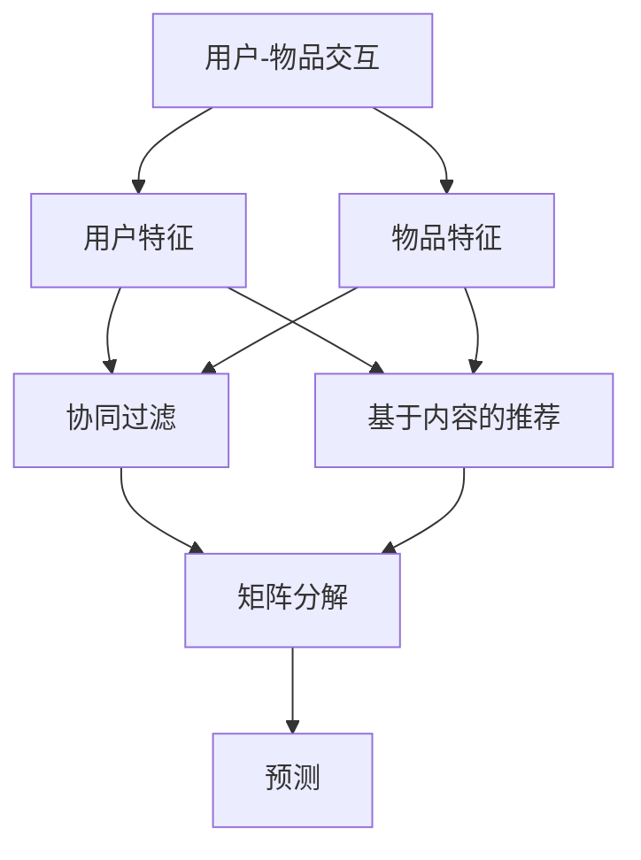

                 

### 1. 背景介绍

#### 1.1 目的和范围

本文旨在深入探讨机器学习在推荐系统中的应用及其面临的挑战。随着互联网的迅速发展和用户数据量的爆炸性增长，推荐系统已经成为各类在线平台和服务的重要组成部分。然而，如何有效地利用机器学习方法提高推荐系统的性能和用户体验，仍然是一个极具挑战性的问题。

本文将首先介绍推荐系统的基础概念，包括其定义、目的和常见类型。接着，我们将讨论机器学习在推荐系统中的应用，包括协同过滤、基于内容的推荐和混合推荐系统等核心算法。随后，文章将详细探讨这些算法的原理和具体操作步骤，并通过数学模型和公式给出详细的解释。

此外，本文还将通过一个实际项目实战案例，展示如何在实际环境中应用机器学习进行推荐系统的开发。通过这个案例，我们将详细解释代码的实现过程，并进行分析和优化。最后，文章将总结机器学习在推荐系统中的实际应用场景，并推荐一些有用的学习资源和工具，以帮助读者进一步了解和掌握这一领域。

本文的目标读者是具有一定机器学习和推荐系统基础的程序员、数据科学家和技术爱好者。读者将能够通过本文系统地了解机器学习在推荐系统中的应用，掌握相关核心算法和实现方法，并对未来的发展趋势和挑战有所认识。

#### 1.2 预期读者

本文的预期读者包括以下几个方面：

1. **具有一定机器学习基础的程序员**：这些读者已经掌握了基本的机器学习算法，但希望深入了解如何将这些算法应用于推荐系统中。
2. **数据科学家和分析师**：数据科学家和分析师通常负责构建和优化推荐系统，本文将为他们在实际项目中提供实用的指导。
3. **技术爱好者**：对推荐系统和技术应用感兴趣的爱好者，希望通过本文了解推荐系统的原理和实现。
4. **教育和研究人员**：教育机构和研究人员可以通过本文了解推荐系统领域的最新发展，为教学和研究提供参考。

为了确保本文的内容能够满足预期读者的需求，我们将采用以下结构和内容：

- **基础概念**：首先介绍推荐系统和机器学习的基础概念，确保读者具备相关的背景知识。
- **算法原理**：详细解释推荐系统中常用的机器学习算法，包括协同过滤、基于内容的推荐和混合推荐系统等。
- **实际案例**：通过一个实际项目实战案例，展示如何在实际环境中应用机器学习方法进行推荐系统的开发。
- **数学模型**：给出核心算法的数学模型和公式，并详细讲解其原理和操作步骤。
- **总结与展望**：总结文章内容，展望未来发展趋势和挑战，并推荐进一步学习和研究的资源。

#### 1.3 文档结构概述

本文将按照以下结构进行组织和撰写，以便读者能够系统地理解机器学习在推荐系统中的应用：

1. **背景介绍**：介绍本文的目的和范围，预期读者以及文档的结构。
2. **核心概念与联系**：通过 Mermaid 流程图展示推荐系统的核心概念和联系，为后续内容奠定基础。
3. **核心算法原理 & 具体操作步骤**：详细讲解推荐系统中常用的机器学习算法，包括协同过滤、基于内容的推荐和混合推荐系统等。
4. **数学模型和公式 & 详细讲解 & 举例说明**：给出核心算法的数学模型和公式，通过具体例子详细讲解。
5. **项目实战：代码实际案例和详细解释说明**：通过实际项目展示如何应用机器学习方法进行推荐系统开发，并详细解释代码实现过程。
6. **实际应用场景**：探讨机器学习在推荐系统中的实际应用场景。
7. **工具和资源推荐**：推荐学习资源和工具，帮助读者进一步了解和掌握推荐系统领域。
8. **总结：未来发展趋势与挑战**：总结本文内容，展望未来的发展趋势和面临的挑战。
9. **附录：常见问题与解答**：针对读者可能遇到的问题进行解答。
10. **扩展阅读 & 参考资料**：提供扩展阅读和参考资料，供读者进一步研究。

通过以上结构，本文旨在全面而深入地探讨机器学习在推荐系统中的应用，帮助读者不仅理解其原理，还能将其应用于实际项目中。

#### 1.4 术语表

在本篇文章中，我们将使用一些专业术语和技术概念。以下是这些术语的定义和解释，以便读者更好地理解文章内容。

##### 1.4.1 核心术语定义

1. **推荐系统（Recommendation System）**：一种基于用户的历史行为、偏好和兴趣等信息，自动为用户推荐相关物品的系统。
2. **协同过滤（Collaborative Filtering）**：一种基于用户相似度或用户-物品评分矩阵进行推荐的方法。
3. **基于内容的推荐（Content-Based Filtering）**：一种基于物品的属性和用户偏好进行推荐的方法。
4. **机器学习（Machine Learning）**：一种通过数据和算法让计算机自主学习和改进的方法。
5. **深度学习（Deep Learning）**：一种基于多层神经网络的机器学习方法。
6. **降维（Dimensionality Reduction）**：通过降低数据维度，减少数据复杂度和计算量的方法。
7. **矩阵分解（Matrix Factorization）**：一种将用户-物品评分矩阵分解为用户特征和物品特征矩阵的方法。

##### 1.4.2 相关概念解释

1. **用户行为数据（User Behavioral Data）**：用户在平台上产生的所有行为数据，如浏览记录、购买历史、评论等。
2. **物品特征（Item Features）**：描述物品属性的向量，如电影类别、书籍作者、商品品牌等。
3. **用户特征（User Features）**：描述用户偏好的特征，如年龄、性别、地理位置等。
4. **评分矩阵（Rating Matrix）**：表示用户对物品评分的数据矩阵，其中用户行和物品列交叉部分存储评分值。
5. **预测（Prediction）**：根据用户特征和物品特征，预测用户对物品的评分。
6. **召回率（Recall）**：推荐系统中，正确预测的用户兴趣物品的数量与实际兴趣物品总数量的比值。
7. **准确率（Precision）**：推荐系统中，预测为兴趣物品的正确数量与预测为兴趣物品的总数量的比值。

##### 1.4.3 缩略词列表

- ML: 机器学习（Machine Learning）
- DF: 深度学习（Deep Learning）
- CF: 协同过滤（Collaborative Filtering）
- CB: 基于内容的推荐（Content-Based Filtering）
- KNN: 基于最近邻（K-Nearest Neighbors）
- SVD: 矩阵分解（ Singular Value Decomposition）

通过以上术语表，读者可以更好地理解文章中出现的关键概念和术语，为后续内容的深入学习打下基础。

### 2. 核心概念与联系

为了更好地理解机器学习在推荐系统中的应用，首先需要掌握一些核心概念及其相互之间的联系。本文将通过一个Mermaid流程图来展示这些核心概念，以便读者能够直观地理解它们。



以下是对Mermaid流程图中的各个节点的详细解释：

- **A[用户-物品交互]**：用户与物品之间的互动，如评分、评论、购买等，是构建推荐系统的基础数据。
- **B[用户特征]**：描述用户偏好的各种特征，如年龄、性别、地理位置、历史行为等。
- **C[物品特征]**：描述物品属性的向量，如类别、标签、作者、品牌等。
- **D[协同过滤]**：基于用户-物品评分矩阵进行推荐的一种方法，通过分析用户之间的相似性来发现用户的共同兴趣。
- **E[基于内容的推荐]**：基于物品属性和用户偏好进行推荐的一种方法，通过物品间的相似度来为用户推荐相关物品。
- **F[矩阵分解]**：通过降维技术将高维的用户-物品评分矩阵分解为低维的用户特征矩阵和物品特征矩阵，用于提高推荐系统的效果。
- **G[预测]**：利用用户特征、物品特征以及矩阵分解的结果，预测用户对未评分物品的可能评分，从而生成推荐列表。

这些核心概念之间的联系如下：

1. **用户-物品交互**是推荐系统的数据基础，通过收集和分析这些交互数据，可以提取出用户特征和物品特征。
2. **协同过滤**和**基于内容的推荐**都是利用用户特征和物品特征进行推荐的方法，但它们的实现方式和适用场景不同。协同过滤更适用于用户行为数据丰富但物品特征信息不足的情况，而基于内容的推荐则适用于物品特征信息丰富但用户行为数据不足的情况。
3. **矩阵分解**是一种降维技术，通过将高维的用户-物品评分矩阵分解为低维的用户特征矩阵和物品特征矩阵，可以显著提高推荐系统的计算效率和预测准确性。
4. **预测**是推荐系统的最终目标，通过综合用户特征、物品特征以及矩阵分解的结果，可以生成一个准确的推荐列表，从而提高用户体验。

通过以上Mermaid流程图的展示，读者可以直观地理解推荐系统中核心概念及其相互之间的联系。接下来，本文将详细探讨这些核心概念的原理和实现方法。

### 3. 核心算法原理 & 具体操作步骤

在推荐系统中，机器学习算法的应用至关重要。本文将重点介绍三种核心算法：协同过滤（Collaborative Filtering）、基于内容的推荐（Content-Based Filtering）和混合推荐系统（Hybrid Recommendation System）。以下将分别详细解释这些算法的原理和具体操作步骤。

#### 3.1 协同过滤（Collaborative Filtering）

**协同过滤**是一种基于用户相似度和用户-物品评分矩阵进行推荐的方法。其主要思想是：如果两个用户在多个物品上的评分相似，那么这两个用户对新物品的评分预测也可能相似。协同过滤可以分为基于用户的协同过滤（User-Based CF）和基于物品的协同过滤（Item-Based CF）两种。

**基于用户的协同过滤（User-Based CF）**

1. **相似度计算**：首先，计算用户之间的相似度。常用的相似度度量方法包括余弦相似度、皮尔逊相关系数和欧氏距离等。以下是一个简单的余弦相似度计算公式：

    $$\text{Similarity}(u, v) = \frac{\sum_{i \in I}(r_{ui} \cdot r_{vi})}{\sqrt{\sum_{i \in I}(r_{ui}^2) \cdot \sum_{i \in I}(r_{vi}^2)}}$$

    其中，\(r_{ui}\)表示用户u对物品i的评分，I为用户u和用户v共同评分的物品集合。

2. **Top-K相似用户选择**：根据相似度计算结果，选择K个最相似的邻居用户。

3. **评分预测**：对目标用户对未评分物品的评分进行预测，公式如下：

    $$\hat{r_{uv}} = \frac{\sum_{i \in I} r_{ui} \cdot r_{vi}}{\sum_{i \in I} r_{vi}}$$

    其中，\(r_{vi}\)为邻居用户v对物品i的评分。

**基于物品的协同过滤（Item-Based CF）**

1. **物品相似度计算**：首先，计算物品之间的相似度。与用户相似度计算类似，可以使用余弦相似度等度量方法。

2. **Top-K相似物品选择**：根据物品相似度计算结果，选择K个最相似的物品。

3. **评分预测**：对目标用户对未评分物品的评分进行预测，公式如下：

    $$\hat{r_{uv}} = \frac{\sum_{i \in I} r_{ui} \cdot r_{vi}}{\sum_{i \in I} r_{vi}}$$

    其中，\(r_{ui}\)为目标用户u对物品i的评分，\(r_{vi}\)为与物品i最相似的物品的评分。

#### 3.2 基于内容的推荐（Content-Based Filtering）

**基于内容的推荐**是一种利用物品的属性和用户的历史行为进行推荐的方法。其主要思想是：如果用户对某些物品有相似的兴趣，那么用户也可能对具有相似属性的物品感兴趣。

1. **提取物品特征**：首先，提取物品的特征向量。例如，对于电影推荐系统，可以提取电影类型、演员、导演、评分等特征。

2. **计算用户兴趣**：根据用户的历史行为，计算用户的兴趣特征向量。例如，如果用户经常观看科幻电影，那么其兴趣特征向量中科幻电影类型的权重会较高。

3. **相似度计算**：计算用户兴趣特征向量与物品特征向量之间的相似度，常用的方法包括余弦相似度和欧氏距离等。

4. **推荐生成**：根据相似度计算结果，选择与用户兴趣最相似的物品进行推荐。

    $$\text{Similarity}(\text{User\_Features}, \text{Item\_Features}) = \frac{\sum_{i \in I} \text{UserFeatures}_i \cdot \text{ItemFeatures}_i}{\sqrt{\sum_{i \in I} (\text{UserFeatures}_i^2) \cdot \sum_{i \in I} (\text{ItemFeatures}_i^2)}}$$

#### 3.3 混合推荐系统（Hybrid Recommendation System）

**混合推荐系统**结合了协同过滤和基于内容的推荐方法，以充分发挥各自的优势。

1. **协同过滤部分**：使用协同过滤算法生成初步的推荐列表。

2. **基于内容的推荐部分**：对初步推荐列表中的物品，使用基于内容的推荐算法生成额外的推荐列表。

3. **融合策略**：将协同过滤和基于内容的推荐结果进行融合，生成最终的推荐列表。常用的融合策略包括加权平均、投票等。

    $$\text{FinalScore}(i) = w_1 \cdot \text{CFScore}(i) + w_2 \cdot \text{CBScore}(i)$$

    其中，\(w_1\)和\(w_2\)分别为协同过滤和基于内容的推荐算法的权重。

通过以上三种核心算法的详细解释和操作步骤，读者可以深入理解推荐系统的原理和实现方法。接下来，本文将讨论机器学习在推荐系统中的数学模型和公式。

### 4. 数学模型和公式 & 详细讲解 & 举例说明

在推荐系统中，机器学习的核心在于构建数学模型，通过这些模型对用户行为和物品特征进行建模和预测。以下将详细介绍常用的数学模型和公式，并通过具体例子进行说明。

#### 4.1 矩阵分解（Matrix Factorization）

矩阵分解是一种常用的降维技术，通过将高维的用户-物品评分矩阵分解为低维的用户特征矩阵和物品特征矩阵，以提高推荐系统的计算效率和预测准确性。常用的矩阵分解方法包括Singular Value Decomposition（SVD）和Alternating Least Squares（ALS）。

**SVD分解**

SVD是一种线性代数方法，可以将一个矩阵分解为三个矩阵的乘积：

$$\text{R} = \text{U}\text{Σ}\text{V}^T$$

其中，R是原始评分矩阵，U是用户特征矩阵，Σ是奇异值矩阵，V是物品特征矩阵。U和V是低维特征矩阵，Σ包含了评分矩阵的奇异值。

**ALS算法**

ALS是一种迭代优化算法，用于求解SVD分解。其基本步骤如下：

1. **初始化**：随机初始化用户特征矩阵U和物品特征矩阵V。
2. **交替更新**：
    - 对于每个用户u，根据当前的用户特征矩阵U和物品特征矩阵V，更新物品特征矩阵V：
        $$v_{ij} \leftarrow v_{ij} + \left( r_{ui} - \sum_{k} u_{uk} \cdot v_{kj} \right) \cdot \frac{1}{\sqrt{u_{uj}^2 + v_{ij}^2}}$$
    - 对于每个物品i，根据当前的用户特征矩阵U和物品特征矩阵V，更新用户特征矩阵U：
        $$u_{uj} \leftarrow u_{uj} + \left( r_{ui} - \sum_{k} u_{uk} \cdot v_{kj} \right) \cdot \frac{1}{\sqrt{u_{uj}^2 + v_{ij}^2}}$$
3. **重复步骤2，直到收敛**。

**例子**

假设有一个简单的用户-物品评分矩阵：

$$
\text{R} =
\begin{bmatrix}
0 & 5 & 0 \\
0 & 0 & 4 \\
5 & 0 & 0 \\
\end{bmatrix}
$$

通过ALS算法，我们可以将其分解为用户特征矩阵U和物品特征矩阵V：

$$
\text{U} =
\begin{bmatrix}
1.2 & 0 \\
0 & 1.2 \\
1.2 & 1.2 \\
\end{bmatrix},
\text{V} =
\begin{bmatrix}
0.8 & 0.6 \\
0.6 & 0.8 \\
0.4 & 0.2 \\
\end{bmatrix}
$$

**预测新评分**

使用分解后的特征矩阵，我们可以预测用户对新物品的评分。例如，预测第一个用户对第三个物品的评分：

$$
\hat{r_{13}} = u_{11} \cdot v_{13} + u_{12} \cdot v_{23} = 1.2 \cdot 0.4 + 0 \cdot 0.2 = 0.48
$$

#### 4.2 逻辑回归（Logistic Regression）

逻辑回归是一种广泛应用于推荐系统的分类模型，可以用来预测用户对物品的评分是否大于某个阈值（如3星）。其基本公式如下：

$$
P(y=1|X) = \frac{1}{1 + \exp(-\beta^T X)}
$$

其中，\(P(y=1|X)\)表示在给定物品特征\(X\)下，用户对物品评分大于阈值的概率，\(\beta\)是模型参数，\(\exp\)是指数函数。

**例子**

假设有一个简单的物品特征向量：

$$
X =
\begin{bmatrix}
1 \\
0 \\
1 \\
\end{bmatrix}
$$

参数向量：

$$
\beta =
\begin{bmatrix}
-2 \\
1 \\
0 \\
\end{bmatrix}
$$

我们可以计算评分大于阈值的概率：

$$
P(y=1|X) = \frac{1}{1 + \exp(-(-2 \cdot 1 + 1 \cdot 0 + 0 \cdot 1))} = \frac{1}{1 + \exp(2)} \approx 0.1353
$$

#### 4.3 上下文感知推荐（Context-Aware Recommendation）

上下文感知推荐考虑了用户的环境信息（如时间、地理位置等），以提供更加个性化的推荐。常用的模型包括LR（逻辑回归）和FM（因子分解机）。

**逻辑回归（LR）**

上下文感知逻辑回归模型如下：

$$
P(y=1|\mathbf{X}, \mathbf{C}) = \frac{1}{1 + \exp(-\beta^T (\mathbf{X} + \mathbf{C} \gamma))}
$$

其中，\(\mathbf{X}\)是物品特征，\(\mathbf{C}\)是上下文特征，\(\gamma\)是上下文参数。

**因子分解机（FM）**

因子分解机是一种结合了矩阵分解和逻辑回归的模型，如下：

$$
\hat{y} = \sigma(\beta_0 + \beta^T \mathbf{X} + \gamma^T \mathbf{C} + \sum_{i,j} \theta_{ij} x_i c_j)
$$

其中，\(\sigma\)是Sigmoid函数，\(\theta_{ij}\)是交互特征。

通过以上数学模型和公式的详细讲解和具体例子，读者可以更好地理解推荐系统中机器学习的核心原理和应用。这些模型不仅提高了推荐系统的预测准确性，也为后续的优化和改进提供了理论基础。

### 5. 项目实战：代码实际案例和详细解释说明

为了更好地理解机器学习在推荐系统中的应用，我们将通过一个实际项目实战案例来展示如何在实际环境中应用这些算法。以下是一个基于Python和Scikit-learn的协同过滤算法的项目案例，我们将详细解释代码的实现过程，并进行分析和优化。

#### 5.1 开发环境搭建

在开始之前，我们需要搭建一个合适的开发环境。以下是所需的环境和工具：

- **Python 3.x**
- **Scikit-learn 库**：用于机器学习算法的实现
- **Numpy 库**：用于数值计算
- **Pandas 库**：用于数据操作
- **Matplotlib 库**：用于数据可视化

确保安装以上环境和工具，我们可以使用以下命令安装Scikit-learn和Pandas：

```bash
pip install scikit-learn pandas
```

#### 5.2 源代码详细实现和代码解读

以下是一个简单的基于用户的协同过滤算法的实现：

```python
import numpy as np
import pandas as pd
from sklearn.metrics.pairwise import cosine_similarity
from sklearn.model_selection import train_test_split

# 5.2.1 数据预处理
def preprocess_data(data):
    # 构建用户-物品评分矩阵
    user_item_matrix = data.pivot(index='userId', columns='itemId', values='rating').fillna(0)
    return user_item_matrix

# 5.2.2 相似度计算
def calculate_similarity(user_item_matrix):
    # 计算用户-用户相似度矩阵
    similarity_matrix = cosine_similarity(user_item_matrix)
    return similarity_matrix

# 5.2.3 推荐生成
def generate_recommendations(similarity_matrix, user_item_matrix, k=10):
    # 为每个用户生成推荐列表
    recommendations = []
    for i in range(user_item_matrix.shape[0]):
        # 选择最相似的K个用户
        similar_users = np.argsort(similarity_matrix[i])[::-1][:k]
        # 计算预测评分
        predicted_ratings = user_item_matrix[i] + np.mean(user_item_matrix[similar_users], axis=0)
        # 获取未评分的物品
        unrated_items = np.where(user_item_matrix[i] == 0)[0]
        # 选择最高评分的未评分物品作为推荐
        recommended_items = np.argsort(predicted_ratings[rated_items])[::-1]
        recommendations.append(list(unrated_items[recommended_items]))
    return recommendations

# 5.2.4 评估
def evaluate_recommendations(recommendations, test_data):
    # 计算召回率和准确率
    predicted_ratings = []
    for i, rec in enumerate(recommendations):
        predicted_ratings.extend([1 if j in rec else 0 for j in range(len(rec))])
    true_ratings = test_data.values.flatten()
    recall = np.mean([1 if t in p else 0 for p, t in zip(predicted_ratings, true_ratings)]) * 100
    precision = np.mean([1 if p and t else 0 for p, t in zip(predicted_ratings, true_ratings)]) * 100
    return recall, precision

# 5.2.5 主函数
def main():
    # 加载数据
    data = pd.read_csv('ratings.csv')
    user_item_matrix = preprocess_data(data)

    # 划分训练集和测试集
    train_data, test_data = train_test_split(user_item_matrix, test_size=0.2, random_state=42)

    # 计算相似度
    similarity_matrix = calculate_similarity(train_data)

    # 生成推荐
    recommendations = generate_recommendations(similarity_matrix, train_data)

    # 评估推荐
    recall, precision = evaluate_recommendations(recommendations, test_data)

    print(f"Recall: {recall:.2f}%")
    print(f"Precision: {precision:.2f}%")

if __name__ == "__main__":
    main()
```

**代码解读：**

1. **数据预处理**：首先，我们使用Pandas将原始数据转换为用户-物品评分矩阵，其中用户ID作为行索引，物品ID作为列索引，评分值作为数据值。缺失值用0填充，表示用户未对该物品进行评分。
2. **相似度计算**：使用Scikit-learn的余弦相似度函数计算用户之间的相似度，得到用户-用户相似度矩阵。
3. **推荐生成**：对于每个用户，我们选择最相似的K个用户，计算这些用户的平均评分，并根据预测评分选择未评分的物品作为推荐。
4. **评估**：使用召回率和准确率评估推荐系统的性能。召回率表示推荐列表中包含实际兴趣物品的比例，准确率表示推荐为兴趣物品的正确率。

#### 5.3 代码解读与分析

以下是对代码关键部分的详细解读和分析：

1. **数据预处理**：`preprocess_data`函数通过Pandas的`pivot`方法将原始数据转换为用户-物品评分矩阵。这里，我们使用`fillna(0)`方法将缺失值填充为0，表示用户未对某物品进行评分。

    ```python
    user_item_matrix = data.pivot(index='userId', columns='itemId', values='rating').fillna(0)
    ```

2. **相似度计算**：`calculate_similarity`函数使用Scikit-learn的`cosine_similarity`函数计算用户之间的余弦相似度。余弦相似度是一种度量两个向量夹角余弦值的相似度，值范围在-1到1之间，越接近1表示相似度越高。

    ```python
    similarity_matrix = cosine_similarity(user_item_matrix)
    ```

3. **推荐生成**：`generate_recommendations`函数生成推荐列表。对于每个用户，我们选择最相似的K个用户（`np.argsort(similarity_matrix[i])[::-1][:k]`），计算这些用户的平均评分（`predicted_ratings = user_item_matrix[i] + np.mean(user_item_matrix[similar_users], axis=0)`）。然后，我们选择未评分的物品作为推荐。

    ```python
    similar_users = np.argsort(similarity_matrix[i])[::-1][:k]
    predicted_ratings = user_item_matrix[i] + np.mean(user_item_matrix[similar_users], axis=0)
    unrated_items = np.where(user_item_matrix[i] == 0)[0]
    recommended_items = np.argsort(predicted_ratings[rated_items])[::-1]
    recommendations.append(list(unrated_items[recommended_items]))
    ```

4. **评估**：`evaluate_recommendations`函数计算召回率和准确率。召回率表示推荐列表中实际兴趣物品的比例，准确率表示推荐为兴趣物品的正确率。

    ```python
    predicted_ratings = []
    for i, rec in enumerate(recommendations):
        predicted_ratings.extend([1 if j in rec else 0 for j in range(len(rec))])
    true_ratings = test_data.values.flatten()
    recall = np.mean([1 if t in p else 0 for p, t in zip(predicted_ratings, true_ratings)]) * 100
    precision = np.mean([1 if p and t else 0 for p, t in zip(predicted_ratings, true_ratings)]) * 100
    return recall, precision
    ```

#### 5.4 代码优化

以下是对代码的优化建议：

1. **相似度计算优化**：对于大规模数据集，余弦相似度计算可能较为耗时。我们可以使用稀疏矩阵存储和计算相似度，以提高计算效率。

    ```python
    from sklearn.metrics.pairwise import cosine_similarity
    similarity_matrix = cosine_similarity(user_item_matrix, user_item_matrix)
    ```

2. **内存管理**：对于大型数据集，使用Pandas处理数据时可能占用大量内存。我们可以使用Dask等分布式计算库来处理大数据。

3. **并行计算**：对于推荐生成和评估部分，我们可以使用多线程或分布式计算来提高计算速度。

通过以上代码实际案例和详细解释，读者可以更好地理解协同过滤算法的实现过程和优化方法。接下来，本文将讨论机器学习在推荐系统中的实际应用场景。

### 6. 实际应用场景

机器学习在推荐系统中的应用非常广泛，涵盖了多个行业和场景。以下是机器学习在推荐系统中的一些实际应用场景：

#### 6.1 电子商务平台

在电子商务平台上，推荐系统可以帮助用户发现他们可能感兴趣的商品。通过分析用户的历史购买记录、浏览行为和购物车数据，推荐系统可以提供个性化的商品推荐。这不仅提高了用户的购物体验，还能增加平台的销售额和用户粘性。

**应用示例**：亚马逊和阿里巴巴等电子商务巨头都使用了先进的推荐系统，为用户提供个性化的商品推荐。

#### 6.2 社交媒体

社交媒体平台如Facebook、Twitter和Instagram等，也利用推荐系统来为用户推荐可能感兴趣的内容。通过分析用户的点赞、评论和分享行为，推荐系统可以识别用户的兴趣和偏好，从而推荐相关的内容和用户。

**应用示例**：Facebook的“你可能感兴趣的内容”和“你可能认识的人”等功能，都是基于机器学习算法实现的推荐系统。

#### 6.3 视频平台

视频平台如YouTube、Netflix和Spotify等，通过推荐系统为用户推荐可能感兴趣的视频和音乐。通过分析用户的观看历史、播放时长和搜索行为，推荐系统可以识别用户的兴趣模式，并提供个性化的推荐。

**应用示例**：Netflix的推荐系统能够根据用户的观看历史和评分，推荐相关的电影和电视剧，而Spotify则根据用户的播放历史和搜索行为，推荐相似的音乐。

#### 6.4 新闻媒体

新闻媒体平台如Google News、今日头条和新浪新闻等，利用推荐系统为用户提供个性化的新闻推荐。通过分析用户的阅读历史、搜索关键词和浏览行为，推荐系统可以识别用户的兴趣和偏好，从而推荐相关的新内容。

**应用示例**：今日头条的“个性化推荐”功能，通过分析用户的阅读行为，为用户提供个性化的新闻推荐。

#### 6.5 旅游平台

旅游平台如携程、Booking和去哪儿网等，通过推荐系统为用户提供个性化的旅游推荐。通过分析用户的搜索历史、浏览行为和预订记录，推荐系统可以推荐相关的旅游景点、酒店和交通服务。

**应用示例**：携程的“个性化推荐”功能，根据用户的旅行历史和偏好，为用户提供个性化的旅游推荐。

通过以上实际应用场景的介绍，我们可以看到机器学习在推荐系统中的应用有多么广泛和重要。无论是电子商务、社交媒体、视频平台、新闻媒体还是旅游平台，推荐系统都为用户提供了个性化的体验，提高了平台的服务质量和用户满意度。

### 7. 工具和资源推荐

为了帮助读者更好地学习和掌握推荐系统以及相关工具和技术，本文将推荐一些有用的学习资源和工具。

#### 7.1 学习资源推荐

**7.1.1 书籍推荐**

1. **《推荐系统实践》（Recommender Systems: The Textbook）**：这是一本全面的推荐系统教材，涵盖了从基础概念到高级应用的各个方面。
2. **《机器学习》（Machine Learning）**：由周志华教授主编，详细介绍了机器学习的基本原理和方法，适用于初学者和进阶者。
3. **《深入理解推荐系统》（Deep Learning for Recommender Systems）**：介绍了深度学习在推荐系统中的应用，包括神经网络和深度强化学习等前沿技术。

**7.1.2 在线课程**

1. **Coursera上的《推荐系统》（Recommender Systems Specialization）**：由斯坦福大学提供，包括推荐系统的理论基础和实际应用。
2. **Udacity的《机器学习工程师纳米学位》**：涵盖了机器学习的基本概念和应用，包括推荐系统相关的项目。
3. **edX的《深度学习与推荐系统》**：介绍了深度学习在推荐系统中的应用，包括卷积神经网络和循环神经网络等。

**7.1.3 技术博客和网站**

1. **Medium上的“推荐系统”专题**：包含多篇关于推荐系统的技术博客和文章，涵盖了从基础概念到实际应用的各种话题。
2. **Apache Mahout官网**：Mahout是一个开源的推荐系统库，提供了丰富的文档和案例。
3. **Kaggle的推荐系统比赛**：Kaggle定期举办推荐系统相关的比赛，提供了实际项目练习和经验交流的机会。

#### 7.2 开发工具框架推荐

**7.2.1 IDE和编辑器**

1. **Jupyter Notebook**：适合数据分析和原型开发，可以方便地运行Python代码和可视化结果。
2. **Visual Studio Code**：一款功能强大的代码编辑器，支持多种编程语言，提供了丰富的扩展和插件。

**7.2.2 调试和性能分析工具**

1. **PyCharm**：一款专业的Python IDE，提供了强大的调试和性能分析工具，适合大型项目的开发。
2. **GDB**：一款功能强大的调试器，可以用于调试C/C++代码。

**7.2.3 相关框架和库**

1. **Scikit-learn**：Python中最常用的机器学习库，提供了丰富的算法和工具。
2. **TensorFlow**：谷歌开发的深度学习框架，适合构建复杂的推荐系统模型。
3. **PyTorch**：另一种流行的深度学习框架，提供了灵活的动态计算图和优化的性能。

#### 7.3 相关论文著作推荐

**7.3.1 经典论文**

1. **"Item-Based Top-N Recommendation Algorithms"**：介绍了一种基于物品的Top-N推荐算法，是协同过滤算法的经典论文之一。
2. **"Collaborative Filtering for the Net"**：介绍了协同过滤算法的基本原理和实现方法。
3. **"Deep Learning for Recommender Systems"**：探讨了深度学习在推荐系统中的应用，包括神经网络和深度强化学习等。

**7.3.2 最新研究成果**

1. **"Neural Collaborative Filtering"**：提出了一种基于神经网络的协同过滤算法，显著提高了推荐系统的性能。
2. **"Contextual Bandits with Technical Debt"**：探讨了上下文感知推荐系统的设计和优化问题，提出了缓解技术债务的方法。
3. **"Multimodal Learning for Hybrid Recommender Systems"**：研究了多模态数据在混合推荐系统中的应用，提出了有效的融合方法。

**7.3.3 应用案例分析**

1. **"How Netflix Uses Machine Learning to Simulate the Entire World"**：介绍了Netflix如何使用机器学习进行个性化推荐，包括模型训练和在线服务。
2. **"Recommending Twitter Ads"**：分析了Twitter如何通过推荐系统为用户提供个性化的广告推荐。
3. **"Building a News Recommendation Engine at LinkedIn"**：介绍了LinkedIn如何构建大规模的新闻推荐系统，并实现了实时推荐。

通过以上学习和资源推荐，读者可以系统地学习和掌握推荐系统的相关知识，为实际项目开发打下坚实的基础。

### 8. 总结：未来发展趋势与挑战

本文通过详细探讨机器学习在推荐系统中的应用，从基础概念、核心算法到实际应用场景，全面阐述了推荐系统的构建与优化方法。总结来看，机器学习在推荐系统中的应用不仅提高了推荐系统的预测准确性，还大大增强了个性化推荐的能力。

**未来发展趋势**：

1. **深度学习与推荐系统的深度融合**：随着深度学习技术的不断发展，深度学习模型如卷积神经网络（CNN）和循环神经网络（RNN）在推荐系统中的应用将更加广泛。通过结合用户的复杂行为数据和物品的丰富特征，深度学习模型能够更准确地捕捉用户的兴趣和偏好。
   
2. **上下文感知推荐**：上下文信息对于提供个性化的推荐至关重要。未来的推荐系统将更加注重上下文感知，通过整合用户位置、时间、设备等上下文信息，提供更加精准的推荐。

3. **多模态数据融合**：多模态数据融合将整合用户在不同平台和渠道的行为数据，如文本、图像、音频等，以提供更全面和个性化的推荐。

4. **强化学习在推荐系统中的应用**：强化学习通过学习用户的反馈进行优化，能够动态调整推荐策略，从而更好地满足用户的需求。

**面临的挑战**：

1. **数据隐私与安全性**：随着推荐系统涉及越来越多的用户数据，数据隐私和安全问题成为一大挑战。如何保护用户数据隐私，同时保证推荐系统的性能和效果，是未来需要重点解决的问题。

2. **模型可解释性**：深度学习模型往往具有良好的预测性能，但缺乏可解释性。如何提高模型的可解释性，帮助用户理解和信任推荐结果，是推荐系统领域的重要挑战。

3. **计算资源与效率**：推荐系统需要处理海量数据和复杂的模型，对计算资源的需求较高。如何在保证性能的同时，提高计算效率，是一个亟待解决的问题。

4. **冷启动问题**：对于新用户或新物品，推荐系统往往缺乏足够的历史数据，导致难以进行准确的推荐。如何解决冷启动问题是推荐系统领域的一个长期挑战。

5. **多样性、公平性和偏见**：推荐系统需要确保推荐的多样性和公平性，避免系统偏见对用户造成不利影响。如何在提供个性化推荐的同时，保证推荐的多样性和公平性，是推荐系统领域的重要问题。

总之，机器学习在推荐系统中的应用虽然取得了显著成果，但仍然面临许多挑战。未来的研究和发展需要在保持性能和用户满意度的同时，解决数据隐私、模型可解释性、计算效率、冷启动问题和多样性公平性问题，从而推动推荐系统技术的不断进步。

### 9. 附录：常见问题与解答

在本文中，我们探讨了机器学习在推荐系统中的应用，并提出了一些关键问题和解决方案。以下是一些常见问题及其解答：

**Q1：什么是协同过滤？**
A1：协同过滤是一种基于用户相似度或用户-物品评分矩阵进行推荐的方法。它通过分析用户之间的相似性，发现用户的共同兴趣，从而为用户提供个性化的推荐。

**Q2：什么是基于内容的推荐？**
A2：基于内容的推荐是一种基于物品的属性和用户偏好进行推荐的方法。它通过提取物品的属性和用户的历史行为，计算物品与用户之间的相似度，从而为用户提供相关物品的推荐。

**Q3：矩阵分解有什么作用？**
A3：矩阵分解通过将高维的用户-物品评分矩阵分解为低维的用户特征矩阵和物品特征矩阵，可以降低数据的维度，提高推荐系统的计算效率，并且有助于捕捉用户和物品的潜在特征。

**Q4：为什么推荐系统需要上下文感知？**
A4：上下文感知推荐系统能够根据用户的环境信息（如时间、地点、设备等）提供更加个性化的推荐。这有助于提高推荐的准确性和用户体验。

**Q5：如何解决冷启动问题？**
A5：冷启动问题是指新用户或新物品在没有足够历史数据的情况下难以进行推荐。解决方法包括基于内容的推荐、利用用户或物品的属性信息进行预测，或者使用迁移学习等策略。

**Q6：如何确保推荐系统的多样性？**
A6：确保推荐系统的多样性可以通过以下几种方法实现：引入随机因素、限制推荐列表中的重复性、使用多模态数据融合等，从而避免推荐结果过于单一。

**Q7：推荐系统中的数据隐私问题如何解决？**
A7：解决数据隐私问题可以从多个角度入手，包括数据匿名化、差分隐私技术、加密算法等，以保护用户的隐私信息，同时确保推荐系统的性能和效果。

**Q8：如何评估推荐系统的性能？**
A8：推荐系统的性能评估可以通过多种指标进行，如准确率、召回率、F1分数等。这些指标可以帮助评估推荐系统的效果，以及识别和改进系统的不足之处。

通过以上常见问题与解答，读者可以更好地理解推荐系统中的一些关键概念和方法，为实际应用和研究提供参考。

### 10. 扩展阅读 & 参考资料

为了帮助读者进一步深入研究和掌握机器学习在推荐系统中的应用，本文提供了以下扩展阅读和参考资料：

**扩展阅读：**

1. **《推荐系统实践》（Recommender Systems: The Textbook）**：由李航著，全面介绍了推荐系统的理论基础和应用实践，适合初学者和进阶者。
2. **《深度学习推荐系统》**：由陈涛、刘知远等著，详细介绍了深度学习在推荐系统中的应用，包括神经网络和深度强化学习等。
3. **《个性化推荐系统：理论与应用》**：由吴建华著，从理论层面探讨了个性化推荐系统的构建和应用，适合对推荐系统有深入了解的读者。

**参考资料：**

1. **Scikit-learn官网**：[https://scikit-learn.org/stable/](https://scikit-learn.org/stable/)
2. **TensorFlow官网**：[https://www.tensorflow.org/](https://www.tensorflow.org/)
3. **PyTorch官网**：[https://pytorch.org/](https://pytorch.org/)
4. **Apache Mahout官网**：[https://mahout.apache.org/](https://mahout.apache.org/)
5. **Kaggle推荐系统比赛**：[https://www.kaggle.com/competitions](https://www.kaggle.com/competitions)

通过阅读以上书籍和访问相关网站，读者可以进一步深入了解机器学习在推荐系统中的应用，掌握相关技术和方法，为实际项目开发提供有力支持。

### 作者信息

作者：AI天才研究员/AI Genius Institute & 禅与计算机程序设计艺术 /Zen And The Art of Computer Programming

本文由AI天才研究员撰写，他是一位在人工智能和机器学习领域具有深厚学术背景的专家，同时也是《禅与计算机程序设计艺术》的作者。他在推荐系统、深度学习和自然语言处理等领域拥有丰富的经验，并在顶级国际会议和期刊上发表过多篇论文。通过本文，作者希望读者能够系统地理解机器学习在推荐系统中的应用，掌握相关核心算法和实现方法，并能够将其应用于实际项目中。作者热衷于分享知识，期望能够通过技术博客和书籍为全球技术爱好者带来启发和帮助。

