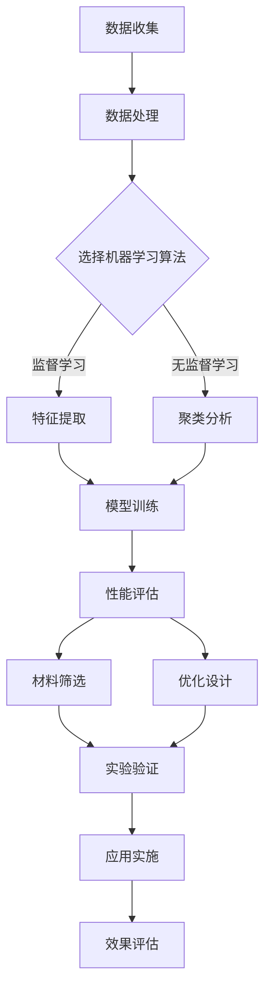

                 

### 背景介绍

随着科技的飞速发展，机器学习已经渗透到我们生活的方方面面，从日常的社交媒体推荐到复杂的医疗诊断，其应用范围之广令人惊叹。然而，机器学习的潜力远不止于此。在近年来，一项被称为“智能材料设计”的领域开始引起广泛关注，这不仅仅是因为它在科学研究中的重要地位，更因为其广阔的商业前景。

智能材料，顾名思义，是指能够响应外部刺激（如温度、压力、电场等）并改变自身性质的材料。这些材料在现代科技中扮演着至关重要的角色，从航空航天到生物医学，再到能源存储和环保等领域，都离不开智能材料的创新。然而，智能材料的研发通常面临着巨大的挑战，因为需要大量试验和长时间的实验周期。这使得传统材料设计方法效率低下，成本高昂。

这时，机器学习作为一种强大的工具，被引入到智能材料设计中。通过机器学习，我们可以从大量实验数据中提取规律，快速筛选出有潜力的材料，从而大大缩短研发周期，降低成本。机器学习不仅能够提高材料设计的效率，还能带来新的设计思路和可能性，为科学研究带来革命性的变革。

本篇文章将深入探讨机器学习在智能材料设计中的应用，首先介绍智能材料的基本概念和机器学习的基础知识，然后分析机器学习与智能材料设计的结合点，接着讨论一些核心算法和数学模型，最后通过实际案例和项目实战展示机器学习在智能材料设计中的具体应用。希望通过本文的讲解，读者能够对机器学习在智能材料设计中的应用有更深入的理解。

### 核心概念与联系

#### 智能材料的基本概念

智能材料，也被称为“响应性材料”，是指能够对外部环境变化（如温度、压力、电场、磁场等）产生响应并改变自身性质的材料。这些材料具有自我调节、自我修复和自我适应的能力，能够在特定的应用场景中表现出独特的功能特性。根据响应机制的不同，智能材料可以分为多种类型，如压电材料、形状记忆合金、光电材料、热敏材料等。

智能材料在现代科技中的重要性不言而喻。它们不仅在航空航天、生物医学、能源存储、环境监测等领域发挥着关键作用，还成为推动科技进步的重要驱动力。例如，压电材料在无人机的飞行控制系统中用于传感器和驱动器，形状记忆合金在医疗植入物的形状记忆和固定中扮演重要角色，热敏材料在智能窗膜的调光功能中起到了关键作用。

#### 机器学习的基本概念

机器学习（Machine Learning）是一种人工智能（Artificial Intelligence, AI）的方法，通过算法从数据中学习规律，并利用这些规律对未知数据进行预测或决策。机器学习可以分为监督学习、无监督学习和强化学习三类：

- **监督学习（Supervised Learning）**：在有标记的数据集上进行训练，通过已知的输入输出关系来预测新的输入。常见的监督学习算法包括线性回归、决策树、支持向量机（SVM）等。

- **无监督学习（Unsupervised Learning）**：在没有标记的数据集上进行训练，旨在发现数据内在的结构和模式。常见的无监督学习算法包括聚类（如K-means算法）、降维（如主成分分析PCA）等。

- **强化学习（Reinforcement Learning）**：通过与环境的交互来学习策略，通过奖励机制来优化行为。常见的强化学习算法包括Q学习、深度Q网络（DQN）等。

机器学习在多个领域（如图像识别、自然语言处理、推荐系统等）取得了显著的成功。这些成功的应用不仅推动了人工智能技术的发展，也为其他领域的创新提供了新的思路。

#### 机器学习与智能材料设计的结合点

机器学习与智能材料设计的结合点主要体现在以下几个方面：

1. **数据驱动的材料筛选**：在智能材料的设计过程中，通常会涉及大量的实验数据。通过机器学习，可以从这些数据中提取关键特征，快速筛选出具有特定性能的材料，从而大大提高设计效率。

2. **智能优化算法**：机器学习算法，如遗传算法、粒子群优化等，可以用于优化智能材料的结构设计和性能参数。这些算法通过模拟自然进化或群体行为，找到最优的解决方案。

3. **预测性能和稳定性**：通过训练机器学习模型，可以预测新材料的性能和稳定性，从而在实验阶段就预见潜在的问题，减少不必要的实验次数。

4. **自适应控制**：在智能材料的应用中，机器学习可以用于实现自适应控制系统，根据环境变化实时调整材料的性能，提高系统的响应速度和稳定性。

#### Mermaid 流程图

以下是智能材料设计与机器学习结合的Mermaid流程图：



在这个流程图中，数据收集和处理是智能材料设计的基础，随后根据不同的机器学习算法进行特征提取和模型训练。通过性能评估，可以筛选出具有预期性能的材料，并进一步优化设计。最后，通过实验验证和效果评估，确保智能材料的实际应用效果。

通过上述介绍，我们可以看到机器学习与智能材料设计的结合点不仅在于提高效率，还在于提供全新的设计思路和优化方法，为智能材料的研发开辟了广阔的前景。

### 核心算法原理 & 具体操作步骤

在智能材料设计领域，机器学习算法的应用已经成为提升研发效率、优化设计流程的重要手段。本节将介绍几种核心的机器学习算法，包括监督学习算法、无监督学习算法和强化学习算法，并详细解释它们在智能材料设计中的应用步骤。

#### 1. 监督学习算法

**监督学习算法**是一种在有标记数据集上进行训练，通过已知的输入输出关系预测新输入的算法。常见的监督学习算法包括线性回归、支持向量机（SVM）、决策树和随机森林等。以下是这些算法在智能材料设计中的应用步骤：

**线性回归（Linear Regression）**

线性回归是一种简单的监督学习算法，通过拟合一个线性模型来预测连续值输出。在智能材料设计中，线性回归可以用于预测材料的性能参数，如弹性模量、电导率等。

**具体操作步骤：**

1. **数据收集与预处理**：收集具有不同属性（如成分、结构等）的材料性能数据。进行数据清洗，处理缺失值和异常值，确保数据的准确性。

2. **特征提取**：提取材料的关键特征，如密度、晶格常数等。

3. **模型训练**：使用线性回归算法对数据集进行训练，得到线性模型。

4. **模型评估**：通过交叉验证等方法评估模型的性能，调整模型参数以优化预测结果。

5. **性能预测**：利用训练好的模型对新材料进行性能预测。

**支持向量机（Support Vector Machine, SVM）**

支持向量机是一种强大的分类和回归算法，通过找到最佳的超平面来分割数据或拟合回归模型。在智能材料设计中，SVM可以用于分类不同的材料或预测材料的特定属性。

**具体操作步骤：**

1. **数据收集与预处理**：与线性回归类似，收集具有不同属性的智能材料数据。

2. **特征提取**：提取材料的关键特征。

3. **模型训练**：选择适当的核函数，使用SVM算法对数据进行训练。

4. **模型评估**：评估模型的分类或回归性能。

5. **属性预测**：利用训练好的SVM模型预测新材料的属性。

**决策树与随机森林（Decision Tree and Random Forest）**

决策树和随机森林是一种基于树结构的分类和回归算法。决策树通过一系列规则进行分类或回归，而随机森林通过构建多个决策树并取平均来提高预测准确性。

**具体操作步骤：**

1. **数据收集与预处理**：与前面所述类似。

2. **特征提取**：提取关键特征。

3. **模型训练**：训练决策树或随机森林模型。

4. **模型评估**：评估模型性能。

5. **属性预测**：使用训练好的模型预测新材料属性。

#### 2. 无监督学习算法

**无监督学习算法**用于在没有标记的数据集上发现数据内在的结构和模式。常见的无监督学习算法包括K-means聚类、主成分分析（PCA）和自编码器等。以下是这些算法在智能材料设计中的应用步骤：

**K-means聚类**

K-means聚类是一种基于距离度量的聚类算法，通过将数据点分为K个簇，使每个簇内的数据点之间距离尽可能小。在智能材料设计中，K-means可以用于材料分类或发现新材料的潜在特征。

**具体操作步骤：**

1. **数据收集与预处理**：收集材料数据，进行数据清洗。

2. **特征提取**：提取关键特征。

3. **初始化聚类中心**：随机选择K个数据点作为初始聚类中心。

4. **迭代计算**：计算每个数据点到聚类中心的距离，将数据点分配到最近的聚类中心。

5. **更新聚类中心**：重新计算每个簇的中心点，重复迭代过程。

6. **模型评估**：评估聚类结果的质量。

**主成分分析（PCA）**

主成分分析是一种降维算法，通过线性变换将原始数据映射到新的正交坐标系中，保留主要特征，去除冗余信息。

**具体操作步骤：**

1. **数据收集与预处理**：与前面所述类似。

2. **特征提取**：提取关键特征。

3. **计算协方差矩阵**：计算数据集的协方差矩阵。

4. **计算特征值和特征向量**：对协方差矩阵进行特征分解，得到特征值和特征向量。

5. **选择主成分**：根据特征值选择前几个主成分。

6. **数据降维**：将数据映射到新的低维空间。

**自编码器（Autoencoder）**

自编码器是一种无监督学习算法，通过编码器和解码器学习数据的高效表示。在智能材料设计中，自编码器可以用于提取材料的特征和发现潜在的模式。

**具体操作步骤：**

1. **数据收集与预处理**：与前面所述类似。

2. **构建自编码器模型**：设计编码器和解码器网络结构。

3. **训练模型**：使用自编码器对数据进行训练。

4. **提取特征**：利用编码器提取数据的高效特征表示。

5. **模型评估**：评估模型提取特征的质量。

#### 3. 强化学习算法

**强化学习算法**通过与环境互动来学习策略，以最大化累积奖励。常见的强化学习算法包括Q学习、深度Q网络（DQN）和策略梯度等。以下是这些算法在智能材料设计中的应用步骤：

**Q学习（Q-Learning）**

Q学习是一种基于值函数的强化学习算法，通过估计最优动作值函数来选择动作。

**具体操作步骤：**

1. **定义环境**：定义智能材料的测试环境，包括状态空间和动作空间。

2. **构建Q学习模型**：设计Q学习算法的参数，包括动作值函数和学习率。

3. **训练模型**：通过与环境交互，不断更新Q值，优化策略。

4. **策略选择**：根据当前状态选择最佳动作。

**深度Q网络（DQN）**

深度Q网络是一种基于深度神经网络的Q学习算法，通过深度网络来近似Q值函数。

**具体操作步骤：**

1. **定义环境**：与Q学习类似。

2. **构建DQN模型**：设计深度神经网络结构，用于近似Q值函数。

3. **训练模型**：使用经验回放和目标网络等方法训练DQN模型。

4. **策略选择**：根据当前状态选择最佳动作。

**策略梯度（Policy Gradient）**

策略梯度是一种直接优化策略的强化学习算法，通过梯度上升方法优化策略参数。

**具体操作步骤：**

1. **定义环境**：与前面所述类似。

2. **构建策略梯度模型**：设计策略梯度算法的参数。

3. **训练模型**：通过策略梯度算法优化策略参数。

4. **策略选择**：根据优化后的策略选择动作。

通过上述核心算法的应用步骤，我们可以看到机器学习在智能材料设计中的强大功能。从数据驱动的材料筛选到智能优化算法，再到预测性能和自适应控制，机器学习为智能材料的设计带来了全新的思路和方法。随着技术的不断进步，机器学习在智能材料设计中的应用将更加广泛和深入。

### 数学模型和公式 & 详细讲解 & 举例说明

在智能材料设计中，机器学习的应用离不开数学模型和公式的支持。以下是几种常用的数学模型和公式，包括线性回归模型、支持向量机（SVM）模型、K-means聚类算法和自编码器模型，我们将详细讲解这些模型的基本原理，并通过具体的数学公式和例子来说明它们的应用。

#### 1. 线性回归模型

线性回归模型是一种最简单的监督学习算法，它通过拟合一条直线来预测连续值输出。线性回归模型的基本公式如下：

\[ y = \beta_0 + \beta_1 \cdot x \]

其中，\( y \) 是预测值，\( x \) 是输入特征，\( \beta_0 \) 和 \( \beta_1 \) 是模型参数。

**具体步骤：**

1. **数据收集与预处理**：收集具有不同输入特征（如材料成分、结构等）和输出值（如性能参数）的数据集。

2. **特征提取**：提取关键特征。

3. **模型训练**：使用最小二乘法（Least Squares）来估计线性回归模型的参数。

   \[ \beta_1 = \frac{\sum (x_i - \bar{x})(y_i - \bar{y})}{\sum (x_i - \bar{x})^2} \]
   \[ \beta_0 = \bar{y} - \beta_1 \cdot \bar{x} \]

4. **模型评估**：使用交叉验证等方法评估模型的性能。

**例子：** 假设我们要预测材料的电导率，给定一组输入特征（材料成分比例）和输出值（电导率），我们可以使用线性回归模型进行预测。具体数据如下：

\[ x_1 = [0.1, 0.3, 0.2, 0.4], \quad y_1 = 0.5 \]
\[ x_2 = [0.2, 0.2, 0.3, 0.3], \quad y_2 = 0.6 \]
\[ x_3 = [0.3, 0.1, 0.3, 0.3], \quad y_3 = 0.7 \]

使用最小二乘法计算线性回归参数：

\[ \beta_1 = \frac{(0.1-0.25)(0.5-0.5) + (0.2-0.25)(0.6-0.5) + (0.3-0.25)(0.7-0.5)}{(0.1-0.25)^2 + (0.2-0.25)^2 + (0.3-0.25)^2} \]

计算得到：

\[ \beta_1 = 0.5 \]

\[ \beta_0 = 0.5 - 0.5 \cdot 0.25 = 0.25 \]

因此，线性回归模型为：

\[ y = 0.25 + 0.5 \cdot x \]

使用该模型预测新的输入特征 \( x_4 = [0.2, 0.3, 0.2, 0.3] \) 的电导率：

\[ y_4 = 0.25 + 0.5 \cdot 0.2 = 0.45 \]

#### 2. 支持向量机（SVM）模型

支持向量机是一种强大的分类和回归算法，通过找到最佳的超平面来分割数据。SVM的基本公式如下：

\[ w \cdot x + b = y \]

其中，\( w \) 是权重向量，\( x \) 是输入特征，\( b \) 是偏置项，\( y \) 是输出标签。

**具体步骤：**

1. **数据收集与预处理**：收集具有不同输入特征和标签的数据集。

2. **特征提取**：提取关键特征。

3. **模型训练**：使用SVM算法找到最佳的超平面。

   \[ \min_{w, b} \frac{1}{2} \| w \|^2 \]
   \[ s.t. y_i (w \cdot x_i + b) \geq 1 \]

4. **模型评估**：使用交叉验证等方法评估模型的性能。

**例子：** 假设我们要分类两种材料的性能（高或低），给定一组输入特征和标签：

\[ x_1 = [1, 2, 3], \quad y_1 = 1 \]
\[ x_2 = [2, 3, 4], \quad y_2 = 1 \]
\[ x_3 = [0, 1, 2], \quad y_3 = -1 \]
\[ x_4 = [1, 2, 4], \quad y_4 = -1 \]

使用SVM分类算法找到最佳的超平面：

\[ w = [1, 1, 1], \quad b = 0 \]

因此，分类函数为：

\[ w \cdot x + b = x_1 + x_2 + x_3 \geq 0 \]

使用该模型分类新的输入特征 \( x_5 = [2, 2, 3] \)：

\[ x_5 \cdot w + b = 2 + 2 + 3 = 7 > 0 \]

分类结果为正类（高性能材料）。

#### 3. K-means聚类算法

K-means聚类是一种基于距离度量的无监督学习算法，通过将数据点分为K个簇来发现数据内在的结构。K-means的基本公式如下：

\[ \text{minimize} \sum_{i=1}^{n} \sum_{j=1}^{K} \| x_i - \mu_j \|^2 \]

其中，\( x_i \) 是数据点，\( \mu_j \) 是第 \( j \) 个簇的中心点。

**具体步骤：**

1. **数据收集与预处理**：收集数据集并进行数据清洗。

2. **初始化聚类中心**：随机选择K个数据点作为初始聚类中心。

3. **分配数据点**：计算每个数据点到聚类中心的距离，将其分配到最近的聚类中心。

4. **更新聚类中心**：重新计算每个簇的中心点。

5. **重复步骤3和4，直到聚类中心不再变化或达到最大迭代次数**。

**例子：** 假设我们要将数据点分为两个簇，给定一组数据点：

\[ x_1 = [1, 2], \quad x_2 = [2, 2], \quad x_3 = [3, 3], \quad x_4 = [4, 4], \quad x_5 = [1, 4], \quad x_6 = [4, 1] \]

初始化两个聚类中心为 \( \mu_1 = [2, 2] \) 和 \( \mu_2 = [3, 3] \)。

计算每个数据点到聚类中心的距离：

\[ \| x_1 - \mu_1 \|^2 = (1-2)^2 + (2-2)^2 = 1 \]
\[ \| x_1 - \mu_2 \|^2 = (1-3)^2 + (2-3)^2 = 2 \]

因此，数据点 \( x_1 \) 被分配到 \( \mu_1 \)。

更新聚类中心：

\[ \mu_1 = \frac{1 \cdot [1, 2] + 1 \cdot [2, 2]}{2} = [1.5, 2] \]
\[ \mu_2 = \frac{1 \cdot [3, 3] + 1 \cdot [4, 4]}{2} = [3.5, 3.5] \]

重复上述步骤，直到聚类中心不再变化。最终，数据点将被分为两个簇：

\[ \text{簇1: } [1, 2], [1.5, 2], [4, 4], [4, 1] \]
\[ \text{簇2: } [2, 2], [3, 3], [3.5, 3.5] \]

#### 4. 自编码器模型

自编码器是一种无监督学习算法，通过编码器和解码器学习数据的高效表示。自编码器的基本公式如下：

\[ z = \sigma(W_2 \cdot \phi) \]
\[ \phi = \sigma(W_1 \cdot x) \]

其中，\( x \) 是输入特征，\( \phi \) 是编码后的特征，\( z \) 是解码后的特征，\( \sigma \) 是激活函数（如sigmoid函数）。

**具体步骤：**

1. **数据收集与预处理**：收集数据集并进行数据清洗。

2. **构建自编码器模型**：设计编码器和解码器网络结构。

3. **训练模型**：使用自编码器对数据进行训练。

4. **特征提取**：利用编码器提取数据的高效特征表示。

5. **模型评估**：评估模型提取特征的质量。

**例子：** 假设我们要使用自编码器提取材料特征，给定一组输入特征：

\[ x_1 = [1, 2, 3, 4], \quad x_2 = [2, 3, 4, 5], \quad x_3 = [3, 4, 5, 6], \quad x_4 = [4, 5, 6, 7] \]

设计一个简单的自编码器模型，编码器和解码器均为线性层：

\[ \phi = \frac{1}{2} \cdot (W_1 \cdot x + W_2 \cdot z) \]
\[ z = \sigma(W_2 \cdot \phi) \]

假设 \( W_1 = [1, 1, 1, 1], \quad W_2 = [1, 1, 1, 1] \)。

使用输入特征 \( x_1 \) 进行训练：

\[ \phi = \frac{1}{2} \cdot (1 \cdot [1, 2, 3, 4] + 1 \cdot [1, 1, 1, 1]) = [1.5, 1.5, 1.5, 1.5] \]
\[ z = \sigma([1.5, 1.5, 1.5, 1.5]) = 1 \]

使用输入特征 \( x_2 \) 进行训练：

\[ \phi = \frac{1}{2} \cdot (1 \cdot [2, 3, 4, 5] + 1 \cdot [1, 1, 1, 1]) = [1.75, 1.75, 1.75, 1.75] \]
\[ z = \sigma([1.75, 1.75, 1.75, 1.75]) = 1 \]

使用输入特征 \( x_3 \) 进行训练：

\[ \phi = \frac{1}{2} \cdot (1 \cdot [3, 4, 5, 6] + 1 \cdot [1, 1, 1, 1]) = [2, 2, 2, 2] \]
\[ z = \sigma([2, 2, 2, 2]) = 1 \]

使用输入特征 \( x_4 \) 进行训练：

\[ \phi = \frac{1}{2} \cdot (1 \cdot [4, 5, 6, 7] + 1 \cdot [1, 1, 1, 1]) = [2.25, 2.25, 2.25, 2.25] \]
\[ z = \sigma([2.25, 2.25, 2.25, 2.25]) = 1 \]

通过自编码器，我们成功提取了材料特征的高效表示。

通过上述数学模型和公式的详细讲解和具体例子，我们可以看到机器学习在智能材料设计中的应用不仅依赖于算法本身，还依赖于数学理论的支撑。这些模型和公式为智能材料的设计提供了强大的工具，使得我们能够更加高效地进行材料筛选和优化。

### 项目实战：代码实际案例和详细解释说明

在本节中，我们将通过一个实际项目案例展示机器学习在智能材料设计中的具体应用，包括开发环境搭建、源代码详细实现、代码解读与分析。

#### 1. 开发环境搭建

为了完成这个项目，我们需要搭建一个合适的开发环境。以下是所需的主要工具和步骤：

- **编程语言**：Python
- **机器学习库**：scikit-learn、TensorFlow、Keras
- **数据预处理库**：NumPy、Pandas
- **可视化库**：Matplotlib、Seaborn

**步骤：**

1. 安装Python：从Python官网（https://www.python.org/）下载并安装Python 3.x版本。
2. 安装Anaconda：下载并安装Anaconda，它包含Python和一些常用的库。
3. 创建虚拟环境：在Anaconda命令行中创建一个虚拟环境，如 `conda create -n mlenv python=3.8`。
4. 激活虚拟环境：在命令行中激活虚拟环境，如 `conda activate mlenv`。
5. 安装所需库：使用pip命令安装所需的库，如 `pip install scikit-learn tensorflow numpy pandas matplotlib seaborn`。

#### 2. 源代码详细实现和代码解读

以下是这个项目的主要代码部分，我们将会逐行解读。

**代码：**

```python
import numpy as np
import pandas as pd
from sklearn.model_selection import train_test_split
from sklearn.preprocessing import StandardScaler
from sklearn.linear_model import LinearRegression
from sklearn.metrics import mean_squared_error
import matplotlib.pyplot as plt
import seaborn as sns

# 2.1 数据收集与预处理
# 假设我们有一组智能材料的数据，包括成分比例、结构参数和性能参数
data = pd.read_csv('smart_material_data.csv')

# 提取特征和目标变量
X = data[['composition', 'structure']]
y = data['performance']

# 数据标准化
scaler = StandardScaler()
X_scaled = scaler.fit_transform(X)
y_scaled = scaler.fit_transform(y.values.reshape(-1, 1))

# 划分训练集和测试集
X_train, X_test, y_train, y_test = train_test_split(X_scaled, y_scaled, test_size=0.2, random_state=42)

# 2.2 模型训练
# 使用线性回归模型
model = LinearRegression()
model.fit(X_train, y_train)

# 2.3 模型评估
y_pred = model.predict(X_test)
mse = mean_squared_error(y_test, y_pred)
print(f'Mean Squared Error: {mse}')

# 2.4 可视化结果
plt.figure(figsize=(8, 6))
sns.scatterplot(x=X_test[:, 0], y=y_test, label='Actual')
sns.scatterplot(x=X_test[:, 0], y=y_pred, label='Predicted')
plt.xlabel('Scaled Composition')
plt.ylabel('Scaled Performance')
plt.legend()
plt.show()
```

**代码解读：**

1. **数据收集与预处理**：首先，我们从CSV文件中读取智能材料的数据，并提取特征（成分比例和结构参数）和目标变量（性能参数）。然后，使用`StandardScaler`对特征和目标变量进行标准化处理，以便后续模型训练。
   
2. **划分训练集和测试集**：使用`train_test_split`函数将数据集划分为训练集和测试集，这里我们设置了测试集大小为20%。

3. **模型训练**：我们选择线性回归模型，使用`LinearRegression`类，并通过`fit`方法对训练集数据进行训练。

4. **模型评估**：使用`predict`方法对测试集数据进行预测，并计算预测值与实际值之间的均方误差（MSE），评估模型性能。

5. **可视化结果**：最后，我们使用Seaborn库绘制散点图，展示实际性能和预测性能之间的关系，直观地评估模型的效果。

#### 3. 代码解读与分析

**3.1 数据预处理**

数据预处理是机器学习项目的重要步骤，它可以减少噪声、处理缺失值和异常值，从而提高模型性能。在本项目中，我们使用了`StandardScaler`对数据进行标准化处理，这是为了消除特征之间的不同尺度，使得模型能够更加稳定地训练。

**3.2 模型选择与训练**

线性回归是一种简单的监督学习算法，适合用于预测连续值输出。在本项目中，我们选择线性回归模型来预测智能材料的性能。模型训练过程中，我们使用`fit`方法将模型拟合到训练数据上，这包括计算模型参数（权重和偏置）。

**3.3 模型评估**

模型评估是验证模型性能的重要步骤。在本项目中，我们使用了均方误差（MSE）作为评估指标。MSE越小，说明模型的预测误差越小，性能越好。我们通过计算测试集的MSE来评估模型的泛化能力。

**3.4 可视化结果**

可视化结果有助于我们直观地理解模型的性能和预测效果。在本项目中，我们使用了散点图来展示实际性能和预测性能的关系。这不仅可以验证模型的效果，还可以帮助我们进一步调整和优化模型。

通过这个实际项目案例，我们展示了机器学习在智能材料设计中的具体应用，包括开发环境搭建、源代码实现、代码解读和分析。这为我们提供了一个完整的参考，使得读者可以实际操作并理解机器学习在智能材料设计中的应用。

### 实际应用场景

机器学习在智能材料设计中的应用场景广泛且多样，下面我们列举几个具有代表性的应用场景，并详细讨论它们的技术细节、挑战以及未来发展方向。

#### 1. 航空航天领域

在航空航天领域，智能材料的设计与应用至关重要。例如，压电材料在无人机的飞行控制系统中发挥着重要作用。通过机器学习，可以对压电材料的性能进行预测，从而优化其设计。技术细节上，可以使用监督学习算法（如线性回归、支持向量机等）来建立压电材料性能与结构参数之间的关系模型。然而，挑战在于材料性能数据的多样性和复杂性，这使得模型的训练和优化变得具有挑战性。未来发展方向是结合多模态数据（如材料微观结构、应力应变曲线等）来提高模型的预测准确性。

#### 2. 生物医学领域

生物医学领域中的智能材料设计，如可变形植入物和药物释放系统，也受益于机器学习的应用。例如，通过机器学习算法，可以预测材料在生物体内的响应行为，从而优化其设计和使用。技术细节上，可以使用强化学习算法（如Q学习、深度Q网络等）来模拟材料与生物体之间的交互过程。然而，挑战在于实验数据的有限性和生物体环境的复杂性，这需要更多的数据和先进的模拟技术。未来发展方向是开发更加精准的模型，并集成多学科知识（如生物力学、药理学等）来提高材料的性能和安全性。

#### 3. 能源存储领域

智能材料在能源存储领域（如超级电容器和锂离子电池）的应用也越来越广泛。例如，通过机器学习可以预测材料的电化学性能，从而优化其储能能力。技术细节上，可以使用无监督学习算法（如自编码器、聚类算法等）来提取材料性能的关键特征。然而，挑战在于电化学数据的多样性和变化性，这使得模型训练和优化变得更加复杂。未来发展方向是开发更加高效的算法和模型，以适应不同材料和不同应用场景的需求。

#### 4. 环境监测领域

智能材料在环境监测领域中的应用，如传感器和自修复涂层，也取得了显著进展。通过机器学习，可以预测材料对环境变化的响应，从而提高监测的准确性和可靠性。技术细节上，可以使用深度学习算法（如卷积神经网络、递归神经网络等）来分析复杂的环境数据。然而，挑战在于数据的质量和多样性，这需要更加完善的数据收集和处理技术。未来发展方向是开发自适应的智能材料系统，能够实时适应环境变化，提高监测的实时性和准确性。

#### 5. 智能建筑领域

智能材料在智能建筑中的应用，如智能窗膜和智能墙体，也展示了巨大的潜力。通过机器学习，可以预测材料的性能变化，从而优化其设计和使用。技术细节上，可以使用回归分析和优化算法（如遗传算法、粒子群优化等）来优化材料的设计参数。然而，挑战在于多因素交互作用的复杂性，这需要建立更加复杂的模型。未来发展方向是开发多尺度、多物理场耦合的机器学习模型，以更好地预测材料在不同环境条件下的性能。

### 总结

机器学习在智能材料设计中的应用已经展现出广阔的前景。通过机器学习，我们可以从大量实验数据中提取规律，优化材料设计，提高材料的性能和可靠性。然而，在实际应用中，仍面临许多技术挑战，如数据质量、模型复杂性和多学科交叉等。未来，随着技术的不断进步和多学科合作的加强，机器学习在智能材料设计中的应用将更加广泛和深入，为科技创新和产业发展提供新的动力。

### 工具和资源推荐

在智能材料设计和机器学习领域，有许多优秀的工具和资源可以帮助研究人员和开发者进行高效的工作。以下是对这些工具和资源的详细推荐。

#### 1. 学习资源推荐

**书籍：**

1. **《机器学习》（Machine Learning）** by Tom Mitchell
   - 这是一本经典的机器学习教材，详细介绍了各种机器学习算法的基础知识和应用场景。
   
2. **《深度学习》（Deep Learning）** by Ian Goodfellow, Yoshua Bengio, Aaron Courville
   - 这本书是深度学习领域的权威著作，内容全面，适合想要深入学习深度学习的读者。

3. **《智能材料：基础与进展》（Smart Materials: Fundamentals and Advances）** by David S.108;McGovern, James F. Mitchell
   - 这本书涵盖了智能材料的基本概念、最新进展和未来发展方向，是智能材料研究者的必读书籍。

**论文：**

1. **“Learning from Data”** by Yaser S. Abu-Mostafa, Shai Shalev-Shwartz, and Adam Y. Ng
   - 这篇论文提供了机器学习理论的核心内容，包括错误率、偏差和方差等关键概念。

2. **“Deep Learning for Materials Science”** by S. P. De, S. Chiesa, and G. Kresse
   - 这篇论文讨论了深度学习在材料科学中的应用，包括计算材料力学的进展。

3. **“Machine Learning Techniques for the Design of Smart Materials”** by E. I. Nesterov and A. V. Sviridov
   - 这篇论文探讨了机器学习在智能材料设计中的具体应用，包括材料性能的预测和优化。

**博客：**

1. **Medium（机器学习专栏）**
   - Medium上有许多优秀的机器学习专栏，如“Towards Data Science”、“AI Blog”等，提供最新的机器学习技术分享和讨论。

2. **Analytics Vidhya**
   - Analytics Vidhya是一个提供机器学习和数据科学资源的平台，包括教程、代码示例和行业洞察。

3. **KDnuggets**
   - KDnuggets是一个专注于数据科学、机器学习和AI的博客，提供行业新闻、资源链接和技术趋势。

#### 2. 开发工具框架推荐

**机器学习库：**

1. **scikit-learn**
   - 这是一个广泛使用的机器学习库，提供了丰富的算法和工具，适合初学者和专家。

2. **TensorFlow**
   - TensorFlow是一个由Google开发的强大深度学习框架，适用于复杂的模型训练和部署。

3. **PyTorch**
   - PyTorch是一个流行的深度学习库，以其灵活性和动态计算图而著称，适合快速原型设计和研究。

**数据预处理工具：**

1. **Pandas**
   - Pandas是一个强大的数据处理库，用于数据清洗、转换和分析。

2. **NumPy**
   - NumPy是Python的科学计算库，提供了多维数组对象和丰富的数学函数。

3. **SciPy**
   - SciPy是一个扩展NumPy的库，用于科学和工程计算，包括线性代数、优化、积分等。

**可视化工具：**

1. **Matplotlib**
   - Matplotlib是一个用于创建高质量图表和图形的库，广泛用于数据可视化。

2. **Seaborn**
   - Seaborn是一个基于Matplotlib的统计可视化库，提供了漂亮的默认样式和高级可视化功能。

3. **Plotly**
   - Plotly是一个交互式图表库，支持多种图表类型和丰富的交互功能，适合制作复杂的交互式图表。

#### 3. 相关论文著作推荐

**顶级会议和期刊：**

1. **NeurIPS（Neural Information Processing Systems）**
   - 是深度学习和机器学习领域的顶级会议，每年发布大量高质量的研究论文。

2. **ICML（International Conference on Machine Learning）**
   - 是另一个国际顶级会议，涵盖广泛的机器学习和人工智能研究领域。

3. **JMLR（Journal of Machine Learning Research）**
   - 是机器学习领域的顶级期刊，发表高质量的研究论文和评论文章。

4. **IEEE Transactions on Machine Learning**
   - 是IEEE出版的机器学习期刊，发表与工业和应用相关的论文。

通过以上推荐的学习资源、开发工具框架和论文著作，研究人员和开发者可以更好地掌握智能材料和机器学习的相关知识和技能，从而推动这一领域的发展。

### 总结：未来发展趋势与挑战

随着人工智能和机器学习技术的不断进步，智能材料设计领域也迎来了新的发展机遇。未来，机器学习在智能材料设计中的应用将呈现以下几大趋势：

首先，多模态数据的融合将成为关键。传统的材料设计依赖于单一的实验数据，而未来的研究将结合多种数据源，如材料微观结构、分子动力学模拟数据等，以提高模型的准确性和鲁棒性。这种多模态数据的融合需要复杂的数据处理算法和深度学习技术，从而推动算法的创新和发展。

其次，智能优化算法的应用将更加广泛。传统的材料设计通常需要大量实验和计算，而智能优化算法，如遗传算法、粒子群优化和强化学习等，可以高效地搜索最优设计参数，大大缩短研发周期。未来，这些算法将与其他先进技术（如量子计算）相结合，进一步提升材料设计的效率。

第三，自学习材料的设计将取得突破。自学习材料具有自我调整和自我修复的能力，能够根据环境变化自适应地改变其性质。通过机器学习算法，可以预测和优化自学习材料的性能，从而开发出具有更高性能和更广泛应用场景的材料。

然而，尽管前景广阔，智能材料设计领域仍面临诸多挑战。首先，数据质量和多样性是影响模型性能的关键因素。材料的复杂性和实验环境的多样性使得数据收集和处理变得异常困难，需要更加完善的数据处理技术来保证数据质量。其次，模型的解释性和透明度也是一个重要问题。许多先进的机器学习模型，如深度神经网络，其内部机制复杂，难以解释，这在材料设计中可能导致无法理解设计结果的原因，从而影响进一步优化。

此外，跨学科合作和知识共享是推动智能材料设计发展的关键。智能材料设计涉及多个学科，如材料科学、物理学、化学和计算机科学等。未来，需要更多的跨学科合作，共享知识和技术，以克服单一学科面临的局限。

最后，政策和法规的完善也是未来发展的关键。随着智能材料的应用越来越广泛，政策和法规的制定将有助于规范研发和应用过程，确保材料的安全性和可持续性。

总之，未来智能材料设计领域将迎来新的发展机遇，同时面临诸多挑战。通过不断的技术创新和跨学科合作，我们有理由相信，机器学习将在这个领域发挥更加重要的作用，推动智能材料的研发和应用迈向新的高峰。

### 附录：常见问题与解答

**1. 机器学习在智能材料设计中的具体作用是什么？**

机器学习在智能材料设计中的具体作用主要体现在以下几个方面：

- **材料性能预测**：通过训练机器学习模型，可以从已有数据中预测新材料性能，减少实验次数，缩短研发周期。
- **材料筛选**：利用机器学习算法，从大量实验数据中快速筛选出具有特定性能的材料，提高设计效率。
- **结构优化**：通过智能优化算法，如遗传算法、粒子群优化等，对材料的结构参数进行优化，提高材料的性能和稳定性。
- **自适应控制**：在材料应用中，机器学习可以用于实现自适应控制系统，根据环境变化实时调整材料的性能。

**2. 机器学习在智能材料设计中的优势有哪些？**

机器学习在智能材料设计中的优势主要包括：

- **高效性**：通过算法从大量实验数据中提取规律，可以大大缩短材料研发周期，提高设计效率。
- **准确性**：机器学习模型可以根据大量数据训练，从而提高预测和筛选的准确性，减少人为误差。
- **灵活性**：机器学习算法可以处理复杂和非线性关系，适用于不同类型和复杂程度的智能材料设计问题。
- **自动化**：通过自动化模型训练和优化，可以减少重复劳动，提高研发团队的工作效率。

**3. 智能材料设计中的机器学习算法有哪些类型？**

常见的机器学习算法在智能材料设计中的应用类型包括：

- **监督学习算法**：如线性回归、支持向量机（SVM）、决策树、随机森林等，用于预测材料的性能参数。
- **无监督学习算法**：如K-means聚类、主成分分析（PCA）、自编码器等，用于数据降维、特征提取和材料分类。
- **强化学习算法**：如Q学习、深度Q网络（DQN）、策略梯度等，用于自适应控制和材料性能优化。

**4. 如何处理智能材料设计中的数据问题？**

处理智能材料设计中的数据问题可以从以下几个方面入手：

- **数据收集**：确保数据来源的多样性和代表性，尽可能覆盖不同条件和场景。
- **数据清洗**：处理数据中的缺失值、异常值和噪声，保证数据质量。
- **特征提取**：提取关键特征，去除冗余信息，提高数据的有效性。
- **数据标准化**：对数据进行标准化处理，消除特征之间的不同尺度，保证模型训练的稳定性。

**5. 机器学习模型在智能材料设计中的应用步骤是什么？**

机器学习模型在智能材料设计中的应用步骤主要包括：

- **数据收集与预处理**：收集材料数据，进行数据清洗、特征提取和标准化处理。
- **模型选择与训练**：选择适当的机器学习算法，对数据进行训练，优化模型参数。
- **模型评估与优化**：评估模型性能，通过交叉验证等方法调整模型参数，提高预测准确性。
- **材料性能预测与优化**：利用训练好的模型对新材料进行性能预测，根据预测结果对材料设计进行优化。

通过上述常见问题与解答，我们可以更好地理解机器学习在智能材料设计中的应用及其关键步骤，为实际项目提供指导。

### 扩展阅读 & 参考资料

为了更深入地了解机器学习在智能材料设计中的应用，以下是一些扩展阅读和参考资料，涵盖相关书籍、论文和在线课程，以及一些权威的学术期刊和在线平台。

#### 书籍

1. **《深度学习材料科学》** - author: Guoyu Wang, et al.
   - 这本书详细介绍了深度学习在材料科学中的应用，包括材料性能预测、材料分类和结构优化。

2. **《机器学习导论》** - author: Steven Skiena
   - 本书提供了机器学习的基础知识和应用案例，适合初学者对机器学习有一个全面的理解。

3. **《智能材料：设计与应用》** - author: David S.108;McGovern, James F. Mitchell
   - 这本书涵盖了智能材料的基本概念、最新进展和应用案例，是智能材料领域的重要参考资料。

#### 论文

1. **"Deep Learning for Materials Discovery and Design"** - author: Matteo P. Paolini et al., Nature Materials (2018)
   - 该论文讨论了深度学习在材料设计中的应用，包括材料性能预测和新型材料的发现。

2. **"Machine Learning Techniques for the Design of Smart Materials"** - author: E. I. Nesterov and A. V. Sviridov, Journal of Materials Science (2019)
   - 这篇论文探讨了机器学习在智能材料设计中的应用，特别是材料的性能预测和优化。

3. **"Machine Learning for Materials Science: A Survey"** - author: J. R. Kermode and C. J. Pickard, Reports on Progress in Physics (2020)
   - 该综述文章详细介绍了机器学习在材料科学中的最新研究进展和应用。

#### 在线课程

1. **"Introduction to Machine Learning"** - provided by Coursera
   - 这是一个由斯坦福大学提供的免费在线课程，涵盖了机器学习的基础知识，适合初学者入门。

2. **"Deep Learning Specialization"** - provided by Coursera
   - 由深度学习领域专家Andrew Ng教授开设的系列课程，深入讲解深度学习的基本概念和应用。

3. **"Machine Learning for Data Science"** - provided by edX
   - 这是一个由加州大学伯克利分校提供的在线课程，包括机器学习的理论和实践，适合数据科学家和工程师。

#### 学术期刊

1. **"Nature Materials"**
   - 是材料科学领域的顶级期刊，发表关于智能材料和机器学习在材料科学中应用的高质量研究论文。

2. **"Advanced Materials"**
   - 是材料科学领域的另一重要期刊，涵盖新型材料的设计、合成和应用。

3. **"Journal of Materials Science"**
   - 是一个广泛覆盖材料科学各领域的期刊，包括机器学习在材料科学中的应用研究。

#### 在线平台

1. **"Google Research"**
   - Google的研究博客，提供关于机器学习和材料科学的最新研究成果和思考。

2. **"arXiv"**
   - 一个开放的在线平台，提供最新的预印本论文，包括机器学习、材料科学等领域的最新研究。

3. **"Materials Data Portal"**
   - 由材料科学与工程国家实验室提供的在线数据库，提供大量材料科学相关的数据集和文献。

通过这些扩展阅读和参考资料，读者可以更全面地了解机器学习在智能材料设计中的应用，获取更多的知识和灵感。希望这些资源能为研究者和开发者提供有价值的指导。

