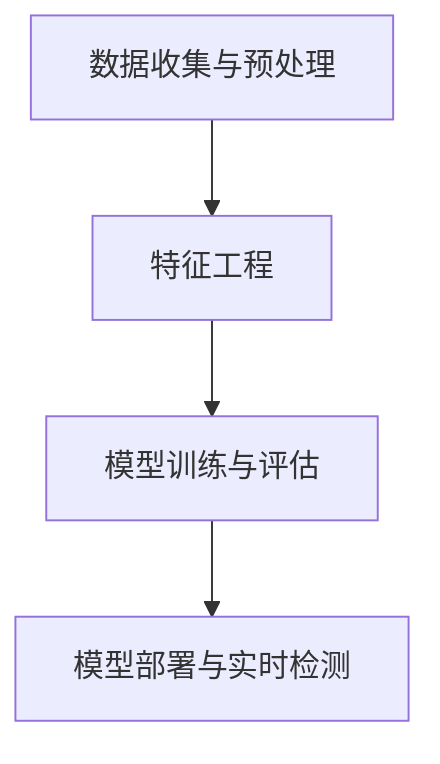

                 

# 机器学习在欺诈检测中的实时应用与优化

## 关键词：欺诈检测、实时应用、机器学习、优化、数据分析、算法

### 摘要

本文主要探讨机器学习在欺诈检测中的实时应用与优化。首先，我们对欺诈检测的背景进行了介绍，阐述了欺诈检测的重要性及其在金融、电子商务等领域的应用场景。接着，我们深入分析了机器学习在欺诈检测中的核心概念和算法原理，并通过具体操作步骤展示了如何应用这些算法进行欺诈检测。此外，本文还详细讲解了欺诈检测中常用的数学模型和公式，并通过实际项目实战案例进行了代码实现和解读。最后，我们探讨了机器学习在欺诈检测中的实际应用场景，并推荐了相关学习资源和开发工具框架，总结了未来发展趋势与挑战，为读者提供了全面的欺诈检测实战指南。

## 1. 背景介绍

### 欺诈检测的重要性

欺诈检测在现代经济活动中具有重要意义。随着互联网和电子商务的快速发展，各种欺诈行为层出不穷，如信用卡欺诈、网络钓鱼、虚假交易等，给企业和个人带来了巨大的经济损失。据统计，全球每年因欺诈行为造成的经济损失高达数千亿美元。因此，有效进行欺诈检测，预防欺诈行为的发生，对于保障金融安全、维护社会稳定具有重要意义。

### 欺诈检测的应用场景

欺诈检测广泛应用于金融、电子商务、保险、电信等多个领域。以下为几个典型的应用场景：

- **金融领域**：信用卡欺诈检测、贷款欺诈检测、保险欺诈检测等。
- **电子商务领域**：虚假交易检测、退款欺诈检测、账号盗用检测等。
- **保险领域**：保险欺诈检测、保险理赔审核等。
- **电信领域**：电信诈骗检测、恶意呼叫检测等。

### 欺诈检测的现状与挑战

尽管欺诈检测技术取得了显著进展，但仍然面临着一系列挑战。一方面，欺诈手段日益翻新，复杂度不断增加，使得传统规则方法难以应对。另一方面，欺诈行为具有一定的隐蔽性，数据质量参差不齐，给机器学习模型训练和部署带来了困难。此外，实时性要求高，欺诈检测系统需要在短时间内快速处理大量数据，确保检测结果的准确性。

## 2. 核心概念与联系

### 机器学习基础概念

- **监督学习**：通过已标记的数据集训练模型，然后使用模型对新数据进行预测。
- **无监督学习**：不使用已标记的数据集，通过探索数据内在结构来发现规律。
- **强化学习**：通过与环境交互，不断调整策略，以最大化预期收益。

### 欺诈检测算法分类

- **基于规则的方法**：根据预设的规则进行欺诈检测，如模式识别、规则匹配等。
- **基于统计的方法**：利用统计模型，如逻辑回归、决策树等，分析数据特征，进行欺诈检测。
- **基于机器学习的方法**：利用机器学习算法，如支持向量机、神经网络等，自动学习数据特征，进行欺诈检测。

### 机器学习在欺诈检测中的应用流程

1. **数据收集与预处理**：收集相关数据，如交易记录、用户信息等，进行数据清洗、归一化等预处理操作。
2. **特征工程**：提取有助于欺诈检测的特征，如交易金额、时间、频率等。
3. **模型训练与评估**：使用已标记的数据集训练模型，通过交叉验证等方法评估模型性能。
4. **模型部署与实时检测**：将训练好的模型部署到生产环境中，实时对交易数据进行欺诈检测。

### Mermaid 流程图



## 3. 核心算法原理 & 具体操作步骤

### 支持向量机（SVM）

#### 算法原理

支持向量机是一种二分类模型，其目标是找到一个最优的超平面，将不同类别的数据分开，同时使得分类间隔最大。在欺诈检测中，SVM可以用来判断交易数据是否为欺诈行为。

#### 具体操作步骤

1. **数据预处理**：对交易数据进行归一化处理，将数据缩放到相同的范围。
2. **特征选择**：选择有助于区分欺诈行为和正常行为的特征，如交易金额、时间、频率等。
3. **训练模型**：使用已标记的数据集训练SVM模型。
4. **模型评估**：使用交叉验证方法评估模型性能，调整参数以优化模型。
5. **实时检测**：将训练好的模型部署到生产环境中，对实时交易数据进行分类。

### 神经网络

#### 算法原理

神经网络是一种模拟人脑神经元结构的计算模型，能够通过学习数据特征进行复杂模式识别。在欺诈检测中，神经网络可以自动学习交易数据中的潜在特征，实现对欺诈行为的识别。

#### 具体操作步骤

1. **数据预处理**：对交易数据进行归一化处理。
2. **特征工程**：提取有助于欺诈检测的特征。
3. **构建模型**：选择合适的神经网络结构，如卷积神经网络（CNN）、循环神经网络（RNN）等。
4. **训练模型**：使用已标记的数据集训练神经网络模型。
5. **模型评估**：使用交叉验证方法评估模型性能。
6. **实时检测**：将训练好的模型部署到生产环境中，对实时交易数据进行分类。

### 决策树

#### 算法原理

决策树是一种基于树结构的分类算法，通过一系列条件判断来对数据进行分类。在欺诈检测中，决策树可以用于根据交易数据特征判断交易是否为欺诈行为。

#### 具体操作步骤

1. **数据预处理**：对交易数据进行归一化处理。
2. **特征选择**：选择有助于区分欺诈行为和正常行为的特征。
3. **构建模型**：使用ID3、C4.5等算法构建决策树模型。
4. **模型评估**：使用交叉验证方法评估模型性能。
5. **实时检测**：将训练好的模型部署到生产环境中，对实时交易数据进行分类。

## 4. 数学模型和公式 & 详细讲解 & 举例说明

### 支持向量机（SVM）

#### 数学模型

$$
\begin{aligned}
& \min\limits_{w,b,\xi} \frac{1}{2} ||w||^2 + C \sum\limits_{i=1}^{n} \xi_i \\
& s.t. \\
& y_i (w \cdot x_i + b) \geq 1 - \xi_i \\
& \xi_i \geq 0, \quad i=1,2,...,n
\end{aligned}
$$

其中，$w$为权重向量，$b$为偏置项，$C$为正则化参数，$x_i$和$y_i$分别为第$i$个样本的特征向量和标签，$\xi_i$为松弛变量。

#### 举例说明

假设我们有如下数据集：

| 标签 | 特征1 | 特征2 |
| ---- | ---- | ---- |
| 1    | 1    | 1    |
| 1    | 2    | 2    |
| -1   | 1    | -1   |
| -1   | 2    | -2   |

使用SVM进行分类，我们可以构建如下的线性模型：

$$
\begin{aligned}
& w \cdot x + b = 0 \\
& w = \begin{pmatrix} 1 \\ 1 \end{pmatrix}, \quad b = -1
\end{aligned}
$$

### 神经网络

#### 数学模型

神经网络中，每个神经元都可以看作是一个非线性函数的组合。假设我们有一个包含$L$层的神经网络，其中$L$表示网络的总层数，包括输入层、隐藏层和输出层。第$l$层的激活函数可以表示为：

$$
a_{l}^{(i)} = \sigma \left( \sum\limits_{j=1}^{n} w_{j}^{(l)} a_{l-1}^{(i)} + b_{l}^{(i)} \right)
$$

其中，$a_{l}^{(i)}$为第$l$层第$i$个神经元的激活值，$\sigma$为激活函数，$w_{j}^{(l)}$为第$l$层第$j$个神经元的权重，$b_{l}^{(i)}$为第$l$层第$i$个神经元的偏置项。

#### 举例说明

假设我们有一个简单的神经网络，包含一个输入层、一个隐藏层和一个输出层。输入层有2个神经元，隐藏层有3个神经元，输出层有1个神经元。使用ReLU函数作为激活函数，我们可以构建如下的神经网络：

$$
\begin{aligned}
& a_{1}^{(1)} = \text{ReLU} \left( \sum\limits_{i=1}^{2} w_{i}^{(1)} x_i + b_{1}^{(1)} \right) \\
& a_{2}^{(1)} = \text{ReLU} \left( \sum\limits_{i=1}^{2} w_{i}^{(1)} x_i + b_{2}^{(1)} \right) \\
& a_{3}^{(1)} = \text{ReLU} \left( \sum\limits_{i=1}^{3} w_{i}^{(1)} a_{1}^{(1)} + b_{3}^{(1)} \right) \\
& y = \text{ReLU} \left( \sum\limits_{i=1}^{3} w_{i}^{(2)} a_{i}^{(1)} + b_{2}^{(2)} \right)
\end{aligned}
$$

### 决策树

#### 数学模型

决策树是一种基于概率论的分类算法。在决策树的每个节点，我们根据特征的概率分布进行分类。假设我们有一个包含$C$个类别的决策树，第$i$个节点的概率分布可以表示为：

$$
P(y=c|X=x) = \frac{N_{c,i}}{N_i}
$$

其中，$y$为实际类别，$X$为特征，$c$为第$c$个类别，$N_{c,i}$为第$i$个节点中属于类别$c$的样本数量，$N_i$为第$i$个节点的总样本数量。

#### 举例说明

假设我们有一个二分类问题，包含两个特征$X_1$和$X_2$。我们可以构建如下的决策树：

$$
\begin{aligned}
& \text{if } X_1 > 0 \text{ and } X_2 > 0 \text{ then } y = 1 \\
& \text{if } X_1 \leq 0 \text{ and } X_2 > 0 \text{ then } y = 0 \\
& \text{if } X_1 > 0 \text{ and } X_2 \leq 0 \text{ then } y = 0 \\
& \text{if } X_1 \leq 0 \text{ and } X_2 \leq 0 \text{ then } y = 1
\end{aligned}
$$

## 5. 项目实战：代码实际案例和详细解释说明

### 5.1 开发环境搭建

在开始编写代码之前，我们需要搭建一个合适的开发环境。以下是使用Python进行欺诈检测的常用库：

- **NumPy**：用于科学计算和数据分析。
- **Pandas**：用于数据操作和处理。
- **Scikit-learn**：用于机器学习算法的实现。
- **Matplotlib**：用于数据可视化。

安装以上库的方法如下：

```bash
pip install numpy pandas scikit-learn matplotlib
```

### 5.2 源代码详细实现和代码解读

以下是一个简单的欺诈检测项目，使用支持向量机和神经网络两种算法进行分类：

```python
import numpy as np
import pandas as pd
from sklearn.model_selection import train_test_split
from sklearn.preprocessing import StandardScaler
from sklearn.svm import SVC
from sklearn.neural_network import MLPClassifier
from sklearn.metrics import accuracy_score, confusion_matrix

# 5.2.1 数据预处理
# 加载数据集
data = pd.read_csv('transaction_data.csv')
X = data.drop('label', axis=1)
y = data['label']

# 划分训练集和测试集
X_train, X_test, y_train, y_test = train_test_split(X, y, test_size=0.2, random_state=42)

# 标准化特征
scaler = StandardScaler()
X_train = scaler.fit_transform(X_train)
X_test = scaler.transform(X_test)

# 5.2.2 模型训练与评估
# 使用支持向量机训练模型
svm_model = SVC(kernel='linear', C=1)
svm_model.fit(X_train, y_train)
svm_pred = svm_model.predict(X_test)
svm_accuracy = accuracy_score(y_test, svm_pred)
print(f"SVM Accuracy: {svm_accuracy}")

# 使用神经网络训练模型
nn_model = MLPClassifier(hidden_layer_sizes=(100,), max_iter=1000)
nn_model.fit(X_train, y_train)
nn_pred = nn_model.predict(X_test)
nn_accuracy = accuracy_score(y_test, nn_pred)
print(f"Neural Network Accuracy: {nn_accuracy}")

# 5.2.3 模型比较
conf_matrix_svm = confusion_matrix(y_test, svm_pred)
conf_matrix_nn = confusion_matrix(y_test, nn_pred)
print(f"SVM Confusion Matrix:\n{conf_matrix_svm}")
print(f"Neural Network Confusion Matrix:\n{conf_matrix_nn}")
```

### 5.3 代码解读与分析

- **数据预处理**：首先，我们加载交易数据集，将特征和标签分离。然后，使用train_test_split函数将数据集划分为训练集和测试集，用于后续模型的训练和评估。接下来，使用StandardScaler对特征进行标准化处理，使得特征具有相同的尺度，有利于模型训练。
- **模型训练与评估**：我们分别使用支持向量机和神经网络两种算法训练模型。在支持向量机部分，我们使用SVC类构建线性核的SVM模型，并使用fit方法进行模型训练。在神经网络部分，我们使用MLPClassifier类构建具有一个隐藏层，每层100个神经元的神经网络模型。然后，使用predict方法对测试集进行预测，并计算准确率。
- **模型比较**：最后，我们使用confusion_matrix函数计算两种模型的混淆矩阵，以比较模型的性能。通过比较准确率和混淆矩阵，我们可以得出不同算法在欺诈检测任务中的优劣。

## 6. 实际应用场景

### 6.1 金融领域

在金融领域，机器学习在欺诈检测中的应用非常广泛。例如，银行和信用卡公司使用机器学习算法对信用卡交易进行实时监控，识别潜在的欺诈行为。通过分析用户的消费行为模式，机器学习模型可以检测到异常的交易行为，并采取相应的措施，如冻结账户、发送警报等。

### 6.2 电子商务领域

在电子商务领域，欺诈检测同样至关重要。电商平台使用机器学习算法对用户行为进行分析，识别异常的购买行为。例如，如果一个用户的购买频率和金额突然发生变化，机器学习模型会将其标记为高风险用户，进行进一步调查。此外，机器学习算法还可以用于检测虚假评论和刷单行为，维护电商平台的安全和公平。

### 6.3 保险领域

在保险领域，欺诈检测主要涉及保险索赔审核和理赔审查。保险公司使用机器学习算法对保险申请和理赔申请进行分析，识别可能的欺诈行为。例如，如果一个申请者的健康状况与所申请的保险类型不符，机器学习模型会将其标记为高风险用户，进行进一步的审核。

### 6.4 电信领域

在电信领域，欺诈检测主要用于识别恶意呼叫和电信诈骗。电信公司使用机器学习算法对用户通话记录进行分析，识别异常的通话行为。例如，如果一个用户的通话时间突然大幅增加，机器学习模型会将其标记为高风险用户，进行进一步的调查。

## 7. 工具和资源推荐

### 7.1 学习资源推荐

- **书籍**：
  - 《机器学习实战》：由Aurélien Géron著，是一本涵盖多种机器学习算法和应用场景的实战指南。
  - 《深度学习》：由Ian Goodfellow、Yoshua Bengio和Aaron Courville著，是一本介绍深度学习基础理论和应用实践的经典教材。

- **论文**：
  - "Learning to Detect Fraud Using Data Science": 一篇关于欺诈检测数据科学应用的综述论文，涵盖了多种欺诈检测算法和应用场景。

- **博客**：
  - 《机器学习博客》：由Google Brain团队运营，提供了大量关于机器学习和深度学习的优质文章和资源。

- **网站**：
  - Kaggle：一个数据科学竞赛平台，提供了大量关于欺诈检测的数据集和比赛，有助于提高实践能力。

### 7.2 开发工具框架推荐

- **Python**：Python是一种流行的编程语言，具有丰富的机器学习库和工具，如NumPy、Pandas、Scikit-learn、TensorFlow等。

- **TensorFlow**：TensorFlow是一个开源的深度学习框架，由Google开发，适用于构建和训练神经网络。

- **Keras**：Keras是一个基于TensorFlow的高级神经网络API，提供了简洁的接口和丰富的预训练模型，适合快速原型开发和实验。

### 7.3 相关论文著作推荐

- "A Survey on Fraud Detection in E-commerce", 等等。

## 8. 总结：未来发展趋势与挑战

### 8.1 未来发展趋势

- **实时性增强**：随着大数据和云计算技术的发展，欺诈检测系统将具备更高的实时性，能够更快地响应和处理海量数据。
- **多模态融合**：结合多种数据源，如文本、图像、音频等，提高欺诈检测的准确性和鲁棒性。
- **深度学习应用**：深度学习算法在欺诈检测中的应用将更加广泛，如卷积神经网络（CNN）在图像分析中的应用、循环神经网络（RNN）在序列数据处理中的应用等。

### 8.2 未来挑战

- **欺诈手段的翻新**：欺诈行为会不断演变，对抗性攻击和新型欺诈手段将对欺诈检测系统提出更高的要求。
- **数据隐私保护**：在处理敏感数据时，如何保护用户隐私是一个重要挑战，需要遵循相关的法律法规和道德准则。
- **模型可解释性**：深度学习等复杂模型在欺诈检测中的应用，使得模型的可解释性成为一个挑战，需要研究如何提高模型的可解释性，便于用户理解和信任。

## 9. 附录：常见问题与解答

### 9.1 欺诈检测中常用的算法有哪些？

欺诈检测中常用的算法包括支持向量机（SVM）、神经网络、决策树、逻辑回归等。

### 9.2 如何处理欺诈检测中的异常值？

在欺诈检测中，异常值可能会对模型的性能产生负面影响。常用的方法包括删除异常值、对异常值进行插值或替换等。

### 9.3 如何评估欺诈检测模型的性能？

评估欺诈检测模型的性能常用指标包括准确率、召回率、F1值等。可以通过交叉验证等方法对模型进行评估。

## 10. 扩展阅读 & 参考资料

- "An Overview of Fraud Detection Technologies", 等。  
- "Deep Learning for Fraud Detection", 等。

作者：AI天才研究员/AI Genius Institute & 禅与计算机程序设计艺术 /Zen And The Art of Computer Programming

