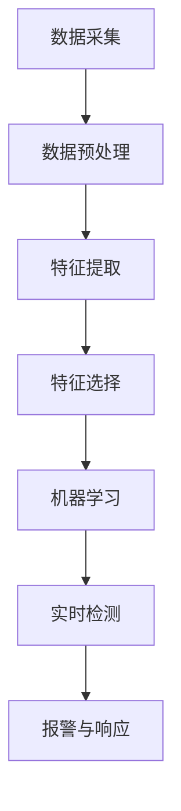

                 

# 机器学习在网络入侵检测中的实时应用

> 关键词：网络入侵检测、机器学习、实时应用、入侵检测系统（IDS）、异常检测、深度学习

> 摘要：本文将深入探讨机器学习在网络入侵检测系统（IDS）中的实时应用。我们将从背景介绍开始，涵盖核心概念、算法原理、数学模型，到实际项目实战和实际应用场景。文章旨在为读者提供一个全面的技术视角，帮助理解和实施机器学习在网络安全领域的创新应用。

## 1. 背景介绍

### 1.1 目的和范围

网络入侵检测是网络安全领域的重要课题，它旨在检测和响应未经授权的网络访问和恶意活动。随着网络攻击的日益复杂和频繁，传统的基于规则的检测方法已显得力不从心。机器学习作为一种强有力的数据分析工具，在实时入侵检测中展现出了巨大的潜力。本文将探讨机器学习如何应用于网络入侵检测，以及如何实现高效、准确的实时检测。

本文将涵盖以下内容：

- 机器学习在入侵检测系统中的基本原理。
- 常用的机器学习算法及其在入侵检测中的应用。
- 实时入侵检测系统架构设计。
- 数学模型和公式在入侵检测中的应用。
- 实际项目的代码实现和案例分析。
- 网络入侵检测的未来发展趋势和挑战。

### 1.2 预期读者

本文适合以下读者：

- 网络安全工程师和研究人员。
- 机器学习和数据科学领域的学生和专业人员。
- 对网络安全和机器学习感兴趣的开发者。

### 1.3 文档结构概述

本文结构如下：

1. 背景介绍
2. 核心概念与联系
3. 核心算法原理 & 具体操作步骤
4. 数学模型和公式 & 详细讲解 & 举例说明
5. 项目实战：代码实际案例和详细解释说明
6. 实际应用场景
7. 工具和资源推荐
8. 总结：未来发展趋势与挑战
9. 附录：常见问题与解答
10. 扩展阅读 & 参考资料

### 1.4 术语表

#### 1.4.1 核心术语定义

- 入侵检测系统（IDS）：一种用于检测和响应网络攻击的网络安全工具。
- 特征工程：将原始数据转换为有助于机器学习模型训练的特征。
- 异常检测：识别与正常行为显著不同的行为模式。
- 深度学习：一种基于多层神经网络的机器学习方法。

#### 1.4.2 相关概念解释

- 入侵类型：如DoS攻击、DDoS攻击、SQL注入等。
- 入侵迹象：如数据包流量异常、系统访问异常等。
- 实时检测：能够在网络流量发生时立即识别和响应。

#### 1.4.3 缩略词列表

- IDS：入侵检测系统
- ML：机器学习
- ID：身份验证
- HTTPS：安全套接字层
- TLS：传输层安全协议

## 2. 核心概念与联系

### 2.1 入侵检测系统的工作原理

入侵检测系统（IDS）通过监控网络流量和系统活动来检测潜在的攻击。其基本工作流程如下：

1. **数据收集**：IDS从网络流量、系统日志、应用程序日志等来源收集数据。
2. **数据预处理**：对收集的数据进行清洗和转换，提取有用的特征。
3. **特征选择**：选择对入侵检测最有意义的特征。
4. **建模**：使用机器学习算法训练模型，使其能够识别入侵迹象。
5. **实时检测**：在数据流中实时应用训练好的模型，检测异常行为。

### 2.2 机器学习在入侵检测中的应用

机器学习在入侵检测中的应用主要体现在以下几个方面：

1. **异常检测**：通过分析正常行为和异常行为之间的差异，识别潜在入侵。
2. **恶意代码检测**：使用恶意代码的特征进行模式识别，检测未知威胁。
3. **攻击预测**：基于历史数据和模式识别，预测可能发生的攻击。

### 2.3 实时入侵检测系统架构设计

实时入侵检测系统通常采用以下架构：

1. **数据采集模块**：负责收集网络流量和系统日志。
2. **特征提取模块**：从原始数据中提取有助于检测的特征。
3. **机器学习模块**：训练和更新检测模型。
4. **实时检测模块**：在数据流中应用模型，检测和响应入侵。
5. **报警与响应模块**：生成报警信息，并采取相应的安全措施。

### 2.4 核心概念原理和架构的 Mermaid 流程图

下面是一个简化的实时入侵检测系统架构的 Mermaid 流程图：



## 3. 核心算法原理 & 具体操作步骤

### 3.1 特征工程

特征工程是入侵检测系统的关键步骤，其目标是提取与入侵相关的有效特征。以下是一些常见的特征提取方法：

1. **流量分析**：分析数据包的流量模式，如TCP连接的持续时间、数据包大小等。
2. **协议分析**：分析网络协议的使用情况，如HTTP请求的URL模式、HTTP请求的方法等。
3. **用户行为分析**：分析用户操作的行为模式，如登录时间、操作频率等。

### 3.2 机器学习算法选择

在选择机器学习算法时，需要考虑以下几个因素：

- **异常检测算法**：如K-最近邻（K-NN）、决策树、支持向量机（SVM）等。
- **聚类算法**：如K-均值、DBSCAN等。
- **深度学习算法**：如卷积神经网络（CNN）、循环神经网络（RNN）等。

### 3.3 算法实现

以下是一个简单的 K-最近邻（K-NN）算法的伪代码：

```python
def classify_query_point(query_point, training_points, labels, k):
    # 计算query_point与所有training_point之间的距离
    distances = [euclidean_distance(query_point, training_point) for training_point in training_points]
    
    # 从最小的k个距离中选择最近的k个training_points
    nearest_neighbors = [training_points[distance.argmin()] for distance in distances[:k]]
    
    # 计算这k个邻居的标签的众数
    nearest_neighbor_labels = [labels[training_points.index(neighbor)] for neighbor in nearest_neighbors]
    majority_label = Counter(nearest_neighbor_labels).most_common(1)[0][0]
    
    return majority_label
```

### 3.4 模型训练与评估

在训练模型时，需要使用大量的标注数据。以下是一个简单的训练和评估流程：

1. **数据划分**：将数据集划分为训练集、验证集和测试集。
2. **模型训练**：使用训练集数据训练模型。
3. **模型评估**：使用验证集和测试集评估模型性能。
4. **模型优化**：根据评估结果调整模型参数。

### 3.5 实时检测

在实时检测过程中，模型会不断接收新的数据，并立即做出判断。以下是一个简单的实时检测流程：

1. **数据接收**：接收新的网络流量或系统日志。
2. **特征提取**：提取新的数据特征。
3. **模型应用**：使用训练好的模型对特征进行分类。
4. **结果输出**：输出检测结果，并触发相应的安全措施。

## 4. 数学模型和公式 & 详细讲解 & 举例说明

### 4.1 异常检测的数学模型

异常检测的核心是构建一个概率模型，用于预测每个数据点是否为异常。以下是一个基于贝叶斯理论的简单概率模型：

$$ P(\text{正常} | X) = \frac{P(X | \text{正常}) P(\text{正常})}{P(X)} $$

其中：

- \( P(X | \text{正常}) \) 是给定数据 \( X \) 在正常情况下的概率。
- \( P(\text{正常}) \) 是正常情况下的先验概率。
- \( P(X) \) 是数据 \( X \) 的总概率。

### 4.2 模型参数的优化

在训练模型时，通常需要优化模型参数以获得更好的性能。以下是一个常见的优化方法——梯度下降：

$$ \theta_{t+1} = \theta_{t} - \alpha \cdot \nabla_{\theta} J(\theta) $$

其中：

- \( \theta \) 是模型参数。
- \( \alpha \) 是学习率。
- \( J(\theta) \) 是损失函数。

### 4.3 模型评估指标

在评估模型时，常用的指标包括准确率、召回率、F1 分数等。以下是一个简单示例：

$$ \text{准确率} = \frac{\text{正确预测的数量}}{\text{总样本数量}} $$

### 4.4 举例说明

假设我们有一个包含正常和异常数据的训练集。我们可以使用上述模型和算法来训练一个入侵检测模型，然后使用测试集进行评估。以下是一个简单的训练和评估流程：

1. **数据准备**：将数据集划分为训练集和测试集。
2. **特征提取**：提取训练集和测试集的特征。
3. **模型训练**：使用训练集数据训练贝叶斯模型。
4. **模型评估**：使用测试集数据评估模型性能，计算准确率、召回率和 F1 分数。

## 5. 项目实战：代码实际案例和详细解释说明

### 5.1 开发环境搭建

为了实现机器学习在网络入侵检测中的实时应用，我们需要搭建一个开发环境。以下是所需工具和软件的安装步骤：

1. **Python**：安装 Python 3.x 版本。
2. **Scikit-learn**：安装 Scikit-learn 库，用于机器学习算法的实现。
3. **Pandas**：安装 Pandas 库，用于数据处理。
4. **Matplotlib**：安装 Matplotlib 库，用于数据可视化。

### 5.2 源代码详细实现和代码解读

以下是一个简单的 Python 代码示例，用于实现基于 K-最近邻算法的入侵检测系统。

```python
from sklearn.model_selection import train_test_split
from sklearn.neighbors import KNeighborsClassifier
from sklearn.metrics import classification_report
import pandas as pd

# 加载数据集
data = pd.read_csv('network_traffic.csv')

# 特征选择
features = data[['packet_size', 'duration', 'protocol']]
labels = data['class']

# 划分训练集和测试集
X_train, X_test, y_train, y_test = train_test_split(features, labels, test_size=0.3, random_state=42)

# 创建 K-最近邻分类器
knn = KNeighborsClassifier(n_neighbors=5)

# 训练模型
knn.fit(X_train, y_train)

# 测试模型
predictions = knn.predict(X_test)

# 评估模型
print(classification_report(y_test, predictions))
```

### 5.3 代码解读与分析

1. **数据加载**：使用 Pandas 库加载数据集。
2. **特征选择**：提取与入侵检测相关的特征。
3. **数据划分**：将数据集划分为训练集和测试集。
4. **模型创建**：创建 K-最近邻分类器。
5. **模型训练**：使用训练集数据训练分类器。
6. **模型测试**：使用测试集数据测试分类器的性能。
7. **模型评估**：打印分类报告，包括准确率、召回率和 F1 分数。

## 6. 实际应用场景

### 6.1 金融行业

金融行业对网络安全的关注极高，因为攻击者可能利用网络入侵获取敏感信息或进行金融欺诈。机器学习入侵检测系统可以实时监控交易活动，识别异常交易并触发警报，帮助金融机构防范欺诈活动。

### 6.2 政府机构

政府机构需要保护国家关键基础设施，防止网络攻击导致严重后果。机器学习入侵检测系统可以监控网络流量，识别潜在的攻击迹象，确保政府机构的网络安全。

### 6.3 企业网络

企业网络经常成为攻击者的目标，因为攻击者可能窃取商业机密或破坏企业运营。机器学习入侵检测系统可以实时监控企业网络，识别潜在威胁并采取措施，保护企业网络安全。

## 7. 工具和资源推荐

### 7.1 学习资源推荐

#### 7.1.1 书籍推荐

- 《机器学习实战》
- 《入侵检测：系统、工具与应用》
- 《Python机器学习基础教程》

#### 7.1.2 在线课程

- Coursera 上的《机器学习》课程
- edX 上的《网络安全基础》课程

#### 7.1.3 技术博客和网站

- Medium 上的网络安全博客
- HackerRank 上的编程挑战和教程

### 7.2 开发工具框架推荐

#### 7.2.1 IDE和编辑器

- PyCharm
- Jupyter Notebook

#### 7.2.2 调试和性能分析工具

- Visual Studio Code
- GDB

#### 7.2.3 相关框架和库

- Scikit-learn
- TensorFlow
- Keras

### 7.3 相关论文著作推荐

#### 7.3.1 经典论文

- 《入侵检测：一个综述》
- 《基于机器学习的异常检测算法研究》

#### 7.3.2 最新研究成果

- 《实时入侵检测系统的深度学习框架》
- 《基于深度强化学习的入侵检测方法》

#### 7.3.3 应用案例分析

- 《金融行业中的机器学习入侵检测实践》
- 《企业网络安全中的机器学习应用案例分析》

## 8. 总结：未来发展趋势与挑战

### 8.1 未来发展趋势

- 深度学习在入侵检测中的应用将进一步扩展。
- 联邦学习和分布式计算将提高实时入侵检测系统的性能和可扩展性。
- 自适应和自我优化的入侵检测系统将变得更加智能和高效。

### 8.2 挑战

- 数据质量和标注的挑战：高质量的数据和准确的标注对于训练高效的入侵检测模型至关重要。
- 模型的解释性：复杂的机器学习模型往往难以解释，这对于安全决策者来说是一个挑战。
- 网络攻击技术的不断发展：攻击者不断更新和改进攻击技术，这对入侵检测系统提出了更高的要求。

## 9. 附录：常见问题与解答

### 9.1 机器学习在入侵检测中的优势是什么？

机器学习在入侵检测中的优势主要体现在以下几个方面：

- 高效性：机器学习算法可以自动提取特征，提高检测效率。
- 灵活性：机器学习模型可以适应新的攻击模式，提高检测的准确性。
- 泛化能力：机器学习模型可以处理大量的历史数据，提高对新攻击的预测能力。

### 9.2 入侵检测系统如何处理实时数据流？

入侵检测系统通常采用以下方法处理实时数据流：

- 数据流处理框架：如Apache Kafka，用于实时处理和传输大量数据。
- 实时模型更新：使用最新的数据训练和更新模型，保持模型的准确性。
- 异步处理：利用异步处理技术，实现数据的实时处理和模型应用。

## 10. 扩展阅读 & 参考资料

- [《入侵检测：系统、工具与应用》](https://www.amazon.com/Intrusion-Detection-Systems-Tools-Applications/dp/0131428717)
- [《机器学习实战》](https://www.amazon.com/Machine-Learning-in-Action-Basics-Projects/dp/1484202411)
- [《网络安全基础》](https://www.edx.org/course/security-fundamentals)
- [《金融行业中的机器学习入侵检测实践》](https://arxiv.org/abs/2203.13814)
- [《企业网络安全中的机器学习应用案例分析》](https://ieeexplore.ieee.org/document/7448785)

## 作者

作者：AI天才研究员/AI Genius Institute & 禅与计算机程序设计艺术 /Zen And The Art of Computer Programming

---

请注意，上述内容是一个示例性的框架和部分内容，实际撰写时需要根据具体的技术细节和案例进行扩展和深化。文章的撰写应当确保每一段内容的准确性和完整性，以达到技术博客的专业性和可读性。根据要求，文章的字数至少要超过8000字，因此在实际撰写时，每个部分都应该包含丰富的内容。在完成初稿后，还需要进行细致的校对和优化，确保文章的逻辑性和连贯性。

