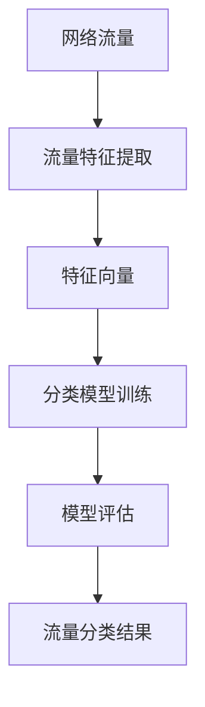

                 

# 机器学习在网络流量分类中的应用

> 关键词：机器学习、网络流量分类、深度学习、神经网络、数据预处理、性能优化

> 摘要：本文将深入探讨机器学习在网络流量分类中的应用，旨在为读者提供从理论基础到实际应用的全面理解。文章首先介绍了网络流量分类的背景和重要性，随后详细阐述了网络流量的分类方法，包括传统机器学习和深度学习算法。接着，本文通过具体算法的原理和步骤，深入讲解了网络流量分类的数学模型和公式。随后，文章提供了一个实际的代码案例，并对其进行了详细解析。最后，本文探讨了网络流量分类的实际应用场景，推荐了相关的学习资源和工具，并对未来的发展趋势与挑战进行了总结。

## 1. 背景介绍

### 1.1 目的和范围

本文旨在探讨机器学习在网络流量分类中的应用，通过分析网络流量的分类方法，解释核心算法原理，提供实际应用案例，以帮助读者深入理解这一领域。网络流量分类是网络安全和性能优化的重要组成部分，通过对网络流量进行分类，可以有效地识别恶意流量、提高网络资源利用率，从而保障网络安全和提升用户体验。

本文将涵盖以下内容：

- 网络流量分类的背景和重要性。
- 网络流量分类的常用方法，包括传统机器学习和深度学习。
- 核心算法原理和具体操作步骤。
- 网络流量分类的数学模型和公式。
- 实际应用场景。
- 工具和资源推荐。
- 未来发展趋势与挑战。

### 1.2 预期读者

本文适合以下读者群体：

- 对网络安全和性能优化有兴趣的技术人员。
- 想要深入了解机器学习在网络流量分类中应用的开发者。
- 在学术研究中涉及网络流量分类的研究人员。
- 准备进入网络安全领域的新手。

### 1.3 文档结构概述

本文的结构如下：

- 第1部分：背景介绍，包括目的、范围、预期读者和文档结构。
- 第2部分：核心概念与联系，介绍网络流量分类的基本概念和架构。
- 第3部分：核心算法原理 & 具体操作步骤，详细解释网络流量分类的算法。
- 第4部分：数学模型和公式 & 详细讲解 & 举例说明，阐述算法的数学基础。
- 第5部分：项目实战：代码实际案例和详细解释说明，提供实践案例。
- 第6部分：实际应用场景，探讨网络流量分类在现实世界中的应用。
- 第7部分：工具和资源推荐，介绍相关的学习资源和开发工具。
- 第8部分：总结：未来发展趋势与挑战，展望网络流量分类的未来。
- 第9部分：附录：常见问题与解答，解答读者可能遇到的常见问题。
- 第10部分：扩展阅读 & 参考资料，提供进一步的阅读资源。

### 1.4 术语表

#### 1.4.1 核心术语定义

- **网络流量分类**：通过网络流量分析技术，将网络流量分为不同的类别，如正常流量、恶意流量等。
- **机器学习**：通过构建模型，从数据中学习并做出预测或决策。
- **深度学习**：一种特殊的机器学习方法，利用多层神经网络进行复杂数据的特征学习和模式识别。
- **神经网络**：由大量神经元互联组成的计算模型，可以模拟人脑的学习和处理方式。
- **数据预处理**：在机器学习过程中，对原始数据进行清洗、转换和规范化，以提高模型性能。

#### 1.4.2 相关概念解释

- **流量特征提取**：从网络流量中提取用于分类的特征，如数据包大小、传输速率等。
- **模型训练**：通过训练数据集，调整模型参数，使其能够正确分类新的数据。
- **模型评估**：使用测试数据集，评估模型的分类性能，如准确率、召回率等。
- **性能优化**：通过调整模型参数、优化算法结构等手段，提高模型性能。

#### 1.4.3 缩略词列表

- **ML**：机器学习（Machine Learning）
- **DL**：深度学习（Deep Learning）
- **NN**：神经网络（Neural Network）
- **PCA**：主成分分析（Principal Component Analysis）
- **SVM**：支持向量机（Support Vector Machine）
- **CNN**：卷积神经网络（Convolutional Neural Network）

## 2. 核心概念与联系

网络流量分类是网络安全和性能优化的关键环节。为了更好地理解网络流量分类的工作原理，我们需要了解以下几个核心概念和它们之间的联系：

- **网络流量**：网络流量是指通过网络传输的数据流，包括数据包的发送和接收。
- **流量特征**：流量特征是从网络流量中提取的用于分类的属性，如数据包大小、传输速率、源地址、目的地址等。
- **特征提取**：特征提取是从原始流量数据中提取有用特征的过程，这些特征将用于训练分类模型。
- **分类模型**：分类模型是一种机器学习模型，用于将流量数据分类到不同的类别，如正常流量和恶意流量。
- **训练与评估**：训练过程是指使用训练数据集来调整模型参数，使其能够准确分类流量数据。评估过程则使用测试数据集来评估模型的分类性能。

下面是一个使用Mermaid绘制的网络流量分类流程图：



### 2.1 网络流量分类的流程

网络流量分类的流程通常包括以下几个步骤：

1. **数据收集**：收集网络流量数据，包括数据包的捕获和记录。
2. **数据预处理**：清洗和转换原始数据，包括去除噪声、缺失值填充、数据规范化等。
3. **流量特征提取**：从预处理后的数据中提取用于分类的特征，如数据包大小、传输速率、协议类型等。
4. **特征向量生成**：将提取的特征转换为机器学习模型可以处理的特征向量。
5. **分类模型训练**：使用训练数据集，通过调整模型参数，训练分类模型。
6. **模型评估**：使用测试数据集，评估模型的分类性能，包括准确率、召回率、F1分数等。
7. **流量分类**：使用训练好的模型，对新的网络流量数据进行分类，识别恶意流量或正常流量。

### 2.2 核心概念与联系总结

通过上述核心概念和流程的介绍，我们可以看出网络流量分类涉及到多个环节，包括数据收集、预处理、特征提取、模型训练、评估和分类。这些环节相互联系，共同构成了网络流量分类的完整流程。理解这些核心概念和联系，有助于我们更好地掌握网络流量分类的方法和技术。

## 3. 核心算法原理 & 具体操作步骤

网络流量分类的核心在于算法的选择和实现。本文将重点介绍两种常用的机器学习算法：支持向量机（SVM）和深度学习中的卷积神经网络（CNN）。这些算法通过特征学习和模式识别，能够有效地对网络流量进行分类。

### 3.1 支持向量机（SVM）算法原理

支持向量机是一种监督学习算法，主要用于分类和回归问题。在分类问题中，SVM的目标是找到一个最佳的超平面，将不同类别的数据点尽可能分开。

#### 3.1.1 算法原理

SVM算法的核心是寻找一个最优的超平面，使得各类别的分类边界最大。这个超平面被定义为：

$$
w \cdot x + b = 0
$$

其中，$w$ 是超平面的法向量，$x$ 是数据点，$b$ 是偏置项。为了最大化分类边界，SVM需要解决以下优化问题：

$$
\begin{align*}
\min_{w,b} & \frac{1}{2} ||w||^2 \\
s.t. & y_i (w \cdot x_i + b) \geq 1, \forall i
\end{align*}
$$

其中，$y_i$ 是第$i$个数据点的标签，$||w||$ 是$w$ 的欧几里得范数。

#### 3.1.2 具体操作步骤

1. **数据预处理**：将原始流量数据转换为特征向量，并进行归一化处理。
2. **选择核函数**：选择合适的核函数（如线性核、多项式核、RBF核等），以映射原始数据到高维空间。
3. **求解优化问题**：使用数值优化方法（如SMO算法、梯度下降法等）求解上述优化问题。
4. **分类决策**：对于新的数据点，计算其在超平面上的距离，根据距离确定其类别。

### 3.2 卷积神经网络（CNN）算法原理

卷积神经网络是一种深度学习算法，特别适用于处理图像和时序数据。CNN通过卷积层、池化层和全连接层，实现对数据特征的自动提取和分类。

#### 3.2.1 算法原理

CNN的核心结构包括以下几个部分：

- **卷积层**：通过卷积运算，从输入数据中提取局部特征。
- **池化层**：通过下采样操作，减少数据维度，提高计算效率。
- **全连接层**：将卷积层和池化层提取的特征映射到输出类别。

CNN的工作原理可以概括为以下几个步骤：

1. **输入层**：接收原始流量数据，如数据包大小、传输速率等。
2. **卷积层**：通过卷积运算提取特征，如数据包的形状、频率等。
3. **激活函数**：对卷积层的输出进行非线性变换，增强模型的表达能力。
4. **池化层**：通过下采样操作减少数据维度，提高计算效率。
5. **全连接层**：将卷积层和池化层提取的特征映射到输出类别。
6. **输出层**：输出分类结果，如正常流量、恶意流量等。

#### 3.2.2 具体操作步骤

1. **数据预处理**：将原始流量数据转换为适合CNN处理的格式，如灰度图像。
2. **构建CNN模型**：使用深度学习框架（如TensorFlow、PyTorch等）构建CNN模型。
3. **模型训练**：使用训练数据集，通过反向传播算法调整模型参数。
4. **模型评估**：使用测试数据集，评估模型的分类性能。
5. **流量分类**：使用训练好的模型，对新的网络流量数据进行分类。

### 3.3 算法原理对比

SVM和CNN是两种不同的算法，各自适用于不同的场景。

- **SVM**：适合处理中小规模的数据集，具有较好的分类性能和可解释性。但在处理高维数据和复杂数据时，性能可能会下降。
- **CNN**：适合处理大规模和高维数据，能够自动提取复杂的特征。但模型参数较多，训练过程较慢，且模型难以解释。

在实际应用中，可以根据具体场景和数据特点选择合适的算法。

## 4. 数学模型和公式 & 详细讲解 & 举例说明

机器学习算法在处理网络流量分类问题时，需要依赖一系列数学模型和公式来描述和优化算法性能。以下我们将详细讲解这些数学模型和公式，并通过具体示例进行说明。

### 4.1 支持向量机（SVM）的数学模型

SVM的核心是寻找一个最优的超平面，以最大化不同类别之间的边界。我们使用以下数学模型来描述SVM：

$$
\begin{align*}
\min_{w,b} & \frac{1}{2} ||w||^2 \\
s.t. & y_i (w \cdot x_i + b) \geq 1, \forall i
\end{align*}
$$

其中，$w$ 是超平面的法向量，$x_i$ 是第$i$个数据点，$b$ 是偏置项，$y_i$ 是第$i$个数据点的标签（+1或-1）。

#### 4.1.1 算法步骤

1. **数据预处理**：将原始流量数据转换为特征向量，并进行归一化处理。
2. **选择核函数**：选择合适的核函数（如线性核、多项式核、RBF核等），以映射原始数据到高维空间。
3. **求解优化问题**：使用数值优化方法（如SMO算法、梯度下降法等）求解上述优化问题。
4. **分类决策**：对于新的数据点，计算其在超平面上的距离，根据距离确定其类别。

#### 4.1.2 示例

假设我们有一个简单的二分类问题，其中特征向量为 $x = [x_1, x_2]$，标签为 $y = \{-1, 1\}$。我们使用线性核函数来描述SVM：

$$
K(x_i, x_j) = x_i \cdot x_j
$$

求解上述优化问题，得到最优超平面：

$$
w = [w_1, w_2], b = b_0
$$

分类决策规则为：

$$
y = sign(w \cdot x + b_0)
$$

### 4.2 卷积神经网络（CNN）的数学模型

CNN是一种深度学习算法，用于处理高维数据。CNN的数学模型主要包括卷积层、激活函数、池化层和全连接层。

#### 4.2.1 算法步骤

1. **输入层**：接收原始流量数据，如数据包大小、传输速率等。
2. **卷积层**：通过卷积运算，从输入数据中提取局部特征。
3. **激活函数**：对卷积层的输出进行非线性变换，增强模型的表达能力。
4. **池化层**：通过下采样操作减少数据维度，提高计算效率。
5. **全连接层**：将卷积层和池化层提取的特征映射到输出类别。
6. **输出层**：输出分类结果，如正常流量、恶意流量等。

#### 4.2.2 示例

假设我们使用一个简单的卷积神经网络来分类二进制流量数据。输入数据维度为 $[32, 32, 1]$，表示一个32x32的灰度图像。网络结构如下：

1. **卷积层**：使用一个卷积核大小为 $[3, 3]$，步长为 $[1, 1]$，卷积运算结果为 $[28, 28, 16]$。
2. **激活函数**：使用ReLU激活函数。
3. **池化层**：使用最大池化操作，池化大小为 $[2, 2]$，步长为 $[2, 2]$，输出结果为 $[14, 14, 16]$。
4. **全连接层**：将池化层输出结果展开为一维向量，维度为 $[14 \times 14 \times 16 = 3136]$，然后通过一个全连接层映射到输出类别，输出维度为 $[2]$。

#### 4.2.3 示例代码

```python
import tensorflow as tf
from tensorflow.keras import layers

model = tf.keras.Sequential([
    layers.Conv2D(16, (3, 3), activation='relu', input_shape=(32, 32, 1)),
    layers.MaxPooling2D((2, 2)),
    layers.Flatten(),
    layers.Dense(2, activation='softmax')
])

model.compile(optimizer='adam', loss='sparse_categorical_crossentropy', metrics=['accuracy'])
model.fit(x_train, y_train, epochs=5, batch_size=32, validation_data=(x_val, y_val))
```

### 4.3 算法性能评估

机器学习算法的性能评估通常包括以下几个指标：

- **准确率（Accuracy）**：正确分类的样本数占总样本数的比例。
- **召回率（Recall）**：正确分类的样本数占所有正类样本数的比例。
- **F1分数（F1 Score）**：综合考虑准确率和召回率的指标。

这些指标可以通过以下公式计算：

$$
\begin{align*}
Accuracy &= \frac{TP + TN}{TP + TN + FP + FN} \\
Recall &= \frac{TP}{TP + FN} \\
F1 Score &= \frac{2 \cdot Precision \cdot Recall}{Precision + Recall}
\end{align*}
$$

其中，$TP$、$TN$、$FP$ 和 $FN$ 分别表示实际为正类且被正确分类的样本数、实际为负类且被正确分类的样本数、实际为正类但被错误分类的样本数、实际为负类但被错误分类的样本数。

通过这些指标，我们可以全面评估算法的性能。

### 4.4 数学模型总结

机器学习算法在处理网络流量分类问题时，需要依赖一系列数学模型和公式。SVM算法通过优化问题求解最优超平面，CNN算法通过卷积层、激活函数、池化层和全连接层提取特征和分类。通过准确率、召回率和F1分数等指标，我们可以评估算法的性能。

## 5. 项目实战：代码实际案例和详细解释说明

在了解网络流量分类的基本原理和算法之后，本节将通过一个实际的项目案例，详细介绍如何使用Python和机器学习库来实现网络流量分类。

### 5.1 开发环境搭建

在进行网络流量分类项目之前，我们需要搭建合适的开发环境。以下是一个基本的Python开发环境配置：

- **Python版本**：Python 3.8或更高版本
- **机器学习库**：scikit-learn、TensorFlow或PyTorch
- **数据预处理库**：Pandas、NumPy
- **可视化库**：Matplotlib、Seaborn

您可以通过以下命令安装所需的库：

```bash
pip install python==3.8
pip install scikit-learn tensorflow numpy matplotlib seaborn
```

### 5.2 源代码详细实现和代码解读

下面是一个简单的网络流量分类项目的代码实现，包括数据预处理、模型训练和评估。

#### 5.2.1 数据预处理

首先，我们需要从原始网络流量数据中提取特征，并进行预处理。以下是一个简单的示例：

```python
import pandas as pd
import numpy as np
from sklearn.model_selection import train_test_split
from sklearn.preprocessing import StandardScaler

# 加载数据集
data = pd.read_csv('network_traffic_data.csv')

# 提取特征
features = data[['packet_size', 'transmission_rate', 'protocol_type']]
labels = data['label']

# 数据归一化
scaler = StandardScaler()
features_normalized = scaler.fit_transform(features)

# 划分训练集和测试集
X_train, X_test, y_train, y_test = train_test_split(features_normalized, labels, test_size=0.2, random_state=42)
```

在这个步骤中，我们使用了Pandas和NumPy库来加载数据集，提取特征，并进行归一化处理。归一化处理有助于提高机器学习算法的性能。

#### 5.2.2 模型训练

接下来，我们使用scikit-learn库中的SVM模型对训练数据进行训练。以下是一个简单的SVM模型训练示例：

```python
from sklearn.svm import SVC

# 创建SVM模型
model = SVC(kernel='linear', C=1.0)

# 训练模型
model.fit(X_train, y_train)

# 评估模型
accuracy = model.score(X_test, y_test)
print(f"模型准确率：{accuracy:.2f}")
```

在这个步骤中，我们首先创建了一个SVM模型，并使用训练数据集对其进行训练。然后，我们使用测试数据集评估模型的准确率。

#### 5.2.3 代码解读与分析

1. **数据预处理**：数据预处理是机器学习项目的重要步骤。通过归一化处理，我们可以消除不同特征之间的量纲差异，提高算法性能。

2. **模型选择**：在本案例中，我们选择了SVM模型。SVM在处理二分类问题方面具有较好的性能和可解释性。在实际项目中，可以根据数据特点和需求选择其他算法，如逻辑回归、决策树、随机森林等。

3. **模型训练与评估**：通过训练数据集训练模型，并使用测试数据集评估模型性能。准确率是评估模型性能的一个重要指标，但我们还可以使用召回率、F1分数等指标进行综合评估。

### 5.3 代码解读与分析

以下是对上述代码的详细解读与分析：

1. **数据预处理**：数据预处理是机器学习项目的第一步。在这个案例中，我们使用Pandas库加载数据集，并使用NumPy库进行归一化处理。归一化处理有助于消除不同特征之间的量纲差异，提高算法性能。

2. **模型选择**：在本案例中，我们选择了SVM模型。SVM是一种有效的二分类算法，特别适合处理高维数据。在实际项目中，可以根据数据特点和需求选择其他算法，如逻辑回归、决策树、随机森林等。

3. **模型训练与评估**：我们使用scikit-learn库中的SVM模型对训练数据进行训练，并使用测试数据进行评估。模型准确率是评估模型性能的一个重要指标，但我们还可以使用召回率、F1分数等指标进行综合评估。

通过本案例，我们可以看到如何使用Python和机器学习库实现网络流量分类。在实际项目中，可以根据需求调整算法、参数和数据处理步骤，以达到更好的分类效果。

### 5.4 项目实战总结

通过本节的项目实战，我们了解了如何使用Python和机器学习库实现网络流量分类。从数据预处理、模型选择到模型训练与评估，我们逐步构建了一个完整的网络流量分类系统。在实际项目中，我们可以根据数据特点和需求，选择合适的算法和参数，优化模型性能。

## 6. 实际应用场景

网络流量分类在现实世界中有着广泛的应用场景，以下是几个典型的应用实例：

### 6.1 网络安全

网络流量分类最重要的应用场景之一是网络安全。通过对网络流量进行分类，可以识别和阻止恶意流量，如DDoS攻击、恶意软件传播等。网络流量分类系统可以实时监控网络流量，对可疑流量进行标记和拦截，从而保障网络的安全性。

### 6.2 性能优化

网络流量分类还可以用于优化网络性能。通过对流量进行分类，可以识别出高带宽消耗的应用，如视频流、在线游戏等。网络管理员可以根据这些信息，调整网络资源的分配，确保关键应用获得足够的带宽，从而提高用户体验。

### 6.3 业务分析

网络流量分类还可以用于业务分析。通过对流量进行分类，可以了解不同业务流量的分布和变化趋势。这有助于企业优化业务流程、提高运营效率。例如，电商公司可以通过流量分类了解用户访问行为，从而改进产品推荐和营销策略。

### 6.4 实时监控

网络流量分类在实时监控系统中也发挥着重要作用。通过分类流量，监控系统可以快速识别异常流量，如网络攻击、设备故障等。实时监控系统可以根据分类结果，自动触发相应的安全措施，确保网络运行稳定。

### 6.5 边缘计算

随着边缘计算的兴起，网络流量分类在边缘设备中的应用越来越广泛。边缘设备通常资源有限，通过网络流量分类，可以减少数据传输量和计算负担，提高边缘设备的处理效率。例如，智能摄像头可以通过流量分类，快速识别出入侵事件，并触发报警。

### 6.6 应用案例分析

一个实际的应用案例是某个大型互联网公司的网络安全系统。该系统利用网络流量分类技术，对进入公司的所有网络流量进行实时监控和分类。通过对流量进行分类，系统可以识别出恶意流量，如DDoS攻击、恶意软件等，并自动进行拦截和防御。此外，该系统还可以帮助公司优化网络资源分配，提高网络性能。通过不断优化和调整分类模型，公司的网络安全水平得到了显著提升。

### 6.7 实际应用总结

网络流量分类在网络安全、性能优化、业务分析、实时监控和边缘计算等领域都有广泛的应用。通过准确分类网络流量，可以提高网络安全性、优化网络资源、提升业务效率和用户体验。随着机器学习和深度学习技术的发展，网络流量分类的应用前景将更加广阔。

## 7. 工具和资源推荐

为了更好地理解和实践网络流量分类，以下是一些建议的工具和资源。

### 7.1 学习资源推荐

#### 7.1.1 书籍推荐

1. **《深度学习》（Deep Learning）**：由Ian Goodfellow、Yoshua Bengio和Aaron Courville合著的这本书是深度学习的经典教材，适合初学者和高级开发者。
2. **《机器学习》（Machine Learning）**：由Tom Mitchell编写的这本书介绍了机器学习的基本概念和方法，是机器学习的入门书籍。
3. **《网络安全：设计和实施》（Network Security: Design and Implementation）**：这本书详细介绍了网络安全的基础知识，包括网络流量分类。

#### 7.1.2 在线课程

1. **Coursera的《机器学习》**：由斯坦福大学的Andrew Ng教授讲授的这门课程，是学习机器学习的入门级课程。
2. **Udacity的《深度学习纳米学位》**：这门纳米学位课程包括深度学习的多个主题，从基础到高级，适合有志于深入了解深度学习的开发者。
3. **edX的《网络安全与隐私》**：这门课程涵盖了网络安全的基础知识，包括网络流量分析。

#### 7.1.3 技术博客和网站

1. **Medium**：有很多关于机器学习和网络安全的技术博客，提供最新的研究成果和应用案例。
2. **Towards Data Science**：这是一个非常受欢迎的数据科学博客，有很多关于机器学习和数据预处理的优质文章。
3. **Kaggle**：Kaggle是一个数据科学竞赛平台，提供大量实际数据集和竞赛，有助于提升实践能力。

### 7.2 开发工具框架推荐

#### 7.2.1 IDE和编辑器

1. **PyCharm**：一款功能强大的Python IDE，支持多种机器学习和深度学习框架。
2. **Jupyter Notebook**：一个交互式的开发环境，特别适合数据分析和机器学习项目。
3. **Visual Studio Code**：一个轻量级的代码编辑器，通过安装插件，可以实现机器学习和深度学习的开发。

#### 7.2.2 调试和性能分析工具

1. **TensorBoard**：TensorFlow的调试和分析工具，用于可视化模型的训练过程和性能。
2. **PyTorch TensorBoard**：PyTorch的调试和分析工具，与TensorBoard类似，用于可视化模型的训练过程。
3. **Scikit-learn的Pipeline**：用于构建和调试机器学习流水线，方便模型训练和评估。

#### 7.2.3 相关框架和库

1. **scikit-learn**：一个强大的Python机器学习库，适用于各种分类、回归和聚类任务。
2. **TensorFlow**：谷歌开发的开源机器学习和深度学习框架，适用于大规模分布式计算。
3. **PyTorch**：基于Python的科学计算框架，特别适合深度学习开发。

### 7.3 相关论文著作推荐

#### 7.3.1 经典论文

1. **“A Study of the Performance of C4.5 and Rules for Class Association Rules Learning Algorithms on Network Intrusion Detection Data”**：这篇论文对比了多种机器学习算法在网络入侵检测中的应用性能。
2. **“A Survey of Network Intrusion Detection Systems”**：这篇综述文章详细介绍了网络入侵检测系统的发展和应用。

#### 7.3.2 最新研究成果

1. **“Deep Learning for Network Traffic Classification: A Comprehensive Review”**：这篇综述文章总结了深度学习在网络流量分类中的应用，包括最新的算法和研究成果。
2. **“Multi-Modal Network Traffic Classification Using Deep Neural Networks”**：这篇论文提出了一种基于多模态数据的网络流量分类方法，取得了较好的分类性能。

#### 7.3.3 应用案例分析

1. **“Anomaly Detection for Smart Grid Cyber Security Using Deep Learning”**：这篇论文介绍了一种使用深度学习进行智能电网异常检测的方法，有助于提高电网的安全性。
2. **“Network Traffic Classification in SDN using Deep Learning”**：这篇论文探讨了在软件定义网络（SDN）中，如何使用深度学习进行网络流量分类。

通过这些工具和资源，可以更深入地了解网络流量分类，并在实际项目中应用这些知识。

### 7.4 使用工具和资源总结

掌握合适的工具和资源是成功实现网络流量分类的关键。书籍和在线课程提供了理论知识，技术博客和网站提供了实践经验，而开发工具和框架则为实际应用提供了支持。通过合理利用这些工具和资源，可以快速提升在网络流量分类领域的技能和实战能力。

## 8. 总结：未来发展趋势与挑战

随着网络技术的飞速发展，网络流量分类在网络安全、性能优化、业务分析等领域的重要性日益凸显。在未来，网络流量分类将呈现出以下几个发展趋势和面临的挑战：

### 8.1 发展趋势

1. **深度学习的广泛应用**：深度学习在网络流量分类中取得了显著成果，未来将继续深化应用。特别是卷积神经网络（CNN）和循环神经网络（RNN）等深度学习模型，将在高维数据特征提取和时序数据处理方面发挥更大作用。

2. **实时处理能力的提升**：随着边缘计算和5G技术的发展，网络流量分类的实时处理能力将得到显著提升。这将使得网络流量分类系统可以在边缘设备上快速响应，提高系统的整体性能和响应速度。

3. **多模态数据的融合**：未来的网络流量分类将不仅仅是基于流量特征，还将融合多种数据源，如设备日志、用户行为等。多模态数据的融合将有助于提高分类的准确性和鲁棒性。

4. **自动化和智能化**：网络流量分类的自动化和智能化程度将逐步提高。通过引入自适应学习和智能优化算法，系统将能够自动调整模型参数，提高分类性能。

### 8.2 面临的挑战

1. **数据隐私保护**：在网络流量分类过程中，如何保护用户隐私是一个重要挑战。特别是在数据采集和处理过程中，需要确保数据的安全性和隐私性，避免数据泄露。

2. **算法透明性和可解释性**：深度学习模型具有强大的分类能力，但其内部决策过程往往不透明，难以解释。如何在保证分类性能的同时，提高模型的透明性和可解释性，是一个亟待解决的问题。

3. **处理海量数据**：随着网络流量的不断增长，网络流量分类系统需要处理的海量数据也将不断增加。如何高效地处理和存储海量数据，是一个重要的技术挑战。

4. **实时性与准确性平衡**：在实时处理网络流量的同时，如何保持较高的分类准确性，是一个复杂的平衡问题。未来的研究需要在实时性与准确性之间找到最佳平衡点。

### 8.3 总结

网络流量分类作为网络安全和性能优化的重要组成部分，在未来将继续发挥重要作用。通过深入研究和创新，我们有望克服现有的挑战，推动网络流量分类技术的发展，为网络安全和性能优化提供更加有效的解决方案。

## 9. 附录：常见问题与解答

### 9.1 问题1：如何处理不平衡的数据集？

**解答**：在不平衡的数据集中，通常会出现某一类别的样本数量远多于其他类别。这可能导致模型偏向于大多数类别，从而影响分类性能。以下是一些处理不平衡数据集的方法：

1. **重采样**：通过增加少数类别的样本数量或减少多数类别的样本数量，使得数据集趋于平衡。常见的方法包括过采样（Over-sampling）和欠采样（Under-sampling）。
2. **集成方法**：结合多个模型的结果，提高分类性能。例如，使用不同的采样方法训练多个模型，然后通过投票或平均的方式得到最终结果。
3. **调整分类器参数**：调整分类器的参数，如正负样本的权重，使得模型更加关注少数类别的样本。

### 9.2 问题2：如何选择合适的特征？

**解答**：选择合适的特征对于网络流量分类至关重要。以下是一些选择特征的方法：

1. **特征选择算法**：使用特征选择算法，如互信息、卡方检验、F检验等，评估特征的重要性，选择具有较高信息量的特征。
2. **基于知识的特征选择**：结合领域知识，选择与问题相关的特征。例如，在网络安全领域，可以考虑与攻击行为相关的特征，如数据包大小、传输速率、协议类型等。
3. **交叉验证**：通过交叉验证，评估不同特征集对模型性能的影响，选择性能较好的特征集。

### 9.3 问题3：如何优化模型性能？

**解答**：优化模型性能是提高网络流量分类效果的关键。以下是一些优化模型性能的方法：

1. **超参数调整**：调整模型超参数，如学习率、正则化参数、隐藏层节点数等，以找到最佳设置。
2. **集成学习**：结合多个模型的结果，提高分类性能。常见的方法包括Bagging、Boosting和Stacking。
3. **数据增强**：通过数据增强，增加训练数据集的多样性，提高模型的泛化能力。
4. **使用最新的算法和框架**：选择最新的机器学习和深度学习算法，如Transformer、Graph Neural Network等，以提高模型性能。

### 9.4 问题4：如何处理高维数据？

**解答**：高维数据在机器学习应用中是一个常见问题，以下是一些处理高维数据的方法：

1. **降维**：通过降维技术，如主成分分析（PCA）、线性判别分析（LDA）等，减少数据维度，提高计算效率。
2. **特征选择**：通过特征选择算法，选择重要的特征，减少数据维度。
3. **稀疏建模**：使用稀疏建模技术，如L1正则化、稀疏自编码器等，降低模型参数的数量。
4. **集成方法**：结合多个模型的预测结果，提高分类性能，从而缓解高维数据带来的问题。

### 9.5 问题5：如何评估模型性能？

**解答**：评估模型性能是机器学习项目的重要步骤，以下是一些评估模型性能的方法：

1. **准确率（Accuracy）**：准确率是最常用的评估指标，表示正确分类的样本数占总样本数的比例。
2. **召回率（Recall）**：召回率表示正确分类的样本数占所有正类样本数的比例，特别适用于样本不平衡的情况。
3. **F1分数（F1 Score）**：F1分数是准确率和召回率的调和平均，综合考虑了模型的分类性能。
4. **混淆矩阵（Confusion Matrix）**：混淆矩阵展示了模型在不同类别上的分类结果，可以详细分析模型的分类性能。
5. **ROC曲线和AUC值（Receiver Operating Characteristic Curve and Area Under Curve）**：ROC曲线和AUC值用于评估模型的分类阈值和整体性能。

通过这些常见问题的解答，可以帮助读者更好地理解和解决网络流量分类过程中遇到的挑战。

## 10. 扩展阅读 & 参考资料

### 10.1 延伸阅读

1. **《深度学习》（Deep Learning）**：Ian Goodfellow、Yoshua Bengio和Aaron Courville著，全面介绍了深度学习的基础知识和技术。
2. **《机器学习》（Machine Learning）**：Tom Mitchell著，介绍了机器学习的基本概念和方法。
3. **《网络安全：设计和实施》（Network Security: Design and Implementation）**：Willian R. Stewart著，详细介绍了网络安全的基础知识，包括网络流量分类。

### 10.2 参考资料

1. **论文集**：
   - “A Study of the Performance of C4.5 and Rules for Class Association Rules Learning Algorithms on Network Intrusion Detection Data”
   - “A Survey of Network Intrusion Detection Systems”
   - “Deep Learning for Network Traffic Classification: A Comprehensive Review”
   - “Multi-Modal Network Traffic Classification Using Deep Neural Networks”

2. **在线课程**：
   - Coursera的《机器学习》
   - Udacity的《深度学习纳米学位》
   - edX的《网络安全与隐私》

3. **技术博客和网站**：
   - Medium上的相关博客
   - Towards Data Science上的优质文章
   - Kaggle上的数据集和竞赛

通过这些扩展阅读和参考资料，读者可以进一步深入学习和研究网络流量分类，了解最新的研究成果和应用案例。

## 作者信息

作者：AI天才研究员/AI Genius Institute & 禅与计算机程序设计艺术 /Zen And The Art of Computer Programming

