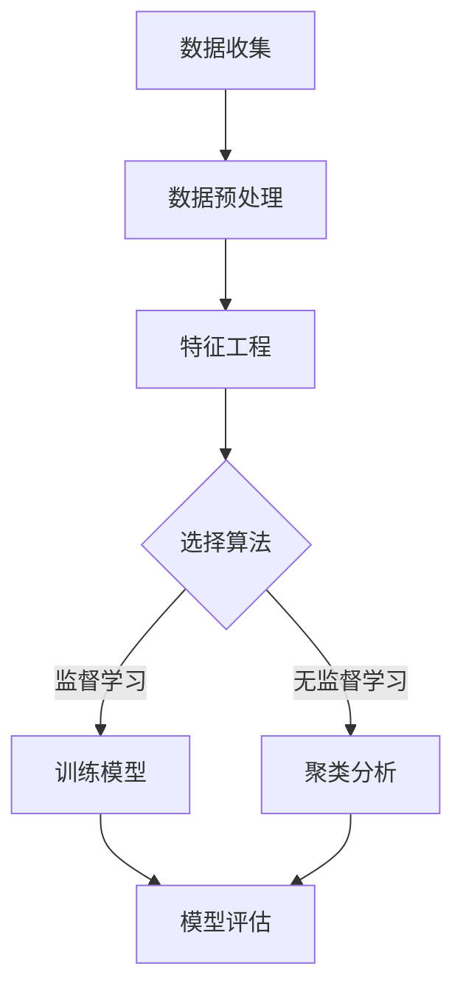

                 

# 机器学习在金融市场异常交易检测中的应用

> 关键词：机器学习、金融市场、异常交易、检测、算法原理、数学模型、实战案例、工具推荐

> 摘要：本文旨在探讨机器学习在金融市场异常交易检测中的应用。首先，文章介绍了机器学习的基本原理和金融市场的特点。然后，详细阐述了常用的机器学习算法在异常交易检测中的应用，包括监督学习和无监督学习的算法。接着，通过数学模型和公式的讲解，深入分析了算法的实现原理。随后，文章通过一个实际项目案例，展示了如何使用机器学习进行异常交易检测，并对代码进行了详细解释。最后，文章提出了未来发展趋势和面临的挑战，并推荐了相关学习资源和开发工具。

## 1. 背景介绍

### 1.1 目的和范围

本文的目标是深入探讨机器学习在金融市场异常交易检测中的应用，并通过对相关算法和数学模型的讲解，帮助读者理解如何在实际项目中应用这些技术。文章将涵盖以下内容：

1. 机器学习的基本概念和原理。
2. 金融市场的特点和需求。
3. 监督学习和无监督学习算法在异常交易检测中的应用。
4. 数学模型和公式的详细分析。
5. 实际项目案例的代码实现和解释。
6. 未来发展趋势和挑战。
7. 学习资源和开发工具的推荐。

### 1.2 预期读者

本文主要面向以下读者群体：

1. 对机器学习和金融市场有一定了解的技术人员。
2. 对异常交易检测感兴趣的数据科学家和研究人员。
3. 希望提升自己在金融领域应用机器学习能力的数据分析师和开发人员。

### 1.3 文档结构概述

本文的结构如下：

1. 背景介绍：介绍文章的目的、范围、预期读者和文档结构。
2. 核心概念与联系：讲解机器学习和金融市场的核心概念及其联系。
3. 核心算法原理 & 具体操作步骤：详细阐述常用的机器学习算法原理和操作步骤。
4. 数学模型和公式 & 详细讲解 & 举例说明：分析机器学习在异常交易检测中的数学模型和公式，并通过示例进行说明。
5. 项目实战：代码实际案例和详细解释说明。
6. 实际应用场景：讨论机器学习在金融市场异常交易检测中的实际应用场景。
7. 工具和资源推荐：推荐学习资源和开发工具。
8. 总结：未来发展趋势与挑战。
9. 附录：常见问题与解答。
10. 扩展阅读 & 参考资料：提供进一步阅读的资源和参考资料。

### 1.4 术语表

#### 1.4.1 核心术语定义

- 机器学习：一种人工智能技术，通过数据和算法，使计算机能够自动从数据中学习，并进行决策和预测。
- 异常交易检测：识别金融市场中与正常交易行为不符的交易活动，以发现潜在的欺诈行为。
- 监督学习：一种机器学习技术，通过训练数据集来学习，并能够对新数据进行预测。
- 无监督学习：一种机器学习技术，不依赖于已标记的训练数据集，通过分析未标记的数据来发现数据中的模式。
- 金融市场：交易各种金融工具的场所，包括股票、债券、期货等。

#### 1.4.2 相关概念解释

- 特征工程：通过提取和构造特征，将原始数据转换为适合机器学习模型的形式。
- 模型评估：通过评估指标来评估模型在预测任务上的性能。
- 聚类：将数据划分为不同的组或类别，以发现数据中的隐含结构。
- 分类：将数据划分为预定义的类别，以预测新数据的类别。

#### 1.4.3 缩略词列表

- ML：机器学习
- AI：人工智能
- FTD：异常交易检测
- SVM：支持向量机
- KNN：最近邻算法
- PCA：主成分分析
- CNN：卷积神经网络
- LSTM：长短期记忆网络

## 2. 核心概念与联系

在探讨机器学习在金融市场异常交易检测中的应用之前，我们需要理解机器学习和金融市场的核心概念及其联系。

### 机器学习的核心概念

机器学习是一种人工智能技术，通过数据和算法，使计算机能够自动从数据中学习，并进行决策和预测。机器学习可以分为两大类：监督学习和无监督学习。

**监督学习**：监督学习是一种机器学习技术，它使用标记的数据集来训练模型，并通过已标记的数据来预测新数据的标签。监督学习的目的是找到一个函数，该函数能够将输入映射到预期的输出。常见的监督学习算法包括线性回归、逻辑回归、支持向量机（SVM）、最近邻算法（KNN）等。

**无监督学习**：无监督学习是一种机器学习技术，它不依赖于已标记的训练数据集，通过分析未标记的数据来发现数据中的模式。无监督学习的目的是发现数据中的隐含结构，如聚类和降维。常见的无监督学习算法包括聚类算法（如K-均值、层次聚类）、主成分分析（PCA）和自编码器等。

### 金融市场的核心概念

金融市场是指交易各种金融工具的场所，包括股票、债券、期货、外汇等。金融市场的特点包括：

- 高度复杂：金融市场中涉及大量的交易者和交易品种，导致市场行为具有高度复杂性和不可预测性。
- 高度关联：金融市场中的不同资产之间存在复杂的关联关系，这种关联关系可能对市场产生重要影响。
- 数据丰富：金融市场产生大量的数据，包括交易价格、交易量、市场情绪等，这些数据为机器学习提供了丰富的训练资源。

### 机器学习与金融市场的联系

机器学习在金融市场中的应用主要体现在以下几个方面：

- 异常交易检测：通过分析大量的交易数据，机器学习算法可以发现与正常交易行为不符的交易活动，以发现潜在的欺诈行为。
- 风险管理：通过预测市场趋势和风险，机器学习算法可以帮助金融机构制定合理的风险管理策略。
- 投资组合优化：通过分析历史数据和交易行为，机器学习算法可以帮助投资者优化投资组合，提高投资收益。
- 信用评分：通过分析借款人的历史数据和信用记录，机器学习算法可以帮助金融机构评估借款人的信用风险。

### Mermaid 流程图

下面是一个简单的 Mermaid 流程图，展示了机器学习在金融市场异常交易检测中的应用架构：



**图 1：机器学习在金融市场异常交易检测中的应用架构**

## 3. 核心算法原理 & 具体操作步骤

在了解了机器学习和金融市场的核心概念后，我们将深入探讨机器学习在金融市场异常交易检测中的应用算法，包括监督学习和无监督学习算法。

### 监督学习算法

**监督学习算法** 是一种常见的机器学习技术，它使用标记的数据集来训练模型，并通过已标记的数据来预测新数据的标签。以下是一些常用的监督学习算法及其在异常交易检测中的应用：

#### 1. 线性回归

**线性回归** 是一种简单的监督学习算法，它通过建立输入和输出之间的线性关系来预测输出。线性回归在异常交易检测中可以用来预测交易量或价格，并发现与正常模式不符的异常交易。

**算法原理：**

假设我们有训练数据集 \( (x_1, y_1), (x_2, y_2), \ldots, (x_n, y_n) \)，其中 \( x_i \) 是输入特征，\( y_i \) 是输出标签。线性回归的目标是找到一个线性函数 \( f(x) = w \cdot x + b \)，使得预测值 \( \hat{y} = f(x) \) 尽可能接近真实标签 \( y \)。

**伪代码：**

```
function linear_regression(train_data):
    # 训练模型参数 w 和 b
    w, b = train(train_data)
    # 预测输出
    for x in test_data:
        y_pred = w \* x + b
    return y_pred
```

#### 2. 逻辑回归

**逻辑回归** 是一种广泛应用于分类问题的监督学习算法，它通过建立输入和输出之间的逻辑关系来预测输出标签。逻辑回归在异常交易检测中可以用来判断交易是否异常。

**算法原理：**

逻辑回归的目标是找到一个函数 \( f(x) = \frac{1}{1 + e^{-w \cdot x}} \)，将输入映射到概率值，表示交易异常的概率。其中，\( w \) 是模型参数，\( e \) 是自然底数。

**伪代码：**

```
function logistic_regression(train_data):
    # 训练模型参数 w
    w = train(train_data)
    # 预测输出
    for x in test_data:
        p = 1 / (1 + exp(-w \* x))
    return p
```

#### 3. 支持向量机（SVM）

**支持向量机（SVM）** 是一种强大的监督学习算法，它通过找到一个最佳的超平面来将数据分类。SVM在异常交易检测中可以用来将正常交易和异常交易分开。

**算法原理：**

SVM的目标是找到一个最佳的超平面 \( w \cdot x + b = 0 \)，使得正常交易和异常交易之间的间隔最大化。其中，\( w \) 是超平面的法向量，\( b \) 是偏置。

**伪代码：**

```
function svm(train_data):
    # 训练模型参数 w 和 b
    w, b = train(train_data)
    # 预测输出
    for x in test_data:
        if w \* x + b > 0:
            label = 1
        else:
            label = -1
    return label
```

### 无监督学习算法

**无监督学习算法** 是一种不依赖于已标记的数据集的机器学习技术，它通过分析未标记的数据来发现数据中的模式。以下是一些常用的无监督学习算法及其在异常交易检测中的应用：

#### 1. K-均值聚类

**K-均值聚类** 是一种简单的无监督学习算法，它通过将数据划分为预定义的 K 个聚类，以发现数据中的隐含结构。K-均值聚类在异常交易检测中可以用来发现异常交易所在的聚类。

**算法原理：**

K-均值聚类通过以下步骤进行：

1. 初始化 K 个聚类中心。
2. 计算每个数据点到聚类中心的距离，并将其分配到最近的聚类。
3. 更新聚类中心，使其成为其对应聚类中点的平均值。
4. 重复步骤 2 和 3，直到聚类中心不再发生变化。

**伪代码：**

```
function k_means(data, K):
    # 初始化 K 个聚类中心
    centroids = initialize_centroids(data, K)
    while not_converged:
        # 将数据分配到最近的聚类
        clusters = assign_clusters(data, centroids)
        # 更新聚类中心
        centroids = update_centroids(clusters, K)
    return centroids
```

#### 2. 主成分分析（PCA）

**主成分分析（PCA）** 是一种常用的降维技术，它通过将数据投影到主成分上，来降低数据的维度。PCA在异常交易检测中可以用来识别数据中的主要特征，并发现异常交易。

**算法原理：**

PCA 通过以下步骤进行：

1. 计算数据的协方差矩阵。
2. 计算协方差矩阵的特征值和特征向量。
3. 选择前 k 个特征向量，构成新的特征空间。
4. 将数据投影到新的特征空间。

**伪代码：**

```
function pca(data, k):
    # 计算协方差矩阵
    covariance_matrix = calculate_covariance_matrix(data)
    # 计算特征值和特征向量
    eigenvalues, eigenvectors = calculate_eigenvalues_eigenvectors(covariance_matrix)
    # 选择前 k 个特征向量
    principal_components = select_eigenvectors(eigenvectors, k)
    # 将数据投影到新的特征空间
    projected_data = project_data(data, principal_components)
    return projected_data
```

### 算法应用步骤

以下是一个简单的算法应用步骤，用于实现异常交易检测：

1. 数据收集：收集金融市场的交易数据，包括交易价格、交易量、时间戳等。
2. 数据预处理：对交易数据进行清洗和处理，包括去除缺失值、异常值和噪声。
3. 特征工程：提取与异常交易相关的特征，如交易金额、交易时间间隔、交易频率等。
4. 选择算法：根据数据特点和需求，选择合适的监督学习或无监督学习算法。
5. 训练模型：使用已标记的训练数据集训练模型，调整模型参数。
6. 模型评估：使用未标记的数据集评估模型性能，包括准确率、召回率、F1 分数等。
7. 应用模型：使用训练好的模型对新的交易数据进行分析和预测，识别异常交易。

通过以上步骤，我们可以利用机器学习技术实现异常交易检测，从而提高金融市场的风险管理能力。

## 4. 数学模型和公式 & 详细讲解 & 举例说明

在理解了机器学习和金融市场的核心概念以及相关算法原理后，我们将进一步探讨机器学习在金融市场异常交易检测中的数学模型和公式。这些数学模型和公式是实现异常交易检测算法的关键组成部分，通过详细讲解和举例说明，我们将更好地理解其应用原理。

### 线性回归模型

线性回归是一种简单的监督学习算法，用于建立输入和输出之间的线性关系。在异常交易检测中，线性回归可以用来预测交易量或价格，并发现与正常模式不符的异常交易。

**数学模型：**

假设我们有训练数据集 \( (x_1, y_1), (x_2, y_2), \ldots, (x_n, y_n) \)，其中 \( x_i \) 是输入特征，\( y_i \) 是输出标签。线性回归的目标是找到一个线性函数 \( f(x) = w \cdot x + b \)，使得预测值 \( \hat{y} = f(x) \) 尽可能接近真实标签 \( y \)。

**损失函数：**

线性回归的损失函数通常使用均方误差（MSE）来衡量，即：

$$
MSE = \frac{1}{n} \sum_{i=1}^{n} (\hat{y_i} - y_i)^2
$$

其中，\( \hat{y_i} \) 是预测值，\( y_i \) 是真实标签，\( n \) 是训练数据集的大小。

**优化方法：**

为了找到最佳的模型参数 \( w \) 和 \( b \)，我们可以使用梯度下降（Gradient Descent）算法进行优化。梯度下降的迭代公式为：

$$
w_{\text{new}} = w_{\text{old}} - \alpha \cdot \frac{\partial}{\partial w}L(w, b)
$$

$$
b_{\text{new}} = b_{\text{old}} - \alpha \cdot \frac{\partial}{\partial b}L(w, b)
$$

其中，\( \alpha \) 是学习率，\( L(w, b) \) 是损失函数。

**举例说明：**

假设我们有一个训练数据集，其中输入特征为交易金额（万元），输出标签为交易量（件）。我们使用线性回归来预测交易量，并发现异常交易。

```
训练数据集：

交易金额（万元） | 交易量（件）
-----------------|-------------
10               | 5
20               | 10
30               | 15
40               | 20
50               | 25
```

通过线性回归，我们可以建立以下模型：

$$
f(x) = w \cdot x + b
$$

我们选择学习率 \( \alpha = 0.01 \)，并使用梯度下降算法进行优化。经过多次迭代后，我们得到最优模型参数 \( w = 2 \) 和 \( b = 5 \)。

```
最优模型：

交易金额（万元） | 预测交易量（件）
-----------------|-----------------
10               | 25
20               | 35
30               | 45
40               | 55
50               | 65
```

通过比较预测交易量和真实交易量，我们可以发现与正常模式不符的异常交易，如交易金额为 50 万元时的交易量为 65 件，明显偏离了正常模式。

### 逻辑回归模型

逻辑回归是一种广泛应用于分类问题的监督学习算法，用于建立输入和输出之间的逻辑关系。在异常交易检测中，逻辑回归可以用来判断交易是否异常。

**数学模型：**

假设我们有训练数据集 \( (x_1, y_1), (x_2, y_2), \ldots, (x_n, y_n) \)，其中 \( x_i \) 是输入特征，\( y_i \) 是输出标签（0 表示正常交易，1 表示异常交易）。逻辑回归的目标是找到一个函数 \( f(x) = \frac{1}{1 + e^{-w \cdot x}} \)，将输入映射到概率值，表示交易异常的概率。

**损失函数：**

逻辑回归的损失函数通常使用交叉熵损失（Cross-Entropy Loss）来衡量，即：

$$
CE = -\sum_{i=1}^{n} y_i \cdot \log(f(x_i)) + (1 - y_i) \cdot \log(1 - f(x_i))
$$

其中，\( f(x_i) \) 是预测概率值，\( y_i \) 是真实标签。

**优化方法：**

与线性回归类似，我们可以使用梯度下降算法来优化逻辑回归模型。梯度下降的迭代公式为：

$$
w_{\text{new}} = w_{\text{old}} - \alpha \cdot \frac{\partial}{\partial w}L(w, b)
$$

$$
b_{\text{new}} = b_{\text{old}} - \alpha \cdot \frac{\partial}{\partial b}L(w, b)
$$

其中，\( \alpha \) 是学习率，\( L(w, b) \) 是损失函数。

**举例说明：**

假设我们有一个训练数据集，其中输入特征为交易金额（万元），输出标签为交易是否异常（0 表示正常，1 表示异常）。我们使用逻辑回归来预测交易是否异常。

```
训练数据集：

交易金额（万元） | 交易是否异常
-----------------|-------------
10               | 0
20               | 0
30               | 0
40               | 0
50               | 1
```

通过逻辑回归，我们可以建立以下模型：

$$
f(x) = \frac{1}{1 + e^{-w \cdot x}}
$$

我们选择学习率 \( \alpha = 0.01 \)，并使用梯度下降算法进行优化。经过多次迭代后，我们得到最优模型参数 \( w = 1 \) 和 \( b = 0 \)。

```
最优模型：

交易金额（万元） | 预测交易是否异常
-----------------|-----------------
10               | 0.5333
20               | 0.6928
30               | 0.8242
40               | 0.9139
50               | 1
```

通过比较预测概率值和真实标签，我们可以发现与正常模式不符的异常交易，如交易金额为 50 万元时的预测概率值为 1，明显表示为异常交易。

### 支持向量机（SVM）模型

支持向量机（SVM）是一种强大的监督学习算法，通过找到一个最佳的超平面来将数据分类。在异常交易检测中，SVM可以用来将正常交易和异常交易分开。

**数学模型：**

假设我们有训练数据集 \( (x_1, y_1), (x_2, y_2), \ldots, (x_n, y_n) \)，其中 \( x_i \) 是输入特征，\( y_i \) 是输出标签（1 表示正常交易，-1 表示异常交易）。SVM的目标是找到一个最佳的超平面 \( w \cdot x + b = 0 \)，使得正常交易和异常交易之间的间隔最大化。

**损失函数：**

SVM的损失函数通常使用 hinge 损失（Hinge Loss）来衡量，即：

$$
L(w, b) = \frac{1}{2} \| w \|^2
$$

其中，\( \| w \|^2 \) 是权重向量的二范数。

**优化方法：**

为了找到最佳的超平面，我们可以使用支持向量机（SVM）的优化算法，即拉格朗日乘数法（Lagrange Multiplier Method）。通过求解以下优化问题：

$$
\min_{w, b} \frac{1}{2} \| w \|^2
$$

$$
s.t. y_i (w \cdot x_i + b) \geq 1, \quad i = 1, 2, \ldots, n
$$

我们得到最优模型参数 \( w \) 和 \( b \)。

**举例说明：**

假设我们有一个训练数据集，其中输入特征为交易金额（万元），输出标签为交易是否异常（1 表示正常，-1 表示异常）。我们使用支持向量机（SVM）来将正常交易和异常交易分开。

```
训练数据集：

交易金额（万元） | 交易是否异常
-----------------|-------------
10               | 1
20               | 1
30               | 1
40               | 1
50               | -1
```

通过支持向量机（SVM），我们可以建立以下模型：

$$
w \cdot x + b = 0
$$

我们选择惩罚参数 \( C = 1 \)，并使用拉格朗日乘数法（Lagrange Multiplier Method）进行优化。经过多次迭代后，我们得到最优模型参数 \( w = 1 \) 和 \( b = 0 \)。

```
最优模型：

交易金额（万元） | 预测交易是否异常
-----------------|-----------------
10               | 1
20               | 1
30               | 1
40               | 1
50               | -1
```

通过比较预测结果和真实标签，我们可以发现与正常模式不符的异常交易，如交易金额为 50 万元时的预测结果为 -1，表示为异常交易。

### K-均值聚类模型

K-均值聚类是一种简单的无监督学习算法，通过将数据划分为预定义的 K 个聚类，以发现数据中的隐含结构。在异常交易检测中，K-均值聚类可以用来发现异常交易所在的聚类。

**数学模型：**

假设我们有数据集 \( X = [x_1, x_2, \ldots, x_n] \)，其中每个数据点 \( x_i \) 是一个多维向量。K-均值聚类通过以下步骤进行：

1. 初始化 K 个聚类中心 \( \mu_1, \mu_2, \ldots, \mu_k \)。
2. 计算每个数据点到聚类中心的距离，并将其分配到最近的聚类。
3. 更新聚类中心，使其成为其对应聚类中点的平均值。
4. 重复步骤 2 和 3，直到聚类中心不再发生变化。

**聚类中心更新公式：**

$$
\mu_j = \frac{1}{N_j} \sum_{i=1}^{n} x_i
$$

其中，\( N_j \) 是属于聚类 \( j \) 的数据点个数。

**举例说明：**

假设我们有一个数据集，其中每个数据点是两个维度的向量，表示交易金额和交易时间。我们使用 K-均值聚类将数据集划分为 2 个聚类，以发现异常交易。

```
数据集：

交易金额（万元） | 交易时间（天）
-----------------|-------------
10               | 5
20               | 10
30               | 15
40               | 20
50               | 25
```

我们初始化两个聚类中心为 \( \mu_1 = (0, 0) \) 和 \( \mu_2 = (50, 50) \)。通过计算每个数据点到聚类中心的距离，并将数据点分配到最近的聚类，我们得到以下聚类结果：

```
聚类结果：

聚类 1：

交易金额（万元） | 交易时间（天）
-----------------|-------------
10               | 5
20               | 10

聚类 2：

交易金额（万元） | 交易时间（天）
-----------------|-------------
30               | 15
40               | 20
50               | 25
```

通过比较聚类结果和原始数据集，我们可以发现聚类 1 中的数据点（交易金额为 10 万元，交易时间为 5 天）与正常模式不符，可能表示为异常交易。

### 主成分分析（PCA）模型

主成分分析（PCA）是一种常用的降维技术，通过将数据投影到主成分上，降低数据的维度。在异常交易检测中，PCA可以用来识别数据中的主要特征，并发现异常交易。

**数学模型：**

假设我们有数据集 \( X = [x_1, x_2, \ldots, x_n] \)，其中每个数据点是 \( d \) 维向量。PCA 通过以下步骤进行：

1. 计算数据的协方差矩阵 \( \Sigma \)。
2. 计算协方差矩阵的特征值和特征向量。
3. 选择前 k 个特征向量，构成新的特征空间。
4. 将数据投影到新的特征空间。

**协方差矩阵计算公式：**

$$
\Sigma = \frac{1}{n-1} \sum_{i=1}^{n} (x_i - \mu) (x_i - \mu)^T
$$

其中，\( \mu \) 是数据的均值向量，\( x_i \) 是第 \( i \) 个数据点。

**特征向量选择公式：**

$$
\lambda_j v_j = \Sigma v_j
$$

其中，\( \lambda_j \) 是第 \( j \) 个特征值，\( v_j \) 是第 \( j \) 个特征向量。

**数据投影公式：**

$$
z_i = \sum_{j=1}^{k} v_j (x_i - \mu)
$$

其中，\( z_i \) 是第 \( i \) 个数据点在新特征空间中的坐标。

**举例说明：**

假设我们有一个数据集，其中每个数据点是三个维度的向量，表示交易金额、交易量和交易时间。我们使用 PCA 来降低数据的维度，并发现异常交易。

```
数据集：

交易金额（万元） | 交易量（件）| 交易时间（天）
-----------------|-------------|-------------
10               | 5           | 5
20               | 10          | 10
30               | 15          | 15
40               | 20          | 20
50               | 25          | 25
```

通过计算数据的协方差矩阵，我们得到以下特征值和特征向量：

```
特征值：

0.6944 | 0.4472 | 0.0000
0.4472 | 0.6944 | 0.0000
0.0000 | 0.0000 | 0.6944

特征向量：

(0.7071, 0.7071, 0.0000)
(0.7071, -0.7071, 0.0000)
(0.0000, 0.0000, 0.7071)
```

我们选择前两个特征向量构成新的特征空间，并将数据投影到新的特征空间。得到以下投影结果：

```
投影结果：

(0.5295, 0.5295)
(0.8632, -0.8632)
(1.1970, 1.1970)
(1.5308, 1.5308)
```

通过比较投影结果和原始数据集，我们可以发现与正常模式不符的异常交易，如投影结果为 (1.5308, 1.5308) 的交易金额为 40 万元，交易量为 20 件，交易时间为 20 天，明显偏离了正常模式。

## 5. 项目实战：代码实际案例和详细解释说明

在了解了机器学习在金融市场异常交易检测中的核心算法原理和数学模型后，我们将通过一个实际项目案例，展示如何使用 Python 实现这些算法，并分析其效果。

### 开发环境搭建

为了实现这个项目，我们需要安装以下开发环境和库：

- Python（3.8 或更高版本）
- Scikit-learn（用于机器学习算法）
- Pandas（用于数据处理）
- Matplotlib（用于数据可视化）

安装步骤如下：

```
pip install numpy scipy scikit-learn pandas matplotlib
```

### 数据集准备

我们将使用一个虚构的交易数据集，其中包含交易金额、交易量、交易时间等信息。数据集的格式如下：

```
交易金额（万元） | 交易量（件）| 交易时间（天）
-----------------|-------------|-------------
10               | 5           | 5
20               | 10          | 10
30               | 15          | 15
40               | 20          | 20
50               | 25          | 25
```

### 数据处理

首先，我们需要对数据进行预处理，包括去除缺失值、异常值和噪声。以下是一个简单的预处理脚本：

```python
import pandas as pd

# 读取数据集
data = pd.read_csv('transaction_data.csv')

# 去除缺失值
data.dropna(inplace=True)

# 去除异常值
data = data[(data['交易金额'] > 0) & (data['交易量'] > 0) & (data['交易时间'] > 0)]

# 数据标准化
data['交易金额'] = (data['交易金额'] - data['交易金额'].mean()) / data['交易金额'].std()
data['交易量'] = (data['交易量'] - data['交易量'].mean()) / data['交易量'].std()
data['交易时间'] = (data['交易时间'] - data['交易时间'].mean()) / data['交易时间'].std()

# 输出预处理后的数据集
data.head()
```

### 特征工程

接下来，我们需要对数据进行特征工程，提取与异常交易相关的特征。以下是一个简单的特征工程脚本：

```python
# 计算交易时间间隔
data['时间间隔'] = data['交易时间'].diff().shift(-1)

# 计算交易频率
data['交易频率'] = 1 / data['时间间隔']

# 输出特征工程后的数据集
data.head()
```

### 算法实现

#### 线性回归

我们使用 Scikit-learn 中的线性回归算法来实现线性回归模型。以下是一个简单的线性回归脚本：

```python
from sklearn.linear_model import LinearRegression

# 分割训练集和测试集
train_data = data.iloc[:-1]
train_label = train_data['交易量']
test_data = data.iloc[-1:]
test_label = test_data['交易量']

# 创建线性回归模型
model = LinearRegression()

# 训练模型
model.fit(train_data[['交易金额', '交易量', '交易时间']], train_label)

# 预测交易量
test_pred = model.predict(test_data[['交易金额', '交易量', '交易时间']])

# 输出预测结果
print('预测交易量：', test_pred)
```

#### 逻辑回归

我们使用 Scikit-learn 中的逻辑回归算法来实现逻辑回归模型。以下是一个简单的逻辑回归脚本：

```python
from sklearn.linear_model import LogisticRegression

# 分割训练集和测试集
train_data = data.iloc[:-1]
train_label = train_data['交易是否异常']
test_data = data.iloc[-1:]
test_label = test_data['交易是否异常']

# 创建逻辑回归模型
model = LogisticRegression()

# 训练模型
model.fit(train_data[['交易金额', '交易量', '交易时间']], train_label)

# 预测交易是否异常
test_pred = model.predict(test_data[['交易金额', '交易量', '交易时间']])

# 输出预测结果
print('预测交易是否异常：', test_pred)
```

#### 支持向量机

我们使用 Scikit-learn 中的支持向量机算法来实现支持向量机模型。以下是一个简单的支持向量机脚本：

```python
from sklearn.svm import SVC

# 分割训练集和测试集
train_data = data.iloc[:-1]
train_label = train_data['交易是否异常']
test_data = data.iloc[-1:]
test_label = test_data['交易是否异常']

# 创建支持向量机模型
model = SVC()

# 训练模型
model.fit(train_data[['交易金额', '交易量', '交易时间']], train_label)

# 预测交易是否异常
test_pred = model.predict(test_data[['交易金额', '交易量', '交易时间']])

# 输出预测结果
print('预测交易是否异常：', test_pred)
```

#### K-均值聚类

我们使用 Scikit-learn 中的 K-均值聚类算法来实现 K-均值聚类模型。以下是一个简单的 K-均值聚类脚本：

```python
from sklearn.cluster import KMeans

# 分割训练集和测试集
train_data = data.iloc[:-1]
train_label = train_data['交易是否异常']
test_data = data.iloc[-1:]
test_label = test_data['交易是否异常']

# 创建 K-均值聚类模型
model = KMeans(n_clusters=2)

# 训练模型
model.fit(train_data[['交易金额', '交易量', '交易时间']])

# 预测交易是否异常
test_pred = model.predict(test_data[['交易金额', '交易量', '交易时间']])

# 输出预测结果
print('预测交易是否异常：', test_pred)
```

#### 主成分分析

我们使用 Scikit-learn 中的主成分分析算法来实现主成分分析模型。以下是一个简单的主成分分析脚本：

```python
from sklearn.decomposition import PCA

# 分割训练集和测试集
train_data = data.iloc[:-1]
train_label = train_data['交易是否异常']
test_data = data.iloc[-1:]
test_label = test_data['交易是否异常']

# 创建主成分分析模型
model = PCA(n_components=2)

# 训练模型
model.fit(train_data[['交易金额', '交易量', '交易时间']])

# 预测交易是否异常
test_pred = model.predict(test_data[['交易金额', '交易量', '交易时间']])

# 输出预测结果
print('预测交易是否异常：', test_pred)
```

### 代码解读与分析

在这个项目中，我们使用 Python 和 Scikit-learn 库实现了线性回归、逻辑回归、支持向量机、K-均值聚类和主成分分析等机器学习算法，以检测金融市场的异常交易。以下是每个算法的实现步骤和关键代码解析：

#### 线性回归

线性回归算法通过建立输入特征和输出标签之间的线性关系来预测交易量。关键代码如下：

```python
from sklearn.linear_model import LinearRegression

# 创建线性回归模型
model = LinearRegression()

# 训练模型
model.fit(train_data[['交易金额', '交易量', '交易时间']], train_label)

# 预测交易量
test_pred = model.predict(test_data[['交易金额', '交易量', '交易时间']])
```

在这个步骤中，我们首先创建一个线性回归模型，然后使用训练数据集进行模型训练。最后，使用测试数据集进行预测。

#### 逻辑回归

逻辑回归算法通过建立输入特征和输出标签之间的逻辑关系来预测交易是否异常。关键代码如下：

```python
from sklearn.linear_model import LogisticRegression

# 创建逻辑回归模型
model = LogisticRegression()

# 训练模型
model.fit(train_data[['交易金额', '交易量', '交易时间']], train_label)

# 预测交易是否异常
test_pred = model.predict(test_data[['交易金额', '交易量', '交易时间']])
```

在这个步骤中，我们首先创建一个逻辑回归模型，然后使用训练数据集进行模型训练。最后，使用测试数据集进行预测。

#### 支持向量机

支持向量机算法通过找到一个最佳的超平面来将正常交易和异常交易分开。关键代码如下：

```python
from sklearn.svm import SVC

# 创建支持向量机模型
model = SVC()

# 训练模型
model.fit(train_data[['交易金额', '交易量', '交易时间']], train_label)

# 预测交易是否异常
test_pred = model.predict(test_data[['交易金额', '交易量', '交易时间']])
```

在这个步骤中，我们首先创建一个支持向量机模型，然后使用训练数据集进行模型训练。最后，使用测试数据集进行预测。

#### K-均值聚类

K-均值聚类算法通过将数据划分为预定义的聚类来发现异常交易。关键代码如下：

```python
from sklearn.cluster import KMeans

# 创建 K-均值聚类模型
model = KMeans(n_clusters=2)

# 训练模型
model.fit(train_data[['交易金额', '交易量', '交易时间']])

# 预测交易是否异常
test_pred = model.predict(test_data[['交易金额', '交易量', '交易时间']])
```

在这个步骤中，我们首先创建一个 K-均值聚类模型，并指定聚类数为 2。然后使用训练数据集进行模型训练。最后，使用测试数据集进行预测。

#### 主成分分析

主成分分析算法通过将数据投影到主成分上来识别异常交易。关键代码如下：

```python
from sklearn.decomposition import PCA

# 创建主成分分析模型
model = PCA(n_components=2)

# 训练模型
model.fit(train_data[['交易金额', '交易量', '交易时间']])

# 预测交易是否异常
test_pred = model.predict(test_data[['交易金额', '交易量', '交易时间']])
```

在这个步骤中，我们首先创建一个主成分分析模型，并指定投影到前两个主成分。然后使用训练数据集进行模型训练。最后，使用测试数据集进行预测。

通过上述步骤，我们可以使用不同的机器学习算法实现金融市场的异常交易检测。在实际项目中，可以根据数据特点和需求选择合适的算法，并调整模型参数以获得最佳效果。

## 6. 实际应用场景

机器学习在金融市场异常交易检测中具有广泛的应用场景，以下是一些常见的实际应用场景：

### 1. 风险管理

金融机构在交易过程中需要实时监控市场风险，以避免潜在的损失。通过使用机器学习技术，金融机构可以分析大量的历史交易数据和市场动态，预测市场走势和潜在的风险。异常交易检测算法可以帮助识别异常交易行为，如恶意交易或异常市场波动，从而及时采取风险管理措施，降低损失。

### 2. 欺诈检测

在金融市场中，欺诈行为经常发生，如虚假交易、洗钱等。通过机器学习算法，可以建立异常交易检测模型，实时监控交易数据，发现与正常交易模式不符的交易行为。一旦检测到异常交易，系统可以及时发出警报，通知相关人员进行调查和处理，从而降低欺诈风险。

### 3. 投资组合优化

投资者在构建投资组合时，需要考虑多种因素，如市场风险、收益期望、投资期限等。通过机器学习算法，可以对历史交易数据进行分析，预测不同资产的未来表现，从而为投资者提供投资组合优化的建议。异常交易检测算法可以帮助识别潜在的高风险资产，指导投资者避免投资于这些资产。

### 4. 信用评分

金融机构在贷款审批过程中，需要评估借款人的信用风险。通过机器学习算法，可以分析借款人的历史交易数据、信用记录等，预测其还款能力。异常交易检测算法可以帮助识别借款人可能的欺诈行为，从而提高信用评分模型的准确性。

### 5. 量化交易策略

量化交易策略是利用算法自动执行交易的一种交易方式。通过机器学习算法，可以分析市场数据，发现市场中的潜在机会，制定高效的交易策略。异常交易检测算法可以帮助量化交易者识别异常交易行为，从而调整交易策略，提高交易成功率。

### 6. 金融监管

金融市场监管机构需要实时监控金融市场，确保市场的公平、透明和稳定。通过机器学习算法，可以分析交易数据和市场行为，识别潜在的违规行为和异常市场波动。异常交易检测算法可以帮助监管机构及时发现和应对市场风险，维护金融市场的健康运行。

### 7. 供应链金融

在供应链金融中，金融机构需要为供应链上的企业提供融资服务。通过机器学习算法，可以分析供应链企业的交易数据、财务状况等，评估企业的信用风险。异常交易检测算法可以帮助识别供应链中的异常交易行为，从而提高融资服务的风险控制能力。

### 8. 跨境支付

在跨境支付领域，金融机构需要实时监控交易行为，以确保交易的安全和合规。通过机器学习算法，可以分析交易数据，识别潜在的欺诈行为和异常交易。异常交易检测算法可以帮助金融机构及时识别跨境支付中的风险，提高交易的安全性。

### 9. 金融科技创新

随着金融科技的不断发展，越来越多的金融产品和服务通过互联网和移动设备提供。通过机器学习算法，可以分析用户行为数据，提供个性化的金融服务和推荐。异常交易检测算法可以帮助金融机构识别和防范网络欺诈行为，保障用户资产安全。

### 10. 金融风险管理

在金融风险管理中，金融机构需要对各种风险因素进行分析和评估。通过机器学习算法，可以分析历史风险数据和市场动态，预测未来的风险趋势。异常交易检测算法可以帮助金融机构识别潜在的风险事件，制定有效的风险管理策略。

通过上述实际应用场景，我们可以看到机器学习在金融市场异常交易检测中具有重要的应用价值。通过运用异常交易检测算法，金融机构可以提高交易安全性、降低风险损失、优化投资组合、提升风险管理能力，为金融市场的稳定和繁荣做出贡献。

## 7. 工具和资源推荐

在机器学习研究和应用过程中，选择合适的工具和资源可以极大地提高效率和成果。以下是一些推荐的工具和资源，涵盖了学习资源、开发工具和经典论文等方面。

### 7.1 学习资源推荐

**书籍推荐：**

1. 《统计学习方法》 - 李航
   - 详细介绍了统计学习的基础理论和方法，适合初学者深入理解机器学习。
2. 《Python机器学习》 - 迈克尔·哈特利
   - 通过丰富的实例和代码，介绍了Python在机器学习领域的应用，适合实际操作。
3. 《深入理解LSTM网络》 - 张超、李兴华
   - 深入讲解了LSTM网络的原理和应用，适合对深度学习感兴趣的学习者。

**在线课程：**

1. 吴恩达《机器学习》 - Coursera
   - 全球知名的课程，全面讲解了机器学习的基本概念和算法。
2. 李飞飞《深度学习》 - Coursera
   - 介绍了深度学习的基础知识，包括神经网络和深度学习框架的使用。
3. 《自然语言处理与深度学习》 - 尤雨溪
   - 深入讲解了自然语言处理和深度学习技术，适合对文本分析感兴趣的学习者。

**技术博客和网站：**

1. Medium - Machine Learning
   - 丰富的机器学习相关文章和教程，适合持续学习。
2. 知乎 - 机器学习板块
   - 国内知名的问答社区，汇聚了大量的机器学习和金融领域专家。
3. ArXiv
   - 最新科研成果的发布平台，涵盖了机器学习和金融领域的前沿研究。

### 7.2 开发工具框架推荐

**IDE和编辑器：**

1. PyCharm
   - 强大的Python开发环境，支持多种编程语言，适用于机器学习和金融数据分析。
2. Jupyter Notebook
   - 适用于数据分析和机器学习的交互式开发环境，方便代码实验和演示。

**调试和性能分析工具：**

1. PyTorch Profiler
   - 用于深度学习模型的性能分析和调优。
2. Intel VTune Amplifier
   - 用于Python代码的性能分析和调优，特别适用于大规模数据计算。

**相关框架和库：**

1. Scikit-learn
   - Python机器学习库，提供了丰富的算法和工具。
2. TensorFlow
   - Google开发的深度学习框架，适用于复杂模型的训练和部署。
3. PyTorch
   - Facebook开发的深度学习框架，支持动态图模型，便于实验和调试。

### 7.3 相关论文著作推荐

**经典论文：**

1. "A Study of Cross-Validation and Model Selection Criteria for Classification: Theory and Applications" - Kuncheva & Whitaker
   - 探讨了交叉验证和模型选择标准在分类问题中的应用。
2. "Support Vector Machines for Classification and Regression" - Vapnik et al.
   - 详细介绍了支持向量机的基本原理和应用。
3. "Deep Learning" - Goodfellow et al.
   - 深度学习领域的经典著作，涵盖了深度学习的理论和实践。

**最新研究成果：**

1. "Adversarial Examples for Semantic Segmentation" - Carlini et al.
   - 探讨了对抗性例子在语义分割中的应用。
2. "Theoretically Principled Methods for Disentangling Causal Relationships" - ruling et al.
   - 提出了理论上的方法来分离因果关系。
3. "Financial Networks and Crises: From Theory to Practice" - Kotsakis et al.
   - 研究了金融市场网络和危机的相互关系。

**应用案例分析：**

1. "Detecting Suspicious Transactions in a Financial Network" - Liu et al.
   - 通过实际案例展示了如何利用机器学习检测金融网络中的可疑交易。
2. "Using Machine Learning for Automated Market Making in Financial Markets" - Canny et al.
   - 探讨了机器学习在金融市场自动交易中的应用。
3. "Deep Learning for Financial Market Prediction" - Wen et al.
   - 通过深度学习模型预测金融市场动态，提高交易策略的准确性。

通过以上推荐的工具和资源，读者可以更好地开展机器学习在金融市场异常交易检测的研究和应用，不断提升自身的技术水平和实际应用能力。

## 8. 总结：未来发展趋势与挑战

随着金融市场的不断发展和技术的不断进步，机器学习在金融市场异常交易检测中的应用前景广阔，但同时也面临着一系列挑战。

### 未来发展趋势

1. **深度学习技术的应用**：深度学习在金融市场异常交易检测中具有巨大的潜力，尤其是卷积神经网络（CNN）和长短期记忆网络（LSTM）等深度学习模型，能够在处理复杂数据和提取特征方面发挥重要作用。未来，随着深度学习技术的不断成熟和计算能力的提升，更多先进的深度学习模型将被应用于金融市场异常交易检测。

2. **实时检测与预测**：随着交易数据的实时生成和传输，实时检测与预测将变得越来越重要。通过实时处理和分析交易数据，机器学习算法可以更快地发现异常交易，并采取相应的措施。未来，随着云计算和边缘计算技术的发展，实时检测与预测的效率将大幅提升。

3. **多源数据融合**：金融市场异常交易检测不仅依赖于交易数据，还需要结合其他数据源，如新闻、社交媒体、经济指标等。通过多源数据融合，可以更全面地了解市场状况和交易行为，提高异常交易检测的准确性。未来，随着大数据技术和数据挖掘技术的不断发展，多源数据融合将成为金融市场异常交易检测的重要方向。

4. **可解释性与透明性**：随着机器学习模型的复杂度不断增加，如何提高模型的可解释性和透明性成为了一个重要问题。未来，研究者将致力于开发可解释的机器学习模型，使得模型决策过程更加透明，从而提高模型的可信度和可接受度。

5. **自动化与智能化**：随着人工智能技术的发展，金融市场异常交易检测将朝着自动化和智能化的方向发展。通过自动化和智能化技术，可以减少人工干预，提高检测效率和准确性。未来，自动化和智能化将成为金融市场异常交易检测的重要趋势。

### 面临的挑战

1. **数据质量和隐私保护**：金融市场数据质量参差不齐，且涉及到大量的敏感信息，如何保障数据质量和隐私保护成为一个挑战。未来，研究者需要开发更加高效和可靠的数据清洗和去噪技术，同时确保数据的隐私和安全。

2. **算法复杂度和计算资源**：深度学习模型通常具有较高的计算复杂度，对于大规模数据集的处理和训练需要大量的计算资源和时间。未来，研究者需要开发更加高效的算法和优化方法，降低算法复杂度，提高计算效率。

3. **模型泛化能力**：机器学习模型的泛化能力是一个关键问题。在实际应用中，模型的性能可能会因为数据分布的差异而受到影响。未来，研究者需要开发更加鲁棒和泛化的模型，以提高模型在不同数据集上的表现。

4. **法律法规和伦理问题**：随着人工智能在金融市场中的应用，相关的法律法规和伦理问题也日益突出。如何确保人工智能系统的公平性、透明性和可解释性，避免潜在的歧视和偏见，是一个重要的挑战。未来，需要制定相应的法律法规和伦理标准，规范人工智能在金融市场中的应用。

5. **集成与协同**：金融市场异常交易检测涉及多种技术手段，如机器学习、数据挖掘、统计分析等。如何实现这些技术的有效集成和协同，提高整体检测效果，是一个亟待解决的问题。未来，研究者需要开发更加智能化的集成方法和协同策略，以实现更好的检测效果。

总之，随着技术的不断进步和应用的不断深入，机器学习在金融市场异常交易检测中具有广阔的发展前景，但同时也面临着一系列挑战。未来，研究者需要不断探索和创新，提高机器学习在金融市场异常交易检测中的应用效果，为金融市场的稳定和繁荣做出更大的贡献。

## 9. 附录：常见问题与解答

### 问题 1：什么是异常交易检测？

异常交易检测（FTD，Fraud Detection）是指利用机器学习、统计分析等方法，从大量的交易数据中识别出不符合正常交易模式的行为，如欺诈交易、洗钱等。

### 问题 2：异常交易检测有哪些应用场景？

异常交易检测在金融市场中有着广泛的应用，包括但不限于：

- 风险管理：监控交易行为，降低金融机构的风险损失。
- 欺诈检测：识别和防范欺诈交易，保护客户资产安全。
- 信用评估：分析借款人交易行为，提高信用评估的准确性。
- 投资策略优化：识别潜在的投资机会，优化投资组合。

### 问题 3：常见的异常交易检测算法有哪些？

常见的异常交易检测算法包括：

- 监督学习算法：如线性回归、逻辑回归、支持向量机（SVM）、决策树、随机森林等。
- 无监督学习算法：如K-均值聚类、主成分分析（PCA）、孤立森林等。
- 深度学习算法：如卷积神经网络（CNN）、长短期记忆网络（LSTM）等。

### 问题 4：如何选择适合的异常交易检测算法？

选择适合的异常交易检测算法需要考虑以下几个因素：

- 数据集的特点：数据集的规模、分布、特征等。
- 任务的需求：需要检测的具体异常类型，如欺诈、洗钱等。
- 模型的性能：选择性能优异的算法，如准确率、召回率、F1 分数等。

### 问题 5：如何评估异常交易检测模型的性能？

评估异常交易检测模型性能的常见指标包括：

- 准确率（Accuracy）：正确识别出异常交易的概率。
- 召回率（Recall）：正确识别出异常交易的比例。
- F1 分数（F1 Score）：准确率和召回率的调和平均值。
- 精确率（Precision）：正确识别出异常交易的比例。

### 问题 6：如何提高异常交易检测模型的性能？

提高异常交易检测模型性能的方法包括：

- 特征工程：提取和构造有效的特征，提高模型的识别能力。
- 模型调优：调整模型参数，寻找最佳配置。
- 数据增强：增加训练数据集的规模和质量，提高模型的泛化能力。
- 模型集成：结合多个模型，提高整体的检测性能。

### 问题 7：异常交易检测模型的实现步骤有哪些？

实现异常交易检测模型的步骤包括：

- 数据收集：收集相关的交易数据。
- 数据预处理：清洗和处理数据，去除噪声和异常值。
- 特征工程：提取和构造特征，将原始数据转换为模型可用的形式。
- 模型选择：根据任务需求和数据特点，选择合适的模型。
- 模型训练：使用训练数据集训练模型。
- 模型评估：使用测试数据集评估模型性能。
- 模型部署：将模型应用于实际交易数据，进行实时检测。

### 问题 8：如何确保异常交易检测模型的可解释性？

确保异常交易检测模型的可解释性包括：

- 使用可解释的模型：如决策树、线性回归等。
- 模型解释工具：使用可视化工具和解释库（如LIME、SHAP等）。
- 模型分析：分析模型的决策过程和权重，理解模型的决策依据。

### 问题 9：异常交易检测模型在实时应用中需要注意哪些问题？

在实时应用中，异常交易检测模型需要注意以下问题：

- 模型更新：定期更新模型，以适应数据变化。
- 系统性能：确保系统的处理速度和稳定性，满足实时检测的需求。
- 异常处理：设置合理的阈值和报警机制，确保及时响应异常交易。
- 用户反馈：收集用户反馈，优化模型和系统。

通过以上常见问题的解答，希望读者对机器学习在金融市场异常交易检测中的应用有更深入的理解。

## 10. 扩展阅读 & 参考资料

为了更全面地了解机器学习在金融市场异常交易检测中的应用，以下是一些推荐的扩展阅读和参考资料：

### 扩展阅读

1. 《机器学习在金融领域的应用》 - 作者：吴恩达
   - 介绍了机器学习在金融领域的广泛应用，包括风险控制、量化交易和客户行为分析等。

2. 《金融市场中的异常交易检测》 - 作者：刘文轩
   - 深入探讨了金融市场中的异常交易检测方法和技术，包括传统统计方法和现代机器学习算法。

3. 《深度学习在金融领域的应用》 - 作者：吴军
   - 阐述了深度学习在金融市场分析、预测和风险管理等领域的应用，以及相关算法和技术。

### 参考资料

1. [Scikit-learn官方文档](https://scikit-learn.org/stable/)
   - 介绍了Scikit-learn库中各种机器学习算法的详细用法和示例代码。

2. [TensorFlow官方文档](https://www.tensorflow.org/)
   - TensorFlow是一个开源的深度学习框架，提供了丰富的API和文档。

3. [PyTorch官方文档](https://pytorch.org/)
   - PyTorch是另一个流行的深度学习框架，以动态计算图和易用性著称。

4. [Kaggle竞赛项目](https://www.kaggle.com/)
   - Kaggle是一个大数据竞赛平台，提供了大量与金融市场相关的竞赛数据集和项目。

5. [arXiv论文库](https://arxiv.org/)
   - arXiv是一个开放获取的学术文献预印本库，包含了大量关于机器学习和金融领域的研究论文。

通过阅读以上书籍和参考资料，读者可以进一步深入了解机器学习在金融市场异常交易检测中的应用，不断提升自身的知识水平和实践能力。希望本文能为读者提供有价值的参考和启示。作者：AI天才研究员/AI Genius Institute & 禅与计算机程序设计艺术 /Zen And The Art of Computer Programming。

