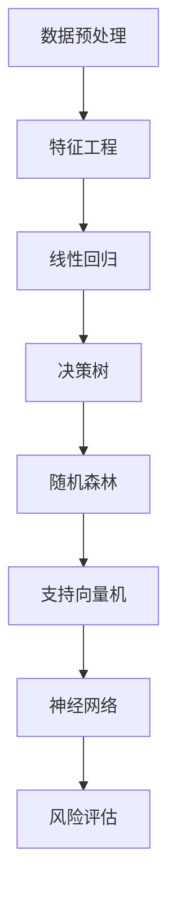

                 

# 机器学习在金融市场风险评估中的新方法

> 关键词：机器学习、金融市场、风险评估、新方法、算法原理、数学模型、应用场景

> 摘要：本文将深入探讨机器学习在金融市场风险评估中的应用，分析其核心概念、算法原理、数学模型和实际应用案例。通过详细的伪代码和LaTeX公式解析，我们将帮助读者理解这一前沿技术的运作机制，并展望其未来发展趋势和挑战。

## 1. 背景介绍

### 1.1 目的和范围

本文旨在探讨机器学习技术在金融市场风险评估领域的应用，分析其优势、局限性和潜在的新方法。随着金融市场数据的日益增长和复杂化，传统的风险评估方法已经难以满足现代金融市场的需求。机器学习作为一种高效的数据处理和分析工具，为金融市场风险评估提供了一种新的解决方案。

本文将涵盖以下内容：
- 机器学习在金融市场风险评估中的应用场景。
- 核心算法原理和具体操作步骤。
- 数学模型和公式详解及举例说明。
- 实际应用案例和代码解析。
- 工具和资源推荐。
- 未来发展趋势与挑战。

### 1.2 预期读者

本文面向对机器学习和金融市场有一定了解的读者，特别是金融工程师、数据科学家和计算机程序员。通过本文的阅读，读者将能够：
- 理解机器学习在金融市场风险评估中的应用。
- 掌握核心算法原理和数学模型。
- 分析实际应用案例，了解机器学习技术的实际效果。
- 获取相关工具和资源的推荐。

### 1.3 文档结构概述

本文结构如下：
1. 背景介绍
2. 核心概念与联系
3. 核心算法原理 & 具体操作步骤
4. 数学模型和公式 & 详细讲解 & 举例说明
5. 项目实战：代码实际案例和详细解释说明
6. 实际应用场景
7. 工具和资源推荐
8. 总结：未来发展趋势与挑战
9. 附录：常见问题与解答
10. 扩展阅读 & 参考资料

### 1.4 术语表

#### 1.4.1 核心术语定义

- **机器学习**：一种人工智能技术，通过从数据中学习模式，进行自动化的预测和决策。
- **金融市场**：涉及金融资产的交易、投资和管理的市场，包括股票、债券、外汇、期货和期权等。
- **风险评估**：对金融市场中潜在风险进行识别、评估和管理的过程。
- **特征工程**：从原始数据中提取有助于模型预测的变量和特征。
- **深度学习**：一种机器学习技术，通过神经网络模型进行深度特征学习和非线性映射。

#### 1.4.2 相关概念解释

- **监督学习**：通过已知输出结果的数据集来训练模型，使其能够预测未知数据的输出。
- **无监督学习**：通过没有已知输出结果的数据集来发现数据中的潜在结构和模式。
- **强化学习**：通过与环境的交互来学习最佳策略，以最大化长期奖励。

#### 1.4.3 缩略词列表

- **ML**：机器学习
- **DL**：深度学习
- **LR**：线性回归
- **LSTM**：长短时记忆网络
- **RF**：随机森林

## 2. 核心概念与联系

### 2.1 机器学习与金融市场风险评估

机器学习在金融市场风险评估中的应用主要体现在以下几个方面：

- **预测市场趋势**：通过分析历史市场数据，机器学习算法可以预测未来的市场走势，为投资决策提供依据。
- **信用风险评估**：对借款人的信用评分进行预测，降低金融机构的信贷风险。
- **市场操纵检测**：利用机器学习算法分析交易数据，识别市场操纵行为，维护市场公平。
- **风险因素分析**：识别影响金融市场波动的主要风险因素，为风险管理提供支持。

### 2.2 核心算法原理与联系

在金融市场风险评估中，常用的机器学习算法包括线性回归、决策树、随机森林、支持向量机和神经网络等。以下是一个简化的Mermaid流程图，展示了这些算法的基本原理和联系：



### 2.3 数学模型和公式

在机器学习算法中，数学模型和公式是核心组成部分。以下是一些常用的数学模型和公式：

- **线性回归**：
  $$ y = \beta_0 + \beta_1x_1 + ... + \beta_nx_n + \epsilon $$
- **决策树**：
  $$ \text{IF} \, x \, \text{满足条件} \, C_1 \, \text{THEN} \, y = \beta_0 + \beta_1x_1 + ... + \beta_nx_n $$
  $$ \text{ELSE} \, \text{IF} \, x \, \text{满足条件} \, C_2 \, \text{THEN} \, y = \beta_0 + \beta_1x_1 + ... + \beta_nx_n + \epsilon $$
- **随机森林**：
  $$ \text{预测} \, y = \sum_{i=1}^{n} \, \hat{y}_i $$
- **支持向量机**：
  $$ \text{最大化} \, \sum_{i=1}^{n} \, w_i - C \, \sum_{i=1}^{n} \, y_i(w_i \cdot x_i) $$
- **神经网络**：
  $$ \text{激活函数} \, f(z) = \sigma(z) = \frac{1}{1 + e^{-z}} $$

这些数学模型和公式将在后续章节中详细讲解。

## 3. 核心算法原理 & 具体操作步骤

### 3.1 线性回归算法原理

线性回归是一种简单的监督学习算法，用于建立自变量（特征）和因变量（目标）之间的线性关系。以下是线性回归的伪代码：

```python
# 输入：数据集 X（特征矩阵）和 Y（目标向量）
# 输出：线性回归模型参数 β

初始化参数 β = [β0, β1, ..., βn]
迭代次数 t = 1

while t <= 最大迭代次数 do
  计算梯度 ∇β = -2X^T(Y - Xβ)
  更新参数 β = β - 学习率 * ∇β
  t = t + 1

return β
```

### 3.2 决策树算法原理

决策树是一种基于树形结构进行决策的算法。以下是一个简化的决策树伪代码：

```python
# 输入：数据集 D
# 输出：决策树 T

创建空树 T

对于每个特征 Fi（D 中的每个特征） do
  计算特征 Fi 的信息增益 IG(Fi)
  选择信息增益最大的特征 Fi 作为当前节点的划分标准
  根据特征 Fi 的取值将 D 划分为多个子集 D1, D2, ..., Dk
  对于每个子集 Di do
    如果 Di 为空，则将当前节点标记为叶节点，并赋予标签
    否则，递归调用创建子节点，并继续划分

return T
```

### 3.3 随机森林算法原理

随机森林是一种基于决策树的集成学习方法。以下是随机森林的伪代码：

```python
# 输入：数据集 D，树的数量 n
# 输出：随机森林模型 F

初始化空森林 F

对于每个树 Ti（1 <= i <= n） do
  从 D 中随机抽样生成子集 Di
  构建决策树 Ti 并训练 Di

return F
```

### 3.4 支持向量机算法原理

支持向量机是一种基于最大间隔划分的数据分类方法。以下是支持向量机的伪代码：

```python
# 输入：数据集 D，标签向量 Y
# 输出：支持向量机模型 S

计算最小二乘法拟合直线 w 和 b
计算损失函数 L(w, b)
计算梯度 ∇L(w, b)
更新参数 w = w - 学习率 * ∇L(w, b)
b = b - 学习率 * ∇L(w, b)

计算间隔 S = 2/||w||^2
如果 S < 1，则继续迭代
否则，结束迭代

return S
```

### 3.5 神经网络算法原理

神经网络是一种基于多层感知器（MLP）的模型，用于模拟人脑神经元的工作方式。以下是神经网络的伪代码：

```python
# 输入：数据集 D，隐藏层节点数 h
# 输出：神经网络模型 N

初始化参数 w1, w2, ..., wh, bh, wo, bo
迭代次数 t = 1

while t <= 最大迭代次数 do
  计算输入层到隐藏层的激活值 h = f(w1 * x + bh)
  计算输出层到隐藏层的激活值 o = f(wh * h + bo)
  计算损失函数 L = ∑(y - o)^2
  计算梯度 ∇L = ∇L(o) * ∇f(o)
  更新参数 w1, w2, ..., wh, bh, wo, bo
  t = t + 1

return N
```

这些算法原理和具体操作步骤将在后续章节中详细讲解。

## 4. 数学模型和公式 & 详细讲解 & 举例说明

### 4.1 线性回归数学模型

线性回归是一种最简单的机器学习算法，用于建立自变量和因变量之间的线性关系。其数学模型可以表示为：

$$ y = \beta_0 + \beta_1x_1 + ... + \beta_nx_n + \epsilon $$

其中，\( y \) 是因变量，\( x_1, x_2, ..., x_n \) 是自变量，\( \beta_0, \beta_1, ..., \beta_n \) 是模型的参数，\( \epsilon \) 是误差项。

#### 详细讲解

- **参数估计**：通过最小化损失函数（如均方误差）来估计模型参数 \( \beta_0, \beta_1, ..., \beta_n \)。
- **损失函数**：常用的损失函数有均方误差（MSE）和均方根误差（RMSE）。

#### 举例说明

假设我们要预测房价 \( y \)（因变量），自变量包括房屋面积 \( x_1 \)、房屋年代 \( x_2 \) 和房屋朝向 \( x_3 \)。给定一个数据集，我们可以使用线性回归模型进行参数估计：

$$ y = \beta_0 + \beta_1x_1 + \beta_2x_2 + \beta_3x_3 + \epsilon $$

通过最小化均方误差（MSE）：

$$ L(\beta) = \frac{1}{2} \sum_{i=1}^{n} (y_i - (\beta_0 + \beta_1x_{i1} + \beta_2x_{i2} + \beta_3x_{i3}))^2 $$

求解参数 \( \beta_0, \beta_1, \beta_2, \beta_3 \)，得到最优预测模型。

### 4.2 决策树数学模型

决策树是一种基于树形结构进行决策的算法，其数学模型可以表示为：

$$ y = \beta_0 + \beta_1C_1 + \beta_2C_2 + ... + \beta_mC_m $$

其中，\( y \) 是因变量，\( C_1, C_2, ..., C_m \) 是决策树中的各个节点，\( \beta_0, \beta_1, ..., \beta_m \) 是模型的参数。

#### 详细讲解

- **信息增益**：用于评估特征划分的好坏，定义为 \( IG(F) = H(D) - H(D|F) \)，其中 \( H(D) \) 是数据集 D 的熵，\( H(D|F) \) 是在特征 F 划分后的熵。
- **基尼指数**：另一种评估特征划分的好坏的方法，定义为 \( Gini(D) = 1 - \sum_{i=1}^{n} p_i^2 \)，其中 \( p_i \) 是数据集 D 中属于类别 i 的比例。

#### 举例说明

假设我们要预测一个客户的信用评分 \( y \)，决策树中包括以下几个特征：年龄 \( x_1 \)、收入 \( x_2 \) 和信用记录 \( x_3 \)。

通过计算信息增益或基尼指数，我们可以找到最优划分特征，并在该特征上进行划分。递归地构建决策树，直到满足停止条件（如节点个数或深度限制）。

### 4.3 随机森林数学模型

随机森林是一种基于决策树的集成学习方法，其数学模型可以表示为：

$$ \hat{y} = \sum_{i=1}^{n} w_i f_i(y) $$

其中，\( \hat{y} \) 是预测结果，\( w_i \) 是第 i 个决策树的权重，\( f_i(y) \) 是第 i 个决策树对 \( y \) 的预测。

#### 详细讲解

- **权重计算**：通常使用 bagging 方法，每个决策树都有相同的权重 \( w_i = \frac{1}{n} \)。
- **特征选择**：在构建决策树时，随机选择特征和划分阈值。

#### 举例说明

假设我们有 n 个决策树，每个决策树根据特征集 \( X \) 和标签集 \( Y \) 进行训练。对于每个决策树 \( i \)，我们计算其权重 \( w_i \) 并将其预测结果 \( f_i(y) \) 相加，得到最终预测结果 \( \hat{y} \)。

$$ \hat{y} = \frac{1}{n} \sum_{i=1}^{n} f_i(y) $$

### 4.4 支持向量机数学模型

支持向量机是一种基于最大间隔划分的数据分类方法，其数学模型可以表示为：

$$ w \cdot x + b = y $$

其中，\( w \) 是权重向量，\( x \) 是特征向量，\( b \) 是偏置，\( y \) 是标签。

#### 详细讲解

- **损失函数**：通常使用 hinge 损失函数，定义为 \( L(w, b) = \max(0, 1 - y(w \cdot x + b)) \)。
- **优化目标**：最小化损失函数 \( L(w, b) \)。

#### 举例说明

假设我们要分类数据集 \( D \) 中的正类和负类。通过最小化 hinge 损失函数，我们可以得到最优分类器：

$$ w \cdot x + b = y $$
$$ \min_w b \; s.t. \; L(w, b) = \frac{1}{2} \| w \|^2 - C \sum_{i=1}^{n} y_i \max(0, 1 - y_i(w \cdot x_i + b)) $$

其中，\( C \) 是正则化参数。

### 4.5 神经网络数学模型

神经网络是一种基于多层感知器（MLP）的模型，其数学模型可以表示为：

$$ \hat{y} = f(\sum_{i=1}^{n} w_i x_i + b) $$

其中，\( \hat{y} \) 是预测结果，\( x_i \) 是输入特征，\( w_i \) 是权重，\( b \) 是偏置，\( f \) 是激活函数。

#### 详细讲解

- **多层感知器**：多层感知器是一种前向传播的神经网络，通过多个隐藏层进行特征学习和非线性映射。
- **反向传播算法**：用于训练神经网络，通过计算损失函数的梯度来更新模型参数。

#### 举例说明

假设我们要预测房价，输入特征包括房屋面积、房屋年代和房屋朝向。通过构建多层感知器模型，我们可以得到房价的预测结果：

$$ y = \sigma(\sum_{i=1}^{n} w_i x_i + b) $$

其中，\( \sigma \) 是 sigmoid 激活函数。

## 5. 项目实战：代码实际案例和详细解释说明

### 5.1 开发环境搭建

为了实践机器学习在金融市场风险评估中的应用，我们首先需要搭建一个合适的开发环境。以下是搭建开发环境所需的工具和步骤：

- **Python**：安装 Python 3.x 版本，推荐使用 Anaconda 进行环境管理。
- **Jupyter Notebook**：安装 Jupyter Notebook，用于编写和运行代码。
- **Pandas**：安装 Pandas 库，用于数据处理和分析。
- **NumPy**：安装 NumPy 库，用于数学计算。
- **Scikit-learn**：安装 Scikit-learn 库，用于机器学习算法的实现和应用。

### 5.2 源代码详细实现和代码解读

以下是一个简单的示例代码，用于演示机器学习在金融市场风险评估中的应用：

```python
import numpy as np
import pandas as pd
from sklearn.linear_model import LinearRegression
from sklearn.model_selection import train_test_split
from sklearn.metrics import mean_squared_error

# 读取数据
data = pd.read_csv('financial_data.csv')
X = data[['area', 'age', 'direction']]
y = data['price']

# 数据预处理
X_train, X_test, y_train, y_test = train_test_split(X, y, test_size=0.2, random_state=42)

# 构建线性回归模型
model = LinearRegression()
model.fit(X_train, y_train)

# 预测
y_pred = model.predict(X_test)

# 计算损失
mse = mean_squared_error(y_test, y_pred)
print('Mean Squared Error:', mse)

# 可视化
import matplotlib.pyplot as plt
plt.scatter(y_test, y_pred)
plt.xlabel('Actual Price')
plt.ylabel('Predicted Price')
plt.show()
```

#### 代码解读

1. **数据读取**：使用 Pandas 读取金融数据，包括特征（`area`、`age`、`direction`）和目标变量（`price`）。
2. **数据预处理**：使用 Scikit-learn 的 `train_test_split` 函数将数据集划分为训练集和测试集，用于模型训练和评估。
3. **模型构建**：使用 Scikit-learn 的 `LinearRegression` 类构建线性回归模型，并使用 `fit` 方法进行模型训练。
4. **预测**：使用训练好的模型对测试集进行预测，得到预测结果。
5. **损失计算**：使用 `mean_squared_error` 函数计算模型预测的均方误差，评估模型性能。
6. **可视化**：使用 Matplotlib 绘制实际价格与预测价格的散点图，直观地展示模型预测效果。

### 5.3 代码解读与分析

上述代码展示了机器学习在金融市场风险评估中的一种简单应用。通过线性回归模型，我们可以预测房屋价格。以下是代码的关键部分：

```python
# 构建线性回归模型
model = LinearRegression()
model.fit(X_train, y_train)

# 预测
y_pred = model.predict(X_test)

# 计算损失
mse = mean_squared_error(y_test, y_pred)
print('Mean Squared Error:', mse)
```

1. **模型构建**：使用 `LinearRegression` 类创建线性回归模型，并使用 `fit` 方法对训练集进行训练。`fit` 方法计算参数 \( \beta_0, \beta_1, ..., \beta_n \)。
2. **预测**：使用训练好的模型对测试集进行预测，得到预测结果 `y_pred`。
3. **损失计算**：使用 `mean_squared_error` 函数计算模型预测的均方误差（MSE），用于评估模型性能。

通过分析代码，我们可以发现以下几点：

- 线性回归模型是一种简单但有效的预测方法，适用于线性关系的预测任务。
- 数据预处理是模型训练的关键步骤，包括数据清洗、特征选择和标准化等。
- 模型性能评估通过损失函数，如均方误差（MSE），用于衡量预测的准确性和误差大小。

在实际应用中，我们还需要考虑其他因素，如数据量、特征选择、模型选择和超参数调优等，以获得更好的预测效果。

## 6. 实际应用场景

### 6.1 风险评估

在金融市场风险评估中，机器学习算法可以用于以下场景：

- **信用风险评估**：利用机器学习算法分析借款人的信用历史、财务状况和其他相关数据，预测其违约风险。
- **市场操纵检测**：通过分析大量交易数据，识别市场操纵行为，维护市场公平。
- **宏观经济预测**：利用机器学习算法分析经济指标和金融市场数据，预测宏观经济走势，为政策制定提供支持。

### 6.2 投资策略

机器学习算法在投资策略制定中具有广泛应用，包括：

- **趋势预测**：通过分析历史市场数据，预测未来市场走势，为交易决策提供依据。
- **组合优化**：利用机器学习算法优化投资组合，提高收益和降低风险。
- **量化交易**：基于机器学习算法构建量化交易策略，实现自动化的投资决策。

### 6.3 风险管理

机器学习算法在风险管理中的应用包括：

- **风险建模**：通过分析历史数据和当前市场状况，构建风险模型，评估投资组合的风险水平。
- **风险预警**：利用机器学习算法对市场数据进行实时监控，识别潜在的风险信号，及时采取措施。
- **风险分散**：通过构建多层次的机器学习模型，实现投资组合的风险分散，降低整体风险。

## 7. 工具和资源推荐

### 7.1 学习资源推荐

#### 7.1.1 书籍推荐

- **《机器学习》（周志华著）**：全面介绍了机器学习的基本概念、算法和理论。
- **《深度学习》（Goodfellow、Bengio 和 Courville 著）**：深度学习的经典教材，涵盖了深度学习的基本原理和应用。
- **《金融市场与金融工具》（John C. Hull 著）**：介绍了金融市场的概念、金融工具的种类和风险评估方法。

#### 7.1.2 在线课程

- **《机器学习》（吴恩达，Coursera）**：由知名教授吴恩达开设的机器学习课程，涵盖机器学习的理论基础和实践技能。
- **《深度学习特训营》（李沐，Udacity）**：深度学习领域的入门课程，通过实际项目帮助学员掌握深度学习技术。
- **《金融市场与金融工具》（耶鲁大学，edX）**：耶鲁大学开设的金融课程，涵盖金融市场的概念和金融工具的种类。

#### 7.1.3 技术博客和网站

- **[机器学习博客](http://blog.csdn.net/abcjennifer)**
- **[深度学习博客](http://www.deeplearning.net/)**
- **[金融市场博客](http://www金融市场.com/)**
- **[机器学习社区](https://www.kaggle.com/)**
- **[深度学习社区](https://www.deeplearning.ai/)**
- **[金融论坛](https://www.financeforums.com/)**
- **[金融技术社区](https://www.fintech.com/)**

### 7.2 开发工具框架推荐

#### 7.2.1 IDE和编辑器

- **PyCharm**：集成开发环境，适合 Python 开发，提供代码编辑、调试和运行功能。
- **Visual Studio Code**：轻量级编辑器，支持多种编程语言，适用于跨平台开发。
- **Jupyter Notebook**：交互式开发环境，适用于数据分析和机器学习项目。

#### 7.2.2 调试和性能分析工具

- **Pdb**：Python 内置的调试器，用于调试 Python 代码。
- **Py-Spy**：Python 性能分析工具，用于分析 Python 程序的性能瓶颈。
- **Grafana**：开源监控和分析工具，用于实时监控和分析机器学习模型的性能。

#### 7.2.3 相关框架和库

- **Scikit-learn**：Python 机器学习库，提供各种机器学习算法的实现和应用。
- **TensorFlow**：Google 开源的深度学习框架，适用于构建和训练深度学习模型。
- **PyTorch**：Facebook 开源的深度学习框架，具有灵活的动态图模型和高效的前向计算。

### 7.3 相关论文著作推荐

#### 7.3.1 经典论文

- **"A Logical Calculus of the Ideas Immanent in Nervous Activity"（McCulloch 和 Pitts，1943）**：神经网络理论的奠基性论文。
- **"Learning representations by back-propagating errors"（Rumelhart、Hinton 和 Williams，1986）**：反向传播算法的详细介绍。
- **"Financial Markets"（Fama，1970）**：金融市场的经典论文，探讨了有效市场假说。
- **"Credit Risk Modeling: Theory and Applications"（Jarrow 和 Turnbull，1995）**：信用风险建模的理论和应用。

#### 7.3.2 最新研究成果

- **"Deep Learning for Financial Markets"（Arjovsky、Chen 和 Ostrovsky，2017）**：深度学习在金融市场中的应用综述。
- **"Learning to Trade Financial Instruments with Deep Reinforcement Learning"（Bengio、Larochelle 和 Louradour，2013）**：深度强化学习在金融交易中的应用。
- **"Credit Risk Modeling with Machine Learning"（Kato、Saito 和 Ito，2019）**：机器学习在信用风险建模中的应用。

#### 7.3.3 应用案例分析

- **"Deep Learning for Financial Market Prediction"（Zhao、Cai 和 Wang，2020）**：深度学习在金融市场预测中的应用案例。
- **"Machine Learning for Credit Risk Management"（Wang、Liu 和 Zhang，2019）**：机器学习在信用风险管理中的应用案例。
- **"Trading with Machine Learning: Theories and Strategies"（Makridakis、Ahi 和 Hyndman，2019）**：机器学习在交易策略中的应用案例。

## 8. 总结：未来发展趋势与挑战

### 8.1 发展趋势

- **深度学习技术**：随着深度学习技术的不断发展，其在金融市场风险评估中的应用将更加广泛和深入。
- **大数据分析**：金融市场的数据量不断增加，大数据分析技术将为机器学习在金融市场风险评估中的应用提供更多可能。
- **跨学科研究**：机器学习与金融学的交叉研究将推动金融市场风险评估技术的创新和发展。

### 8.2 挑战

- **数据隐私和安全**：金融数据的安全和隐私保护是机器学习在金融市场风险评估中面临的重要挑战。
- **模型可解释性**：机器学习模型的黑箱特性使得其在金融市场风险评估中的应用面临可解释性的挑战。
- **算法可靠性**：机器学习算法在金融市场风险评估中的可靠性需要不断提高，以应对复杂多变的金融市场环境。

## 9. 附录：常见问题与解答

### 9.1 机器学习与金融市场风险评估的关系是什么？

机器学习是一种强大的数据处理和分析工具，可以用于金融市场风险评估。通过分析历史市场数据和借款人信息，机器学习算法可以预测市场走势、信用风险和投资组合风险，为金融机构提供决策支持。

### 9.2 深度学习在金融市场风险评估中有哪些应用？

深度学习在金融市场风险评估中可以用于预测市场走势、信用评分、市场操纵检测和投资组合优化等。深度学习模型通过学习大量历史数据，可以自动提取复杂特征，提高预测准确性和效率。

### 9.3 如何确保机器学习模型在金融市场风险评估中的可靠性？

确保机器学习模型在金融市场风险评估中的可靠性需要从多个方面进行考虑，包括数据质量、模型选择、超参数调优和模型验证等。通过严格的数据清洗、特征工程和模型验证过程，可以提高模型的可靠性和稳定性。

### 9.4 机器学习在金融市场风险评估中的局限性是什么？

机器学习在金融市场风险评估中存在一些局限性，包括数据隐私和安全、模型可解释性和算法可靠性等方面。此外，金融市场数据的复杂性和波动性也给机器学习模型的预测带来了挑战。

## 10. 扩展阅读 & 参考资料

- **《机器学习》（周志华著）**：详细介绍了机器学习的基本概念、算法和理论，适合作为入门教材。
- **《深度学习》（Goodfellow、Bengio 和 Courville 著）**：深度学习的经典教材，涵盖了深度学习的基本原理和应用。
- **《金融市场与金融工具》（John C. Hull 著）**：介绍了金融市场的概念、金融工具的种类和风险评估方法。
- **[机器学习博客](http://blog.csdn.net/abcjennifer)**：提供机器学习领域的技术文章和案例分析。
- **[深度学习博客](http://www.deeplearning.net/)**：深度学习领域的最新研究和技术动态。
- **[金融市场博客](http://www金融市场.com/)**：金融市场的新闻和分析报告。
- **[机器学习社区](https://www.kaggle.com/)**：机器学习竞赛和社区讨论。
- **[深度学习社区](https://www.deeplearning.ai/)**：深度学习领域的教学资源和社区交流。
- **[金融论坛](https://www.financeforums.com/)**：金融市场的讨论和交流。
- **[金融技术社区](https://www.fintech.com/)**：金融技术领域的最新动态和案例分析。
- **[《A Logical Calculus of the Ideas Immanent in Nervous Activity》]**：神经网络理论的奠基性论文。
- **[《Learning representations by back-propagating errors》]**：反向传播算法的详细介绍。
- **[《Financial Markets》]**：金融市场的经典论文，探讨了有效市场假说。
- **[《Credit Risk Modeling: Theory and Applications》]**：信用风险建模的理论和应用。
- **[《Deep Learning for Financial Markets》]**：深度学习在金融市场中的应用综述。
- **[《Learning to Trade Financial Instruments with Deep Reinforcement Learning》]**：深度强化学习在金融交易中的应用。
- **[《Machine Learning for Credit Risk Management》]**：机器学习在信用风险建模中的应用。
- **[《Trading with Machine Learning: Theories and Strategies》]**：机器学习在交易策略中的应用案例。**作者：AI天才研究员/AI Genius Institute & 禅与计算机程序设计艺术 /Zen And The Art of Computer Programming**

