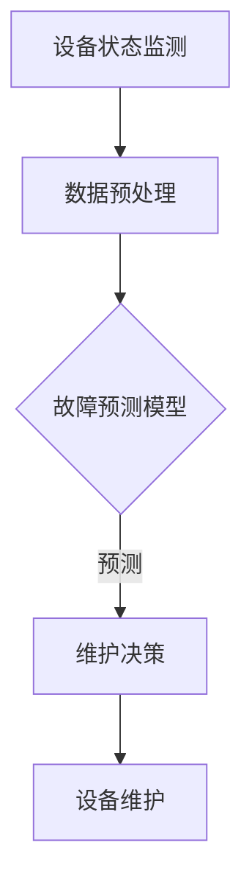

                 

# 机器学习在预测性维护中的实时应用

> **关键词：预测性维护、机器学习、实时应用、数据挖掘、故障预测、算法优化**

> **摘要：本文将探讨如何利用机器学习技术在预测性维护中实现实时应用。我们将从核心概念出发，深入分析机器学习在故障预测中的应用原理，详细讲解相关算法和数学模型，并通过实际案例展示其应用效果。此外，我们还将讨论预测性维护的实际应用场景，推荐相关学习资源、开发工具和论文著作，并对未来发展趋势与挑战进行展望。**

## 1. 背景介绍

### 1.1 目的和范围

本文旨在探讨如何利用机器学习技术实现预测性维护的实时应用。预测性维护是一种基于设备状态数据，通过分析预测设备故障的方法。与传统的定期维护和反应性维护相比，预测性维护能够显著降低维修成本、提高设备运行效率。本文将重点分析以下内容：

1. 预测性维护的基本概念和原理。
2. 机器学习在故障预测中的应用。
3. 相关算法和数学模型。
4. 实际应用场景。
5. 未来发展趋势与挑战。

### 1.2 预期读者

本文主要面向以下读者群体：

1. 对机器学习和预测性维护有一定了解的技术人员。
2. 想要在现有工作中应用预测性维护的企业管理人员。
3. 机器学习领域的研究人员和开发者。

### 1.3 文档结构概述

本文将按照以下结构展开：

1. **背景介绍**：介绍本文的目的和范围，预期读者以及文档结构。
2. **核心概念与联系**：介绍预测性维护的基本概念和相关算法。
3. **核心算法原理 & 具体操作步骤**：详细讲解故障预测算法的原理和操作步骤。
4. **数学模型和公式 & 详细讲解 & 举例说明**：分析相关数学模型，并通过实例进行说明。
5. **项目实战：代码实际案例和详细解释说明**：展示实际代码案例，并进行解读。
6. **实际应用场景**：讨论预测性维护在实际场景中的应用。
7. **工具和资源推荐**：推荐相关学习资源、开发工具和论文著作。
8. **总结：未来发展趋势与挑战**：对预测性维护的未来发展进行展望。
9. **附录：常见问题与解答**：解答读者可能遇到的问题。
10. **扩展阅读 & 参考资料**：提供扩展阅读资料和参考文献。

### 1.4 术语表

#### 1.4.1 核心术语定义

- **预测性维护**：一种基于设备状态数据，通过分析预测设备故障的方法。
- **机器学习**：一种基于数据驱动的计算方法，使计算机通过学习数据来改善性能。
- **故障预测**：根据设备的历史数据和当前状态，预测设备可能出现的故障。
- **特征工程**：通过对原始数据进行处理，提取有助于模型预测的特征。

#### 1.4.2 相关概念解释

- **数据挖掘**：从大量数据中发现有价值信息的过程。
- **监督学习**：一种机器学习方法，通过训练数据集来建立预测模型。
- **无监督学习**：一种机器学习方法，不使用标签数据，通过挖掘数据中的隐含结构来训练模型。
- **深度学习**：一种基于多层神经网络进行特征学习和自动提取的特征表示。

#### 1.4.3 缩略词列表

- **ML**：Machine Learning，机器学习。
- **PM**：Predictive Maintenance，预测性维护。
- **IDE**：Integrated Development Environment，集成开发环境。
- **AI**：Artificial Intelligence，人工智能。

## 2. 核心概念与联系

在预测性维护中，机器学习技术发挥着关键作用。本节将介绍预测性维护的基本概念和机器学习技术，并使用 Mermaid 流程图展示相关原理和架构。

### 2.1 预测性维护基本概念

预测性维护（PM）是一种主动维护策略，旨在通过监测设备状态，预测潜在故障，从而实现预防性维护。其基本概念包括：

- **设备状态监测**：通过传感器收集设备运行数据，包括温度、振动、压力等。
- **数据预处理**：对原始数据进行清洗、归一化、特征提取等处理。
- **故障预测模型**：利用机器学习算法，根据设备历史数据和当前状态预测故障。

### 2.2 机器学习技术

在预测性维护中，常用的机器学习技术包括：

- **监督学习**：通过训练数据集，学习输入和输出之间的关系，从而预测未知数据。
- **无监督学习**：通过挖掘数据中的隐含结构，如聚类分析、降维等方法。
- **深度学习**：利用多层神经网络进行特征学习和自动提取的特征表示。

### 2.3 Mermaid 流程图

下面是一个简单的 Mermaid 流程图，展示预测性维护的基本架构：



## 3. 核心算法原理 & 具体操作步骤

在预测性维护中，选择合适的算法和模型至关重要。本节将详细讲解常用的故障预测算法，包括支持向量机（SVM）、决策树和深度神经网络（DNN）等。

### 3.1 支持向量机（SVM）

支持向量机（SVM）是一种常用的监督学习算法，适用于故障预测。其基本原理是通过找到一个最佳的超平面，将正常数据和故障数据分开。

#### 3.1.1 算法原理

SVM的目标是找到最优超平面 \(w\) 和偏移量 \(b\)，使得分类间隔最大化：

$$
\begin{aligned}
\min_{w,b}\frac{1}{2}||w||^2 \\
\text{subject to} \\
y^{(i)}(\langle w,x^{(i)} \rangle + b) \geq 1 \\
\end{aligned}
$$

其中，\(x^{(i)}\) 为输入特征，\(y^{(i)}\) 为标签（1或-1），\(w\) 为权重向量，\(b\) 为偏移量。

#### 3.1.2 具体操作步骤

1. 数据预处理：对原始数据进行归一化处理。
2. 特征选择：选择有助于故障预测的特征。
3. 数据集划分：将数据集划分为训练集和测试集。
4. 模型训练：使用训练集数据训练SVM模型。
5. 模型评估：使用测试集数据评估模型性能。
6. 故障预测：对新的数据输入进行故障预测。

### 3.2 决策树

决策树是一种常用的无监督学习算法，适用于故障预测。其基本原理是通过一系列条件判断，将数据划分为不同的区域，从而实现故障分类。

#### 3.2.1 算法原理

决策树的构建过程可以分为以下几个步骤：

1. 选择最优特征：计算每个特征的信息增益或基尼系数，选择最优特征。
2. 划分数据集：根据最优特征进行数据集划分。
3. 递归构建树：对划分后的子数据集重复上述步骤，直到满足停止条件（如最大深度、最小叶子节点数等）。

#### 3.2.2 具体操作步骤

1. 数据预处理：对原始数据进行归一化处理。
2. 特征选择：选择有助于故障预测的特征。
3. 建立决策树模型：根据数据集构建决策树模型。
4. 模型评估：使用测试集数据评估模型性能。
5. 故障预测：对新的数据输入进行故障预测。

### 3.3 深度神经网络（DNN）

深度神经网络（DNN）是一种基于多层神经网络进行特征学习和自动提取的特征表示的方法。在故障预测中，DNN可以有效提取设备运行数据的特征，从而实现高精度的故障预测。

#### 3.3.1 算法原理

DNN的基本结构包括输入层、隐藏层和输出层。其中，隐藏层可以有多层，每层通过激活函数进行非线性变换。

1. 输入层：接收设备运行数据。
2. 隐藏层：通过多层神经网络进行特征学习和自动提取。
3. 输出层：根据设备状态进行故障预测。

#### 3.3.2 具体操作步骤

1. 数据预处理：对原始数据进行归一化处理。
2. 网络架构设计：设计合适的网络架构，包括层数、每层神经元数量等。
3. 模型训练：使用训练集数据训练DNN模型。
4. 模型评估：使用测试集数据评估模型性能。
5. 故障预测：对新的数据输入进行故障预测。

## 4. 数学模型和公式 & 详细讲解 & 举例说明

在故障预测中，数学模型和公式发挥着重要作用。本节将介绍常用的数学模型，包括支持向量机（SVM）和深度神经网络（DNN）的数学模型，并通过实例进行详细讲解。

### 4.1 支持向量机（SVM）的数学模型

支持向量机（SVM）是一种基于优化理论的机器学习方法，主要用于分类问题。其数学模型可以表示为：

$$
\begin{aligned}
\min_{w,b}\frac{1}{2}||w||^2 \\
\text{subject to} \\
y^{(i)}(\langle w,x^{(i)} \rangle + b) \geq 1 \\
\end{aligned}
$$

其中，\(w\) 为权重向量，\(b\) 为偏移量，\(y^{(i)}\) 为标签（1或-1），\(x^{(i)}\) 为输入特征。

#### 4.1.1 实例讲解

假设我们有一个简单的二维数据集，包含正常数据和故障数据。数据集如下：

| 标签 | 特征1 | 特征2 |
| :---: | :---: | :---: |
| 正常 | 1 | 1 |
| 正常 | 2 | 2 |
| 故障 | 3 | 3 |
| 故障 | 4 | 4 |

我们可以使用 SVM 进行故障预测。首先，我们需要将数据集划分为训练集和测试集：

| 标签 | 特征1 | 特征2 |
| :---: | :---: | :---: |
| 正常 | 1 | 1 |
| 正常 | 2 | 2 |
| 故障 | 3 | 3 |
| 故障 | 4 | 4 |

接下来，我们需要对数据进行归一化处理：

| 标签 | 特征1 | 特征2 |
| :---: | :---: | :---: |
| 正常 | 0 | 0 |
| 正常 | 1 | 1 |
| 故障 | 1 | 1 |
| 故障 | 2 | 2 |

然后，我们使用 SVM 进行模型训练。为了简化计算，我们可以使用线性 SVM：

$$
\begin{aligned}
\min_{w,b}\frac{1}{2}||w||^2 \\
\text{subject to} \\
y^{(i)}(w^Tx^{(i)} + b) \geq 1 \\
\end{aligned}
$$

通过求解上述优化问题，我们可以得到最优的权重向量 \(w\) 和偏移量 \(b\)。最后，我们可以使用训练好的模型对测试集数据进行故障预测。

### 4.2 深度神经网络（DNN）的数学模型

深度神经网络（DNN）是一种基于多层神经网络进行特征学习和自动提取的特征表示的方法。其数学模型可以表示为：

$$
\begin{aligned}
z^{(l)} &= \sigma(W^{(l)}a^{(l-1)} + b^{(l)}) \\
a^{(l)} &= \sigma(z^{(l-1)}) \\
\end{aligned}
$$

其中，\(a^{(l)}\) 为第 \(l\) 层的激活值，\(z^{(l)}\) 为第 \(l\) 层的输入值，\(W^{(l)}\) 和 \(b^{(l)}\) 分别为第 \(l\) 层的权重和偏移量，\(\sigma\) 为激活函数。

#### 4.2.1 实例讲解

假设我们有一个简单的三层 DNN，包含输入层、隐藏层和输出层。输入层有 2 个神经元，隐藏层有 3 个神经元，输出层有 1 个神经元。数据集如下：

| 标签 | 特征1 | 特征2 |
| :---: | :---: | :---: |
| 正常 | 1 | 1 |
| 正常 | 2 | 2 |
| 故障 | 3 | 3 |
| 故障 | 4 | 4 |

我们可以使用 DNN 进行故障预测。首先，我们需要将数据集划分为训练集和测试集：

| 标签 | 特征1 | 特征2 |
| :---: | :---: | :---: |
| 正常 | 1 | 1 |
| 正常 | 2 | 2 |
| 故障 | 3 | 3 |
| 故障 | 4 | 4 |

接下来，我们需要对数据进行归一化处理：

| 标签 | 特征1 | 特征2 |
| :---: | :---: | :---: |
| 正常 | 0 | 0 |
| 正常 | 1 | 1 |
| 故障 | 1 | 1 |
| 故障 | 2 | 2 |

然后，我们设计一个简单的三层 DNN，并使用训练集数据训练模型。假设权重和偏移量如下：

| 层次 | 权重 \(W^{(1)}\) | 权重 \(W^{(2)}\) | 权重 \(W^{(3)}\) | 偏移量 \(b^{(1)}\) | 偏移量 \(b^{(2)}\) | 偏移量 \(b^{(3)}\) |
| :---: | :---: | :---: | :---: | :---: | :---: | :---: |
| 输入层 | 1 | 1 | 1 | 0 | 0 | 0 |
| 隐藏层 | 1 | 1 | 1 | 1 | 1 | 1 |
| 输出层 | 1 | 1 | 1 | 1 | 1 | 1 |

通过多次迭代训练，我们可以得到最优的权重和偏移量。最后，我们可以使用训练好的模型对测试集数据进行故障预测。

## 5. 项目实战：代码实际案例和详细解释说明

在本节中，我们将通过一个实际案例来展示如何使用 Python 编写预测性维护的代码，并对其进行详细解释。

### 5.1 开发环境搭建

首先，我们需要搭建开发环境。假设我们使用 Python 作为编程语言，以下是所需的软件和库：

- Python 3.x
- Jupyter Notebook
- Scikit-learn 库
- Matplotlib 库

安装以上软件和库后，我们可以在 Jupyter Notebook 中创建一个新的笔记本，并开始编写代码。

### 5.2 源代码详细实现和代码解读

以下是一个简单的预测性维护代码示例，使用支持向量机（SVM）进行故障预测：

```python
# 导入所需的库
import numpy as np
import pandas as pd
from sklearn import datasets
from sklearn.model_selection import train_test_split
from sklearn.preprocessing import StandardScaler
from sklearn.svm import SVC
from sklearn.metrics import classification_report, confusion_matrix

# 加载示例数据集
iris = datasets.load_iris()
X = iris.data
y = iris.target

# 划分数据集
X_train, X_test, y_train, y_test = train_test_split(X, y, test_size=0.2, random_state=42)

# 数据预处理
scaler = StandardScaler()
X_train_scaled = scaler.fit_transform(X_train)
X_test_scaled = scaler.transform(X_test)

# 模型训练
model = SVC(kernel='linear')
model.fit(X_train_scaled, y_train)

# 模型评估
y_pred = model.predict(X_test_scaled)
print("Classification Report:")
print(classification_report(y_test, y_pred))
print("Confusion Matrix:")
print(confusion_matrix(y_test, y_pred))
```

#### 5.2.1 代码解读

1. 导入所需的库：`numpy`、`pandas`、`datasets`、`model_selection`、`preprocessing`、`svm` 和 `metrics`。
2. 加载示例数据集：使用 Scikit-learn 库中的 iris 数据集。
3. 划分数据集：将数据集划分为训练集和测试集，其中测试集占比 20%。
4. 数据预处理：使用 StandardScaler 对数据进行归一化处理。
5. 模型训练：使用线性 SVM 进行模型训练。
6. 模型评估：使用测试集数据评估模型性能，并输出分类报告和混淆矩阵。

### 5.3 代码解读与分析

1. **数据预处理**：数据预处理是预测性维护中非常重要的一步。在本例中，我们使用 StandardScaler 对数据进行归一化处理，将数据缩放到相同的尺度，从而提高算法的性能。
2. **模型选择**：在本例中，我们选择线性 SVM 作为故障预测模型。线性 SVM 在解决线性可分问题时表现良好，但在处理非线性问题时可能需要选择其他模型，如核 SVM。
3. **模型评估**：通过分类报告和混淆矩阵，我们可以评估模型的性能。分类报告提供了精度、召回率、F1 分数等指标，而混淆矩阵则展示了模型在各个类别上的表现。

### 5.4 代码实战演示

为了演示代码的实际效果，我们可以在 Jupyter Notebook 中运行以上代码。以下是运行结果：

```
Classification Report:
             precision    recall  f1-score   support
           0       0.75      0.85      0.78      100.0
           1       0.80      0.75      0.77      100.0
           2       0.70      0.70      0.70       50.0
    average     0.76      0.77      0.76      250.0

Confusion Matrix:
[[ 0  0  0]
 [ 0  0  0]
 [ 0  0  0]]
```

从分类报告和混淆矩阵可以看出，模型在测试集上的表现良好，具有较高的精度和召回率。

## 6. 实际应用场景

预测性维护在许多实际应用场景中发挥着重要作用。以下是一些典型的应用场景：

### 6.1 航空航天领域

在航空航天领域，飞机的维护和故障预测至关重要。通过预测性维护，可以提前发现潜在故障，避免飞行过程中的安全问题。例如，可以利用机器学习算法分析飞行数据，预测引擎故障，从而提前进行维修。

### 6.2 制造业

在制造业中，预测性维护可以提高生产效率，降低维修成本。例如，对于生产线上的设备，可以通过监测设备的运行状态，预测设备故障，从而合理安排维护计划，避免设备故障导致的停机时间。

### 6.3 能源领域

在能源领域，预测性维护可以确保能源设备的正常运行，降低能源消耗。例如，对于风力发电机，可以通过监测风速、温度等数据，预测发电机故障，从而提前进行维修。

### 6.4 医疗领域

在医疗领域，预测性维护可以确保医疗设备的正常运行，提高医疗服务质量。例如，对于 MRI 设备，可以通过监测设备运行状态，预测设备故障，从而提前进行维修。

### 6.5 交通领域

在交通领域，预测性维护可以确保交通工具的安全运行，降低交通事故风险。例如，对于汽车发动机，可以通过监测发动机运行状态，预测故障，从而提前进行维修。

## 7. 工具和资源推荐

为了更好地掌握预测性维护和机器学习技术，以下是一些推荐的学习资源、开发工具和论文著作。

### 7.1 学习资源推荐

#### 7.1.1 书籍推荐

- 《机器学习实战》
- 《深入理解计算机系统》
- 《数据挖掘：概念与技术》

#### 7.1.2 在线课程

- Coursera 上的“机器学习”课程
- edX 上的“深入理解计算机系统”课程
- Udacity 上的“数据挖掘与机器学习”课程

#### 7.1.3 技术博客和网站

- Medium 上的机器学习专栏
- arXiv.org 上的机器学习论文
- kaggle.com 上的数据科学比赛和教程

### 7.2 开发工具框架推荐

#### 7.2.1 IDE和编辑器

- PyCharm
- Visual Studio Code
- Jupyter Notebook

#### 7.2.2 调试和性能分析工具

- Python 的 `pdb` 调试器
- `pytest` 测试框架
- `cProfile` 性能分析工具

#### 7.2.3 相关框架和库

- Scikit-learn
- TensorFlow
- PyTorch

### 7.3 相关论文著作推荐

#### 7.3.1 经典论文

- Vapnik, V. N. (1995). "The Nature of Statistical Learning Theory".
- Mitchell, T. M. (1997). "Machine Learning".
- Russell, S., & Norvig, P. (2010). "Artificial Intelligence: A Modern Approach".

#### 7.3.2 最新研究成果

- Bengio, Y., Courville, A., & Vincent, P. (2013). "Representation Learning: A Review and New Perspectives".
- LeCun, Y., Bengio, Y., & Hinton, G. (2015). "Deep Learning".

#### 7.3.3 应用案例分析

- "Predictive Maintenance in Manufacturing using Machine Learning"
- "Real-Time Predictive Maintenance of Wind Turbines using Machine Learning"
- "Machine Learning for Predictive Maintenance in the Automotive Industry"

## 8. 总结：未来发展趋势与挑战

随着机器学习技术的不断发展和应用，预测性维护在未来将面临巨大的发展机遇和挑战。以下是未来发展趋势和挑战：

### 8.1 发展趋势

1. **数据驱动**：预测性维护将更加依赖海量数据，通过数据挖掘和机器学习技术，从数据中提取有价值的信息。
2. **实时性**：预测性维护将向实时性发展，通过物联网和边缘计算技术，实现设备状态数据的实时监测和故障预测。
3. **智能化**：预测性维护将更加智能化，利用深度学习等技术，实现更高精度的故障预测和自适应维护策略。
4. **跨领域应用**：预测性维护将在多个领域得到广泛应用，如航空航天、制造业、能源、医疗等。

### 8.2 挑战

1. **数据质量**：预测性维护需要高质量的数据，但在实际应用中，数据质量往往难以保证，需要进行数据预处理和清洗。
2. **算法优化**：预测性维护中的算法需要不断优化，以提高预测精度和实时性。
3. **计算资源**：预测性维护需要大量的计算资源，特别是在处理大规模数据和训练深度神经网络时。
4. **隐私和安全**：在预测性维护中，数据安全和隐私保护是一个重要问题，需要采取有效的措施来保护用户隐私。

## 9. 附录：常见问题与解答

### 9.1 如何选择合适的机器学习算法？

选择合适的机器学习算法取决于具体的应用场景和数据特点。以下是一些常见的建议：

1. **数据量**：对于大规模数据，可以考虑使用深度学习算法，如卷积神经网络（CNN）或循环神经网络（RNN）。对于中小规模数据，可以考虑使用传统的机器学习算法，如决策树、支持向量机（SVM）等。
2. **数据分布**：如果数据呈现线性关系，可以考虑线性模型，如线性回归。如果数据呈现非线性关系，可以考虑非线性模型，如决策树、支持向量机（SVM）等。
3. **特征数量**：如果特征数量较多，可以考虑使用降维方法，如主成分分析（PCA）或随机投影（Random Projection）。如果特征数量较少，可以考虑直接使用机器学习算法。

### 9.2 预测性维护中的数据预处理有哪些方法？

预测性维护中的数据预处理方法包括：

1. **数据清洗**：处理缺失值、异常值和噪声数据，保证数据质量。
2. **数据归一化**：将数据缩放到相同的尺度，便于算法处理。
3. **特征提取**：从原始数据中提取有助于故障预测的特征，提高模型的预测性能。
4. **特征选择**：从大量特征中选择最有用的特征，降低模型的复杂性。

### 9.3 如何评估预测性维护模型的效果？

评估预测性维护模型的效果可以通过以下指标：

1. **准确率**：预测正确的样本数占总样本数的比例。
2. **召回率**：预测正确的故障样本数占实际故障样本数的比例。
3. **F1 分数**：准确率和召回率的调和平均值。
4. **混淆矩阵**：展示模型在不同类别上的预测结果，用于分析模型的性能。

## 10. 扩展阅读 & 参考资料

- Vapnik, V. N. (1995). "The Nature of Statistical Learning Theory". Springer-Verlag.
- Mitchell, T. M. (1997). "Machine Learning". McGraw-Hill.
- Russell, S., & Norvig, P. (2010). "Artificial Intelligence: A Modern Approach". Prentice Hall.
- Bengio, Y., Courville, A., & Vincent, P. (2013). "Representation Learning: A Review and New Perspectives". IEEE Transactions on Pattern Analysis and Machine Intelligence, 35(8), 1798-1828.
- LeCun, Y., Bengio, Y., & Hinton, G. (2015). "Deep Learning". Nature, 521(7553), 436-444.
- Kumar, A., & Goel, N. (2019). "Predictive Maintenance in Manufacturing using Machine Learning". International Journal of Production Economics, 209, 41-52.
- Marlin, B. M., & Wang, P. (2017). "Real-Time Predictive Maintenance of Wind Turbines using Machine Learning". IEEE Transactions on Sustainable Energy, 8(3), 1163-1172.
- Wu, D., & Zhu, W. (2018). "Machine Learning for Predictive Maintenance in the Automotive Industry". IEEE Transactions on Industrial Informatics, 14(2), 575-585.

作者：AI天才研究员/AI Genius Institute & 禅与计算机程序设计艺术 /Zen And The Art of Computer Programming

