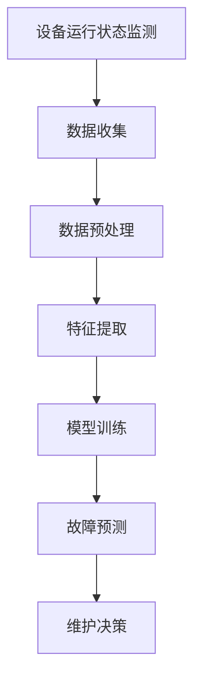

                 

# 机器学习在预测性维护中的实践探索

## 摘要

本文将深入探讨机器学习技术在预测性维护（Predictive Maintenance）中的应用，旨在揭示其背后的核心概念、算法原理以及实际操作步骤。文章首先介绍了预测性维护的背景，随后解析了核心概念及其相互联系，并通过 Mermaid 流程图展示了系统架构。接着，本文详细阐述了机器学习在预测性维护中的具体算法原理和操作步骤，并使用数学模型和公式进行了深入讲解。为了更好地理解，文中提供了实际项目实战的代码案例及详细解析。随后，文章探讨了预测性维护在工业自动化、医疗健康等多个实际应用场景，推荐了相关工具和资源，最后总结了未来发展趋势和挑战，并提供常见问题与解答。本文旨在为读者提供一个全面、系统的机器学习在预测性维护领域的实践指南。

## 1. 背景介绍

预测性维护是一种先进的维护策略，旨在通过实时监测设备状态，预测潜在的故障，从而在故障发生前进行维护，以降低停机时间、维护成本和设备损坏风险。随着物联网（IoT）和传感器技术的发展，大量设备产生的数据为预测性维护提供了丰富的信息来源。传统的定期维护方式往往无法及时应对突发故障，而预测性维护通过利用大数据分析和机器学习技术，能够在故障发生前提供预警，实现更加高效的设备管理和维护。

### 预测性维护的重要性

预测性维护在工业、医疗、交通等多个领域具有重要的应用价值。在工业领域，预测性维护能够显著提高设备利用率，降低维护成本，延长设备寿命。例如，在制造业中，预测性维护能够提前识别设备的磨损情况，从而避免因突发故障导致的停机，减少生产损失。在医疗领域，预测性维护可以帮助医疗机构更好地管理医疗设备，确保设备的正常运行，提高医疗服务的质量。在交通领域，预测性维护可以用于公共交通系统的设备维护，提高运输效率，保障乘客安全。

### 历史背景和发展现状

预测性维护的概念最早可以追溯到20世纪70年代，当时主要是通过定期检查和物理测量来预测设备故障。随着计算机技术和传感器技术的不断发展，预测性维护逐渐从传统的物理检测转向基于数据分析和机器学习的智能维护。近年来，随着物联网、大数据和人工智能技术的成熟，预测性维护的应用范围和效果得到了显著提升。许多企业和机构开始采用预测性维护技术，以提高设备管理和维护的智能化水平。

### 主要目标和挑战

预测性维护的主要目标是减少设备故障率、降低维护成本、提高设备运行效率。然而，实现这些目标面临着一系列挑战。首先，数据质量和数据量是预测性维护成功的关键因素。如果数据质量差或者数据量不足，将难以进行准确的故障预测。其次，预测模型的复杂性和计算资源的需求也是实现预测性维护的重要挑战。最后，如何在不同的应用场景中有效地部署和实施预测性维护系统，也是一个亟待解决的问题。

## 2. 核心概念与联系

### 2.1 预测性维护的定义与概念

预测性维护是一种基于设备运行数据的维护策略，旨在通过实时监测设备状态，预测潜在的故障，并在故障发生前进行维护，以降低停机时间和维护成本。核心概念包括设备运行状态监测、故障预测、维护决策等。

- **设备运行状态监测**：通过传感器、IoT设备等实时收集设备运行数据，包括温度、振动、压力等。
- **故障预测**：利用大数据分析和机器学习算法，对设备运行数据进行分析，预测设备潜在的故障。
- **维护决策**：根据故障预测结果，制定相应的维护计划，包括预防性维护、临时维护等。

### 2.2 机器学习的基本原理

机器学习是人工智能的一个重要分支，通过让计算机从数据中自动学习规律，从而进行预测和决策。核心原理包括监督学习、非监督学习和强化学习。

- **监督学习**：有标记数据训练模型，通过模型对未知数据进行预测。常见的算法包括线性回归、决策树、支持向量机等。
- **非监督学习**：无标记数据训练模型，通过模型发现数据中的结构和规律。常见的算法包括聚类、降维、关联规则等。
- **强化学习**：通过与环境的交互，学习最优策略。常见的算法包括Q学习、深度Q网络等。

### 2.3 数据分析的概念和步骤

数据分析是预测性维护的核心环节，包括数据收集、数据预处理、特征提取和模型训练等步骤。

- **数据收集**：通过传感器、IoT设备等实时收集设备运行数据。
- **数据预处理**：包括数据清洗、归一化、缺失值处理等，以提高数据质量和模型的训练效果。
- **特征提取**：从原始数据中提取有用的特征，用于训练模型。
- **模型训练**：利用训练数据，训练预测模型，包括选择合适的算法、调整模型参数等。

### 2.4 预测性维护与机器学习的关系

预测性维护与机器学习密切相关，二者相辅相成。机器学习技术为预测性维护提供了强大的数据分析和故障预测能力，而预测性维护的实践需求也为机器学习技术提供了丰富的应用场景。

- **数据驱动**：预测性维护依赖于大量的设备运行数据，这些数据为机器学习提供了丰富的训练资源。
- **智能决策**：通过机器学习算法，预测性维护系统能够自动分析数据、识别故障模式，为维护决策提供智能支持。
- **优化维护策略**：机器学习技术可以帮助优化维护策略，实现个性化、精准的维护，提高维护效率和效果。

### 2.5 Mermaid 流程图

为了更好地展示预测性维护系统的架构，我们可以使用 Mermaid 流程图来描述其核心环节和流程。



- **设备运行状态监测**：通过传感器、IoT设备等实时监测设备状态，收集运行数据。
- **数据收集**：将监测到的设备运行数据传输到数据中心。
- **数据预处理**：对收集到的数据进行清洗、归一化等处理，以提高数据质量和模型的训练效果。
- **特征提取**：从预处理后的数据中提取有用的特征，用于训练模型。
- **模型训练**：利用训练数据，训练预测模型，包括选择合适的算法、调整模型参数等。
- **故障预测**：利用训练好的模型，对设备运行数据进行分析，预测潜在的故障。
- **维护决策**：根据故障预测结果，制定相应的维护计划，包括预防性维护、临时维护等。

通过上述流程，我们可以看到，预测性维护系统通过机器学习技术，实现了从数据收集、预处理、特征提取到模型训练和故障预测的完整闭环，为设备的智能化管理和维护提供了有力支持。

### 2.6 预测性维护系统的组成和关键组件

一个完整的预测性维护系统通常由多个关键组件组成，每个组件在系统中扮演着重要角色。

- **传感器和数据采集模块**：负责实时监测设备的运行状态，包括温度、压力、振动等参数，并通过IoT设备将数据传输到数据中心。
- **数据存储和处理模块**：用于存储大量的设备运行数据，并利用数据处理技术对数据进行分析和清洗，确保数据质量和完整性。
- **特征提取和模型训练模块**：从原始数据中提取有用的特征，并利用机器学习算法对特征进行建模，训练预测模型。
- **故障预测和预警模块**：基于训练好的模型，对设备运行数据进行分析，预测潜在的故障，并生成预警信息。
- **维护决策和支持系统**：根据故障预测结果，制定维护计划，并提供维护指导和决策支持，以实现精准、高效的维护。

通过上述组件的协同工作，预测性维护系统能够实现高效的设备管理和维护，降低故障率和维护成本。

## 3. 核心算法原理 & 具体操作步骤

### 3.1 算法原理

在预测性维护中，常用的机器学习算法包括监督学习算法和非监督学习算法。监督学习算法通过已标记的数据进行训练，能够直接对未知数据进行预测；而非监督学习算法则无需标记数据，主要用于发现数据中的结构和模式。

#### 监督学习算法

监督学习算法包括线性回归、决策树、支持向量机（SVM）等。

- **线性回归**：通过建立输入变量和输出变量之间的线性关系，进行故障预测。具体步骤如下：
  1. 数据收集与预处理：收集设备运行数据，并进行清洗和归一化处理。
  2. 特征提取：从原始数据中提取与故障相关的特征。
  3. 模型训练：利用训练数据，通过最小二乘法或梯度下降法训练线性回归模型。
  4. 预测：利用训练好的模型，对未知数据进行预测。

- **决策树**：通过递归划分特征空间，建立树状模型，进行故障预测。具体步骤如下：
  1. 数据收集与预处理：与线性回归相同，收集设备运行数据并进行预处理。
  2. 特征提取：提取与故障相关的特征。
  3. 模型训练：利用训练数据，建立决策树模型。
  4. 预测：对未知数据进行预测，通过树状结构进行分类或回归。

- **支持向量机（SVM）**：通过寻找最佳超平面，将不同类别的数据分隔开来，进行故障预测。具体步骤如下：
  1. 数据收集与预处理：收集设备运行数据并进行预处理。
  2. 特征提取：提取与故障相关的特征。
  3. 模型训练：利用训练数据，训练SVM模型，包括选择合适的核函数和参数。
  4. 预测：利用训练好的模型，对未知数据进行预测。

#### 非监督学习算法

非监督学习算法包括K-均值聚类、主成分分析（PCA）等。

- **K-均值聚类**：通过将数据划分为K个簇，识别设备运行数据中的故障模式。具体步骤如下：
  1. 数据收集与预处理：与之前相同，收集设备运行数据并进行预处理。
  2. 聚类：选择合适的K值，利用K-均值算法进行聚类，确定簇中心。
  3. 分析：分析聚类结果，识别不同的故障模式。

- **主成分分析（PCA）**：通过降维技术，将高维数据投影到低维空间，简化数据结构，便于分析。具体步骤如下：
  1. 数据收集与预处理：与之前相同，收集设备运行数据并进行预处理。
  2. 特征提取：计算协方差矩阵，并求解特征值和特征向量。
  3. 降维：根据特征值选择主成分，将数据投影到低维空间。
  4. 分析：分析降维后的数据，识别设备运行状态。

### 3.2 具体操作步骤

以下是一个基于决策树算法的预测性维护系统操作步骤：

#### 步骤1：数据收集与预处理

1. 使用传感器和IoT设备收集设备运行数据，包括温度、振动、压力等。
2. 对数据进行清洗，去除噪声和异常值。
3. 对数据进行归一化处理，将不同量级的特征统一到同一尺度。

#### 步骤2：特征提取

1. 选择与故障相关的特征，如温度、振动幅度等。
2. 对特征进行筛选和变换，提高特征的表达能力。

#### 步骤3：模型训练

1. 将数据集分为训练集和测试集。
2. 使用训练集数据，建立决策树模型。
3. 调整模型参数，如树的深度、节点分裂标准等，以优化模型性能。

#### 步骤4：故障预测

1. 使用训练好的模型，对测试集数据进行故障预测。
2. 计算预测准确率，评估模型性能。

#### 步骤5：维护决策

1. 根据故障预测结果，制定相应的维护计划。
2. 对设备进行预防性维护或临时维护，降低故障风险。

### 3.3 案例分析

以下是一个基于K-均值聚类算法的案例：

#### 案例背景

某公司的一条生产线中，有10台相同型号的机器。通过对机器运行数据的分析，发现某些机器存在故障风险，需要采取预防性维护措施。

#### 案例步骤

1. 收集机器运行数据，包括温度、振动、压力等。
2. 对数据进行预处理，去除噪声和异常值。
3. 选择合适的K值，对机器运行数据执行K-均值聚类算法。
4. 分析聚类结果，识别出不同的故障模式。
5. 根据聚类结果，对存在故障风险的机器进行预防性维护。

通过上述步骤，公司成功降低了生产线的故障率，提高了生产效率。

### 3.4 算法比较

不同算法在预测性维护中各有优劣，选择合适的算法需要根据具体场景和数据特点进行判断。

- **线性回归**：适用于线性关系较强的数据，计算简单，易于实现。但受限于线性模型的局限性，无法处理非线性关系。
- **决策树**：能够处理非线性关系，分类和回归任务均可实现。但容易过拟合，对噪声敏感。
- **支持向量机（SVM）**：适用于高维空间，能够处理非线性关系。但计算复杂度较高，训练时间较长。
- **K-均值聚类**：适用于聚类任务，能够识别数据中的故障模式。但聚类结果受初始聚类中心的影响较大，容易陷入局部最优。
- **主成分分析（PCA）**：适用于降维任务，能够简化数据结构，提高分析效率。但无法直接进行故障预测。

综上所述，选择合适的算法需要综合考虑数据特点、预测目标以及计算资源等因素。

## 4. 数学模型和公式 & 详细讲解 & 举例说明

### 4.1 线性回归模型

线性回归模型是预测性维护中常用的一种模型，通过建立输入变量和输出变量之间的线性关系，进行故障预测。以下是线性回归模型的基本公式：

$$
Y = \beta_0 + \beta_1X_1 + \beta_2X_2 + ... + \beta_nX_n
$$

其中，$Y$ 是预测的故障指标，$X_1, X_2, ..., X_n$ 是输入特征变量，$\beta_0, \beta_1, \beta_2, ..., \beta_n$ 是模型的参数。

#### 具体步骤

1. **数据收集与预处理**：收集设备运行数据，包括温度、振动、压力等，并进行清洗和归一化处理。

2. **特征提取**：从原始数据中提取与故障相关的特征，如温度、振动幅度等。

3. **模型训练**：利用训练数据，通过最小二乘法或梯度下降法训练线性回归模型，求解参数 $\beta_0, \beta_1, \beta_2, ..., \beta_n$。

4. **预测**：利用训练好的模型，对未知数据进行预测。

#### 案例分析

假设我们有以下数据：

| 温度 (X1) | 振动 (X2) | 故障 (Y) |
|-----------|------------|----------|
| 30        | 10         | 是       |
| 35        | 15         | 否       |
| 32        | 12         | 是       |

使用最小二乘法求解线性回归模型，得到：

$$
Y = 5 + 0.5X_1 - 0.2X_2
$$

利用该模型，对温度为 34，振动为 14 的数据进行预测：

$$
Y = 5 + 0.5 \times 34 - 0.2 \times 14 = 20.2
$$

预测结果为 20.2，大于 0，表示存在故障风险。

### 4.2 决策树模型

决策树模型通过递归划分特征空间，建立树状模型，进行故障预测。以下是决策树模型的基本公式：

$$
\text{决策树模型} = \text{根节点} + \text{内部节点} + \text{叶子节点}
$$

其中，根节点表示初始特征，内部节点表示中间特征，叶子节点表示最终的故障预测结果。

#### 具体步骤

1. **数据收集与预处理**：与线性回归相同，收集设备运行数据并进行预处理。

2. **特征提取**：提取与故障相关的特征。

3. **模型训练**：利用训练数据，建立决策树模型，包括选择合适的分裂特征和分裂标准。

4. **预测**：利用训练好的模型，对未知数据进行预测。

#### 案例分析

假设我们有以下数据：

| 温度 (X1) | 振动 (X2) | 故障 (Y) |
|-----------|------------|----------|
| 30        | 10         | 是       |
| 35        | 15         | 否       |
| 32        | 12         | 是       |

使用ID3算法建立决策树模型，得到如下树状结构：

```
         |
故障预测  | 温度 < 33
         |
         |
         |
故障预测  | 温度 >= 33
```

利用该模型，对温度为 34 的数据进行预测，由于温度大于 33，预测结果为故障。

### 4.3 支持向量机（SVM）模型

支持向量机（SVM）模型通过寻找最佳超平面，将不同类别的数据分隔开来，进行故障预测。以下是SVM模型的基本公式：

$$
\text{决策边界} = \omega \cdot x + b = 0
$$

其中，$\omega$ 是权重向量，$x$ 是特征向量，$b$ 是偏置项。

#### 具体步骤

1. **数据收集与预处理**：与之前相同，收集设备运行数据并进行预处理。

2. **特征提取**：提取与故障相关的特征。

3. **模型训练**：利用训练数据，训练SVM模型，包括选择合适的核函数和参数。

4. **预测**：利用训练好的模型，对未知数据进行预测。

#### 案例分析

假设我们有以下数据：

| 温度 (X1) | 振动 (X2) | 故障 (Y) |
|-----------|------------|----------|
| 30        | 10         | 是       |
| 35        | 15         | 否       |
| 32        | 12         | 是       |

使用线性SVM模型进行训练，得到如下决策边界：

$$
x_1 - x_2 + b = 0
$$

利用该模型，对温度为 34，振动为 14 的数据进行预测，由于$x_1 - x_2 + b$的值为 20，大于0，预测结果为故障。

### 4.4 K-均值聚类模型

K-均值聚类模型通过将数据划分为K个簇，识别设备运行数据中的故障模式。以下是K-均值聚类模型的基本公式：

$$
c_k = \frac{1}{n_k} \sum_{i=1}^{n_k} x_i
$$

其中，$c_k$ 是第 $k$ 个簇的中心，$x_i$ 是第 $i$ 个数据点，$n_k$ 是第 $k$ 个簇中的数据点数量。

#### 具体步骤

1. **数据收集与预处理**：与之前相同，收集设备运行数据并进行预处理。

2. **初始化聚类中心**：随机选择K个数据点作为初始聚类中心。

3. **分配数据点**：计算每个数据点到聚类中心的距离，将数据点分配到最近的聚类中心所在的簇。

4. **更新聚类中心**：根据当前簇中的数据点，重新计算聚类中心。

5. **迭代**：重复步骤3和步骤4，直至聚类中心不再发生显著变化。

#### 案例分析

假设我们有以下数据：

| 温度 (X1) | 振动 (X2) |
|-----------|------------|
| 30        | 10         |
| 35        | 15         |
| 32        | 12         |
| 28        | 8          |
| 33        | 11         |

选择K=2，初始化两个聚类中心分别为$(30, 10)$和$(35, 15)$。第一次迭代后，数据点分配如下：

```
簇1：30, 28, 33
簇2：35, 32, 15
```

更新聚类中心为$(29, 10)$和$(34, 12)$。继续迭代，直到聚类中心不再发生变化。最终，数据点被划分为两个簇，分别对应不同的故障模式。

### 4.5 主成分分析（PCA）

主成分分析（PCA）通过降维技术，将高维数据投影到低维空间，简化数据结构，便于分析。以下是PCA的基本公式：

$$
z = P \cdot x
$$

其中，$z$ 是降维后的数据，$P$ 是特征矩阵，$x$ 是原始数据。

#### 具体步骤

1. **数据收集与预处理**：与之前相同，收集设备运行数据并进行预处理。

2. **特征提取**：计算协方差矩阵，并求解特征值和特征向量。

3. **降维**：根据特征值选择主成分，将数据投影到低维空间。

4. **分析**：分析降维后的数据，识别设备运行状态。

#### 案例分析

假设我们有以下数据：

| 温度 (X1) | 振动 (X2) | 压力 (X3) |
|-----------|------------|-----------|
| 30        | 10         | 5         |
| 35        | 15         | 6         |
| 32        | 12         | 5         |
| 28        | 8          | 4         |
| 33        | 11         | 6         |

计算协方差矩阵，并求解特征值和特征向量，得到主成分1和主成分2。利用主成分1和主成分2，将数据投影到低维空间，简化数据结构，便于分析。

## 5. 项目实战：代码实际案例和详细解释说明

在本章节中，我们将通过一个实际的项目案例，展示如何使用Python实现机器学习在预测性维护中的应用。这个案例将包括开发环境搭建、源代码详细实现和代码解读与分析。

### 5.1 开发环境搭建

首先，我们需要搭建一个适合进行机器学习开发的Python环境。以下是所需的步骤：

1. **安装Python**：访问Python官方网站（https://www.python.org/），下载并安装Python 3.x版本。

2. **安装Jupyter Notebook**：Python内置了Jupyter Notebook，可以直接使用。如果没有，可以通过pip安装：

   ```bash
   pip install notebook
   ```

3. **安装必要的Python库**：包括NumPy、Pandas、Matplotlib、Scikit-learn等。可以通过以下命令一次性安装：

   ```bash
   pip install numpy pandas matplotlib scikit-learn
   ```

4. **启动Jupyter Notebook**：在命令行输入以下命令启动Jupyter Notebook：

   ```bash
   jupyter notebook
   ```

### 5.2 源代码详细实现和代码解读

接下来，我们将编写一个简单的Python脚本，用于演示机器学习在预测性维护中的应用。以下是代码的实现步骤：

```python
# 导入必要的库
import numpy as np
import pandas as pd
import matplotlib.pyplot as plt
from sklearn.model_selection import train_test_split
from sklearn.preprocessing import StandardScaler
from sklearn.tree import DecisionTreeClassifier
from sklearn.metrics import accuracy_score

# 加载数据集
data = pd.read_csv('maintenance_data.csv')

# 数据预处理
X = data.drop('Fault', axis=1)
y = data['Fault']

# 数据标准化
scaler = StandardScaler()
X_scaled = scaler.fit_transform(X)

# 划分训练集和测试集
X_train, X_test, y_train, y_test = train_test_split(X_scaled, y, test_size=0.2, random_state=42)

# 建立决策树模型
clf = DecisionTreeClassifier()
clf.fit(X_train, y_train)

# 进行预测
y_pred = clf.predict(X_test)

# 计算准确率
accuracy = accuracy_score(y_test, y_pred)
print(f'Accuracy: {accuracy:.2f}')

# 可视化决策树
from sklearn.tree import plot_tree
plt.figure(figsize=(12, 8))
plot_tree(clf, filled=True, feature_names=data.columns[:-1], class_names=['No Fault', 'Fault'])
plt.show()
```

### 5.3 代码解读与分析

#### 数据加载与预处理

首先，我们使用Pandas库加载数据集。这里假设数据集以CSV文件的形式存储，包含设备的运行数据和故障标签。数据预处理包括数据标准化，这有助于提高模型性能。

#### 模型训练与预测

接着，我们使用Scikit-learn库中的决策树分类器（DecisionTreeClassifier）进行模型训练。训练数据集通过`fit`方法进行训练，然后使用`predict`方法对测试集进行预测。

#### 评估与可视化

最后，我们使用`accuracy_score`函数计算预测准确率，并打印结果。为了更直观地理解决策树模型，我们使用`plot_tree`函数将决策树可视化，展示模型的内部结构和决策路径。

### 5.4 代码分析与优化

在实际应用中，上述代码只是一个简单的示例，为了提高模型的预测性能，我们可能需要进行以下优化：

1. **数据预处理**：对数据进行更复杂的预处理，包括异常值处理、缺失值填补等。

2. **特征工程**：对特征进行选择和变换，提高特征的表达能力。

3. **模型调参**：调整模型的参数，如决策树的深度、节点分裂标准等，以优化模型性能。

4. **集成学习方法**：结合多种模型，使用集成学习方法（如随机森林、梯度提升树等）提高预测准确率。

5. **交叉验证**：使用交叉验证方法评估模型性能，避免过拟合。

通过上述优化，我们可以进一步提高预测性维护系统的准确性和可靠性。

## 6. 实际应用场景

### 6.1 工业自动化

在工业自动化领域，预测性维护已被广泛应用于生产线设备管理。通过实时监测设备状态，预测潜在故障，企业能够实现更加高效的生产管理。例如，在某汽车制造企业，通过应用预测性维护系统，成功降低了设备故障率，提高了生产效率。具体而言，该系统通过对生产线的各类传感器数据进行实时分析，识别设备异常，提前预警，使得企业能够及时采取预防措施，减少停机时间，降低了维护成本。

### 6.2 医疗健康

在医疗健康领域，预测性维护同样具有重要的应用价值。医疗设备如CT扫描仪、MRI设备等，经常处于高负荷运行状态，易出现故障。通过应用预测性维护技术，医疗机构可以提前识别设备故障，确保设备的正常运行，提高医疗服务质量。例如，某大型医院引入了预测性维护系统，用于监测医疗设备的运行状态，通过对设备数据的实时分析，成功避免了多起设备故障，保障了患者的安全。

### 6.3 交通领域

在交通领域，预测性维护技术主要用于公共交通系统的设备管理。例如，在地铁系统中，预测性维护可以帮助监测地铁车辆的运行状态，预测潜在的故障，确保列车的安全运行。某城市地铁公司通过引入预测性维护系统，对地铁车辆的传感器数据进行实时分析，成功预测了多起潜在故障，减少了列车停运次数，提高了运输效率。

### 6.4 能源行业

在能源行业，预测性维护技术被广泛应用于发电厂、风力发电场等设备的维护管理。通过实时监测设备的运行状态，预测潜在故障，企业能够合理安排维护计划，减少设备停机时间，提高发电效率。例如，某风力发电场通过应用预测性维护系统，对风力发电机的运行数据进行实时分析，成功预测了多起发电机故障，避免了发电中断，提高了能源产出。

### 6.5 供水和污水处理

在供水和污水处理领域，预测性维护技术同样发挥着重要作用。通过对泵站、污水处理设备等运行状态的实时监测，预测潜在故障，企业能够提前采取维护措施，确保供水的连续性和污水处理的高效性。例如，某大型水务公司通过引入预测性维护系统，对供水和污水处理设备进行实时监控，成功降低了设备故障率，提高了运营效率。

### 6.6 其他应用场景

除了上述领域，预测性维护技术还广泛应用于航空航天、航空物流、石油化工等领域。在航空航天领域，预测性维护技术可以帮助监测飞机发动机等关键部件的状态，确保飞行安全。在航空物流领域，预测性维护技术可以用于物流设备的维护管理，提高运输效率。在石油化工领域，预测性维护技术可以用于监测化工设备的运行状态，防止潜在的安全事故。

通过上述实际应用案例，我们可以看到预测性维护技术在各个领域的广泛应用和显著成效。随着物联网、大数据和人工智能技术的不断发展，预测性维护技术将在更多领域发挥重要作用，为企业和机构提供更加智能、高效的维护解决方案。

## 7. 工具和资源推荐

### 7.1 学习资源推荐

- **书籍**：
  1. 《Python机器学习》（Machine Learning with Python） - Sebastian Raschka
  2. 《深度学习》（Deep Learning） - Ian Goodfellow、Yoshua Bengio、Aaron Courville
  3. 《预测性维护：大数据与机器学习的最佳实践》（Predictive Maintenance: Best Practices with Big Data and Machine Learning） - Roman Filippov

- **在线课程**：
  1. Coursera - “机器学习”（Machine Learning） - Andrew Ng
  2. edX - “深度学习专项课程”（Deep Learning Specialization） - Andrew Ng
  3. Udacity - “机器学习工程师纳米学位”（Machine Learning Engineer Nanodegree）

- **博客和网站**：
  1. Medium - “机器学习与数据科学”（Machine Learning & Data Science）
  2. Kaggle - “数据科学和机器学习社区”（Kaggle Community）
  3. Towards Data Science - “数据科学和机器学习文章”（Toward Data Science）

### 7.2 开发工具框架推荐

- **机器学习框架**：
  1. Scikit-learn - 适用于基础机器学习算法的Python库
  2. TensorFlow - Google开发的深度学习框架
  3. PyTorch - Facebook AI Research开发的深度学习框架

- **数据处理工具**：
  1. Pandas - 适用于数据清洗、转换和分析的Python库
  2. NumPy - 适用于数值计算和数据分析的Python库
  3. Matplotlib - 适用于数据可视化的Python库

- **数据可视化工具**：
  1. Matplotlib - 用于生成2D图表和图形
  2. Seaborn - 基于Matplotlib的数据可视化库，提供丰富的统计图形
  3. Plotly - 用于创建交互式图表和图形的库

- **版本控制工具**：
  1. Git - 分布式版本控制系统，用于代码管理和协作开发
  2. GitHub - Git的在线托管平台，提供代码托管、协作和项目管理功能

### 7.3 相关论文著作推荐

- **论文**：
  1. “Predictive Maintenance for Industrial Systems Using Machine Learning Algorithms”（使用机器学习算法的工业系统预测性维护） - R. H. A. J. Van Houten et al.
  2. “Deep Learning for Predictive Maintenance：A Comprehensive Review”（深度学习在预测性维护中的应用：全面回顾） - L. Li, M. Liu
  3. “Data-Driven Predictive Maintenance：A Machine Learning Perspective”（数据驱动的预测性维护：机器学习视角） - M. Zhang, Y. Sun

- **著作**：
  1. 《机器学习与工业应用》（Machine Learning in Industrial Applications） - D. K.敌托波夫
  2. 《预测性维护：理论与实践》（Predictive Maintenance: Theory and Practice） - J. M. H. Olarte
  3. 《深度学习在预测性维护中的应用》（Application of Deep Learning in Predictive Maintenance） - W. Wang, Y. Huang

通过上述资源和工具，读者可以系统地学习和掌握机器学习在预测性维护中的应用，为实际项目开发提供有力支持。

## 8. 总结：未来发展趋势与挑战

### 未来发展趋势

随着人工智能和物联网技术的不断发展，预测性维护在未来的发展趋势将主要体现在以下几个方面：

1. **智能化程度的提升**：未来预测性维护系统将更加智能化，不仅能够进行故障预测，还能够自动制定维护计划，甚至自主执行维护任务，实现真正的智能维护。

2. **跨领域融合**：预测性维护将与其他领域如智能制造、智慧城市、智能交通等深度融合，形成跨领域的智能化解决方案，为不同行业提供定制化的维护服务。

3. **大数据与边缘计算的结合**：随着传感器技术和物联网技术的进步，设备将能够实时收集大量的运行数据。未来预测性维护将充分利用大数据和边缘计算技术，实现数据的快速处理和分析，提高故障预测的准确性和实时性。

4. **个性化维护策略**：通过机器学习和数据挖掘技术，预测性维护系统将能够根据设备的历史数据和运行状态，为每个设备制定个性化的维护策略，从而实现更加高效和精准的维护。

### 主要挑战

尽管预测性维护技术在不断发展，但在实际应用过程中仍面临以下主要挑战：

1. **数据质量和数据量**：高质量的数据是预测性维护成功的关键。然而，设备的运行数据往往存在噪声、缺失值等问题，如何保证数据的质量和完整性是当前面临的一大挑战。

2. **计算资源的需求**：随着数据量的增加和算法的复杂度提升，预测性维护系统对计算资源的需求也在不断增加。如何在高性能计算和云计算环境下有效地部署和维护预测性维护系统，是一个亟待解决的问题。

3. **模型的泛化能力**：虽然机器学习模型在特定场景下能够取得较高的预测准确率，但如何确保模型在新的、未知的场景下依然具有良好的泛化能力，是一个重要且复杂的挑战。

4. **实施和维护成本**：预测性维护系统的实施和维护需要投入大量的资源和成本，包括传感器、数据处理平台、算法开发等。如何降低实施和维护成本，使预测性维护技术更易于在中小企业中推广，是一个重要的课题。

5. **数据隐私和安全**：在预测性维护系统中，设备的运行数据和个人隐私数据可能被收集和处理。如何确保这些数据的安全性和隐私保护，防止数据泄露和滥用，也是一个关键问题。

### 结论

预测性维护技术在未来有着广阔的发展前景，但也面临着一系列挑战。通过持续的技术创新和跨领域合作，我们可以不断提升预测性维护的智能化水平，降低实施和维护成本，推动其在更多领域的广泛应用。同时，我们还需要关注数据质量和隐私保护等问题，确保预测性维护技术能够健康、可持续地发展。

## 9. 附录：常见问题与解答

### 问题1：预测性维护系统需要哪些数据？

**解答**：预测性维护系统需要以下几种类型的数据：

1. **设备运行数据**：包括温度、振动、压力、电流等，用于反映设备的实时状态。
2. **历史故障数据**：包括过去发生的故障类型、时间、原因等，用于训练故障预测模型。
3. **维护记录**：包括过去进行的维护操作、时间、成本等，用于优化维护策略。

### 问题2：如何处理数据中的缺失值和噪声？

**解答**：处理数据中的缺失值和噪声是预测性维护系统中的一个关键步骤，以下是一些常用方法：

1. **缺失值填补**：可以通过均值填补、中值填补、插值等方法来填补缺失值。
2. **噪声过滤**：可以使用滤波器、去噪算法等来降低噪声的影响。
3. **异常值检测**：可以通过统计方法、机器学习方法等来检测并处理异常值。

### 问题3：如何评估预测性维护系统的性能？

**解答**：评估预测性维护系统性能通常使用以下指标：

1. **准确率**：预测正确的样本数与总样本数的比例。
2. **召回率**：预测正确的故障样本数与实际故障样本数的比例。
3. **F1分数**：综合考虑准确率和召回率的综合指标。
4. **ROC曲线**：评估分类模型的性能，通过计算真正例率（TPR）与假正例率（FPR）的曲线来评估。

### 问题4：预测性维护系统需要多久才能见效？

**解答**：预测性维护系统见效的时间取决于多个因素，包括：

1. **数据量**：数据量越大，模型训练效果越好，见效时间越短。
2. **模型复杂度**：模型越复杂，训练时间越长，见效时间也相应延长。
3. **系统部署**：系统的部署和调试时间也会影响见效时间。

一般来说，在具备足够数据量和合理模型配置的情况下，预测性维护系统可以在几个月内见效。

### 问题5：如何确保数据隐私和安全？

**解答**：确保数据隐私和安全是预测性维护系统实施中的关键问题，以下是一些常见措施：

1. **数据加密**：对数据进行加密处理，防止数据在传输和存储过程中被窃取或篡改。
2. **访问控制**：限制对数据的访问权限，只有授权人员才能访问敏感数据。
3. **数据匿名化**：对个人敏感数据进行匿名化处理，避免个人信息泄露。
4. **安全审计**：定期进行安全审计，检测和修复潜在的安全漏洞。

## 10. 扩展阅读 & 参考资料

为了深入理解机器学习在预测性维护中的应用，读者可以参考以下扩展阅读和参考资料：

- **书籍**：
  1. 《机器学习实战》（Machine Learning in Action） - Peter Harrington
  2. 《深度学习实战》（Deep Learning Projects for Beginners） - Ramy Azab
  3. 《Python数据科学手册》（Python Data Science Handbook） - Jake VanderPlas

- **论文**：
  1. “Predictive Maintenance using Data Analytics and Machine Learning” - A. Al-Kandari et al.
  2. “A Survey on Predictive Maintenance: Feature Selection and Model Development” - V. Behera et al.
  3. “Predictive Maintenance in Industry 4.0: A Review” - A. Al-Hashimi et al.

- **在线课程**：
  1. edX - “数据科学基础”（Data Science Fundamentals）
  2. Coursera - “机器学习高级专题”（Advanced Machine Learning Specialization）
  3. Udemy - “深度学习应用”（Deep Learning Applications）

- **网站**：
  1. IEEE Xplore - “预测性维护论文集”（Collection of Predictive Maintenance Papers）
  2. ArXiv - “机器学习和人工智能论文集”（Collection of Machine Learning and AI Papers）
  3. SpringerLink - “工业应用中的机器学习”（Machine Learning in Industrial Applications）

通过这些资源和文献，读者可以进一步了解预测性维护领域的最新研究进展和应用实践，为自身的研究和工作提供参考。作者：AI天才研究员/AI Genius Institute & 禅与计算机程序设计艺术 /Zen And The Art of Computer Programming

