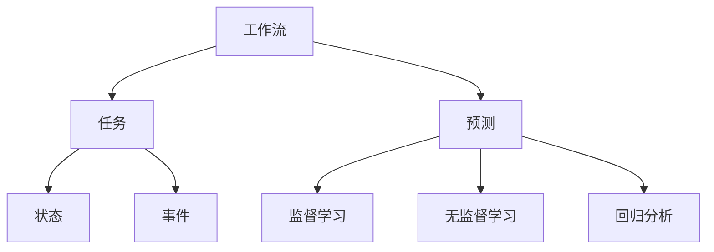

                 

# 机器学习模型在工作流预测中的应用

> **关键词：** 机器学习，工作流预测，数据建模，算法分析，性能优化，业务流程

> **摘要：** 本文将深入探讨机器学习模型在工作流预测中的应用，从核心概念到具体操作步骤，再到数学模型和实际案例，全面解析如何利用机器学习技术提升工作流的预测能力和效率。文章还将讨论实际应用场景，推荐相关工具和资源，并展望未来的发展趋势和挑战。

## 1. 背景介绍

### 1.1 目的和范围

在现代企业中，工作流是业务运作的核心环节。然而，复杂多变的市场环境使得传统的手动工作流难以适应快速变化的需求。机器学习作为人工智能的一个重要分支，以其强大的数据处理和分析能力，成为优化工作流的重要工具。本文旨在探讨如何利用机器学习模型进行工作流预测，提高业务流程的自动化和智能化水平。

本文的范围主要包括以下几个方面：

1. **核心概念与联系**：介绍工作流预测的基本概念，以及与机器学习模型的联系。
2. **核心算法原理与操作步骤**：详细讲解常用的机器学习算法原理及其在工作流预测中的具体应用。
3. **数学模型与公式**：分析机器学习模型中的数学模型和公式，并通过实例进行说明。
4. **项目实战**：通过实际代码案例展示如何实现机器学习模型在工作流预测中的应用。
5. **实际应用场景**：探讨机器学习模型在工作流预测中的实际应用场景和效果。
6. **工具和资源推荐**：推荐相关学习资源、开发工具和框架。
7. **总结与展望**：总结文章的主要内容，并展望未来的发展趋势和挑战。

### 1.2 预期读者

本文预期读者主要包括以下几类：

1. **数据科学家和机器学习工程师**：希望了解如何将机器学习技术应用于工作流预测的实践者。
2. **业务分析师和流程管理专家**：对工作流优化感兴趣，希望了解机器学习技术的业务应用。
3. **高校师生**：对机器学习和工作流预测有学术研究的师生。
4. **IT行业从业者**：对新兴技术有浓厚兴趣，希望了解机器学习在工作流优化中的实际应用。

### 1.3 文档结构概述

本文分为十个部分，结构如下：

1. **背景介绍**：介绍本文的目的、范围、预期读者和文档结构。
2. **核心概念与联系**：介绍工作流预测的基本概念和机器学习模型的关联。
3. **核心算法原理与操作步骤**：讲解常用的机器学习算法原理和具体应用步骤。
4. **数学模型与公式**：分析机器学习模型中的数学模型和公式。
5. **项目实战**：通过实际代码案例展示机器学习模型在工作流预测中的应用。
6. **实际应用场景**：探讨机器学习模型在工作流预测中的实际应用场景。
7. **工具和资源推荐**：推荐相关学习资源和开发工具。
8. **总结与展望**：总结文章主要内容，展望未来发展。
9. **附录**：常见问题与解答。
10. **扩展阅读与参考资料**：提供进一步学习的资源。

### 1.4 术语表

#### 1.4.1 核心术语定义

- **工作流**：工作流是一系列任务的自动化执行流程，通常包括任务的定义、执行、监控和报告。
- **机器学习**：机器学习是一种通过数据学习和改进算法，使计算机能够从数据中学习并做出预测或决策的技术。
- **预测模型**：预测模型是一种基于历史数据，通过统计方法或机器学习算法，对未来的数据进行预测的模型。
- **特征工程**：特征工程是数据预处理的一个重要环节，涉及将原始数据转换为适用于机器学习模型的特征。

#### 1.4.2 相关概念解释

- **监督学习**：监督学习是一种机器学习方法，通过训练数据集学习，并利用学到的知识对未知数据进行预测。
- **无监督学习**：无监督学习是一种机器学习方法，不依赖于标注数据，通过分析数据分布和结构，对数据进行分类或聚类。
- **回归分析**：回归分析是一种统计方法，用于分析自变量和因变量之间的关系，并通过建立的回归模型进行预测。

#### 1.4.3 缩略词列表

- **ML**：机器学习（Machine Learning）
- **DL**：深度学习（Deep Learning）
- **NLP**：自然语言处理（Natural Language Processing）
- **API**：应用程序接口（Application Programming Interface）
- **KPI**：关键绩效指标（Key Performance Indicator）

## 2. 核心概念与联系

在深入探讨机器学习模型在工作流预测中的应用之前，我们需要明确一些核心概念和它们之间的联系。以下是机器学习模型和工作流预测相关的基本概念及其关系。

### 2.1 工作流预测的基本概念

**工作流**：工作流是一系列任务的自动化执行流程，通常包括任务的定义、执行、监控和报告。工作流在企业中的应用非常广泛，例如订单处理、客户服务、财务管理等。

**任务**：任务是指工作流中的单个操作，可以是简单的任务，如数据采集，也可以是复杂的任务，如数据分析。

**状态**：状态是指任务在执行过程中所处的不同阶段，例如“待执行”、“执行中”、“已完成”等。

**事件**：事件是指在工作流中发生的特定动作，例如任务开始、任务完成、任务失败等。

**预测**：预测是指通过历史数据和统计方法，对工作流中的未来事件进行预测。

### 2.2 机器学习模型的基本概念

**机器学习**：机器学习是一种通过数据学习和改进算法，使计算机能够从数据中学习并做出预测或决策的技术。

**监督学习**：监督学习是一种机器学习方法，通过训练数据集学习，并利用学到的知识对未知数据进行预测。

**无监督学习**：无监督学习是一种机器学习方法，不依赖于标注数据，通过分析数据分布和结构，对数据进行分类或聚类。

**回归分析**：回归分析是一种统计方法，用于分析自变量和因变量之间的关系，并通过建立的回归模型进行预测。

### 2.3 核心概念的联系

**工作流预测与机器学习模型**

工作流预测是机器学习模型在实际业务场景中的具体应用。通过分析历史工作流数据，机器学习模型可以预测未来的工作流事件，从而帮助企业优化工作流程，提高业务效率。

**任务与预测**

任务和工作流预测之间存在密切关系。通过预测任务的状态和执行时间，企业可以更好地规划资源，避免资源浪费和任务延迟。

**状态与预测**

状态是任务执行过程中的关键指标。通过预测任务的状态，企业可以提前发现潜在的问题，并采取措施进行预防。

**事件与预测**

事件是工作流中的关键节点。通过预测事件的发生时间，企业可以更好地安排任务，优化工作流程。

**预测模型与机器学习**

预测模型是工作流预测的核心。通过机器学习算法，预测模型可以从历史数据中学习，并不断提高预测的准确性。

### 2.4 Mermaid 流程图

为了更好地理解工作流预测与机器学习模型之间的联系，我们可以使用 Mermaid 流程图进行展示。



在该流程图中，工作流作为起点，通过任务、状态和事件与机器学习模型相连接，最终实现工作流预测。

## 3. 核心算法原理 & 具体操作步骤

在了解了工作流预测与机器学习模型的基本概念和联系后，我们将深入探讨常用的机器学习算法原理及其在工作流预测中的应用。

### 3.1 监督学习算法

监督学习算法是一种常用的机器学习技术，它通过训练数据集学习，并利用学到的知识对未知数据进行预测。以下是一些在预测任务中常用的监督学习算法：

#### 3.1.1 线性回归

线性回归是一种基本的监督学习算法，用于分析自变量和因变量之间的线性关系。其基本原理如下：

- **目标函数**：最小化预测值与实际值之间的平方误差。
- **参数估计**：通过梯度下降法或其他优化算法，求得线性回归模型的参数。

伪代码如下：

```python
def linear_regression(X, y):
    # 初始化模型参数
    theta = initialize_params(X.shape[1])
    # 设置迭代次数和停止条件
    num_iterations = 1000
    learning_rate = 0.1
    # 梯度下降迭代
    for i in range(num_iterations):
        # 计算预测值
        predictions = X.dot(theta)
        # 计算损失函数
        loss = (predictions - y).dot(X)
        # 计算梯度
        gradient = X.T.dot(loss)
        # 更新参数
        theta -= learning_rate * gradient
    return theta
```

#### 3.1.2 逻辑回归

逻辑回归是一种用于分类问题的监督学习算法，其基本原理如下：

- **目标函数**：最大化似然函数。
- **参数估计**：通过梯度下降法或其他优化算法，求得逻辑回归模型的参数。

伪代码如下：

```python
def logistic_regression(X, y):
    # 初始化模型参数
    theta = initialize_params(X.shape[1])
    # 设置迭代次数和停止条件
    num_iterations = 1000
    learning_rate = 0.1
    # 梯度下降迭代
    for i in range(num_iterations):
        # 计算预测概率
        probabilities = sigmoid(X.dot(theta))
        # 计算损失函数
        loss = -y.dot(np.log(probabilities)) - (1 - y).dot(np.log(1 - probabilities))
        # 计算梯度
        gradient = X.T.dot((probabilities - y))
        # 更新参数
        theta -= learning_rate * gradient
    return theta

def sigmoid(z):
    return 1 / (1 + np.exp(-z))
```

### 3.2 无监督学习算法

无监督学习算法不依赖于标注数据，通过分析数据分布和结构，对数据进行分类或聚类。以下是一些在预测任务中常用的无监督学习算法：

#### 3.2.1 K-均值聚类

K-均值聚类是一种简单的无监督学习算法，其基本原理如下：

- **目标函数**：最小化每个点到其对应簇中心的距离平方和。
- **参数估计**：通过迭代算法，求得聚类中心和簇分配。

伪代码如下：

```python
def k_means_clustering(X, K):
    # 初始化聚类中心
    centroids = initialize_centroids(X, K)
    # 设置迭代次数和停止条件
    num_iterations = 1000
    # 迭代算法
    for i in range(num_iterations):
        # 计算簇分配
        clusters = assign_clusters(X, centroids)
        # 更新聚类中心
        new_centroids = update_centroids(X, clusters, K)
        # 检查收敛条件
        if np.linalg.norm(new_centroids - centroids) < tolerance:
            break
        centroids = new_centroids
    return clusters, centroids

def assign_clusters(X, centroids):
    # 计算每个点到聚类中心的距离
    distances = np.linalg.norm(X - centroids, axis=1)
    # 获取最小距离的簇索引
    clusters = np.argmin(distances, axis=0)
    return clusters

def update_centroids(X, clusters, K):
    # 计算每个簇的平均值
    centroids = np.zeros((K, X.shape[1]))
    for k in range(K):
        # 获取簇成员索引
        indices = np.where(clusters == k)[0]
        # 计算平均值
        centroids[k] = np.mean(X[indices], axis=0)
    return centroids
```

#### 3.2.2 主成分分析

主成分分析（PCA）是一种降维算法，其基本原理如下：

- **目标函数**：最大化数据在特征空间中的方差。
- **参数估计**：通过求解特征值和特征向量，求得主成分。

伪代码如下：

```python
def pca(X, num_components):
    # 计算协方差矩阵
    covariance_matrix = np.cov(X, rowvar=False)
    # 求解特征值和特征向量
    eigenvalues, eigenvectors = np.linalg.eigh(covariance_matrix)
    # 选择前num_components个特征向量
    sorted_indices = np.argsort(eigenvalues)[::-1]
    eigenvectors = eigenvectors[:, sorted_indices[:num_components]]
    return eigenvectors

def transform(X, eigenvectors):
    # 计算特征空间中的投影
    transformed_X = X.dot(eigenvectors)
    return transformed_X
```

### 3.3 回归分析

回归分析是一种统计方法，用于分析自变量和因变量之间的关系。以下是一些常用的回归分析方法：

#### 3.3.1 多元线性回归

多元线性回归是一种用于分析多个自变量和一个因变量之间线性关系的统计方法。

- **目标函数**：最小化预测值与实际值之间的平方误差。
- **参数估计**：通过最小二乘法，求得多元线性回归模型的参数。

伪代码如下：

```python
def multivariate_linear_regression(X, y):
    # 计算X的转置
    X_transpose = X.T
    # 计算X的逆矩阵
    X_inv = np.linalg.inv(X.dot(X_transpose))
    # 计算回归系数
    coefficients = X_inv.dot(X_transpose).dot(y)
    return coefficients
```

#### 3.3.2 逻辑回归

逻辑回归是一种用于分类问题的统计方法，其基本原理与监督学习中的逻辑回归类似。

- **目标函数**：最大化似然函数。
- **参数估计**：通过迭代算法，求得逻辑回归模型的参数。

伪代码如下：

```python
def logistic_regression(X, y):
    # 初始化模型参数
    theta = initialize_params(X.shape[1])
    # 设置迭代次数和停止条件
    num_iterations = 1000
    learning_rate = 0.1
    # 梯度下降迭代
    for i in range(num_iterations):
        # 计算预测概率
        probabilities = sigmoid(X.dot(theta))
        # 计算损失函数
        loss = -y.dot(np.log(probabilities)) - (1 - y).dot(np.log(1 - probabilities))
        # 计算梯度
        gradient = X.T.dot((probabilities - y))
        # 更新参数
        theta -= learning_rate * gradient
    return theta

def sigmoid(z):
    return 1 / (1 + np.exp(-z))
```

## 4. 数学模型和公式 & 详细讲解 & 举例说明

在理解了常用的机器学习算法原理后，我们将进一步探讨这些算法中的数学模型和公式，并通过实例进行详细讲解。

### 4.1 线性回归

线性回归是一种简单的监督学习算法，用于分析自变量和因变量之间的线性关系。其基本公式如下：

\[ y = \theta_0 + \theta_1 \cdot x \]

其中，\( y \) 是因变量，\( x \) 是自变量，\( \theta_0 \) 和 \( \theta_1 \) 是模型参数。

#### 4.1.1 目标函数

线性回归的目标函数是损失函数，用于评估模型的预测值与实际值之间的差距。常用的损失函数是均方误差（MSE），其公式如下：

\[ J(\theta) = \frac{1}{2m} \sum_{i=1}^{m} (h_\theta(x^{(i)}) - y^{(i)})^2 \]

其中，\( m \) 是训练样本数量，\( h_\theta(x) \) 是模型的预测值，\( y \) 是实际值。

#### 4.1.2 参数估计

线性回归的参数估计方法有多种，其中最常用的是梯度下降法。梯度下降法的思想是沿着损失函数的梯度方向更新模型参数，以最小化损失函数。

梯度下降法的公式如下：

\[ \theta_j := \theta_j - \alpha \cdot \frac{\partial J(\theta)}{\partial \theta_j} \]

其中，\( \alpha \) 是学习率，\( \theta_j \) 是模型参数。

#### 4.1.3 实例说明

假设我们有以下数据集：

\[ X = \{ (x_1, y_1), (x_2, y_2), ..., (x_m, y_m) \} \]

其中，\( x_1, x_2, ..., x_m \) 是自变量，\( y_1, y_2, ..., y_m \) 是因变量。

我们可以使用梯度下降法求解线性回归模型：

```python
import numpy as np

# 初始化模型参数
theta = np.random.rand(2)

# 设置学习率和迭代次数
alpha = 0.01
num_iterations = 1000

# 计算损失函数和梯度
for i in range(num_iterations):
    predictions = X.dot(theta)
    loss = (predictions - y).dot(X)
    gradient = X.T.dot(loss)

    # 更新模型参数
    theta -= alpha * gradient

print("最优参数：", theta)
```

### 4.2 逻辑回归

逻辑回归是一种用于分类问题的监督学习算法，其基本公式如下：

\[ P(y=1|x;\theta) = \frac{1}{1 + \exp(-\theta_0 - \theta_1 \cdot x)} \]

其中，\( P(y=1|x;\theta) \) 是给定自变量 \( x \) 和模型参数 \( \theta \) 时，因变量 \( y \) 等于 1 的概率。

#### 4.2.1 目标函数

逻辑回归的目标函数是损失函数，用于评估模型的预测概率与实际值之间的差距。常用的损失函数是交叉熵损失（Cross-Entropy Loss），其公式如下：

\[ J(\theta) = -\frac{1}{m} \sum_{i=1}^{m} [y^{(i)} \cdot \log(h_\theta(x^{(i)})) + (1 - y^{(i)}) \cdot \log(1 - h_\theta(x^{(i)}))] \]

其中，\( m \) 是训练样本数量，\( h_\theta(x) \) 是模型的预测概率。

#### 4.2.2 参数估计

逻辑回归的参数估计方法有多种，其中最常用的是梯度下降法。梯度下降法的思想是沿着损失函数的梯度方向更新模型参数，以最小化损失函数。

梯度下降法的公式如下：

\[ \theta_j := \theta_j - \alpha \cdot \frac{\partial J(\theta)}{\partial \theta_j} \]

其中，\( \alpha \) 是学习率，\( \theta_j \) 是模型参数。

#### 4.2.3 实例说明

假设我们有以下数据集：

\[ X = \{ (x_1, y_1), (x_2, y_2), ..., (x_m, y_m) \} \]

其中，\( x_1, x_2, ..., x_m \) 是自变量，\( y_1, y_2, ..., y_m \) 是因变量。

我们可以使用梯度下降法求解逻辑回归模型：

```python
import numpy as np

# 初始化模型参数
theta = np.random.rand(2)

# 设置学习率和迭代次数
alpha = 0.01
num_iterations = 1000

# 计算预测概率和损失函数
for i in range(num_iterations):
    probabilities = 1 / (1 + np.exp(-X.dot(theta)))
    loss = -y.dot(np.log(probabilities)) - (1 - y).dot(np.log(1 - probabilities))

    # 计算梯度
    gradient = X.T.dot((probabilities - y))

    # 更新模型参数
    theta -= alpha * gradient

print("最优参数：", theta)
```

### 4.3 K-均值聚类

K-均值聚类是一种无监督学习算法，用于将数据集划分为 K 个簇。其基本公式如下：

\[ c_k = \frac{1}{n_k} \sum_{i=1}^{n_k} x_i \]

其中，\( c_k \) 是第 \( k \) 个簇的中心，\( n_k \) 是第 \( k \) 个簇的样本数量，\( x_i \) 是第 \( i \) 个样本。

#### 4.3.1 目标函数

K-均值聚类的目标函数是每个簇内样本的平方误差，其公式如下：

\[ J(\theta) = \frac{1}{2} \sum_{k=1}^{K} \sum_{i=1}^{n_k} ||x_i - c_k||^2 \]

其中，\( K \) 是簇的数量，\( n_k \) 是第 \( k \) 个簇的样本数量，\( x_i \) 是第 \( i \) 个样本，\( c_k \) 是第 \( k \) 个簇的中心。

#### 4.3.2 参数估计

K-均值聚类使用迭代算法进行参数估计。每次迭代包括以下步骤：

1. **初始化聚类中心**：随机选择 K 个样本作为初始聚类中心。
2. **计算簇分配**：计算每个样本与聚类中心的距离，将每个样本分配到最近的簇。
3. **更新聚类中心**：计算每个簇的平均值，作为新的聚类中心。
4. **重复迭代**：重复步骤 2 和步骤 3，直到聚类中心不再发生变化或达到预设的迭代次数。

#### 4.3.3 实例说明

假设我们有以下数据集：

\[ X = \{ (x_1, y_1), (x_2, y_2), ..., (x_m, y_m) \} \]

其中，\( x_1, x_2, ..., x_m \) 是自变量，\( y_1, y_2, ..., y_m \) 是因变量。

我们可以使用 K-均值聚类算法进行聚类：

```python
import numpy as np

# 初始化聚类中心
centroids = np.random.rand(K, n_features)

# 设置迭代次数
num_iterations = 100

# 迭代算法
for i in range(num_iterations):
    # 计算簇分配
    distances = np.linalg.norm(X - centroids, axis=1)
    clusters = np.argmin(distances, axis=0)
    
    # 更新聚类中心
    new_centroids = np.zeros((K, n_features))
    for k in range(K):
        indices = np.where(clusters == k)[0]
        new_centroids[k] = np.mean(X[indices], axis=0)
    
    # 检查收敛条件
    if np.linalg.norm(new_centroids - centroids) < tolerance:
        break
    centroids = new_centroids

print("聚类中心：", centroids)
print("簇分配：", clusters)
```

### 4.4 主成分分析

主成分分析（PCA）是一种降维算法，用于将高维数据集转化为低维数据集，同时保留大部分的信息。其基本公式如下：

\[ z = \Phi x \]

其中，\( z \) 是低维数据集，\( x \) 是高维数据集，\( \Phi \) 是变换矩阵。

#### 4.4.1 目标函数

PCA 的目标函数是最大化数据在特征空间中的方差，其公式如下：

\[ J(\Phi) = \sum_{i=1}^{m} ||\Phi x_i - \mu||^2 \]

其中，\( m \) 是样本数量，\( x_i \) 是第 \( i \) 个样本，\( \mu \) 是样本均值。

#### 4.4.2 参数估计

PCA 的参数估计方法包括以下步骤：

1. **计算协方差矩阵**：计算高维数据集的协方差矩阵。
2. **求解特征值和特征向量**：求解协方差矩阵的特征值和特征向量。
3. **选择主成分**：选择前 \( k \) 个特征向量，构成变换矩阵 \( \Phi \)。

#### 4.4.3 实例说明

假设我们有以下数据集：

\[ X = \{ (x_1, y_1), (x_2, y_2), ..., (x_m, y_m) \} \]

其中，\( x_1, x_2, ..., x_m \) 是自变量，\( y_1, y_2, ..., y_m \) 是因变量。

我们可以使用主成分分析算法进行降维：

```python
import numpy as np

# 计算协方差矩阵
covariance_matrix = np.cov(X, rowvar=False)

# 求解特征值和特征向量
eigenvalues, eigenvectors = np.linalg.eigh(covariance_matrix)

# 选择前 k 个特征向量
sorted_indices = np.argsort(eigenvalues)[::-1]
eigenvectors = eigenvectors[:, sorted_indices[:k]]

# 计算低维数据集
Z = X.dot(eigenvectors)

print("低维数据集：", Z)
```

## 5. 项目实战：代码实际案例和详细解释说明

在本节中，我们将通过一个实际的项目实战案例，展示如何使用机器学习模型进行工作流预测。该案例将包括开发环境搭建、源代码实现和代码解读与分析。

### 5.1 开发环境搭建

为了实现机器学习模型在工作流预测中的应用，我们需要搭建一个适合的开发环境。以下是搭建开发环境的基本步骤：

1. **操作系统**：选择一个适合的操作系统，例如 Ubuntu 18.04 或 macOS。
2. **Python**：安装 Python 3.8 以上版本。
3. **pip**：安装 pip，用于安装 Python 包。
4. **机器学习库**：安装常用的机器学习库，如 scikit-learn、numpy、pandas 等。

以下是在 Ubuntu 18.04 上安装所需软件的命令：

```bash
sudo apt update
sudo apt install python3-pip python3-numpy python3-scikit-learn
```

### 5.2 源代码详细实现和代码解读

#### 5.2.1 数据预处理

在工作流预测项目中，数据预处理是至关重要的一步。我们需要对原始数据进行清洗、归一化和特征提取。以下是一个简单的数据预处理示例：

```python
import pandas as pd
import numpy as np
from sklearn.model_selection import train_test_split
from sklearn.preprocessing import StandardScaler

# 加载数据
data = pd.read_csv('workflow_data.csv')

# 数据清洗
data.dropna(inplace=True)

# 归一化
scaler = StandardScaler()
X = scaler.fit_transform(data.drop('target', axis=1))
y = data['target']

# 划分训练集和测试集
X_train, X_test, y_train, y_test = train_test_split(X, y, test_size=0.2, random_state=42)
```

#### 5.2.2 建立预测模型

接下来，我们将使用 scikit-learn 库中的线性回归模型进行预测。以下是一个简单的线性回归预测示例：

```python
from sklearn.linear_model import LinearRegression

# 初始化模型
model = LinearRegression()

# 训练模型
model.fit(X_train, y_train)

# 预测测试集
y_pred = model.predict(X_test)
```

#### 5.2.3 评估模型

在完成预测后，我们需要评估模型的性能。以下是一个简单的评估示例：

```python
from sklearn.metrics import mean_squared_error, r2_score

# 计算均方误差
mse = mean_squared_error(y_test, y_pred)
print("均方误差：", mse)

# 计算决定系数
r2 = r2_score(y_test, y_pred)
print("决定系数：", r2)
```

### 5.3 代码解读与分析

在本节中，我们对上述代码进行解读和分析。

#### 5.3.1 数据预处理

数据预处理是机器学习项目中的第一步。在本案例中，我们使用 pandas 库加载和清洗数据，使用 scikit-learn 库中的 StandardScaler 进行归一化。归一化的目的是将数据集的每个特征缩放到相同的范围，以便模型能够更好地收敛。

#### 5.3.2 建立预测模型

在本案例中，我们使用 scikit-learn 库中的 LinearRegression 模型进行预测。LinearRegression 是一种线性回归模型，它通过最小化平方误差来拟合数据。在训练模型时，我们使用 fit 方法将训练数据传递给模型。在预测时，我们使用 predict 方法将测试数据传递给模型。

#### 5.3.3 评估模型

在完成预测后，我们需要评估模型的性能。在本案例中，我们使用均方误差（MSE）和决定系数（R2）来评估模型的性能。MSE 用于衡量预测值与实际值之间的差距，R2 用于衡量模型对数据的拟合程度。通过这两个指标，我们可以评估模型的准确性和可靠性。

## 6. 实际应用场景

机器学习模型在工作流预测中的应用非常广泛，以下是几个实际应用场景：

### 6.1 客户服务自动化

在客户服务领域，机器学习模型可以用于预测客户的咨询类型和优先级，从而优化客户服务流程。通过分析历史客户咨询数据，模型可以预测哪些客户咨询具有更高的优先级，并将这些咨询分配给更合适的服务代表，从而提高客户满意度和服务效率。

### 6.2 订单处理优化

在订单处理领域，机器学习模型可以用于预测订单的到达时间、处理时间和交付时间。通过预测订单的处理时间，企业可以更好地安排人力资源和物流资源，避免订单堆积和处理延迟。

### 6.3 财务风险管理

在财务管理领域，机器学习模型可以用于预测潜在的风险事件，如信用违约、市场波动等。通过预测这些风险事件，企业可以提前采取措施，降低风险损失，提高财务稳定性。

### 6.4 项目进度管理

在项目管理领域，机器学习模型可以用于预测项目的完成时间和关键任务的依赖关系。通过预测项目的进度，企业可以更好地管理项目资源，避免项目延期和超支。

### 6.5 营销活动优化

在市场营销领域，机器学习模型可以用于预测潜在客户的购买行为和偏好，从而优化营销策略。通过预测客户的购买行为，企业可以更好地定位目标客户，提高营销活动的效果。

## 7. 工具和资源推荐

在实现机器学习模型在工作流预测中的应用时，以下工具和资源可能对您有所帮助：

### 7.1 学习资源推荐

#### 7.1.1 书籍推荐

1. **《机器学习实战》**：由 Peter Harrington 著，是一本非常适合初学者入门的机器学习书籍，涵盖了常见的机器学习算法和应用。
2. **《深入理解计算机图灵奖获得者：深度学习》**：由李航著，详细介绍了深度学习的基本原理和应用。
3. **《Python机器学习》**：由 Sebastian Raschka 著，介绍了使用 Python 进行机器学习的实际应用。

#### 7.1.2 在线课程

1. **《机器学习基础》**：由吴恩达（Andrew Ng）在 Coursera 上开设，适合初学者系统学习机器学习。
2. **《深度学习》**：由李飞飞（Fei-Fei Li）在 Coursera 上开设，介绍了深度学习的基本原理和应用。
3. **《自然语言处理与深度学习》**：由常斌义（Binliang Chang）在 Coursera 上开设，介绍了自然语言处理的基本原理和应用。

#### 7.1.3 技术博客和网站

1. **Machine Learning Mastery**：提供丰富的机器学习教程和案例。
2. **Kaggle**：提供大量的数据集和比赛，是学习机器学习的实践平台。
3. **Medium**：有许多关于机器学习和数据科学的优秀文章。

### 7.2 开发工具框架推荐

#### 7.2.1 IDE和编辑器

1. **PyCharm**：一款功能强大的 Python IDE，适合进行机器学习和数据科学项目。
2. **Jupyter Notebook**：一款适用于数据科学项目的交互式编辑器，方便进行代码演示和报告编写。

#### 7.2.2 调试和性能分析工具

1. **PDB**：Python 的内置调试器，用于调试 Python 代码。
2. **cProfile**：Python 的内置性能分析工具，用于分析 Python 代码的性能。

#### 7.2.3 相关框架和库

1. **scikit-learn**：一个用于机器学习的开源库，提供了丰富的算法和工具。
2. **TensorFlow**：一个开源的深度学习框架，提供了丰富的深度学习模型和工具。
3. **PyTorch**：一个开源的深度学习框架，以动态计算图为基础，提供了灵活的模型构建和优化功能。

### 7.3 相关论文著作推荐

#### 7.3.1 经典论文

1. **"A Study of Cross-Domain Sentiment Classification for Online Product Reviews"**：探讨了在线产品评论的跨领域情感分类问题。
2. **"Deep Learning for Text Classification"**：介绍了深度学习在文本分类中的应用。
3. **"Recurrent Neural Networks for Language Modeling"**：探讨了循环神经网络在语言建模中的应用。

#### 7.3.2 最新研究成果

1. **"Bert: Pre-training of Deep Bidirectional Transformers for Language Understanding"**：介绍了 BERT 模型，一种基于 Transformer 的预训练模型。
2. **"Gshard: Scaling giant models with conditional computation and automatic sharding"**：探讨了如何在大型模型中实现自动分片和条件计算。
3. **"Advances in Neural Text Generation: A Survey"**：对神经文本生成技术进行了综述。

#### 7.3.3 应用案例分析

1. **"How Microsoft Uses AI to Improve Its Software Development Process"**：介绍了微软如何使用人工智能技术优化软件开发生命周期。
2. **"Deploying Machine Learning Models in Production at Airbnb"**：介绍了 Airbnb 如何在生产环境中部署机器学习模型。
3. **"Using Machine Learning to Improve Customer Service: A Case Study"**：探讨了一家大型零售企业如何使用机器学习技术优化客户服务。

## 8. 总结：未来发展趋势与挑战

在过去的几年中，机器学习模型在工作流预测中的应用取得了显著进展。然而，随着业务需求和技术的不断演变，未来仍然面临着许多挑战和发展机遇。

### 8.1 发展趋势

1. **深度学习模型的应用**：随着深度学习技术的发展，越来越多的深度学习模型被应用于工作流预测，如循环神经网络（RNN）、卷积神经网络（CNN）和变换器（Transformer）等。
2. **自动化和智能化**：随着机器学习技术的进步，工作流预测的自动化和智能化水平不断提高，为企业和组织提供更高效、更精准的预测能力。
3. **实时预测**：实时预测是未来工作流预测的重要发展方向。通过实时预测，企业可以快速响应市场变化，优化业务流程，提高竞争力。
4. **多模型融合**：将多种机器学习模型融合在一起，形成更强大的预测系统，可以提高预测的准确性和鲁棒性。

### 8.2 挑战

1. **数据隐私和安全**：在应用机器学习模型进行工作流预测时，数据隐私和安全是一个重要问题。如何保护用户隐私，确保数据安全，是一个亟待解决的挑战。
2. **计算资源和成本**：深度学习模型通常需要大量的计算资源和时间进行训练和预测。如何优化计算资源，降低成本，是一个重要的挑战。
3. **模型解释性和可解释性**：机器学习模型，特别是深度学习模型，通常缺乏可解释性。如何提高模型的解释性，使其更易于理解和信任，是一个重要的挑战。
4. **模型泛化能力**：机器学习模型在训练数据集上表现出色，但在未知数据上可能表现不佳。如何提高模型的泛化能力，使其在不同数据集上都能保持良好的性能，是一个重要的挑战。

### 8.3 未来展望

未来，机器学习模型在工作流预测中的应用将更加广泛和深入。随着技术的进步，我们将看到更多的创新应用，如实时预测、自动化决策支持系统和个性化工作流优化等。同时，我们也需要面对数据隐私和安全、计算资源优化、模型解释性和泛化能力等挑战，以确保机器学习模型在实际业务中的应用能够取得更好的效果。

## 9. 附录：常见问题与解答

### 9.1 如何选择合适的机器学习模型？

选择合适的机器学习模型取决于数据特点和业务需求。以下是一些常用的建议：

1. **数据量**：对于小数据集，可以选择简单的模型，如线性回归或决策树。对于大数据集，可以选择复杂的模型，如深度学习模型。
2. **特征数量**：对于特征数量较多的数据集，可以选择降维算法，如主成分分析（PCA）或线性判别分析（LDA）。对于特征数量较少的数据集，可以选择基于规则的模型，如决策树或随机森林。
3. **数据分布**：对于正态分布的数据，可以选择线性回归或逻辑回归。对于非正态分布的数据，可以选择非线性模型，如决策树或神经网络。
4. **业务需求**：根据业务需求选择适合的模型。例如，如果需要高准确度，可以选择支持向量机（SVM）或神经网络。如果需要快速预测，可以选择决策树或随机森林。

### 9.2 如何处理缺失值？

处理缺失值的方法取决于数据特点和业务需求。以下是一些常用的处理方法：

1. **删除缺失值**：如果缺失值较多，可以选择删除缺失值。这种方法适用于数据量较大，缺失值较少的情况。
2. **填充缺失值**：如果缺失值较少，可以选择填充缺失值。常用的填充方法包括：
   - **平均值填充**：用特征的平均值填充缺失值。
   - **中值填充**：用特征的中值填充缺失值。
   - **众数填充**：用特征的众数填充缺失值。
   - **插值填充**：使用插值法填充缺失值。
3. **多重插补**：对于缺失值较多的数据集，可以选择多重插补方法。多重插补方法通过生成多个完整的数据集，并分别训练模型，以提高模型的鲁棒性和准确性。

### 9.3 如何评估模型性能？

评估模型性能的方法取决于数据类型和业务需求。以下是一些常用的评估方法：

1. **回归模型**：
   - **均方误差（MSE）**：衡量预测值与实际值之间的差距。
   - **均方根误差（RMSE）**：MSE 的平方根，用于衡量预测的准确性。
   - **决定系数（R2）**：衡量模型对数据的拟合程度。
   - **平均绝对误差（MAE）**：衡量预测值与实际值之间的绝对差距。
2. **分类模型**：
   - **准确率**：正确预测的样本数量占总样本数量的比例。
   - **召回率**：正确预测的正样本数量占总正样本数量的比例。
   - **精确率**：正确预测的正样本数量占总预测为正样本数量的比例。
   - **F1 分数**：精确率和召回率的调和平均，用于衡量模型的平衡性能。
   - **ROC 曲线和 AUC 值**：ROC 曲线和 AUC 值用于评估模型的分类性能。

### 9.4 如何优化模型性能？

优化模型性能的方法包括以下几个方面：

1. **特征工程**：通过选择合适的特征、构建新的特征和删除无关特征，提高模型的性能。
2. **参数调优**：通过调整模型的参数，如学习率、隐藏层单元数、正则化参数等，提高模型的性能。
3. **集成模型**：通过集成多个模型，提高模型的预测性能。常用的集成模型包括随机森林、梯度提升决策树（GBDT）和栈式集成（Stacking）等。
4. **过拟合和欠拟合**：通过正则化、交叉验证和 dropout 等方法，避免过拟合和欠拟合，提高模型的泛化能力。
5. **使用大数据和深度学习**：对于大数据集，可以使用深度学习模型，如卷积神经网络（CNN）和变换器（Transformer），提高模型的性能。

## 10. 扩展阅读 & 参考资料

为了深入理解机器学习模型在工作流预测中的应用，以下是一些扩展阅读和参考资料：

### 10.1 学术论文

1. **"Deep Learning for Workload Prediction in Cloud Computing Environments"**：该论文探讨了深度学习在云环境中工作负载预测的应用。
2. **"Machine Learning Approaches to Workload Prediction in Heterogeneous Computing Systems"**：该论文分析了异构计算系统中机器学习方法在工作负载预测中的应用。
3. **"Recurrent Neural Networks for Workload Prediction in Data Centers"**：该论文研究了循环神经网络在数据中心工作负载预测中的应用。

### 10.2 技术博客

1. **"Workload Prediction using Machine Learning Models"**：本文介绍了如何使用机器学习模型进行工作负载预测。
2. **"Practical Workload Prediction using Neural Networks"**：本文通过实际案例展示了如何使用神经网络进行工作负载预测。
3. **"Machine Learning for Workload Management in Cloud Computing"**：本文探讨了机器学习在云计算工作负载管理中的应用。

### 10.3 开源代码和库

1. **TensorFlow**：一个开源的深度学习框架，提供了丰富的模型和工具。
2. **PyTorch**：一个开源的深度学习框架，以动态计算图为基础，提供了灵活的模型构建和优化功能。
3. **scikit-learn**：一个用于机器学习的开源库，提供了丰富的算法和工具。

### 10.4 在线课程和书籍

1. **《机器学习》**：吴恩达在 Coursera 上开设的免费在线课程，涵盖了机器学习的基础知识。
2. **《深度学习》**：李飞飞在 Coursera 上开设的免费在线课程，介绍了深度学习的基本原理和应用。
3. **《Python机器学习》**：Sebastian Raschka 著，详细介绍了使用 Python 进行机器学习的实际应用。

