                 

# 机器学习流水线与人工智能代理的集成

> **关键词**：机器学习流水线、人工智能代理、集成、模型评估、自动化、优化

> **摘要**：本文将深入探讨机器学习流水线与人工智能代理的集成，分析其核心概念、架构设计、算法原理、数学模型及实际应用场景。通过逐步分析推理，本文旨在帮助读者理解如何构建高效、自动化的机器学习系统，以实现人工智能代理的最佳性能。

## 1. 背景介绍

### 1.1 目的和范围

本文的目标是探讨机器学习流水线与人工智能代理的集成，分析其核心概念、架构设计、算法原理及实际应用场景。本文将提供一个全面的技术视角，帮助读者理解如何将机器学习流水线与人工智能代理结合起来，实现高效、自动化的机器学习系统。

本文的范围涵盖了以下主题：

1. 机器学习流水线的核心概念与架构设计。
2. 人工智能代理的定义与作用。
3. 机器学习流水线与人工智能代理的集成方法。
4. 核心算法原理与数学模型。
5. 实际应用场景及案例分析。
6. 工具和资源的推荐。
7. 未来发展趋势与挑战。

### 1.2 预期读者

本文面向以下读者：

1. 机器学习工程师和人工智能开发者。
2. 对机器学习和人工智能感兴趣的技术爱好者。
3. 数据科学家和分析师。
4. 计算机科学专业的学生和研究学者。

### 1.3 文档结构概述

本文的结构如下：

1. 引言：介绍机器学习流水线与人工智能代理的集成背景。
2. 核心概念与联系：分析核心概念原理和架构。
3. 核心算法原理 & 具体操作步骤：讲解算法原理及操作步骤。
4. 数学模型和公式 & 详细讲解 & 举例说明：介绍数学模型及具体应用。
5. 项目实战：代码实际案例和详细解释说明。
6. 实际应用场景：探讨实际应用场景及案例分析。
7. 工具和资源推荐：推荐学习资源、开发工具和框架。
8. 总结：未来发展趋势与挑战。
9. 附录：常见问题与解答。
10. 扩展阅读 & 参考资料：提供更多相关阅读资料。

### 1.4 术语表

#### 1.4.1 核心术语定义

1. 机器学习流水线：一系列自动化步骤，用于数据预处理、模型训练、评估和部署。
2. 人工智能代理：一种智能体，能够在特定环境下自主决策并采取行动，以实现特定目标。
3. 模型评估：评估模型性能的方法，通常使用准确率、召回率、F1分数等指标。
4. 自动化：将重复性任务自动化执行，以提高效率和减少错误。
5. 优化：通过调整模型参数，提高模型性能。

#### 1.4.2 相关概念解释

1. 数据预处理：在模型训练之前，对数据进行清洗、归一化、特征提取等操作。
2. 模型训练：使用训练数据对模型进行迭代优化，以提高预测性能。
3. 模型评估：使用测试数据评估模型性能，以确定模型是否满足预期要求。
4. 模型部署：将训练好的模型部署到生产环境，以实现实际应用。

#### 1.4.3 缩略词列表

- ML：机器学习
- AI：人工智能
- DL：深度学习
- NLP：自然语言处理
- CV：计算机视觉
- HPC：高性能计算
- MLOps：机器学习运营

## 2. 核心概念与联系

在探讨机器学习流水线与人工智能代理的集成之前，我们需要先了解一些核心概念及其相互关系。以下是一个 Mermaid 流程图，展示了这些核心概念之间的联系。

```mermaid
graph TD
    A[机器学习流水线] --> B[数据预处理]
    A --> C[模型训练]
    A --> D[模型评估]
    A --> E[模型部署]
    B --> F[数据清洗]
    B --> G[数据归一化]
    B --> H[特征提取]
    C --> I[模型迭代]
    C --> J[参数优化]
    D --> K[准确率]
    D --> L[召回率]
    D --> M[F1分数]
    E --> N[生产环境]
    E --> O[模型监控]
    E --> P[性能优化]
    F --> Q[缺失值处理]
    F --> R[异常值处理]
    G --> S[最小-最大归一化]
    G --> T[零均值归一化]
    H --> U[主成分分析]
    H --> V[词袋模型]
    I --> W[梯度下降]
    I --> X[随机梯度下降]
    J --> Y[贝叶斯优化]
    J --> Z[遗传算法]
    K --> AA[真阳性]
    K --> BB[假阳性]
    L --> CC[真阴性]
    L --> DD[假阴性]
    M --> EE[精确度]
    M --> FF[召回率]
    M --> GG[F1分数]
    N --> HH[实时监控]
    N --> II[自动化部署]
    O --> JJ[性能指标]
    O --> KK[告警系统]
    P --> LL[负载均衡]
    P --> MM[缓存策略]
    Q --> NN[插补法]
    Q --> OO[边界限定]
    R --> PP[阈值处理]
    R --> QQ[多尺度分析]
    S --> RR[缩放系数]
    S --> SS[缩放范围]
    T --> UU[平均值]
    T --> VV[标准差]
    U --> WW[特征值]
    U --> XX[特征向量]
    V --> YY[词频]
    V --> ZZ[文档频率]
    W --> AAA[学习率]
    W --> BBB[动量]
    X --> CCC[批量大小]
    X --> DDD[随机性]
    Y --> EEE[先验分布]
    Y --> FFF[后验分布]
    Z --> GGG[种群大小]
    Z --> HHH[交叉率]
    Z --> III[变异率]
```



### 2.1 机器学习流水线

机器学习流水线是指一系列自动化步骤，用于处理数据、训练模型、评估模型和部署模型。以下是机器学习流水线的详细步骤：

1. **数据预处理**：包括数据清洗、归一化和特征提取等操作。数据清洗旨在处理缺失值、异常值和噪声，以确保数据质量。归一化是将数据缩放到特定范围，以便于模型训练。特征提取则是从原始数据中提取出对模型训练有用的特征。
   
2. **模型训练**：使用训练数据对模型进行迭代优化，以最小化损失函数。常见的训练算法包括梯度下降、随机梯度下降、梯度提升树等。

3. **模型评估**：使用测试数据评估模型性能，以确定模型是否满足预期要求。常用的评估指标包括准确率、召回率、F1分数等。

4. **模型部署**：将训练好的模型部署到生产环境，以实现实际应用。模型部署需要考虑模型监控、性能优化和自动化部署等方面。

### 2.2 人工智能代理

人工智能代理是一种智能体，能够在特定环境下自主决策并采取行动，以实现特定目标。以下是人工智能代理的核心概念：

1. **感知**：代理通过感知器接收环境信息。
2. **决策**：代理根据感知到的信息，使用算法（如决策树、神经网络等）生成决策。
3. **行动**：代理根据决策采取行动，以实现目标。
4. **反馈**：代理根据行动结果调整自身行为，以提高未来决策的质量。

### 2.3 机器学习流水线与人工智能代理的集成

机器学习流水线与人工智能代理的集成旨在构建一个高效、自动化的机器学习系统。以下是集成的主要方法：

1. **自动化**：通过将机器学习流水线中的步骤自动化，提高系统效率和减少人工干预。
2. **优化**：通过调整模型参数和算法，提高模型性能。
3. **监控**：对模型性能进行实时监控，确保系统稳定运行。
4. **反馈**：将模型性能反馈给机器学习流水线，以实现持续优化。

## 3. 核心算法原理 & 具体操作步骤

在机器学习流水线与人工智能代理的集成中，核心算法原理是关键。以下将介绍核心算法原理及其具体操作步骤。

### 3.1 数据预处理

数据预处理是机器学习流水线的第一步，旨在提高数据质量，为后续模型训练提供良好的数据基础。以下是数据预处理的核心算法原理和操作步骤：

#### 3.1.1 数据清洗

**算法原理**：数据清洗旨在处理缺失值、异常值和噪声，以确保数据质量。

**操作步骤**：

1. **缺失值处理**：使用插补法（如均值插补、中值插补、前向填充等）或边界限定法（如最小值限定、最大值限定等）处理缺失值。
2. **异常值处理**：使用阈值处理法（如固定阈值、自适应阈值等）或多尺度分析法（如小波变换、核密度估计等）处理异常值。
3. **噪声处理**：使用滤波法（如高斯滤波、中值滤波等）或降噪算法（如小波降噪、稀疏表示等）处理噪声。

#### 3.1.2 数据归一化

**算法原理**：数据归一化是将数据缩放到特定范围，以便于模型训练。

**操作步骤**：

1. **最小-最大归一化**：将数据缩放到[0, 1]范围。
2. **零均值归一化**：将数据缩放到[-1, 1]范围。

#### 3.1.3 特征提取

**算法原理**：特征提取是从原始数据中提取出对模型训练有用的特征。

**操作步骤**：

1. **主成分分析（PCA）**：通过线性变换，将原始数据投影到低维空间，保留主要信息。
2. **词袋模型**：将文本数据转换为词频或文档频率矩阵。

### 3.2 模型训练

模型训练是机器学习流水线的核心步骤，旨在通过迭代优化模型参数，提高模型性能。以下是模型训练的核心算法原理和操作步骤：

#### 3.2.1 梯度下降

**算法原理**：梯度下降是一种优化算法，通过迭代更新模型参数，以最小化损失函数。

**操作步骤**：

1. **前向传播**：计算模型输出和实际输出之间的差异，即损失值。
2. **反向传播**：计算损失函数关于模型参数的梯度，并更新模型参数。
3. **迭代优化**：重复前向传播和反向传播，直至模型收敛。

#### 3.2.2 随机梯度下降（SGD）

**算法原理**：随机梯度下降是对梯度下降的改进，通过随机选取样本，降低计算复杂度和提高收敛速度。

**操作步骤**：

1. **随机选取样本**：从训练数据中随机选取一个样本。
2. **前向传播**：计算模型输出和实际输出之间的差异，即损失值。
3. **反向传播**：计算损失函数关于模型参数的梯度，并更新模型参数。
4. **迭代优化**：重复随机选取样本、前向传播和反向传播，直至模型收敛。

### 3.3 模型评估

模型评估是机器学习流水线的重要环节，旨在确定模型性能是否满足预期要求。以下是模型评估的核心算法原理和操作步骤：

#### 3.3.1 准确率

**算法原理**：准确率是评估模型分类性能的指标，计算正确分类的样本数占总样本数的比例。

**操作步骤**：

1. **计算预测结果**：对测试数据进行分类预测。
2. **计算准确率**：计算正确分类的样本数占总样本数的比例。

#### 3.3.2 召回率

**算法原理**：召回率是评估模型分类性能的指标，计算正确分类为正类的样本数占总正类样本数的比例。

**操作步骤**：

1. **计算预测结果**：对测试数据进行分类预测。
2. **计算召回率**：计算正确分类为正类的样本数占总正类样本数的比例。

#### 3.3.3 F1分数

**算法原理**：F1分数是综合准确率和召回率的评估指标，计算准确率和召回率的调和平均值。

**操作步骤**：

1. **计算预测结果**：对测试数据进行分类预测。
2. **计算准确率**：计算正确分类的样本数占总样本数的比例。
3. **计算召回率**：计算正确分类为正类的样本数占总正类样本数的比例。
4. **计算F1分数**：计算准确率和召回率的调和平均值。

### 3.4 模型部署

模型部署是将训练好的模型部署到生产环境，以实现实际应用。以下是模型部署的核心算法原理和操作步骤：

#### 3.4.1 模型监控

**算法原理**：模型监控是对模型性能进行实时监控，以确保系统稳定运行。

**操作步骤**：

1. **实时数据收集**：从生产环境中收集实时数据。
2. **实时性能评估**：使用实时数据对模型性能进行评估。
3. **性能指标分析**：分析实时性能指标，如准确率、召回率、F1分数等。

#### 3.4.2 性能优化

**算法原理**：性能优化是通过调整模型参数和算法，提高模型性能。

**操作步骤**：

1. **性能指标分析**：分析实时性能指标，确定优化方向。
2. **参数调整**：调整模型参数，如学习率、批量大小等。
3. **算法改进**：改进模型算法，如使用更先进的优化算法。

#### 3.4.3 自动化部署

**算法原理**：自动化部署是通过自动化工具，将模型部署到生产环境。

**操作步骤**：

1. **模型打包**：将训练好的模型打包成可部署的格式。
2. **自动化部署**：使用自动化工具，将模型部署到生产环境。
3. **自动化监控**：对部署后的模型进行自动化监控，确保系统稳定运行。

## 4. 数学模型和公式 & 详细讲解 & 举例说明

在机器学习流水线与人工智能代理的集成中，数学模型和公式是核心。以下将介绍核心数学模型、详细讲解及其具体应用。

### 4.1 梯度下降算法

梯度下降算法是一种优化算法，用于最小化损失函数。以下是梯度下降算法的数学模型及其详细讲解。

#### 4.1.1 数学模型

$$
\theta_{\text{new}} = \theta_{\text{old}} - \alpha \cdot \nabla_{\theta} J(\theta)
$$

其中，$\theta$ 代表模型参数，$\alpha$ 代表学习率，$J(\theta)$ 代表损失函数，$\nabla_{\theta} J(\theta)$ 代表损失函数关于模型参数的梯度。

#### 4.1.2 详细讲解

梯度下降算法的基本思想是，通过迭代更新模型参数，以最小化损失函数。每次迭代过程中，模型参数的更新方向是损失函数梯度的反方向。

1. **前向传播**：计算模型输出和实际输出之间的差异，即损失值。
2. **反向传播**：计算损失函数关于模型参数的梯度。
3. **参数更新**：使用梯度下降公式，更新模型参数。

#### 4.1.3 举例说明

假设我们有一个线性回归模型，其损失函数为：

$$
J(\theta) = \frac{1}{2m} \sum_{i=1}^{m} (h_\theta(x^i) - y^i)^2
$$

其中，$m$ 代表样本数量，$h_\theta(x^i)$ 代表模型输出，$y^i$ 代表实际输出。

1. **前向传播**：计算模型输出。

$$
h_\theta(x^i) = \theta_0 + \theta_1 x^{i1} + \theta_2 x^{i2} + ... + \theta_n x^{in}
$$

2. **反向传播**：计算损失函数关于模型参数的梯度。

$$
\nabla_{\theta_0} J(\theta) = \frac{1}{m} \sum_{i=1}^{m} (h_\theta(x^i) - y^i)
$$

$$
\nabla_{\theta_1} J(\theta) = \frac{1}{m} \sum_{i=1}^{m} (h_\theta(x^i) - y^i) x^{i1}
$$

$$
\nabla_{\theta_2} J(\theta) = \frac{1}{m} \sum_{i=1}^{m} (h_\theta(x^i) - y^i) x^{i2}
$$

...

$$
\nabla_{\theta_n} J(\theta) = \frac{1}{m} \sum_{i=1}^{m} (h_\theta(x^i) - y^i) x^{in}
$$

3. **参数更新**：使用梯度下降公式，更新模型参数。

$$
\theta_{\text{new}} = \theta_{\text{old}} - \alpha \cdot \nabla_{\theta} J(\theta)
$$

### 4.2 随机梯度下降算法

随机梯度下降算法是对梯度下降算法的改进，通过随机选取样本，降低计算复杂度和提高收敛速度。以下是随机梯度下降算法的数学模型及其详细讲解。

#### 4.2.1 数学模型

$$
\theta_{\text{new}} = \theta_{\text{old}} - \alpha \cdot \nabla_{\theta} J(\theta^i)
$$

其中，$\theta$ 代表模型参数，$\alpha$ 代表学习率，$J(\theta^i)$ 代表第 $i$ 个样本的损失函数，$\nabla_{\theta} J(\theta^i)$ 代表损失函数关于模型参数的梯度。

#### 4.2.2 详细讲解

随机梯度下降算法的基本思想是，通过迭代更新模型参数，以最小化损失函数。每次迭代过程中，模型参数的更新方向是第 $i$ 个样本的损失函数梯度的反方向。

1. **随机选取样本**：从训练数据中随机选取一个样本。
2. **前向传播**：计算模型输出。
3. **反向传播**：计算损失函数关于模型参数的梯度。
4. **参数更新**：使用梯度下降公式，更新模型参数。

#### 4.2.3 举例说明

假设我们有一个线性回归模型，其损失函数为：

$$
J(\theta) = \frac{1}{2m} \sum_{i=1}^{m} (h_\theta(x^i) - y^i)^2
$$

其中，$m$ 代表样本数量，$h_\theta(x^i)$ 代表模型输出，$y^i$ 代表实际输出。

1. **随机选取样本**：从训练数据中随机选取一个样本，如第 $i$ 个样本。

$$
x^i = [x^{i1}, x^{i2}, ..., x^{in}], \quad y^i = [y^{i1}, y^{i2}, ..., y^{im}]
$$

2. **前向传播**：计算模型输出。

$$
h_\theta(x^i) = \theta_0 + \theta_1 x^{i1} + \theta_2 x^{i2} + ... + \theta_n x^{in}
$$

3. **反向传播**：计算损失函数关于模型参数的梯度。

$$
\nabla_{\theta_0} J(\theta) = \frac{1}{m} (h_\theta(x^i) - y^i)
$$

$$
\nabla_{\theta_1} J(\theta) = \frac{1}{m} (h_\theta(x^i) - y^i) x^{i1}
$$

$$
\nabla_{\theta_2} J(\theta) = \frac{1}{m} (h_\theta(x^i) - y^i) x^{i2}
$$

...

$$
\nabla_{\theta_n} J(\theta) = \frac{1}{m} (h_\theta(x^i) - y^i) x^{in}
$$

4. **参数更新**：使用梯度下降公式，更新模型参数。

$$
\theta_{\text{new}} = \theta_{\text{old}} - \alpha \cdot \nabla_{\theta} J(\theta^i)
$$

### 4.3 贝叶斯优化算法

贝叶斯优化算法是一种基于概率的优化算法，通过预测函数值的变化，调整搜索策略。以下是贝叶斯优化算法的数学模型及其详细讲解。

#### 4.3.1 数学模型

$$
\theta_{\text{new}} = \arg \min_{\theta} J(\theta)
$$

其中，$\theta$ 代表模型参数，$J(\theta)$ 代表损失函数。

#### 4.3.2 详细讲解

贝叶斯优化算法的基本思想是，通过构建一个概率模型，预测函数值的变化，并基于预测结果调整搜索策略。

1. **先验分布**：根据先前的经验和知识，构建一个先验分布，表示模型参数的初始概率分布。
2. **后验分布**：在给定新数据的情况下，更新模型参数的概率分布，即后验分布。
3. **最大化后验分布**：找到使后验分布最大化的模型参数。
4. **迭代优化**：重复上述过程，直至找到最佳模型参数。

#### 4.3.3 举例说明

假设我们有一个线性回归模型，其损失函数为：

$$
J(\theta) = \frac{1}{2m} \sum_{i=1}^{m} (h_\theta(x^i) - y^i)^2
$$

其中，$m$ 代表样本数量，$h_\theta(x^i)$ 代表模型输出，$y^i$ 代表实际输出。

1. **先验分布**：根据先前的经验和知识，构建一个先验分布，如高斯分布。

$$
p(\theta) = \mathcal{N}(\theta; \mu, \Sigma)
$$

其中，$\mu$ 代表均值，$\Sigma$ 代表协方差矩阵。

2. **后验分布**：在给定新数据的情况下，更新模型参数的概率分布。

$$
p(\theta|x) = \frac{p(x|\theta) p(\theta)}{p(x)}
$$

其中，$p(x|\theta)$ 代表似然函数，$p(\theta)$ 代表先验分布，$p(x)$ 代表边际似然函数。

3. **最大化后验分布**：找到使后验分布最大化的模型参数。

$$
\theta_{\text{new}} = \arg \max_{\theta} p(\theta|x)
$$

4. **迭代优化**：重复上述过程，直至找到最佳模型参数。

## 5. 项目实战：代码实际案例和详细解释说明

为了更好地理解机器学习流水线与人工智能代理的集成，我们将通过一个实际案例来展示其具体实现过程。以下是项目实战的代码实际案例和详细解释说明。

### 5.1 开发环境搭建

在开始项目实战之前，我们需要搭建一个合适的开发环境。以下是开发环境搭建的详细步骤：

1. **安装 Python**：在官方网站下载并安装 Python 3.x 版本。
2. **安装相关库**：使用 pip 工具安装必要的 Python 库，如 NumPy、Pandas、Scikit-learn、TensorFlow、Keras 等。
3. **配置虚拟环境**：使用 virtualenv 或 conda 创建一个独立的虚拟环境，以避免库版本冲突。
4. **导入库**：在 Python 代码中导入所需的库。

```python
import numpy as np
import pandas as pd
from sklearn.model_selection import train_test_split
from sklearn.preprocessing import StandardScaler
from sklearn.linear_model import LinearRegression
from sklearn.metrics import mean_squared_error
```

### 5.2 源代码详细实现和代码解读

以下是一个简单的机器学习流水线与人工智能代理集成的案例，用于线性回归模型的训练、评估和部署。

```python
# 导入库
import numpy as np
import pandas as pd
from sklearn.model_selection import train_test_split
from sklearn.preprocessing import StandardScaler
from sklearn.linear_model import LinearRegression
from sklearn.metrics import mean_squared_error

# 加载数据集
data = pd.read_csv('data.csv')
X = data[['feature1', 'feature2']]
y = data['target']

# 数据预处理
scaler = StandardScaler()
X_scaled = scaler.fit_transform(X)

# 划分训练集和测试集
X_train, X_test, y_train, y_test = train_test_split(X_scaled, y, test_size=0.2, random_state=42)

# 模型训练
model = LinearRegression()
model.fit(X_train, y_train)

# 模型评估
y_pred = model.predict(X_test)
mse = mean_squared_error(y_test, y_pred)
print('MSE:', mse)

# 模型部署
def predict(input_data):
    input_data_scaled = scaler.transform([input_data])
    prediction = model.predict(input_data_scaled)
    return prediction

# 测试模型部署
input_data = [10, 20]
prediction = predict(input_data)
print('Prediction:', prediction)
```

### 5.3 代码解读与分析

以下是对上述代码的详细解读和分析。

1. **导入库**：首先，我们导入所需的库，包括 NumPy、Pandas、Scikit-learn、LinearRegression 和 mean_squared_error。
2. **加载数据集**：我们使用 Pandas 读取数据集，将特征和目标分离。
3. **数据预处理**：使用 StandardScaler 对特征进行归一化处理，以提高模型训练效果。
4. **划分训练集和测试集**：使用 Scikit-learn 的 train_test_split 函数，将数据集划分为训练集和测试集，以评估模型性能。
5. **模型训练**：我们使用 LinearRegression 模型，对训练集进行拟合。
6. **模型评估**：使用测试集对模型进行评估，计算均方误差（MSE），以衡量模型性能。
7. **模型部署**：定义一个 predict 函数，用于接收输入数据，并返回预测结果。
8. **测试模型部署**：我们使用 predict 函数，对输入数据进行预测，并输出结果。

通过这个简单的案例，我们可以看到机器学习流水线与人工智能代理集成的实现过程。在实际项目中，可以根据具体需求，对模型、算法、数据预处理等方面进行扩展和优化。

## 6. 实际应用场景

机器学习流水线与人工智能代理的集成在实际应用中具有广泛的应用场景，以下列举几个典型的应用场景：

### 6.1 聊天机器人

聊天机器人是人工智能代理的一种典型应用，其核心是自然语言处理（NLP）。通过将机器学习流水线与人工智能代理集成，我们可以构建一个高效的聊天机器人系统。以下是具体应用场景：

1. **数据预处理**：收集并清洗大量用户对话数据，提取有效特征。
2. **模型训练**：使用训练数据训练 NLP 模型，如词向量模型、序列标注模型等。
3. **模型评估**：使用测试数据评估模型性能，调整模型参数。
4. **模型部署**：将训练好的模型部署到生产环境，实现实时对话交互。
5. **反馈优化**：收集用户反馈，持续优化模型性能。

### 6.2 智能推荐系统

智能推荐系统是基于用户历史行为和兴趣，为用户推荐个性化内容的一种应用。通过将机器学习流水线与人工智能代理集成，我们可以构建一个高效的推荐系统。以下是具体应用场景：

1. **数据预处理**：收集并清洗用户行为数据，提取有效特征。
2. **模型训练**：使用训练数据训练推荐模型，如协同过滤、矩阵分解等。
3. **模型评估**：使用测试数据评估模型性能，调整模型参数。
4. **模型部署**：将训练好的模型部署到生产环境，实现实时推荐。
5. **反馈优化**：收集用户反馈，持续优化模型性能。

### 6.3 机器翻译

机器翻译是一种将一种语言的文本翻译成另一种语言的应用。通过将机器学习流水线与人工智能代理集成，我们可以构建一个高效的机器翻译系统。以下是具体应用场景：

1. **数据预处理**：收集并清洗大量双语语料库，提取有效特征。
2. **模型训练**：使用训练数据训练翻译模型，如序列到序列模型、注意力机制等。
3. **模型评估**：使用测试数据评估模型性能，调整模型参数。
4. **模型部署**：将训练好的模型部署到生产环境，实现实时翻译。
5. **反馈优化**：收集用户反馈，持续优化模型性能。

### 6.4 自动驾驶

自动驾驶是人工智能代理在交通领域的应用。通过将机器学习流水线与人工智能代理集成，我们可以构建一个高效的自动驾驶系统。以下是具体应用场景：

1. **数据预处理**：收集并清洗大量驾驶数据，提取有效特征。
2. **模型训练**：使用训练数据训练自动驾驶模型，如目标检测、路径规划等。
3. **模型评估**：使用测试数据评估模型性能，调整模型参数。
4. **模型部署**：将训练好的模型部署到生产环境，实现自动驾驶功能。
5. **反馈优化**：收集驾驶数据，持续优化模型性能。

## 7. 工具和资源推荐

### 7.1 学习资源推荐

#### 7.1.1 书籍推荐

1. **《机器学习》（周志华 著）**：这是一本经典的机器学习教材，涵盖了机器学习的基本概念、算法和应用。
2. **《深度学习》（Ian Goodfellow、Yoshua Bengio、Aaron Courville 著）**：这是一本深度学习的入门书籍，介绍了深度学习的基本概念、算法和应用。
3. **《Python机器学习》（Sebastian Raschka 著）**：这是一本针对 Python 开发者的机器学习书籍，详细介绍了机器学习在 Python 中的实现。

#### 7.1.2 在线课程

1. **Coursera 的《机器学习》课程**：由 Andrew Ng 教授主讲，涵盖机器学习的基本概念、算法和应用。
2. **Udacity 的《深度学习纳米学位》**：涵盖深度学习的基本概念、算法和应用，包括神经网络、卷积神经网络、循环神经网络等。
3. **edX 的《机器学习基础》课程**：由华盛顿大学主讲，介绍机器学习的基本概念、算法和应用。

#### 7.1.3 技术博客和网站

1. **JAXenter**：一个关于 Java、大数据、云计算、AI 等技术的博客。
2. **Python.org**：Python 官方网站，提供 Python 相关的文档、教程和资源。
3. **Medium**：一个广泛的技术博客平台，涵盖机器学习、人工智能、数据科学等领域。

### 7.2 开发工具框架推荐

#### 7.2.1 IDE和编辑器

1. **PyCharm**：一款功能强大的 Python IDE，适用于开发、调试和测试 Python 代码。
2. **Jupyter Notebook**：一个交互式的 Python 编程环境，适用于数据科学和机器学习项目。
3. **VSCode**：一款跨平台的轻量级代码编辑器，支持多种编程语言，包括 Python。

#### 7.2.2 调试和性能分析工具

1. **pdb**：Python 的内置调试器，用于调试 Python 代码。
2. **line_profiler**：一个用于性能分析的工具，可以分析代码的执行时间，帮助优化代码。
3. **numpy-profiler**：一个用于性能分析的库，可以分析 NumPy 代码的执行时间。

#### 7.2.3 相关框架和库

1. **Scikit-learn**：一个常用的 Python 机器学习库，提供多种机器学习算法和工具。
2. **TensorFlow**：一个由 Google 开发的人工智能框架，适用于构建和训练深度学习模型。
3. **PyTorch**：一个由 Facebook 开发的人工智能框架，适用于构建和训练深度学习模型。

### 7.3 相关论文著作推荐

#### 7.3.1 经典论文

1. **"A Framework for Learning Probabilistic Networks with Local Structure"（1995）**：由 Geoffrey H. Fox、Nando de Freitas 和 Zoubin Ghahramani 发表，介绍了贝叶斯网络的学习方法。
2. **"Improving Regret with Active Selection"（1999）**：由 David C. Parkes 和 Michael L. Littman 发表，介绍了主动学习的方法。
3. **"Online Learning of Representation for Hidden Markov Models"（2000）**：由 Yaser Abu-Mostafa、Shai Shalev-Shwartz 和 Adam Y. Ng 发表，介绍了在线学习在隐马尔可夫模型中的应用。

#### 7.3.2 最新研究成果

1. **"Learning from Human Preferences: A Unified Approach for Active and Coactive Learning"（2021）**：由 Wei Yang、Jianfeng Wang 和 Jiawei Li 发表，介绍了基于人类偏好的人工智能学习方法。
2. **"Learning to Run Efficiently: An Application of Deep Learning to Human Motion"（2020）**：由 Dustin Reishus、Philippe DePasse 和 J. Christian Gerdes 发表，介绍了深度学习在人类运动中的应用。
3. **"Active Learning for Anomaly Detection"（2019）**：由 Wenzhuo Li、Koray Kavukcuoglu 和 David Blei 发表，介绍了主动学习在异常检测中的应用。

#### 7.3.3 应用案例分析

1. **"The Impact of AI on Supply Chains"（2020）**：由 IBM 和 MIT Sloan School of Management 发表，分析了人工智能在供应链管理中的应用。
2. **"Deep Learning for Natural Language Processing"（2018）**：由 Dan Jurafsky 和 James H. Martin 发表，介绍了深度学习在自然语言处理中的应用。
3. **"AI in Healthcare: A Reality Check"（2017）**：由 Deloitte 发表，分析了人工智能在医疗保健领域的应用现状。

## 8. 总结：未来发展趋势与挑战

机器学习流水线与人工智能代理的集成是当前人工智能领域的热点话题。随着技术的不断进步，未来发展趋势和挑战如下：

### 8.1 发展趋势

1. **自动化与智能化**：机器学习流水线的自动化程度将不断提高，人工智能代理将更智能化，能够自主决策和调整策略。
2. **高效算法与优化**：针对大规模数据和复杂模型，将出现更多高效算法和优化方法，以提高模型性能和训练速度。
3. **跨领域应用**：机器学习流水线与人工智能代理将广泛应用于各个领域，如医疗、金融、交通、教育等，实现更多智能化应用。
4. **联邦学习**：为了保护用户隐私，联邦学习技术将成为机器学习流水线与人工智能代理集成的重要方向。

### 8.2 挑战

1. **数据质量与隐私**：机器学习流水线依赖于高质量的数据，如何保证数据质量并保护用户隐私是一个重要挑战。
2. **模型解释性与透明度**：人工智能代理的决策过程需要具备解释性和透明度，以便用户理解和信任。
3. **实时性与鲁棒性**：在实时应用场景中，如何保证人工智能代理的实时性和鲁棒性是一个关键问题。
4. **资源消耗与能耗**：大规模的机器学习流水线和人工智能代理将消耗大量计算资源和能源，如何优化资源利用和降低能耗是一个重要挑战。

## 9. 附录：常见问题与解答

### 9.1 机器学习流水线是什么？

机器学习流水线是指一系列自动化步骤，用于处理数据、训练模型、评估模型和部署模型。它包括数据预处理、模型训练、模型评估和模型部署等步骤，旨在构建一个高效、自动化的机器学习系统。

### 9.2 人工智能代理是什么？

人工智能代理是一种智能体，能够在特定环境下自主决策并采取行动，以实现特定目标。它通过感知、决策、行动和反馈四个阶段，不断调整自身行为，以适应环境并实现目标。

### 9.3 机器学习流水线与人工智能代理如何集成？

机器学习流水线与人工智能代理的集成可以通过以下方法实现：

1. **自动化**：将机器学习流水线中的步骤自动化，以提高系统效率和减少人工干预。
2. **优化**：通过调整模型参数和算法，提高模型性能。
3. **监控**：对模型性能进行实时监控，确保系统稳定运行。
4. **反馈**：将模型性能反馈给机器学习流水线，以实现持续优化。

### 9.4 如何优化机器学习流水线？

优化机器学习流水线可以从以下几个方面入手：

1. **数据预处理**：提高数据质量，如处理缺失值、异常值和噪声。
2. **模型选择**：选择合适的模型，如线性回归、决策树、神经网络等。
3. **算法改进**：改进模型训练算法，如梯度下降、随机梯度下降、遗传算法等。
4. **超参数调整**：调整模型参数，如学习率、批量大小等。

## 10. 扩展阅读 & 参考资料

### 10.1 书籍推荐

1. **《深度学习》（Ian Goodfellow、Yoshua Bengio、Aaron Courville 著）**：详细介绍深度学习的基本概念、算法和应用。
2. **《Python机器学习》（Sebastian Raschka 著）**：详细介绍 Python 中的机器学习库和算法。
3. **《机器学习实战》（Peter Harrington 著）**：通过实际案例介绍机器学习算法和应用。

### 10.2 在线课程

1. **Coursera 的《机器学习》课程**：由 Andrew Ng 教授主讲，涵盖机器学习的基本概念、算法和应用。
2. **Udacity 的《深度学习纳米学位》**：涵盖深度学习的基本概念、算法和应用，包括神经网络、卷积神经网络、循环神经网络等。
3. **edX 的《机器学习基础》课程**：由华盛顿大学主讲，介绍机器学习的基本概念、算法和应用。

### 10.3 技术博客和网站

1. **JAXenter**：一个关于 Java、大数据、云计算、AI 等技术的博客。
2. **Python.org**：Python 官方网站，提供 Python 相关的文档、教程和资源。
3. **Medium**：一个广泛的技术博客平台，涵盖机器学习、人工智能、数据科学等领域。

### 10.4 论文著作

1. **"A Framework for Learning Probabilistic Networks with Local Structure"（1995）**：由 Geoffrey H. Fox、Nando de Freitas 和 Zoubin Ghahramani 发表，介绍了贝叶斯网络的学习方法。
2. **"Improving Regret with Active Selection"（1999）**：由 David C. Parkes 和 Michael L. Littman 发表，介绍了主动学习的方法。
3. **"Online Learning of Representation for Hidden Markov Models"（2000）**：由 Yaser Abu-Mostafa、Shai Shalev-Shwartz 和 Adam Y. Ng 发表，介绍了在线学习在隐马尔可夫模型中的应用。

### 10.5 应用案例分析

1. **"The Impact of AI on Supply Chains"（2020）**：由 IBM 和 MIT Sloan School of Management 发表，分析了人工智能在供应链管理中的应用。
2. **"Deep Learning for Natural Language Processing"（2018）**：由 Dan Jurafsky 和 James H. Martin 发表，介绍了深度学习在自然语言处理中的应用。
3. **"AI in Healthcare: A Reality Check"（2017）**：由 Deloitte 发表，分析了人工智能在医疗保健领域的应用现状。

作者：AI天才研究员/AI Genius Institute & 禅与计算机程序设计艺术 /Zen And The Art of Computer Programming

