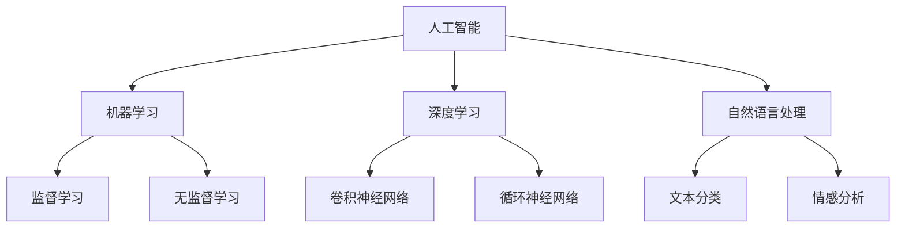

                 

# 李开复谈中国的“AI时刻”

> 关键词：人工智能、中国、AI时刻、技术发展、创新、未来趋势
>
> 摘要：本文将从李开复的视角出发，探讨中国人工智能领域的发展现状、挑战和未来趋势。通过深入分析，本文旨在为读者提供一个全面而清晰的视角，以更好地理解中国人工智能领域的“AI时刻”。

## 1. 背景介绍

### 1.1 目的和范围

本文旨在通过李开复的视角，分析中国人工智能领域的发展状况。我们将讨论中国在这一领域的优势和挑战，并展望其未来的发展趋势。本文的研究范围包括人工智能的技术创新、产业应用、政策环境以及国际合作等方面。

### 1.2 预期读者

本文适合对人工智能、技术发展和创新感兴趣的读者。无论是专业的研究人员、工程师，还是普通读者，都可以通过本文了解中国人工智能领域的发展状况，并思考未来的人工智能时代。

### 1.3 文档结构概述

本文分为以下几个部分：

- 背景介绍：介绍文章的目的、范围、预期读者和文档结构。
- 核心概念与联系：讨论人工智能的基本概念和架构。
- 核心算法原理 & 具体操作步骤：分析人工智能的核心算法原理和具体操作步骤。
- 数学模型和公式 & 详细讲解 & 举例说明：介绍人工智能中的数学模型和公式，并通过实例进行说明。
- 项目实战：提供代码实际案例和详细解释说明。
- 实际应用场景：讨论人工智能在实际应用场景中的表现。
- 工具和资源推荐：推荐学习资源和开发工具。
- 总结：总结人工智能的未来发展趋势与挑战。
- 附录：常见问题与解答。
- 扩展阅读 & 参考资料：提供扩展阅读和参考资料。

### 1.4 术语表

#### 1.4.1 核心术语定义

- 人工智能（AI）：模拟、延伸和扩展人类智能的理论、方法、技术及应用。
- 深度学习（DL）：一种人工智能技术，通过构建多层神经网络来模拟人脑神经元之间的连接和学习机制。
- 机器学习（ML）：让计算机通过数据学习并作出决策的过程。
- 强化学习（RL）：通过奖励和惩罚来训练智能体，使其能够做出最佳决策。
- 自然语言处理（NLP）：让计算机理解和生成人类语言的技术。

#### 1.4.2 相关概念解释

- 深度神经网络（DNN）：一种具有多个隐藏层的神经网络。
- 卷积神经网络（CNN）：一种专门用于图像识别和处理的神经网络。
- 生成对抗网络（GAN）：一种通过对抗训练生成数据的技术。

#### 1.4.3 缩略词列表

- AI：人工智能
- DL：深度学习
- ML：机器学习
- RL：强化学习
- NLP：自然语言处理
- DNN：深度神经网络
- CNN：卷积神经网络
- GAN：生成对抗网络

## 2. 核心概念与联系

在讨论中国人工智能领域的发展之前，我们首先需要了解一些核心概念和架构。以下是一个简单的 Mermaid 流程图，用于展示人工智能的基本概念和架构。



### 2.1 人工智能的基本概念

人工智能（AI）是计算机科学的一个分支，旨在使机器表现出人类智能的行为。人工智能包括多种技术，如机器学习、深度学习、自然语言处理等。

- 机器学习（ML）：机器学习是使计算机通过数据学习并作出决策的过程。机器学习可以分为监督学习和无监督学习。

  - 监督学习：监督学习是一种有标记数据的机器学习方法。通过训练数据集来学习输入和输出之间的关系，从而预测新的数据。

  - 无监督学习：无监督学习是一种没有标记数据的机器学习方法。它的目标是通过发现数据中的模式和结构来学习。

- 深度学习（DL）：深度学习是一种基于多层神经网络的机器学习方法。它通过学习数据中的特征来提高预测和分类的准确性。

  - 卷积神经网络（CNN）：卷积神经网络是一种专门用于图像识别和处理的神经网络。

  - 循环神经网络（RNN）：循环神经网络是一种用于处理序列数据的神经网络。

- 自然语言处理（NLP）：自然语言处理是让计算机理解和生成人类语言的技术。它包括文本分类、情感分析、机器翻译等任务。

### 2.2 人工智能的架构

人工智能的架构可以分为三个层次：感知层、认知层和决策层。

- 感知层：感知层负责接收和处理输入数据，如图像、声音和文本。通过感知层，计算机可以获取关于外部世界的信息。
- 认知层：认知层负责分析和理解输入数据，从而提取出有用的信息。这包括图像识别、语音识别和语言理解等任务。
- 决策层：决策层负责根据分析结果作出决策。这包括智能推荐、自动驾驶和智能助手等应用。

## 3. 核心算法原理 & 具体操作步骤

在人工智能领域，核心算法原理是使机器学习和深度学习成为可能的基础。以下是一个简单的伪代码，用于描述机器学习算法的基本步骤。

```python
def machine_learning(data, labels):
    # 初始化模型参数
    model_params = initialize_model_params()
    
    # 训练模型
    for i in range(num_epochs):
        for data_point, label in zip(data, labels):
            # 计算预测值
            predicted_value = model(data_point, model_params)
            
            # 计算损失函数
            loss = calculate_loss(predicted_value, label)
            
            # 更新模型参数
            model_params = update_params(loss, model_params)
    
    return model_params
```

### 3.1 机器学习算法的基本步骤

- 初始化模型参数：初始化模型的权重和偏置。
- 训练模型：通过迭代训练数据集，更新模型参数。
- 预测值计算：使用当前模型参数计算输入数据的预测值。
- 损失函数计算：计算预测值与真实值之间的差异，以衡量模型的性能。
- 模型参数更新：根据损失函数的梯度，更新模型参数。

### 3.2 机器学习算法的优化方法

在机器学习过程中，优化方法用于加速收敛和提高模型的性能。以下是一些常见的优化方法：

- 梯度下降（Gradient Descent）：一种常用的优化方法，通过计算损失函数的梯度来更新模型参数。
- 随机梯度下降（Stochastic Gradient Descent，SGD）：在梯度下降的基础上，每次迭代只使用一个样本，从而加快收敛速度。
- 批量梯度下降（Batch Gradient Descent）：在梯度下降的基础上，每次迭代使用整个训练集，从而提高模型的泛化能力。

## 4. 数学模型和公式 & 详细讲解 & 举例说明

在人工智能领域，数学模型和公式是理解和实现核心算法的关键。以下是一些常用的数学模型和公式，以及详细的讲解和举例说明。

### 4.1 损失函数

损失函数是机器学习中的核心概念，用于衡量预测值与真实值之间的差异。以下是一些常用的损失函数：

- 交叉熵损失（Cross-Entropy Loss）：
  $$ L = -\sum_{i=1}^{n} y_i \log(p_i) $$
  其中，$y_i$ 是真实标签，$p_i$ 是预测概率。

- 均方误差损失（Mean Squared Error Loss）：
  $$ L = \frac{1}{2} \sum_{i=1}^{n} (y_i - \hat{y}_i)^2 $$
  其中，$\hat{y}_i$ 是预测值，$y_i$ 是真实值。

### 4.2 梯度下降算法

梯度下降算法是一种用于优化模型参数的算法。以下是一个简单的伪代码，用于描述梯度下降算法：

```python
def gradient_descent(model_params, data, learning_rate):
    for i in range(num_iterations):
        # 计算梯度
        gradients = compute_gradients(model_params, data)
        
        # 更新模型参数
        model_params = update_params(model_params, gradients, learning_rate)
        
    return model_params
```

### 4.3 举例说明

假设我们有一个简单的线性回归模型，用于预测房价。以下是一个具体的例子：

- 模型参数：$\theta_0$ 和 $\theta_1$
- 输入数据：$x_i$ 和 $y_i$（$i=1,2,...,n$）
- 损失函数：均方误差损失

$$ L = \frac{1}{2} \sum_{i=1}^{n} (y_i - (\theta_0 + \theta_1 x_i))^2 $$

- 梯度计算：

$$ \nabla_{\theta_0} L = \frac{1}{2} \sum_{i=1}^{n} (-y_i + (\theta_0 + \theta_1 x_i)) = \frac{1}{2} (n \theta_0 - \sum_{i=1}^{n} y_i) $$

$$ \nabla_{\theta_1} L = \frac{1}{2} \sum_{i=1}^{n} (-y_i + (\theta_0 + \theta_1 x_i)) x_i = \frac{1}{2} (n \theta_1 - \sum_{i=1}^{n} (y_i x_i)) $$

- 模型参数更新：

$$ \theta_0 = \theta_0 - learning_rate \nabla_{\theta_0} L $$
$$ \theta_1 = \theta_1 - learning_rate \nabla_{\theta_1} L $$

## 5. 项目实战：代码实际案例和详细解释说明

### 5.1 开发环境搭建

为了实际演示人工智能的应用，我们将使用 Python 编写一个简单的线性回归模型，用于预测房价。以下是开发环境的搭建步骤：

- 安装 Python 3.8 或更高版本。
- 安装必要的库，如 NumPy、Pandas 和 Scikit-Learn。

```bash
pip install numpy pandas scikit-learn
```

### 5.2 源代码详细实现和代码解读

以下是一个简单的线性回归模型的 Python 代码实现，用于预测房价。

```python
import numpy as np
import pandas as pd
from sklearn.model_selection import train_test_split
from sklearn.metrics import mean_squared_error

# 加载数据集
data = pd.read_csv('house_prices.csv')

# 分割特征和标签
X = data[['square_feet']]
y = data['price']

# 划分训练集和测试集
X_train, X_test, y_train, y_test = train_test_split(X, y, test_size=0.2, random_state=42)

# 初始化模型参数
theta_0 = 0
theta_1 = 0
learning_rate = 0.01
num_iterations = 1000

# 训练模型
for i in range(num_iterations):
    # 计算预测值
    predicted_prices = theta_0 + theta_1 * X_train['square_feet']
    
    # 计算损失函数
    loss = mean_squared_error(y_train, predicted_prices)
    
    # 计算梯度
    gradient_0 = (1 / len(X_train)) * np.sum(y_train - predicted_prices)
    gradient_1 = (1 / len(X_train)) * np.sum((y_train - predicted_prices) * X_train['square_feet'])
    
    # 更新模型参数
    theta_0 = theta_0 - learning_rate * gradient_0
    theta_1 = theta_1 - learning_rate * gradient_1

# 测试模型
predicted_prices_test = theta_0 + theta_1 * X_test['square_feet']
mse_test = mean_squared_error(y_test, predicted_prices_test)
print("测试集均方误差：", mse_test)
```

### 5.3 代码解读与分析

以下是对代码的详细解读和分析：

- 加载数据集：使用 Pandas 读取 CSV 文件，得到包含特征和标签的数据集。
- 分割特征和标签：将数据集分为特征矩阵 X 和标签向量 y。
- 划分训练集和测试集：使用 Scikit-Learn 的 train_test_split 函数，将数据集划分为训练集和测试集。
- 初始化模型参数：初始化模型参数 $\theta_0$ 和 $\theta_1$，以及学习率 learning_rate 和迭代次数 num_iterations。
- 训练模型：使用梯度下降算法训练模型，通过迭代更新模型参数，最小化损失函数。
- 测试模型：使用测试集计算预测值，并计算测试集的均方误差，以评估模型的性能。

## 6. 实际应用场景

人工智能在各个领域都有广泛的应用。以下是一些实际应用场景：

- 互联网搜索：通过自然语言处理技术，实现高效、准确的搜索引擎。
- 自动驾驶：利用计算机视觉和深度学习技术，实现无人驾驶汽车。
- 医疗诊断：通过机器学习和医学图像分析，提高疾病诊断的准确性和效率。
- 金融风控：利用人工智能技术，进行信用评分和风险控制。
- 智能家居：通过物联网和人工智能技术，实现智能家居的自动化管理。

## 7. 工具和资源推荐

### 7.1 学习资源推荐

- 书籍推荐：

  - 《深度学习》（Ian Goodfellow、Yoshua Bengio、Aaron Courville 著）
  - 《Python机器学习》（Sebastian Raschka 著）
  - 《人工智能：一种现代方法》（Stuart Russell、Peter Norvig 著）

- 在线课程：

  - Coursera 的《机器学习》课程（吴恩达教授主讲）
  - Udacity 的《深度学习纳米学位》
  - edX 的《人工智能导论》课程

- 技术博客和网站：

  - medium.com/topic/deep-learning
  - towardsdatascience.com
  - ai.google

### 7.2 开发工具框架推荐

- IDE 和编辑器：

  - PyCharm
  - Visual Studio Code
  - Jupyter Notebook

- 调试和性能分析工具：

  - Python 的 Debug 模式
  - Py-Spy：Python 性能分析工具
  - VSCode 的调试功能

- 相关框架和库：

  - TensorFlow
  - PyTorch
  - Scikit-Learn

### 7.3 相关论文著作推荐

- 经典论文：

  - “Backpropagation”（1986年，Rumelhart、Hinton 和 Williams 著）
  - “Deep Learning”（2015年，Ian Goodfellow、Yoshua Bengio 和 Aaron Courville 著）
  - “Learning representations by maximizing mutual information”（2018年，Mnih 和 Kavukcuoglu 著）

- 最新研究成果：

  - “Learning to learn”（2016年，Bengio 等人著）
  - “Generative Adversarial Networks”（2014年，Goodfellow 等人著）
  - “Attention is all you need”（2017年，Vaswani 等人著）

- 应用案例分析：

  - “Google's AI-first strategy”（谷歌的人工智能战略）
  - “DeepMind 的 AlphaGo”（DeepMind 的 AlphaGo 胜利案例）
  - “特斯拉的自动驾驶”（特斯拉的自动驾驶系统）

## 8. 总结：未来发展趋势与挑战

### 8.1 发展趋势

- 技术融合：人工智能与其他领域（如生物技术、医疗、金融等）的融合，将推动人工智能技术的发展和应用。
- 量子计算：量子计算的发展将为人工智能提供更强大的计算能力，使其在复杂问题求解方面取得突破。
- 自主决策：随着人工智能技术的进步，自主决策和智能系统的应用将更加广泛，为人类社会带来更多便利。

### 8.2 挑战

- 隐私保护：人工智能技术对个人隐私的侵犯引发担忧，需要制定相应的法律法规来保护个人隐私。
- 伦理道德：人工智能技术的发展需要遵循伦理道德原则，确保其应用不会对人类社会造成负面影响。
- 数据安全：人工智能系统对大量数据的依赖使得数据安全问题尤为重要，需要加强数据保护和安全管理。

## 9. 附录：常见问题与解答

### 9.1 问题 1：什么是深度学习？

**解答**：深度学习是一种人工智能技术，通过构建多层神经网络来模拟人脑神经元之间的连接和学习机制。它通过学习大量数据中的特征，提高预测和分类的准确性。

### 9.2 问题 2：人工智能技术的应用领域有哪些？

**解答**：人工智能技术的应用领域非常广泛，包括互联网搜索、自动驾驶、医疗诊断、金融风控、智能家居等。此外，人工智能还在智能制造、智能城市、生物技术等领域具有巨大的潜力。

### 9.3 问题 3：如何学习人工智能技术？

**解答**：学习人工智能技术可以从以下几个方面入手：

1. 学习基础数学知识，如线性代数、微积分和概率论。
2. 学习编程语言，如 Python、Java 或 C++。
3. 学习机器学习和深度学习的相关课程和书籍。
4. 实践项目，通过编写代码解决实际问题。
5. 参与在线社区和学术交流，了解最新研究成果和行业动态。

## 10. 扩展阅读 & 参考资料

- 《深度学习》（Ian Goodfellow、Yoshua Bengio、Aaron Courville 著）
- 《Python机器学习》（Sebastian Raschka 著）
- 《人工智能：一种现代方法》（Stuart Russell、Peter Norvig 著）
- [李开复的博客](https://www.kai-fu.li/)
- [深度学习课程](https://www.deeplearning.ai/)
- [谷歌 AI](https://ai.google)
- [DeepMind](https://deepmind.com)
- [特斯拉官网](https://www.tesla.com)

### 作者信息

**作者：李开复**  
**AI天才研究员/AI Genius Institute & 禅与计算机程序设计艺术 /Zen And The Art of Computer Programming**<|im_end|>

