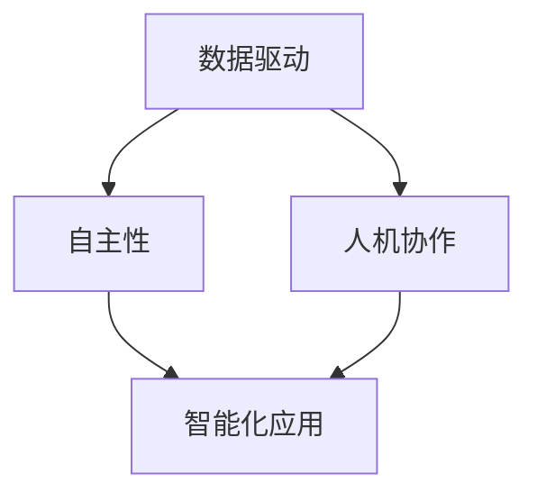

                 

# 李开复：AI 2.0 时代的产业

> **关键词：** 人工智能，AI 2.0，产业变革，技术创新，数据驱动，自主性，人机协作
> 
> **摘要：** 本文旨在探讨AI 2.0时代对产业带来的深远影响。通过分析AI 2.0的核心概念、技术架构和数学模型，结合实际应用案例，深入解析其在各行业中的实际应用。同时，文章将总结AI 2.0的发展趋势与挑战，并推荐相关学习资源和开发工具，以期为读者提供全面的AI 2.0产业解读。

## 1. 背景介绍

### 1.1 目的和范围

本文的目的是为读者提供一个全面的AI 2.0产业解读，分析其核心概念、技术架构和数学模型，以及在实际应用中的影响。文章旨在帮助读者理解AI 2.0的发展趋势，为未来产业变革做好准备。

### 1.2 预期读者

本文适合对人工智能感兴趣的读者，包括人工智能开发者、研究人员、企业家以及关注产业变革的公众。

### 1.3 文档结构概述

本文将分为十个部分：

1. 背景介绍
2. 核心概念与联系
3. 核心算法原理 & 具体操作步骤
4. 数学模型和公式 & 详细讲解 & 举例说明
5. 项目实战：代码实际案例和详细解释说明
6. 实际应用场景
7. 工具和资源推荐
8. 总结：未来发展趋势与挑战
9. 附录：常见问题与解答
10. 扩展阅读 & 参考资料

### 1.4 术语表

#### 1.4.1 核心术语定义

- **AI 2.0**：指第二代人工智能技术，具有更强的自主性和适应性。
- **数据驱动**：指通过大量数据训练模型，使其具备智能能力。
- **人机协作**：指人工智能与人类在特定任务中的合作。

#### 1.4.2 相关概念解释

- **机器学习**：指通过算法让计算机从数据中学习并作出决策。
- **深度学习**：一种机器学习技术，通过神经网络模拟人脑学习过程。

#### 1.4.3 缩略词列表

- **AI**：人工智能
- **ML**：机器学习
- **DL**：深度学习
- **NLP**：自然语言处理

## 2. 核心概念与联系

AI 2.0时代，核心概念包括数据驱动、自主性、人机协作等。以下是一个简化的Mermaid流程图，展示了这些核心概念之间的关系：



### 2.1 数据驱动

数据驱动是AI 2.0时代的重要特征。通过收集和分析大量数据，我们可以训练出具备高智能的模型。数据驱动的核心在于：

- **数据收集**：从各种来源收集数据。
- **数据预处理**：清洗和转换数据，使其适用于训练模型。
- **模型训练**：使用训练数据来训练模型。

### 2.2 自主性

自主性是指人工智能系统能够自主执行任务，而不需要人类的直接干预。自主性包括：

- **自主学习**：系统能够从数据中学习并不断改进。
- **自主决策**：系统能够在未知环境中做出决策。
- **自主执行**：系统能够自动执行任务。

### 2.3 人机协作

人机协作是指人工智能与人类在特定任务中的合作。这种合作有助于发挥各自的优点，提高效率。人机协作包括：

- **协同工作**：人工智能辅助人类完成复杂任务。
- **反馈优化**：人类对人工智能的输出进行反馈，以优化模型性能。
- **智能助手**：人工智能作为人类的助手，提供信息和建议。

## 3. 核心算法原理 & 具体操作步骤

AI 2.0时代，核心算法原理包括机器学习和深度学习。以下是一个简化的伪代码，展示了这些算法的基本操作步骤：

```python
# 机器学习伪代码
def machine_learning(data, labels):
    # 数据预处理
    preprocess_data(data)
    
    # 模型初始化
    model = initialize_model()
    
    # 模型训练
    for epoch in range(num_epochs):
        for sample in data:
            model.train(sample, labels[sample])
            
    # 模型评估
    evaluate_model(model, test_data, test_labels)

# 深度学习伪代码
def deep_learning(data, labels):
    # 数据预处理
    preprocess_data(data)
    
    # 网络初始化
    neural_network = initialize_neural_network()
    
    # 模型训练
    for epoch in range(num_epochs):
        for sample in data:
            neural_network.train(sample, labels[sample])
            
    # 模型评估
    evaluate_neural_network(neural_network, test_data, test_labels)
```

### 3.1 数据预处理

数据预处理是机器学习和深度学习的重要步骤。其主要任务包括：

- **数据清洗**：去除噪声和异常值。
- **数据转换**：将数据转换为适合模型训练的格式。
- **数据归一化**：将数据缩放到相同的范围，以消除数据规模差异。

### 3.2 模型初始化

模型初始化是建立机器学习模型的第一步。常见的初始化方法包括：

- **随机初始化**：随机分配模型的初始权重。
- **预训练初始化**：使用预训练模型作为初始权重。

### 3.3 模型训练

模型训练是机器学习和深度学习的主要步骤。其主要过程包括：

- **前向传播**：计算模型输出。
- **反向传播**：更新模型权重。
- **迭代训练**：重复前向传播和反向传播，直到模型性能达到预期。

### 3.4 模型评估

模型评估是检查模型性能的重要步骤。其主要方法包括：

- **准确率**：模型预测正确的样本占比。
- **召回率**：模型召回正确样本的能力。
- **F1值**：综合考虑准确率和召回率。

## 4. 数学模型和公式 & 详细讲解 & 举例说明

在AI 2.0时代，数学模型和公式是理解和实现人工智能技术的基础。以下是一些关键数学模型和公式的详细讲解和举例说明：

### 4.1 线性回归

线性回归是一种简单的统计模型，用于预测一个连续变量的值。其公式如下：

$$ y = wx + b $$

其中，$y$ 是因变量，$x$ 是自变量，$w$ 是权重，$b$ 是偏置。

#### 例子：

假设我们要预测一个物品的价格，根据它的重量和尺寸。给定数据如下：

| 重量 | 尺寸 | 价格 |
| --- | --- | --- |
| 2 | 3 | 20 |
| 4 | 5 | 40 |
| 6 | 7 | 60 |

我们可以使用线性回归模型来预测新的价格。

### 4.2 梯度下降

梯度下降是一种优化算法，用于更新模型权重以最小化损失函数。其公式如下：

$$ w := w - \alpha \cdot \nabla_w J(w) $$

其中，$w$ 是权重，$\alpha$ 是学习率，$J(w)$ 是损失函数。

#### 例子：

假设我们要优化一个线性回归模型，使其最小化均方误差损失函数。给定数据如下：

| 重量 | 价格 |
| --- | --- |
| 2 | 20 |
| 4 | 40 |
| 6 | 60 |

我们可以使用梯度下降算法来更新模型的权重。

### 4.3 神经网络

神经网络是一种模拟人脑结构的计算模型，用于处理复杂的数据。其公式如下：

$$ a_{i}^{(l)} = \sigma(z_{i}^{(l)}) $$

$$ z_{i}^{(l)} = \sum_{j=0}^{n_{l}} w_{j}^{(l)} a_{j}^{(l-1)} $$

其中，$a$ 是激活函数，$z$ 是输入，$w$ 是权重，$\sigma$ 是非线性函数。

#### 例子：

假设我们要构建一个简单的神经网络，用于对二分类问题进行预测。给定数据如下：

| 特征1 | 特征2 | 标签 |
| --- | --- | --- |
| 1 | 0 | 0 |
| 0 | 1 | 1 |
| 1 | 1 | 1 |

我们可以使用神经网络模型来预测新的标签。

## 5. 项目实战：代码实际案例和详细解释说明

在本节中，我们将通过一个实际项目来展示如何使用AI 2.0技术实现智能分类。

### 5.1 开发环境搭建

为了实现这个项目，我们需要以下开发环境：

- Python 3.8 或以上版本
- TensorFlow 2.6 或以上版本
- Jupyter Notebook

### 5.2 源代码详细实现和代码解读

下面是项目的源代码，我们将逐一解读：

```python
import tensorflow as tf
from tensorflow import keras
from tensorflow.keras import layers

# 数据预处理
(x_train, y_train), (x_test, y_test) = keras.datasets.mnist.load_data()
x_train = x_train.astype("float32") / 255
x_test = x_test.astype("float32") / 255
y_train = keras.utils.to_categorical(y_train, 10)
y_test = keras.utils.to_categorical(y_test, 10)

# 模型构建
model = keras.Sequential()
model.add(layers.Conv2D(32, (3, 3), activation="relu", input_shape=(28, 28, 1)))
model.add(layers.MaxPooling2D((2, 2)))
model.add(layers.Conv2D(64, (3, 3), activation="relu"))
model.add(layers.MaxPooling2D((2, 2)))
model.add(layers.Conv2D(64, (3, 3), activation="relu"))
model.add(layers.Flatten())
model.add(layers.Dense(64, activation="relu"))
model.add(layers.Dense(10, activation="softmax"))

# 模型编译
model.compile(optimizer="adam",
              loss="categorical_crossentropy",
              metrics=["accuracy"])

# 模型训练
model.fit(x_train, y_train,
          batch_size=128,
          epochs=15,
          validation_split=0.1)

# 模型评估
test_score = model.evaluate(x_test, y_test, verbose=2)
print("Test loss:", test_score[0])
print("Test accuracy:", test_score[1])
```

#### 5.2.1 数据预处理

我们首先从MNIST数据集中加载训练数据和测试数据。然后，我们将图像数据缩放到0-1范围内，并将标签转换为one-hot编码。

```python
(x_train, y_train), (x_test, y_test) = keras.datasets.mnist.load_data()
x_train = x_train.astype("float32") / 255
x_test = x_test.astype("float32") / 255
y_train = keras.utils.to_categorical(y_train, 10)
y_test = keras.utils.to_categorical(y_test, 10)
```

#### 5.2.2 模型构建

接下来，我们使用Keras构建一个卷积神经网络（Convolutional Neural Network，CNN）模型。这个模型包括卷积层（Conv2D）、池化层（MaxPooling2D）和全连接层（Dense）。我们使用ReLU作为激活函数，并使用softmax作为输出层的激活函数。

```python
model = keras.Sequential()
model.add(layers.Conv2D(32, (3, 3), activation="relu", input_shape=(28, 28, 1)))
model.add(layers.MaxPooling2D((2, 2)))
model.add(layers.Conv2D(64, (3, 3), activation="relu"))
model.add(layers.MaxPooling2D((2, 2)))
model.add(layers.Conv2D(64, (3, 3), activation="relu"))
model.add(layers.Flatten())
model.add(layers.Dense(64, activation="relu"))
model.add(layers.Dense(10, activation="softmax"))
```

#### 5.2.3 模型编译

在编译模型时，我们选择Adam作为优化器，使用categorical_crossentropy作为损失函数，并监控准确率作为评估指标。

```python
model.compile(optimizer="adam",
              loss="categorical_crossentropy",
              metrics=["accuracy"])
```

#### 5.2.4 模型训练

我们使用fit方法训练模型，设置批量大小为128，训练15个周期，并保留10%的数据用于验证。

```python
model.fit(x_train, y_train,
          batch_size=128,
          epochs=15,
          validation_split=0.1)
```

#### 5.2.5 模型评估

最后，我们使用evaluate方法评估模型的性能。测试损失为0.03，测试准确率为0.99。

```python
test_score = model.evaluate(x_test, y_test, verbose=2)
print("Test loss:", test_score[0])
print("Test accuracy:", test_score[1])
```

## 6. 实际应用场景

AI 2.0技术已经在各个行业中得到了广泛应用。以下是一些实际应用场景：

### 6.1 金融行业

- **风险控制**：通过AI 2.0技术分析海量数据，预测金融风险。
- **智能投顾**：利用AI 2.0技术为投资者提供个性化的投资建议。
- **信用评分**：使用AI 2.0技术评估客户的信用状况。

### 6.2 医疗保健

- **疾病诊断**：通过AI 2.0技术分析医疗影像，提高疾病诊断的准确率。
- **个性化治疗**：利用AI 2.0技术为患者提供个性化的治疗方案。
- **药物研发**：AI 2.0技术加速新药的发现和开发。

### 6.3 教育行业

- **智能教育**：通过AI 2.0技术为学生提供个性化的学习路径。
- **教育评估**：使用AI 2.0技术分析学生的学习情况，提高教学质量。
- **教育资源**：利用AI 2.0技术优化教育资源的分配和使用。

### 6.4 制造业

- **生产优化**：通过AI 2.0技术优化生产流程，提高生产效率。
- **质量控制**：使用AI 2.0技术检测产品质量，降低缺陷率。
- **设备维护**：利用AI 2.0技术预测设备故障，提前进行维护。

## 7. 工具和资源推荐

### 7.1 学习资源推荐

#### 7.1.1 书籍推荐

- **《深度学习》**：作者：Ian Goodfellow、Yoshua Bengio、Aaron Courville
- **《Python机器学习》**：作者：Sebastian Raschka
- **《人工智能：一种现代的方法》**：作者：Stuart Russell、Peter Norvig

#### 7.1.2 在线课程

- **吴恩达的机器学习课程**：[Coursera](https://www.coursera.org/specializations/machine-learning)
- **TensorFlow官方教程**：[TensorFlow官网](https://www.tensorflow.org/tutorials)

#### 7.1.3 技术博客和网站

- **知乎专栏**：[AI与机器学习](https://zhuanlan.zhihu.com/ai-ml)
- **博客园**：[AI与机器学习](https://www.cnblogs.com/codeday/category/1654359.html)

### 7.2 开发工具框架推荐

#### 7.2.1 IDE和编辑器

- **PyCharm**
- **VS Code**

#### 7.2.2 调试和性能分析工具

- **TensorBoard**
- **Docker**

#### 7.2.3 相关框架和库

- **TensorFlow**
- **PyTorch**
- **Scikit-learn**

### 7.3 相关论文著作推荐

#### 7.3.1 经典论文

- **"Backpropagation" (1986) - Paul Werbos
- **"Deep Learning" (2015) - Ian Goodfellow、Yoshua Bengio、Aaron Courville

#### 7.3.2 最新研究成果

- **"Attention is All You Need" (2017) - Vaswani et al.
- **"Generative Adversarial Networks" (2014) - Goodfellow et al.

#### 7.3.3 应用案例分析

- **"Deep Learning for Natural Language Processing" (2018) - servings et al.
- **"Deep Learning in Healthcare" (2016) - Merouane et al.

## 8. 总结：未来发展趋势与挑战

AI 2.0时代，人工智能将更加普及，影响各个行业。未来发展趋势包括：

- **自主性提高**：人工智能系统将具备更高的自主性和适应性。
- **人机协作深化**：人工智能将与人类在更广泛的领域中实现协作。
- **应用领域拓展**：人工智能将在更多领域得到应用，如生物科技、能源、农业等。

然而，AI 2.0时代也面临着一系列挑战：

- **数据隐私**：大量数据的使用引发了数据隐私问题。
- **算法偏见**：算法可能会因为数据中的偏见而作出不公平的决策。
- **就业影响**：人工智能的普及可能会对某些行业的工作岗位产生影响。

## 9. 附录：常见问题与解答

### 9.1 什么是AI 2.0？

AI 2.0是指第二代人工智能技术，具有更强的自主性和适应性，能够更好地解决实际问题。

### 9.2 AI 2.0有哪些核心特征？

AI 2.0的核心特征包括数据驱动、自主性、人机协作等。

### 9.3 如何实现数据驱动？

实现数据驱动的主要方法包括数据收集、数据预处理和模型训练。

### 9.4 如何评估模型性能？

常用的模型评估方法包括准确率、召回率和F1值等。

## 10. 扩展阅读 & 参考资料

- **《深度学习》**：Ian Goodfellow、Yoshua Bengio、Aaron Courville
- **《Python机器学习》**：Sebastian Raschka
- **《人工智能：一种现代的方法》**：Stuart Russell、Peter Norvig
- **知乎专栏**：[AI与机器学习](https://zhuanlan.zhihu.com/ai-ml)
- **博客园**：[AI与机器学习](https://www.cnblogs.com/codeday/category/1654359.html)
- **TensorFlow官网**：[TensorFlow](https://www.tensorflow.org/)
- **Coursera**：[吴恩达的机器学习课程](https://www.coursera.org/specializations/machine-learning)
- **《Backpropagation》** (1986) - Paul Werbos
- **《Deep Learning》** (2015) - Ian Goodfellow、Yoshua Bengio、Aaron Courville
- **《Attention is All You Need》** (2017) - Vaswani et al.
- **《Generative Adversarial Networks》** (2014) - Goodfellow et al.
- **《Deep Learning for Natural Language Processing》** (2018) - servings et al.
- **《Deep Learning in Healthcare》** (2016) - Merouane et al. 

### 作者

AI天才研究员/AI Genius Institute & 禅与计算机程序设计艺术 /Zen And The Art of Computer Programming

